# Capacity: database growth, disk, load and memory

How big the database and the files get, how much load each component takes, and how much memory Django,
the Celery workers and Redis need. For developers and whoever runs the platform. Measured on **30 September
2026** in the devcontainer; rerun the measurements ([Measuring again](#measuring-again)) after a large
change and at least once a year, and the production-safe part on production itself
([Load testing production](#load-testing-production)). Versions and updates are in
[`MAINTENANCE.md`](MAINTENANCE.md); open technical questions for Level27 are in
[`LEVEL27_QUESTIONS.md`](LEVEL27_QUESTIONS.md); the design of the workers is in
[`DATA_MODEL.md`](DATA_MODEL.md) §11. The charts come from `loadtest/charts.py`, the figures behind them
from `loadtest/results/`.

**In short:**

- **The database grows by about 350 MB a year** at 100 dojos and 6,000 families (1.6 GB after five
  years). Two thirds of that is the mail log. Since 3 October 2026 a mail's text is cleared 12 months after
  it was sent, as the privacy register promises: about a quarter less after five years (the last column below).
- **Uploads are guarded since 30 September 2026:** at most 10 MB (and 40 megapixels for an image),
  images made smaller and stripped of every piece of metadata (a phone photo's GPS position, for one),
  replaced files deleted, and the background-check document only as PDF, JPEG or PNG. Production's proxy
  still needs the same 12 MB body limit as the devcontainer.
- **The whole application needs about 1.5 GB of memory at its peak** with 4 web workers: 750 MB web,
  650 MB Celery (during the nightly rebuild) and under 50 MB Redis. Plan **2 GB** for the account.
- **Two problems showed up under load, both fixed on 30 September 2026:**
  1. Signing up at the same moment **overbooked sessions** (25 confirmed places on a session of 22):
     sign-ups for a session now go one at a time.
  2. **Every request in progress holds its own database connection**, so a rush used up MySQL's 151
     connections and a fifth of the requests failed. Each web worker now takes at most 25 requests at once
     (`gunicorn.conf.py`); the overflow gets a quick "busy" answer instead of an error, and MySQL stays
     far below its limit.
- **Caching since 1 October 2026:** the public pages read their content from Redis and a logged-in page
  no longer looks up the account's roles and dojos on every request. A request now costs MySQL **a third
  fewer statements** (24.6 to 16.2), the public pages 1 query instead of 8 to 24, and with 2 web workers
  under 300 users the 95th percentile halved (410 to 210 ms) and the errors went away
  ([Caching](#caching)).

---

## Contents

1. [How it was measured](#how-it-was-measured)
2. [Database growth](#database-growth)
3. [Disk: files and uploads](#disk-files-and-uploads)
4. [Memory per component](#memory-per-component)
5. [Load: web requests](#load-web-requests)
6. [Capping requests per web worker](#capping-requests-per-web-worker)
7. [Caching](#caching)
8. [Load: Celery workers and mail](#load-celery-workers-and-mail)
9. [Redis](#redis)
10. [Findings and what to do](#findings-and-what-to-do)
11. [Watching production](#watching-production)
12. [Load testing production](#load-testing-production)
13. [Questions for Level27](#questions-for-level27)
14. [Measuring again](#measuring-again)

---

## How it was measured

- **A database at scale.** `manage.py seed_scale --scenario growth` filled a separate database
  (`test_capacity`) with one year of the *growth* scenario below: 100 dojos with their teams, 7,800
  guardian accounts, 9,000 children, 1,400 sessions, 29,400 bookings, 189,000 mails rendered from the real
  templates, 115,000 audit log entries, consents, badges, belts and the engagement snapshot. It took 53
  seconds and peaked at 409 MB.
- **Bytes per row** come from that database (`capacity_report --measure`, stored in
  `monitoring/row_sizes.json`); **rows per year** come from how the site works: which actions write which
  rows (`monitoring/capacity.py`, `GROWTH`).
- **A production-like run** on that database: `DEBUG` and django-silk off, gunicorn with uvicorn workers
  (production's command, with `gunicorn.conf.py`) and the two Celery workers with production's options, all
  on Redis databases of their own, so the dev site wasn't touched.
- **Load** from [Locust](https://locust.io) (`loadtest/`): visitors, families that log in and book, and dojo
  teams taking attendance, plus a registration rush. From the cap tests on, each request came on a new
  connection, as it does behind a proxy (`LOADTEST_CLOSE=1`, see [the cap](#capping-requests-per-web-worker)).
- **Memory** is **PSS** (proportional set size), from `/proc/<pid>/smaps_rollup`. RSS counts the memory
  that forked processes share once per process, so adding up RSS overstates the total by a lot (a Celery
  worker's parent and child both show about 205 and 145 MB RSS, but share most of it).
- **Limits of the test:** the devcontainer has 20 cores and plenty of memory, and the load generator runs
  on the same machine. Response times on Level27 will differ; the memory figures and the ratios between
  runs carry over. That's why the production-safe part can be run on production itself.

## Database growth

Three scenarios, a year's volumes each (`monitoring/capacity.py`, `SCENARIOS`; change them when real
figures are known):

| Scenario | Dojos | Families | Sessions | Bookings | Mails |
|---|---:|---:|---:|---:|---:|
| `today` | 60 | 3,000 | 600 | 9,000 | 86,000 |
| `growth` | 100 | 6,000 | 1,200 | 24,000 | 189,000 |
| `stretch` | 150 | 12,000 | 3,000 | 75,000 | 451,000 |

Mail per family per year: confirmations and reminders per booking to each guardian (about 1.3 per
child), plus 6 new-sessions digests, 6 organisation campaigns, 6 dojo mailings, a journey and account mail.

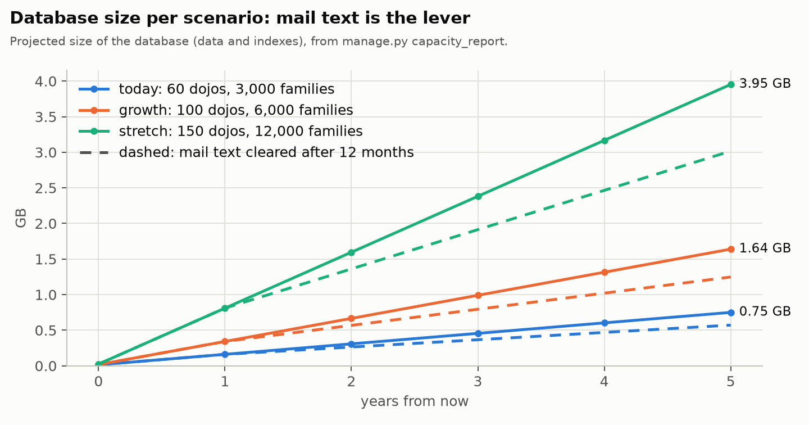

| Scenario | After 1 year | After 3 years | After 5 years | 5 years, mail text cleared after 12 months |
|---|---:|---:|---:|---:|
| `today` | 165 MB | 467 MB | 768 MB | 585 MB |
| `growth` | 350 MB | 1.0 GB | 1.64 GB | 1.25 GB |
| `stretch` | 829 MB | 2.38 GB | 3.95 GB | 3.02 GB |

**Where it goes** (growth scenario, after 5 years): mail log 1.15 GB (70%), audit log 289 MB (18%),
engagement changes 52 MB, bookings with their pathways 54 MB, badges 24 MB, consents 13 MB; everything
else is small. **Measured bytes per row:**

| Table | Bytes per row | What makes a row |
|---|---:|---|
| `mailing_emailmessage` | 1,303 | every mail: its subject and body (557 bytes with the current templates), address, keys, 6 indexes |
| `django_session` | 981 | a login session (bounded: expired ones are removed daily) |
| `auditlog_logentry` | 525 | every recorded change (a booking, an attendance mark, a new account, ...) |
| `accounts_user` | 519 | an account |
| `events_ninjabadge` | 366 | an awarded badge |
| `events_ninjaengagement` | 281 | a child's snapshot at a dojo (rebuilt nightly, bounded) |
| `events_event` | 281 | a session (more with long descriptions and translations) |
| `accounts_ninja` | 242 | a child |
| `events_registration` | 232 | a booking |
| `mailing_consentevent` | 191 | a consent change |
| the many-to-many links | 140–165 | a session's team and pathways, a booking's pathways |

Worth knowing:

- **Mail text is the lever.** The growth scenario's 36,000 campaign mails a year, at 3 KB of text instead
  of the seeded templates' 0.5 KB, add about 90 MB a year. The privacy register's `mail_content` rule
  ("subject, body and address cleared after 12 months") is applied by the nightly retention job since 3
  October 2026 (`privacy.retention.clear_old_mail_content`), the single biggest saving. InnoDB only gives
  the space back to the disk after `OPTIMIZE TABLE` on that table (it reuses it for new rows either way).
- **Compressing the mail table instead** was measured too (3 October 2026, 63,800 mails cloned from the
  seeded ones): `ROW_FORMAT=COMPRESSED` with 8 KB pages halves it (45.6 to 21.8 MB; 4 KB pages: 11.7 MB),
  because mails from one template compress well together, but updates got about 12 times slower (this
  table is also the mail queue), it costs buffer-pool memory, and MySQL discourages the format. Not worth
  it at these sizes; if it ever is, move the body to a write-once table of its own and compress only that.
- **Nothing is deleted when accounts age out:** accounts, children and bookings are anonymised, not
  removed, so those tables only grow. The audit log is the exception: an erased account's entries go.

## Disk: files and uploads

**Everything on the server's disk**, growth scenario:

| What | Where | Size | Grows with |
|---|---|---:|---|
| Database | MySQL (Level27) | 350 MB after a year, 1.6 GB after five | mail, the audit log, bookings ([above](#database-growth)) |
| MySQL binary logs | MySQL (Level27) | tens of MB | 30 days of changes by default; more while a campaign is queued |
| Database backups | Level27 | the database × the backups kept | to confirm ([Questions](#questions-for-level27)) |
| Uploaded images | `media/` | **about 70 MB a year** | banners and icons teams upload, made smaller when saved (below) |
| Standard images | `media/library/` | a few MB | copied once, the first time a row uses one; shared by every row after that |
| Background-check documents | `private_media/` | only the ones awaiting review, 10 MB each at most | deleted at the reviewer's decision |
| The code | `~/app` and `~/deploy/releases/` (5 kept) | 7 MB per release | each deploy; the user-journey PDFs and the load test aren't shipped (they were 46 MB a release) |
| Python packages | `~/.pyenv/versions/py10102-3.14.7` | 236 MB | a dependency upgrade |
| Celery's logs | `~/logs/worker-<id>/` (Level27's worker component) | small | the periodic worker logs at WARNING; at INFO its 10-second mail dispatcher alone wrote about 6 MB a day |

**Where people can upload files:**

| Upload | Who | Stored | Kept at most |
|---|---|---|---|
| Dojo icon | the dojo's champion and mentors (Settings) | `media/dojos/`, public | 512 px; or a standard icon, linked, not copied |
| Session banner | the dojo's team (Events) | `media/events/`, public | 1600 px; or a standard banner |
| Promotion image, sponsor logo | the organisation (dashboard) | `media/`, public | 1600 px, 800 px |
| Badge icon | the organisation (Awards) | `media/awards/`, public | 512 px; never an SVG (it could carry script); or a standard icon |
| Background-check document | the volunteer (emailed link, no login) | `private_media/`, never public | PDF, JPEG or PNG, 10 MB; deleted at the decision |
| Child and team photos, pathway images, belt icons | only in the Django admin | `media/`, public | 512 px (photos, icons), 1600 px (pathways) |

Families never upload anything: a child's picture is one of the standard avatars.

**The guardrails** (`core/uploads.py`, since 30 September 2026):

1. **A size limit on the proxy:** `client_max_body_size 12m` in the devcontainer's nginx
   (`.devcontainer/nginx/nginx.conf`), a little above the site's own limit, so a file between the two gets
   the site's message and anything bigger never reaches Django. **Production's proxy needs the same**
   (Level27's, [Questions](#questions-for-level27)).
2. **A size and type check in the site**, also in the Django admin: an image at most 10 MB and 40
   megapixels, and a real raster image (Pillow opens it; an SVG is refused); the background-check document
   at most 10 MB, and a PDF, JPEG or PNG by its first bytes, whatever its name says. The forms say so under
   the field, in the visitor's language.
3. **Every uploaded image is made smaller and re-encoded when it's saved** (`UploadedImageField`): at most
   the size in the table above, as JPEG (quality 85), or PNG when it has transparency. A JPEG is decoded
   straight at a reduced scale, so even a 40-megapixel photo never takes its full size in memory.
4. **No metadata survives:** the file is rebuilt from its pixels alone, so EXIF (camera, date, GPS
   position), XMP, comments, PNG text chunks and colour profiles are all left out. The photo's orientation
   and colour profile are applied to the pixels first, so it doesn't turn sideways or change colour.
   (The background-check document is kept as it was uploaded: it's a legal document, private, and deleted
   at the decision.)
5. **A replaced or orphaned image is deleted:** replacing an icon or banner, or deleting its dojo, session,
   badge, ..., deletes the old file once the change is committed, unless it's a standard image or another
   row still uses it. An erased person's photo was already deleted by the erasure (`privacy.erasure`).
6. **Quieter logs:** the periodic Celery worker logs at WARNING in production
   (its command in Level27's worker component *celery*); failures and the mail queue's warnings still
   show. The devcontainer keeps INFO.

**Tried on 30 September 2026**, before and after:

| Upload | Before | Now |
|---|---|---|
| A 14 MB photo (4000 × 3000) | stored as it was, 14 MB, with its EXIF | refused: over 10 MB |
| A 5 MB phone photo with GPS in its EXIF | stored as it was | 512 px (a dojo icon) or 1600 px (a banner), a few hundred KB, no metadata |
| A 144-megapixel image (a 0.4 MB file) | accepted: every visitor's browser decodes 144 megapixels | refused: over 40 megapixels |
| A 400-megapixel image | refused by Pillow's decompression-bomb check | refused |
| A 30 MB `.exe` as background-check document | accepted | refused: not a PDF, JPEG or PNG |

**Estimate** for session banners (growth scenario, 1,200 sessions a year): if one in five gets its own
photo instead of a standard banner, 240 photos a year. At a few hundred KB each once made smaller, that's
**about 70 MB a year**; stored as uploaded, it would have been 0.8 GB. Dojo icons, promotions, sponsors and
badges add a few MB.

Files uploaded before 30 September 2026 stay as they were until they're replaced; the site only holds
seeded demo data so far, so there's nothing to convert.

## Memory per component

Which functions the memory goes to, and which are worth refactoring, is in
[`MEMORY_PROFILE.md`](MEMORY_PROFILE.md). The nightly engagement rebuild below is the largest by far; its
reading of the bookings was refactored on 3 October 2026, after these figures (the rebuild's own peak went
from 132 to 35 MB), so the mailing worker's peak should now be lower: measure again.

PSS in MB, production-like (`DEBUG` off). *Idle* is after start-up and a few requests; *peak* is the
highest seen in any test.

| Component | Processes | Idle | Peak | Peak when |
|---|---|---:|---:|---|
| gunicorn master | 1 | 18 | 18 | |
| Web worker (uvicorn) | 1 per `WEB_CONCURRENCY` | 110–135 each | 180–290 each | 300 users; each worker grows while it serves several requests at once |
| — 2 web workers, total | 3 | 265 | 650 | registration rush, 500 users |
| — 4 web workers, total | 5 | 460 | 750 | 300 users; 855 in a 500-family rush without the cap, 700 with it |
| Celery `periodic` (parent, pool child, beat) | 3 | 255 | 255 | its jobs are short |
| Celery `mailing` (parent, pool child) | 2 | 160 | 385 | nightly engagement rebuild (child at 300 MB RSS, then replaced) |
| Redis (all three uses) | 1 | 3 | 5 | load tests on top of the dev data |
| Open notification WebSockets | | | +15 for 400 | about 40 KB each |

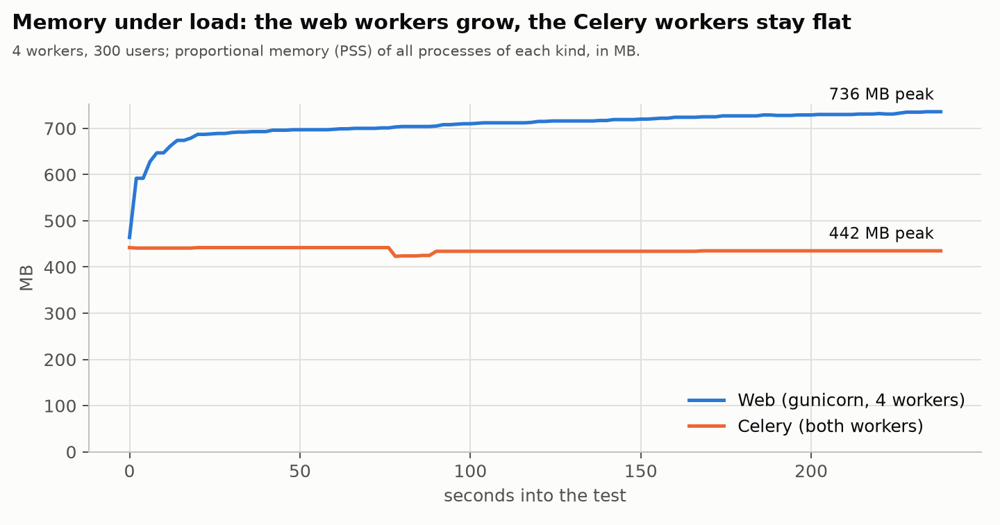

**Budget:** 750 MB web (4 workers) + 650 MB Celery + 50 MB Redis ≈ **1.45 GB at peak**, 0.9 GB idle.
Plan **2 GB** for the account. With 2 web workers: about 1.3 GB at peak, but see the load results below.
MySQL isn't in this budget: on Level27 it runs separately (to confirm, see
[Questions for Level27](#questions-for-level27)).

**Celery's per-child limit.** This section's measurements used `--max-memory-per-child 200000` (200 MB,
compared with the child's peak RSS after each task). **Production's actual worker component commands use
`--max-memory-per-child 160000`** (156 MB; confirmed 8 Oct 2026 by reading the commands Level27 runs,
`~/.worker/*`) — lower than what was measured here, not 200 MB. An idle child sits at 143–148 MB RSS, so
against the real 160 MB limit there's only about 12–17 MB of room, not the 50 MB this page assumed. The
nightly engagement rebuild takes the mailing child to 300 MB (4.9 seconds for 9,000 children), which is
well past 160 MB too; Celery's limit is only checked *after* a task finishes (it replaces the child then,
not mid-task), so this isn't a crash risk, but the 200 MB this page measured against is not the number
production runs with — reconcile the two (either raise the panel's commands to 200 MB+, or re-measure
against 160 MB) rather than trusting this page's "50 MB of room" figure. (Measured before 3 October 2026,
when the rebuild stopped making a copy of each session and dojo per booking: about 100 MB less at its
peak, [`MEMORY_PROFILE.md`](MEMORY_PROFILE.md).) A campaign launch stays at 160 MB (the audience is queued
in chunks) — already at the production limit. The periodic worker's child never came near either limit.
Watch for "exceeded memory limit" in the worker log after every task, which would mean the baseline has
grown.

## Load: web requests

A mixed load: 6 visitors to 3 families to 1 dojo team member, each waiting 2 to 8 seconds between
clicks. Times in milliseconds.

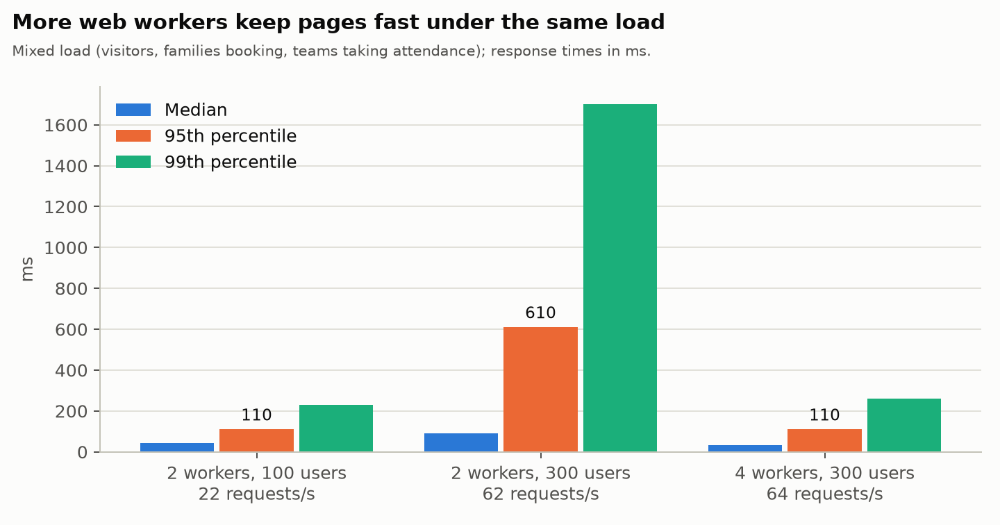

| Run | Web workers | Users | Requests/s | Median | p95 | p99 | Errors |
|---|---:|---:|---:|---:|---:|---:|---:|
| A | 2 | 100 | 21.6 | 42 | 110 | 230 | 0 |
| B | 2 | 300 | 62.3 | 92 | 610 | 1,700 | 14 (0.1%) |
| D | 4 | 300 | 64.5 | 33 | 110 | 260 | 2 |
| C, rush | 2 | 500 families booking 5 sessions | 127 | 460 | 4,400 | 5,700 | **6,337 (42%)** |

- **The number of web workers is what matters.** At the same load, 4 workers keep the 95th percentile at
  110 ms where 2 workers let it climb to 610 ms (the home page's p99 to 2.4 s). The slowest pages under
  load are the home page (two widgets), the events list and a dojo's dashboard.
- **CPU per page** (3 October 2026, 4 workers, the public pages at 57 requests/s, measured from
  `/proc/<pid>/stat`): about **27 ms of CPU in the web workers and 2 ms in MySQL per request**, so 1.6 cores
  busy and roughly 35 pages a second per core on this machine. A worker uses one core at most (Python),
  whatever its thread count, so `WEB_CONCURRENCY` above the account's cores only costs memory. `/metrics/`
  doesn't measure CPU: on production it's the hosting panel's figure (help centre, *CPU, memory and disk*).
- **Logging in takes 250–350 ms**: the password hash is deliberately slow and uses the CPU for that time.
- The few errors in runs B and D are connections that uvicorn closed (after gunicorn's 2-second keep-alive)
  just as the load tool reused them. A browser behind a proxy retries those, so they're an artefact of the test.
- **Rush C failed**, for the two reasons in the next section and in finding 1: MySQL ran out of
  connections (all 151 in use), and the sessions overbooked.
- 62 requests a second is far more than the site sees today: it's roughly 300 people clicking around at
  the same moment.

## Capping requests per web worker

**The problem.** Under ASGI, Django runs every request in a thread of its own with a database connection of
its own, and uvicorn starts any number of requests at once. So the site's MySQL connections are about *web
workers × requests in progress per worker*, plus about 5 for Celery, with nothing capping the middle
number. In a rush that goes past MySQL's `max_connections` (151 in the devcontainer), and every request
that can't get a connection fails with a 500. **On production this is tighter than it looks:** the app's
own DB user has `max_user_connections` = 32 (confirmed 8 Oct 2026, against `max_connections` 350 overall) —
well under the devcontainer's 151 this cap was sized against. Production runs gunicorn with **3 workers**
(confirmed 8 Oct 2026) at the default cap of 25 — see [`LEVEL27_QUESTIONS.md`](LEVEL27_QUESTIONS.md) for
why 3 × 25 still doesn't reconcile with 32, even with the cap mechanism itself working correctly.

**The cap.** uvicorn's `limit_concurrency`: a worker already holding that many connections answers a new
one with an immediate *503 Service Unavailable* instead of starting it. Level27 manages gunicorn's command
(`gunicorn -k uvicorn.workers.UvicornWorker main:app`), and uvicorn's gunicorn worker has no setting for it,
so it's set in **`gunicorn.conf.py`**, which gunicorn reads by itself from the folder it starts in
(`~/app`): **8 per worker as of 8 Oct 2026** (`UVICORN_LIMIT_CONCURRENCY` changes it; this section's
measurements below used the then-default of 25, which is what the "Rerun against Level27's real limits"
section further down found unsafe against production's real connection limit — read that section for why
the default changed). A worker then runs at most 23 (or, at the time of measurement, 24) requests at once
(uvicorn counts the new connection too), so 4 workers use at most about 100 connections plus Celery's,
under 151 — but against production's real `max_user_connections` of 32 (confirmed 8 Oct 2026), even one
worker at the old cap of 25 was already tight. `scripts/deploy.sh` (and its `--check`) says whether
gunicorn really reads the file: not if it starts elsewhere or with a `-c` of its own. **Confirmed active on
production 8 Oct 2026** (3 workers, `gunicorn.conf.py` read; cap 25 at first confirmation, cap 8 after the
same day's fix, below) — production briefly ran daphne instead, with no equivalent per-worker limit at
all, from 6 to 8 Oct 2026. With the mechanism back in
place, the question was sizing: 3 workers × 25 was well past 32, so the cap was lowered to 8 (below).
Raising the MySQL limit isn't an option: Level27 confirmed on 8 Oct 2026 that it's part of the hosting
package and can't be changed.

**The rush with and without the cap** (4 web workers, 500 families signing up for the same five sessions,
each clicking again every 0.5 to 2 seconds: about 350 requests a second, far beyond anything real):

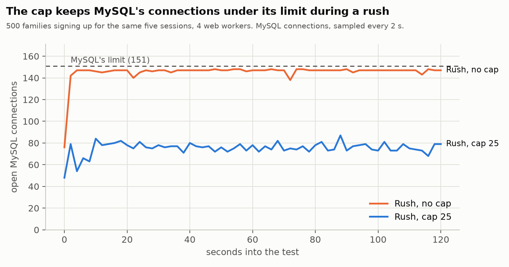

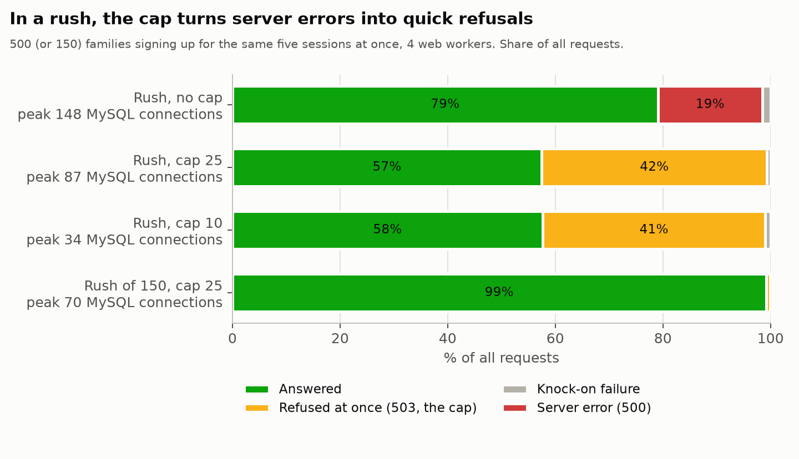

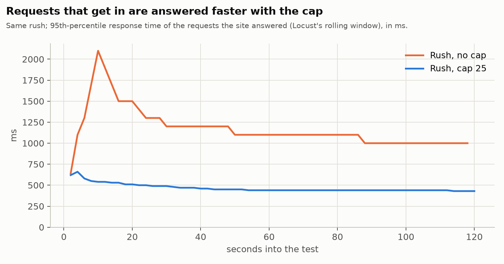

| Run | Peak MySQL connections | Answered | Refused (503) | Server errors (500) | p95 of the answered |
|---|---:|---:|---:|---:|---:|
| Rush, no cap | 148 (limit 151) | 79% | 0 | **19%** | 1,000 ms |
| Rush, cap 25 | 87 | 57% | 42% | 0 | 430 ms |
| Rush, cap 10 | 34 | 58% | 41% | 0 | 190 ms |
| Rush of 150 families, cap 25 | 70 | 99% | 0.8% | 0 | 330 ms |

- **The same work gets done** (about 220 answered requests a second in each run); what changes is how the
  rest fails. Without the cap, MySQL is full the whole time and a fifth of the requests end in a server
  error after waiting. With it, MySQL never gets near its limit, the overflow is refused at once, and the
  requests that get in are answered two to five times faster.
- **The sessions filled exactly** (22 confirmed of 22, no duplicate waiting-list positions) in the rushes
  checked afterwards, with and without the cap: the lock of finding 1 and the cap work together.
- **What a refused visitor sees is the proxy's page.** uvicorn's own answer is a bare "Service Unavailable";
  since 2 October 2026 the devcontainer's nginx shows our own page instead
  (`.devcontainer/nginx/errors/busy.html`: the site's design, in Dutch, French and English, no script,
  trying again by itself after 30 seconds), for a 503 from the cap, a 502 while the site is down or
  restarting and a 504, with the status kept and `Retry-After: 30`. `/health/` and `/api/` keep their own
  answers, and so do Django's own 404 and 500 pages. It's the example for production, and already in
  place there: `scripts/deploy.sh` uploads it to `~/errors/busy.html` every deploy, served at `/_errors/`
  through the panel's Apache configuration (confirmed present on production, dated 7 Oct 2026).

  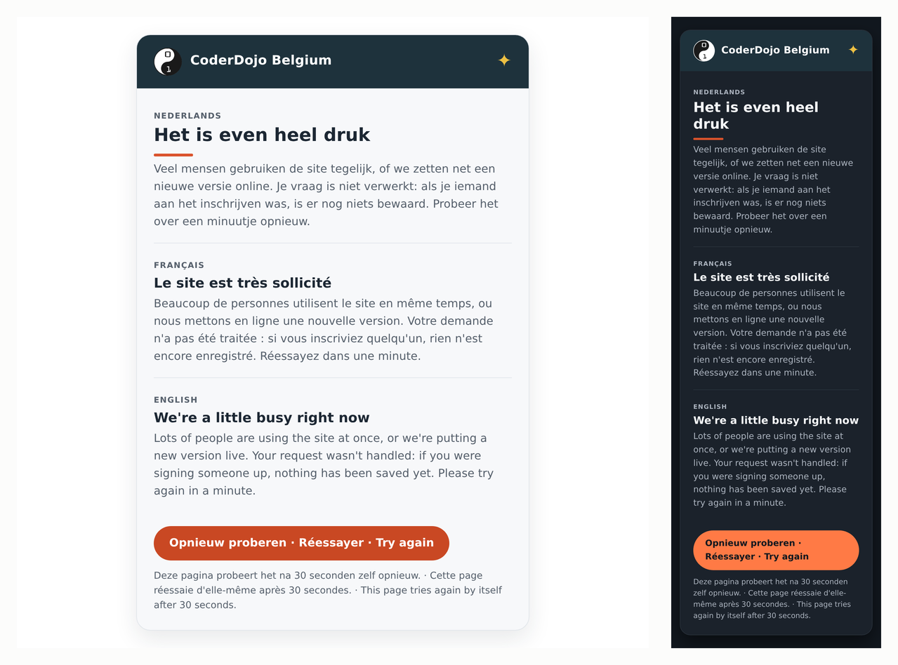

  (`user-journeys/scripts/shot_error_page.py` takes the picture again after a change to the page.)

**Under normal heavy load** the cap must refuse nothing (300 users, mixed load):

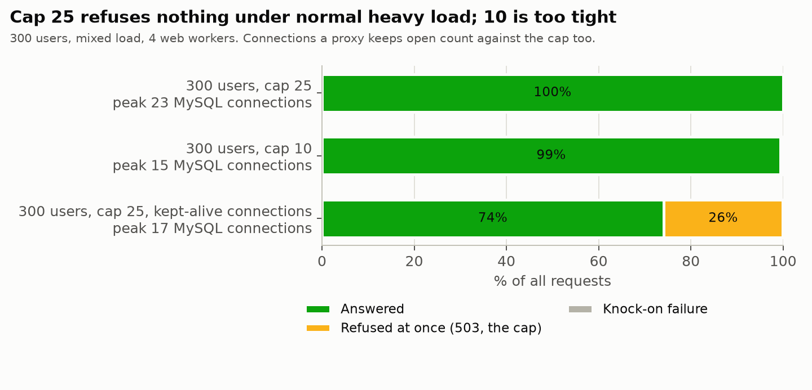

| Run | Peak MySQL connections | Refused | p95 |
|---|---:|---:|---:|
| Cap 25, a new connection per request (as behind a proxy) | 23 | **0** | 110 ms |
| Cap 10 | 15 | 0.6% | 110 ms |
| Cap 25, connections kept open between requests | 17 | **26%** | 92 ms |

- **25 was the setting** for this devcontainer measurement (4 workers, MySQL's 151-connection default):
  nothing refused under normal load, while a rush stayed far from MySQL's limit. **This does not hold on
  production** — see "Rerun against Level27's real limits" below, which replaces 25 as the recommendation
  for production specifically.
  10 already turns away normal traffic.
- **The cap counts open connections, not requests.** When the client keeps its connection open between
  requests (the last row), idle connections take places too and a quarter of the requests were refused at
  25. Behind a proxy that opens a connection per request (nginx's default towards its upstream), open
  connections are requests in progress; a proxy that keeps a pool of connections to gunicorn open would
  need a higher cap. **That's Level27's proxy: ask how it connects to the socket**
  ([`LEVEL27_QUESTIONS.md`](LEVEL27_QUESTIONS.md) #3), and until then watch
  `coderdojo_http_server_errors_total` and the proxy's 503s after deploying.
- **WebSockets count too:** every open notification bell holds a connection for as long as the dashboard is
  open. A few dozen across 4 workers are fine at 25; hundreds would need the cap raised, or the bell
  served by a worker of its own.
- To size the cap for another MySQL limit: *workers × (cap − 1) + 5 < max_user_connections*, leaving room
  for the Django admin and maintenance commands.

### Rerun against Level27's real limits (8 Oct 2026)

Every number above was measured against the devcontainer's MySQL defaults (`max_connections` 151, 4 web
workers) — not what production actually has. Once production's real numbers were confirmed
(`max_user_connections` 32, 3 gunicorn workers; `LEVEL27_QUESTIONS.md`), the whole cap matrix was rerun in
the devcontainer with those exact constraints reproduced: `ALTER USER` on the dev DB user to
`MAX_USER_CONNECTIONS 32`, gunicorn started with `-w 3`, otherwise the same `growth`-scale database,
Locust scenarios and `/metrics/` sampling as above (raw results:
[`loadtest/results/2026-10-08-level27-realistic.json`](loadtest/results/2026-10-08-level27-realistic.json);
charts from `loadtest/charts.py --level27`).

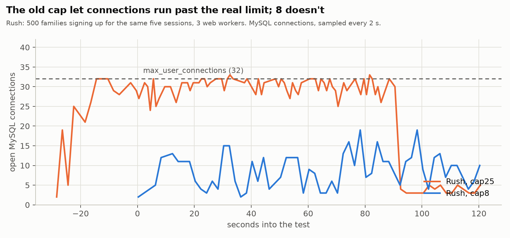

| Run (3 workers, `max_user_connections` 32) | Peak DB connections | Requests | Failed | **500 errors** | 503 refused | p95 |
|---|---:|---:|---:|---:|---:|---:|
| Rush, cap 25 (**today's production setting**) | 33 | 8,666 | 70.2% | **805** | 4,903 | 360 ms |
| Rush, no cap | 33 | 33,313 | 14.7% | **3,719** | 0 | 470 ms |
| Rush, cap 10 | 22 | 37,697 | 21.3% | **0** | 7,686 | 160 ms |
| Rush, cap 8 | 19 | 30,940 | 16.6% | **0** | 4,727 | 210 ms |
| 300 users (normal), cap 25 | 11 | 11,539 | 0% | 0 | 0 | 110 ms |
| 300 users (normal), cap 10 | 11 | 11,422 | 1.3% | 0 | 137 | 97 ms |
| 300 users (normal), cap 8 | 11 | 10,804 | 1.9% | 0 | 189 | 96 ms |

**The headline: today's production setting (cap 25, 3 workers) is the worst option measured, not a safe
middle ground.** It's the only rush run with real server errors (805 of them — about 9% of all its
requests, confirmed in the raw Locust failures as genuine `500 Internal Server Error` responses, not
503 refusals) *and* the lowest throughput of any rush run (8,666 requests in two minutes, against 30–38
thousand for every other configuration) — 3 workers × cap 25 lets 75 requests queue up per worker group
against a database that can only actually serve 32 at once, so most of that concurrency sits blocked
rather than failing fast, and Django returns a 500 once a request finally gets to the front and still
can't get a connection. No worker crashes or restarts were involved (checked the gunicorn error log) —
these are legitimate application-level errors under normal operation, at normal-for-a-rush load.

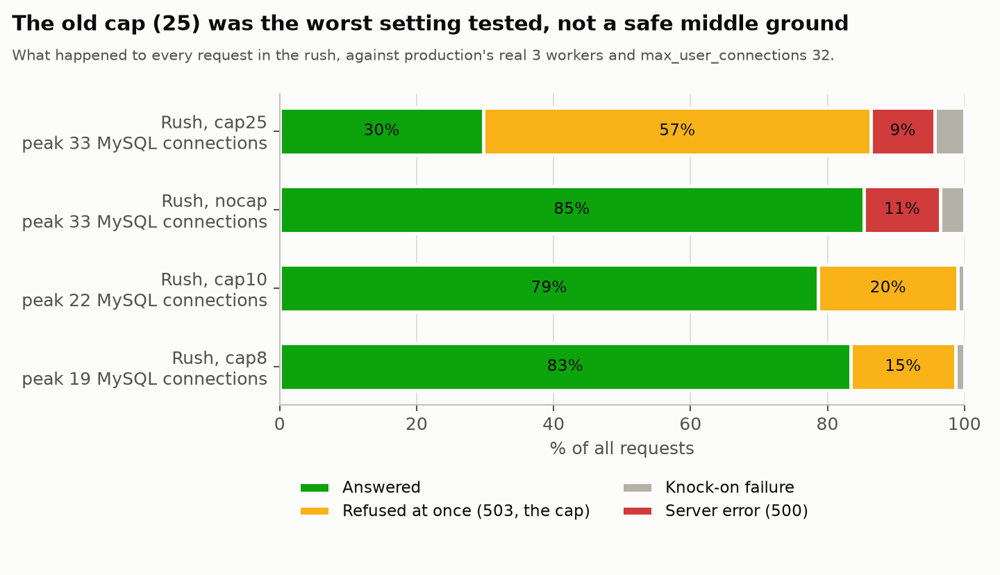

**Cap 8 and cap 10 both eliminate every 500 error**, in the rush *and* the normal-load scenarios — zero,
across all four runs at those caps. The trade-off is more visible (but clean) `503`/"busy, try again"
refusals: about 17–21% of rush requests instead of today's 70%, and a small 1.3–1.9% refusal rate even
under ordinary heavy traffic (300 concurrent users), where cap 25 refused nothing. Cap 8 gives a slightly
wider safety margin than cap 10 (peak 19 vs. 22 connections, comfortably under 32) for a similar refusal
rate and the lowest p95 isn't meaningfully different between them.

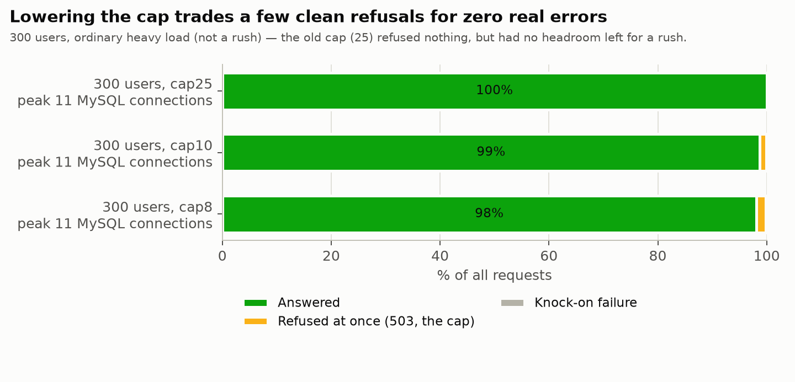

**Fixed 8 Oct 2026: `gunicorn.conf.py`'s default changed from 25 to 8** (not an `.env` override — more
reliable, since it takes effect on any reload regardless of how Level27's systemd unit sources
environment variables) and deployed to production (`scripts/deploy.sh --yes`, release
`20261008-110338-8f46815-dirty`). Confirmed live, not assumed: read the deployed file's own default and
the running master's `/proc/<pid>/environ` directly over SSH, rather than trusting
`scripts/deploy.sh --check`'s own summary line, which turned out to always say "25" regardless of the
real value until fixed the same day (`MAINTENANCE.md`, Security log). This changes production behaviour —
more visible refusals under heavy load in exchange for zero server errors — which is why it was applied
deliberately rather than silently from a documentation pass. If `WEB_CONCURRENCY`/the worker count changes
later, resize the cap with the same formula and ideally rerun this matrix rather than trust the formula
alone — cap 25 passed the formula's informal reasoning well enough until it was actually measured against
the real connection limit, and the gap between the two was worse than the formula alone would have
suggested (the formula says cap 25/3 workers *fails*, which is right, but gives no sense that it fails
this badly — 70% request failure, not a modest overrun).

### Conclusion: what production can actually support today

With the fix above live, production runs **3 web workers × 8 concurrent requests = 24 in flight at once**,
against a real database ceiling of 32 connections (`max_user_connections`, fixed by the hosting package —
`LEVEL27_QUESTIONS.md`) — 8 connections of headroom for Celery and admin/maintenance work. That's the one
number everything else below follows from.

- **Normal browsing and booking:** comfortable. Measured at 300 concurrent active users (each clicking
  every 2–8 seconds — not 300 people hitting refresh at once, but 300 real sessions browsing, reading
  event pages, logging in and booking): **98.1% answered**, a 1.9% clean refusal rate, **zero errors**,
  96 ms typical response time. Ordinary traffic — a dojo's families checking sessions, a handful of people
  signing up at any moment — sits well under this.
- **A registration rush** (500 families converging on the same five sessions within about two minutes —
  deliberately far more aggressive than anything seen on the site so far): **83.4% answered**, **16.6%
  get a clean "busy, try again" page** (an immediate, fast 503 with `Retry-After`, not a hang or an
  error), **zero server errors, zero overbooked or corrupted bookings** (the row lock in
  `events.registrations` holds regardless of load). Response time for the requests that get through: 210 ms
  typical.
- **The ceiling is fixed, so capacity has to come from efficiency.** Level27 confirmed (8 Oct 2026) that
  `max_user_connections` = 32 is part of the hosting package and can't be raised. More web workers don't
  help either — `workers × (cap − 1) + 5` has to stay under 32, so more workers just means a lower cap
  each. What *does* raise real capacity is making each request hold its database connection for less
  time, since 24 connections serve more requests per second when each finishes faster: fewer queries per
  request (`select_related`, the data caches in `core/caching.py`, `pages.tests.DataCacheTests`' query
  counts as guards), keeping slow work out of the request (Celery), and serving static and media files
  from Apache, never Django. Watch `coderdojo_http_db_queries_total` per view and the p95 per view
  (`MONITORING.md`) for the pages worth tuning next; the caching work of 1 October 2026 already cut a third
  of the statements per request ([Caching](#caching)).
- **In short:** today's setup comfortably serves normal usage and degrades *safely*, not *incorrectly*,
  under a rush far heavier than anything realistic for this site's size — the worst a family sees in an
  overload moment is a friendly "try again in a moment" page, never a lost or duplicated booking.

## Caching

Measured on **1 October 2026**. Before, the database did work for every page that it had already done
for the last one: the places left on each session card (one count query per card), the account's
roles, applications and dojos (several times per request), the organisation's sign-in policy (twice per
request), the session row, and site-wide content that is the same for every visitor.

**What changed** (the rules are in `CLAUDE.md`, "Caching"):

| Step | Where | What it saves |
|---|---|---|
| Lists count their places in the same query | `Event.objects.with_confirmed_count()` | the per-card count query on the events list, the dojo finder, a dojo's page and the dojo's events list |
| Sessions read from Redis, written to MySQL too | `SESSION_ENGINE = cached_db` | the session query on every logged-in request; an emptied cache logs nobody out |
| The account's nav, once per request and cached per account | `accounts/navigation.py` | the roles, applications, permissions and dojos the nav and the management switcher show |
| The sign-in policy cached | `accounts.sign_in.policy` | two queries on every logged-in request |
| Site-wide content cached | `content/cache.py` | pathways, the organisation's team, FAQs, testimonials, sponsors, promotions (until the next one starts or ends) |
| The events list's first page and a dojo's page cached | `events.search`, `dojos/public_cache.py` | what most visitors see; the next session's places and the join button stay live |
| Address lookups kept to Nominatim's 1 request a second (2 October 2026) | `geo/geocoding.py` | postcodes and town names answered from `geo.Municipality`; everything else cached 90 days (a no-match a day); one Nominatim request a second for all processes together, with a back-off when Nominatim asks for it |
| Hits, misses and queries measured | `monitoring` | `coderdojo_cache_hits_total`, `coderdojo_cache_misses_total` and `coderdojo_http_db_queries_total` per view on `/metrics/` |

Every cache is cleared, at once and again when the transaction commits, whenever a row it's built from is
saved or deleted, so a change shows straight away; the timeouts only cover `QuerySet.update()`. **The nav
cache never decides access**: the pages behind its links still ask the database, so a stale nav can show a
link for a few minutes but never open a page. Whole pages are never cached: each carries its own CSP nonce,
CSRF token and the visitor's nav.

**Queries per page** (the seeded development data, the second visit, so with the caches filled;
`pages.tests.DataCacheTests` keeps the public pages' numbers as guards):

| Page | Visitor | | Parent | | Champion | |
|---|---:|---:|---:|---:|---:|---:|
| | before | after | before | after | before | after |
| Home | 9 | **1** | 19 | **4** | | |
| Events list | 24 | **1** | 32 | **2** | | |
| Dojo finder | 22 | **1** | | | | |
| A dojo's page | 8 | **1** | | | | |
| A session's page | 5 | 3 | 15 | 6 | | |
| Account page | | | 19 | 12 | | |
| Dojo dashboard / events / team | | | | | 22 / 19 / 25 | **9 / 6 / 12** |

**Under load** (`loadtest/compare.sh`: the same runs on the old and the new code, on the scaled database,
each starting on an empty cache and the seeded bookings, a new connection per request and the cap of 25):

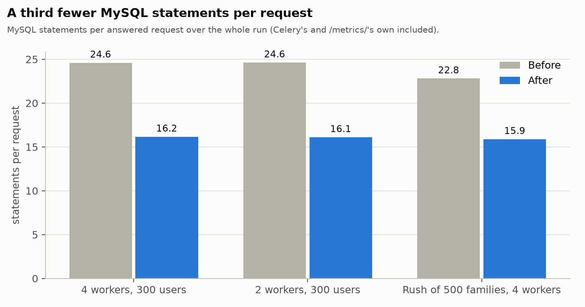

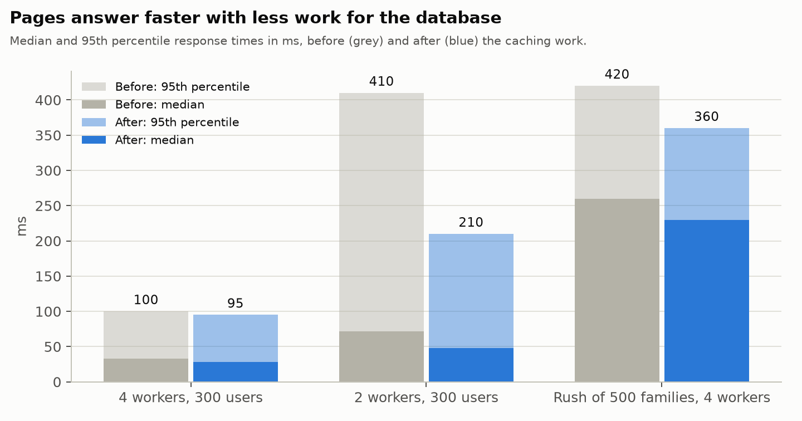

| Run | | Requests/s | Median | p95 | p99 | Failed | Peak MySQL connections | Statements per request |
|---|---|---:|---:|---:|---:|---:|---:|---:|
| 4 workers, 300 users | before | 64.3 | 33 | 100 | 240 | 0 | 15 | 24.6 |
| | after | 64.5 | 28 | 95 | 230 | 0 | 13 | **16.2** |
| 2 workers, 300 users | before | 60.2 | 72 | 410 | 710 | 121 (0.8%) | 34 | 24.6 |
| | after | 63.8 | **48** | **210** | **350** | **0** | 22 | **16.1** |
| Rush of 500 families, 4 workers | before | 222 answered | 260 | 420 | 520 | 37% refused | 87 | 22.8 |
| | after | **260 answered** | 230 | 360 | 460 | 37% refused | 89 | **15.9** |

- **A third fewer statements per request** in every run. That's less than the page counts above suggest:
  the mixed load is mostly logged-in families (their account page and signing up, about 13 queries each),
  dojo teams marking attendance (writes, about 25) and logins, and every request opens its own MySQL
  connection, which costs 2 statements of its own (`SELECT VERSION()` and the isolation level) that no
  cache saves.
- **It shows where the site was short of capacity:** with 2 web workers, the 95th percentile halved and
  the errors went away. With 4 workers there was room to spare before, so little changes there.
- **In the rush, 17% more requests were answered** in the same time (the overflow is still refused by the
  cap, as designed). Booking itself is writes under a lock, which no cache shortens.
- **Hit rates** (from `/metrics/`): 99.9% for the site-wide content and the dojo finder's default list;
  70% for the events list's first page and 77–79% for the upcoming-sessions carousel, because every
  booking clears them (the places left change). That's the price of showing the right number of places.
- **Memory:** no change for the web workers (690 MB for 4); Redis peaked at 4.1 MB instead of 3.9 MB.
  The sessions add about 1 KB per logged-in visitor.
- **Not done, and why:** the account page, the sign-up page and the dojo team's pages read data that
  changes with every booking or attendance mark, and their queries are already per-page, not per-row.
  Keeping MySQL connections open between requests (`CONN_MAX_AGE`) would save the 2 setup statements per
  request, but Django advises against it under ASGI (each request runs in its own thread, so connections
  would pile up past the cap's arithmetic).

## Load: Celery workers and mail

| Job | On the scaled data | Memory |
|---|---|---|
| Nightly engagement rebuild (`rebuild_engagement`) | 4.9 s, 22,700 rows | mailing child up to 300 MB RSS, then recycled |
| A campaign to every family (6,645 accounts) | queued in 116 s | mailing child 160 MB RSS |
| Sending | 120 mails a minute (`MAILING_BATCH_RATE_LIMIT` 6/m × `MAILING_BATCH_SIZE` 20) | flat |

- **Sending is paced on purpose:** 7,200 mails an hour, so a campaign to 6,600 families takes about 55
  minutes and one to 12,000 about 1 hour 40. Booking and account mail are claimed first (lower `PRIORITY`).

**On production (8 October 2026):** the live demo switched to a throwaway copy of the `seed_scale` growth
database (`scripts/loadtest_demo.sh`, imported over SSH), one `dojo_news` campaign to every adult account
(7,145 mails, launched as the dashboard does), production's two workers with `--max-tasks-per-child 100
--max-memory-per-child 160000`, mail to Mailpit. Sampled every 5 s with `ps` and the `mysql` client:

| | Result |
|---|---|
| Queuing (14:35 → 14:40) | all 7,145 in about 4½ minutes, chunks of 200 |
| Sending (14:35 → 15:35) | 7,145 sent, 0 failed, a steady 120 a minute |
| The whole app's memory | 1,378 MB idle, **1,425 MB at the most** |
| A Celery child | 136 → **147 MB at the most**, under the 160 MB limit; replaced only by the 100-task recycle |

Nothing broke: no memory-limit recycle, no error in the worker logs, memory flat however many mails were
waiting. The audience size doesn't matter for memory (chunks of 200, batches of 20); what grows is the time
to send. The limit is the 13 MB between a child's 147 MB and 160 MB: a heavier template or a bigger batch
would make every batch recycle its child (not a crash, a few seconds' restart each time). The nightly
engagement rebuild (about 300 MB) runs on the same worker, one task at a time, so it never adds to a
campaign; still, keep big campaigns away from 03:00.

**Booking mail during a campaign** (measured on 2 October 2026, `test_capacity`: a campaign to all 7,145
adult accounts, and a booking confirmation queued every 3 seconds while it was being queued; the time from
queued to sent):

| Code | Queuing the campaign | Booking confirmation waited (median / longest) |
|---|---|---|
| Before: one task for the whole audience, 200 mails in flight | 271 s, one task | **121 s / 212 s** |
| Chunks of 200 only | slower (each chunk waits behind the batches) | 107 s / 113 s |
| **Chunks of 200 and 2 batches in flight (now)** | 5,848 in the first 5 minutes, far ahead of sending | **16 s / 22 s** |

- **The queueing wasn't the main delay; what's in flight was.** The dispatcher claimed up to 200 mails
  ahead (`MAILING_CLAIM_LIMIT`), 10 batches waiting in the broker, which sends first in, first out at 6
  batches a minute: whatever was claimed next waited 100 seconds behind them, for as long as any campaign
  was sending, not just while it was queued. Priority only decides what's claimed, not the broker's order.
  Now 2 batches are in flight (20 seconds of sending, refilled every 10 seconds, so sending never runs
  dry), and booking mail waits about one dispatcher tick plus those 20 seconds.
- **A campaign is queued a chunk at a time** (`MAILING_CAMPAIGN_CHUNK_SIZE`, 200 accounts per
  `launch_campaign` task, each queueing the next behind what waits), so the single mailing worker is never
  busy with one campaign for minutes. `Campaign.queued_up_to` is how far it got: a chain broken by a dying
  worker is resumed by the beat, and a duplicate chain stops at once.
- The periodic worker's jobs all take well under a second, so the 10-second mail dispatcher never waits.

## Redis

One Redis holds the cache (db 0), the Channels layer (db 1) and the Celery broker (db 2).

- **It needs very little:** 2.5 MB in use, a peak of 4.4 MB during the load tests, 400 open WebSockets
  included. The cache holds the public site's lists and pages, each account's nav (5 minutes) and, since
  1 October 2026, a copy of every login session ([Caching](#caching): about 1 KB each, expiring with the
  session); the broker holds only waiting tasks (mail itself waits in MySQL, not Redis).
- **Its configuration is the risk, not its size.** Without a `maxmemory`, and with Redis's default
  `noeviction`, a Redis that fills up refuses writes, including the broker's, and then no task gets queued.
  **The devcontainer is bounded since 2 October 2026** (`.devcontainer/docker-compose.yml`): `maxmemory
  128mb` with `volatile-lru`, so only keys with a timeout (the cache, the sessions' copies, Channels) can be
  evicted, least recently used first, and the broker's queues and the `/metrics/` counters (no timeout)
  never are; the container itself is capped at 256 MB (`mem_limit`), for Redis's overhead and the fork of
  a background save. 128 MB is about 30 times the peak of the load tests. **Every cache key must have a
  timeout** (`core.caching` and `cache.set` always pass one): a key without one could never be evicted.
  **Production's settings, confirmed 8 Oct 2026:** Redis 8.10.1, `maxmemory` 512 MB, policy
  **`allkeys-lru`** — unlike the devcontainer, this does *not* protect the broker's and `/metrics/`'s
  untimed keys from eviction once Redis fills up. Current usage is tiny (2.3 MB), so there's no live
  incident, but it's a real gap in the design's safety margin, not just an unconfirmed setting
  ([`LEVEL27_QUESTIONS.md`](LEVEL27_QUESTIONS.md) #1).

## Findings and what to do

In order of urgency.

1. **Simultaneous sign-ups overbooked a session** (correctness). **Fixed on 30 September 2026.**
   `events.views.event_signup` read the highest position and the number of confirmed places, then
   inserted, without a lock. In the rush, four of the five sessions of 22 places confirmed 23 to 25
   children, and every session had duplicate waiting-list positions (9 to 17 each). Cancelling had the same
   gap: two cancellations at once could promote the same waiting child, and a double click on *Sign up*
   ended in an error page (the unique constraint caught the second insert). Both now go through
   `events.registrations` (`sign_up`, `cancel`), which locks the session's row first and decides
   everything after that; a waiting child is only promoted into a place that's really free.
   `events.tests.BookingConcurrencyTests` runs real threads against MySQL; all four of its tests fail
   without the lock. The rushes checked since (150 families without the cap, 150 with it): exactly 22
   confirmed on every session, no duplicate positions, no lock timeouts.
2. **Database connections weren't limited** (availability). **Capped on 30 September 2026** at 25
   requests per web worker (`gunicorn.conf.py`, [above](#capping-requests-per-web-worker)), confirmed
   active on production 8 Oct 2026 (3 gunicorn workers, cap read from the file) — but production's
   `max_user_connections` turns out to be 32 (confirmed 8 Oct 2026), tighter than the 151 the cap was
   designed against. **Measured, not just calculated, 8 Oct 2026** ("Rerun against Level27's real
   limits," above): at cap 25 with 3 workers, a rush produces real `500` errors (805 of them, ~9% of
   requests) and collapses to a quarter of the throughput of every other setting tested — not a graceful
   degradation. Cap 8 or 10 eliminates every `500` in both a rush and normal heavy load, at the cost of
   more visible `503` refusals (17–21% of a rush, 1.3–1.9% of normal heavy load, vs. 0% today).
   **Fixed 8 Oct 2026:** `gunicorn.conf.py`'s default changed from 25 to 8 and deployed (release
   `20261008-110338-8f46815-dirty`); confirmed live by reading the master process's own environment, not
   assumed — `scripts/deploy.sh --check` trusted a hardcoded display value here until the same day (see
   the Security log in `MAINTENANCE.md`). This was a deliberate trade-off, not a docs fix: today's zero
   visible refusals for zero real errors. *Still open:* how Level27's proxy connects to the app's socket
   ([`LEVEL27_QUESTIONS.md`](LEVEL27_QUESTIONS.md) #3) affects whether 8 is still right once that's known.
3. **Uploads had no limits** (disk, privacy). **Guarded on 30 September 2026** ([the
   guardrails](#disk-files-and-uploads)): size and type checks, images made smaller and stripped of their
   metadata, replaced files deleted. *Still to do on production:* confirm the proxy's body limit
   ([`LEVEL27_QUESTIONS.md`](LEVEL27_QUESTIONS.md) #2).
4. **Mail text was kept forever** (growth). **Built on 3 October 2026:** the daily retention job clears a
   mail's subject, body, address and account link 12 months after it was created (`mail_content`): about a
   quarter less database after five years. Run `OPTIMIZE TABLE mailing_emailmessage` once after the first
   large clean-up on production if the disk space itself is needed back.
5. **Four web workers** (`WEB_CONCURRENCY`) if the account's memory allows: much better response times under
   load for about 200 MB more.
6. **Redis limits:** confirmed 8 Oct 2026 — `maxmemory` 512 MB, but policy `allkeys-lru`, not
   `volatile-lru`. Ask Level27 to switch it ([`LEVEL27_QUESTIONS.md`](LEVEL27_QUESTIONS.md) #1); the
   devcontainer runs with `volatile-lru` since 2 October 2026 (128 MB, the container capped at 256 MB).
7. **Celery's logs** grew about 6 MB a day, mostly the periodic worker's routine runs. **Fixed on 30
   September 2026:** that worker logs at WARNING in production.
8. **Booking mail waited behind a campaign** (mail). **Fixed on 2 October 2026**
   ([above](#load-celery-workers-and-mail)): a booking confirmation sent while a campaign went out waited
   about 2 minutes, mostly behind the 200 mails the dispatcher claimed ahead, partly behind the campaign's
   queuing. Now 2 batches in flight and campaigns queued in chunks: 16 seconds (median), 22 at most.
9. **Pages repeated work the database had already done** (load). **Fixed on 1 October 2026**
   ([Caching](#caching)): a count query per session card, the account's roles and dojos several times per
   request, the session row and the sign-in policy on every request, site-wide content on every visit. A
   third fewer statements per request; with 2 web workers the 95th percentile halved. *Watch on
   production:* `coderdojo_cache_hits_total` against `coderdojo_cache_misses_total`, and
   `coderdojo_http_db_queries_total` per view divided by its requests.
10. *Development only:* two copies of both Celery workers were running in the devcontainer (one pair from an
   earlier `start.sh`), so every scheduled job ran twice. Stopped on 30 September;
   `pgrep -af "celery -A website worker"` should show five processes.

## Watching production

The `monitoring` app measures the site from the inside; nothing needs installing on the server.

- **`/metrics/`** (Prometheus text format, `monitoring/views.py`): only with `METRICS_TOKEN` as a bearer
  token (`Authorization: Bearer ...`; no token configured = 404). It shows counts and sizes, never anyone's
  data. Point any Prometheus-compatible collector at it once a minute (e.g. Grafana Cloud's free tier, or
  an uptime service that reads Prometheus metrics). What it holds:
  - per table: rows and bytes (`coderdojo_db_table_*`); MySQL's open connections, most used, limit,
    queries and slow queries;
  - Redis: memory, peak, limit, evictions, clients, keys per db;
  - the Celery queues' length, the mail queue (pending, oldest due), open WebSockets;
  - per process (web workers, Celery children, their parents and beat): RSS, PSS and peak RSS, reported
    by each process itself every minute. A report lasts 2.5 minutes, so right after a restart the totals
    still include the old processes for up to that long;
  - per view: requests, time, 5xx and a duration histogram; per Celery task: runs, time, failures and the
    longest run.
- **What each metric and panel means**, with screenshots of the dashboard under load: [`MONITORING.md`](MONITORING.md).
- **In the devcontainer**, Prometheus and Grafana can read it for you: start the stack with the `monitoring` profile (`COMPOSE_PROFILES=monitoring`, CLAUDE.md, "Commands") and open `https://coolregistration.localhost/grafana/` (no login) for the *CoderDojo site* dashboard: requests, response times, queries per request, the queues, tasks, memory, MySQL and Redis. Handy during a load test (`loadtest/`).
- **Slow requests** (over `METRICS_SLOW_REQUEST_MS`, 1 second) are logged as warnings with the view name.
- **A daily sample** (`monitoring.CapacitySample`, beat job `capacity-sample` at 02:30) stores the same
  figures in the database, so growth shows as a trend without any outside service. Read them in the Django
  admin, or compare with the projection: `manage.py capacity_report` (read-only, fine on production).
- **`/health/`** stays the uptime check (200 or 503).
- **The cap's refusals** are uvicorn's own 503s: they never reach Django, so they're not in
  `coderdojo_http_server_errors_total`. They show in gunicorn's log ("Exceeded concurrency limit") and the
  proxy's access log.

**When to act:**

| Signal | Threshold | Likely cause |
|---|---|---|
| `coderdojo_mysql_threads_connected` | over 70% of `coderdojo_mysql_max_connections` | more workers than the cap allows for (finding 2) |
| "Exceeded concurrency limit" in gunicorn's log | outside a registration rush | the cap too low for the proxy or the WebSockets |
| p95 from `coderdojo_http_request_duration_ms_bucket` | over 1 s for 10 minutes | too few web workers |
| sum of `coderdojo_process_pss_bytes` | over 80% of the account's memory | more workers than memory |
| `coderdojo_redis_used_memory_bytes` | over 50% of `maxmemory`, or `evicted_keys` rising | Redis limits (finding 6) |
| `coderdojo_celery_queue_length{queue="celery"}` | over 500 for 30 minutes (a campaign is fine) | a stuck mailing worker |
| `coderdojo_mail_oldest_due_seconds` | over 1,800 (also in `/health/`) | workers down |
| database size (daily sample) | growing faster than the scenario's projection | more mail than planned |
| `media/` size | growing by more than 100 MB a month | large uploads (finding 3) |
| hits ÷ (hits + misses) per cache | under 90% for `content:*` or `dojos:detail` | something saving those rows over and over (finding 9) |

## Load testing production

The measurements above come from the devcontainer. Level27's machine, proxy, MySQL and Redis differ, so
parts of them are meant to be repeated **on production itself**. What's safe there:

| Check | Safe on production? | How |
|---|---|---|
| Database size and projection | yes, read-only | `manage.py capacity_report` on the server |
| The site's own figures | yes, read-only | `/metrics/` with the `METRICS_TOKEN` |
| Whether the cap is on | yes, read-only | `scripts/deploy.sh --check` (the *gunicorn* step) |
| A public load test | **yes, with care** | `loadtest/run.sh ... public`: visitors only, no login, nothing written |
| The mixed load and the rush | **no, unless the site has no real users yet** | they log in and book: `locustfile.py` refuses any host that isn't local, unless `LOADTEST_CONFIRM_REMOTE_HOST` explicitly confirms that exact host |

The mixed load and the rush book sessions and send mail, so on a production site with real families
they'd reach real people. They need a `seed_scale`-shaped database and stay on a local test site; to test
bookings on Level27's own machines against a site that *does* have real users, run them against a staging
copy there (a second app with a `test_` database), never the live site.

**On a demo/showcase deployment with no real users yet** (confirmed with whoever owns the decision before
each use — this is a one-off judgement call, not a general exception), `scripts/loadtest_demo.sh` and
`scripts/run_demo.sh` automate the safe version of this (8 Oct 2026): `switch` backs up the live app's
`.env`, repoints it (web + both Celery workers) at a separate, disposable database, and verifies the swap
via `/metrics/`; `run_demo.sh` then runs `loadtest/run.sh` against the live domain with
`LOADTEST_CONFIRM_REMOTE_HOST` set to match; `restore` puts the real database back and removes the backup.
**Keep each database's logins with it.** Every seeded database has its own `seed_credentials.csv` (the
seeders give each account a random password), so before seeding or switching to another one, copy that
file under a name that says which database it belongs to, e.g. `seed_credentials-<host>-<db name>.csv`,
and never let a second seeding overwrite the first. The same goes for the throwaway database's own
connection details: they live on the server, owner-only (`chmod 600`), as
`~/loadtest-db-<host>-<db name>.env`, with a note of anything changed by hand (on 8 Oct 2026 the 112
accounts in `loadtest-data.json` were set to the password `scale-test` for Locust). Source that file
before `switch`.

Don't leave a demo site switched longer than the test needs, and never point this at a site with real
users — `locustfile.py`'s host guard is the only thing standing between a copy-pasted command and real
bookings on whatever `--host` it's given.

**A public load test on production**, from a developer's machine (not the server: the load generator
shouldn't compete with the site for CPU):

1. **Pick a quiet moment** (a weekday evening, no registration opening or campaign that day), and tell the
   board. Check `/health/` first.
2. **Set a `METRICS_TOKEN`** in production's `.env` if there isn't one yet (a long random string; redeploy
   or restart gunicorn so the settings read it).
3. **Start small and stop at the first sign of trouble**: 50 users for 3 minutes, then 150. Each visitor
   clicks every 2 to 8 seconds, so 150 is about 30 requests a second, several times the busiest real
   moment. Don't go beyond 300 without agreeing it with Level27 (their proxy and neighbours share the
   machine).

   ```sh
   export LOCUST=<venv>/bin/locust LOADTEST_HOST=https://<production-host> METRICS_TOKEN=<token> \
          LOADTEST_OUT=loadtest-out/production-$(date +%F) LOADTEST_WORKERS=<WEB_CONCURRENCY> LOADTEST_LIMIT=25
   LOADTEST_LABEL="production, 50 visitors" loadtest/run.sh prod-public-50 50 5 3m public
   LOADTEST_LABEL="production, 150 visitors" loadtest/run.sh prod-public-150 150 10 3m public
   python3 loadtest/summarize.py "$LOADTEST_OUT" > loadtest/results/production-$(date +%F).json
   ```

4. **Watch while it runs**: `/metrics/` (sampled by `run.sh` every 2 seconds into the output folder), and
   stop it (Ctrl-C) if the p95 passes 2 seconds, errors pass 1%, or `/health/` goes to 503.
5. **Compare** with the devcontainer's public figures and keep the results file with the date. The requests
   come from one address: if Level27 rate-limits per address, that's what you'll measure, and it's worth
   knowing too.

A production run goes through Level27's proxy with TLS, so it's also the real end-to-end check: the proxy's
own limits, its 503 page, its keep-alive towards gunicorn (a lot of 503s at modest load mean the cap
counts the proxy's open connections: raise it, see [above](#capping-requests-per-web-worker)).

## Questions for Level27

Level27 sponsors the hosting, so this isn't about capacity or budget — the concrete technical
configuration questions (the proxy's connection behaviour and body limit, Redis's eviction policy, who
patches what) now live in one place, [`LEVEL27_QUESTIONS.md`](LEVEL27_QUESTIONS.md), kept separate from
this measurement page so they don't go stale here unnoticed. MySQL's `max_connections` (350) and
`max_user_connections` (32) are confirmed (8 Oct 2026, read directly from the app's own DB connection) —
see "Capping requests per web worker" above for why `max_user_connections` matters more than it looks.

## Measuring again

In the devcontainer's workspace (the tooling in `loadtest/`; Locust, matplotlib and nothing else in a venv
of their own: `python3 -m venv <venv> && <venv>/bin/pip install -r loadtest/requirements.txt`). The scaled
database is a `test_` database, which the app user may create, and every step leaves the dev data alone.

```sh
# 1. A database at scale (a few minutes)
python -c "import MySQLdb; MySQLdb.connect(host='db', user='coolregistration', passwd='<DB_PASSWORD>').cursor().execute('CREATE DATABASE test_capacity')"
DB_NAME=test_capacity python manage.py migrate
DB_NAME=test_capacity python manage.py seed_scale --scenario growth --years 1

# 2. Bytes per row, then the projection (commit monitoring/row_sizes.json)
DB_NAME=test_capacity python manage.py capacity_report --measure
python manage.py capacity_report
python manage.py capacity_report --json --years 5 > loadtest/results/capacity-$(date +%F).json

# 3. A production-like run on it: Redis dbs of its own, no real mail, gunicorn.conf.py's cap
export DB_NAME=test_capacity DEBUG=false SILK=false SECURE_COOKIES=false EMAIL_HOST= \
       REDIS_CACHE_DB=4 REDIS_CHANNELS_DB=5 CELERY_BROKER_DB=6 MAILING_BOUNCE_IMAP_HOST= METRICS_TOKEN=loadtest
gunicorn -k uvicorn.workers.UvicornWorker main:app -b 127.0.0.1:8001 -w 4 &
celery -A website worker -n periodic-load@%h -Q periodic -c 1 -B --scheduler django_celery_beat.schedulers:DatabaseScheduler --max-tasks-per-child 100 --max-memory-per-child 160000 &
celery -A website worker -n mailing-load@%h -Q celery -c 1 --max-tasks-per-child 100 --max-memory-per-child 160000 &

# 4. Load, sampling /metrics/ as it goes; the names are the ones loadtest/charts.py draws
python manage.py shell -c "exec(open('loadtest/prepare.py').read())" > /tmp/loadtest.json
export LOCUST=<venv>/bin/locust LOADTEST_HOST=http://coolregistration.localhost:8001 \
       LOADTEST_DATA=/tmp/loadtest.json LOADTEST_OUT=loadtest-out LOADTEST_WORKERS=4
LOADTEST_LABEL="4 workers, 300 users" loadtest/run.sh D300w4 300 20 4m
LOADTEST_CLOSE=1 LOADTEST_LIMIT=25 LOADTEST_LABEL="300 users, cap 25" loadtest/run.sh M-l25 300 20 3m
LOADTEST_CLOSE=1 LOADTEST_LIMIT=25 LOADTEST_LABEL="Rush, cap 25" loadtest/run.sh G-rush-l25 500 50 2m rush
#   (for "no cap" or another cap, restart gunicorn with UVICORN_LIMIT_CONCURRENCY=...; between two
#    rushes, delete the rush sessions' registrations so each starts empty)

# 5. The summary and the charts (commit loadtest/results/ and loadtest/charts/)
python3 loadtest/summarize.py loadtest-out > loadtest/results/$(date +%F).json
<venv>/bin/python loadtest/charts.py loadtest/results/$(date +%F).json loadtest/results/capacity-$(date +%F).json

# 6. Clean up: stop those processes (by pid: `pkill -f` also matches the shell that runs it),
#    drop test_capacity, and empty Redis dbs 4-6.
```

- **Comparing two versions of the code** (as for [Caching](#caching)): with the scaled database and the
  data file of step 4, and no gunicorn or load-test Celery workers running, check out the old commit with
  `git worktree add --detach <dir> <commit>`, note the highest `events_registration` id `seed_scale` left,
  and run the same runs against each:

  ```sh
  export LOCUST=<venv>/bin/locust LOADTEST_DATA=/tmp/loadtest.json SEEDED_MAX_REGISTRATION=<id>
  loadtest/compare.sh <dir> loadtest-out before
  loadtest/compare.sh "$PWD" loadtest-out after
  python3 loadtest/summarize.py loadtest-out > loadtest/results/$(date +%F)-<name>.json
  <venv>/bin/python loadtest/charts.py --caching loadtest/results/$(date +%F)-<name>.json
  ```

  The summary's `database` block has the MySQL statements per answered request, and (from code of
  1 October 2026 on) the queries per request of each view and each cache's hit rate.
- Use `http://coolregistration.localhost:8001`, not `127.0.0.1`: the session and CSRF cookies are set
  for that domain (`COOKIE_DOMAIN`).
- Memory comes from `/metrics/` (`coderdojo_process_pss_bytes`); a finer view per process is
  `/proc/<pid>/smaps_rollup`.
- This skips nginx on purpose: it measures the application. An end-to-end check through the proxy goes
  from the host (CLAUDE.md, "Workflow rules"), or is the production run above.
- The technical foundation PDF has these results as a chapter of its own
  (`user-journeys/scripts/build_technical.py`); rebuild it after a new round.
