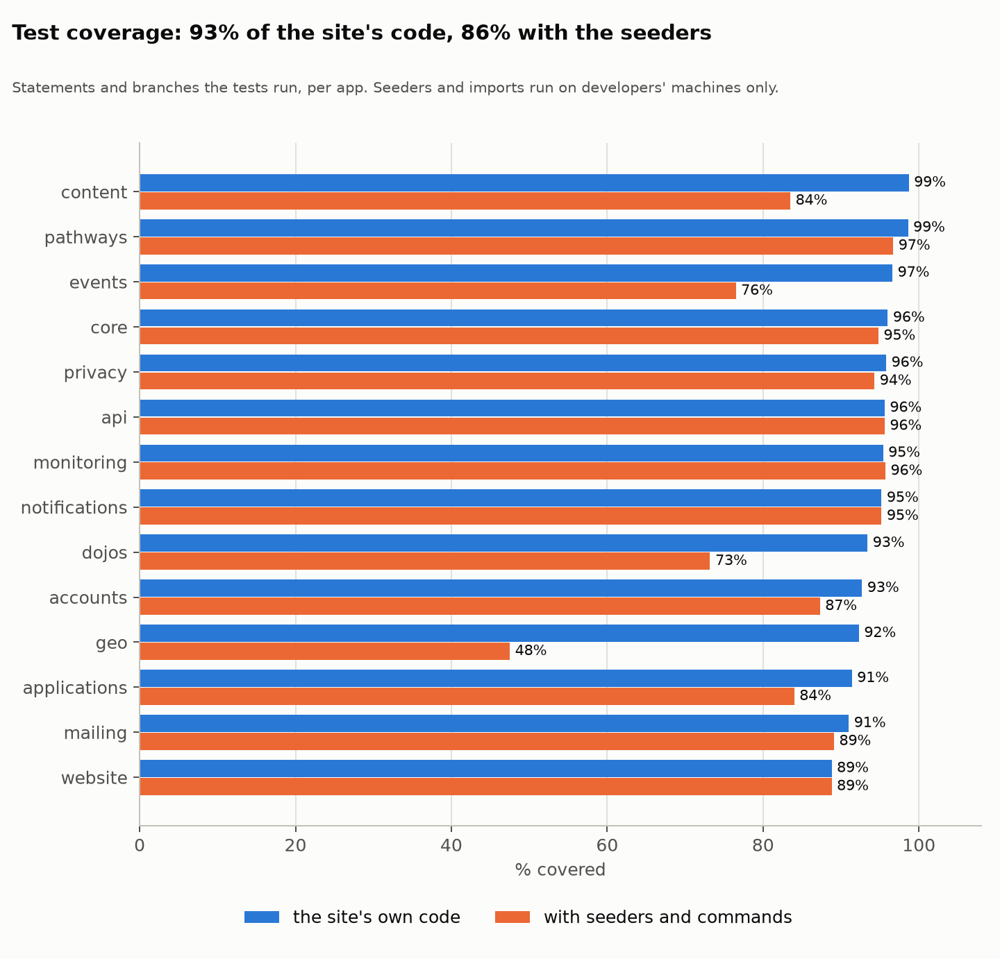
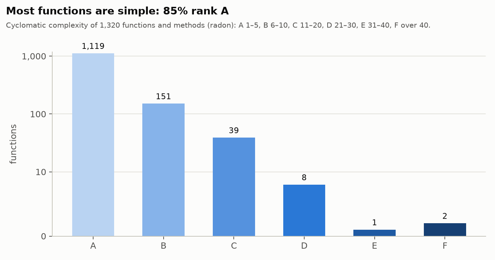
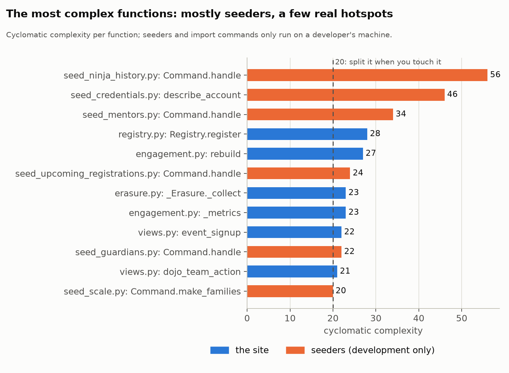

# Coding standards and code quality

How code is written, checked and measured here: the standards, the linting and formatting setup, the
tests and what they cover, and how complex the code is. For developers (and AI agents) changing the code.
Measured on **1 October 2026**; rerun the measurements ([Measuring again](#measuring-again)) every quarter.

The conventions themselves, with their reasons, live in [`CLAUDE.md`](CLAUDE.md): that file is the
authority, and this one gathers the standards, the tools that enforce them and the figures. The data model
is in [`DATA_MODEL.md`](DATA_MODEL.md), versions and audits in [`MAINTENANCE.md`](MAINTENANCE.md), load
and capacity in [`CAPACITY.md`](CAPACITY.md).

**In short:**

- **Lint, format and security rules are enforced** on every push and pull request by Ruff (`ruff check`,
  `ruff format --check`, `ruff check --extend-select S`), with `pip-audit`, `manage.py check --deploy` and
  CodeQL alongside. The editor in the devcontainer formats and sorts imports on save with the same Ruff.
- **1,092 tests** (12,400 lines of test code for 24,000 lines of code) run on every change, with a summary on
  each run's page and failures marked on the line where they failed. About twenty **guard tests** fail when
  new code forgets a project rule (privacy, audit log, admin, translations, security headers, ...).
- **Coverage: 93% of the site's code** (statements and branches); 86% counting the seeders and import
  commands that only run on a developer's machine. What isn't covered is mostly error paths of business
  rules, the ASGI routing glue and a few segment attributes.
- **Complexity is low:** an average cyclomatic complexity of 3.3, 85% of the 1,320 functions rank A. Six
  functions of the site itself are over 20, the threshold to split them at the next change.
- **Not checked:** types (no type checker), a minimum coverage, and complexity limits; the measurements
  here are a map, run by hand.

---

## Contents

1. [Production code and development-only code](#production-code-and-development-only-code)
2. [Coding standards](#coding-standards)
3. [Linting and formatting](#linting-and-formatting)
4. [Tests](#tests)
5. [Test coverage](#test-coverage)
6. [Complexity and maintainability](#complexity-and-maintainability)
7. [Commits, reviews and keeping documents current](#commits-reviews-and-keeping-documents-current)
8. [Measuring again](#measuring-again)

---

## Production code and development-only code

`scripts/deploy.sh` ships the working tree minus its `EXCLUDES_RE`; everything else in this repository is
for developers. Where the line runs:

| What | Where | On production? |
|---|---|---|
| **The site** | the apps (`accounts/`, `api/`, `applications/`, `content/`, `core/`, `dojos/`, `events/`, `geo/`, `mailing/`, `monitoring/`, `notifications/`, `pathways/`, `privacy/`), `website/` (settings, URLs, ASGI, Celery), `locale/`, `main.py`, `manage.py` | **yes**: this is production code |
| Its dependencies | `requirements.txt` | **yes**, installed by every deploy |
| The web server's config | `gunicorn.conf.py` (the cap of requests per worker) | **yes**, read by gunicorn from `~/app` |
| The Celery workers' units | `scripts/systemd/*.service` | **yes**, installed by `deploy.sh` into systemd (the rest of `scripts/` stays local) |
| Tests | `*/tests.py`, `*/testing.py` | shipped inside the apps, never run there |
| Seeders | `*/management/commands/seed_*.py`, `applications/seeding.py`, `accounts/seed_credentials.py`, `core/seed_translations.py` | shipped inside the apps; demo data, run only in the devcontainer (`.devcontainer/start.sh`). The ones that matter in production are idempotent and safe: `load_mail_templates` (create-only, run by `deploy.sh`) |
| Import commands | `*/management/commands/import_*.py` | shipped, but their libraries (`geopandas`, `pandas`, ...) are only in `requirements-dev.txt`, so they only work in development |
| Development-only commands | `totp_code`, `simulate_bounce` | refuse to run without `DEBUG` |
| Development-only switches | django-debug-toolbar, django-silk | only while `DEBUG` (or `SILK`) is on; neither is installed on production |
| The development environment | `.devcontainer/` (Docker Compose, nginx, MySQL, Redis, Mailpit, phpMyAdmin, 2FAuth, `start.sh`, certificates) | **no** |
| Developer tooling | `requirements-dev.txt`, `pyproject.toml` (Ruff, coverage), `loadtest/`, `quality/`, `user-journeys/` | **no** |
| Deploying | `scripts/deploy.sh` | **no**: runs from a developer's machine |
| CI | `.github/` (workflows, `scripts/test_report.py`) | **no**: runs on GitHub |
| The help centre | `docs/` | **no**: published to GitHub Pages by its own workflow |
| Documents | `README.md`, `MAINTENANCE.md`, `SECURITY.md`; `CLAUDE.md`, `DATA_MODEL.md`, `CAPACITY.md`, this file | the first three ship (harmless); the others don't |

So **a change to production code** is anything in the apps (other than tests and seeders), `website/`,
`locale/`, `requirements.txt`, `gunicorn.conf.py` or the systemd units: it needs its tests, goes through CI,
and reaches the site at the next `deploy.sh`. A change to the devcontainer needs a container rebuild (or the
restart its file says), never a deploy.

## Coding standards

**Python.** Python 3.14 (`target-version` for Ruff is 3.12, the oldest syntax allowed), Django 6.1.

- **Style is Ruff's formatter**: 119 characters a line, double quotes, imports sorted by Ruff (`I`). Don't
  format by hand, and don't argue with it: `ruff format .` decides.
- **Write like the surrounding code**: its naming, its comment density, its idiom. Comments say *why*,
  in full sentences, where the code can't; docstrings on modules and on anything with a rule behind it.
- **Names** in the domain's words, with the nomenclature of `CLAUDE.md` (*Champion*, *Mentor*, *Ninja*,
  *Youth mentor*, *Badge*, *Belt*); in code and in the interface alike.
- **No f-strings in translatable text**, no `print` in the site, logging through `logging.getLogger(__name__)`.

**Django conventions** (each one in `CLAUDE.md` with its reason):

| Rule | Where |
|---|---|
| **Rules live in services; views only call them** and turn their error into a message | `dojos.team`, `events.registrations`, `events.awards`, `events.attendance`, `applications.services`, `accounts.child_accounts`, `accounts.two_step`, `accounts.login_links`, `mailing.services.send`, `privacy.erasure`, ... |
| **Access goes through one helper**, and a page you may not see is a 404, not a 403 | `dojos.access.require_dojo_access`, `accounts.organisation.require_area` |
| **Every form's texts are on the `Form`, translated**; a template renders `{{ form }}` | `core/forms.py`, `SiteFormTextsAreTranslatedTests` |
| **No inline JavaScript**: no `onclick=`, no `hx-on`, scripts only with the CSP nonce | `SecurityHeadersTests` scans every template |
| **A model's `__str__` never queries** (it breaks under ASGI) | `StrNeverQueriesTests` |
| **Distances in the database** with `geo.functions.DistanceSphere`, never `Distance()` or Python | `dojos/search.py` |
| **Uploads through `core.uploads`**: `UploadedImageField`, document validators | `UploadGuardrailTests` |
| **`QuerySet.update()` skips signals and the audit log**: use `save()` where either matters | the audit log, upload cleanup, cache clearing |
| **A new model or field** gets its privacy classification and its audit-log decision in the same change | `EveryFieldIsClassifiedTests`, `AuditLogCoverageTests` |
| **The Django admin stays fully usable** for every model | `AdminStaysFullyUsableTests` |
| **Every migration is committed** with the model change | `makemigrations --check` in CI |
| **Settings come from the environment** (`env(...)` with a default); secrets never in the code | `website/settings.py` |

**Templates and front end.** Server-rendered templates with htmx; plain HTML and CSS for what needs no
server; JavaScript only in `core/static/core/js/bundle.js`. Third-party browser code is vendored, never from
a CDN (`VendoredHtmxTests`). Every text in a template is translated (``).

**Languages.** Everything a person sees is in English, Dutch (informal *je*) and French (*vous*):
`makemessages`, translate, `compilemessages`, commit the `.po` and `.mo` (`CLAUDE.md`, "i18n"). The help
centre has its own catalogs (`docs/README.md`).

## Linting and formatting

Everything is **Ruff**, pinned in `requirements-dev.txt` (the same version locally and in CI), configured
in `pyproject.toml`:

| Rules | What they catch |
|---|---|
| `E`, `W` (pycodestyle) | style errors and warnings; line length is left to the formatter (`E501` off) |
| `F` (pyflakes) | unused imports and variables, undefined names |
| `I` (isort) | import order |
| `B` (flake8-bugbear) | likely bugs: mutable defaults, `zip()` without `strict=`, ... |
| `DJ` (flake8-django) | Django pitfalls: `null=True` on text fields, model method order, ... |
| `UP` (pyupgrade) | old syntax where newer Python has a better form |
| `S` (flake8-bandit), **separately** | security: SQL built from strings, `eval`, weak hashes, XML parsing, ... |

- **Security rules** run on their own (`ruff check --extend-select S .`), so they never block a quick
  local lint. Tests, seeders, `user-journeys/` and `loadtest/` are left out in `pyproject.toml`. A finding on a
  line that is fine gets `# noqa: Sxxx` **with its reason** on the line above; never a bare `noqa`.
- **Formatting**: `ruff format .` (CI runs `ruff format --check .`). Migrations are left alone.
- **In the editor**: the devcontainer installs Ruff's VS Code extension and formats Python on save, with
  imports sorted, using the Ruff from `requirements-dev.txt` (`.devcontainer/devcontainer.json`). A container
  rebuild picks it up.
- **Locally** before pushing:

  ```sh
  ruff check . && ruff check --extend-select S . && ruff format --check .
  python manage.py makemigrations --check --dry-run
  ```

**In CI** (GitHub Actions; details in `MAINTENANCE.md`, "Code audits"):

| Workflow | Checks |
|---|---|
| **Tests** (`tests.yml`) | missing migrations; the whole test suite against MySQL 8.4 and Redis 7.2; the results summary |
| **Code audit** (`audit.yml`) | `ruff check`, `ruff format --check`, the security rules, `pip-audit` over both requirement files, `manage.py check --deploy` with `DEBUG` off, CodeQL |
| **Help centre** (`docs.yml`) | the Sphinx build with warnings as errors, in three languages |

**Not checked automatically**, on purpose for now: types (no mypy or pyright: the code isn't annotated
throughout, and a partial check gives false comfort), a minimum coverage, and complexity limits (see their
sections: they're measured, not gated).

## Tests

**Running them** (inside the devcontainer, `CLAUDE.md`, "Commands"):

```sh
python manage.py test --debug-mode                      # everything, about 6 minutes
python manage.py test events                            # one app
python manage.py test events.tests.BookingTests         # one class
```

**How tests are written:**

- **Route tests** check the status code, the template, the gating (anonymous, the wrong role: 404 or 403)
  and **the database effect of a POST**, not only the response.
- **Services are tested directly**, including their refusals (the error and its message).
- **Concurrency** is tested with real threads in a `TransactionTestCase` (`BookingConcurrencyTests`), and so
  are Channels consumers (their database access runs on another thread).
- **Celery tasks** are called as functions, never `.delay()`. **Files** go to a throwaway `MEDIA_ROOT`
  (`core.testing.TempMediaMixin`). **Logins** through `core.testing` (`login_data`, `login_verified`).
- **New behaviour comes with its test** in the app's `tests.py`; a bug fix with a test that fails without it.

**Guard tests** enforce project rules on all code, including code not written yet:

| Test | Fails when |
|---|---|
| `privacy.tests.EveryFieldIsClassifiedTests` | a field of any model has no GDPR classification |
| `privacy.tests.ExportCoverageTests` | a model with personal data isn't in a person's data export |
| `core.tests.AuditLogCoverageTests` | a model has no audit-log decision |
| `core.tests.AdminStaysFullyUsableTests` | a superuser can't add, change or delete a registered model |
| `core.tests.StrNeverQueriesTests` | a model's `__str__` runs a query |
| `core.tests.SiteFormTextsAreTranslatedTests` | a form shows an untranslated label or help text |
| `core.tests.SecurityHeadersTests` | a header is missing, or a template has an inline event handler |
| `core.tests.VendoredHtmxTests`, `FontsTests`, `geo.tests.MapWidgetAssetsTests` | a page loads a script or font from another site |
| `api.tests...test_the_schema_never_holds_sensitive_fields` | the API's schema exposes health, criminal or security data |
| `monitoring.tests.CapacityModelTests.test_every_growing_table_exists` | the capacity model names a table that's gone |

**Results on GitHub:** every Tests run shows a summary on its page (totals, a table per app, each failed
test with its traceback, the slowest tests), marks each failure on the line where it failed, and keeps the
JUnit XML 30 days; the README's badge shows `main`'s result.

## Test coverage

Measured with **coverage.py over the whole suite, branches included** (configured in `pyproject.toml`:
tests, migrations and tooling left out).



| | Statements | Branches | Covered (statements and branches) | Lines only |
|---|---:|---:|---:|---:|
| The site's own code | 10,503 | 2,172 | **93%** | 95% |
| Seeders and import commands (development only) | 1,767 | 584 | 51% | 52% |
| Other management commands | 222 | 56 | 58% | 60% |
| **Everything** | 12,492 | 2,812 | **86%** (1,428 lines and 682 branches not run) | 89% |

**What's covered well:** the business rules and their services (registrations, teams, awards, onboarding,
mail, privacy, sign-in), every page's gating, the API, monitoring, and every guard rule above. Most apps' own
code is at 91–99%.

**What isn't, and why:**

| Not covered | Where | Why, and whether to close it |
|---|---|---|
| Seeders and import commands | `seed_*`, `import_*` (51%) | development-only; they run whenever the devcontainer seeds its database, which is their real test. Leave. |
| Rule-violation branches of services | e.g. `dojos/team.py` (86%): "already handled", "the champion can't be removed", "only active members"; `accounts/invitations.py` (84%) | the refusals of a rule nobody tests yet. **Close these**: a refusal that silently stopped working is a real bug. |
| Segment attributes | `mailing/segmentation/attributes/changes.py` (66%), `event.py` (71%) | the validation and sentence of "stage changed" and event rules. Close when touching segments. |
| Admin actions | `applications/admin.py` (80%), `mailing/admin.py` (89%) | the technical fallback; the dashboard pages are covered. Low priority. |
| Error paths of outside services | `mailing/bounce.py` (90%), `geo/geocoding.py` (83%) | mailbox and Nominatim failures; partly covered with mocks. |
| Routing glue | `website/asgi.py`, `notifications/routing.py` (0%) | loaded by the server, not by tests (consumers are tested directly). A smoke test could import them. |
| Thin task wrappers | `*/tasks.py` (60–80%) | one-line Celery wrappers around tested functions. Leave. |

**How we use coverage** (good practice):

- **Coverage is a map, not a target.** It shows what no test runs; it can't show that a test checks the right
  thing. A test that runs a line without asserting its effect counts as covered. So there's no minimum in CI:
  a number to hit invites tests written for the number.
- **Branch coverage, always.** Line coverage hides the `else` nobody takes: the refusals above are exactly that.
- **Cover rules first.** Services, access checks and anything that decides about people's data or money-like
  limits (places, waiting lists, consent) should be close to 100% including their refusals; glue, admin
  fallbacks and seeders matter less.
- **Don't let it drop.** A change that lowers its app's coverage needs a reason; the quarterly measurement
  shows the trend per app.
- **A bug gets a test that fails without the fix** (as the booking race did), so it can't come back.

## Complexity and maintainability

Measured with **radon**: cyclomatic complexity per function (the number of independent paths through it) and
the maintainability index per module, over the same code as coverage (tests and migrations left out):
23,900 lines in 290 files.



| Rank | Complexity | Functions | Meaning |
|---|---|---:|---|
| A | 1–5 | 1,119 (85%) | simple |
| B | 6–10 | 151 | fine |
| C | 11–20 | 39 | review when you change it |
| D | 21–30 | 8 | split it when you touch it |
| E, F | over 30 | 3 | all three are seeders |

Average: **3.3**.



**The site's hotspots** (complexity over 20):

| Function | Complexity | Why it's complex, and what would help |
|---|---:|---|
| `privacy.registry.Registry.register` | 28 | validates every way a model's privacy declaration can be wrong; split the checks into small functions per rule |
| `events.engagement.rebuild` | 27 | one pass computing every child's stages per dojo; extract the per-child step |
| `privacy.erasure._Erasure._collect` | 23 | finds every row about a person through the registry; one function per kind of link |
| `events.engagement._metrics` | 23 | the attendance figures behind a stage; small helpers per figure |
| `events.views.event_signup` | 22 | the child-ordering and page state around `events.registrations.sign_up`; move the form handling into a `Form` |
| `dojos.views.dojo_team_action` | 21 | one view for every Team-page action; a dispatch table of small handlers |

**Maintainability index** (radon, 0–100, A above 19): every module ranks A. The lowest, all large modules
with many views: `mailing/manage.py` (24.6), `accounts/views.py` (24.9), `dojos/views.py` (26.0). Splitting
a large views module by area (as `accounts/security_views.py` already is) raises it.

**Guidelines:**

- Keep functions at A or B. **Over 20, split at the next change** to that function, not in a separate
  "refactoring" change that nobody reviews properly.
- Seeders may stay long (they're scripts), but `seed_ninja_history` (56) and `describe_account` (46) are hard
  to change safely: split them when they next need work.
- Complexity limits aren't enforced in CI yet. When the six hotspots are split, Ruff's `C901` with
  `max-complexity = 20` (seeders excluded) can keep it that way.

## Commits, reviews and keeping documents current

- **Commits**: a summary line that says what changed for whom, then a body with the why and the parts. Small,
  coherent commits on `main` (or a branch with a pull request for larger work). Commits made by Claude in the
  devcontainer carry Claude's identity and a `Co-Authored-By` line.
- **Before pushing**: the lint commands above, the tests of what you touched (the whole suite for anything
  shared), and the user-journey check for user-facing pages (`python3 user-journeys/scripts/check_journeys.py`).
- **CI must be green.** A security finding on a line that's fine gets its `noqa` with a reason; an advisory
  that can't be reached here gets an `--ignore-vuln` together with its row in `MAINTENANCE.md`'s security log.
- **Documents change with the code** (`CLAUDE.md`, "Workflow rules"): the help centre in three languages for
  a user-facing flow, `MAINTENANCE.md` for a dependency or image, `DATA_MODEL.md` for a model, `CAPACITY.md`
  for something that grows, `CLAUDE.md` for a convention, and this file when a standard or tool changes.

## Measuring again

In the devcontainer (coverage and radon are in `requirements-dev.txt`; the charts use the load test's venv
with matplotlib, `loadtest/requirements.txt`):

```sh
export EXCLUDE="*/migrations/*,*/tests.py,*/tests/*,docs/*,loadtest/*,user-journeys/*,staticfiles/*,media/*"
coverage run manage.py test --noinput --debug-mode         # the whole suite, about 8 minutes
coverage report --skip-covered --sort=cover                # the gaps, file by file
coverage html                                              # htmlcov/index.html: every missed line
coverage json -o /tmp/coverage.json
radon cc -j -e "$EXCLUDE" . > /tmp/cc.json
radon mi -j -e "$EXCLUDE" . > /tmp/mi.json
radon raw -j -e "$EXCLUDE" . > /tmp/raw.json
radon cc -nc -e "$EXCLUDE" .                               # every function ranked C or worse
python3 quality/summarize.py /tmp/coverage.json /tmp/cc.json /tmp/mi.json /tmp/raw.json \
    > quality/results/$(date +%F).json
<venv>/bin/python quality/charts.py quality/results/$(date +%F).json
```

Commit `quality/results/` and `quality/charts/`, update the figures here and rebuild the technical PDF
(`user-journeys/scripts/build_technical.py`), whose chapter *Coding standards and quality* summarises this file.
