# Data model

How the CoderDojo Belgium site's data fits together, one diagram per area.
This is for developers. The end-user help centre lives in `docs/`, and the
conventions and gotchas live in `CLAUDE.md`. The diagrams are
[Mermaid](https://mermaid.js.org/), which GitHub and VS Code's Markdown
preview render inline.

Each diagram shows only the fields that carry meaning. Plain text and
display fields (descriptions, taglines, photos, …) are left out; the models
in each app's `models.py` have the full field lists. If you change a model,
update its diagram in the same change.

> **The redesign has landed** (all eight phases). Sections 1–9 describe the
> model as it is in the code today. [Section 10](#10-redesign-rationale-and-plan)
> keeps the design rationale, the decisions behind it and the
> [implementation plan](#implementation-plan). It also sets the
> [nomenclature](#nomenclature) (Champion, Mentor/Coach, Ninja, Youth
> mentor, Badge, Belt) that the code and the UI use.

**Contents**

1. [Overview](#1-overview)
2. [Accounts and roles](#2-accounts-and-roles)
3. [Dojos, team pages and admin access](#3-dojos-team-pages-and-admin-access)
4. [Events, registrations and attendance](#4-events-registrations-and-attendance)
5. [Badges and belts](#5-badges-and-belts)
6. [Applications and background checks](#6-applications-and-background-checks)
7. [Learning pathways and content](#7-learning-pathways-and-content)
8. [Notifications](#8-notifications)
9. [Geo reference data](#9-geo-reference-data)
10. [Redesign: rationale and plan](#10-redesign-rationale-and-plan)
11. [Mailing and segmentation (work in progress)](#11-mailing-and-segmentation-work-in-progress)
12. [Organisation events and promotion (later)](#12-organisation-events-and-promotion-later)

---

## 1. Overview

The main entities and how they connect, grouped by the Django app that owns them.

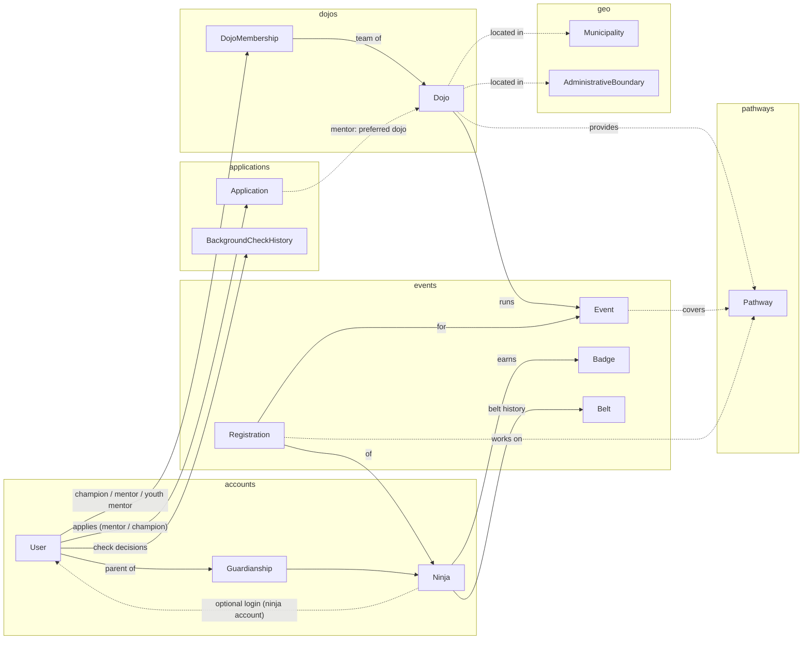
```mermaid
flowchart LR
    subgraph accounts
        User
        Guardianship
        Ninja
    end
    subgraph dojos
        Dojo
        DojoMembership
    end
    subgraph events
        Event
        Registration
        Badge
        Belt
    end
    subgraph applications
        Application
        BackgroundCheckHistory
    end
    subgraph pathways
        Pathway
    end
    subgraph geo
        Municipality
        AdministrativeBoundary
    end

    User -- "champion / mentor / youth mentor" --> DojoMembership
    DojoMembership -- "team of" --> Dojo
    User -- "parent of" --> Guardianship
    Guardianship --> Ninja
    Ninja -. "optional login (ninja account)" .-> User
    Dojo -- runs --> Event
    Registration -- for --> Event
    Registration -- of --> Ninja
    Dojo -. "provides" .-> Pathway
    Event -. "covers" .-> Pathway
    Registration -. "works on" .-> Pathway
    Ninja -- earns --> Badge
    Ninja -- "belt history" --> Belt
    User -- "applies (mentor / champion)" --> Application
    User -- "check decisions" --> BackgroundCheckHistory
    Application -. "mentor: preferred dojo" .-> Dojo
    Dojo -. located in .-> Municipality & AdministrativeBoundary
```

---

## 2. Accounts and roles

`accounts.User` is every login, with `account_type` telling the two kinds
apart: a normal **adult** account, or a **ninja**'s own login. There are no
role subclasses (redesign phases 1–3, section 10).

- **Parents** are plain adult accounts linked to their children through
  `Guardianship`. A child can have more than one guardian, and any adult
  account can add children from its account page. No background check is
  ever needed for that.
- **Champions and mentors** are adult accounts with an approved
  `Application` (section 6) and a **valid background check on the
  account**; what they do at a dojo is a `DojoMembership` (section 3).
- A **`Ninja`** (a child aged 7–17 attending sessions; the age rule is
  checked whenever a date of birth is entered or changed) is **not** a user. It
  gets a login (a `User` with `account_type="ninja"`, linked through
  `Ninja.account`) only if a parent opts it in.
- **Organisation accounts** are adult accounts with an `OrganisationRole`
  (`board` or `admin`): access to the organisation's management
  dashboards, which for now are the Django admin. A role makes the account
  staff and puts it in a matching permission group (`accounts.organisation`,
  kept in sync by signals): the **board** gets read-only oversight (dojos,
  teams, events, applications, badges and belts) and maintains the
  organisation's team listing; **admins** also edit dojos, events, site
  content and the pathway/badge/belt catalogues. Neither can award belts,
  review background checks (a separate permission) or see families'
  personal data. Being listed on the organisation's team page
  (`content.OrganisationTeamMember`) is separate from having a role.

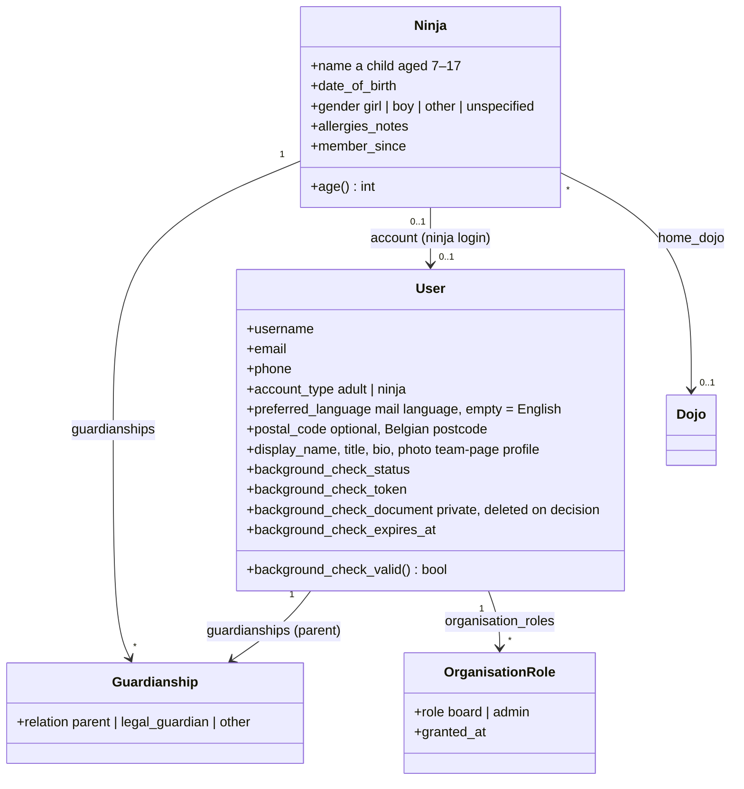
```mermaid
classDiagram
    direction TB
    class User {
        +username
        +email
        +phone
        +account_type  adult | ninja
        +preferred_language  mail language, empty = English
        +postal_code  optional, Belgian postcode
        +display_name, title, bio, photo  team-page profile
        +background_check_status
        +background_check_token
        +background_check_document  private, deleted on decision
        +background_check_expires_at
        +background_check_valid() bool
    }
    class Guardianship {
        +relation  parent | legal_guardian | other
    }
    class Ninja {
        +name  a child aged 7–17
        +date_of_birth
        +gender  girl | boy | other | unspecified
        +allergies_notes
        +member_since
        +age() int
    }

    User "1" --> "*" Guardianship : guardianships (parent)
    Ninja "1" --> "*" Guardianship : guardianships
    Ninja "0..1" --> "0..1" User : account (ninja login)
    Ninja "*" --> "0..1" Dojo : home_dojo
    class OrganisationRole {
        +role  board | admin
        +granted_at
    }
    User "1" --> "*" OrganisationRole : organisation_roles
```

Which account does what:

| Account | Created by | Background check | Lands on after login |
|---|---|---|---|
| adult (parent) | self-service sign-up (`register_guardian`) | never needed | their account page (`/account/`) |
| adult champion / mentor | the same self-service sign-up, then an approved `Application` | required for dojo access (a lapsed check blocks the dashboards, never the login) | first accessible dojo's dashboard |
| ninja | a parent opts a child in | none | the ninja's own page (`/account/ninja/<id>/`) |
| adult with an `OrganisationRole` | the same sign-up; the role is granted in the admin | not for the role itself | as any adult; the menu's **Organisation** link opens the admin |

---

## 3. Dojos, teams and admin access

A dojo's team is a set of **memberships** (`DojoMembership`), one per
account and dojo (redesign phase 2, section 10). Each membership has a role
and a status:

- **Roles:** `champion` (the dojo's owner, exactly one active per dojo),
  `mentor` (an adult helper) and `youth_mentor` (a ninja account, promoted by
  a champion/mentor of the same dojo, recorded in `promoted_by`).
- **Status:** `requested` → `active` → `dormant`. People who leave go
  `dormant` and are never deleted, so past events' teams (`Event.team`) keep
  their history. Rejoining reuses the same row.
- **Profiles:** the team-page profile (display name, title, bio, photo,
  `show_on_team_pages`) lives on the **account** and is shared by every dojo
  the person is on.
- **Dojo status:** `draft` → `active` ⇄ `dormant` → `archived` → `draft`.
  Only `active` dojos, and their events, are public (`Dojo.objects.public()`,
  `Event.objects.visible()`). All changes go through `dojos/team.py`.

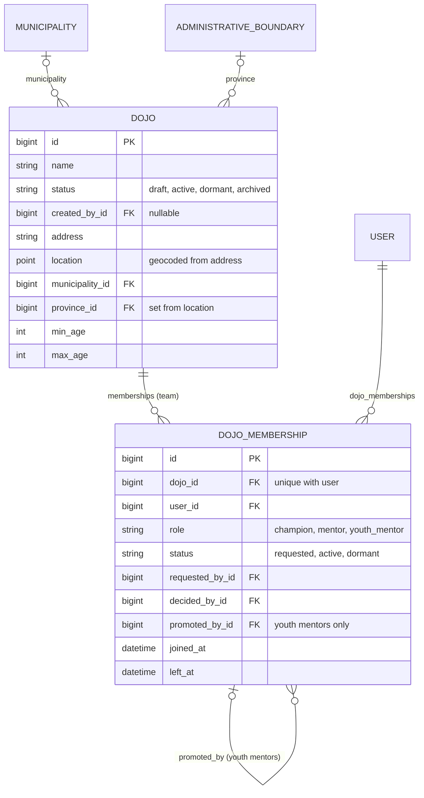
```mermaid
erDiagram
    DOJO ||--o{ DOJO_MEMBERSHIP : "memberships (team)"
    USER ||--o{ DOJO_MEMBERSHIP : "dojo_memberships"
    DOJO_MEMBERSHIP |o--o{ DOJO_MEMBERSHIP : "promoted_by (youth mentors)"
    MUNICIPALITY |o--o{ DOJO : "municipality"
    ADMINISTRATIVE_BOUNDARY |o--o{ DOJO : "province"

    DOJO {
        bigint id PK
        string name
        string status "draft, active, dormant, archived"
        bigint created_by_id FK "nullable"
        string address
        point location "geocoded from address"
        bigint municipality_id FK
        bigint province_id FK "set from location"
        int min_age
        int max_age
    }
    DOJO_MEMBERSHIP {
        bigint id PK
        bigint dojo_id FK "unique with user"
        bigint user_id FK
        string role "champion, mentor, youth_mentor"
        string status "requested, active, dormant"
        bigint requested_by_id FK
        bigint decided_by_id FK
        bigint promoted_by_id FK "youth mentors only"
        datetime joined_at
        datetime left_at
    }
```

### Who can use a dojo's admin area

`dojos/access.py` gives admin access to an account with an **active
`champion` or `mentor` membership** at the dojo, and only while its
background check is valid. Youth mentors never get admin access, and
neither do requested or dormant memberships. Each role maps to a set of
capabilities. With no role at all the dojo gives a **404**; a role that
lacks the view's capability gets a **403**.

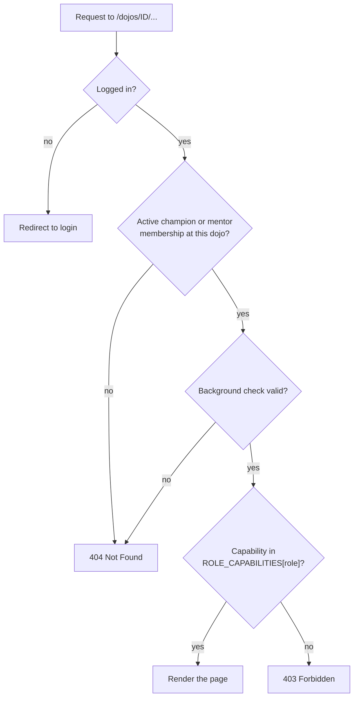
```mermaid
flowchart TD
    R[Request to /dojos/ID/...] --> A{Logged in?}
    A -- no --> L[Redirect to login]
    A -- yes --> M{"Active champion or mentor<br/>membership at this dojo?"}
    M -- no --> N404[404 Not Found]
    M -- yes --> V{Background check valid?}
    V -- no --> N404
    V -- yes --> C{"Capability in<br/>ROLE_CAPABILITIES[role]?"}
    C -- yes --> OK[Render the page]
    C -- no --> N403[403 Forbidden]
```

| Capability | Gates | CHAMPION | MENTOR |
|---|---|:-:|:-:|
| *(any role)* | dashboard, events list, notification bell | ✓ | ✓ |
| `TAKE_ATTENDANCE` | attendance pages, marking present/absent | ✓ | ✓ |
| `MANAGE_EVENTS` | create/edit events, change status | ✓ | ✓ |
| `EDIT_SETTINGS` | dojo profile settings | ✓ | ✓ |
| `MANAGE_TEAM` | accept/decline join requests, add/remove mentors, promote youth mentors | ✓ | ✓ |
| `AWARD_BELTS` | award a ninja a belt (from the attendance list) | ✓ | ✓ |
| `MANAGE_LIFECYCLE` | launch / dormant / archive / reopen the dojo | ✓ | — |
| *(champion only)* | hand over the champion role | ✓ | — |

To restrict mentors, remove entries from `ROLE_CAPABILITIES[MENTOR]`.
Who may *join* a team at all is `access.is_approved_mentor`: an adult account
with an approved mentor (or champion) `Application` and a valid background
check (`applications.services`).

---

## 4. Events, registrations and attendance

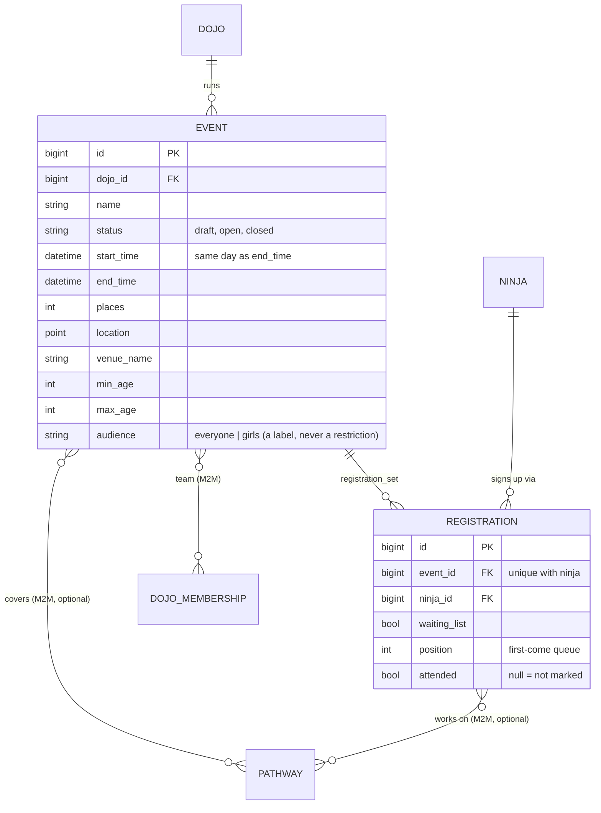
```mermaid
erDiagram
    DOJO ||--o{ EVENT : "runs"
    EVENT ||--o{ REGISTRATION : "registration_set"
    NINJA ||--o{ REGISTRATION : "signs up via"
    EVENT }o--o{ PATHWAY : "covers (M2M, optional)"
    REGISTRATION }o--o{ PATHWAY : "works on (M2M, optional)"
    EVENT }o--o{ DOJO_MEMBERSHIP : "team (M2M)"

    EVENT {
        bigint id PK
        bigint dojo_id FK
        string name
        string status "draft, open, closed"
        datetime start_time "same day as end_time"
        datetime end_time
        int places
        point location
        string venue_name
        int min_age
        int max_age
        string audience "everyone | girls (a label, never a restriction)"
    }
    REGISTRATION {
        bigint id PK
        bigint event_id FK "unique with ninja"
        bigint ninja_id FK
        bool waiting_list
        int position "first-come queue"
        bool attended "null = not marked"
    }
```

- **Places:** `Event.places_left` = `places` − confirmed registrations
  (those with `waiting_list=False`). When a confirmed place is cancelled,
  the next person on the waiting list is promoted and the dojo's team (its
  active champion and mentors) is
  notified.
- **Attendance:** `Registration.attended` has three states: `None` (not
  marked yet), `True` (present), `False` (absent). Only confirmed
  registrations can be marked.
- **Pathways:** `Event.pathways` (what the session covers, shown on its
  public page) is pre-selected from `Dojo.pathways` on a new event;
  `Registration.pathways` (what this ninja works on) is set to the
  event's at signup and narrowed by the team from the attendance list
  (`dojo_event_registration_pathways`, `TAKE_ATTENDANCE`). Neither is
  restricted to the level above. See section 7.

### Event status

The dojo's team sets any status directly (`dojo_event_set_status`); it isn't a
one-way lifecycle. Existing registrations are kept whatever the status.

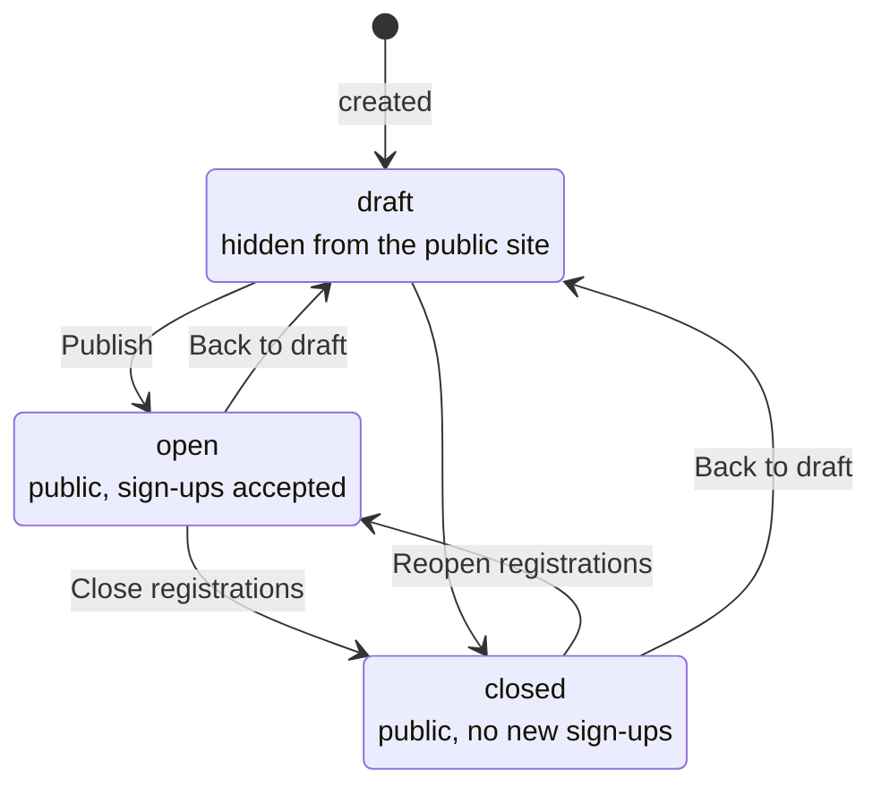
```mermaid
stateDiagram-v2
    [*] --> draft : created
    draft --> open : Publish
    open --> closed : Close registrations
    closed --> open : Reopen registrations
    open --> draft : Back to draft
    closed --> draft : Back to draft
    draft --> closed

    draft : draft<br/>hidden from the public site
    open : open<br/>public, sign-ups accepted
    closed : closed<br/>public, no new sign-ups
```

---

## 5. Badges and belts

Two separate things a ninja collects (redesign phase 5), both in `events`
with their rules in `events/awards.py`:

- A **badge** is an award: either a **one-off** ("did the thing", e.g.
  attended a CoderDojo for Girls session) or a **milestone** reached by a
  number of sessions attended (the attendance wristbands). `NinjaBadge`
  holds one ninja's progress on one badge. Milestones are recomputed
  (`sync_milestones`) whenever the dojo team marks attendance; an earned
  badge stays earned if a mark is later undone.
- A **belt** is a ninja's **proficiency level**: one overall track ordered
  by `Belt.level`, not linked to pathways. `NinjaBelt` is an append-only
  history (current belt = the highest level, `Ninja.current_belt`).
  Only an **active champion or mentor** with a valid check
  (`AWARD_BELTS`) can award one (`award_belt`), from the attendance list,
  to a ninja who has been to one of that dojo's sessions, and only a belt
  above the ninja's current one. Each row records the account, the
  membership and that membership's role at the time ("Jan, as mentor of
  CoderDojo Ghent"). A milestone badge can optionally `grants_belt`:
  reaching it awards that belt as the membership that marked the
  attendance.

The ninja's page shows the current belt with its history, and the
badges carousel. The attendance list shows each ninja's current belt.

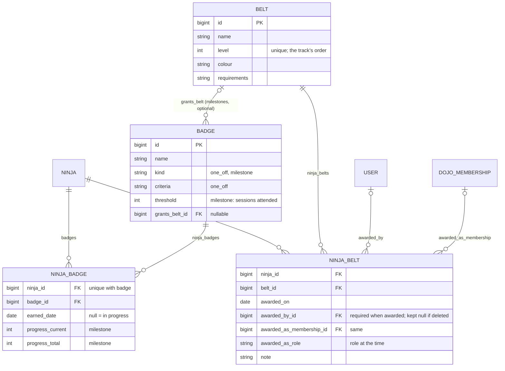
```mermaid
erDiagram
    NINJA ||--o{ NINJA_BADGE : "badges"
    BADGE ||--o{ NINJA_BADGE : "ninja_badges"
    NINJA ||--o{ NINJA_BELT : "belts (history)"
    BELT ||--o{ NINJA_BELT : "ninja_belts"
    BELT |o--o{ BADGE : "grants_belt (milestones, optional)"
    USER |o--o{ NINJA_BELT : "awarded_by"
    DOJO_MEMBERSHIP |o--o{ NINJA_BELT : "awarded_as_membership"

    BADGE {
        bigint id PK
        string name
        string kind "one_off, milestone"
        string criteria "one_off"
        int threshold "milestone: sessions attended"
        bigint grants_belt_id FK "nullable"
    }
    NINJA_BADGE {
        bigint ninja_id FK "unique with badge"
        bigint badge_id FK
        date earned_date "null = in progress"
        int progress_current "milestone"
        int progress_total "milestone"
    }
    BELT {
        bigint id PK
        string name
        int level "unique; the track's order"
        string colour
        string requirements
    }
    NINJA_BELT {
        bigint ninja_id FK
        bigint belt_id FK
        date awarded_on
        bigint awarded_by_id FK "required when awarded; kept null if deleted"
        bigint awarded_as_membership_id FK "same"
        string awarded_as_role "role at the time"
        string note
    }
```

---

## 6. Applications and background checks

Onboarding is **account-level** (redesign phase 3): an adult account applies
**once** to become a **mentor** or a **champion** (`Application`), not once
per dojo. The Belgian Article 596.2 criminal-record extract is checked **on
the account** (the `background_check_*` fields on `User`). Every review
decision is appended to `BackgroundCheckHistory`: who decided and when. The
uploaded document is **deleted as soon as a decision is made**, validate or
reject; the history never stores it. All of this lives in
`applications/services.py`.

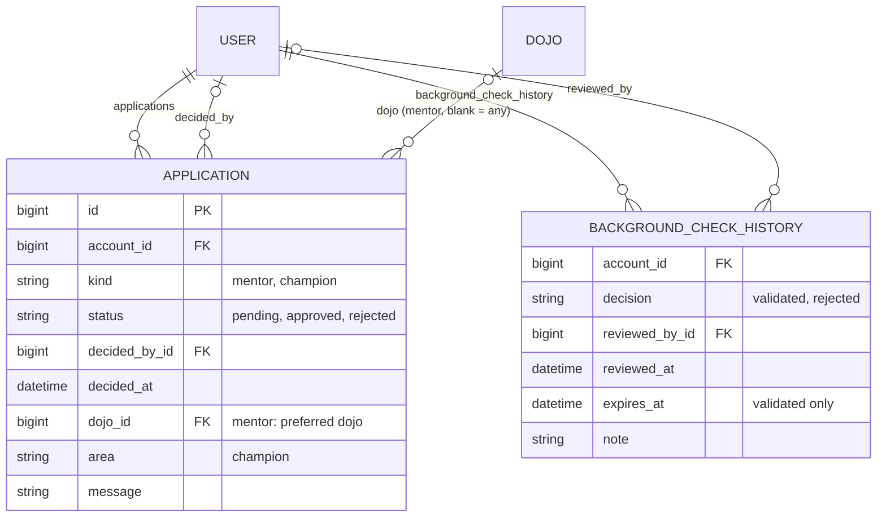
```mermaid
erDiagram
    USER ||--o{ APPLICATION : "applications"
    USER ||--o{ BACKGROUND_CHECK_HISTORY : "background_check_history"
    USER |o--o{ BACKGROUND_CHECK_HISTORY : "reviewed_by"
    USER |o--o{ APPLICATION : "decided_by"
    DOJO |o--o{ APPLICATION : "dojo (mentor, blank = any)"

    APPLICATION {
        bigint id PK
        bigint account_id FK
        string kind "mentor, champion"
        string status "pending, approved, rejected"
        bigint decided_by_id FK
        datetime decided_at
        bigint dojo_id FK "mentor: preferred dojo"
        string area "champion"
        string message
    }
    BACKGROUND_CHECK_HISTORY {
        bigint account_id FK
        string decision "validated, rejected"
        bigint reviewed_by_id FK
        datetime reviewed_at
        datetime expires_at "validated only"
        string note
    }
```

### Background check lifecycle (on the account)

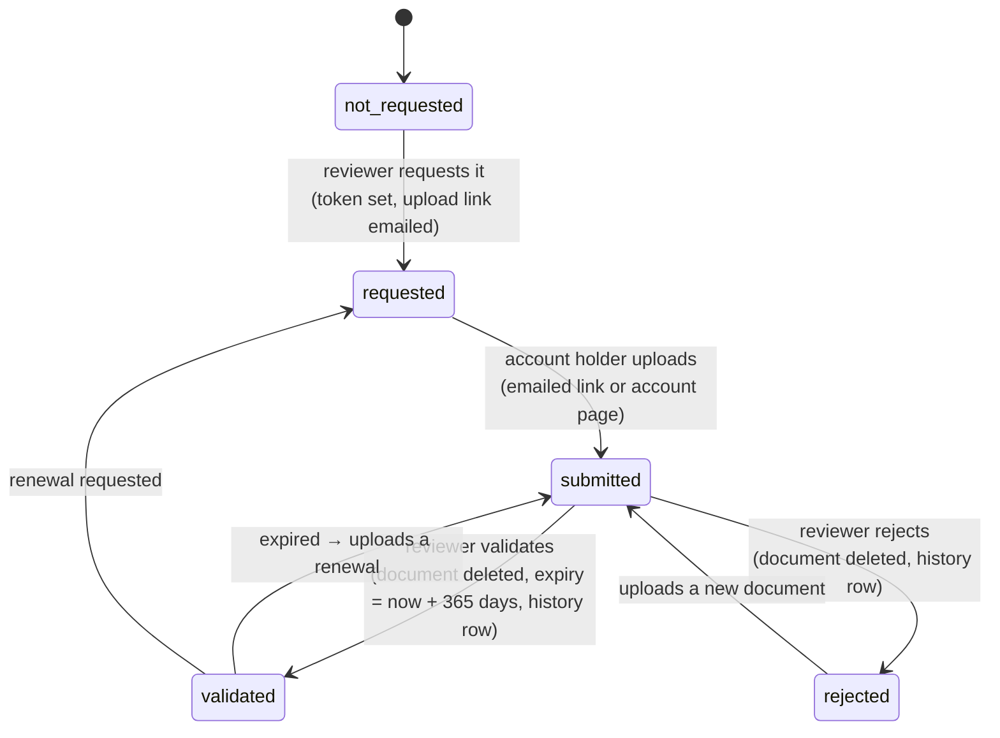
```mermaid
stateDiagram-v2
    [*] --> not_requested
    not_requested --> requested : reviewer requests it<br/>(token set, upload link emailed)
    requested --> submitted : account holder uploads<br/>(emailed link or account page)
    submitted --> validated : reviewer validates<br/>(document deleted, expiry = now + 365 days, history row)
    submitted --> rejected : reviewer rejects<br/>(document deleted, history row)
    rejected --> submitted : uploads a new document
    validated --> submitted : expired → uploads a renewal
    validated --> requested : renewal requested
```

### From application to a dojo

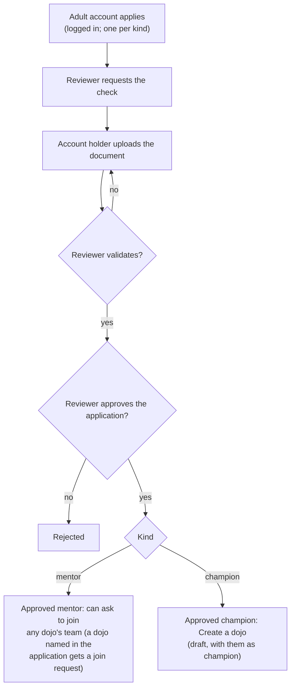
```mermaid
flowchart TD
    A["Adult account applies<br/>(logged in; one per kind)"] --> R[Reviewer requests the check]
    R --> U[Account holder uploads the document]
    U --> V{Reviewer validates?}
    V -- no --> U
    V -- yes --> P{Reviewer approves the application?}
    P -- no --> X[Rejected]
    P -- yes --> K{Kind}
    K -- mentor --> M["Approved mentor: can ask to join<br/>any dojo's team (a dojo named in the<br/>application gets a join request)"]
    K -- champion --> C["Approved champion: Create a dojo<br/>(draft, with them as champion)"]
```

A lapsed check (validated, then expired) **never blocks login**. It makes
`background_check_valid` false, so the account's champion/mentor memberships
stop granting dojo access (section 3) until a renewal is validated. The
account page links to the upload.

---

## 7. Learning pathways and content

`pathways` is a read-mostly catalogue with no enrolment state. It's
linked at three optional levels, each pre-filled from the one above:
`Dojo.pathways` (what the dojo provides, set on its Settings page and
shown on its public page) → `Event.pathways` (what a session covers) →
`Registration.pathways` (what one ninja works on; it feeds the ninja's
history and the attendance list). The `content`
models are each optionally scoped to one dojo, event or pathway, or
site-wide when the scoping key is blank.

`content.OrganisationTeamMember` is the organisation's team listing (the
homepage's "Meet the team" and `team/<id>/`). It's display only, each entry
with a position ("Member of the board" is one of them), and it's separate
from any access.

```mermaid
erDiagram
    PATHWAY ||--o{ PATHWAY_STEP : "steps (ordered)"
    PATHWAY ||--o{ PATHWAY_PROJECT : "projects"
    PATHWAY }o--o{ SKILL : "skills (M2M)"
    DOJO }o--o{ PATHWAY : "provides (M2M, optional)"
    DOJO |o--o{ FAQ : "scoped to"
    EVENT |o--o{ FAQ : "scoped to"
    PATHWAY |o--o{ FAQ : "scoped to"
    DOJO |o--o{ TESTIMONIAL : "scoped to (blank = site-wide)"
    DOJO ||--o{ ANNOUNCEMENT : "posts"
    USER |o--o{ ORGANISATION_TEAM_MEMBER : "account (optional)"

    PATHWAY {
        bigint id PK
        string name
        int min_age
        int max_age
        bool no_experience_needed
        bool runs_in_browser
    }
    PATHWAY_STEP {
        bigint pathway_id FK
        int order
        string title
    }
    FAQ {
        bigint dojo_id FK "nullable"
        bigint event_id FK "nullable"
        bigint pathway_id FK "nullable"
        string question
        int order
    }
    TESTIMONIAL {
        bigint dojo_id FK "nullable"
        string quote
        string author
    }
    ORGANISATION_TEAM_MEMBER {
        string name "display only"
        string position "e.g. Member of the board"
        int order
        bool is_public
    }
    ANNOUNCEMENT {
        bigint dojo_id FK
        date date
        string text
    }
```

---

## 8. Notifications

Each `Notification` row belongs to one recipient, so read state is per
user. An event that concerns several people creates one row per recipient.
Always create notifications through `notifications.services.notify()`: it
writes the row, then pushes the updated bell over the WebSocket channel
layer, on a best-effort basis.

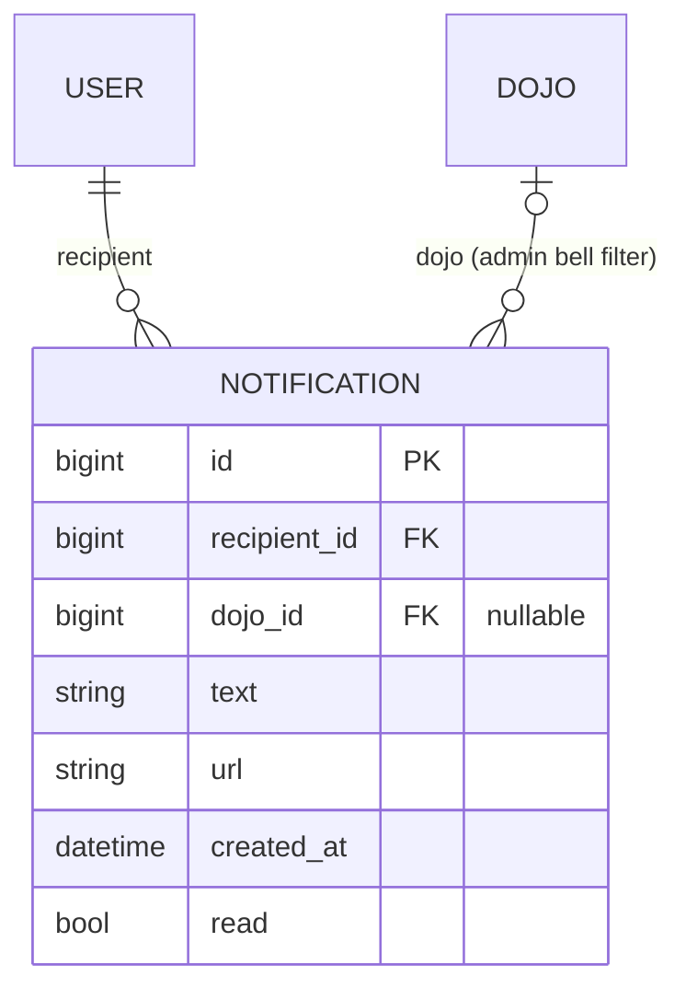
```mermaid
erDiagram
    USER ||--o{ NOTIFICATION : "recipient"
    DOJO |o--o{ NOTIFICATION : "dojo (admin bell filter)"

    NOTIFICATION {
        bigint id PK
        bigint recipient_id FK
        bigint dojo_id FK "nullable"
        string text
        string url
        datetime created_at
        bool read
    }
```

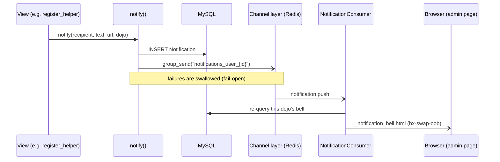
```mermaid
sequenceDiagram
    participant V as View (e.g. register_helper)
    participant S as notify()
    participant DB as MySQL
    participant CL as Channel layer (Redis)
    participant C as NotificationConsumer
    participant B as Browser (admin page)

    V->>S: notify(recipient, text, url, dojo)
    S->>DB: INSERT Notification
    S-)CL: group_send("notifications_user_{id}")
    Note over S,CL: failures are swallowed (fail-open)
    CL-)C: notification.push
    C->>DB: re-query this dojo's bell
    C-)B: _notification_bell.html (hx-swap-oob)
```

---

## 9. Geo reference data

Reference data only (seeded by `seed_geo`), with no URLs of its own. A
dojo's `province` is derived from its geocoded `location`: a
point-in-polygon lookup against `AdministrativeBoundary`, falling back to
the nearest boundary. Distance searches always use
`geo.functions.DistanceSphere` (MySQL `ST_Distance_Sphere`).

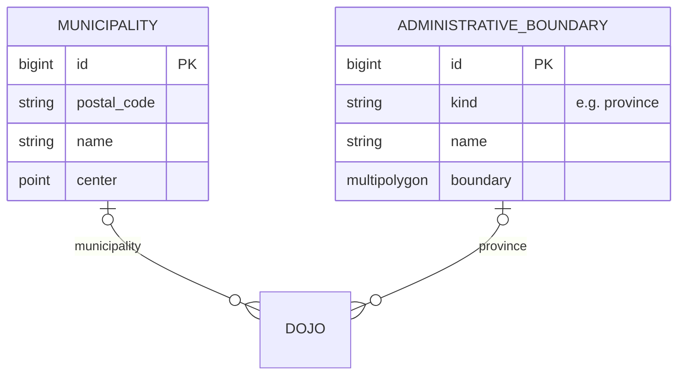
```mermaid
erDiagram
    MUNICIPALITY |o--o{ DOJO : "municipality"
    ADMINISTRATIVE_BOUNDARY |o--o{ DOJO : "province"

    MUNICIPALITY {
        bigint id PK
        string postal_code
        string name
        point center
    }
    ADMINISTRATIVE_BOUNDARY {
        bigint id PK
        string kind "e.g. province"
        string name
        multipolygon boundary
    }
```

---

## 10. Redesign: rationale and plan

> **Status: landed** (all eight phases, 2026-09-24). Sections 1–9 are the current model; this
> section keeps *why* it looks the way it does: the problems with the old
> model, the decisions taken and the plan. Where it says "today", read
> "before the redesign".

### Nomenclature

The redesign uses CoderDojo's own vocabulary. Use these terms in the new
model, in the UI and in the docs:

| Term | Meaning | Role / entity in the redesign | Today's code (sections 1–9) |
|---|---|---|---|
| **Champion** | The **dojo owner**: runs and manages a dojo. Exactly one per dojo. | membership role `champion` | `DojoOwner`, `Dojo.owner`, shown as "Lead Coach" |
| **Mentor** / **Coach** | An adult **helper** who helps manage and run a dojo. | membership role `mentor` | `HelperAccount`, `Mentor.VOLUNTEER` ("Volunteer mentor") |
| **Ninja** | A **child aged 7–17** who visits a dojo. | `NINJA` (plus an optional `NINJA_ACCOUNT` login) | `Participant` (+ `ChildAccount`) |
| **Youth mentor** | A **ninja who helps run events**. Promoted by the dojo's champion or a mentor. | membership role `youth_mentor` | `Mentor.CHAMPION` / `Mentor.NINJA` linked to a `ChildAccount` |
| **Badge** | An **award** a ninja can achieve: either a one-off ("did the thing") or a **milestone** reached by a count (e.g. the attendance wristbands). | `BADGE` (kind `one_off` / `milestone`) / `NINJA_BADGE` | `BadgeAward` and `MilestoneAward` / `ParticipantAward` |
| **Belt** | A ninja's **proficiency level**: how skilled they are, not how often they came. | `BELT` / `NINJA_BELT` | nothing today. A milestone award *can* be set up to grant a belt, but doesn't have to. |

Watch out for two collisions with today's code:

- **"Champion"** changes meaning. Today `Mentor.CHAMPION` ("Dojo
  champion") is an honoured *ninja*. In the redesign a **Champion is the
  dojo owner**, and the honoured-ninja role is a **Youth mentor**.
- **"Mentor"** today is the name of the team-page *profile table*
  (`dojos.Mentor`), which the redesign removes. In the redesign
  **mentor** is only a *role* (an adult helper) on a dojo membership.

### What's wrong with the current model

- **`Mentor` shouldn't be a table of its own.** Today it's a copy of a
  person (name, email, photo) with up to four optional links back to the
  real account (`owner_account`, `helper_account`, `guardian_account`,
  `child_account`). That's why `Mentor.clean()` needs "at most one link"
  rules and `Dojo.sync_lead_coach()` exists to keep the Lead Coach copy in
  step with `Dojo.owner`. What the site actually needs is a way to show
  **the team working at a dojo**: the accounts involved and each one's role
  there.
- **Champion and mentor aren't kinds of account.** They describe how a
  person relates to one particular dojo, and a person can have that
  relationship with several dojos. Modelling them as account subclasses
  (`DojoOwner`, `HelperAccount`), plus `Dojo.owner` and
  `Mentor.helper_account`, spreads one idea across three places.
- **Background checks belong to the person.** The check fields already
  live on `accounts.User`, but whether a check is required depends on which
  role subclasses an account has, and the check itself is tracked on the
  applications. In the new model the check is tracked on the account, and
  it's required by the **relationship**: holding a `champion` or `mentor`
  membership needs a valid check, while plain use of the site doesn't.

### Target model

**Two account types only:**

- **`NINJA_ACCOUNT`**: a ninja's own login. **No background check.** A
  ninja can be promoted to **Youth mentor** at a dojo by that dojo's
  champion or one of its mentors.
- **Account** (the normal, adult account; what `User` is today, minus the
  role subclasses). Every account *can* go through the background-check
  process (`BackgroundCheckMixin`'s lifecycle, tracked on the account
  itself), but it's **only required to become a champion or a mentor**
  *(decided)*. A parent using the site normally (registering their family,
  managing their ninjas, signing them up for sessions) never needs a
  check. Holding a `champion` or `mentor` membership requires a validated,
  unexpired check. Every decision on a check is also written to an audit
  history of who approved or rejected it, and when.

**The team is a relation between an account and a dojo.** Champion,
mentor and youth-mentor roles are all stored on one relation row per
account and dojo (below called `DojoMembership`; the name isn't decided).
One account can be linked to any number of dojos, with the role that fits
each relationship.

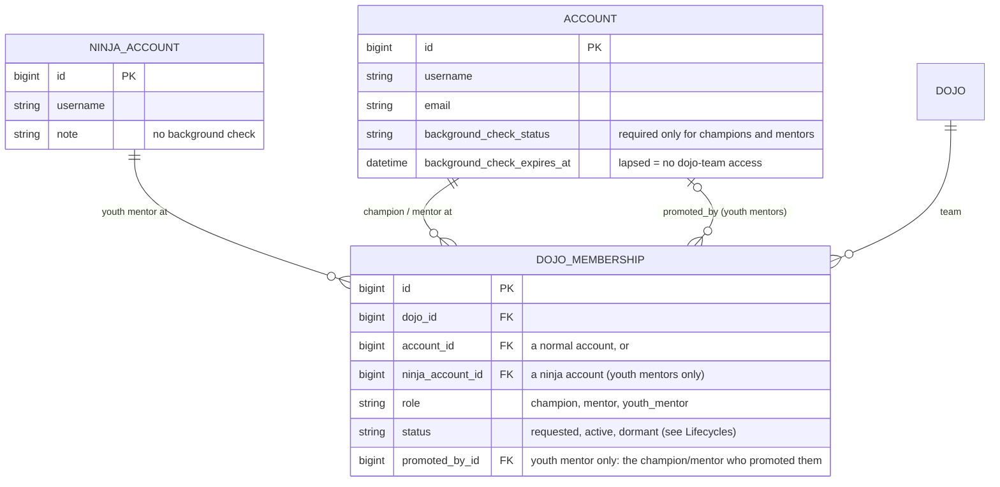
```mermaid
erDiagram
    ACCOUNT ||--o{ DOJO_MEMBERSHIP : "champion / mentor at"
    NINJA_ACCOUNT ||--o{ DOJO_MEMBERSHIP : "youth mentor at"
    DOJO ||--o{ DOJO_MEMBERSHIP : "team"
    ACCOUNT |o--o{ DOJO_MEMBERSHIP : "promoted_by (youth mentors)"

    ACCOUNT {
        bigint id PK
        string username
        string email
        string background_check_status "required only for champions and mentors"
        datetime background_check_expires_at "lapsed = no dojo-team access"
    }
    NINJA_ACCOUNT {
        bigint id PK
        string username
        string note "no background check"
    }
    DOJO_MEMBERSHIP {
        bigint id PK
        bigint dojo_id FK
        bigint account_id FK "a normal account, or"
        bigint ninja_account_id FK "a ninja account (youth mentors only)"
        string role "champion, mentor, youth_mentor"
        string status "requested, active, dormant (see Lifecycles)"
        bigint promoted_by_id FK "youth mentor only: the champion/mentor who promoted them"
    }
```

Rules the new model needs to enforce:

| Role | Who can hold it | How it's granted |
|---|---|---|
| `champion` | normal account, **approved as a champion**, with a valid background check | creating a dojo (the creator becomes its champion), or a **transfer** from the current champion |
| `mentor` | normal account, **approved as a mentor**, with a valid background check | the mentor **requests to join** and an active champion/mentor of that dojo accepts, **or** an active champion/mentor **adds** them |
| `youth_mentor` | ninja account | promoted by an active `champion` or `mentor` of **the same dojo** |

"Approved as a mentor" and "approved as a champion" are **account-level,
one-time** approvals (an application plus a background check; see
Lifecycles below). They aren't tied to a dojo: once approved, a mentor can
join as many dojos as accept them, and a champion can create a dojo.

- A membership links exactly one of `account` / `ninja_account`, and the
  role has to match the account type (`youth_mentor` only on ninja
  accounts; `champion`/`mentor` only on normal accounts).
- There's one membership per (account, dojo). Leaving and rejoining reuses
  the same row (dormant → active again) rather than adding a second one.
- **Exactly one active `champion` per dojo.** It changes hands only by
  transfer (below), never by having two champions at once.
- `promoted_by` must hold a `champion` or `mentor` membership at that same
  dojo.
- The team page lists a dojo's `active` memberships whose account has
  `show_on_team_pages` set, the champion first, using the account's shared
  profile. That covers what `Mentor.objects.lead_coach_first()` does
  today; the "Lead Coach" label becomes **Champion**.
- Admin access (`dojos/access.py`) reads the role from the membership, and
  only an **`active`** membership whose account has a valid check grants
  access to that dojo's dashboard. The role→capability mapping
  (`ROLE_CAPABILITIES`) already works this way; today's `OWNER`/`HELPER`
  become `CHAMPION`/`MENTOR`, plus a `YOUTH_MENTOR` entry, probably with no
  admin capabilities.

### Lifecycles

#### Becoming a mentor or champion, then joining a dojo

Approval happens **once per account**, not once per dojo. Joining a
specific dojo's team is a separate, lightweight step handled by that
dojo's own team, with no admin involved.

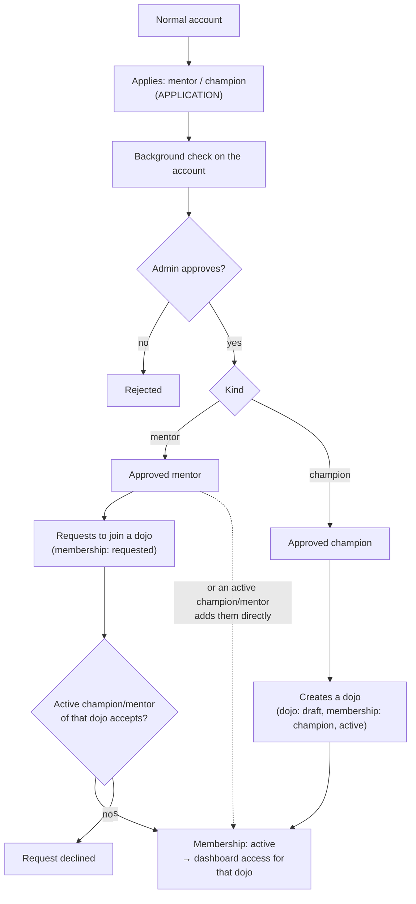
```mermaid
flowchart TD
    A[Normal account] --> B["Applies: mentor / champion<br/>(APPLICATION)"]
    B --> C[Background check on the account]
    C --> D{Admin approves?}
    D -- no --> X[Rejected]
    D -- yes --> E{Kind}
    E -- mentor --> H[Approved mentor]
    E -- champion --> S[Approved champion]

    H --> J1["Requests to join a dojo<br/>(membership: requested)"]
    J1 --> J2{"Active champion/mentor<br/>of that dojo accepts?"}
    J2 -- yes --> ACT["Membership: active<br/>→ dashboard access for that dojo"]
    J2 -- no --> DEC[Request declined]
    H -. "or an active champion/mentor<br/>adds them directly" .-> ACT

    S --> N["Creates a dojo<br/>(dojo: draft, membership: champion, active)"]
    N --> ACT
```

#### Dojo lifecycle

A new dojo starts in `draft`. The draft is where the champion sets up the
profile, team and first sessions before anything is public.

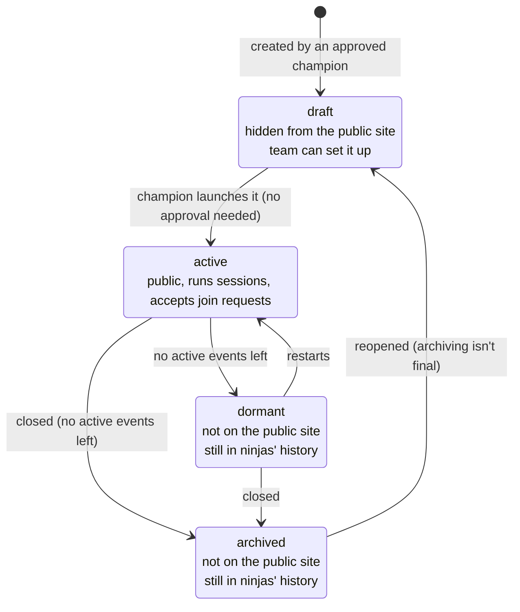
```mermaid
stateDiagram-v2
    [*] --> draft : created by an approved champion
    draft --> active : champion launches it (no approval needed)
    active --> dormant : no active events left
    dormant --> active : restarts
    active --> archived : closed (no active events left)
    dormant --> archived : closed
    archived --> draft : reopened (archiving isn't final)

    draft : draft<br/>hidden from the public site<br/>team can set it up
    active : active<br/>public, runs sessions, accepts join requests
    dormant : dormant<br/>not on the public site<br/>still in ninjas' history
    archived : archived<br/>not on the public site<br/>still in ninjas' history
```

Decided rules:

- **Launching:** the champion moves a dojo from `draft` to `active`
  themselves. No admin approval is needed; they were already approved as
  a champion.
- **Going dormant or archived:** only allowed when the dojo has **no active
  events**, meaning no upcoming event that's still `draft` or `open`. The
  transition is refused while an active event exists; the team has to
  close or finish those first. In practice a dojo goes dormant when
  nothing has been planned for a long time.
- **Pending join requests** (`requested` memberships) are **declined
  automatically** when a dojo goes dormant or is archived, and the
  requesting mentors are notified.
- **Dormancy is a manual decision, with a nudge.** The site never makes a
  dojo dormant by itself. Once an `active` dojo has had **no events planned
  for half a year** (six months since its last event, with nothing
  upcoming), its dashboard flags it, and the dojo's active team (champion
  and mentors) and the **board** (`ORGANISATION_ROLE`) get a **persistent**
  notification. It stays visible until the situation is resolved, either
  because an event is planned or because the dojo is marked dormant or
  archived, rather than being sent once or repeated. The board sees these
  on a **board dashboard that hasn't been built yet**.
  - Model note: "persistent until resolved" doesn't fit today's
    `Notification`, which is a one-off message with `read`. Either give it
    a `resolved_at` (plus a key such as `kind` + `dojo`, so the alert isn't
    duplicated), or compute the alert from the data (last event date +
    status) every time the dashboards render. Decide when the board
    dashboard is built.
- **Visibility:** `dormant` and `archived` dojos **don't appear on the
  public site** (dojo finder, dojo pages, upcoming sessions). They
  **still appear in ninjas' own history**: past sessions, registrations,
  badges and belts keep showing the dojo's name for the ninjas and parents
  concerned.
- **Archiving isn't final:** an archived dojo can be reopened. It goes
  **back to `draft`**, hidden from the public site, so the team can check
  its profile and team before launching it again.
- **Team powers:** any **active** mentor can do what the champion can for
  team management: accept join requests, add mentors directly, and
  promote ninjas to youth mentor. Only the champion can transfer the
  champion role.

#### Team membership lifecycle

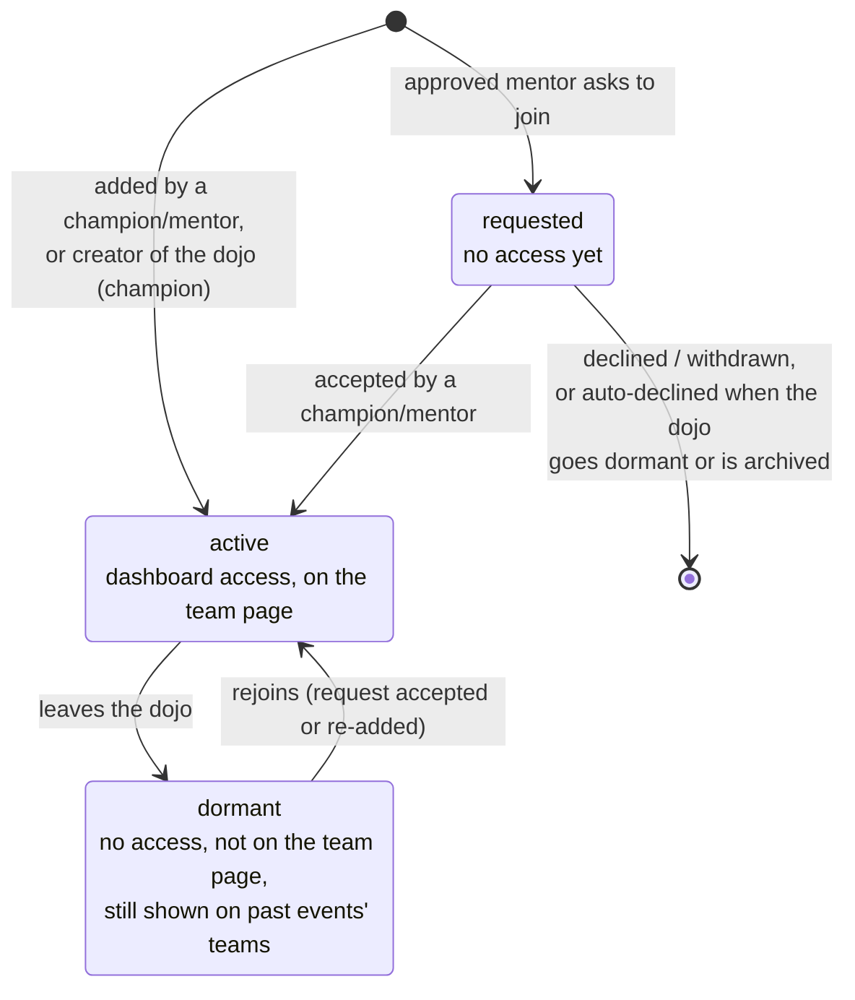
```mermaid
stateDiagram-v2
    [*] --> requested : approved mentor asks to join
    [*] --> active : added by a champion/mentor,<br/>or creator of the dojo (champion)
    requested --> active : accepted by a champion/mentor
    requested --> [*] : declined / withdrawn,<br/>or auto-declined when the dojo<br/>goes dormant or is archived
    active --> dormant : leaves the dojo
    dormant --> active : rejoins (request accepted or re-added)

    requested : requested<br/>no access yet
    active : active<br/>dashboard access, on the team page
    dormant : dormant<br/>no access, not on the team page,<br/>still shown on past events' teams
```

- **Leaving:** a mentor (or youth mentor) can leave a dojo at any time.
  Their membership becomes `dormant`. It isn't deleted, so it still
  appears on the **event team** of the past sessions they helped run, but
  it's no longer on the team page and gives no dashboard access.
- **Champion transfer:** the active champion can hand the champion role to
  one of the dojo's **active mentors**. In one step, the chosen mentor's
  membership becomes `champion` and the previous champion's becomes
  `mentor` (still active; they can then leave like any other mentor). The
  target must be an active mentor at that dojo with a valid check. A
  champion can't simply leave: they transfer the role first, or the dojo
  is archived.
- **Checks lapsing:** when an account's background check lapses, all its
  `champion`/`mentor` memberships stop granting access until it's renewed.
  Their status doesn't change: they're still `active`, just not usable.

### Pathways move to the dojo and event scope

Today a pathway is linked only per ninja, per session, and only one
(`Registration.pathway`: "what this child worked on"). In the redesign
pathways are set at three levels, each one **pre-filled from the level
above**:

- **Dojo ↔ pathway** (many-to-many, optional): the pathways a dojo
  **provides** as a service, for example "we do Scratch and micro:bit".
- **Event ↔ pathway** (many-to-many, optional): the pathways a specific
  **session** covers. Pre-filled from the dojo's.
- **Registration ↔ pathway** (many-to-many, optional): the pathways **this
  ninja** works on at that session, often a **subset** of the event's.
  Pre-filled from the event's. This replaces today's single
  `Registration.pathway`.
- All three are **optional**. A dojo, event or registration without
  pathways is perfectly valid.
- When set, an event's pathways are **shown on its public event details
  page**, and a dojo's can be shown on its dojo page. A registration's
  pathways feed the ninja's own history and the attendance list.

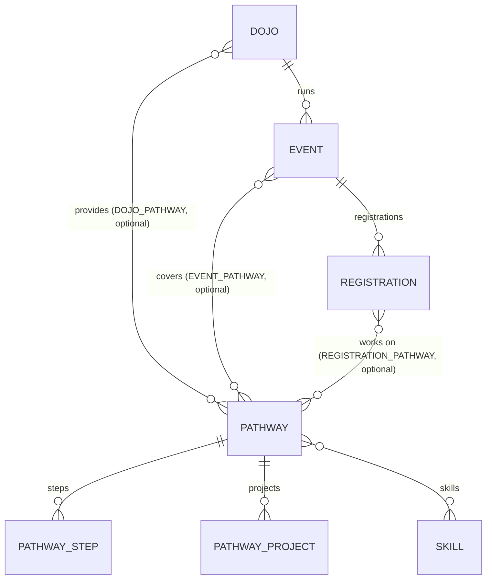
```mermaid
erDiagram
    DOJO }o--o{ PATHWAY : "provides (DOJO_PATHWAY, optional)"
    EVENT }o--o{ PATHWAY : "covers (EVENT_PATHWAY, optional)"
    DOJO ||--o{ EVENT : "runs"
    EVENT ||--o{ REGISTRATION : "registrations"
    REGISTRATION }o--o{ PATHWAY : "works on (REGISTRATION_PATHWAY, optional)"
    PATHWAY ||--o{ PATHWAY_STEP : "steps"
    PATHWAY ||--o{ PATHWAY_PROJECT : "projects"
    PATHWAY }o--o{ SKILL : "skills"
```

Decided:

- **Event pathways default to the dojo's but aren't restricted.** The
  event form pre-selects the pathways the dojo provides, and the team can
  add or remove any pathway for that particular session.
- **Registration pathways work the same way, one level down.** A new
  registration pre-selects the event's pathways, and they can be narrowed
  to the subset this ninja actually works on (or changed), without a hard
  restriction. The ninja's history and the attendance list read the
  **registration's** pathways.

### Mapping from today's model

| Today | In the redesign |
|---|---|
| `accounts.User` | the normal **Account** |
| `DojoOwner`, `HelperAccount` (MTI subclasses) | removed: a `champion` / `mentor` membership on the account |
| `Guardian` (MTI subclass) | removed: a normal account with `GUARDIANSHIP` rows to its ninjas (no check needed for that) |
| `ChildAccount` | `NINJA_ACCOUNT`: the second account type |
| `Participant` | `NINJA` |
| `Dojo.owner` | a `champion` membership |
| `Mentor` (with a dojo) | removed: the relationship becomes a membership, and the display fields move onto the account's shared profile |
| `Mentor` with no dojo (role `board`) | an `ORGANISATION_TEAM_MEMBER` row (display only, for the organisation's team details page) with position "Member of the board", maintained from the management dashboard |
| `Mentor.owner_account` / `helper_account` | the membership's `account` (role `champion` / `mentor`) |
| `Mentor.child_account` + role `champion`/`ninja` | a `youth_mentor` membership with `promoted_by` |
| "Lead Coach" label | **Champion** |
| `Dojo.sync_lead_coach()` (and its demote-on-owner-change) | removed: the champion role changes by an explicit **transfer** between memberships (the old champion becomes a mentor) |
| `DojoApplication` / `MentorApplication` (per dojo, creating the account and role) | one `APPLICATION` per account and kind (`mentor`, `champion`). Approval makes the account an approved mentor or champion; joining or creating a dojo is a separate step |
| `Dojo` (no status; always public) | `Dojo.status`: `draft`, `active`, `dormant`, `archived` |
| `Registration.pathway` (one per ninja, per session) | many-to-many at three levels, each pre-filled from the one above: **dojo** (`DOJO_PATHWAY`) → **event** (`EVENT_PATHWAY`, shown on the event details page) → **registration** (`REGISTRATION_PATHWAY`, the ninja's subset) |
| `Award` → `BadgeAward` / `MilestoneAward`, `ParticipantAward` | **Badges** (`BADGE` with kind `one_off` / `milestone`, `NINJA_BADGE`); milestones stay badges. **Belts** (`BELT`, `NINJA_BELT`) are new: a ninja's proficiency level |
| `dojos.access` roles `OWNER` / `HELPER` | `CHAMPION` / `MENTOR` (+ `YOUTH_MENTOR`) |
| background-check fields on the applications, and on `User` for owner/helper | the current check on every normal account, plus an append-only `BACKGROUND_CHECK_HISTORY` audit log (who decided, when) |

### Open questions to settle before starting

- ~~**Parents.**~~ *Decided: no check for normal use of the site; a
  check is required only to become a champion or mentor. See (A) below.*
- ~~**Ninja vs ninja account**~~: *decided, see (B) below.* They stay
  separate.
- ~~**Organisation team members** (today's board members)~~: *decided,
  see (C) below.* The public listing is separate from accounts and
  access.
- ~~**Team-page profile fields**~~: *decided, see (D) below.* One shared
  profile on the account.
- ~~**History**~~: *not an issue in the new model.* Memberships are never
  deleted, only made `dormant`, and `EVENT.event_team` points at them. The
  membership table therefore *is* the history, and "who ran this session"
  is a plain lookup there. There's no legacy history to carry over either;
  see "No data migration" below.
- ~~**Belts: progress in what?**~~ *Decided: a belt is a ninja's
  **proficiency level**, not an attendance count.* Milestone awards (like
  the attendance wristbands) stay **badges** (kind `milestone`). A
  milestone badge *can* be configured to also grant a belt
  (`BADGE.grants_belt`), but doesn't have to.
- ~~**Belts: how are they stored and shown?**~~ *Decided:* `NINJA_BELT` is
  a **history table**: one row per belt a ninja reaches (when, and awarded
  by whom), appended and never overwritten. A ninja's **current
  proficiency** is their highest-level belt in that history. It's shown in
  two places:
  - the **ninja's account details page** (for the ninja and their
    parents): the current belt plus the history of earlier belts;
  - the **management tooling**: the dojo dashboard for its champion and
    mentors (who can also award belts there), and the organisation's
    management dashboards (read-only), to see a ninja's level and
    progression over time.

  The belt is the *only* record of a ninja's coding level: the old
  self-reported `experience_level` on `NINJA` (new / some / confident,
  asked at family sign-up) was removed, and the current belt is shown
  wherever that level needs to be visible (the ninja's page, the family
  page's child cards, the attendance list and the ninja admin list).
- ~~**Belts: remaining details.**~~ *Decided:*
  - **Belts aren't connected to pathways (yet).** A belt is one overall
    proficiency level per ninja, a single track of levels. Linking belts to
    pathways (e.g. a Scratch belt and a Python belt) is possible future
    work, not part of this redesign.
  - **Only people who actively manage a dojo can award a belt:** an
    account with an **active** `champion` or `mentor` membership (a new
    `AWARD_BELTS` capability, granted to `CHAMPION` and `MENTOR` like the
    others). Organisation accounts (`ORGANISATION_ROLE`) **can't** award
    belts through the management dashboards; they can only see them. Each
    history row records **who** awarded the belt (`awarded_by`, the
    account) **and in which role** (`awarded_as_membership`, their
    champion/mentor membership at that dojo; required). So the history can
    show "awarded by Jan, as mentor of Dojo Ghent".

Lifecycle questions. These are *decided*, and the rules are under
"Dojo lifecycle" above:

- ~~Launching a dojo~~: the champion launches it; no approval.
- ~~Who can accept join requests~~: any active mentor, as well as the
  champion. The same goes for adding mentors and promoting youth mentors.
- ~~Dormant/archived visibility~~: hidden from the public site, still in
  ninjas' history. Archived can be reopened.
- ~~Going dormant or archived with open events~~: not allowed; both
  require no active events.
- ~~Pending join requests~~: declined automatically on dormant or
  archived.
- ~~Reopening an archived dojo~~: back to `draft`.
- ~~Detecting dormancy~~: manual, with a dashboard flag and notifications
  to the team and the board.
- ~~The "no events planned" period~~: half a year. The notification is
  persistent until resolved and appears on the future board dashboard.

Still open: nothing in the lifecycles. The **board dashboard** itself is
future work that needs its own design.

### Provisional full diagram

> **Provisional.** This is a working draft of the whole redesigned model.
> **(A)**–**(F)** below are all decided. The diagram is still provisional
> in its details (names, exact fields), not in its structure.

```mermaid
erDiagram
    %% ---------- people ----------
    ACCOUNT ||--o{ BACKGROUND_CHECK_HISTORY : "audit log of past decisions"
    ACCOUNT |o--o{ BACKGROUND_CHECK_HISTORY : "reviewed_by (staff reviewer)"
    ACCOUNT ||--o{ GUARDIANSHIP : "parent of"
    NINJA ||--o{ GUARDIANSHIP : "child of"
    NINJA |o--o| NINJA_ACCOUNT : "optional login"

    %% ---------- dojo team ----------
    DOJO ||--o{ DOJO_MEMBERSHIP : "team"
    ACCOUNT |o--o{ DOJO_MEMBERSHIP : "champion / mentor"
    NINJA_ACCOUNT |o--o{ DOJO_MEMBERSHIP : "youth mentor"
    DOJO_MEMBERSHIP |o--o{ DOJO_MEMBERSHIP : "promoted (youth mentors)"
    ACCOUNT ||--o{ ORGANISATION_ROLE : "management-dashboard access"
    ACCOUNT |o--o| ORGANISATION_TEAM_MEMBER : "optional link (display only)"

    %% ---------- sessions ----------
    DOJO ||--o{ EVENT : "runs"
    EVENT }o--o{ DOJO_MEMBERSHIP : "event_team (M2M)"
    EVENT ||--o{ REGISTRATION : "registrations"
    NINJA ||--o{ REGISTRATION : "signs up via"
    DOJO }o--o{ PATHWAY : "provides (optional)"
    EVENT }o--o{ PATHWAY : "covers (optional, shown on event page)"
    REGISTRATION }o--o{ PATHWAY : "works on (optional, defaults to the event's)"
    NINJA }o--o| DOJO : "home_dojo"

    %% ---------- badges & belts ----------
    NINJA ||--o{ NINJA_BADGE : "earns"
    BADGE ||--o{ NINJA_BADGE : "awarded as"
    NINJA ||--o{ NINJA_BELT : "belt history (current = highest level)"
    BELT ||--o{ NINJA_BELT : "reached as"
    BELT |o--o{ BADGE : "grants_belt (optional, milestone badges)"
    ACCOUNT |o--o{ NINJA_BELT : "awarded_by (who)"
    DOJO_MEMBERSHIP ||--o{ NINJA_BELT : "awarded_as_membership (in role of champion/mentor)"

    %% ---------- onboarding ----------
    ACCOUNT ||--o{ APPLICATION : "applies (mentor / champion)"
    ACCOUNT |o--o{ APPLICATION : "decided_by (staff)"
    ACCOUNT |o--o{ DOJO_MEMBERSHIP : "requested / added / decided by"

    %% ---------- other ----------
    ACCOUNT ||--o{ NOTIFICATION : "recipient (join requests, transfers, ...)"
    NINJA_ACCOUNT ||--o{ NOTIFICATION : "recipient"
    DOJO |o--o{ NOTIFICATION : "dojo"

    ACCOUNT {
        bigint id PK
        string username
        string email "unique, login"
        string password
        bool must_change_password
        string background_check_status "current check: not_requested, requested, submitted, validated, rejected"
        uuid background_check_token "emailed upload link"
        file background_check_document "private, deleted on decision"
        datetime background_check_expires_at "validated + 365 days"
        bool can_join_team "derived: check validated and not expired; needed for champion/mentor only"
        string display_name "team-page profile, shared by all dojos (D)"
        string title
        string bio
        image photo
        bool show_on_team_pages
    }
    NINJA_ACCOUNT {
        bigint id PK
        string username
        string password
        string note "never background-checked"
        string display_name "youth-mentor team-page profile (D)"
        string bio
        image photo
        bool show_on_team_pages
    }
    BACKGROUND_CHECK_HISTORY {
        bigint id PK
        bigint account_id FK "whose check"
        string decision "validated, rejected"
        bigint reviewed_by_id FK "staff account that decided"
        datetime reviewed_at
        datetime requested_at
        datetime submitted_at
        datetime expires_at "validated only"
        string note "optional reviewer remark, never the document"
    }
    GUARDIANSHIP {
        bigint account_id FK "the parent"
        bigint ninja_id FK "the child"
        string relation "parent, legal guardian, ..."
    }
    NINJA {
        bigint id PK
        string name
        date date_of_birth "ninjas are 7-17"
        bigint ninja_account_id FK "nullable, unique"
        bigint home_dojo_id FK
        string allergies_notes
    }
    DOJO {
        bigint id PK
        string name
        string status "draft, active, dormant, archived"
        bigint created_by_id FK "the approved champion who created it"
        point location
        string address
        bigint municipality_id FK
        bigint province_id FK
    }
    DOJO_MEMBERSHIP {
        bigint id PK
        bigint dojo_id FK
        bigint account_id FK "champion/mentor; null for youth mentors"
        bigint ninja_account_id FK "youth mentor only"
        string role "champion, mentor, youth_mentor"
        string status "requested, active, dormant"
        bigint requested_by_id FK "who asked (the mentor) or added them (champion/mentor)"
        bigint decided_by_id FK "champion/mentor who accepted the request"
        bigint promoted_by_id FK "youth mentor only: champion/mentor membership, same dojo"
        datetime joined_at "became active"
        datetime left_at "became dormant; null while active"
    }
    ORGANISATION_ROLE {
        bigint id PK
        bigint account_id FK
        string role "board, admin (grants management-dashboard access)"
    }
    ORGANISATION_TEAM_MEMBER {
        bigint id PK
        string name "display only, no login needed"
        string position "e.g. Member of the board, Volunteer coordinator"
        string bio
        image photo
        string focus_areas
        int order
        bool is_public
        bigint account_id FK "optional: the person's account, if they have one"
    }
    EVENT {
        bigint id PK
        bigint dojo_id FK
        string status "draft, open, closed"
        datetime start_time
        datetime end_time
        int places
    }
    REGISTRATION {
        bigint id PK
        bigint event_id FK
        bigint ninja_id FK
        bool waiting_list
        int position
        bool attended "null = not marked"
    }
    BADGE {
        bigint id PK
        string name
        string kind "one_off, milestone"
        string criteria "one_off: what earns it"
        int threshold "milestone: count needed (e.g. sessions attended)"
        bigint grants_belt_id FK "optional: reaching this milestone also grants a belt"
        image icon
    }
    NINJA_BADGE {
        bigint ninja_id FK
        bigint badge_id FK
        int progress_current "milestone only"
        int progress_total "milestone only"
        date earned_date "null until earned"
    }
    BELT {
        bigint id PK
        string name "e.g. white, yellow, ..."
        int level "order of the belts (one overall track; not linked to pathways yet)"
        string requirements "what a ninja must be able to do"
        image icon
    }
    NINJA_BELT {
        bigint id PK
        bigint ninja_id FK
        bigint belt_id FK
        date awarded_on
        bigint awarded_by_id FK "the account that awarded it (who)"
        bigint awarded_as_membership_id FK "in role of: their active champion/mentor membership (required)"
        string note "optional: what the ninja showed"
    }
    APPLICATION {
        bigint id PK
        bigint account_id FK "the applicant (account created first)"
        string kind "mentor, champion"
        string status "pending, approved, rejected"
        bigint decided_by_id FK "staff"
        datetime decided_at
        string motivation "about / area / proposed venue ..."
    }
    NOTIFICATION {
        bigint id PK
        bigint recipient_account_id FK "one of the two"
        bigint recipient_ninja_account_id FK
        bigint dojo_id FK
        string text
        bool read
    }
```

Pathways (`Pathway`, `PathwayStep`, `PathwayProject`, `Skill`), the
`content` models and the geo reference data stay as they are today
(sections 7 and 9), so they're only shown where they connect. Awards are
renamed into badges and belts (see Nomenclature).

**Decisions in this draft:**

- **(A) Parents — decided.** A parent is a normal `ACCOUNT` linked to
  their ninjas through `GUARDIANSHIP` (which replaces the `Guardian`
  subclass and `Participant.guardian`). **Normal use of the website needs
  no background check:** signing up, registering and managing their
  ninjas, and signing them up for sessions all work straight away, as the
  self-service guardian sign-up does today. The check becomes a
  requirement only when the same account wants to become a **champion**
  (start a dojo) or a **mentor** (help at one). The account applies,
  completes the check, and gets the membership once it's validated. A
  lapsed check removes team access (as login blocking does for
  owners/helpers today) but never the parent's own use of the site.
- **(B) Ninja vs ninja account — decided.** They stay separate. A `NINJA`
  is the child as a person (always present); a `NINJA_ACCOUNT` is an
  optional login attached to it. Youth mentors are memberships of the
  `NINJA_ACCOUNT`, since a youth mentor needs to be able to log in.
- **(C) Organisation team members — decided.** **Being listed** and
  **having access** are two separate things:
  - **`ORGANISATION_TEAM_MEMBER`** is display only. It's used **only for
    the organisation's team details page**: the people shown there, each
    with a **position** (name, position, bio, photo, focus areas, order).
    "Member of the board" is one possible position, not a separate kind of
    person. Not everyone listed needs an account; the link to an `ACCOUNT`
    is optional and only for convenience.
  - **`ORGANISATION_ROLE`** is access: the accounts that can use the
    organisation's **management dashboards** (including the future board
    dashboard). Not everyone with access has to be listed.
  - There's **no self-service** for the listing. People with
    management-dashboard access maintain `ORGANISATION_TEAM_MEMBER` for
    everyone.
- **(D) Team-page profile — decided.** To keep it simple, the profile
  (display name, title, bio, photo, whether to show it) lives on the
  **account** and is **shared across every dojo** the person is on. The
  membership only carries the relationship (role, status, dates). A youth
  mentor's profile lives on their `NINJA_ACCOUNT` the same way.
- **(E) History — decided.** Leaving a dojo makes a membership
  **`dormant`**, never deleted. `EVENT.event_team` points at memberships,
  so past sessions keep showing who ran them after someone leaves. Only
  `active` memberships grant dashboard access or appear on the team page.
  An archived dojo keeps all its memberships and events as read-only
  history.
- **(F) Background checks — decided.** The **current** check lives on the
  account (status, token, document, expiry), moved there from the
  applications. Each time a reviewer validates or rejects a check, a row
  is appended to `BACKGROUND_CHECK_HISTORY`: whose check, the decision,
  **who reviewed it and when**, and the expiry it set. The history is an
  audit log only. It's append-only and never edited, and nothing reads it
  to decide access; the fields on the account do that. A renewal resets
  the account's current check and adds a new history row when it's
  decided, so earlier decisions stay on record. "Delete the document,
  keep only the decision" still holds: the uploaded document is deleted
  once decided, and the history never stores it. Applications merge into
  one `APPLICATION` table with a `kind`, since both kinds now just grant a
  membership, and approving one requires the applicant's account to have
  a valid check.

### No data migration: adapt the seeders

**No data-migration logic is needed.** The current database contains only
**seeded test data** (`.devcontainer/start.sh` runs the `seed_*` commands
on a fresh database); there's no real data to preserve. So the redesign
needs no backfills, no `RunPython` conversions and no legacy-row handling.
Instead:

- Replace the models and generate fresh migrations for the affected apps.
  Squashing or resetting the old ones is fine, since dev databases are
  simply recreated.
- **Adapt the seed commands** so they produce the new model directly.
  Rebuild with `docker compose -f .devcontainer/docker-compose.yml down -v`
  followed by a fresh `up` (`start.sh` reseeds on an empty database).
  Note that `-v` also wipes the `claude-config` volume (Claude Code's
  login and sessions); to reset only the database, remove just the
  `db-data` volume (`docker volume ls` shows its project-prefixed name), or
  drop and recreate the `coolregistration` database from inside the
  workspace and rerun `start.sh`'s seed sequence.

Seeders to adapt:

| Seeder | Today | In the redesign |
|---|---|---|
| `seed_dojos` | dojos from the bundled JSON | same, plus a `status` (mostly `active`, a few `draft`/`dormant`/`archived` to exercise the lifecycle); each dojo's provided pathways are set by `seed_events`, which runs after `seed_pathways` |
| `seed_champions` (was `seed_dojo_owners`) | a `DojoOwner` per dojo | **champion** accounts (with a validated check and a `BACKGROUND_CHECK_HISTORY` row) + a `champion` membership per dojo; replaces `seed_dojo_owners` |
| `seed_mentors` | `Mentor` profiles (mostly login-less) + board rows | **mentor** accounts (validated check) with `active` memberships, some at several dojos, a few `requested`/`dormant`; **youth mentor** memberships on ninja accounts (with `promoted_by`); `ORGANISATION_TEAM_MEMBER` rows (position "Member of the board", ...) and a few `ORGANISATION_ROLE` accounts |
| `seed_guardians` | `Guardian` accounts + `Participant` children (+ optional `ChildAccount`) | **parent** accounts (no check needed) + `GUARDIANSHIP` + **ninjas** aged 7–17 (+ optional ninja accounts) |
| `seed_events` | upcoming events per dojo | same, plus **event pathways** (pre-filled from the dojo's) and an **event team** of memberships |
| `seed_ninja_history` (was `seed_participant_history`) | past events, registrations, awards | past events with event teams, registrations with **registration pathways**, **badges** (one-off and milestone) and a **belt history** awarded by champion/mentor memberships |
| `seed_pathways`, `seed_faqs`, `seed_testimonials`, `seed_geo` | unchanged | unchanged (FAQs keep their dojo/event/pathway scoping) |
| *(new)* applications | none | a few `APPLICATION` rows (`mentor`/`champion`, pending/approved/rejected) to exercise the approval flow |

`seed_credentials.csv` keeps listing every seeded login (champions,
mentors, parents, ninja accounts).

### Implementation plan

**Status: done** (2026-09-24, on the `redesign/data-model` branch). All
phases are ticked off below.

#### Implementation decisions

These settle details the diagrams above leave open:

1. **One user table.** Normal and ninja accounts are both
   `accounts.User` (still `AUTH_USER_MODEL`), told apart by
   `User.account_type` (`adult` / `ninja`). There are no role subclasses
   any more. Where the diagrams show `ACCOUNT` / `NINJA_ACCOUNT` as two
   tables, read one `User` table with a type: memberships, belt awards and
   notifications each need a single user link, and login stays exactly as
   it is.
2. **Applying requires being logged in.** An `Application` always belongs
   to an existing account, so the anonymous "start a dojo" / "become a
   mentor" forms go away. Visitors sign up first.
3. **URLs change.** `/guardian/<id>/…` becomes `/account/…` (the family
   page), and the pages for a parent's ninjas live under it.
4. **Management dashboards = Django admin, for now.** `ORGANISATION_ROLE`
   maps to staff status plus a group. The board dashboard is future work.
5. **Dormancy nudge** (six months with no events): computed when the dojo
   dashboard loads and shown as a banner, not stored as notifications,
   until the board dashboard exists.
6. **Non-`active` dojos** (draft, dormant, archived) are hidden from the
   public site **together with their events**.

#### Approach

Work on the feature branch in three stages, keeping the test suite green
at every step:

- **A:** add the new models alongside the old ones.
- **B:** switch features over one at a time.
- **C:** remove the old models, reset the migrations to a fresh `0001`
  per app (no data to keep; see "No data migration"), and apply the new
  names.

#### Phases

- [x] **1. Accounts** (`accounts`), *done 2026-09-24*
  - `User.account_type` (`adult` / `ninja`) and `User.phone`.
  - `Guardianship` (parent account ↔ `Participant`; a ninja can have
    several guardians). `Participant.account` now points at a ninja-type
    `User`.
  - Dropped `Guardian`, `ChildAccount`, `Participant.guardian` and
    `link_guardian_role`; any adult account adds children from its account
    page.
  - Family page and ninja pages moved under `/account/`
    (`account_home`, `ninja_detail`, `edit_ninja`, `ninja_awards`,
    `add_ninja`). A ninja's own login sees its own page read-only. Menu,
    context processor, event signup and seeder updated.
  - *Moved to later phases, where they're first used:* the check fields
    on the account and `BackgroundCheckHistory` → phase 3 (together with
    the check flow; the "check gates team access, not login" change too),
    the shared team-page profile → phase 2, and `Participant` → `Ninja`
    (7–17) → phase 7 (naming). `DojoOwner` / `HelperAccount` /
    `attach_role` stay until phases 2–3 replace them.
- [x] **2. Dojo team** (`dojos`), *done 2026-09-24*
  - `DojoMembership`, `Dojo.status` and `Dojo.created_by`, plus the shared
    team-page profile on `User` (moved here from phase 1); drop
    `Dojo.owner`, `Mentor` and `sync_lead_coach()`.
  - `dojos/access.py` reads active memberships with a valid check. Roles
    become `CHAMPION` / `MENTOR` / `YOUTH_MENTOR`; new capabilities are
    `MANAGE_TEAM`, `AWARD_BELTS` and `MANAGE_LIFECYCLE`, and the champion
    transfer is champion-only.
  - The "Helpers & Mentors" admin page: team list, requests, add, promote,
    leave and transfer.
  - Dojo lifecycle actions and their rules; public querysets show active
    dojos only.
  - Team pages built from memberships; `Event.mentors` → `Event.team`.
  - *Pulled forward from phase 6:* `OrganisationTeamMember` (in the
    `content` app) replaces the board `Mentor` rows, so the homepage's
    "Meet the team" keeps working without `Mentor`.
  - *Interim, until phase 3:* "approved mentor" (who may join or be
    added) = holding the `HelperAccount` / `DojoOwner` role
    (`access.is_approved_mentor`); approving a `MentorApplication` that
    names a dojo files a join request there. Lifecycle actions are
    champion-only (`MANAGE_LIFECYCLE`).
- [x] **3. Onboarding** (`applications`), *done 2026-09-24*
  - A single `Application` (`mentor` / `champion`) on the account; the
    check fields, flow and `BackgroundCheckHistory` on the account (moved
    here from phase 1); the check stops blocking login and only gates
    dojo-team access.
  - "Create dojo" for approved champions (the dojo starts as a draft);
    "Request to join" for approved mentors.
  - Emails, renewal and admin actions reworked.
  - Also: `DojoOwner` / `HelperAccount`, `provision_account` / `attach_role`
    and `BackgroundCheckMiddleware` removed (accounts exist before applying,
    so no more emailed temporary passwords); `background_check_required`
    dropped (`background_check_valid` = validated and unexpired); the
    private document storage is referenced through a callable so migrations
    don't embed a machine-specific path; `seed_applications` added.
- [x] **4. Pathways** (`dojos`, `events`), *done 2026-09-24*
  - `Dojo.pathways`, `Event.pathways` and `Registration.pathways`
    (many-to-many, optional); `Registration.pathway` dropped.
  - Dojo settings pick the dojo's pathways; a new event pre-selects them;
    signup copies the event's onto each registration; the attendance
    list's per-row **Pathways** picker narrows them
    (`dojo_event_registration_pathways`, `TAKE_ATTENDANCE`).
  - Shown on the public dojo and event pages, the attendance list and the
    ninja's history. Seeders give dojos, events and registrations
    pathways.
- [x] **5. Badges and belts** (`events`), *done 2026-09-24*
  - `Badge` (one-off / milestone, optional `grants_belt`), `NinjaBadge`,
    `Belt` and the append-only `NinjaBelt` history (awarding account,
    membership, and the membership's role at the time, snapshotted so a
    later champion handover doesn't rewrite it). `Award` /
    `MilestoneAward` / `BadgeAward` / `ParticipantAward` removed.
  - Rules in `events/awards.py`: `award_belt` (active champion/mentor
    with a valid check, ninja has been to that dojo, only a higher belt)
    and `sync_milestones` (milestones follow attendance marks, and a
    `grants_belt` milestone awards its belt as the marker's membership).
  - "Award belt" on each attendance row (`dojo_event_award_belt`,
    `AWARD_BELTS`), which also shows the ninja's current belt; current
    belt and history on the ninja page; the awards carousel is now
    "Badges" (`ninja_badges`). Seeder adds the belt track and a belt
    history.
- [x] **6. Organisation** (`accounts`), *done 2026-09-24*
  - `OrganisationRole` (`board` / `admin`, unique per account and role;
    adult accounts only). `accounts/organisation.py` maps each role to a
    permission group and keeps `is_staff` plus the groups in sync through
    signals; losing the last role only drops staff status when nothing
    else needs it. Granted from the user's admin page (inline) or the
    role's own admin list.
  - The menu's **Organisation** link (`user_has_organisation_role`) opens
    the Django admin. Application admin actions now need change
    permission, so view-only roles can't approve/reject.
  - `seed_mentors` gives two listed board members a login with a role.
  - *Still future work:* the board dashboard, and with it the board's
    dormancy notifications (decision 5). `OrganisationTeamMember` and its
    team page landed in phase 2.
- [x] **7. Names and docs**, *done 2026-09-24*
  - `Participant` → `Ninja` (model, the `ninja` links on `Registration`,
    `NinjaBadge` and `NinjaBelt`, `Event.ninjas`, `Dojo.home_ninjas`),
    via rename migrations. The 7–17 rule (`ninja_birth_date_error`) is
    checked by `Ninja.clean()` and the family sign-up / add / edit forms
    whenever a date of birth is entered or changed (a ninja who has since
    turned 18 stays editable); `seed_guardians` gives ninjas a 7–17 date
    of birth.
  - Remaining old names in the UI and help centre (EN/FR/NL) replaced
    ("lead coach", "dojo owner"). Parent-facing pages keep saying
    "child", which is what a parent calls them.
  - This document's sections 1–9 describe the redesigned model; §10 is now
    the rationale and plan. CLAUDE.md's architecture section updated.
- [x] **8. Seeders and reset**, *done 2026-09-24*
  - Seeders as in the table above: `seed_dojo_owners` → `seed_champions`
    and `seed_participant_history` → `seed_ninja_history` (`start.sh`
    updated); `seed_dojos` makes the last three dojos draft / dormant /
    archived, and the later seeders give those no upcoming sessions (a
    draft one no history either); `seed_events` gives each session a
    team (champion plus up to two mentors, `assign_event_team`), and
    belts are awarded by a session's champion or mentor. Every seeder is
    rerun-safe: choices made only for new rows use their own RNG, so a
    rerun creates nothing.
  - Migrations reset to a fresh initial set for `accounts`,
    `applications`, `content`, `dojos`, `events` and `notifications`
    (`geo` and `pathways` were untouched by the redesign and keep their
    `0001`). Cross-app foreign keys split some apps' initial migration in
    two or three. **An existing dev database has to be recreated**
    after pulling this (see "No data migration" above).
  - Verified by a fresh migrate plus the full `start.sh` seed sequence
    on an empty database (twice, to check reruns), the full test suite,
    and a smoke test of the public, parent, champion and organisation
    pages. Not verified: a `docker compose down -v` rebuild itself (no
    Docker CLI inside the workspace; this was done as a database-only
    reset instead).

---

## 11. Mailing and segmentation (work in progress)

The `mailing` app is the first step toward bulk and marketing mail. Segments,
templates and draft campaigns work, and `seed_mailing` seeds examples, but
nothing sends mail yet. See `CLAUDE.md`, "Mailing and segmentation", for how
it works and the list of known gaps. The diagram shows the models as they
are today. The account side is `User.preferred_language` and
`User.postal_code`, plus `Ninja.gender` (section 2).

```mermaid
erDiagram
    SEGMENT ||--o{ SEGMENT_GROUP : "groups"
    SEGMENT_GROUP |o--o{ SEGMENT_GROUP : "parent / children (nesting)"
    SEGMENT_GROUP ||--o{ SEGMENT_RULE : "rules"
    SEGMENT |o--o{ CAMPAIGN : "segment (SET_NULL)"
    CAMPAIGN |o--o{ EMAIL_MESSAGE : "campaign (SET_NULL)"
    USER |o--o{ EMAIL_MESSAGE : "user (SET_NULL)"

    SEGMENT {
        bigint id PK
        string name
        bool is_active
    }
    SEGMENT_GROUP {
        bigint id PK
        bigint segment_id FK
        bigint parent_id FK "nullable, root groups are ANDed"
        string operator "and | or"
        string scope "user | ninja (rules describe the same child)"
    }
    SEGMENT_RULE {
        bigint id PK
        bigint group_id FK
        string attribute "registry key, e.g. ninja_gender"
        string operator "equals | in | not_in | is | within"
        json value
    }
    CAMPAIGN {
        bigint id PK
        bigint segment_id FK "nullable"
        json segment_snapshot "nullable, frozen at launch"
        string category "usually newsletter"
        string template_key "EmailTemplate.key"
        json context "extra template variables"
        string status "draft | queued | sending | completed | cancelled"
        datetime scheduled_at "nullable"
    }
    EMAIL_MESSAGE {
        bigint id PK
        string type "transactional | registration_reminder | waitlist | newsletter"
        string recipient "address actually used"
        bigint user_id FK "nullable"
        bigint campaign_id FK "nullable"
        string status "pending | sending | sent | failed | bounced"
        string provider_id "to match bounces"
        datetime sent_at
        datetime bounced_at
    }
    EMAIL_TEMPLATE {
        bigint id PK
        string key "unique with language"
        string language "en-us | nl-be | fr-be | de"
        string category
        string subject "Django template syntax"
        text body "plain text, Django template syntax"
    }
    PROCESSED_IMAP_MESSAGE {
        bigint id PK
        string mailbox "unique with uid"
        string uid
    }
```

```mermaid
sequenceDiagram
    participant Beat as celery beat (DatabaseScheduler)
    participant R as Redis (broker, db 0)
    participant W as celery worker
    participant DB as MySQL
    participant SMTP as SMTP (Mailpit in dev)
    participant IMAP as Bounce mailbox

    Beat-)R: send_pending_emails (every 10 s)
    R-)W: task
    W->>DB: EmailMessage pending → sending
    W->>SMTP: send
    W->>DB: sent (+ provider_id) / failed
    Beat-)R: process_bounces (every 60 s)
    R-)W: task
    W->>IMAP: fetch new messages
    W->>DB: skip if in ProcessedImapMessage, else mark EmailMessage bounced
    Note over W,DB: intended flow. Both tasks are still stubs
```

### Plan: mail preferences, sending, and engagement segments

This plan builds on the current state shown above. It covers four things:
mail categories that people can opt in to and out of, one sending pipeline
that always enforces those choices, a segmentation engine built on
engagement data (who comes regularly, who is dropping off), and recording
a ninja's gender for the girls' sessions. The phases are listed at the end.

#### Principles

- **Consent is enforced by the engine, never by a segment.** Every send goes
  through one gateway, `mailing.services.send()`, the same way
  `notifications.services.notify()` works. The gateway checks the category,
  the recipient's preference and the suppression list. A segment only
  chooses *who might* get a campaign. It can't add someone who opted out.
- **Campaigns go to adults.** Ninja accounts (minors) never receive
  `newsletter` or campaign mail. Segments can describe *children* ("regular
  at dojo X, aged 10–12"), but the recipients are those children's
  guardians. A ninja who has their own login *with an email* does get the
  mail about their own bookings (`registration`, `reminder`, `dojo_news`)
  and manages those preferences themselves, like any account holder.
- **Measure engagement against the sessions a dojo actually runs.** A child
  who comes to every session of a monthly dojo is regular. The same child at
  a weekly dojo is occasional. So "regular" and "at risk" are ratios of
  sessions attended to sessions offered, and "missed in a row" counts
  sessions, not days.
- **Keep history in append-only logs**, like `BackgroundCheckHistory`:
  consent changes and cancellations get audit rows. Everything else stays
  plain state.

#### Mail categories

The categories are a code enum (`mailing.categories`, translatable labels),
not a table. Adding a category is a code change and a migration-free deploy.

| Category | Examples | Who gets it | Can opt out? | Default |
|---|---|---|---|---|
| `service` | password reset, background-check requests, account security | the account holder | no | always on |
| `registration` | signup confirmation, waitlist promotion, session cancelled or moved | guardians of the ninja, plus the ninja's own login if it has an email (their own bookings) | no (it's about a booking they made) | always on |
| `reminder` | "your session is on Saturday", "your background check expires in 30 days" | as above | yes | on |
| `dojo_news` | new sessions published at a dojo they've attended, updates from that dojo | guardians, plus the ninja's own login if it has an email | yes | on (soft opt-in, existing relationship) |
| `volunteer` | calls for mentors, team news for champions and mentors | adults with a membership or an application | yes | on |
| `newsletter` | CoderDojo Belgium newsletter, campaigns, girls' session promotions | adults | yes | **off, explicit opt-in** |

The "default" column is what applies when the account hasn't made a choice.
`service` and `registration` can't be switched off, but a hard bounce still
stops them, because the address doesn't work. `reminder` and `dojo_news`
being on by default is decided (see Decisions below). The newsletter always
needs an explicit opt-in.

#### Target model

```mermaid
erDiagram
    USER ||--o{ MAIL_PREFERENCE : "per category"
    USER ||--o{ CONSENT_EVENT : "append-only log"
    USER |o--o{ EMAIL_MESSAGE : "recipient account"
    CAMPAIGN |o--o{ EMAIL_MESSAGE : "sent as part of"
    SEGMENT |o--o{ CAMPAIGN : "audience"
    SEGMENT ||--|| SEGMENT_GROUP : "root group"
    SEGMENT_GROUP |o--o{ SEGMENT_GROUP : "children"
    SEGMENT_GROUP ||--o{ SEGMENT_RULE : "rules"
    NINJA ||--o{ NINJA_ENGAGEMENT : "nightly snapshot"
    DOJO |o--o{ NINJA_ENGAGEMENT : "per dojo, null = overall"
    NINJA ||--o{ REGISTRATION_CANCELLATION : "log"

    MAIL_PREFERENCE {
        bigint user_id FK "unique with category"
        string category
        bool subscribed
        datetime changed_at
    }
    CONSENT_EVENT {
        bigint user_id FK
        string category
        bool subscribed
        string source "signup | preferences | unsubscribe_link | admin | bounce"
        string wording_version "which consent text was shown"
        datetime created_at
    }
    EMAIL_SUPPRESSION {
        string email UK "normalised"
        string reason "hard_bounce | complaint | manual"
        datetime created_at
    }
    EMAIL_MESSAGE {
        string category
        string recipient
        string language
        string template_key
        string subject "rendered when queued"
        text body "rendered when queued: the record of what was sent"
        string status_reason "why suppressed or failed"
        string idempotency_key UK "e.g. reminder:event42:user7"
        string message_id "our Message-ID, matches bounces"
        string status "pending | sending | sent | failed | bounced | suppressed"
        int priority "service/registration first, campaigns last"
        datetime send_after "nullable, scheduled send"
        datetime claimed_at "set when a batch claims it"
        int attempts "tries, for the admin; Celery does the backoff"
        string last_error
    }
    CAMPAIGN {
        string category "usually newsletter"
        string template_key
        json segment_snapshot
        int audience_count
        string status
    }
    SEGMENT_GROUP {
        string operator "and | or"
        string scope "user | ninja"
    }
    SEGMENT_RULE {
        bigint group_id FK "was segment_id"
        string attribute
        string operator
        json value
    }
    NINJA_ENGAGEMENT {
        bigint ninja_id FK
        bigint dojo_id FK "nullable"
        string stage "new | regular | occasional | at_risk | lapsed | never_attended | aged_out"
        date first_attended
        date last_attended
        int attended_total
        int attended_180d
        int offered_180d "eligible sessions held"
        float attendance_rate
        int missed_in_a_row
        int no_shows_90d
        bool has_upcoming
        date computed_on
    }
    REGISTRATION_CANCELLATION {
        bigint ninja_id FK
        bigint event_id FK
        bool was_waitlisted
        datetime cancelled_at
    }
```

Changes to existing models:

- **`accounts.Ninja.gender`**: optional choices `girl`, `boy`, `other`
  and `unspecified` (the default, shown as "Prefer not to say"). Parents
  fill it in on the sign-up child rows, `add_ninja` and `edit_ninja`, with
  help text saying why it's asked (girls' sessions). It's optional and
  never shown publicly. *Done.*
- **`events.Event.audience`**: `everyone` (the default) or `girls`. Set on
  the `EventForm`, and shown as a "Girls' session" label on public event
  cards and on the dojo finder's next-session line. It **describes who a
  session is aimed at; it never restricts who can sign up.**
  `event_signup` doesn't look at it or at the child's gender, the same way
  it doesn't enforce `min_age`/`max_age` today. Its uses are promotion
  (segments that target girls for these sessions) and the engagement
  statistics below. *Done (the label, the form field, the admin filter).*
- **`events.Registration.created_at`** (it doesn't exist today). This gives
  signup lead time and recency of intent.
- **`events.RegistrationCancellation`**: a cancellation still deletes the
  `Registration`, so confirmed counts and waitlist logic stay as they are.
  It also writes a log row, so the signal survives for churn metrics.
- **`accounts.User.preferred_language`** (one of `LANGUAGES`, set from the
  active language at sign-up) so each mail goes out in the recipient's
  language. *Done: on the family sign-up form, defaulting to the page's
  language.*
- **`accounts.User.postal_code`** (optional, a Belgian postcode checked
  against `geo.Municipality`): where the family lives, for the locality
  attributes and as the dojo finder's default origin for a logged-in
  account (instead of Ghent). *Done: on the family sign-up form.*
- **`mailing.SegmentRule.segment` → `group`**. *Done.* Root groups are
  ANDed, so a segment doesn't need exactly one root.

#### Sending pipeline: the database is the queue, Celery sends

Every mail, including password resets and background-check requests, is a
row in `EmailMessage` first. Celery beat jobs pick the rows up and send
them (the transactional outbox pattern). Nothing in a request ever talks to
SMTP, and nothing calls `send_mail` or `.delay()` to send a mail. **Celery
workers are therefore required wherever the site runs, production
included**: without them mail queues up but nothing goes out.

Why the database and not the Celery broker: the row is written in the same
transaction as the change that caused it, so a rolled-back signup never
sends a mail, and a committed one never loses it. The queue is also visible
and auditable in the admin, it survives a Redis flush, and campaigns,
retries and scheduled sends are all just rows.

1. **`send(recipient, category, template_key, context, idempotency_key=None,
   campaign=None, send_after=None)`** only *enqueues*. It checks the
   category's allowed audience, the preference (or the category default),
   the suppression list and the account type. If the check fails, it
   records the row as `suppressed`, so reports can show who was skipped
   and why. Otherwise it inserts a `pending` row and returns. It renders
   the template in the recipient's language right away, so the row holds
   the exact subject and body that go out (no context to serialise, and a
   later template edit doesn't change a queued mail). A duplicate
   `idempotency_key` is a no-op, so the reminder job can run twice safely.
   The row stores the category's `priority`: `service` and `registration`
   go before `reminder`/`dojo_news`, which go before campaign mail. A
   50 000-mail campaign can't hold up a password reset.
2. **`send_pending_emails`** (beat, every 10 s; the task in the current
   skeleton) is only a **dispatcher**. It doesn't send anything itself. In
   one short transaction it claims rows with `status=pending` and
   `send_after` empty or past, ordered by `priority` then `created_at`, up
   to `MAILING_CLAIM_LIMIT` per run. It uses
   `select_for_update(skip_locked=True)`, so two overlapping runs never
   claim the same row. It marks the claimed rows `sending` with
   `claimed_at=now`. After the commit, it splits the ids into chunks of
   `MAILING_BATCH_SIZE` and dispatches one **`send_email_batch(ids)`
   subtask per chunk** (a Celery `group`). A handful of mails is one
   subtask; a campaign is many.
   - Beat sends the dispatcher with `expires` about equal to its interval,
     so a worker that was down doesn't come back to hundreds of stale runs.
   - **Priority stays in the database.** Each run claims at most
     `MAILING_CLAIM_LIMIT` rows in priority order, so the broker never
     holds more than a few runs' worth of a campaign. A password reset
     queued behind a 50 000-mail campaign is claimed on the next tick,
     not after the campaign.
3. **`send_email_batch(ids)`** sends one chunk over **one reused SMTP
   connection** (`django.core.mail.get_connection()`). **Celery handles
   rate limiting and retries**, so there's no hand-written backoff or
   throttle:
   - **Rate:** `rate_limit` on the task (from `MAILING_BATCH_RATE_LIMIT`,
     e.g. `"6/m"`). Throughput is then at most rate × batch size per
     worker, set to what the SMTP server allows. Celery enforces
     `rate_limit` per worker, so with more than one worker each gets its
     share of the SMTP limit.
   - **Retries:** `autoretry_for` the transient SMTP errors (connection
     refused or dropped, timeouts, 4xx replies), with
     `retry_backoff=True`, `retry_backoff_max=600`, `retry_jitter=True`
     and `max_retries=5`. A retried batch only sends rows still in
     `sending`. Each row is marked `sent` (`sent_at`, `message_id`) right
     after its own send, so a retry never mails someone twice.
   - **Permanent errors:** a permanent per-recipient failure (a 5xx for
     that address) marks just that row `failed` with `last_error`, and the
     rest of the batch carries on. When retries run out, the task's
     failure handler marks the batch's remaining `sending` rows `failed`.
     `attempts` counts tries per row, for the admin.
   - **Lost workers:** `acks_late=True` plus
     `task_reject_on_worker_lost=True`, so the broker redelivers a batch
     whose worker died mid-way.
   - For each row it sets our own `Message-ID` (stored as `message_id`, for bounce
     matching), and, for anything other than `service`/`registration`,
     adds `List-Unsubscribe` and `List-Unsubscribe-Post` headers (RFC 8058
     one-click unsubscribe, which Gmail/Yahoo require for bulk senders)
     plus a footer link.
   - **Safety net:** `requeue_stuck_emails` (beat, every 15 min) covers the
     case Celery can't: a subtask lost from the broker altogether, for
     example after a Redis flush. It puts rows left in `sending` longer
     than `MAILING_CLAIM_TIMEOUT` (1 h, above the broker's redelivery
     window) back to `pending`. Such a row could go out twice; that's
     accepted, because never sending is worse. It also logs how many rows
     are waiting and the age of the oldest `pending` row, so a stopped
     worker gets noticed.
4. **Bounces** (`process_bounces`, every few minutes): it reads DSNs from
   the bounce mailbox over plain **IMAP** (the production setup is classic
   SMTP to send and IMAP to receive, with no provider webhooks). It matches
   each DSN to our `message_id`, and to a VERP return path if the mailbox
   supports plus-addressing.
   - A permanent failure (5.x.x) or a complaint marks the row `bounced`,
     adds an `EmailSuppression` and logs a `ConsentEvent(source=bounce)`.
   - A temporary failure (4.x.x) only counts; three in 30 days suppress
     the address.
   - `ProcessedImapMessage` keeps each message from being handled twice.
5. **Unsubscribe**: a signed token (`django.core.signing`, user +
   category) at `/mail/unsubscribe/<token>/`, with no login needed. GET
   shows a confirmation page with an "unsubscribe from everything optional"
   option. POST applies it; that's also the one-click endpoint. The account
   page gets a **Mail preferences** card (`/account/mail/`) with a toggle
   per category that the account can receive.
   - **The privacy explanation lives on that card**, above the toggles
     (decided). It tells the parent what we use to pick relevant mails and
     that the toggles are how they choose. Approved wording (2026-09-25),
     to be translated into nl/fr with the card:

     > We use what we know about your family to send you mails that are
     > relevant to you: which sessions your children come to, their age
     > and gender, your postcode and your language. That's how you hear
     > about sessions at your dojo, a new dojo near you, or events like
     > Coolest Projects and CoderDojo Girlz. Below you choose which mails
     > you get. Mails about your account and your bookings are always sent.

     The same explanation is shown next to the newsletter opt-in on
     family sign-up, so consent is given knowing what it's for.
6. The existing direct `send_mail` in `applications.services` moves to
   `send(category=service)`. From then on, nothing calls `send_mail`
   directly.

#### Production: two Celery workers under systemd

Level27 has Redis. The setup is kept lean: **two worker processes**, each a
systemd service next to the gunicorn that Level27 manages, with beat
running inside the first one.

| Service | Runs | Queue | Concurrency |
|---|---|---|---|
| `coolregistration-celery-periodic` | beat (embedded, `-B`) and the jobs beat triggers: `send_pending_emails` (the dispatcher), `requeue_stuck_emails`, `process_bounces`, later the nightly engagement rebuild | `periodic` | 1 |
| `coolregistration-celery-mailing` | everything else: `send_email_batch`, `launch_campaign`, and any future task | `celery` (the default) | 1 |

- **Routing.** `CELERY_TASK_ROUTES` in the settings sends each
  beat-triggered task to `periodic`. Everything else stays on the default
  queue, so a new task needs no routing to work.
- **Why this split.** The 10-second dispatcher never waits behind a big
  campaign's batches. And with a single mailing process, the Celery
  `rate_limit` on `send_email_batch` is the real limit towards the SMTP
  server (Celery counts rate limits per worker).
- **Exactly one beat.** It runs only inside the periodic worker (`-B`,
  with the `DatabaseScheduler`), which runs once. Never add `-B` to the
  mailing worker, or every job fires twice.
- **Keep periodic jobs short.** With concurrency 1, a slow periodic job
  holds up the dispatcher. A heavy job, such as the nightly engagement
  rebuild, is started by beat but only enqueues its real work on the
  default queue.
- **The unit files** live in the repo under `scripts/systemd/`.
  `scripts/` is never bundled into the release, so `deploy.sh` installs the
  units itself.
  - `WorkingDirectory=%h/app`. The settings read `~/app/.env` themselves
    (`environ.Env.read_env`), so there's no `EnvironmentFile=` and no
    systemd quoting rules to trip over.
  - `ExecStart` uses the same pyenv env as gunicorn:
    `%h/.pyenv/versions/py10102-3.14.7/bin/celery -A website worker -Q <queue> -c 1 -l INFO`,
    plus `-B --scheduler django_celery_beat.schedulers:DatabaseScheduler`
    on the periodic one, and `--max-tasks-per-child` to cap slow memory
    growth.
  - `Restart=always`, `RestartSec=5`.
  - Logs go to the journal (`journalctl --user -u …`), not to files.
- **Sharing the machine with the website.** Gunicorn, both workers and
  Redis all run on the same Level27 system and share its memory, so the
  website must win:
  - Concurrency 1 with the prefork pool: per worker, one parent process
    plus one child that runs the tasks. That's about four small Python
    processes in total. The `solo` pool would halve that, but it can't
    enforce `CELERY_TASK_TIME_LIMIT`, and a hung SMTP or IMAP connection
    would then block the queue for good. Prefork is worth the extra
    process.
  - `--max-memory-per-child` (e.g. 200 MB) and `--max-tasks-per-child`
    (e.g. 100) recycle the child before it grows. A big campaign resolve
    or engagement rebuild can't keep its memory afterwards.
  - Batches and campaign launches work in chunks (`MAILING_BATCH_SIZE`,
    bulk inserts per chunk, `.iterator()` over audiences), never a whole
    audience in memory.
  - `EMAIL_TIMEOUT` and an IMAP timeout are set, so a stuck connection
    fails and retries instead of hanging.
  - `Nice=10` on both units: under CPU pressure, web requests go first.
  - Hard caps (`MemoryHigh=`/`MemoryMax=`) only if Level27's systemd lets
    user units use the memory controller. Otherwise the per-child limits
    above are the cap.
- **Stopping cleanly.** `KillSignal=SIGTERM` is Celery's warm shutdown:
  the worker finishes the task in hand and stops taking new ones.
  `TimeoutStopSec` must be longer than the slowest batch (e.g. 120 s).
  If it's killed anyway, `acks_late` means the broker hands the batch out
  again, and rows already marked `sent` are skipped.
- **Redis.** Each use gets its own db: the cache on 0, Channels on 1, the
  Celery broker on 2 (today the broker shares 0 with the cache; that's
  phase 1). If Level27's Redis needs a password or a unix socket, the
  settings get one `REDIS_URL`-style setting shared by all three instead
  of the separate `REDIS_HOST`/`REDIS_PORT`.
- **`deploy.sh`.** After `migrate` and the gunicorn reload, it:
  - installs or updates the unit files, then runs `daemon-reload`
  - restarts both workers, so they run the new code (a stale worker means
    "unregistered task" errors)
  - checks both with `celery -A website inspect ping`

  `--check` reports whether both units are active.
- **Dev mirrors production.** `start.sh` starts the same two workers (with
  the same `-Q`, and `-B` on the periodic one) instead of today's single
  worker plus separate beat. A routing mistake then shows up in dev as a
  task nobody picks up, not first in production.
- **Monitoring.** `requeue_stuck_emails` logs the queue length and the
  age of the oldest `pending` mail. Watching that is enough to notice a
  stopped worker.

#### Segmentation engine

- **Scopes.** A `SegmentGroup` has a `scope`. In a `ninja` group, every
  rule applies to *the same child*: "a girl, aged 10–14, regular at
  dojo X" means one child who is all three. The group resolves to a `Ninja`
  subquery and is then projected to that child's guardians. A `user` group
  filters accounts directly (role, language, joined date, …). The UI and
  admin can then say "Parents of a child who …".
- **One subquery per rule.** Each rule becomes `pk__in=<subquery>` or
  `Exists(...)`. Rules are never joins in one `.filter()`, so two rules on
  the same relation no longer have to match the same row.
- **Typed operators.** Each attribute declares a `value_type`, and that
  fixes the valid operators:
  - `choice`: `equals`, `in`, `not_in`
  - `number`: `gte`, `lte`, `between`
  - `date`: `before`, `after`, `within_last_days`
  - `bool`: `is`

  `SegmentAttribute.validate(operator, value)` runs in `SegmentRule.clean()`,
  so a bad rule fails when it's saved, not when the campaign is launched.
- **Relative values stay relative** ("within the last 90 days", "aged
  10–12"). They're evaluated when the segment is resolved, so a saved
  segment keeps its meaning. When a campaign launches, the definition is
  stored in `segment_snapshot` and the resolved audience becomes the
  campaign's `EmailMessage` rows.
- **Guard rails.** A segment with no rules can't be launched. The admin
  shows the audience count and a sample before launch, and a test send goes
  to the sender first. The engine always excludes people who opted out,
  suppressed addresses and ninja accounts.

#### Engagement snapshot (`events.engagement`)

This lives in `events`, not `mailing`, because dojo dashboards will want it
too. A nightly beat task rebuilds `NinjaEngagement`: one row per ninja
overall (`dojo = null`) and one per dojo the ninja attended in the last 365
days.

- **Offered sessions** are events at that dojo that aren't drafts, have
  already started, fall inside the window, and that
  `events.engagement.is_aimed_at(ninja, event)` says were meant for the
  ninja (age range, and `audience=girls` only for gender `girl`). This is
  statistics only: a boy who skips a girls' session isn't counted as
  missing it, but a boy who *does* attend one counts as attended like any
  other session.
- **Attended** means `attended=True`. For an event where the dojo marked
  **no one** at all, a confirmed registration counts as attendance.
  Otherwise dojos that don't take attendance would make every child look
  lapsed. The snapshot records which of the two the numbers are based on.
- **Stages**, with defaults kept as constants in one place (tunable):

| Stage | Rule (window: last 180 days at the ninja's main dojo) |
|---|---|
| `new` | first attendance within the last 60 days, or at most 2 sessions attended ever |
| `regular` | at least 3 sessions attended and `attendance_rate ≥ 0.5` |
| `occasional` | attended in the window, but below the regular threshold |
| `at_risk` | was regular or occasional, and `missed_in_a_row ≥ 3` (the last 3 sessions offered, missed) |
| `lapsed` | attended before, but not in the window |
| `never_attended` | has an account or registrations but never attended (includes no-show-only) |
| `aged_out` | 18 or older, or older than every age range the dojo offers |

  The **main dojo** is `Ninja.home_dojo` if set, otherwise the dojo with
  the most attendance in the last 365 days.
- **Later phase:** `NinjaEngagementChange` rows record stage transitions
  ("became `at_risk` this week"), so journeys can trigger on the change
  instead of mailing the same people every night.

#### Segmentation attributes to build

In priority order. Each one is a `SegmentAttribute` in
`mailing/segmentation/attributes/` plus a registry entry.

**Tier 1 — direct data, build first**

Built so far (2026-09-25): `account_type`, `has_children` (the account is a
guardian), `language`, `province`, `near_dojo`, `ninja_gender`, `event`
(the table's `registered_for_event`) and `attended_event`. Locality comes
from the family's own postcode, not the child's home dojo.

Two activity attributes from Tier 2 are also built already, working
directly on registrations until the `NinjaEngagement` snapshot exists.
They share the same N-day window:
- `active_team_member` (user, `within_days` N): an active champion or
  mentor membership at an active dojo that held a non-draft session in the
  last N days.
- `attended_within_days` (ninja, `within_days` N): came to a session in the
  last N days. That means marked present, or a confirmed place at a session
  where the dojo marked nobody.

The seeded **"Everyone active"** segment is the OR of the two, with N = 365
(`ACTIVE_WITHIN_DAYS` in `mailing/seed_templates.py`).

| Key | Scope | Type | Built from | Typical use |
|---|---|---|---|---|
| `ninja_gender` | ninja | choice | `Ninja.gender` | promote girls' sessions |
| `ninja_age` | ninja | number | `date_of_birth`, at resolve date | age-appropriate pathways, events |
| `ninja_home_dojo` | ninja | choice | `home_dojo` | dojo news |
| `province` | user | choice | `User.postal_code` inside a province polygon, or `brussels` | regional events |
| `near_dojo` | user | {dojo, km} | `DistanceSphere` from the postcode's municipality centres to `dojo.location` | new dojo opened nearby, a dojo went dormant |
| `current_belt` | ninja | choice (level ≥/≤) | `Ninja.current_belt` | pathway suggestions |
| `has_badge` | ninja | choice | `NinjaBadge` | celebrate a milestone |
| `pathway` | ninja | choice | `Registration.pathways` | "next step" pathways |
| `registered_for_event` | ninja | choice | `Registration` (the existing `event` attribute, fixed) | event follow-up |
| `attended_event` | ninja | choice | `Registration.attended=True` | thank-you, survey |
| `waitlisted_for_event` | ninja | choice | `Registration.waiting_list` | "extra session added" |
| `account_role` | user | choice | guardian / mentor / champion / organisation (memberships, roles) | volunteer mail |
| `language` | user | choice | `preferred_language` | per-language campaigns |
| `joined` | user | date | `date_joined` | welcome series |

**Tier 2 — engagement (reads `NinjaEngagement`)**

| Key | Type | Meaning |
|---|---|---|
| `engagement_stage` | choice (optional dojo) | new / regular / occasional / at_risk / lapsed / never_attended / aged_out |
| `sessions_attended` | number + window | attended in the last N days |
| `attendance_rate` | number | share of offered sessions attended |
| `missed_in_a_row` | number | offered sessions missed since the last visit |
| `days_since_last_visit` | number | recency |
| `no_shows` | number + window | registered, marked absent |
| `has_upcoming_registration` | bool | exclude people who already signed up from "sessions are open" mail |
| `main_dojo_status` | choice | families whose dojo went dormant or archived → "find another dojo near you" |
| `cancellations` | number + window | from `RegistrationCancellation` |

**Tier 3 — later, once there's enough history**

- `stage_changed` (from → to, within N days), for triggered journeys:
  "we miss you" when a child becomes `at_risk`, "welcome back" when a
  `lapsed` child returns.
- `belt_stalled`: regular, but no new belt in 12 months → suggest a
  different pathway.
- `approaching_age_out`: turns 16–17 or is regular in the oldest pathway →
  youth mentor recruitment.
- Volunteer side: mentors not on any `Event.team` in 90 days, and dojos with
  no event in 6 months (the dormancy nudge's data, as a segment).
- A weighted churn score, only once rule-based stages have been validated
  on real data. No ML before that.

Example segments these make possible:
- *At-risk regulars at dojo X*: `engagement_stage(dojo=X) = at_risk`.
- *Girls near Ghent, for a girls' session*: `ninja_gender = girl` AND
  `ninja_age between 9 and 14` AND `near_dojo(Ghent, 25 km)` AND NOT
  `has_upcoming_registration`.
- *Lapsed after their dojo went dormant*: `main_dojo_status = dormant` AND
  `engagement_stage = lapsed`.

#### Implementation plan

Each phase ships with tests (the repo rule) and updates this section and
`CLAUDE.md`. Phases that change what users see also update `docs/`
(en/fr/nl).

**Progress (2026-09-25).** Parts of several phases are in place:
- phase 1: done. Segment models and migration, admin registrations,
  correct task names, a broker db of its own, the two queues and workers
  (also in `start.sh`), and the scaffolding (`test_mail`, the hourly test
  task, the old reminders draft) removed
- phase 2: done. `Ninja.gender` on the family forms (sign-up rows, add and
  edit a child) and `Event.audience` with its "Girls' session" label on the
  public pages. Seeders mark some upcoming sessions as CoderDojo Girlz
- phase 3: done in the code, not in production yet.
  - Consent: `MailPreference`, `ConsentEvent`, `EmailSuppression`.
  - The `send()` gateway and the queue tasks (dispatcher, batches with
    Celery rate limit and retries, the stuck-mail check), verified end to
    end against Mailpit.
  - The Mail preferences page with the approved explanation, one-click
    unsubscribe (tested through nginx), and the newsletter opt-in on
    sign-up.

  The production side is written: the two unit files in
  `scripts/systemd/`, and `deploy.sh` installs, restarts and pings them
  when `~/app/.env` sets `CELERY_WORKERS_ENABLED=true`. It's not switched
  on yet: that needs the Level27 answers under "Still open". After that,
  `applications.services` mail moves to `send()`.
- phase 7: scopes, a subquery per rule, rule validation, the admin
  audience preview, and the Tier 1 attributes listed above
- phase 8: three seeded draft campaigns (`seed_mailing`)

`User.postal_code`, with the dojo finder starting from it, came in on
the side. Nothing sends mail yet.

1. **Foundations.** Fix the current skeleton so it's coherent:
   - `SegmentRule.group`, `SegmentGroup.scope` and the pending
     `SegmentGroup` migration
   - rename `mailer.tasks` → `mailing.tasks` in `CELERY_BEAT_SCHEDULE`
   - remove the broken imports, the `test_mail` command and the `test` beat task
   - give the Celery broker its own Redis db
   - register the models in the admin

   No behaviour yet.
2. **Ninja gender and girls' sessions.** Add `Ninja.gender` and
   `Event.audience` (a label, no signup restriction), and show the label on
   the public event pages and the widgets. Update the
   family forms, the event form, the seeders (a realistic mix) and the
   admin list filters. Docs: the family "add a child" page and the dojo
   team's event-creation page. This phase doesn't depend on mailing and
   can ship first.
3. **Categories, preferences, suppression, gateway.**
   - `mailing.categories`, `MailPreference`, `ConsentEvent`,
     `EmailSuppression`, `User.preferred_language`
   - the `send()` gateway, the upgraded `EmailMessage`, and templates per
     language
   - the Mail preferences card, the newsletter opt-in checkbox (unticked)
     on family sign-up, and the signed unsubscribe page
   - the `send_pending_emails` / `requeue_stuck_emails` beat jobs (claim,
     dispatch into `send_email_batch` subtasks, priority, `send_after`, Celery `rate_limit` and autoretry) and one-click
     unsubscribe headers
   - run the two workers in production under systemd, with SMTP and IMAP
     credentials in `~/app/.env` (see "Production: two Celery workers under
     systemd"), and the same two in `start.sh`
   - then move `applications.services` mail to `send()`. Only once the
     production worker runs, because that mail is queued from then on.

   Docs: a new "Mail preferences" help page.
4. **Bounces.** `process_bounces` over IMAP into `bounced` rows and
   suppression.
5. **First automated mails** (these deliver value before campaigns do):
   - a session reminder two days before (`reminder`, daily beat,
     idempotency key per event and ninja)
   - a waitlist-promotion email next to the existing notification
     (`registration`)
   - "new sessions at your dojo" (`dojo_news`, when an event is published)
6. **Engagement data.** Add `Registration.created_at` and
   `RegistrationCancellation`, and build the nightly `NinjaEngagement`
   rebuild with the stage rules above. Show the stage on the dojo
   dashboard's attendance rows as a first consumer, which also shows the
   thresholds against real dojos.
7. **Segmentation engine v2 and the Tier 1 and 2 attributes**: scopes,
   subquery per rule, typed operators, validation, preview count. Build
   segments in the Django admin (inline groups and rules) for now.
8. **Campaigns end to end.** Only the organisation `admin` role (never
   `board`, never champions) writes a campaign
   (category, template, segment), previews it, test-sends it, then
   launches. Launch is itself a Celery task (`launch_campaign`): it
   freezes `segment_snapshot`, resolves the audience and bulk-inserts the
   `pending` rows in chunks at campaign priority. The same queue then sends
   them within the Celery rate limit. Scheduling a campaign sets `send_after`. Per campaign, report sent, suppressed, bounced
   and unsubscribed.
9. **Tier 3**: stage-change history, triggered journeys, and volunteer
   segments.

#### Decisions (2026-09-25)

1. **Gender, not sex.** The field is `Ninja.gender`: `girl`, `boy`,
   `other`, `unspecified` ("Prefer not to say").
2. **Girls' sessions are a label, not a limit.** `Event.audience=girls` is
   used for promotion and statistics. Nothing stops any child from signing
   up.
3. **Only the organisation `admin` role sends campaigns.** Champions don't;
   dojo-level mail stays automatic (`dojo_news`, reminders).
4. **`reminder` and `dojo_news` are on by default** for existing families.
   The newsletter is explicit opt-in.
5. **Mail infrastructure is classic SMTP (send) and IMAP (bounces).** No
   provider webhooks; bounce handling reads the mailbox.
6. **The engagement thresholds are accepted as a starting point:** regular
   = at least 50% of offered sessions over 6 months, at risk = 3 missed in
   a row. They stay constants in one place, to tune once real data comes in.
7. **Ninjas with their own login decide for themselves.** From the moment
   they have an account with an email, they get the mail about their own
   bookings and manage those preferences on their own account page.
   Campaigns and the newsletter still go only to adults.
8. **Celery is the mail engine and the database is the queue.** Every mail
   is an `EmailMessage` row first. The `send_pending_emails` beat job claims
   and dispatches them as `send_email_batch` subtasks. Celery handles the
   rate limiting and the retries, and nothing sends mail directly from a
   request. See
   "Sending pipeline" above.
9. **Production runs Celery under systemd, with Level27's Redis as the
   broker. Kept lean: two workers.** A periodic worker with beat embedded
   runs the scheduled jobs; a mailing worker runs everything else. Each has
   concurrency 1, and both share the machine's memory with the website, so
   they recycle their child processes and run at lower priority. See "Production: two Celery workers under systemd"
   above.
10. **The privacy explanation goes on the parent's Mail preferences card**,
    above the opt-in/out toggles, and next to the newsletter opt-in on
    sign-up. It says we use the family's data (sessions attended, the
    children's age and gender, postcode, language) to send relevant mails.
    The approved wording is under "Sending pipeline", step 5.
11. **"Everyone active"** means champions and mentors with an active
    membership at an active dojo that held a session in the last N days,
    plus parents of a child who came to a session in the last N days, with
    the same N for both (365 for now).

#### Still open

- **Level27 details for the systemd setup** (see "Production: two Celery
  workers under systemd"):
  - User units, or system units installed by Level27? User units need
    lingering enabled for `py10102`.
  - How to reach Redis: host/port or a unix socket? Is there a password?
    Which db numbers can we use?
  - Can user units use systemd's memory controller (`MemoryMax=`)? If not,
    the per-child limits are the only cap. The memory itself is shared
    with gunicorn on the same system (decided).
- **Review the `account_type` attribute.** The resolver already limits every
  audience to active adult accounts, so `account_type = adult` changes
  nothing and `= ninja` always matches nobody. No seeded segment uses it
  any more ("Everyone active" is now built from the activity attributes),
  but it's kept for now. Likely replacement: the Tier 1 `account_role`
  attribute (guardian / mentor / champion / organisation).

---

## 12. Organisation events and promotion (later)

**Not built yet.** This is the agreed direction for events the
organisation runs itself, such as CoderDojo Girlz and Coolest Projects.
They need two things today's model doesn't give them: an organiser that
isn't a dojo, and promotion (featured, reordered, or shown in a different
spot on a page).

### Who organises an event

Every `Event` has a `dojo`, and a lot hangs off that link:
- the admin area, its access checks and capabilities (`/dojos/<id>/…`,
  `dojos.access`)
- the event team (`Event.team` → `DojoMembership`)
- attendance, belt awards and manager notifications
- `Event.visible()`, which requires an active dojo

Two ways to let the organisation plan events:

| | A. An organisation dojo (recommended) | B. Events without a dojo |
|---|---|---|
| Model | `Dojo.kind = dojo \| organisation`. One (or a few) organisation rows, e.g. "CoderDojo Belgium" or "CoderDojo Girlz". | `Event.dojo` nullable, plus an `Event.organiser` field. |
| Hidden from discovery | `Dojo.objects.public()` excludes `kind=organisation`, which covers the dojo finder, dojo pages, the event filter, the application form and the segmentation dojo pickers in one place. | Nothing to hide, but every `event.dojo` use (about 25 code paths) needs a no-dojo branch. |
| Admin, attendance, belts | Work unchanged: the organisation dojo has its own admin area, team and attendance screens. | Need a second admin surface for dojo-less events. |
| Who runs the events | Memberships of the organisation dojo, so the same background-check rule applies. That matters: event staff work with children. | A new access rule, e.g. the `admin` organisation role, which today needs no background check. |
| Location | Per event (`Event.location` / `venue_name` already exist). The organisation dojo has no location, so the finder skips it anyway. | Same. |
| Cost | Small: one field, one filter, a few "not an organisation dojo" checks (dormancy nudge, lifecycle, dojo stats). | Large and spread out. |

**Recommendation: A.** It's explicit (a `kind`, not "a dojo we happen to
hide"), reuses the whole event machinery, and keeps the background-check
rule for everyone who works at an event. Details to settle when building
it:
- An organisation dojo has no lifecycle nudges (dormancy) and never shows
  in the dojo finder or the "near dojo" segment picker. Its events show
  "Organised by CoderDojo Belgium" instead of a link to a dojo page.
- Its team is managed like any dojo's (champion plus mentors). Organisation
  `admin` role holders get no automatic membership: access to the
  organisation's events stays tied to a valid background check.
- **External registration.** Some events (e.g. Coolest Projects) take
  registrations elsewhere. `Event.external_registration_url` makes the
  event page link out instead of showing the sign-up form. Such an event
  has no registrations or attendance on this site, and then counts for
  nothing in the engagement statistics.

### Promotion

Promotion is a separate, time-boxed thing, not a property of the event, so
it can be switched on and off, ordered, and pointed at different parts of
the site without editing the event. A `content.Promotion` model sits next
to `Announcement`:

```mermaid
erDiagram
    EVENT ||--o{ PROMOTION : "promoted by"
    PROMOTION {
        bigint event_id FK
        string placement "homepage_hero | event_list_top | upcoming_first | dojo_finder_banner"
        int rank "lower shows first within a placement"
        datetime starts_at
        datetime ends_at
        string title "optional, overrides the event name"
        image image "optional, overrides the event banner"
        string text "optional short pitch"
    }
```

- **Placements** are a fixed list; each template shows the active
  promotions for its placement, ordered by `rank`:
  - `homepage_hero`: a large card at the top of the homepage
  - `event_list_top`: pinned above the date-ordered event list
  - `upcoming_first`: first in the upcoming-sessions carousel, before the
    date order
  - `dojo_finder_banner`: a banner above the dojo finder results
- **Reordering** means editing `rank` (the admin list can edit it
  directly). A promotion ends automatically at `ends_at`, or by default
  when its event starts.
- **Who manages it:** the organisation `admin` role, like the rest of the
  site content. Promotion could later extend to dojo events (a champion
  promoting their own session on their dojo page), with the same model.
- **Mail and promotion stay separate but line up:** a campaign
  (section 11) can link to a promoted event, and segments like "families
  with girls near dojo X" target the same audience the promotion is for.

### Build order (when this is picked up)

1. `Dojo.kind` plus the `public()` filter, the organiser line on event
   pages, and a seeded organisation dojo holding the CoderDojo Girlz and
   Coolest Projects events.
2. `Event.external_registration_url`.
3. `content.Promotion` with the four placements and its admin.
4. Docs (en/fr/nl) for families: where featured events appear, and that
   some events register externally.

