# Data model

How the CoderDojo Belgium site's data fits together, one diagram per area.
This is for developers. The end-user help centre lives in `docs/`, and the
conventions and gotchas live in `CLAUDE.md`. The diagrams are
[Mermaid](https://mermaid.js.org/), which GitHub and VS Code's Markdown
preview render inline.

Each diagram shows only the fields that carry meaning. Plain text and
display fields (descriptions, taglines, photos, …) are left out; the models
in each app's `models.py` have the full field lists. If you change a model,
update its diagram in the same change.

> **A redesign is in progress.** Sections 1–9 describe the model as it is
> in the code today. [Section 10](#10-planned-redesign-in-progress)
> describes the target and tracks which phases have landed: accounts,
> dojo teams, onboarding, pathways, and badges and belts are done; the
> organisation role, naming and seeders follow. It also sets the
> [nomenclature](#nomenclature) (Champion, Mentor/Coach, Ninja, Youth
> mentor, Badge, Belt). Read it before building more on those parts.

**Contents**

1. [Overview](#1-overview)
2. [Accounts and roles](#2-accounts-and-roles)
3. [Dojos, team pages and admin access](#3-dojos-team-pages-and-admin-access)
4. [Events, registrations and attendance](#4-events-registrations-and-attendance)
5. [Badges and belts](#5-badges-and-belts)
6. [Applications and background checks](#6-applications-and-background-checks)
7. [Learning pathways and content](#7-learning-pathways-and-content)
8. [Notifications](#8-notifications)
9. [Geo reference data](#9-geo-reference-data)
10. [Planned redesign (not implemented yet)](#10-planned-redesign-not-implemented-yet)

---

## 1. Overview

The main entities and how they connect, grouped by the Django app that owns them.

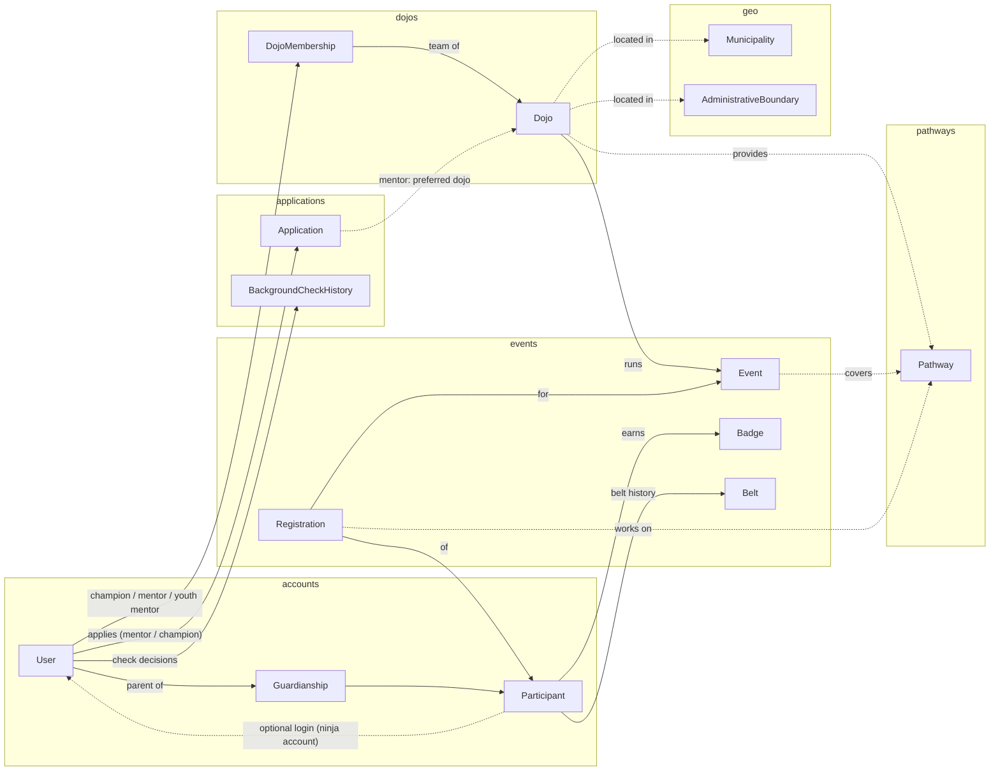
```mermaid
flowchart LR
    subgraph accounts
        User
        Guardianship
        Participant
    end
    subgraph dojos
        Dojo
        DojoMembership
    end
    subgraph events
        Event
        Registration
        Badge
        Belt
    end
    subgraph applications
        Application
        BackgroundCheckHistory
    end
    subgraph pathways
        Pathway
    end
    subgraph geo
        Municipality
        AdministrativeBoundary
    end

    User -- "champion / mentor / youth mentor" --> DojoMembership
    DojoMembership -- "team of" --> Dojo
    User -- "parent of" --> Guardianship
    Guardianship --> Participant
    Participant -. "optional login (ninja account)" .-> User
    Dojo -- runs --> Event
    Registration -- for --> Event
    Registration -- of --> Participant
    Dojo -. "provides" .-> Pathway
    Event -. "covers" .-> Pathway
    Registration -. "works on" .-> Pathway
    Participant -- earns --> Badge
    Participant -- "belt history" --> Belt
    User -- "applies (mentor / champion)" --> Application
    User -- "check decisions" --> BackgroundCheckHistory
    Application -. "mentor: preferred dojo" .-> Dojo
    Dojo -. located in .-> Municipality & AdministrativeBoundary
```

---

## 2. Accounts and roles

`accounts.User` is every login, with `account_type` telling the two kinds
apart: a normal **adult** account, or a **ninja**'s own login. There are no
role subclasses (redesign phases 1–3, section 10).

- **Parents** are plain adult accounts linked to their children through
  `Guardianship`. A child can have more than one guardian, and any adult
  account can add children from its account page. No background check is
  ever needed for that.
- **Champions and mentors** are adult accounts with an approved
  `Application` (section 6) and a **valid background check on the
  account**; what they do at a dojo is a `DojoMembership` (section 3).
- A **`Participant`** (a ninja attending sessions) is **not** a user. It
  gets a login (a `User` with `account_type="ninja"`, linked through
  `Participant.account`) only if a parent opts it in.

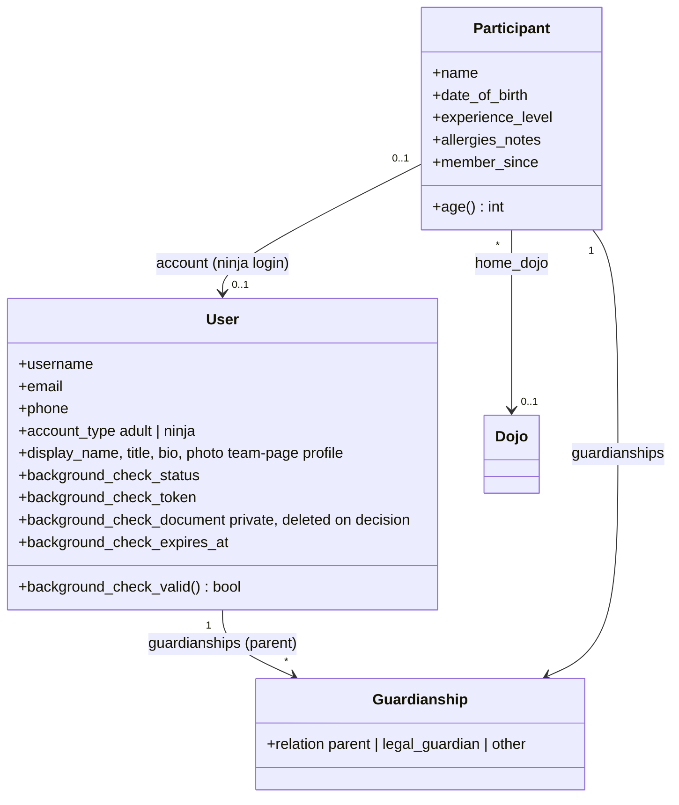
```mermaid
classDiagram
    direction TB
    class User {
        +username
        +email
        +phone
        +account_type  adult | ninja
        +display_name, title, bio, photo  team-page profile
        +background_check_status
        +background_check_token
        +background_check_document  private, deleted on decision
        +background_check_expires_at
        +background_check_valid() bool
    }
    class Guardianship {
        +relation  parent | legal_guardian | other
    }
    class Participant {
        +name
        +date_of_birth
        +experience_level
        +allergies_notes
        +member_since
        +age() int
    }

    User "1" --> "*" Guardianship : guardianships (parent)
    Participant "1" --> "*" Guardianship : guardianships
    Participant "0..1" --> "0..1" User : account (ninja login)
    Participant "*" --> "0..1" Dojo : home_dojo
```

Which account does what:

| Account | Created by | Background check | Lands on after login |
|---|---|---|---|
| adult (parent) | self-service sign-up (`register_guardian`) | never needed | their account page (`/account/`) |
| adult champion / mentor | the same self-service sign-up, then an approved `Application` | required for dojo access (a lapsed check blocks the dashboards, never the login) | first accessible dojo's dashboard |
| ninja | a parent opts a child in | none | the ninja's own page (`/account/ninja/<id>/`) |

---

## 3. Dojos, teams and admin access

A dojo's team is a set of **memberships** (`DojoMembership`), one per
account and dojo (redesign phase 2, section 10). Each membership has a role
and a status:

- **Roles:** `champion` (the dojo's owner, exactly one active per dojo),
  `mentor` (an adult helper) and `youth_mentor` (a ninja account, promoted by
  a champion/mentor of the same dojo, recorded in `promoted_by`).
- **Status:** `requested` → `active` → `dormant`. People who leave go
  `dormant` and are never deleted, so past events' teams (`Event.team`) keep
  their history. Rejoining reuses the same row.
- **Profiles:** the team-page profile (display name, title, bio, photo,
  `show_on_team_pages`) lives on the **account** and is shared by every dojo
  the person is on.
- **Dojo status:** `draft` → `active` ⇄ `dormant` → `archived` → `draft`.
  Only `active` dojos, and their events, are public (`Dojo.objects.public()`,
  `Event.objects.visible()`). All changes go through `dojos/team.py`.

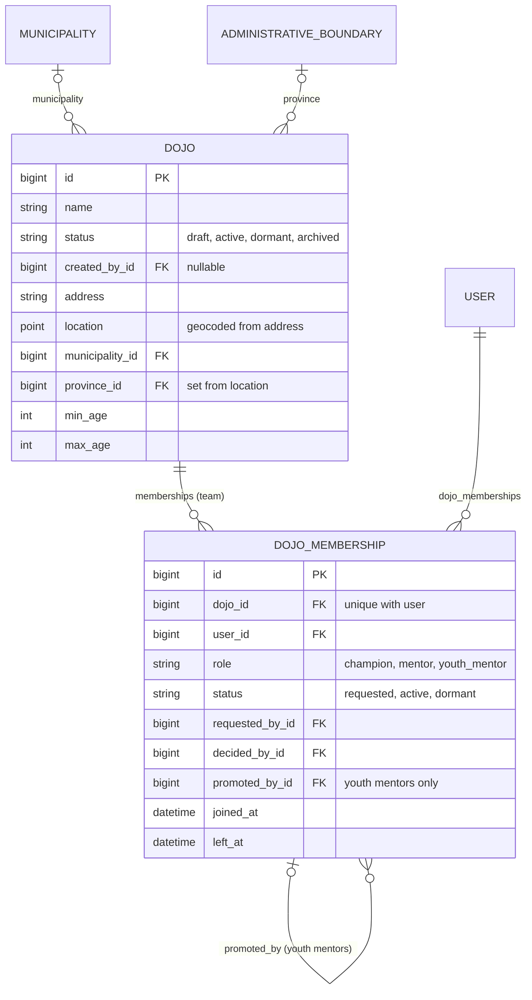
```mermaid
erDiagram
    DOJO ||--o{ DOJO_MEMBERSHIP : "memberships (team)"
    USER ||--o{ DOJO_MEMBERSHIP : "dojo_memberships"
    DOJO_MEMBERSHIP |o--o{ DOJO_MEMBERSHIP : "promoted_by (youth mentors)"
    MUNICIPALITY |o--o{ DOJO : "municipality"
    ADMINISTRATIVE_BOUNDARY |o--o{ DOJO : "province"

    DOJO {
        bigint id PK
        string name
        string status "draft, active, dormant, archived"
        bigint created_by_id FK "nullable"
        string address
        point location "geocoded from address"
        bigint municipality_id FK
        bigint province_id FK "set from location"
        int min_age
        int max_age
    }
    DOJO_MEMBERSHIP {
        bigint id PK
        bigint dojo_id FK "unique with user"
        bigint user_id FK
        string role "champion, mentor, youth_mentor"
        string status "requested, active, dormant"
        bigint requested_by_id FK
        bigint decided_by_id FK
        bigint promoted_by_id FK "youth mentors only"
        datetime joined_at
        datetime left_at
    }
```

### Who can use a dojo's admin area

`dojos/access.py` gives admin access to an account with an **active
`champion` or `mentor` membership** at the dojo, and only while its
background check is valid. Youth mentors never get admin access, and
neither do requested or dormant memberships. Each role maps to a set of
capabilities. With no role at all the dojo gives a **404**; a role that
lacks the view's capability gets a **403**.

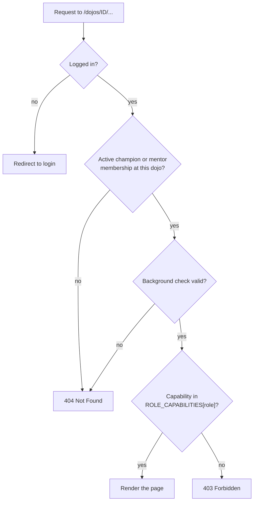
```mermaid
flowchart TD
    R[Request to /dojos/ID/...] --> A{Logged in?}
    A -- no --> L[Redirect to login]
    A -- yes --> M{"Active champion or mentor<br/>membership at this dojo?"}
    M -- no --> N404[404 Not Found]
    M -- yes --> V{Background check valid?}
    V -- no --> N404
    V -- yes --> C{"Capability in<br/>ROLE_CAPABILITIES[role]?"}
    C -- yes --> OK[Render the page]
    C -- no --> N403[403 Forbidden]
```

| Capability | Gates | CHAMPION | MENTOR |
|---|---|:-:|:-:|
| *(any role)* | dashboard, events list, notification bell | ✓ | ✓ |
| `TAKE_ATTENDANCE` | attendance pages, marking present/absent | ✓ | ✓ |
| `MANAGE_EVENTS` | create/edit events, change status | ✓ | ✓ |
| `EDIT_SETTINGS` | dojo profile settings | ✓ | ✓ |
| `MANAGE_TEAM` | accept/decline join requests, add/remove mentors, promote youth mentors | ✓ | ✓ |
| `AWARD_BELTS` | award a ninja a belt (from the attendance list) | ✓ | ✓ |
| `MANAGE_LIFECYCLE` | launch / dormant / archive / reopen the dojo | ✓ | — |
| *(champion only)* | hand over the champion role | ✓ | — |

To restrict mentors, remove entries from `ROLE_CAPABILITIES[MENTOR]`.
Who may *join* a team at all is `access.is_approved_mentor`: an adult account
with an approved mentor (or champion) `Application` and a valid background
check (`applications.services`).

---

## 4. Events, registrations and attendance

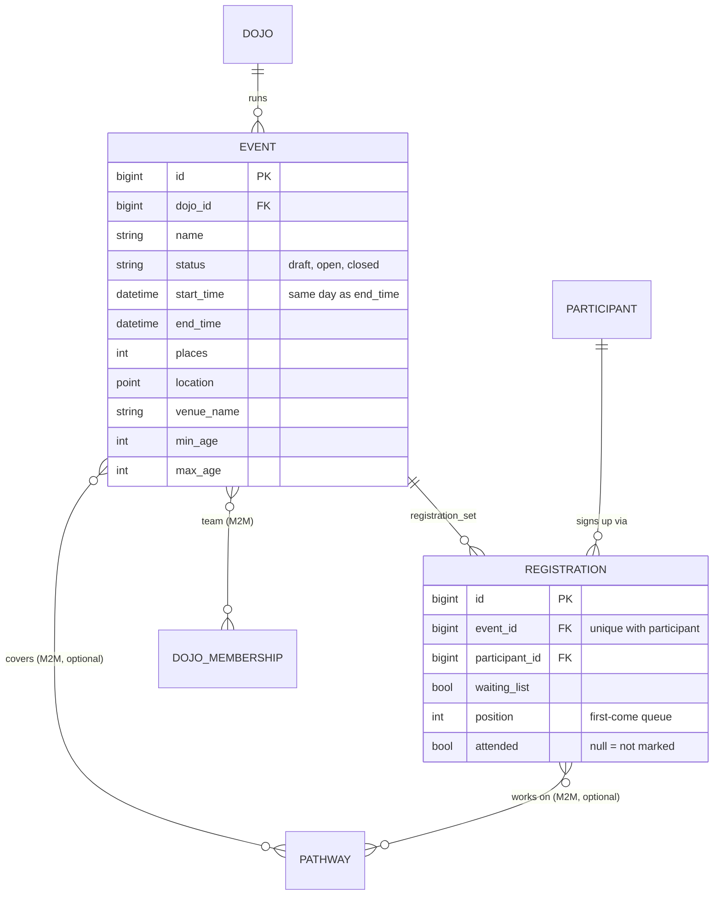
```mermaid
erDiagram
    DOJO ||--o{ EVENT : "runs"
    EVENT ||--o{ REGISTRATION : "registration_set"
    PARTICIPANT ||--o{ REGISTRATION : "signs up via"
    EVENT }o--o{ PATHWAY : "covers (M2M, optional)"
    REGISTRATION }o--o{ PATHWAY : "works on (M2M, optional)"
    EVENT }o--o{ DOJO_MEMBERSHIP : "team (M2M)"

    EVENT {
        bigint id PK
        bigint dojo_id FK
        string name
        string status "draft, open, closed"
        datetime start_time "same day as end_time"
        datetime end_time
        int places
        point location
        string venue_name
        int min_age
        int max_age
    }
    REGISTRATION {
        bigint id PK
        bigint event_id FK "unique with participant"
        bigint participant_id FK
        bool waiting_list
        int position "first-come queue"
        bool attended "null = not marked"
    }
```

- **Places:** `Event.places_left` = `places` − confirmed registrations
  (those with `waiting_list=False`). When a confirmed place is cancelled,
  the next person on the waiting list is promoted and the dojo's team (its
  active champion and mentors) is
  notified.
- **Attendance:** `Registration.attended` has three states: `None` (not
  marked yet), `True` (present), `False` (absent). Only confirmed
  registrations can be marked.
- **Pathways:** `Event.pathways` (what the session covers, shown on its
  public page) is pre-selected from `Dojo.pathways` on a new event;
  `Registration.pathways` (what this ninja works on) is set to the
  event's at signup and narrowed by the team from the attendance list
  (`dojo_event_registration_pathways`, `TAKE_ATTENDANCE`). Neither is
  restricted to the level above. See section 7.

### Event status

The dojo's team sets any status directly (`dojo_event_set_status`); it isn't a
one-way lifecycle. Existing registrations are kept whatever the status.

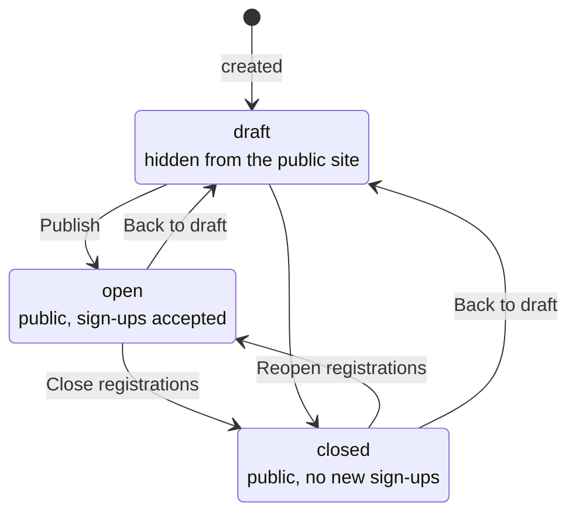
```mermaid
stateDiagram-v2
    [*] --> draft : created
    draft --> open : Publish
    open --> closed : Close registrations
    closed --> open : Reopen registrations
    open --> draft : Back to draft
    closed --> draft : Back to draft
    draft --> closed

    draft : draft<br/>hidden from the public site
    open : open<br/>public, sign-ups accepted
    closed : closed<br/>public, no new sign-ups
```

---

## 5. Badges and belts

Two separate things a ninja collects (redesign phase 5), both in `events`
with their rules in `events/awards.py`:

- A **badge** is an award: either a **one-off** ("did the thing", e.g.
  attended a CoderDojo for Girls session) or a **milestone** reached by a
  number of sessions attended (the attendance wristbands). `NinjaBadge`
  holds one ninja's progress on one badge. Milestones are recomputed
  (`sync_milestones`) whenever the dojo team marks attendance; an earned
  badge stays earned if a mark is later undone.
- A **belt** is a ninja's **proficiency level**: one overall track ordered
  by `Belt.level`, not linked to pathways. `NinjaBelt` is an append-only
  history (current belt = the highest level, `Participant.current_belt`).
  Only an **active champion or mentor** with a valid check
  (`AWARD_BELTS`) can award one (`award_belt`), from the attendance list,
  to a ninja who has been to one of that dojo's sessions, and only a belt
  above the ninja's current one. Each row records the account, the
  membership and that membership's role at the time ("Jan, as mentor of
  CoderDojo Ghent"). A milestone badge can optionally `grants_belt`:
  reaching it awards that belt as the membership that marked the
  attendance.

The ninja's page shows the current belt with its history, and the
badges carousel. The attendance list shows each ninja's current belt.

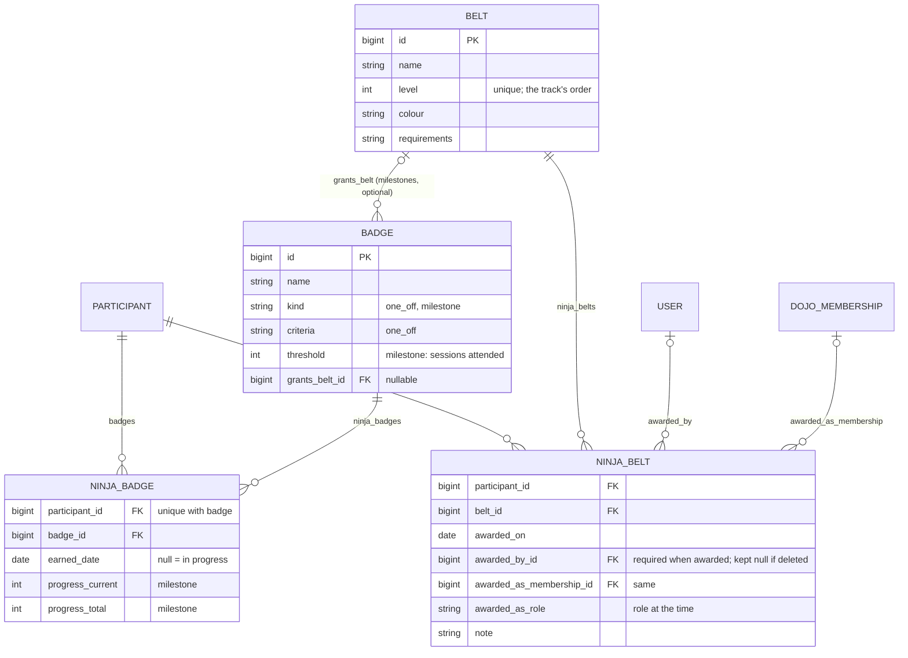
```mermaid
erDiagram
    PARTICIPANT ||--o{ NINJA_BADGE : "badges"
    BADGE ||--o{ NINJA_BADGE : "ninja_badges"
    PARTICIPANT ||--o{ NINJA_BELT : "belts (history)"
    BELT ||--o{ NINJA_BELT : "ninja_belts"
    BELT |o--o{ BADGE : "grants_belt (milestones, optional)"
    USER |o--o{ NINJA_BELT : "awarded_by"
    DOJO_MEMBERSHIP |o--o{ NINJA_BELT : "awarded_as_membership"

    BADGE {
        bigint id PK
        string name
        string kind "one_off, milestone"
        string criteria "one_off"
        int threshold "milestone: sessions attended"
        bigint grants_belt_id FK "nullable"
    }
    NINJA_BADGE {
        bigint participant_id FK "unique with badge"
        bigint badge_id FK
        date earned_date "null = in progress"
        int progress_current "milestone"
        int progress_total "milestone"
    }
    BELT {
        bigint id PK
        string name
        int level "unique; the track's order"
        string colour
        string requirements
    }
    NINJA_BELT {
        bigint participant_id FK
        bigint belt_id FK
        date awarded_on
        bigint awarded_by_id FK "required when awarded; kept null if deleted"
        bigint awarded_as_membership_id FK "same"
        string awarded_as_role "role at the time"
        string note
    }
```

---

## 6. Applications and background checks

Onboarding is **account-level** (redesign phase 3): an adult account applies
**once** to become a **mentor** or a **champion** (`Application`), not once
per dojo. The Belgian Article 596.2 criminal-record extract is checked **on
the account** (the `background_check_*` fields on `User`). Every review
decision is appended to `BackgroundCheckHistory`: who decided and when. The
uploaded document is **deleted as soon as a decision is made**, validate or
reject; the history never stores it. All of this lives in
`applications/services.py`.

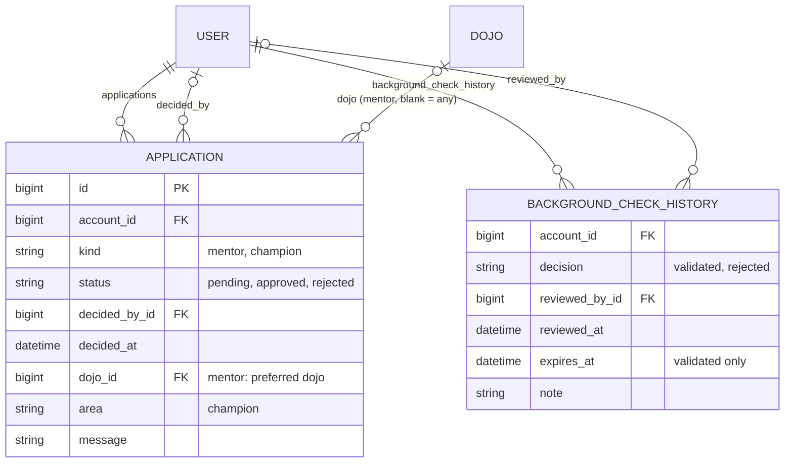
```mermaid
erDiagram
    USER ||--o{ APPLICATION : "applications"
    USER ||--o{ BACKGROUND_CHECK_HISTORY : "background_check_history"
    USER |o--o{ BACKGROUND_CHECK_HISTORY : "reviewed_by"
    USER |o--o{ APPLICATION : "decided_by"
    DOJO |o--o{ APPLICATION : "dojo (mentor, blank = any)"

    APPLICATION {
        bigint id PK
        bigint account_id FK
        string kind "mentor, champion"
        string status "pending, approved, rejected"
        bigint decided_by_id FK
        datetime decided_at
        bigint dojo_id FK "mentor: preferred dojo"
        string area "champion"
        string message
    }
    BACKGROUND_CHECK_HISTORY {
        bigint account_id FK
        string decision "validated, rejected"
        bigint reviewed_by_id FK
        datetime reviewed_at
        datetime expires_at "validated only"
        string note
    }
```

### Background check lifecycle (on the account)

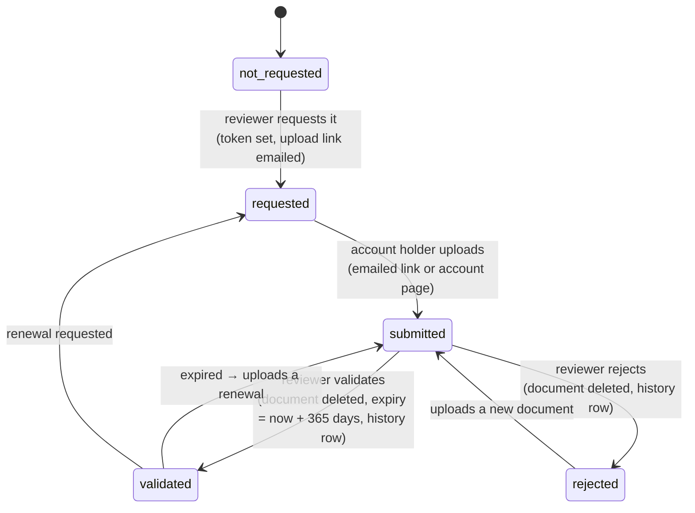
```mermaid
stateDiagram-v2
    [*] --> not_requested
    not_requested --> requested : reviewer requests it<br/>(token set, upload link emailed)
    requested --> submitted : account holder uploads<br/>(emailed link or account page)
    submitted --> validated : reviewer validates<br/>(document deleted, expiry = now + 365 days, history row)
    submitted --> rejected : reviewer rejects<br/>(document deleted, history row)
    rejected --> submitted : uploads a new document
    validated --> submitted : expired → uploads a renewal
    validated --> requested : renewal requested
```

### From application to a dojo

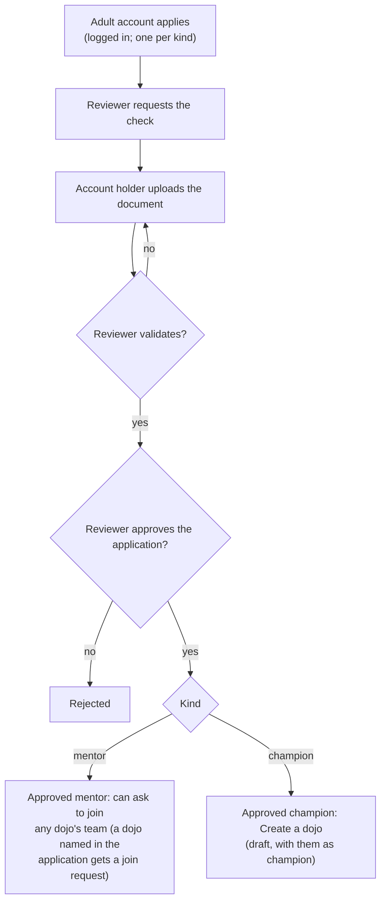
```mermaid
flowchart TD
    A["Adult account applies<br/>(logged in; one per kind)"] --> R[Reviewer requests the check]
    R --> U[Account holder uploads the document]
    U --> V{Reviewer validates?}
    V -- no --> U
    V -- yes --> P{Reviewer approves the application?}
    P -- no --> X[Rejected]
    P -- yes --> K{Kind}
    K -- mentor --> M["Approved mentor: can ask to join<br/>any dojo's team (a dojo named in the<br/>application gets a join request)"]
    K -- champion --> C["Approved champion: Create a dojo<br/>(draft, with them as champion)"]
```

A lapsed check (validated, then expired) **never blocks login**. It makes
`background_check_valid` false, so the account's champion/mentor memberships
stop granting dojo access (section 3) until a renewal is validated. The
account page links to the upload.

---

## 7. Learning pathways and content

`pathways` is a read-mostly catalogue with no enrolment state. It's
linked at three optional levels, each pre-filled from the one above:
`Dojo.pathways` (what the dojo provides, set on its Settings page and
shown on its public page) → `Event.pathways` (what a session covers) →
`Registration.pathways` (what one ninja works on; it feeds the ninja's
history and the attendance list). The `content`
models are each optionally scoped to one dojo, event or pathway, or
site-wide when the scoping key is blank.

`content.OrganisationTeamMember` is the organisation's team listing (the
homepage's "Meet the team" and `team/<id>/`). It's display only, each entry
with a position ("Member of the board" is one of them), and it's separate
from any access.

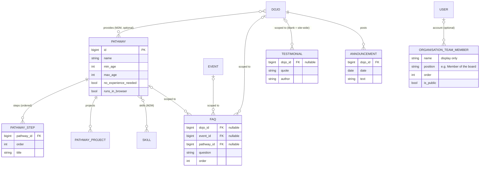
```mermaid
erDiagram
    PATHWAY ||--o{ PATHWAY_STEP : "steps (ordered)"
    PATHWAY ||--o{ PATHWAY_PROJECT : "projects"
    PATHWAY }o--o{ SKILL : "skills (M2M)"
    DOJO }o--o{ PATHWAY : "provides (M2M, optional)"
    DOJO |o--o{ FAQ : "scoped to"
    EVENT |o--o{ FAQ : "scoped to"
    PATHWAY |o--o{ FAQ : "scoped to"
    DOJO |o--o{ TESTIMONIAL : "scoped to (blank = site-wide)"
    DOJO ||--o{ ANNOUNCEMENT : "posts"
    USER |o--o{ ORGANISATION_TEAM_MEMBER : "account (optional)"

    PATHWAY {
        bigint id PK
        string name
        int min_age
        int max_age
        bool no_experience_needed
        bool runs_in_browser
    }
    PATHWAY_STEP {
        bigint pathway_id FK
        int order
        string title
    }
    FAQ {
        bigint dojo_id FK "nullable"
        bigint event_id FK "nullable"
        bigint pathway_id FK "nullable"
        string question
        int order
    }
    TESTIMONIAL {
        bigint dojo_id FK "nullable"
        string quote
        string author
    }
    ORGANISATION_TEAM_MEMBER {
        string name "display only"
        string position "e.g. Member of the board"
        int order
        bool is_public
    }
    ANNOUNCEMENT {
        bigint dojo_id FK
        date date
        string text
    }
```

---

## 8. Notifications

Each `Notification` row belongs to one recipient, so read state is per
user. An event that concerns several people creates one row per recipient.
Always create notifications through `notifications.services.notify()`: it
writes the row, then pushes the updated bell over the WebSocket channel
layer, on a best-effort basis.

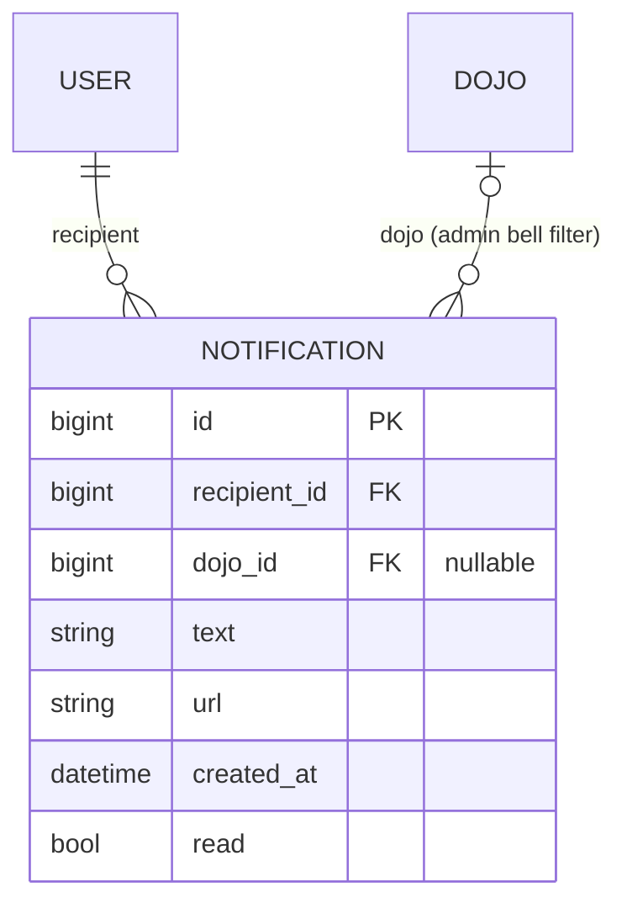
```mermaid
erDiagram
    USER ||--o{ NOTIFICATION : "recipient"
    DOJO |o--o{ NOTIFICATION : "dojo (admin bell filter)"

    NOTIFICATION {
        bigint id PK
        bigint recipient_id FK
        bigint dojo_id FK "nullable"
        string text
        string url
        datetime created_at
        bool read
    }
```

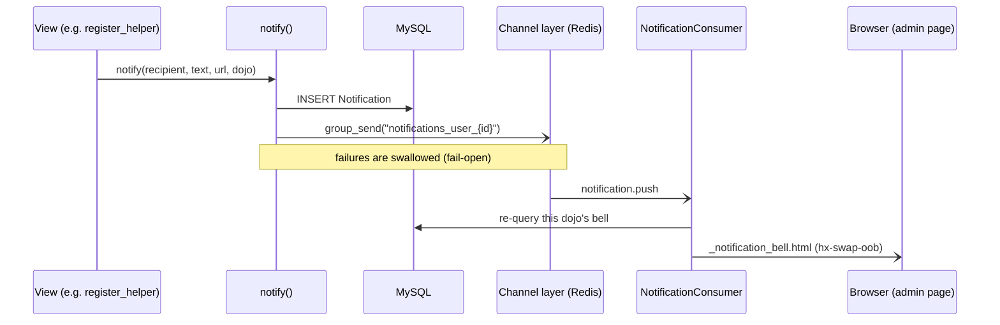
```mermaid
sequenceDiagram
    participant V as View (e.g. register_helper)
    participant S as notify()
    participant DB as MySQL
    participant CL as Channel layer (Redis)
    participant C as NotificationConsumer
    participant B as Browser (admin page)

    V->>S: notify(recipient, text, url, dojo)
    S->>DB: INSERT Notification
    S-)CL: group_send("notifications_user_{id}")
    Note over S,CL: failures are swallowed (fail-open)
    CL-)C: notification.push
    C->>DB: re-query this dojo's bell
    C-)B: _notification_bell.html (hx-swap-oob)
```

---

## 9. Geo reference data

Reference data only (seeded by `seed_geo`), with no URLs of its own. A
dojo's `province` is derived from its geocoded `location`: a
point-in-polygon lookup against `AdministrativeBoundary`, falling back to
the nearest boundary. Distance searches always use
`geo.functions.DistanceSphere` (MySQL `ST_Distance_Sphere`).

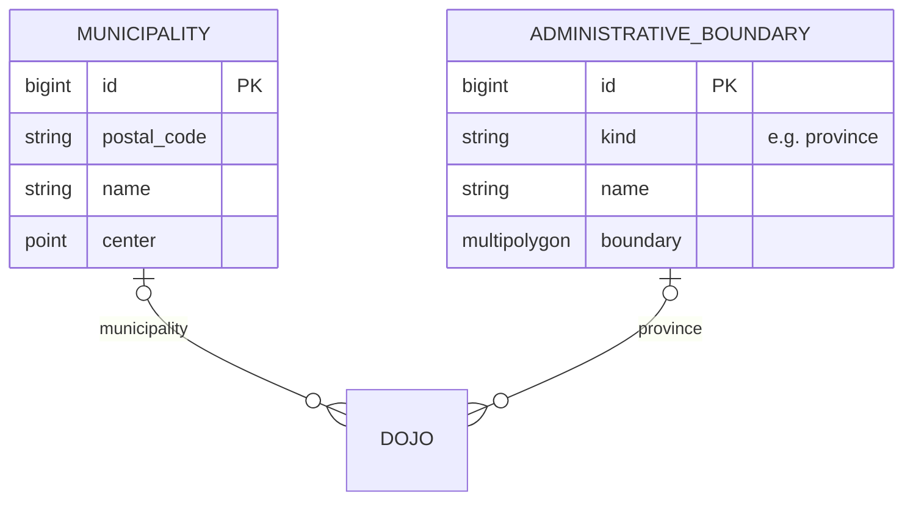
```mermaid
erDiagram
    MUNICIPALITY |o--o{ DOJO : "municipality"
    ADMINISTRATIVE_BOUNDARY |o--o{ DOJO : "province"

    MUNICIPALITY {
        bigint id PK
        string postal_code
        string name
        point center
    }
    ADMINISTRATIVE_BOUNDARY {
        bigint id PK
        string kind "e.g. province"
        string name
        multipolygon boundary
    }
```

---

## 10. Planned redesign (in progress)

> **Status: direction agreed, implementation started**; see the
> [Implementation plan](#implementation-plan) for which phases have landed.
> Until a phase is ticked off there, sections 1–9 still describe what's
> actually in the code. This section records the direction, so that new
> work doesn't add more to structures that are due to go.

### Nomenclature

The redesign uses CoderDojo's own vocabulary. Use these terms in the new
model, in the UI and in the docs:

| Term | Meaning | Role / entity in the redesign | Today's code (sections 1–9) |
|---|---|---|---|
| **Champion** | The **dojo owner**: runs and manages a dojo. Exactly one per dojo. | membership role `champion` | `DojoOwner`, `Dojo.owner`, shown as "Lead Coach" |
| **Mentor** / **Coach** | An adult **helper** who helps manage and run a dojo. | membership role `mentor` | `HelperAccount`, `Mentor.VOLUNTEER` ("Volunteer mentor") |
| **Ninja** | A **child aged 7–17** who visits a dojo. | `NINJA` (plus an optional `NINJA_ACCOUNT` login) | `Participant` (+ `ChildAccount`) |
| **Youth mentor** | A **ninja who helps run events**. Promoted by the dojo's champion or a mentor. | membership role `youth_mentor` | `Mentor.CHAMPION` / `Mentor.NINJA` linked to a `ChildAccount` |
| **Badge** | An **award** a ninja can achieve: either a one-off ("did the thing") or a **milestone** reached by a count (e.g. the attendance wristbands). | `BADGE` (kind `one_off` / `milestone`) / `NINJA_BADGE` | `BadgeAward` and `MilestoneAward` / `ParticipantAward` |
| **Belt** | A ninja's **proficiency level**: how skilled they are, not how often they came. | `BELT` / `NINJA_BELT` | nothing today. A milestone award *can* be set up to grant a belt, but doesn't have to. |

Watch out for two collisions with today's code:

- **"Champion"** changes meaning. Today `Mentor.CHAMPION` ("Dojo
  champion") is an honoured *ninja*. In the redesign a **Champion is the
  dojo owner**, and the honoured-ninja role is a **Youth mentor**.
- **"Mentor"** today is the name of the team-page *profile table*
  (`dojos.Mentor`), which the redesign removes. In the redesign
  **mentor** is only a *role* (an adult helper) on a dojo membership.

### What's wrong with the current model

- **`Mentor` shouldn't be a table of its own.** Today it's a copy of a
  person (name, email, photo) with up to four optional links back to the
  real account (`owner_account`, `helper_account`, `guardian_account`,
  `child_account`). That's why `Mentor.clean()` needs "at most one link"
  rules and `Dojo.sync_lead_coach()` exists to keep the Lead Coach copy in
  step with `Dojo.owner`. What the site actually needs is a way to show
  **the team working at a dojo**: the accounts involved and each one's role
  there.
- **Champion and mentor aren't kinds of account.** They describe how a
  person relates to one particular dojo, and a person can have that
  relationship with several dojos. Modelling them as account subclasses
  (`DojoOwner`, `HelperAccount`), plus `Dojo.owner` and
  `Mentor.helper_account`, spreads one idea across three places.
- **Background checks belong to the person.** The check fields already
  live on `accounts.User`, but whether a check is required depends on which
  role subclasses an account has, and the check itself is tracked on the
  applications. In the new model the check is tracked on the account, and
  it's required by the **relationship**: holding a `champion` or `mentor`
  membership needs a valid check, while plain use of the site doesn't.

### Target model

**Two account types only:**

- **`NINJA_ACCOUNT`**: a ninja's own login. **No background check.** A
  ninja can be promoted to **Youth mentor** at a dojo by that dojo's
  champion or one of its mentors.
- **Account** (the normal, adult account; what `User` is today, minus the
  role subclasses). Every account *can* go through the background-check
  process (`BackgroundCheckMixin`'s lifecycle, tracked on the account
  itself), but it's **only required to become a champion or a mentor**
  *(decided)*. A parent using the site normally (registering their family,
  managing their ninjas, signing them up for sessions) never needs a
  check. Holding a `champion` or `mentor` membership requires a validated,
  unexpired check. Every decision on a check is also written to an audit
  history of who approved or rejected it, and when.

**The team is a relation between an account and a dojo.** Champion,
mentor and youth-mentor roles are all stored on one relation row per
account and dojo (below called `DojoMembership`; the name isn't decided).
One account can be linked to any number of dojos, with the role that fits
each relationship.

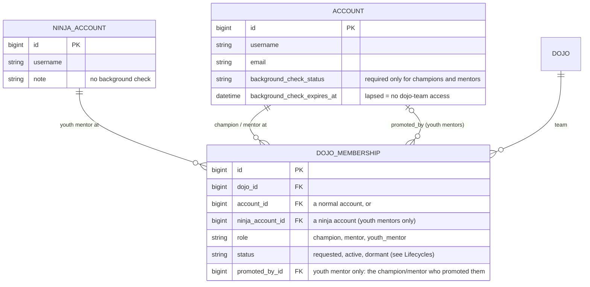
```mermaid
erDiagram
    ACCOUNT ||--o{ DOJO_MEMBERSHIP : "champion / mentor at"
    NINJA_ACCOUNT ||--o{ DOJO_MEMBERSHIP : "youth mentor at"
    DOJO ||--o{ DOJO_MEMBERSHIP : "team"
    ACCOUNT |o--o{ DOJO_MEMBERSHIP : "promoted_by (youth mentors)"

    ACCOUNT {
        bigint id PK
        string username
        string email
        string background_check_status "required only for champions and mentors"
        datetime background_check_expires_at "lapsed = no dojo-team access"
    }
    NINJA_ACCOUNT {
        bigint id PK
        string username
        string note "no background check"
    }
    DOJO_MEMBERSHIP {
        bigint id PK
        bigint dojo_id FK
        bigint account_id FK "a normal account, or"
        bigint ninja_account_id FK "a ninja account (youth mentors only)"
        string role "champion, mentor, youth_mentor"
        string status "requested, active, dormant (see Lifecycles)"
        bigint promoted_by_id FK "youth mentor only: the champion/mentor who promoted them"
    }
```

Rules the new model needs to enforce:

| Role | Who can hold it | How it's granted |
|---|---|---|
| `champion` | normal account, **approved as a champion**, with a valid background check | creating a dojo (the creator becomes its champion), or a **transfer** from the current champion |
| `mentor` | normal account, **approved as a mentor**, with a valid background check | the mentor **requests to join** and an active champion/mentor of that dojo accepts, **or** an active champion/mentor **adds** them |
| `youth_mentor` | ninja account | promoted by an active `champion` or `mentor` of **the same dojo** |

"Approved as a mentor" and "approved as a champion" are **account-level,
one-time** approvals (an application plus a background check; see
Lifecycles below). They aren't tied to a dojo: once approved, a mentor can
join as many dojos as accept them, and a champion can create a dojo.

- A membership links exactly one of `account` / `ninja_account`, and the
  role has to match the account type (`youth_mentor` only on ninja
  accounts; `champion`/`mentor` only on normal accounts).
- There's one membership per (account, dojo). Leaving and rejoining reuses
  the same row (dormant → active again) rather than adding a second one.
- **Exactly one active `champion` per dojo.** It changes hands only by
  transfer (below), never by having two champions at once.
- `promoted_by` must hold a `champion` or `mentor` membership at that same
  dojo.
- The team page lists a dojo's `active` memberships whose account has
  `show_on_team_pages` set, the champion first, using the account's shared
  profile. That covers what `Mentor.objects.lead_coach_first()` does
  today; the "Lead Coach" label becomes **Champion**.
- Admin access (`dojos/access.py`) reads the role from the membership, and
  only an **`active`** membership whose account has a valid check grants
  access to that dojo's dashboard. The role→capability mapping
  (`ROLE_CAPABILITIES`) already works this way; today's `OWNER`/`HELPER`
  become `CHAMPION`/`MENTOR`, plus a `YOUTH_MENTOR` entry, probably with no
  admin capabilities.

### Lifecycles

#### Becoming a mentor or champion, then joining a dojo

Approval happens **once per account**, not once per dojo. Joining a
specific dojo's team is a separate, lightweight step handled by that
dojo's own team, with no admin involved.

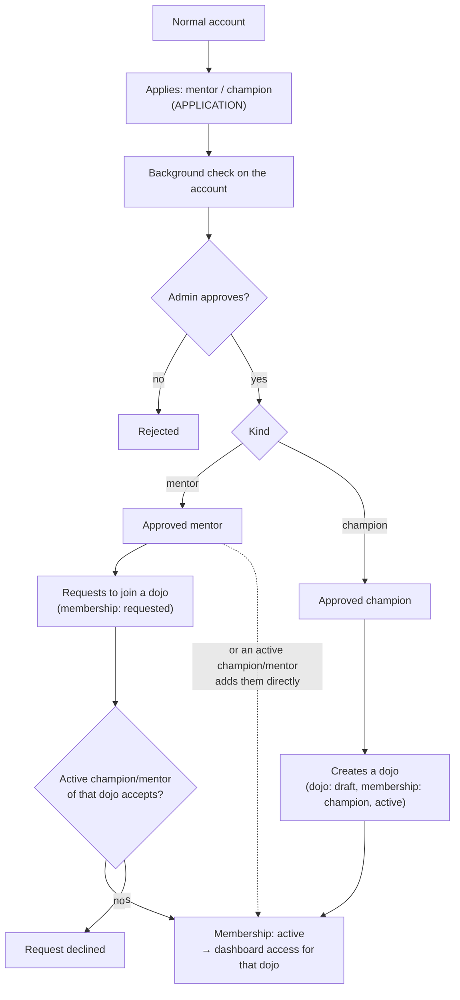
```mermaid
flowchart TD
    A[Normal account] --> B["Applies: mentor / champion<br/>(APPLICATION)"]
    B --> C[Background check on the account]
    C --> D{Admin approves?}
    D -- no --> X[Rejected]
    D -- yes --> E{Kind}
    E -- mentor --> H[Approved mentor]
    E -- champion --> S[Approved champion]

    H --> J1["Requests to join a dojo<br/>(membership: requested)"]
    J1 --> J2{"Active champion/mentor<br/>of that dojo accepts?"}
    J2 -- yes --> ACT["Membership: active<br/>→ dashboard access for that dojo"]
    J2 -- no --> DEC[Request declined]
    H -. "or an active champion/mentor<br/>adds them directly" .-> ACT

    S --> N["Creates a dojo<br/>(dojo: draft, membership: champion, active)"]
    N --> ACT
```

#### Dojo lifecycle

A new dojo starts in `draft`. The draft is where the champion sets up the
profile, team and first sessions before anything is public.

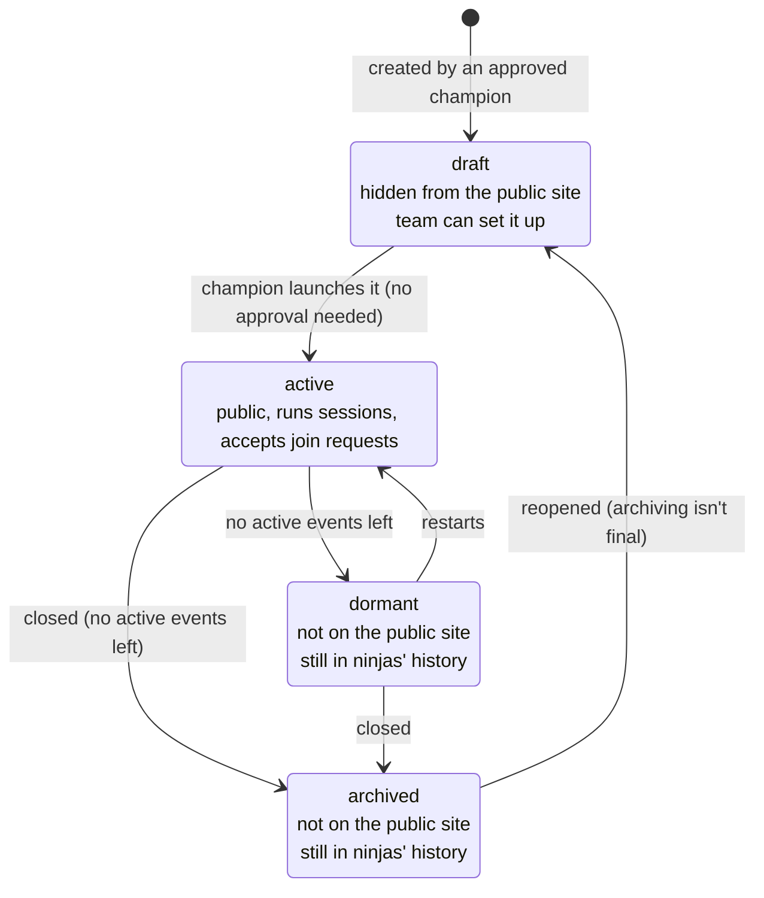
```mermaid
stateDiagram-v2
    [*] --> draft : created by an approved champion
    draft --> active : champion launches it (no approval needed)
    active --> dormant : no active events left
    dormant --> active : restarts
    active --> archived : closed (no active events left)
    dormant --> archived : closed
    archived --> draft : reopened (archiving isn't final)

    draft : draft<br/>hidden from the public site<br/>team can set it up
    active : active<br/>public, runs sessions, accepts join requests
    dormant : dormant<br/>not on the public site<br/>still in ninjas' history
    archived : archived<br/>not on the public site<br/>still in ninjas' history
```

Decided rules:

- **Launching:** the champion moves a dojo from `draft` to `active`
  themselves. No admin approval is needed; they were already approved as
  a champion.
- **Going dormant or archived:** only allowed when the dojo has **no active
  events**, meaning no upcoming event that's still `draft` or `open`. The
  transition is refused while an active event exists; the team has to
  close or finish those first. In practice a dojo goes dormant when
  nothing has been planned for a long time.
- **Pending join requests** (`requested` memberships) are **declined
  automatically** when a dojo goes dormant or is archived, and the
  requesting mentors are notified.
- **Dormancy is a manual decision, with a nudge.** The site never makes a
  dojo dormant by itself. Once an `active` dojo has had **no events planned
  for half a year** (six months since its last event, with nothing
  upcoming), its dashboard flags it, and the dojo's active team (champion
  and mentors) and the **board** (`ORGANISATION_ROLE`) get a **persistent**
  notification. It stays visible until the situation is resolved, either
  because an event is planned or because the dojo is marked dormant or
  archived, rather than being sent once or repeated. The board sees these
  on a **board dashboard that hasn't been built yet**.
  - Model note: "persistent until resolved" doesn't fit today's
    `Notification`, which is a one-off message with `read`. Either give it
    a `resolved_at` (plus a key such as `kind` + `dojo`, so the alert isn't
    duplicated), or compute the alert from the data (last event date +
    status) every time the dashboards render. Decide when the board
    dashboard is built.
- **Visibility:** `dormant` and `archived` dojos **don't appear on the
  public site** (dojo finder, dojo pages, upcoming sessions). They
  **still appear in ninjas' own history**: past sessions, registrations,
  badges and belts keep showing the dojo's name for the ninjas and parents
  concerned.
- **Archiving isn't final:** an archived dojo can be reopened. It goes
  **back to `draft`**, hidden from the public site, so the team can check
  its profile and team before launching it again.
- **Team powers:** any **active** mentor can do what the champion can for
  team management: accept join requests, add mentors directly, and
  promote ninjas to youth mentor. Only the champion can transfer the
  champion role.

#### Team membership lifecycle

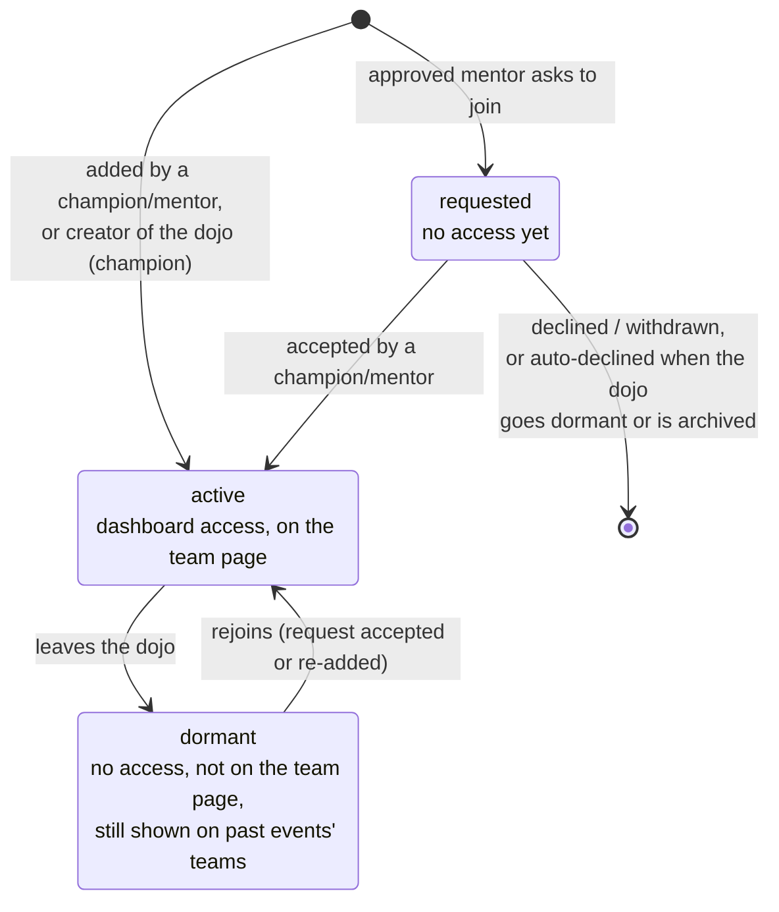
```mermaid
stateDiagram-v2
    [*] --> requested : approved mentor asks to join
    [*] --> active : added by a champion/mentor,<br/>or creator of the dojo (champion)
    requested --> active : accepted by a champion/mentor
    requested --> [*] : declined / withdrawn,<br/>or auto-declined when the dojo<br/>goes dormant or is archived
    active --> dormant : leaves the dojo
    dormant --> active : rejoins (request accepted or re-added)

    requested : requested<br/>no access yet
    active : active<br/>dashboard access, on the team page
    dormant : dormant<br/>no access, not on the team page,<br/>still shown on past events' teams
```

- **Leaving:** a mentor (or youth mentor) can leave a dojo at any time.
  Their membership becomes `dormant`. It isn't deleted, so it still
  appears on the **event team** of the past sessions they helped run, but
  it's no longer on the team page and gives no dashboard access.
- **Champion transfer:** the active champion can hand the champion role to
  one of the dojo's **active mentors**. In one step, the chosen mentor's
  membership becomes `champion` and the previous champion's becomes
  `mentor` (still active; they can then leave like any other mentor). The
  target must be an active mentor at that dojo with a valid check. A
  champion can't simply leave: they transfer the role first, or the dojo
  is archived.
- **Checks lapsing:** when an account's background check lapses, all its
  `champion`/`mentor` memberships stop granting access until it's renewed.
  Their status doesn't change: they're still `active`, just not usable.

### Pathways move to the dojo and event scope

Today a pathway is linked only per ninja, per session, and only one
(`Registration.pathway`: "what this child worked on"). In the redesign
pathways are set at three levels, each one **pre-filled from the level
above**:

- **Dojo ↔ pathway** (many-to-many, optional): the pathways a dojo
  **provides** as a service, for example "we do Scratch and micro:bit".
- **Event ↔ pathway** (many-to-many, optional): the pathways a specific
  **session** covers. Pre-filled from the dojo's.
- **Registration ↔ pathway** (many-to-many, optional): the pathways **this
  ninja** works on at that session, often a **subset** of the event's.
  Pre-filled from the event's. This replaces today's single
  `Registration.pathway`.
- All three are **optional**. A dojo, event or registration without
  pathways is perfectly valid.
- When set, an event's pathways are **shown on its public event details
  page**, and a dojo's can be shown on its dojo page. A registration's
  pathways feed the ninja's own history and the attendance list.

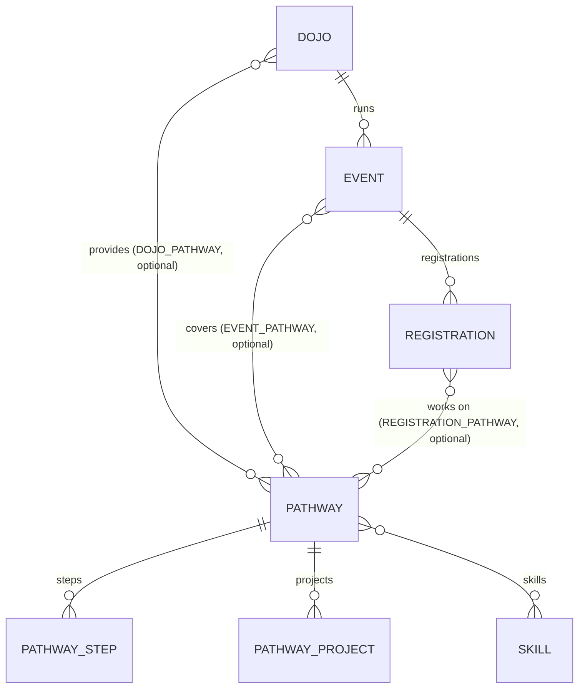
```mermaid
erDiagram
    DOJO }o--o{ PATHWAY : "provides (DOJO_PATHWAY, optional)"
    EVENT }o--o{ PATHWAY : "covers (EVENT_PATHWAY, optional)"
    DOJO ||--o{ EVENT : "runs"
    EVENT ||--o{ REGISTRATION : "registrations"
    REGISTRATION }o--o{ PATHWAY : "works on (REGISTRATION_PATHWAY, optional)"
    PATHWAY ||--o{ PATHWAY_STEP : "steps"
    PATHWAY ||--o{ PATHWAY_PROJECT : "projects"
    PATHWAY }o--o{ SKILL : "skills"
```

Decided:

- **Event pathways default to the dojo's but aren't restricted.** The
  event form pre-selects the pathways the dojo provides, and the team can
  add or remove any pathway for that particular session.
- **Registration pathways work the same way, one level down.** A new
  registration pre-selects the event's pathways, and they can be narrowed
  to the subset this ninja actually works on (or changed), without a hard
  restriction. The ninja's history and the attendance list read the
  **registration's** pathways.

### Mapping from today's model

| Today | In the redesign |
|---|---|
| `accounts.User` | the normal **Account** |
| `DojoOwner`, `HelperAccount` (MTI subclasses) | removed: a `champion` / `mentor` membership on the account |
| `Guardian` (MTI subclass) | removed: a normal account with `GUARDIANSHIP` rows to its ninjas (no check needed for that) |
| `ChildAccount` | `NINJA_ACCOUNT`: the second account type |
| `Participant` | `NINJA` |
| `Dojo.owner` | a `champion` membership |
| `Mentor` (with a dojo) | removed: the relationship becomes a membership, and the display fields move onto the account's shared profile |
| `Mentor` with no dojo (role `board`) | an `ORGANISATION_TEAM_MEMBER` row (display only, for the organisation's team details page) with position "Member of the board", maintained from the management dashboard |
| `Mentor.owner_account` / `helper_account` | the membership's `account` (role `champion` / `mentor`) |
| `Mentor.child_account` + role `champion`/`ninja` | a `youth_mentor` membership with `promoted_by` |
| "Lead Coach" label | **Champion** |
| `Dojo.sync_lead_coach()` (and its demote-on-owner-change) | removed: the champion role changes by an explicit **transfer** between memberships (the old champion becomes a mentor) |
| `DojoApplication` / `MentorApplication` (per dojo, creating the account and role) | one `APPLICATION` per account and kind (`mentor`, `champion`). Approval makes the account an approved mentor or champion; joining or creating a dojo is a separate step |
| `Dojo` (no status; always public) | `Dojo.status`: `draft`, `active`, `dormant`, `archived` |
| `Registration.pathway` (one per ninja, per session) | many-to-many at three levels, each pre-filled from the one above: **dojo** (`DOJO_PATHWAY`) → **event** (`EVENT_PATHWAY`, shown on the event details page) → **registration** (`REGISTRATION_PATHWAY`, the ninja's subset) |
| `Award` → `BadgeAward` / `MilestoneAward`, `ParticipantAward` | **Badges** (`BADGE` with kind `one_off` / `milestone`, `NINJA_BADGE`); milestones stay badges. **Belts** (`BELT`, `NINJA_BELT`) are new: a ninja's proficiency level |
| `dojos.access` roles `OWNER` / `HELPER` | `CHAMPION` / `MENTOR` (+ `YOUTH_MENTOR`) |
| background-check fields on the applications, and on `User` for owner/helper | the current check on every normal account, plus an append-only `BACKGROUND_CHECK_HISTORY` audit log (who decided, when) |

### Open questions to settle before starting

- ~~**Parents.**~~ *Decided: no check for normal use of the site; a
  check is required only to become a champion or mentor. See (A) below.*
- ~~**Ninja vs ninja account**~~: *decided, see (B) below.* They stay
  separate.
- ~~**Organisation team members** (today's board members)~~: *decided,
  see (C) below.* The public listing is separate from accounts and
  access.
- ~~**Team-page profile fields**~~: *decided, see (D) below.* One shared
  profile on the account.
- ~~**History**~~: *not an issue in the new model.* Memberships are never
  deleted, only made `dormant`, and `EVENT.event_team` points at them. The
  membership table therefore *is* the history, and "who ran this session"
  is a plain lookup there. There's no legacy history to carry over either;
  see "No data migration" below.
- ~~**Belts: progress in what?**~~ *Decided: a belt is a ninja's
  **proficiency level**, not an attendance count.* Milestone awards (like
  the attendance wristbands) stay **badges** (kind `milestone`). A
  milestone badge *can* be configured to also grant a belt
  (`BADGE.grants_belt`), but doesn't have to.
- ~~**Belts: how are they stored and shown?**~~ *Decided:* `NINJA_BELT` is
  a **history table**: one row per belt a ninja reaches (when, and awarded
  by whom), appended and never overwritten. A ninja's **current
  proficiency** is their highest-level belt in that history. It's shown in
  two places:
  - the **ninja's account details page** (for the ninja and their
    parents): the current belt plus the history of earlier belts;
  - the **management tooling**: the dojo dashboard for its champion and
    mentors (who can also award belts there), and the organisation's
    management dashboards (read-only), to see a ninja's level and
    progression over time.
- ~~**Belts: remaining details.**~~ *Decided:*
  - **Belts aren't connected to pathways (yet).** A belt is one overall
    proficiency level per ninja, a single track of levels. Linking belts to
    pathways (e.g. a Scratch belt and a Python belt) is possible future
    work, not part of this redesign.
  - **Only people who actively manage a dojo can award a belt:** an
    account with an **active** `champion` or `mentor` membership (a new
    `AWARD_BELTS` capability, granted to `CHAMPION` and `MENTOR` like the
    others). Organisation accounts (`ORGANISATION_ROLE`) **can't** award
    belts through the management dashboards; they can only see them. Each
    history row records **who** awarded the belt (`awarded_by`, the
    account) **and in which role** (`awarded_as_membership`, their
    champion/mentor membership at that dojo; required). So the history can
    show "awarded by Jan, as mentor of Dojo Ghent".

Lifecycle questions. These are *decided*, and the rules are under
"Dojo lifecycle" above:

- ~~Launching a dojo~~: the champion launches it; no approval.
- ~~Who can accept join requests~~: any active mentor, as well as the
  champion. The same goes for adding mentors and promoting youth mentors.
- ~~Dormant/archived visibility~~: hidden from the public site, still in
  ninjas' history. Archived can be reopened.
- ~~Going dormant or archived with open events~~: not allowed; both
  require no active events.
- ~~Pending join requests~~: declined automatically on dormant or
  archived.
- ~~Reopening an archived dojo~~: back to `draft`.
- ~~Detecting dormancy~~: manual, with a dashboard flag and notifications
  to the team and the board.
- ~~The "no events planned" period~~: half a year. The notification is
  persistent until resolved and appears on the future board dashboard.

Still open: nothing in the lifecycles. The **board dashboard** itself is
future work that needs its own design.

### Provisional full diagram

> **Provisional.** This is a working draft of the whole redesigned model.
> **(A)**–**(F)** below are all decided. The diagram is still provisional
> in its details (names, exact fields), not in its structure.

```mermaid
erDiagram
    %% ---------- people ----------
    ACCOUNT ||--o{ BACKGROUND_CHECK_HISTORY : "audit log of past decisions"
    ACCOUNT |o--o{ BACKGROUND_CHECK_HISTORY : "reviewed_by (staff reviewer)"
    ACCOUNT ||--o{ GUARDIANSHIP : "parent of"
    NINJA ||--o{ GUARDIANSHIP : "child of"
    NINJA |o--o| NINJA_ACCOUNT : "optional login"

    %% ---------- dojo team ----------
    DOJO ||--o{ DOJO_MEMBERSHIP : "team"
    ACCOUNT |o--o{ DOJO_MEMBERSHIP : "champion / mentor"
    NINJA_ACCOUNT |o--o{ DOJO_MEMBERSHIP : "youth mentor"
    DOJO_MEMBERSHIP |o--o{ DOJO_MEMBERSHIP : "promoted (youth mentors)"
    ACCOUNT ||--o{ ORGANISATION_ROLE : "management-dashboard access"
    ACCOUNT |o--o| ORGANISATION_TEAM_MEMBER : "optional link (display only)"

    %% ---------- sessions ----------
    DOJO ||--o{ EVENT : "runs"
    EVENT }o--o{ DOJO_MEMBERSHIP : "event_team (M2M)"
    EVENT ||--o{ REGISTRATION : "registrations"
    NINJA ||--o{ REGISTRATION : "signs up via"
    DOJO }o--o{ PATHWAY : "provides (optional)"
    EVENT }o--o{ PATHWAY : "covers (optional, shown on event page)"
    REGISTRATION }o--o{ PATHWAY : "works on (optional, defaults to the event's)"
    NINJA }o--o| DOJO : "home_dojo"

    %% ---------- badges & belts ----------
    NINJA ||--o{ NINJA_BADGE : "earns"
    BADGE ||--o{ NINJA_BADGE : "awarded as"
    NINJA ||--o{ NINJA_BELT : "belt history (current = highest level)"
    BELT ||--o{ NINJA_BELT : "reached as"
    BELT |o--o{ BADGE : "grants_belt (optional, milestone badges)"
    ACCOUNT |o--o{ NINJA_BELT : "awarded_by (who)"
    DOJO_MEMBERSHIP ||--o{ NINJA_BELT : "awarded_as_membership (in role of champion/mentor)"

    %% ---------- onboarding ----------
    ACCOUNT ||--o{ APPLICATION : "applies (mentor / champion)"
    ACCOUNT |o--o{ APPLICATION : "decided_by (staff)"
    ACCOUNT |o--o{ DOJO_MEMBERSHIP : "requested / added / decided by"

    %% ---------- other ----------
    ACCOUNT ||--o{ NOTIFICATION : "recipient (join requests, transfers, ...)"
    NINJA_ACCOUNT ||--o{ NOTIFICATION : "recipient"
    DOJO |o--o{ NOTIFICATION : "dojo"

    ACCOUNT {
        bigint id PK
        string username
        string email "unique, login"
        string password
        bool must_change_password
        string background_check_status "current check: not_requested, requested, submitted, validated, rejected"
        uuid background_check_token "emailed upload link"
        file background_check_document "private, deleted on decision"
        datetime background_check_expires_at "validated + 365 days"
        bool can_join_team "derived: check validated and not expired; needed for champion/mentor only"
        string display_name "team-page profile, shared by all dojos (D)"
        string title
        string bio
        image photo
        bool show_on_team_pages
    }
    NINJA_ACCOUNT {
        bigint id PK
        string username
        string password
        string note "never background-checked"
        string display_name "youth-mentor team-page profile (D)"
        string bio
        image photo
        bool show_on_team_pages
    }
    BACKGROUND_CHECK_HISTORY {
        bigint id PK
        bigint account_id FK "whose check"
        string decision "validated, rejected"
        bigint reviewed_by_id FK "staff account that decided"
        datetime reviewed_at
        datetime requested_at
        datetime submitted_at
        datetime expires_at "validated only"
        string note "optional reviewer remark, never the document"
    }
    GUARDIANSHIP {
        bigint account_id FK "the parent"
        bigint ninja_id FK "the child"
        string relation "parent, legal guardian, ..."
    }
    NINJA {
        bigint id PK
        string name
        date date_of_birth "ninjas are 7-17"
        bigint ninja_account_id FK "nullable, unique"
        bigint home_dojo_id FK
        string allergies_notes
    }
    DOJO {
        bigint id PK
        string name
        string status "draft, active, dormant, archived"
        bigint created_by_id FK "the approved champion who created it"
        point location
        string address
        bigint municipality_id FK
        bigint province_id FK
    }
    DOJO_MEMBERSHIP {
        bigint id PK
        bigint dojo_id FK
        bigint account_id FK "champion/mentor; null for youth mentors"
        bigint ninja_account_id FK "youth mentor only"
        string role "champion, mentor, youth_mentor"
        string status "requested, active, dormant"
        bigint requested_by_id FK "who asked (the mentor) or added them (champion/mentor)"
        bigint decided_by_id FK "champion/mentor who accepted the request"
        bigint promoted_by_id FK "youth mentor only: champion/mentor membership, same dojo"
        datetime joined_at "became active"
        datetime left_at "became dormant; null while active"
    }
    ORGANISATION_ROLE {
        bigint id PK
        bigint account_id FK
        string role "board, admin (grants management-dashboard access)"
    }
    ORGANISATION_TEAM_MEMBER {
        bigint id PK
        string name "display only, no login needed"
        string position "e.g. Member of the board, Volunteer coordinator"
        string bio
        image photo
        string focus_areas
        int order
        bool is_public
        bigint account_id FK "optional: the person's account, if they have one"
    }
    EVENT {
        bigint id PK
        bigint dojo_id FK
        string status "draft, open, closed"
        datetime start_time
        datetime end_time
        int places
    }
    REGISTRATION {
        bigint id PK
        bigint event_id FK
        bigint ninja_id FK
        bool waiting_list
        int position
        bool attended "null = not marked"
    }
    BADGE {
        bigint id PK
        string name
        string kind "one_off, milestone"
        string criteria "one_off: what earns it"
        int threshold "milestone: count needed (e.g. sessions attended)"
        bigint grants_belt_id FK "optional: reaching this milestone also grants a belt"
        image icon
    }
    NINJA_BADGE {
        bigint ninja_id FK
        bigint badge_id FK
        int progress_current "milestone only"
        int progress_total "milestone only"
        date earned_date "null until earned"
    }
    BELT {
        bigint id PK
        string name "e.g. white, yellow, ..."
        int level "order of the belts (one overall track; not linked to pathways yet)"
        string requirements "what a ninja must be able to do"
        image icon
    }
    NINJA_BELT {
        bigint id PK
        bigint ninja_id FK
        bigint belt_id FK
        date awarded_on
        bigint awarded_by_id FK "the account that awarded it (who)"
        bigint awarded_as_membership_id FK "in role of: their active champion/mentor membership (required)"
        string note "optional: what the ninja showed"
    }
    APPLICATION {
        bigint id PK
        bigint account_id FK "the applicant (account created first)"
        string kind "mentor, champion"
        string status "pending, approved, rejected"
        bigint decided_by_id FK "staff"
        datetime decided_at
        string motivation "about / area / proposed venue ..."
    }
    NOTIFICATION {
        bigint id PK
        bigint recipient_account_id FK "one of the two"
        bigint recipient_ninja_account_id FK
        bigint dojo_id FK
        string text
        bool read
    }
```

Pathways (`Pathway`, `PathwayStep`, `PathwayProject`, `Skill`), the
`content` models and the geo reference data stay as they are today
(sections 7 and 9), so they're only shown where they connect. Awards are
renamed into badges and belts (see Nomenclature).

**Decisions in this draft:**

- **(A) Parents — decided.** A parent is a normal `ACCOUNT` linked to
  their ninjas through `GUARDIANSHIP` (which replaces the `Guardian`
  subclass and `Participant.guardian`). **Normal use of the website needs
  no background check:** signing up, registering and managing their
  ninjas, and signing them up for sessions all work straight away, as the
  self-service guardian sign-up does today. The check becomes a
  requirement only when the same account wants to become a **champion**
  (start a dojo) or a **mentor** (help at one). The account applies,
  completes the check, and gets the membership once it's validated. A
  lapsed check removes team access (as login blocking does for
  owners/helpers today) but never the parent's own use of the site.
- **(B) Ninja vs ninja account — decided.** They stay separate. A `NINJA`
  is the child as a person (always present); a `NINJA_ACCOUNT` is an
  optional login attached to it. Youth mentors are memberships of the
  `NINJA_ACCOUNT`, since a youth mentor needs to be able to log in.
- **(C) Organisation team members — decided.** **Being listed** and
  **having access** are two separate things:
  - **`ORGANISATION_TEAM_MEMBER`** is display only. It's used **only for
    the organisation's team details page**: the people shown there, each
    with a **position** (name, position, bio, photo, focus areas, order).
    "Member of the board" is one possible position, not a separate kind of
    person. Not everyone listed needs an account; the link to an `ACCOUNT`
    is optional and only for convenience.
  - **`ORGANISATION_ROLE`** is access: the accounts that can use the
    organisation's **management dashboards** (including the future board
    dashboard). Not everyone with access has to be listed.
  - There's **no self-service** for the listing. People with
    management-dashboard access maintain `ORGANISATION_TEAM_MEMBER` for
    everyone.
- **(D) Team-page profile — decided.** To keep it simple, the profile
  (display name, title, bio, photo, whether to show it) lives on the
  **account** and is **shared across every dojo** the person is on. The
  membership only carries the relationship (role, status, dates). A youth
  mentor's profile lives on their `NINJA_ACCOUNT` the same way.
- **(E) History — decided.** Leaving a dojo makes a membership
  **`dormant`**, never deleted. `EVENT.event_team` points at memberships,
  so past sessions keep showing who ran them after someone leaves. Only
  `active` memberships grant dashboard access or appear on the team page.
  An archived dojo keeps all its memberships and events as read-only
  history.
- **(F) Background checks — decided.** The **current** check lives on the
  account (status, token, document, expiry), moved there from the
  applications. Each time a reviewer validates or rejects a check, a row
  is appended to `BACKGROUND_CHECK_HISTORY`: whose check, the decision,
  **who reviewed it and when**, and the expiry it set. The history is an
  audit log only. It's append-only and never edited, and nothing reads it
  to decide access; the fields on the account do that. A renewal resets
  the account's current check and adds a new history row when it's
  decided, so earlier decisions stay on record. "Delete the document,
  keep only the decision" still holds: the uploaded document is deleted
  once decided, and the history never stores it. Applications merge into
  one `APPLICATION` table with a `kind`, since both kinds now just grant a
  membership, and approving one requires the applicant's account to have
  a valid check.

### No data migration: adapt the seeders

**No data-migration logic is needed.** The current database contains only
**seeded test data** (`.devcontainer/start.sh` runs the `seed_*` commands
on a fresh database); there's no real data to preserve. So the redesign
needs no backfills, no `RunPython` conversions and no legacy-row handling.
Instead:

- Replace the models and generate fresh migrations for the affected apps.
  Squashing or resetting the old ones is fine, since dev databases are
  simply recreated.
- **Adapt the seed commands** so they produce the new model directly.
  Rebuild with `docker compose -f .devcontainer/docker-compose.yml down -v`
  followed by a fresh `up` (`start.sh` reseeds on an empty database).

Seeders to adapt:

| Seeder | Today | In the redesign |
|---|---|---|
| `seed_dojos` | dojos from the bundled JSON | same, plus a `status` (mostly `active`, a few `draft`/`dormant`/`archived` to exercise the lifecycle) and each dojo's provided pathways |
| `seed_dojo_owners` | a `DojoOwner` per dojo | **champion** accounts (with a validated check and a `BACKGROUND_CHECK_HISTORY` row) + a `champion` membership per dojo; replaces `seed_dojo_owners` |
| `seed_mentors` | `Mentor` profiles (mostly login-less) + board rows | **mentor** accounts (validated check) with `active` memberships, some at several dojos, a few `requested`/`dormant`; **youth mentor** memberships on ninja accounts (with `promoted_by`); `ORGANISATION_TEAM_MEMBER` rows (position "Member of the board", ...) and a few `ORGANISATION_ROLE` accounts |
| `seed_guardians` | `Guardian` accounts + `Participant` children (+ optional `ChildAccount`) | **parent** accounts (no check needed) + `GUARDIANSHIP` + **ninjas** aged 7–17 (+ optional ninja accounts) |
| `seed_events` | upcoming events per dojo | same, plus **event pathways** (pre-filled from the dojo's) and an **event team** of memberships |
| `seed_participant_history` | past events, registrations, awards | past events with event teams, registrations with **registration pathways**, **badges** (one-off and milestone) and a **belt history** awarded by champion/mentor memberships |
| `seed_pathways`, `seed_faqs`, `seed_testimonials`, `seed_geo` | unchanged | unchanged (FAQs keep their dojo/event/pathway scoping) |
| *(new)* applications | none | a few `APPLICATION` rows (`mentor`/`champion`, pending/approved/rejected) to exercise the approval flow |

`seed_credentials.csv` keeps listing every seeded login (champions,
mentors, parents, ninja accounts).

### Implementation plan

**Status: in progress** (started 2026-09-24 on the `redesign/data-model`
branch). Tick a phase off here when it lands.

#### Implementation decisions

These settle details the diagrams above leave open:

1. **One user table.** Normal and ninja accounts are both
   `accounts.User` (still `AUTH_USER_MODEL`), told apart by
   `User.account_type` (`adult` / `ninja`). There are no role subclasses
   any more. Where the diagrams show `ACCOUNT` / `NINJA_ACCOUNT` as two
   tables, read one `User` table with a type: memberships, belt awards and
   notifications each need a single user link, and login stays exactly as
   it is.
2. **Applying requires being logged in.** An `Application` always belongs
   to an existing account, so the anonymous "start a dojo" / "become a
   mentor" forms go away. Visitors sign up first.
3. **URLs change.** `/guardian/<id>/…` becomes `/account/…` (the family
   page), and the pages for a parent's ninjas live under it.
4. **Management dashboards = Django admin, for now.** `ORGANISATION_ROLE`
   maps to staff status plus a group. The board dashboard is future work.
5. **Dormancy nudge** (six months with no events): computed when the dojo
   dashboard loads and shown as a banner, not stored as notifications,
   until the board dashboard exists.
6. **Non-`active` dojos** (draft, dormant, archived) are hidden from the
   public site **together with their events**.

#### Approach

Work on the feature branch in three stages, keeping the test suite green
at every step:

- **A:** add the new models alongside the old ones.
- **B:** switch features over one at a time.
- **C:** remove the old models, reset the migrations to a fresh `0001`
  per app (no data to keep; see "No data migration"), and apply the new
  names.

#### Phases

- [x] **1. Accounts** (`accounts`), *done 2026-09-24*
  - `User.account_type` (`adult` / `ninja`) and `User.phone`.
  - `Guardianship` (parent account ↔ `Participant`; a ninja can have
    several guardians). `Participant.account` now points at a ninja-type
    `User`.
  - Dropped `Guardian`, `ChildAccount`, `Participant.guardian` and
    `link_guardian_role`; any adult account adds children from its account
    page.
  - Family page and ninja pages moved under `/account/`
    (`account_home`, `ninja_detail`, `edit_ninja`, `ninja_awards`,
    `add_ninja`). A ninja's own login sees its own page read-only. Menu,
    context processor, event signup and seeder updated.
  - *Moved to later phases, where they're first used:* the check fields
    on the account and `BackgroundCheckHistory` → phase 3 (together with
    the check flow; the "check gates team access, not login" change too),
    the shared team-page profile → phase 2, and `Participant` → `Ninja`
    (7–17) → phase 7 (naming). `DojoOwner` / `HelperAccount` /
    `attach_role` stay until phases 2–3 replace them.
- [x] **2. Dojo team** (`dojos`), *done 2026-09-24*
  - `DojoMembership`, `Dojo.status` and `Dojo.created_by`, plus the shared
    team-page profile on `User` (moved here from phase 1); drop
    `Dojo.owner`, `Mentor` and `sync_lead_coach()`.
  - `dojos/access.py` reads active memberships with a valid check. Roles
    become `CHAMPION` / `MENTOR` / `YOUTH_MENTOR`; new capabilities are
    `MANAGE_TEAM`, `AWARD_BELTS` and `MANAGE_LIFECYCLE`, and the champion
    transfer is champion-only.
  - The "Helpers & Mentors" admin page: team list, requests, add, promote,
    leave and transfer.
  - Dojo lifecycle actions and their rules; public querysets show active
    dojos only.
  - Team pages built from memberships; `Event.mentors` → `Event.team`.
  - *Pulled forward from phase 6:* `OrganisationTeamMember` (in the
    `content` app) replaces the board `Mentor` rows, so the homepage's
    "Meet the team" keeps working without `Mentor`.
  - *Interim, until phase 3:* "approved mentor" (who may join or be
    added) = holding the `HelperAccount` / `DojoOwner` role
    (`access.is_approved_mentor`); approving a `MentorApplication` that
    names a dojo files a join request there. Lifecycle actions are
    champion-only (`MANAGE_LIFECYCLE`).
- [x] **3. Onboarding** (`applications`), *done 2026-09-24*
  - A single `Application` (`mentor` / `champion`) on the account; the
    check fields, flow and `BackgroundCheckHistory` on the account (moved
    here from phase 1); the check stops blocking login and only gates
    dojo-team access.
  - "Create dojo" for approved champions (the dojo starts as a draft);
    "Request to join" for approved mentors.
  - Emails, renewal and admin actions reworked.
  - Also: `DojoOwner` / `HelperAccount`, `provision_account` / `attach_role`
    and `BackgroundCheckMiddleware` removed (accounts exist before applying,
    so no more emailed temporary passwords); `background_check_required`
    dropped (`background_check_valid` = validated and unexpired); the
    private document storage is referenced through a callable so migrations
    don't embed a machine-specific path; `seed_applications` added.
- [x] **4. Pathways** (`dojos`, `events`), *done 2026-09-24*
  - `Dojo.pathways`, `Event.pathways` and `Registration.pathways`
    (many-to-many, optional); `Registration.pathway` dropped.
  - Dojo settings pick the dojo's pathways; a new event pre-selects them;
    signup copies the event's onto each registration; the attendance
    list's per-row **Pathways** picker narrows them
    (`dojo_event_registration_pathways`, `TAKE_ATTENDANCE`).
  - Shown on the public dojo and event pages, the attendance list and the
    ninja's history. Seeders give dojos, events and registrations
    pathways.
- [x] **5. Badges and belts** (`events`), *done 2026-09-24*
  - `Badge` (one-off / milestone, optional `grants_belt`), `NinjaBadge`,
    `Belt` and the append-only `NinjaBelt` history (awarding account,
    membership, and the membership's role at the time, snapshotted so a
    later champion handover doesn't rewrite it). `Award` /
    `MilestoneAward` / `BadgeAward` / `ParticipantAward` removed.
  - Rules in `events/awards.py`: `award_belt` (active champion/mentor
    with a valid check, ninja has been to that dojo, only a higher belt)
    and `sync_milestones` (milestones follow attendance marks, and a
    `grants_belt` milestone awards its belt as the marker's membership).
  - "Award belt" on each attendance row (`dojo_event_award_belt`,
    `AWARD_BELTS`), which also shows the ninja's current belt; current
    belt and history on the ninja page; the awards carousel is now
    "Badges" (`ninja_badges`). Seeder adds the belt track and a belt
    history.
- [ ] **6. Organisation:** `OrganisationRole` (management-dashboard
  access). `OrganisationTeamMember` and its team page already landed in
  phase 2.
- [ ] **7. Names and docs:** `Participant` → `Ninja` (with 7–17 validation, moved here from phase 1) and the new names in the UI; the help-centre
  pages in EN/FR/NL; `DATA_MODEL.md` §10 promoted to "current", and
  CLAUDE.md's architecture section updated.
- [ ] **8. Seeders and reset:** seeders rewritten as in the table above,
  migrations regenerated, `start.sh` updated, and a fresh
  `down -v` rebuild with a full test run.
