# Data model

How the CoderDojo Belgium site's data fits together, one diagram per area.
This is for developers. The end-user help centre lives in `docs/`, and the
conventions and gotchas live in `CLAUDE.md`. The diagrams are
[Mermaid](https://mermaid.js.org/), which GitHub and VS Code's Markdown
preview render inline.

Each diagram shows only the fields that carry meaning. Plain text and
display fields (descriptions, taglines, photos, …) are left out; the models
in each app's `models.py` have the full field lists. If you change a model,
update its diagram in the same change.

**Contents**

1. [Overview](#1-overview)
2. [Accounts and roles](#2-accounts-and-roles)
3. [Dojos, team pages and admin access](#3-dojos-team-pages-and-admin-access)
4. [Events, registrations and attendance](#4-events-registrations-and-attendance)
5. [Awards](#5-awards)
6. [Applications and background checks](#6-applications-and-background-checks)
7. [Learning pathways and content](#7-learning-pathways-and-content)
8. [Notifications](#8-notifications)
9. [Geo reference data](#9-geo-reference-data)

---

## 1. Overview

The main entities and how they connect, grouped by the Django app that owns them.

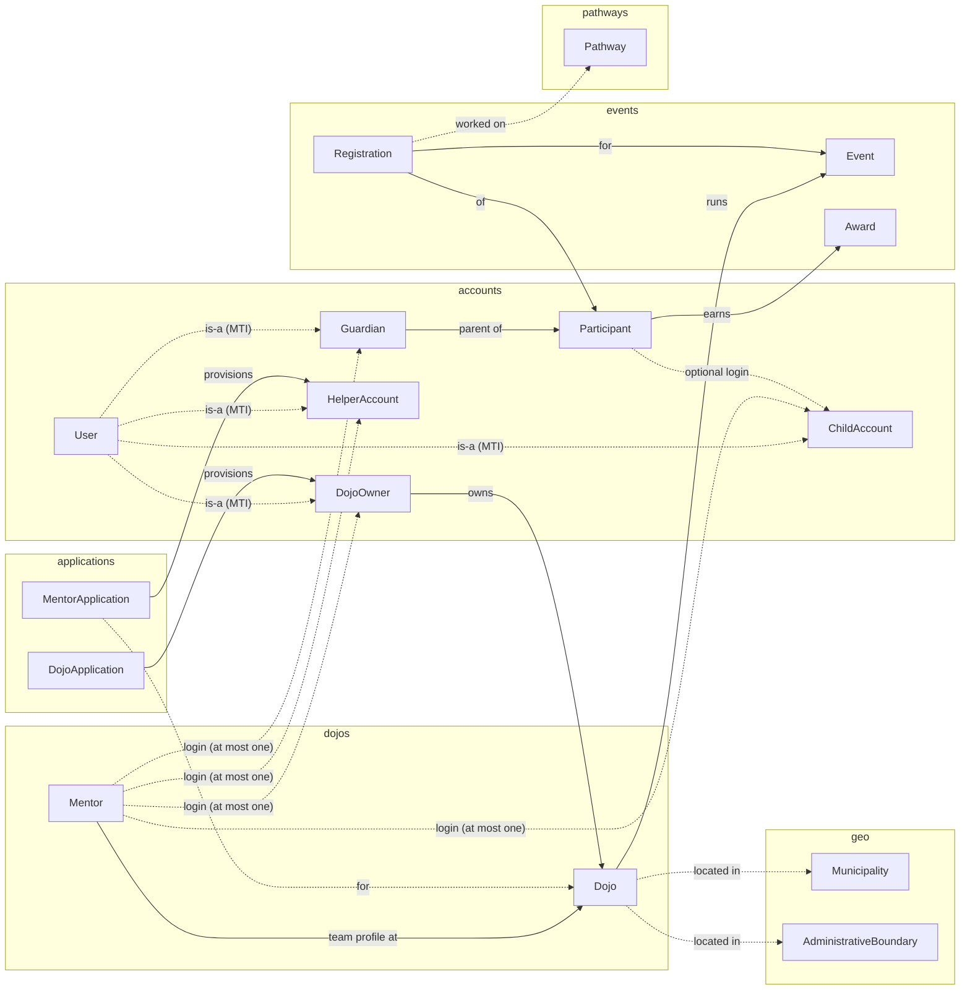

---

## 2. Accounts and roles

`accounts.User` is the login. Each role is a **multi-table-inheritance
child** of it, not a `role` field, and one `User` row can hold several roles
at once. `accounts.provisioning.attach_role` adds a role to an existing
account. A child role row shares the `User`'s primary key, so
`helperaccount.pk == user.pk`.

A `Participant` (a child attending sessions) is **not** a user. It gets a
login (`ChildAccount`) only if its guardian opts it in.

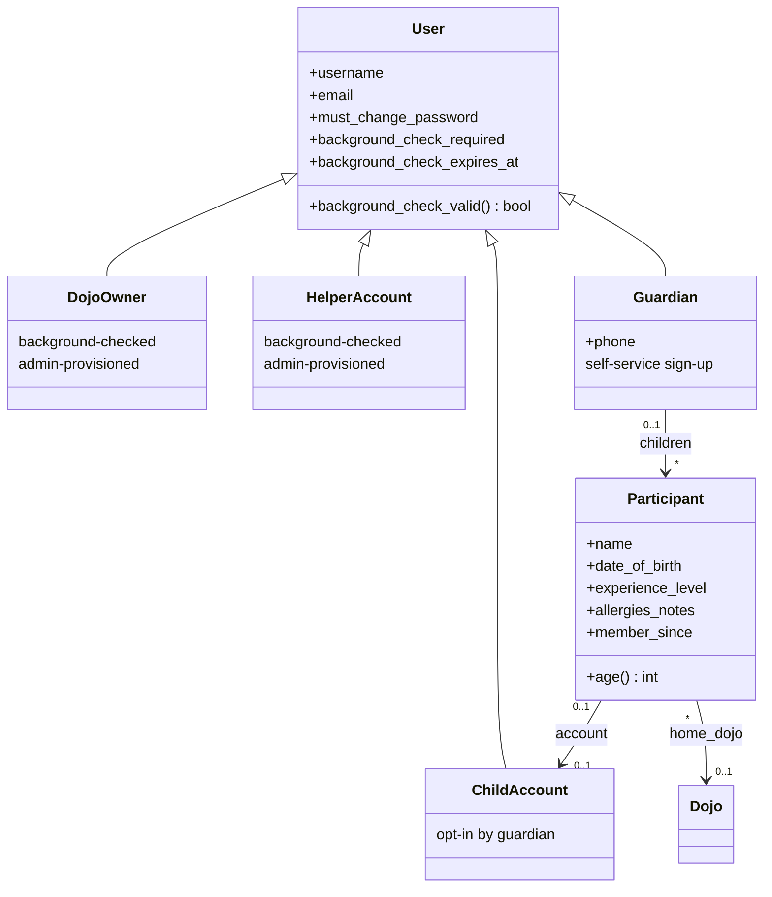

Which role does what:

| Role | Created by | Background check | Lands on after login |
|---|---|---|---|
| `DojoOwner` | admin approval of a `DojoApplication` | required (gates login) | first accessible dojo's dashboard |
| `HelperAccount` | admin approval of a `MentorApplication` | required (gates login) | first accessible dojo's dashboard |
| `Guardian` | self-service (`register_guardian`, `link_guardian_role`) | none | their family page |
| `ChildAccount` | guardian opts a child in | none | the child's page |

---

## 3. Dojos, team pages and admin access

`Mentor` is a public team-page profile at one dojo. It may point to the
login of the person behind it, through at most one of four account links
(enforced in `Mentor.clean()`).

- **Owner = Lead Coach.** `Dojo.save()` calls `Dojo.sync_lead_coach()`, so
  every owned dojo has exactly one `LEAD_COACH` Mentor, linked to its
  current owner. When ownership changes, the previous owner's profile
  becomes a plain volunteer profile. It isn't deleted, so past
  `Event.mentors` links keep their history.
- **Owners and helpers can be linked to several dojos.** `owner_account` and
  `helper_account` are ForeignKeys, with one profile per dojo enforced by a
  unique constraint on each. `guardian_account` and `child_account` are
  one-to-one.

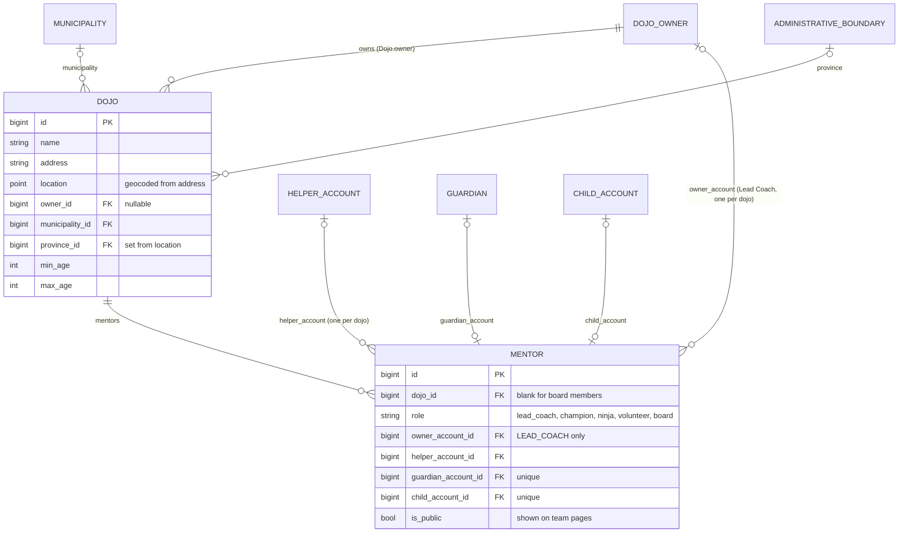

### Who can use a dojo's admin area

`dojos/access.py` resolves the viewer's role at a dojo, and each role maps
to a set of capabilities. With no role at all the dojo gives a **404**; a
role that lacks the view's capability gets a **403**.

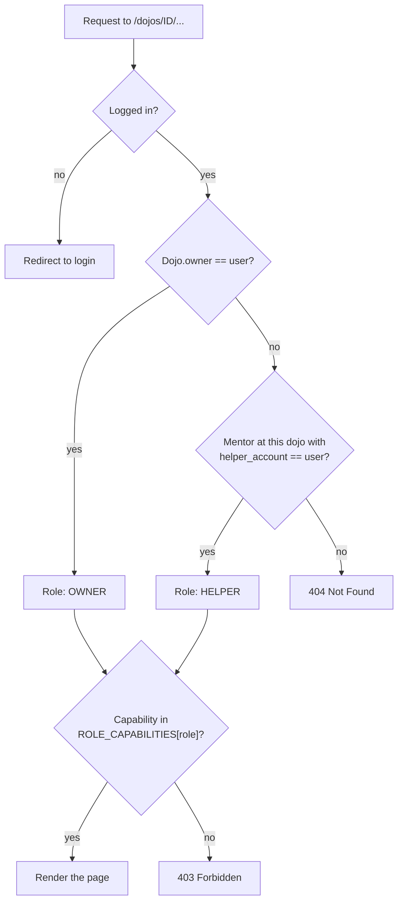

| Capability | Gates | OWNER | HELPER (today) |
|---|---|:-:|:-:|
| *(any role)* | dashboard, events list, notification bell | ✓ | ✓ |
| `TAKE_ATTENDANCE` | attendance pages, marking present/absent | ✓ | ✓ |
| `MANAGE_EVENTS` | create/edit events, change status | ✓ | ✓ |
| `EDIT_SETTINGS` | dojo profile settings | ✓ | ✓ |

To restrict helpers, remove entries from `ROLE_CAPABILITIES[HELPER]`.
Guardian- and child-linked mentor profiles never get admin access, because
those accounts aren't background-checked.

---

## 4. Events, registrations and attendance

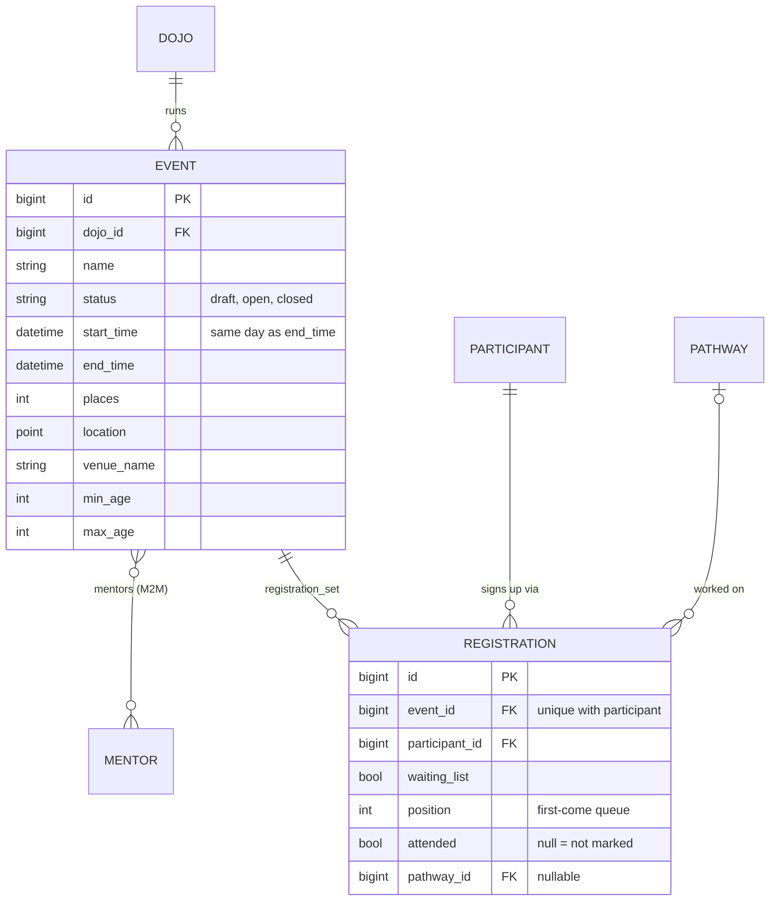

- **Places:** `Event.places_left` = `places` − confirmed registrations
  (those with `waiting_list=False`). When a confirmed place is cancelled,
  the next person on the waiting list is promoted and the dojo owner is
  notified.
- **Attendance:** `Registration.attended` has three states: `None` (not
  marked yet), `True` (present), `False` (absent). Only confirmed
  registrations can be marked.

### Event status

The owner sets any status directly (`dojo_event_set_status`); it isn't a
one-way lifecycle. Existing registrations are kept whatever the status.

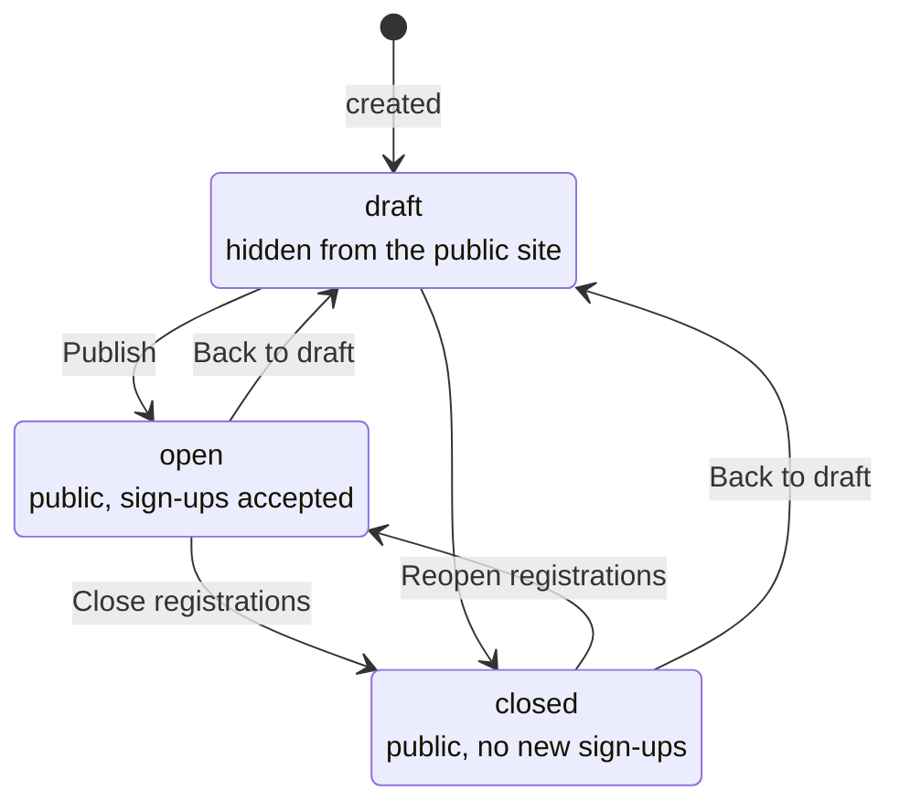

---

## 5. Awards

`Award` uses the same multi-table-inheritance pattern as the account
roles. There are two separate kinds: a milestone reached by a repeat count
(for example the attendance wristbands), and a one-off badge.

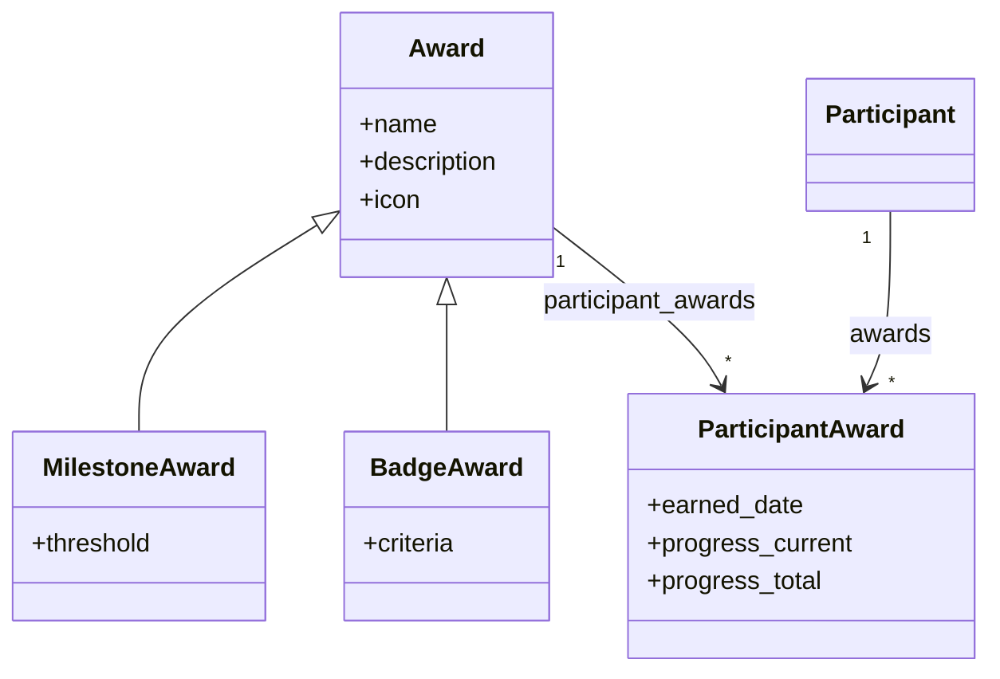

---

## 6. Applications and background checks

Both application types mix in `BackgroundCheckMixin`, which tracks Belgium's
Article 596.2 criminal-record-extract requirement. When a check is
validated, the uploaded document is **deleted** and only the decision and
its expiry are kept.

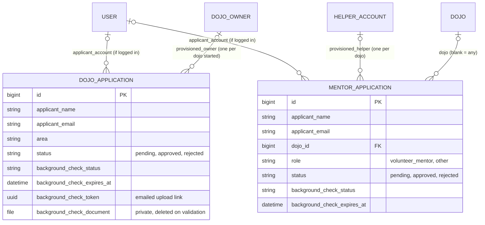

### Background check lifecycle

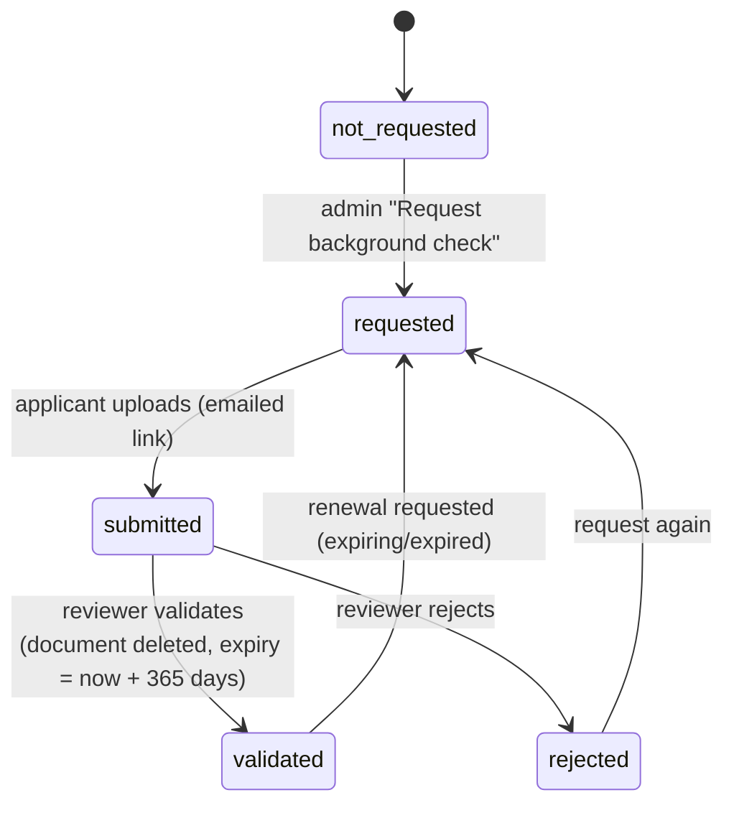

### From approval to a login

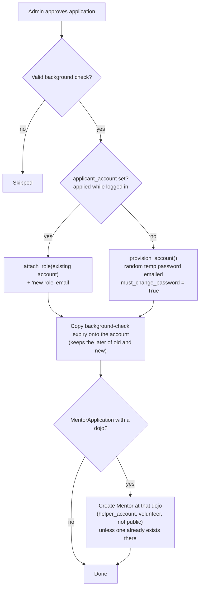

After approval, **the account** gates login: once
`background_check_valid` is false, `BackgroundCheckMiddleware` blocks every
request and sends the user to `renew_background_check`. The renewal is
uploaded against the account's most recently submitted application.

---

## 7. Learning pathways and content

`pathways` is a read-mostly catalogue with no enrolment state. The only
place it's linked to a child is `Registration.pathway`. The `content`
models are each optionally scoped to one dojo, event or pathway, or
site-wide when the scoping key is blank.

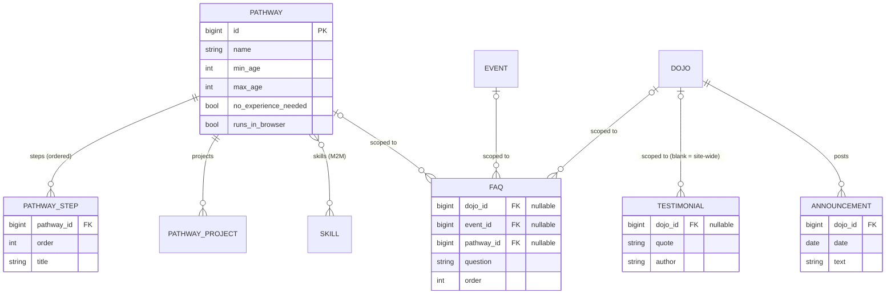

---

## 8. Notifications

Each `Notification` row belongs to one recipient, so read state is per
user. An event that concerns several people creates one row per recipient.
Always create notifications through `notifications.services.notify()`: it
writes the row, then pushes the updated bell over the WebSocket channel
layer, on a best-effort basis.

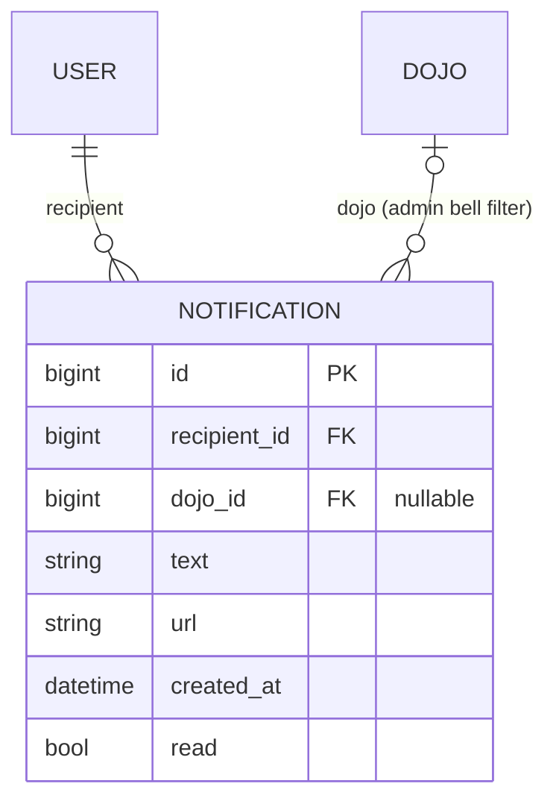

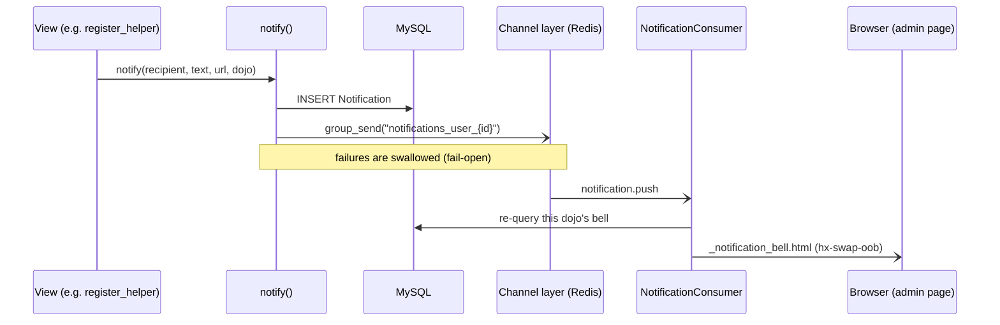

---

## 9. Geo reference data

Reference data only (seeded by `seed_geo`), with no URLs of its own. A
dojo's `province` is derived from its geocoded `location`: a
point-in-polygon lookup against `AdministrativeBoundary`, falling back to
the nearest boundary. Distance searches always use
`geo.functions.DistanceSphere` (MySQL `ST_Distance_Sphere`).

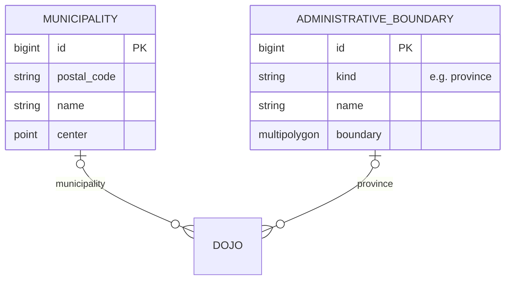
