# Data model

How the CoderDojo Belgium site's data fits together, one diagram per area.
This is for developers. The end-user help centre lives in `docs/`, and the
conventions and gotchas live in `CLAUDE.md`. The diagrams are
[Mermaid](https://mermaid.js.org/), which GitHub and VS Code's Markdown
preview render inline.

Each diagram shows only the fields that carry meaning. Plain text and
display fields (descriptions, taglines, photos, …) are left out; the models
in each app's `models.py` have the full field lists. If you change a model,
update its diagram in the same change.

> **The redesign has landed** (all eight phases). Sections 1–9 describe the
> model as it is in the code today. [Section 10](#10-redesign-rationale-and-plan)
> keeps the design rationale, the decisions behind it and the
> [implementation plan](#implementation-plan). It also sets the
> [nomenclature](#nomenclature) (Champion, Mentor/Coach, Ninja, Youth
> mentor, Badge, Belt) that the code and the UI use.

**Contents**

1. [Overview](#1-overview)
2. [Accounts and roles](#2-accounts-and-roles)
3. [Dojos, team pages and admin access](#3-dojos-team-pages-and-admin-access)
4. [Events, registrations and attendance](#4-events-registrations-and-attendance)
5. [Badges and belts](#5-badges-and-belts)
6. [Applications and background checks](#6-applications-and-background-checks)
7. [Learning pathways and content](#7-learning-pathways-and-content)
8. [Notifications](#8-notifications)
9. [Geo reference data](#9-geo-reference-data)
10. [Redesign: rationale and plan](#10-redesign-rationale-and-plan)
11. [Mailing, segmentation and campaigns](#11-mailing-segmentation-and-campaigns)
12. [Organisation events and promotion](#12-organisation-events-and-promotion)

Sections 13–28 cover the API, the audit log, two-step login, GDPR, child accounts, home dojos, a dojo's languages, the management area, reviewing on the dashboard, changing an email address, organisation people and roles, logging in with an emailed link, mail from a dojo to its families, capacity and monitoring, multiple guardians per child, and custom roles for a dojo or the organisation.

**Split into topic files, kept out of this one for size.** Every section below still has its number and heading here — so an existing "`DATA_MODEL.md` §N" reference anywhere in the repo still resolves — but the full design history for the largest, most actively-growing subsystems now lives next to this file rather than in it:

- [`DATA_MODEL_REDESIGN.md`](DATA_MODEL_REDESIGN.md) — §10, the landed redesign's rationale and phase plan.
- [`DATA_MODEL_MAILING.md`](DATA_MODEL_MAILING.md) — §11 and §25, the mail engine, segmentation, campaigns, journeys and a dojo's own mail.
- [`DATA_MODEL_API.md`](DATA_MODEL_API.md) — §13, dojo API clients and the event-sync plan.
- [`DATA_MODEL_PRIVACY.md`](DATA_MODEL_PRIVACY.md) — §16 and §27, GDPR classification/export/erasure/retention and multiple guardians per child.
- [`DATA_MODEL_ROLES.md`](DATA_MODEL_ROLES.md) — §28, letting a dojo champion or the organisation define their own custom roles.

Everything else — the current data model (§1–9), organisation events (§12), the audit log (§14), two-step login (§15), child accounts through organisation roles (§17–24), and capacity/monitoring (§26) — stays here in full.

---

## 1. Overview

The main entities and how they connect, grouped by the Django app that owns them.
The diagrams in this document show each table's key fields and relations, not every
column: longer texts, the per-language `translations` and most timestamps are left out.
The models themselves are the full reference.

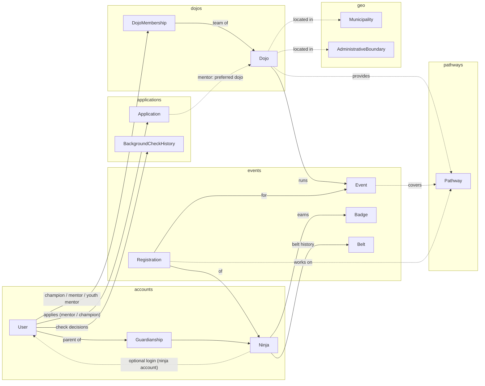
```mermaid
flowchart LR
    subgraph accounts
        User
        Guardianship
        Ninja
    end
    subgraph dojos
        Dojo
        DojoMembership
    end
    subgraph events
        Event
        Registration
        Badge
        Belt
    end
    subgraph applications
        Application
        BackgroundCheckHistory
    end
    subgraph pathways
        Pathway
    end
    subgraph geo
        Municipality
        AdministrativeBoundary
    end

    User -- "champion / mentor / youth mentor" --> DojoMembership
    DojoMembership -- "team of" --> Dojo
    User -- "parent of" --> Guardianship
    Guardianship --> Ninja
    Ninja -. "optional login (ninja account)" .-> User
    Dojo -- runs --> Event
    Registration -- for --> Event
    Registration -- of --> Ninja
    Dojo -. "provides" .-> Pathway
    Event -. "covers" .-> Pathway
    Registration -. "works on" .-> Pathway
    Ninja -- earns --> Badge
    Ninja -- "belt history" --> Belt
    User -- "applies (mentor / champion)" --> Application
    User -- "check decisions" --> BackgroundCheckHistory
    Application -. "mentor: preferred dojo" .-> Dojo
    Dojo -. located in .-> Municipality & AdministrativeBoundary
```

Around that core, the apps that reach people and keep the record. Each hangs off
an account, a dojo or a session:

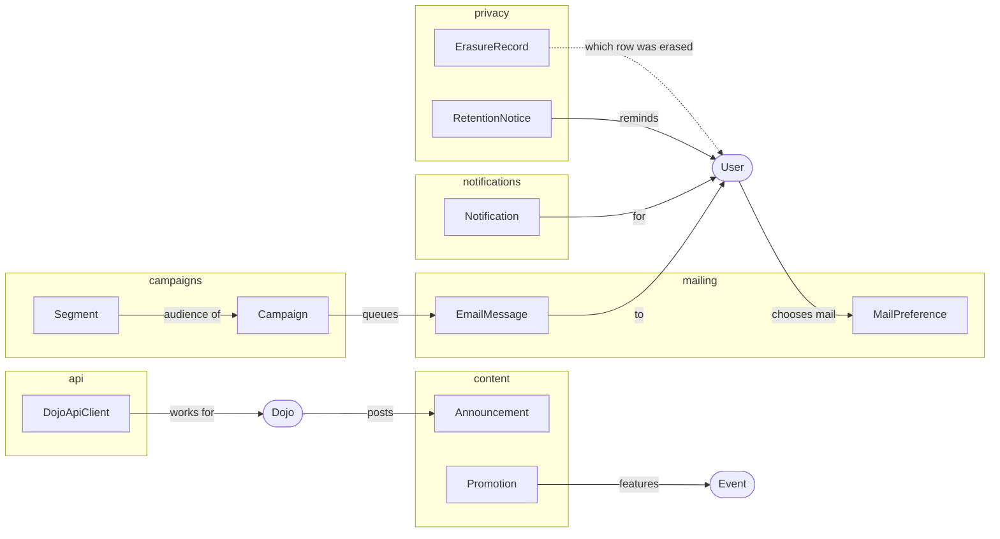
```mermaid
flowchart LR
    U([User])
    D([Dojo])
    E([Event])
    subgraph content
        Announcement
        Promotion
    end
    subgraph notifications
        Notification
    end
    subgraph mailing
        MailPreference
        EmailMessage
    end
    subgraph campaigns
        Segment
        Campaign
    end
    subgraph api
        DojoApiClient
    end
    subgraph privacy
        RetentionNotice
        ErasureRecord
    end

    D -- posts --> Announcement
    Promotion -- features --> E
    Notification -- for --> U
    U -- "chooses mail" --> MailPreference
    Segment -- "audience of" --> Campaign
    Campaign -- queues --> EmailMessage
    EmailMessage -- to --> U
    DojoApiClient -- "works for" --> D
    RetentionNotice -- reminds --> U
    ErasureRecord -. "which row was erased" .-> U
```

---

## 2. Accounts and roles

`accounts.User` is every login, with `account_type` telling the two kinds
apart: a normal **adult** account, or a **ninja**'s own login. There are no
role subclasses (redesign phases 1–3, section 10).

- **Parents** are plain adult accounts linked to their children through
  `Guardianship`. A child can have more than one guardian, and any adult
  account can add children from its account page. No background check is
  ever needed for that.
- **Champions and mentors** are adult accounts with an approved
  `Application` (section 6) and a **valid background check on the
  account**; what they do at a dojo is a `DojoMembership` (section 3).
- A **`Ninja`** (a child aged 7–17 attending sessions; the age rule is
  checked whenever a date of birth is entered or changed) is **not** a user. It
  gets a login (a `User` with `account_type="ninja"`, linked through
  `Ninja.account`) only if a parent opts it in.
- **Every login** logs in with a password or with an emailed login link,
  its holder's choice (`User.login_method`, §24), with two-step login on
  top of either (§15); a ninja's own login has the same options.
- **Organisation accounts** are adult accounts with an `OrganisationRole`
  (`board`, `admin` or `reviewer`, fixed in code): a matching permission
  group (`accounts.organisation`, kept in sync by signals) that opens the
  organisation dashboard's *areas* (§23: `admin` all but Volunteers,
  `reviewer` Volunteers, `board` none yet). The Django admin is never open
  by the role alone: its holder asks for it, 12 hours at a time
  (`AdminAccessGrant`, §23), and it opens with the role's permissions
  (the **board** read-only oversight and the team listing; **admins** also
  editing dojos, events, content and catalogues). Admins give and take
  away roles on the dashboard's People pages, and invite people without an
  account (`OrganisationInvitation`). No role can award belts. Being listed
  on the organisation's team page (`content.OrganisationTeamMember`) is
  separate from having a role.

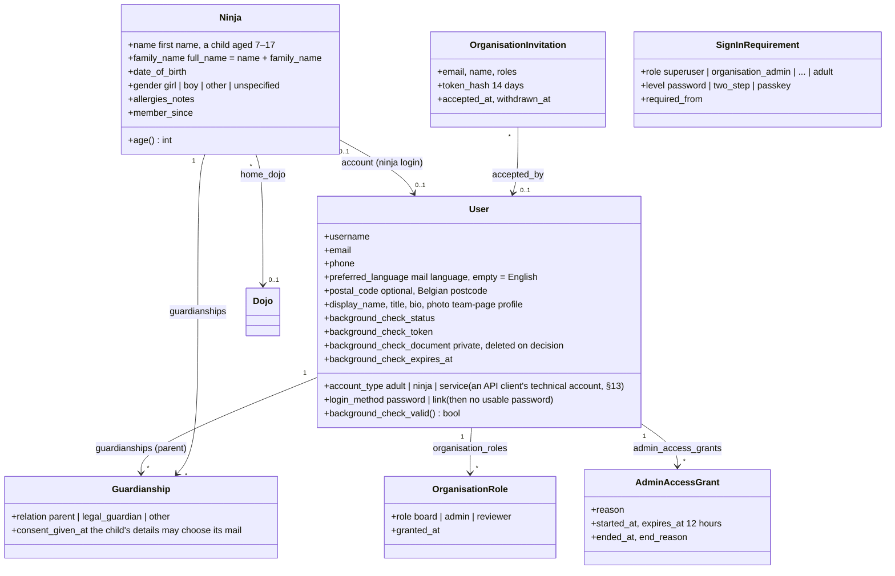
```mermaid
classDiagram
    direction TB
    class User {
        +username
        +email
        +phone
        +account_type  adult | ninja | service (an API client's technical account, §13)
        +login_method  password | link (then no usable password)
        +preferred_language  mail language, empty = English
        +postal_code  optional, Belgian postcode
        +display_name, title, bio, photo  team-page profile
        +background_check_status
        +background_check_token
        +background_check_document  private, deleted on decision
        +background_check_expires_at
        +background_check_valid() bool
    }
    class Guardianship {
        +relation  parent | legal_guardian | other
        +consent_given_at  the child's details may choose its mail
    }
    class Ninja {
        +name  first name, a child aged 7–17
        +family_name  full_name = name + family_name
        +date_of_birth
        +gender  girl | boy | other | unspecified
        +allergies_notes
        +member_since
        +age() int
    }

    User "1" --> "*" Guardianship : guardianships (parent)
    Ninja "1" --> "*" Guardianship : guardianships
    Ninja "0..1" --> "0..1" User : account (ninja login)
    Ninja "*" --> "0..1" Dojo : home_dojo
    class OrganisationRole {
        +role  board | admin | reviewer
        +granted_at
    }
    class AdminAccessGrant {
        +reason
        +started_at, expires_at  12 hours
        +ended_at, end_reason
    }
    class OrganisationInvitation {
        +email, name, roles
        +token_hash  14 days
        +accepted_at, withdrawn_at
    }
    class SignInRequirement {
        +role  superuser | organisation_admin | ... | adult
        +level  password | two_step | passkey
        +required_from
    }
    User "1" --> "*" OrganisationRole : organisation_roles
    User "1" --> "*" AdminAccessGrant : admin_access_grants
    OrganisationInvitation "*" --> "0..1" User : accepted_by
```

Which account does what:

| Account | Created by | Background check | Lands on after login |
|---|---|---|---|
| adult (parent) | self-service sign-up (`register_guardian`) | never needed | their account page (`/account/`) |
| adult champion / mentor | the same self-service sign-up, or the one without children (`register_individual`, which goes straight on to the application), then an approved `Application` | required for dojo access (a lapsed check blocks the dashboards, never the login) | first accessible dojo's dashboard |
| ninja | a parent opts a child in | none | the ninja's own page (`/account/ninja/<id>/`) |
| adult with an `OrganisationRole` | the same sign-up, or the sign-up behind an organisation invitation; the role is given on the dashboard's People page | not for the role itself | the organisation dashboard (`/manage/`); the Django admin only when asked for (12 hours) |

---

## 3. Dojos, teams and admin access

A dojo's team is a set of **memberships** (`DojoMembership`), one per
account and dojo (redesign phase 2, section 10). Each membership has a role
and a status:

- **Roles:** `champion` (the dojo's owner, exactly one active per dojo),
  `mentor` (an adult helper) and `youth_mentor` (a ninja account, promoted by
  a champion/mentor of the same dojo, recorded in `promoted_by`).
- **Status:** `requested` → `active` → `dormant`. People who leave go
  `dormant` and are never deleted, so past events' teams (`Event.team`) keep
  their history. Rejoining reuses the same row.
- **Profiles:** the team-page profile (display name, title, bio, photo,
  `show_on_team_pages`) lives on the **account** and is shared by every dojo
  the person is on.
- **Dojo status:** `draft` → `active` ⇄ `dormant` → `archived` → `draft`.
  Only `active` dojos, and their events, are public (`Dojo.objects.public()`,
  `Event.objects.visible()`). All changes go through `dojos/team.py`.

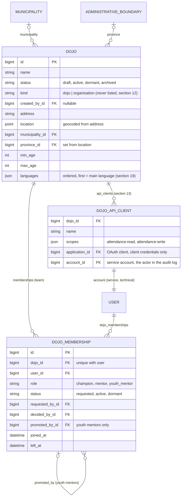
```mermaid
erDiagram
    DOJO ||--o{ DOJO_MEMBERSHIP : "memberships (team)"
    USER ||--o{ DOJO_MEMBERSHIP : "dojo_memberships"
    DOJO_MEMBERSHIP |o--o{ DOJO_MEMBERSHIP : "promoted_by (youth mentors)"
    MUNICIPALITY |o--o{ DOJO : "municipality"
    ADMINISTRATIVE_BOUNDARY |o--o{ DOJO : "province"
    DOJO ||--o{ DOJO_API_CLIENT : "api_clients (section 13)"
    DOJO_API_CLIENT ||--|| USER : "account (service, technical)"

    DOJO {
        bigint id PK
        string name
        string status "draft, active, dormant, archived"
        string kind "dojo | organisation (never listed, section 12)"
        bigint created_by_id FK "nullable"
        string address
        point location "geocoded from address"
        bigint municipality_id FK
        bigint province_id FK "set from location"
        int min_age
        int max_age
        json languages "ordered, first = main language (section 19)"
    }
    DOJO_MEMBERSHIP {
        bigint id PK
        bigint dojo_id FK "unique with user"
        bigint user_id FK
        string role "champion, mentor, youth_mentor"
        string status "requested, active, dormant"
        bigint requested_by_id FK
        bigint decided_by_id FK
        bigint promoted_by_id FK "youth mentors only"
        datetime joined_at
        datetime left_at
    }
    DOJO_API_CLIENT {
        bigint dojo_id FK
        string name
        json scopes "attendance:read, attendance:write"
        bigint application_id FK "OAuth client, client credentials only"
        bigint account_id FK "service account, the actor in the audit log"
    }
```

### Who can use a dojo's admin area

`dojos/access.py` gives admin access to an account with an **active
`champion` or `mentor` membership** at the dojo, and only while its
background check is valid. Youth mentors never get admin access, and
neither do requested or dormant memberships. Each role maps to a set of
capabilities. With no role at all the dojo gives a **404**; a role that
lacks the view's capability gets a **403**.

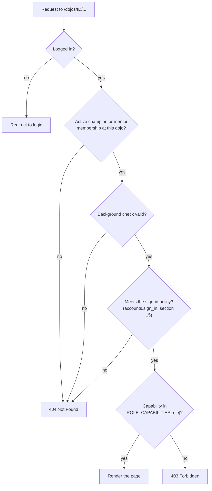
```mermaid
flowchart TD
    R[Request to /dojos/ID/...] --> A{Logged in?}
    A -- no --> L[Redirect to login]
    A -- yes --> M{"Active champion or mentor<br/>membership at this dojo?"}
    M -- no --> N404[404 Not Found]
    M -- yes --> V{Background check valid?}
    V -- no --> N404
    V -- yes --> SI{"Meets the sign-in policy?<br/>(accounts.sign_in, section 15)"}
    SI -- no --> N404
    SI -- yes --> C{"Capability in<br/>ROLE_CAPABILITIES[role]?"}
    C -- yes --> OK[Render the page]
    C -- no --> N403[403 Forbidden]
```

| Capability | Gates | CHAMPION | MENTOR |
|---|---|:-:|:-:|
| *(any role)* | dashboard, events list, notification bell | ✓ | ✓ |
| `TAKE_ATTENDANCE` | attendance pages, marking present/absent | ✓ | ✓ |
| `MANAGE_EVENTS` | create/edit events, change status | ✓ | ✓ |
| `EDIT_SETTINGS` | dojo profile settings | ✓ | ✓ |
| `MANAGE_TEAM` | accept/decline join requests, add/remove mentors, promote youth mentors | ✓ | ✓ |
| `AWARD_BELTS` | award a ninja a belt (from the attendance list) | ✓ | ✓ |
| `AWARD_BADGES` | award a one-off badge (from the attendance list) | ✓ | ✓ |
| `POST_UPDATES` | the Updates page ("From this dojo") | ✓ | ✓ |
| `MANAGE_LIFECYCLE` | launch / dormant / archive / reopen the dojo | ✓ | — |
| `VIEW_HEALTH_NOTES` | a child's allergies and notes on the attendance list | ✓ | — |
| `MANAGE_API` | the dojo's API clients (section 13) | ✓ | — |
| `SEND_MAIL` | write and send the dojo's mail to its families (section 25) | ✓ | — |
| *(champion only)* | hand over the champion role | ✓ | — |

To restrict mentors, remove entries from `ROLE_CAPABILITIES[MENTOR]`.
Who may *join* a team at all is `access.is_approved_mentor`: an adult account
with an approved mentor (or champion) `Application` and a valid background
check (`applications.services`).

---

## 4. Events, registrations and attendance

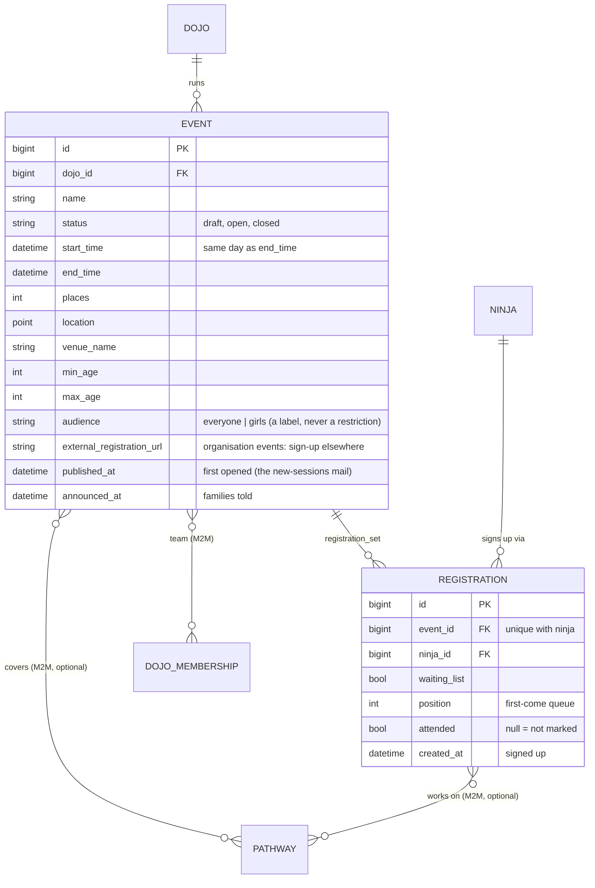
```mermaid
erDiagram
    DOJO ||--o{ EVENT : "runs"
    EVENT ||--o{ REGISTRATION : "registration_set"
    NINJA ||--o{ REGISTRATION : "signs up via"
    EVENT }o--o{ PATHWAY : "covers (M2M, optional)"
    REGISTRATION }o--o{ PATHWAY : "works on (M2M, optional)"
    EVENT }o--o{ DOJO_MEMBERSHIP : "team (M2M)"

    EVENT {
        bigint id PK
        bigint dojo_id FK
        string name
        string status "draft, open, closed"
        datetime start_time "same day as end_time"
        datetime end_time
        int places
        point location
        string venue_name
        int min_age
        int max_age
        string audience "everyone | girls (a label, never a restriction)"
        string external_registration_url "organisation events: sign-up elsewhere"
        datetime published_at "first opened (the new-sessions mail)"
        datetime announced_at "families told"
    }
    REGISTRATION {
        bigint id PK
        bigint event_id FK "unique with ninja"
        bigint ninja_id FK
        bool waiting_list
        int position "first-come queue"
        bool attended "null = not marked"
        datetime created_at "signed up"
    }
```

- **Places:** `Event.places_left` = `places` − confirmed registrations
  (those with `waiting_list=False`). When a confirmed place is cancelled,
  the next person on the waiting list is promoted and the dojo's team (its
  active champion and mentors) is
  notified.
- **Attendance:** `Registration.attended` has three states: `None` (not
  marked yet), `True` (present), `False` (absent). Only confirmed
  registrations can be marked.
- **Pathways:** `Event.pathways` (what the session covers, shown on its
  public page) is pre-selected from `Dojo.pathways` on a new event;
  `Registration.pathways` (what this ninja works on) is set to the
  event's at signup and narrowed by the team from the attendance list
  (`dojo_event_registration_pathways`, `TAKE_ATTENDANCE`). Neither is
  restricted to the level above. See section 7.

### Event status

The dojo's team sets any status directly (`dojo_event_set_status`); it isn't a
one-way lifecycle. Existing registrations are kept whatever the status.

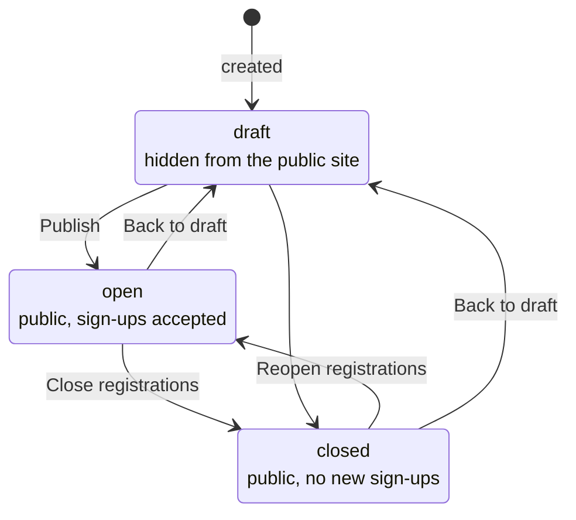
```mermaid
stateDiagram-v2
    [*] --> draft : created
    draft --> open : Publish
    open --> closed : Close registrations
    closed --> open : Reopen registrations
    open --> draft : Back to draft
    closed --> draft : Back to draft
    draft --> closed

    draft : draft<br/>hidden from the public site
    open : open<br/>public, sign-ups accepted
    closed : closed<br/>public, no new sign-ups
```

### Engagement and cancellations

Cancelling a place deletes its `Registration` (so places and the waiting
list stay simple) after appending a `RegistrationCancellation`. Every night
`events.engagement.rebuild()` recomputes `NinjaEngagement`: per child and
dojo they came to in the last year, plus an overall row measured at their
main dojo. It only counts sessions meant for the child (age range; a girls'
session only for girls), and records each overall stage change in
`NinjaEngagementChange`. Segments, journeys and the dojo team's attendance
list read it (section 11).

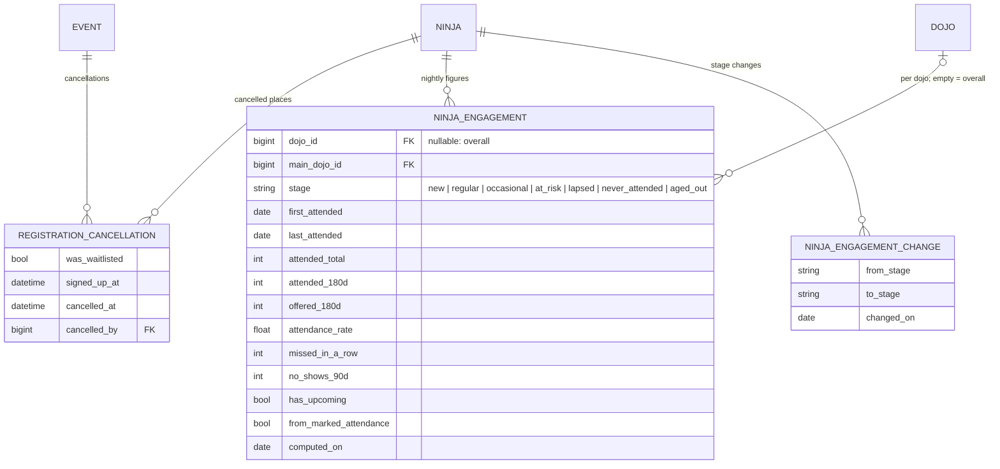
```mermaid
erDiagram
    NINJA ||--o{ REGISTRATION_CANCELLATION : "cancelled places"
    EVENT ||--o{ REGISTRATION_CANCELLATION : "cancellations"
    NINJA ||--o{ NINJA_ENGAGEMENT : "nightly figures"
    DOJO |o--o{ NINJA_ENGAGEMENT : "per dojo; empty = overall"
    NINJA ||--o{ NINJA_ENGAGEMENT_CHANGE : "stage changes"

    REGISTRATION_CANCELLATION {
        bool was_waitlisted
        datetime signed_up_at
        datetime cancelled_at
        bigint cancelled_by FK
    }
    NINJA_ENGAGEMENT {
        bigint dojo_id FK "nullable: overall"
        bigint main_dojo_id FK
        string stage "new | regular | occasional | at_risk | lapsed | never_attended | aged_out"
        date first_attended
        date last_attended
        int attended_total
        int attended_180d
        int offered_180d
        float attendance_rate
        int missed_in_a_row
        int no_shows_90d
        bool has_upcoming
        bool from_marked_attendance
        date computed_on
    }
    NINJA_ENGAGEMENT_CHANGE {
        string from_stage
        string to_stage
        date changed_on
    }
```

---

## 5. Badges and belts

Two separate things a ninja collects (redesign phase 5), both in `events`
with their rules in `events/awards.py`:

- A **badge** is an award: either a **one-off** ("did the thing", e.g.
  attended a CoderDojo for Girls session) or a **milestone** reached by a
  number of sessions attended (the attendance wristbands). `NinjaBadge`
  holds one ninja's progress on one badge. Only the organisation defines
  badges (the organisation dashboard's *Awards* page). A one-off is awarded
  from the attendance list by an **active champion or mentor** with a valid
  check (`AWARD_BADGES`, `award_badge`), to a ninja who has been to one of
  that dojo's sessions, once; the row records the account, the membership
  and an optional note. Milestones are never awarded by hand: they're
  recomputed (`sync_milestones`) whenever the dojo team marks attendance;
  an earned badge stays earned if a mark is later undone.
- A **belt** is a ninja's **proficiency level**: one overall track ordered
  by `Belt.level`, not linked to pathways. `NinjaBelt` is an append-only
  history (current belt = the highest level, `Ninja.current_belt`).
  Only an **active champion or mentor** with a valid check
  (`AWARD_BELTS`) can award one (`award_belt`), from the attendance list,
  to a ninja who has been to one of that dojo's sessions, and only a belt
  above the ninja's current one. Each row records the account, the
  membership and that membership's role at the time ("Jan, as mentor of
  CoderDojo Ghent"). A milestone badge can optionally `grants_belt`:
  reaching it awards that belt as the membership that marked the
  attendance.

The ninja's page shows the current belt with its history, and the
badges carousel. The attendance list shows each ninja's current belt.

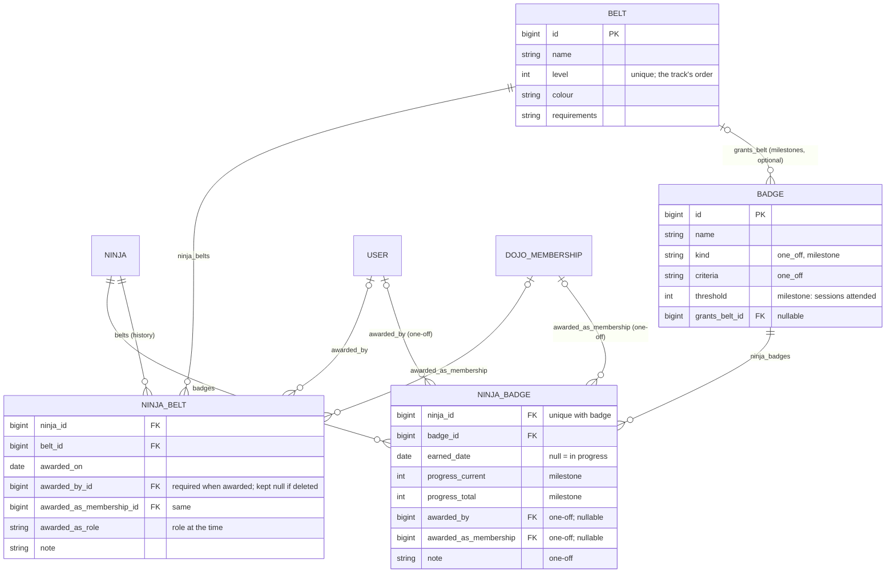
```mermaid
erDiagram
    NINJA ||--o{ NINJA_BADGE : "badges"
    BADGE ||--o{ NINJA_BADGE : "ninja_badges"
    NINJA ||--o{ NINJA_BELT : "belts (history)"
    BELT ||--o{ NINJA_BELT : "ninja_belts"
    BELT |o--o{ BADGE : "grants_belt (milestones, optional)"
    USER |o--o{ NINJA_BELT : "awarded_by"
    DOJO_MEMBERSHIP |o--o{ NINJA_BELT : "awarded_as_membership"
    USER |o--o{ NINJA_BADGE : "awarded_by (one-off)"
    DOJO_MEMBERSHIP |o--o{ NINJA_BADGE : "awarded_as_membership (one-off)"

    BADGE {
        bigint id PK
        string name
        string kind "one_off, milestone"
        string criteria "one_off"
        int threshold "milestone: sessions attended"
        bigint grants_belt_id FK "nullable"
    }
    NINJA_BADGE {
        bigint ninja_id FK "unique with badge"
        bigint badge_id FK
        date earned_date "null = in progress"
        int progress_current "milestone"
        int progress_total "milestone"
        bigint awarded_by FK "one-off; nullable"
        bigint awarded_as_membership FK "one-off; nullable"
        string note "one-off"
    }
    BELT {
        bigint id PK
        string name
        int level "unique; the track's order"
        string colour
        string requirements
    }
    NINJA_BELT {
        bigint ninja_id FK
        bigint belt_id FK
        date awarded_on
        bigint awarded_by_id FK "required when awarded; kept null if deleted"
        bigint awarded_as_membership_id FK "same"
        string awarded_as_role "role at the time"
        string note
    }
```

---

## 6. Applications and background checks

Onboarding is **account-level** (redesign phase 3): an adult account applies
**once** to become a **mentor** or a **champion** (`Application`), not once
per dojo. The Belgian Article 596.2 criminal-record extract is checked **on
the account** (the `background_check_*` fields on `User`). Every review
decision is appended to `BackgroundCheckHistory`: who decided and when. The
uploaded document is **deleted as soon as a decision is made**, validate or
reject; the history never stores it. All of this lives in
`applications/services.py`.

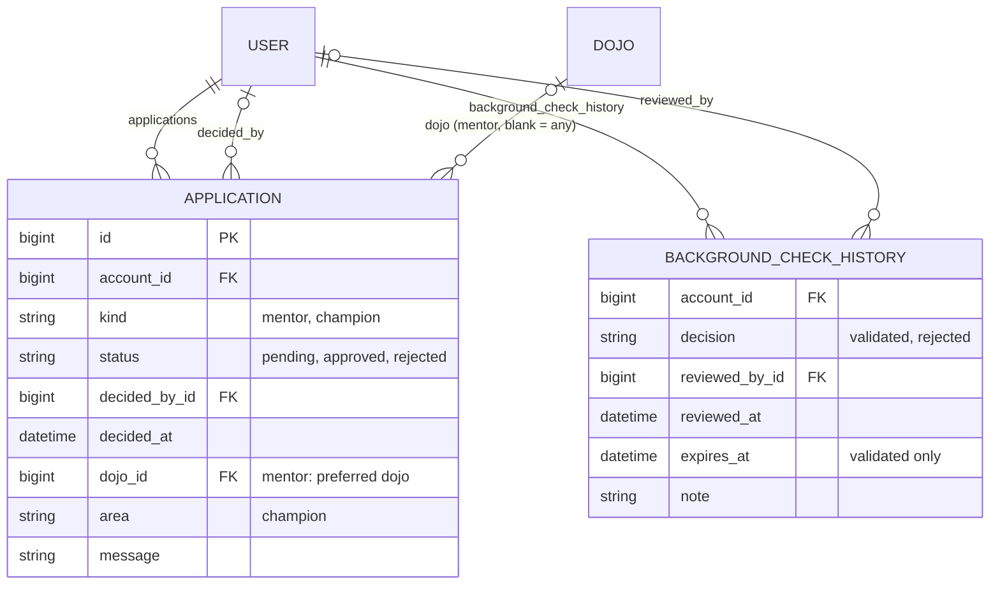
```mermaid
erDiagram
    USER ||--o{ APPLICATION : "applications"
    USER ||--o{ BACKGROUND_CHECK_HISTORY : "background_check_history"
    USER |o--o{ BACKGROUND_CHECK_HISTORY : "reviewed_by"
    USER |o--o{ APPLICATION : "decided_by"
    DOJO |o--o{ APPLICATION : "dojo (mentor, blank = any)"

    APPLICATION {
        bigint id PK
        bigint account_id FK
        string kind "mentor, champion"
        string status "pending, approved, rejected"
        bigint decided_by_id FK
        datetime decided_at
        bigint dojo_id FK "mentor: preferred dojo"
        string area "champion"
        string message
    }
    BACKGROUND_CHECK_HISTORY {
        bigint account_id FK
        string decision "validated, rejected"
        bigint reviewed_by_id FK
        datetime reviewed_at
        datetime expires_at "validated only"
        string note
    }
```

### Background check lifecycle (on the account)

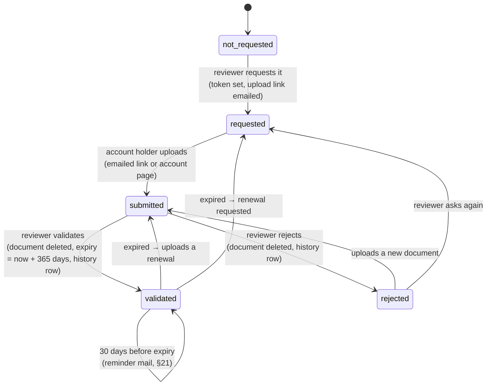
```mermaid
stateDiagram-v2
    [*] --> not_requested
    not_requested --> requested : reviewer requests it<br/>(token set, upload link emailed)
    requested --> submitted : account holder uploads<br/>(emailed link or account page)
    submitted --> validated : reviewer validates<br/>(document deleted, expiry = now + 365 days, history row)
    submitted --> rejected : reviewer rejects<br/>(document deleted, history row)
    rejected --> submitted : uploads a new document
    validated --> submitted : expired → uploads a renewal
    rejected --> requested : reviewer asks again
    validated --> requested : expired → renewal requested
    validated --> validated : 30 days before expiry<br/>(reminder mail, §21)
```

Reviewers work from the organisation dashboard's *Volunteers* pages (§21):
the organisation's `reviewer` role reviews checks and decides applications,
never their own.

### From application to a dojo

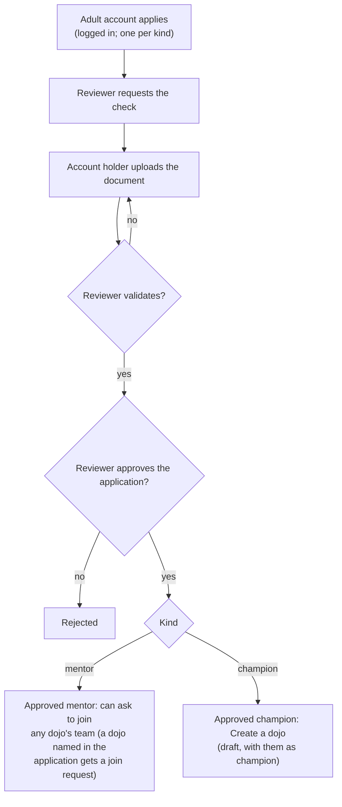
```mermaid
flowchart TD
    A["Adult account applies<br/>(logged in; one per kind)"] --> R[Reviewer requests the check]
    R --> U[Account holder uploads the document]
    U --> V{Reviewer validates?}
    V -- no --> U
    V -- yes --> P{Reviewer approves the application?}
    P -- no --> X[Rejected]
    P -- yes --> K{Kind}
    K -- mentor --> M["Approved mentor: can ask to join<br/>any dojo's team (a dojo named in the<br/>application gets a join request)"]
    K -- champion --> C["Approved champion: Create a dojo<br/>(draft, with them as champion)"]
```

A lapsed check (validated, then expired) **never blocks login**. It makes
`background_check_valid` false, so the account's champion/mentor memberships
stop granting dojo access (section 3) until a renewal is validated. The
account page links to the upload.

---

## 7. Learning pathways and content

`pathways` is a read-mostly catalogue with no enrolment state. It's
linked at three optional levels, each pre-filled from the one above:
`Dojo.pathways` (what the dojo provides, set on its Settings page and
shown on its public page) → `Event.pathways` (what a session covers) →
`Registration.pathways` (what one ninja works on; it feeds the ninja's
history and the attendance list). The `content`
models are each optionally scoped to one dojo, event or pathway, or
site-wide when the scoping key is blank.

`content.OrganisationTeamMember` is the organisation's team listing (the
homepage's "Meet the team" and `team/<id>/`). It's display only, each entry
with a position ("Member of the board" is one of them), and it's separate
from any access.

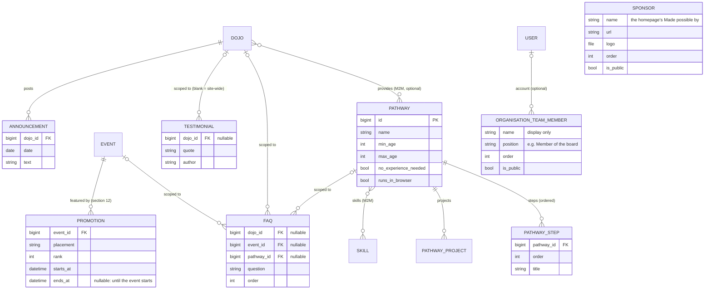
```mermaid
erDiagram
    PATHWAY ||--o{ PATHWAY_STEP : "steps (ordered)"
    PATHWAY ||--o{ PATHWAY_PROJECT : "projects"
    PATHWAY }o--o{ SKILL : "skills (M2M)"
    DOJO }o--o{ PATHWAY : "provides (M2M, optional)"
    DOJO |o--o{ FAQ : "scoped to"
    EVENT |o--o{ FAQ : "scoped to"
    PATHWAY |o--o{ FAQ : "scoped to"
    DOJO |o--o{ TESTIMONIAL : "scoped to (blank = site-wide)"
    DOJO ||--o{ ANNOUNCEMENT : "posts"
    EVENT ||--o{ PROMOTION : "featured by (section 12)"
    USER |o--o{ ORGANISATION_TEAM_MEMBER : "account (optional)"

    SPONSOR {
        string name "the homepage's Made possible by"
        string url
        file logo
        int order
        bool is_public
    }
    PATHWAY {
        bigint id PK
        string name
        int min_age
        int max_age
        bool no_experience_needed
        bool runs_in_browser
    }
    PATHWAY_STEP {
        bigint pathway_id FK
        int order
        string title
    }
    FAQ {
        bigint dojo_id FK "nullable"
        bigint event_id FK "nullable"
        bigint pathway_id FK "nullable"
        string question
        int order
    }
    TESTIMONIAL {
        bigint dojo_id FK "nullable"
        string quote
        string author
    }
    ORGANISATION_TEAM_MEMBER {
        string name "display only"
        string position "e.g. Member of the board"
        int order
        bool is_public
    }
    ANNOUNCEMENT {
        bigint dojo_id FK
        date date
        string text
    }
    PROMOTION {
        bigint event_id FK
        string placement
        int rank
        datetime starts_at
        datetime ends_at "nullable: until the event starts"
    }
```

---

## 8. Notifications

Each `Notification` row belongs to one recipient, so read state is per
user. An event that concerns several people creates one row per recipient.
Always create notifications through `notifications.services.notify()`: it
writes the row, then pushes the updated bell over the WebSocket channel
layer, on a best-effort basis.

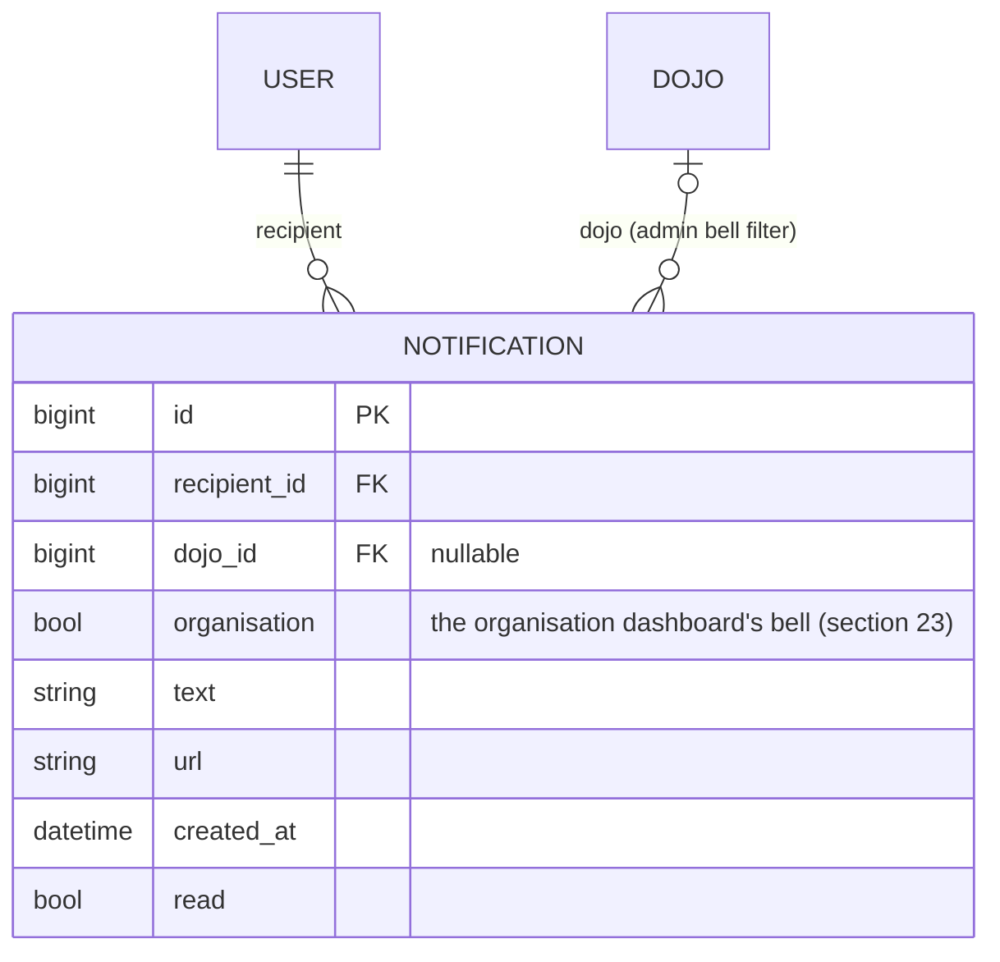
```mermaid
erDiagram
    USER ||--o{ NOTIFICATION : "recipient"
    DOJO |o--o{ NOTIFICATION : "dojo (admin bell filter)"

    NOTIFICATION {
        bigint id PK
        bigint recipient_id FK
        bigint dojo_id FK "nullable"
        bool organisation "the organisation dashboard's bell (section 23)"
        string text
        string url
        datetime created_at
        bool read
    }
```

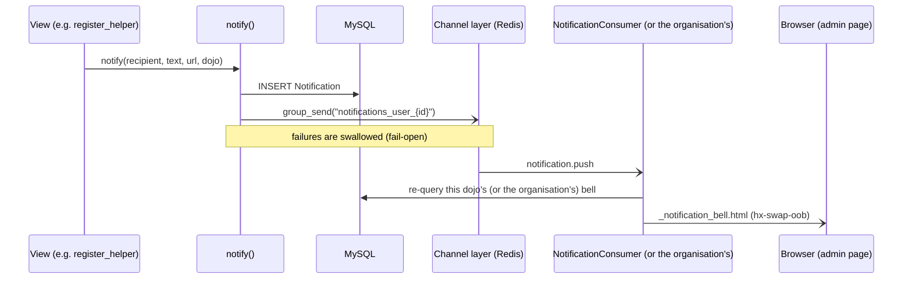
```mermaid
sequenceDiagram
    participant V as View (e.g. register_helper)
    participant S as notify()
    participant DB as MySQL
    participant CL as Channel layer (Redis)
    participant C as NotificationConsumer (or the organisation's)
    participant B as Browser (admin page)

    V->>S: notify(recipient, text, url, dojo)
    S->>DB: INSERT Notification
    S-)CL: group_send("notifications_user_{id}")
    Note over S,CL: failures are swallowed (fail-open)
    CL-)C: notification.push
    C->>DB: re-query this dojo's (or the organisation's) bell
    C-)B: _notification_bell.html (hx-swap-oob)
```

---

## 9. Geo reference data

Reference data only (seeded by `seed_geo`), with no URLs of its own. A
dojo's `province` is derived from its geocoded `location`: a
point-in-polygon lookup against `AdministrativeBoundary`, falling back to
the nearest boundary. Distance searches always use
`geo.functions.DistanceSphere` (MySQL `ST_Distance_Sphere`).

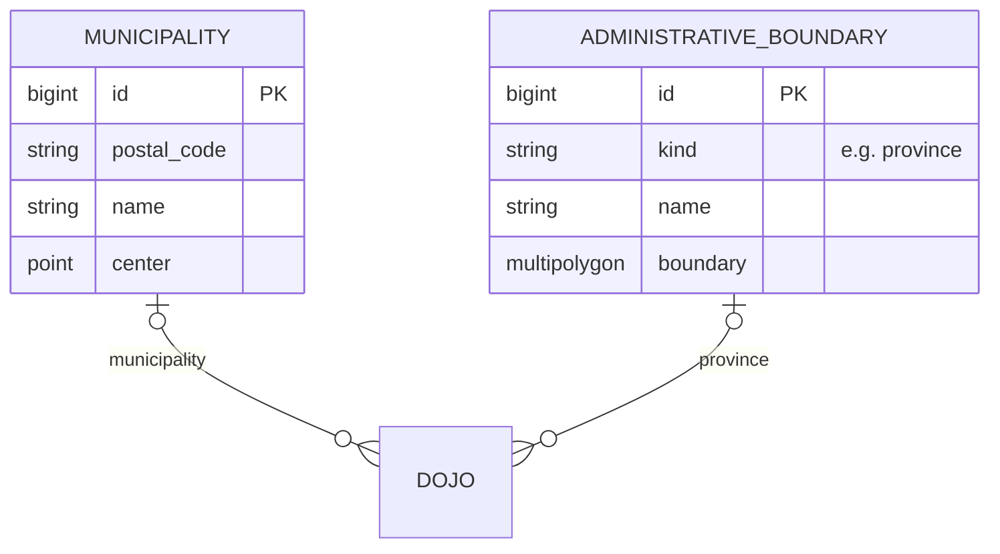
```mermaid
erDiagram
    MUNICIPALITY |o--o{ DOJO : "municipality"
    ADMINISTRATIVE_BOUNDARY |o--o{ DOJO : "province"

    MUNICIPALITY {
        bigint id PK
        string postal_code
        string name
        point center
    }
    ADMINISTRATIVE_BOUNDARY {
        bigint id PK
        string kind "e.g. province"
        string name
        multipolygon boundary
    }
```

---

## 10. Redesign: rationale and plan

**Landed** (all eight phases, 2026-09-24) — sections 1–9 already describe
the model this produced. The rationale (what was wrong with the old
role-subclass model), the target model, every lifecycle diagram, the open
questions settled along the way and the phase-by-phase implementation
plan are in `DATA_MODEL_REDESIGN.md`.

## 11. Mailing, segmentation and campaigns

The mail engine (`mailing`: categories, consent, the `send()`/queue/Celery
pipeline, bounces, automated mail) and audience/segmentation/campaigns
(`campaigns`, split out 2 October 2026: segments and their attributes,
campaigns, journeys, the engagement snapshot, the organisation dashboard's
mailing pages). Full design, decisions and phases — together with §25, a
dojo's own mail to its families — are in `DATA_MODEL_MAILING.md`.

## 12. Organisation events and promotion

**Built** (option A below, all four build steps). Events the organisation
runs itself, such as CoderDojo Girlz and Coolest Projects, needed two
things the model didn't give them: an organiser that isn't a dojo, and
promotion (featured, reordered, or shown in a different spot on a page).

What was built, and the details settled while building it:
- `Dojo.kind` (`dojo` | `organisation`). `Dojo.objects.public()` and
  `Dojo.is_public` exclude organisation dojos, which covers the dojo
  finder, dojo and team pages, join requests, the event filter and the
  application form. An organisation dojo must still be `active` for its
  events to be public (`Event.objects.visible()` is unchanged). There's no
  UI to create one: it's set in the Django admin (or `seed_organisation`).
- Organisation dojos are skipped by the dormancy nudge, the `near_dojo`
  segment picker and the daily "new sessions at your dojo" mail
  (organisation events reach families through campaigns instead). The
  lifecycle actions stay available to their champion.
- Event pages say "Organised by …" (`events/partials/_organiser.html`)
  instead of linking to the dojo; the dojo admin hides "View public page".
- `Event.external_registration_url`: only an organisation dojo's event
  form offers it (`EventForm`), and then `places` is optional (saved as
  0). The event page links out ("Register on <host>"), `event_signup`
  redirects to the event page, and the upcoming-sessions carousel lists it
  whatever its places.
- `content.Promotion` as below. `Promotion.objects.showing(placement)` is
  the one rule for what's live: started, not ended (`ends_at`, or the
  event's start when empty), the event not finished, and the event in
  `Event.objects.visible()`. Saving or deleting a promotion clears the
  carousel's cache (`events.search`), as saving a dojo, event or
  registration does (`events/signals.py`).
- Managed on the organisation dashboard (`/manage/promotions/`,
  `content/manage.py`, organisation `admin` role) with a full Django admin
  page as well. Any upcoming event can be picked, drafts included (it
  shows once published).
- `manage.py seed_organisation` (rerun-safe) seeds "CoderDojo Belgium" with
  an approved champion, a CoderDojo Girlz session, Coolest Projects
  (registers externally) and one promotion per placement.

### Who organises an event

Every `Event` has a `dojo`, and a lot hangs off that link:
- the admin area, its access checks and capabilities (`/dojos/<id>/…`,
  `dojos.access`)
- the event team (`Event.team` → `DojoMembership`)
- attendance, belt awards and manager notifications
- `Event.visible()`, which requires an active dojo

Two ways to let the organisation plan events:

| | A. An organisation dojo (recommended) | B. Events without a dojo |
|---|---|---|
| Model | `Dojo.kind = dojo \| organisation`. One (or a few) organisation rows, e.g. "CoderDojo Belgium" or "CoderDojo Girlz". | `Event.dojo` nullable, plus an `Event.organiser` field. |
| Hidden from discovery | `Dojo.objects.public()` excludes `kind=organisation`, which covers the dojo finder, dojo pages, the event filter, the application form and the segmentation dojo pickers in one place. | Nothing to hide, but every `event.dojo` use (about 25 code paths) needs a no-dojo branch. |
| Admin, attendance, belts | Work unchanged: the organisation dojo has its own admin area, team and attendance screens. | Need a second admin surface for dojo-less events. |
| Who runs the events | Memberships of the organisation dojo, so the same background-check rule applies. That matters: event staff work with children. | A new access rule, e.g. the `admin` organisation role, which today needs no background check. |
| Location | Per event (`Event.location` / `venue_name` already exist). The organisation dojo has no location, so the finder skips it anyway. | Same. |
| Cost | Small: one field, one filter, a few "not an organisation dojo" checks (dormancy nudge, lifecycle, dojo stats). | Large and spread out. |

**Recommendation: A.** It's explicit (a `kind`, not "a dojo we happen to
hide"), reuses the whole event machinery, and keeps the background-check
rule for everyone who works at an event. Details to settle when building
it:
- An organisation dojo has no lifecycle nudges (dormancy) and never shows
  in the dojo finder or the "near dojo" segment picker. Its events show
  "Organised by CoderDojo Belgium" instead of a link to a dojo page.
- Its team is managed like any dojo's (champion plus mentors). Organisation
  `admin` role holders get no automatic membership: access to the
  organisation's events stays tied to a valid background check.
- **External registration.** Some events (e.g. Coolest Projects) take
  registrations elsewhere. `Event.external_registration_url` makes the
  event page link out instead of showing the sign-up form. Such an event
  has no registrations or attendance on this site, and then counts for
  nothing in the engagement statistics.

### Promotion

Promotion is a separate, time-boxed thing, not a property of the event, so
it can be switched on and off, ordered, and pointed at different parts of
the site without editing the event. A `content.Promotion` model sits next
to `Announcement`:

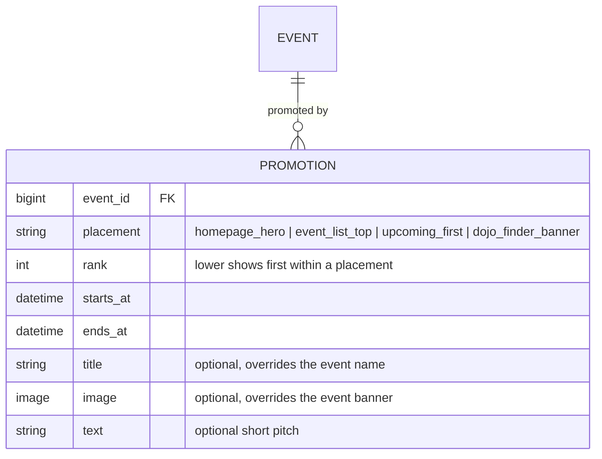
```mermaid
erDiagram
    EVENT ||--o{ PROMOTION : "promoted by"
    PROMOTION {
        bigint event_id FK
        string placement "homepage_hero | event_list_top | upcoming_first | dojo_finder_banner"
        int rank "lower shows first within a placement"
        datetime starts_at
        datetime ends_at
        string title "optional, overrides the event name"
        image image "optional, overrides the event banner"
        string text "optional short pitch"
    }
```

- **Placements** are a fixed list; each template shows the active
  promotions for its placement, ordered by `rank`:
  - `homepage_hero`: a large card at the top of the homepage
  - `event_list_top`: pinned above the date-ordered event list
  - `upcoming_first`: first in the upcoming-sessions carousel, before the
    date order
  - `dojo_finder_banner`: a banner above the dojo finder results (the Dojos
    page only; the homepage's finder widget doesn't repeat it, since the
    homepage already features events in its hero and Upcoming sessions)
- **Reordering** means editing `rank` (the admin list can edit it
  directly). A promotion ends automatically at `ends_at`, or by default
  when its event starts.
- **Who manages it:** the organisation `admin` role, like the rest of the
  site content. Promotion could later extend to dojo events (a champion
  promoting their own session on their dojo page), with the same model.
- **Mail and promotion stay separate but line up:** a campaign
  (section 11) can link to a promoted event, and segments like "families
  with girls near dojo X" target the same audience the promotion is for.

### Build order (all done)

1. `Dojo.kind` plus the `public()` filter, the organiser line on event
   pages, and a seeded organisation dojo holding the CoderDojo Girlz and
   Coolest Projects events.
2. `Event.external_registration_url`.
3. `content.Promotion` with the four placements and its admin.
4. Docs (en/fr/nl) for families: where featured events appear, and that
   some events register externally.

## 13. API based management (in progress)

Dojo API clients over OAuth 2.0 client credentials (`/api/v1/`): built for
attendance; still planned for event management (including a bulk
`events/sync` endpoint so a champion can plan a year of sessions in a
spreadsheet and push it over the API) and external registrations. Full
design, decisions, phases and open points are in `DATA_MODEL_API.md`.

## 14. Audit log (built)

A record of who changed what, and who viewed the most sensitive data (a
child's health notes, criminal-record extracts), kept in the database next
to the data and shown in the Django admin. §16 phase 6 depends on it.

**All phases are built;** phase 5's retention and erasure of entries came
with §16 phases 4 and 5 (`privacy.retention`, `privacy.erasure`). What
changed from the plan below while building it (the plan's text is kept as
written, so this list wins where they differ):

- **Checked on Django 6.1 and ASGI:** its 17 migrations, the whole test
  suite, and a change through nginx + Daphne recorded with its account and
  no address. Still to check at the first deploy: the same through
  gunicorn + uvicorn on Level27.
- **The recorded models are `core.audit.RECORDED`, not a setting.**
  auditlog 3.4.1 diffs a new row over `_meta.get_fields()`, reverse
  relations included, so every create listed junk like
  `applications.Application.None`. `core.audit.register_models()` (from
  `CoreConfig.ready`) registers each model with an explicit
  `include_fields` of its own columns, which removes it. `auth.Group`
  (the roles' permissions) was added to the list.
- **`AUDITLOG_STORE_JSON_CHANGES = False`**: with JSON, file fields are
  compared as objects, and an empty photo (`None` in memory, `''` in the
  database) showed up as a change on every save. Changes are stored as
  text.
- **`AUDITLOG_MASK_CALLABLE = "core.audit.mask"`**: the default mask keeps
  half the value ("\*\*\*nuts"); ours hides it all.
- **`core.audit.AuditlogMiddleware`** (in `MIDDLEWARE`, replacing
  auditlog's) drops the port too: `AUDITLOG_DISABLE_REMOTE_ADDR` doesn't
  cover `X-Forwarded-Port`, and the test showed it stored.
- **Health-note views are recorded by a template tag**, `` (`core/templatetags/audit.py`), inside the block of
  `_attendance_row.html` that prints the notes. The row is rendered by
  eight views, whole list or one row, so the tag records exactly what was
  shown. The other views go through `core.audit.log_access(obj)`:
  `download_background_check`, `manage_privacy_export` (replacing the
  logger line of §16 phase 3), and the Django admin change page of
  `User`, `Ninja` and `BackgroundCheck` (`LogAccessAdminMixin`, GET only).
- **The per-row history** (`core.audit.AuditHistoryAdminMixin` on the
  `User`, `Ninja`, `Dojo` and `Event` admins: an "Audit log" column)
  also requires `auditlog.view_logentry`: auditlog's own view only checks
  the view permission of the row's model, which the board has for dojos
  and sessions. The column is hidden from anyone without it.
- The admin's section is auditlog's own ("Audit log" → "Log entries"),
  apart from Django's "Administration" → "Log entries"; no renaming.
- The seeders are wrapped in `core.audit.without_audit_log` (20
  `seed_*` commands and `describe_seed_accounts`).

### Choosing a package

| Package | Records changes | Records views | How it stores them |
|---|---|---|---|
| **[django-auditlog](https://github.com/jazzband/django-auditlog) 3.4.1** | yes, as a diff per save/delete, plus many-to-many changes | **yes**: a `LogEntry.Action.ACCESS` action, written when the `auditlog.signals.accessed` signal is sent for a registered model | one `auditlog_logentry` table |
| django-simple-history 3.13.0 | yes, a full copy of the row per save | no | a history table per model: every personal field copied, so erasure has to scrub each one |
| django-reversion | only what's saved inside a revision block | no | versions for restoring, not an audit trail |
| django-easy-audit 1.3.9 | yes | only as URLs (every request, via middleware), not which records a page showed | its own tables |
| Django itself | only the admin's add/change/delete (`admin.LogEntry`) | no | — |

**Decision:** django-auditlog. One table, diffs instead of copies (less
personal data to classify and erase), and the only one that records a view
of a specific record. Its classifiers stop at Django 5.2 (it requires
`Django>=4.2`, no upper limit), so phase 1 checks it on our 6.1.

What we checked in its 3.4.1 source, and what the plan has to work around:

- **Only `save()`/`delete()` and many-to-many changes are recorded**
  (`post_save`/`pre_save`/`post_delete`/`m2m_changed`), never
  `QuerySet.update()`, `bulk_create()` or raw SQL. Of our code that
  changes data worth recording, only *Mark all present*
  (`dojos/views/`, `confirmed.update(attended=True)`) does that. The
  mail queue, campaign status and the nightly engagement rebuild use
  `update()`/`bulk_create()` too, but those models aren't recorded (below).
- **Signals are per class:** a save through the *Background checks* admin
  (the `applications.BackgroundCheck` proxy over `User`) sends `post_save`
  with the proxy as sender, so the proxy is registered as well as `User`.
- **Views are only recorded where the `accessed` signal is sent.** The
  package sends it only from `auditlog.mixins.LogAccessMixin`, for
  class-based `DetailView`s. Our views are functions, and it has nothing
  for admin pages, so we send it ourselves (phase 3).
- **The acting user** comes from `auditlog.middleware.AuditlogMiddleware`
  (a contextvar, plus the address from `X-Forwarded-For`). The middleware
  is sync-only, so under Daphne/uvicorn Django runs it through
  `sync_to_async` with our sync views: checked in phase 1. Outside a
  request (Celery, management commands) the actor is empty unless the
  code wraps the work in `auditlog.context.set_actor(user)`.
  `auditlog.context.disable_auditlog()` turns recording off for a block.
- **Its admin is read-only** (`has_add_permission` and
  `has_change_permission` return `False`, delete only as a cascade). That
  goes against our rule that the admin always stays fully usable
  (`core.tests.AdminStaysFullyUsableTests`); **decided: the audit log is
  the exception** (phase 4).
- **Retention:** `manage.py auditlogflush --before-date YYYY-MM-DD`
  deletes older entries (or `--truncate` for everything).
- **Settings we'd use:** `AUDITLOG_INCLUDE_TRACKING_MODELS` (which models,
  with per-model `exclude_fields`/`mask_fields`/`m2m_fields`),
  `AUDITLOG_EXCLUDE_TRACKING_FIELDS`, `AUDITLOG_MASK_TRACKING_FIELDS`,
  `AUDITLOG_DISABLE_ON_RAW_SAVE`, `AUDITLOG_DISABLE_REMOTE_ADDR`,
  `AUDITLOG_STORE_JSON_CHANGES`, `AUDITLOG_USE_FK_STRING_REPRESENTATION`.

### Phases

1. **Check it works here** (a spike, nothing kept if it fails):
   `django-auditlog==3.4.1` in `requirements.txt` (the site imports it at
   runtime; its one dependency, `python-dateutil`, is already pinned
   there), `"auditlog"` in `INSTALLED_APPS`, `AuditlogMiddleware` right
   after `AuthenticationMiddleware`, `migrate` (17 migrations of its own).
   Then: the whole test suite, a save through `runserver` (Daphne, ASGI)
   with the actor recorded, and the same through production's gunicorn +
   uvicorn worker (`scripts/deploy.sh --check` first; the deploy
   runs `migrate`).
2. **Record changes.**
   - Settings (one place, `website/settings.py`):
     `AUDITLOG_STORE_JSON_CHANGES = True`, `AUDITLOG_DISABLE_ON_RAW_SAVE =
     True` (fixtures), `AUDITLOG_USE_FK_STRING_REPRESENTATION = False`
     (links recorded as ids, not names: less personal data in the log),
     `AUDITLOG_MASK_TRACKING_FIELDS = ("password",
     "background_check_token")`, `AUDITLOG_EXCLUDE_TRACKING_FIELDS =
     ("last_login",)` (every login would be a change),
     `AUDITLOG_DISABLE_REMOTE_ADDR = True` (decided: no IP addresses,
     see open points). That setting doesn't cover `remote_port`, which
     the middleware reads from `X-Forwarded-Port`: our nginx doesn't send
     it, but Level27's proxy might, so a test checks that an entry made
     through a request has both `remote_addr` and `remote_port` empty (if
     not, a small subclass of `AuditlogMiddleware` drops the port).
   - **Recorded** (`AUDITLOG_INCLUDE_TRACKING_MODELS`), with options:
     accounts (`User` and the `BackgroundCheck` proxy with
     `m2m_fields={"groups"}`, `Ninja` with `mask_fields=["allergies_notes"]`
     so the log says it changed, never what it says, `Guardianship`,
     `OrganisationRole`), `Dojo`, `DojoMembership`, `Event` (excluding
     `published_at` and `announced_at`, set by the site itself;
     `m2m_fields={"team"}`), `Registration`, `TeamAttendance`,
     `NinjaBelt`, `NinjaBadge`, `Badge`, `Belt`, `Application`,
     `BackgroundCheckHistory`, the mail consent and blocks
     (`MailPreference`, `ConsentEvent`, `EmailSuppression`), the
     organisation's dashboard content (`Campaign`, `Journey`, `Segment`,
     `SegmentGroup`, `SegmentRule`, `EmailTemplate`, `Promotion`,
     `Sponsor`, `OrganisationTeamMember`, `Testimonial`, `FAQ`,
     `Announcement`), pathways.
   - **Not recorded**, each for its reason: what the site writes itself
     in bulk (`EmailMessage`, `BounceRecord`, `ProcessedImapMessage`,
     `JourneyDelivery`, `NinjaEngagement`, `NinjaEngagementChange`,
     `Notification`, `RegistrationCancellation` (itself a log)),
     sessions, Celery's tables, geo reference data, Django's own
     `admin.LogEntry`, and the audit log itself.
   - **A test that every model has a decision**, like
     `privacy.tests.EveryFieldIsClassifiedTests`: each installed model is
     either recorded or in a `NOT_RECORDED` list with its reason, so a new
     model can't be forgotten.
   - *Mark all present* saves each registration (or writes its entries
     with `LogEntry.objects.log_create`) instead of `QuerySet.update()`.
   - Seeders and `start.sh`'s reseeding run inside `disable_auditlog()`
     (seed data isn't history). Celery jobs that change recorded rows run
     with an empty actor, which the admin shows as "system".
3. **Record views of the sensitive data**, through one helper
   (`core/audit.py`: `log_access(obj)` sends `accessed`, so the entry
   carries the request's actor):
   - the attendance list, for every child whose `allergies_notes` it shows
     (`VIEW_HEALTH_NOTES`, champion only); one entry per child per page
     view;
   - `download_background_check` (a reviewer opening an extract);
   - the organisation's data export (`privacy.views.manage_privacy_export`),
     on the exported account; this closes the gap noted in §16 phase 3;
   - the Django admin's change page of `Ninja`, `User` and
     `BackgroundCheck` (a small `LogAccessAdminMixin` whose `change_view`
     calls the helper on GET).
   Every other page view stays unrecorded: this is about special-category
   data, not traffic.
4. **The admin.** The log is shown in the Django admin (`/admin/`) and,
   since 2026-09-29 (decided then, replacing "only in the Django admin"),
   read-only on the organisation dashboard: *Audit log* under
   *Organisation* (`/manage/audit-log/`, `pages/audit_views.py`, the
   `audit_log` area = `auditlog.view_logentry`, so the admin role and
   superusers, never the board). The dashboard page hides the values of
   health, criminal-record and security fields (the privacy registry's
   `special`, `criminal` and `security` categories), the masked fields
   and any field the registry has no decision about as `****`
   (`core.audit.is_hidden`), so the admin role sees *that* they changed
   and who changed them, never what they say. Nothing in a dojo's admin
   area and nothing in the family pages.
   - **Read-only, the one exception to "the admin always stays fully
     usable"** (decided): auditlog's own `LogEntryAdmin` stays as it is
     (no add, no change, no delete from its pages), because a log anyone
     with admin access can edit proves nothing. It gets three entries in
     `AdminStaysFullyUsableTests.EXCEPTIONS` (`auditlog.LogEntry` add,
     change, delete) with that reason. Entries are only ever removed
     through code: the retention job and erasure (phase 5), or
     `manage.py auditlogflush` on the server as the emergency tool.
   - A subclass of its admin (same permissions) only to name it "Audit
     log", so it isn't confused with Django's own admin history ("Log
     entries").
   - `auditlog.mixins.AuditlogHistoryAdminMixin` on the `User`, `Ninja`,
     `Dojo` and `Event` admins: an "Audit log" link per object.
   - **Who sees it (decided): the organisation's admin role.** The
     `auditlog.view_logentry` permission goes to the admin role's
     permission group only (`accounts/organisation.py`), never the
     board's; superusers see it anyway. A test checks that an admin-role
     account can open the audit log in the Django admin and a board
     account gets a 403.
5. **Privacy and retention** (§16):
   - Classify `auditlog.LogEntry` in `privacy/privacy.py`: `object_repr`,
     `changes`, `changes_text`, `serialized_data`, `additional_data`,
     `actor`, `actor_email`, `cid`; `remote_addr` and `remote_port` stay
     empty (not personal as long as they do); a new
     retention rule `audit_log`; not part of a person's export for now
     (see open points: added there if it's ever needed).
   - **Retention (decided): two years after the last login.** Entries
     follow the account they belong to: those it made (`actor`) and those
     about its own records (its `User` row, its children, memberships,
     applications, ...) are removed when the account is erased (or, for a
     champion or mentor, cleaned) two years after its last login (§16 phase 4, with reminder mails first). So an
     active volunteer's entries stay as long as they keep logging in.
     Entries with no account behind them (made by a Celery job or a
     management command, about a dojo or a session) are removed two years
     after they were written (`AUDIT_LOG_RETENTION_DAYS = 730`). Both run
     in the nightly retention job (§16 phase 4), on the default queue,
     deleting in batches, safe to run twice.
   - Erasure (§16 phase 5) also clears `object_repr`, `changes`,
     `changes_text` and `serialized_data` of the entries about the erased
     person (their `content_type` + `object_id`), and `actor_email` where
     they were the actor; the `actor` link stays, pointing at the
     anonymised account.
   - Update §16's inventory ("Outside our apps") and phase 6 (health-note
     views are recorded).
6. **Docs.** An "Audit log" section in `CLAUDE.md` (what's recorded, the
   coverage test, the read-only admin as the one exception named in the
   "admin always stays fully usable" workflow rule, `log_access` for new sensitive views, never
   `QuerySet.update()` on a recorded model where the change should show
   up), and this section rewritten as "built".
   No end-user docs and no text on the family forms: families aren't
   told about the log (decided, see open points).

### Open points

- ~~IP addresses~~ Decided: not recorded
  (`AUDITLOG_DISABLE_REMOTE_ADDR = True`). Every entry is tied to a
  logged-in account already, and addresses are in the infrastructure's
  own logs (nginx, Level27) when an incident needs them.
- ~~Retention period~~ Decided: two years after the account's last
  login, the same rule as the account itself (phase 5, and §16 phase 4
  for the reminder mails); two years after the entry when no account is
  behind it.
- ~~Editable in the admin?~~ Decided: read-only, the exception to the
  admin rule (phase 4). It still isn't tamper-proof against someone with
  database or shell access; that would need write-once storage outside
  the database, out of scope here.
- ~~Who sees the audit log~~ Decided: only the organisation's admin role
  (and superusers), not the board (phase 4); in the Django admin and, since
  2026-09-29, read-only on the organisation dashboard with sensitive values
  hidden (phase 4).
- ~~Telling families~~ Decided: the family forms and the help docs
  don't mention the log. If it's ever needed (a request under art. 15,
  or the board wants it), the person's data export (§16 phase 3) gets the
  audit entries about their own and their children's records. That's
  more than a `subjects` entry: `auditlog.LogEntry` points at a record
  through `content_type` + `object_id` (a generic link), not a foreign
  key, so `privacy.export` needs a small special case that looks up the
  entries for each exported row. Whether the actor's name is shown there
  follows the export's rule for links to someone else (`export=False`
  today).

## 15. Two-step login and the sign-in policy (built)

**Built.** Every account (an adult's, and since §24 a ninja's own login too) can turn on two-step login (an authenticator
app, passkeys, backup codes); the organisation decides per role which ones
**must** use it (the sign-in policy), from a day it chooses. For now every
role is on "password only": two-step login is optional for everyone, and
the enforcement is in place for when the organisation switches it on. Not
part of it: social login (Facebook, Google, ...), left out for now.

### The library

[django-two-factor-auth](https://django-two-factor-auth.readthedocs.io/en/stable/)
1.18.1 on **django-otp** 1.7.3. django-otp holds the devices, checks codes
and marks a session as verified (`request.user.is_verified()`, the session's
`otp_device_id`); django-two-factor-auth gives the login in steps, the
"remember this browser" cookie, the admin patch and the WebAuthn plugin
(passkeys, on `webauthn` 2.8.0).

- It officially lists Django up to 5.2 and Python up to 3.13; we run it on
  Django 6.1 and Python 3.14. The phase 0 test (full round trip, the admin,
  the setup) passed, and so does our own test suite. If it ever breaks,
  swap it for django-otp alone plus our own login steps: the device tables
  and the verified session are django-otp's either way.
- Its WebAuthn plugin caps `webauthn` below 3, and webauthn 2.x needs
  `cbor2<6`: cbor2 is on 5.x (autobahn, which pulled in 6.x, accepts
  >=5.2).
- `django-phonenumber-field` is a hard dependency even without the phone
  plugins; neither the phone, email nor YubiKey plugins are installed
  (SMS costs money and is the weakest method; the email plugin would send
  mail around `mailing.services.send`).
- We use only its **login** (`accounts.views.LoginView`, a subclass with our
  template and forms) and its admin patch. Setup, backup codes and turning
  it off are our own pages (`accounts/security_views.py`), with the
  package's forms underneath (`accounts/two_step_forms.py`): simpler than
  its setup wizard, and in our style. Its `two_factor` URL namespace only
  has the names it reverses itself, pointing at our pages.

### Devices, and the one login page

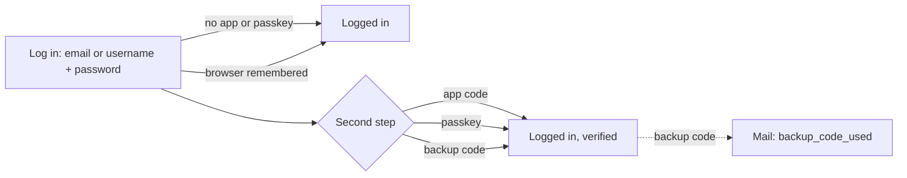
```mermaid
flowchart LR
    A[Log in: email or username + password] -->|no app or passkey| OK[Logged in]
    A -->|browser remembered| OK
    A --> T{Second step}
    T -->|app code| OK2[Logged in, verified]
    T -->|passkey| OK2
    T -->|backup code| OK2
    OK2 -.->|backup code| M[Mail: backup_code_used]
```

- **Methods** (`accounts/two_step.py`, the only place that changes them):
  at most one authenticator app (`otp_totp.TOTPDevice`), any number of
  passkeys (`two_factor_webauthn.WebauthnDevice`), and ten single-use
  backup codes (`otp_static.StaticDevice` + `StaticToken`), made with the
  first method and dropped with the last. Two-step login is "on" while the
  account has an app or a passkey.
- The package's login asks for the device named `default` and offers the
  others as alternatives, so exactly one app or passkey carries that name:
  the first one added, and another one when it's removed.
- **One login page**: `/login/` (`LoginView`, `LOGIN_URL`). The admin's
  login is patched to redirect there (`TWO_FACTOR_PATCH_ADMIN`). A login
  link (§24) goes through the same steps: `LoginLinkView` is `LoginView`
  with another first step. Family
  sign-up logs a brand-new account in (no device yet), the password reset
  doesn't log in (`post_reset_login = False`), and a child's set-password
  link doesn't either.
- **Remembered browser**: "Don't ask again in this browser for 30 days"
  (`TWO_FACTOR_REMEMBER_COOKIE_AGE`), a signed cookie that includes the
  password hash, so changing the password forgets every browser; the
  Security page forgets the current one.
- **Passkeys** are checked against `SITE_URL`'s host and origin
  (`accounts/webauthn_entities.py`), not the request's: nginx and Level27's
  proxy terminate TLS, so the request itself looks like http. The browser
  side is `CoderDojo.initPasskey` in `bundle.js` (a button, never on page
  load; WebAuthn is a browser API htmx can't reach).
- **Changes** need a session that passed two-step login (an older session
  logs in again first), and removing a method or turning it off asks for
  the password. A mail goes out for every change
  (`two_step_turned_on`, `two_step_method_added`, `two_step_method_removed`,
  `two_step_turned_off`) and whenever a backup code is used
  (`backup_code_used`); `service` templates in en/nl/fr.
- **Lost everything**: the organisation turns it off on `/manage/security/`
  (after checking it's really them), or in the Django admin by deleting
  the devices (`manage.py two_factor_disable` works too). Never for their
  own account there.

### The sign-in policy

`accounts.SignInRequirement`: one row per role, a `level` (`password` <
`two_step` < `passkey`) and `required_from` (empty = right away); a role
without a row is "password". The roles: superusers, organisation admins,
board members, background-check reviewers, active champions, active
mentors, and every adult account. An account's requirement is the strongest
level among its roles whose day has come; a stronger one set for a later
day is *upcoming* (a notice in every page shell, `sign_in_notice`). Ninja
logins and the API's technical accounts are never asked (a ninja's own
login may use two-step login, §24; it's never required of it). Rules in
`accounts/sign_in.py`; set on the organisation dashboard's *Sign-in
security* page (`/manage/security/`, `accounts/manage.py`), which also
counts per role how many accounts already have two-step login or a passkey.

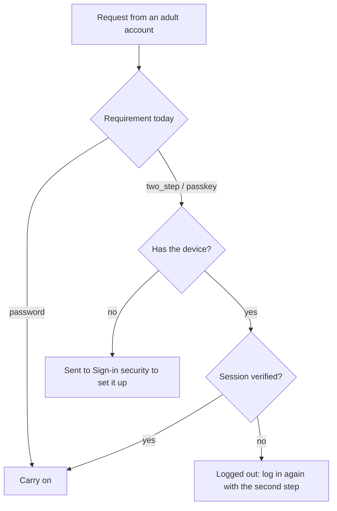
```mermaid
flowchart TD
    R[Request from an adult account] --> L{Requirement today}
    L -->|password| OK[Carry on]
    L -->|two_step / passkey| D{Has the device?}
    D -->|no| S[Sent to Sign-in security to set it up]
    D -->|yes| V{Session verified?}
    V -->|yes| OK
    V -->|no| O[Logged out: log in again with the second step]
```

- **Guidance**: `accounts.middleware.SignInRequirementMiddleware` (after
  `OTPMiddleware` and the messages middleware). Only the login, logout,
  change-password, language, JavaScript-catalog and Sign-in security pages
  stay open; htmx requests get an `HX-Redirect`.
- **The lock**: what the roles open refuses a request that doesn't meet it,
  middleware or not: `dojos.access.require_dojo_access` and
  `accounts.organisation.require_area` (404; `require_organisation_admin` until §23),
  `pages.admin_site.AdminSite.has_permission` (the Django admin; `admin.site`
  is ours through `pages.admin_apps.AdminConfig`), and the notification
  WebSocket (`NotificationConsumer.connect`, which reads the session's
  device itself: `OTPMiddleware` doesn't run in Channels).
- The person can't turn two-step login off, or remove their last (passkey)
  method, while their role requires it.

### Seed data and tests

- `manage.py seed_two_step` (fresh databases, from `start.sh`) turns on an
  authenticator app plus backup codes for one seeded organisation admin,
  champion, mentor and parent. `seed_credentials.csv` has a `totp_secret`
  column with the app key (base32, to add to an authenticator app), and
  `manage.py totp_code <username>` (DEBUG only) prints the current code.
  In the devcontainer, testers read the codes at
  `https://coolregistration.localhost/otp/`: 2FAuth (the `otp` service),
  filled from the data by `manage.py seed_otp_vault` (end of `start.sh`;
  every account with an app, synced, only its own entries).
- Tests: `core.testing.login_data` / `token_data` post the login's steps,
  `login_verified(client, user)` logs in with a verified session (giving
  the account an app), `totp_code(device)` gives the current code. Passkey
  tests mock the signature check (`verify_registration_response` /
  `verify_authentication_response`), everything around it is real.
- Privacy: the devices are classified in `privacy/privacy.py` (the secrets
  `security`, never exported; which methods and when they were used are in
  the export), retention `sign_in_methods`. Audit log: device rows and the
  policy are recorded (not the fields every login updates); backup codes
  are not.

### Open points

- **When to require it**, and for which roles: the policy is ready; the
  organisation sets it on `/manage/security/`, ideally with a
  *Required from* a few weeks out.
- **Passwordless login** with a passkey (no password at all) isn't built:
  the passkey is always the second step. Logging in with an emailed link instead of a
  password is planned in [§24](#24-logging-in-with-an-emailed-link-built).
- **Forget every remembered browser** without changing the password isn't
  possible with the package's cookie; changing the password does it.
- TOTP secrets are stored unencrypted in the database, as django-otp does.
- **Social login** (Facebook, Google, ...): out, for now.

## 16. GDPR: classifying personal data, export, erasure and retention (in progress)

Every field of every model is classified in `core.privacy_registry`; a
person's data export, erasure on request, and the daily retention job all
read only that registry, never a bespoke per-model rule. Full design, the
retention-periods table, phases and open points — together with §27,
multiple guardians per child — are in `DATA_MODEL_PRIVACY.md`.

## 17. Child accounts, managed by the guardian (built)

**Built.** A guardian gives a ninja their own login from the child's page
(the **Own login** card, `accounts/partials/_ninja_login_card.html`) and can
take it away again. All of it lives in `accounts/child_accounts.py`
(`give_login`, `resend_login_mail`, `remove_login`; `ChildAccountError`
carries the message for the guardian); the views
(`ninja_login_create` / `_resend` / `_remove`) only call it, guardians only
(`_get_own_ninja`, 404 for anyone else, including the child's own login).

- **Creating:** the child's own email is required and must not be used by
  another account. It creates a `User` of type `ninja` (username from
  `unique_username`, the guardian's mail language) with **no usable
  password**, links it as `Ninja.account`, and queues the
  `ninja_account_created` service mail with a set-password link (Django's
  password-reset confirm page, built on `SITE_URL`), or, when the guardian
  chose a login link (§24), the child's first login link. No temporary
  password is ever mailed. "Send the password mail again" is there as long as no
  password has been chosen (the normal "Forgot password" skips accounts
  without a usable password).
- **Deletion — decided:** removing a login **deletes** the account, unless
  it ever had a dojo membership (a youth mentor): then it's **disabled**
  (`is_active=False`, password made unusable) and every membership that
  isn't dormant yet goes dormant through `dojos.team.leave`, because
  `Event.team` points at memberships and a delete would cascade them away.
  A disabled login can't log in (`ModelBackend.user_can_authenticate`) and
  gets no mail (`suppressed_reason`). "Switch login back on" is `give_login`
  on that same account: re-enabled with the (possibly new) email and a fresh
  set-password mail. The ninja itself (registrations, belts, badges) is
  never touched.
- **Changing — decided:** the guardian **keeps editing** the child's details
  when the child has a login; the child's own login stays view-only for its
  profile.
- **Signing up:** a ninja's own login signs itself up for sessions
  (`Ninja.objects.signable_by(user)`: an adult's children, or the ninja
  itself), sees its upcoming sessions on its own page and can cancel its own
  places (`cancel_registration`). Booking mail still goes to the whole
  family (`mailing.automated.family_of`).

The original request, kept for reference:

> enable the guardian account to manage the accounts for childs. Add a create button on the manage screen, email address is required than and allow the sending of the initial account creation mail. Allow the parent to remove the account again. **Decide `deletion`** if a child account has the helper role the account needs to be disabled not deleted and the role assigments must end. Recreating an account is then a password reset and reenablement of the user account. User accounts need to be able to be disabled. With the creation of a child account the Child gains the capability to register for sessions on his own. Guardian account can still review **Decide `changing`** does the editing capabilty still remain or is it switched to read-only if a child account is present.

## 18. Home dojo, the Members page and the session team's attendance (built)

**Built.**

- **Home dojo — hybrid (decided).** `Ninja.home_dojo` is the dojo the family
  belongs to; `member_since` is when the child got it. Rules in
  `accounts/home_dojo.py`: a child without one gets it at their **first
  sign-up**, from that session's dojo (`assign_on_signup`, in
  `event_signup`); an organisation dojo never becomes a home dojo. After
  that nothing moves it automatically: the **guardian** changes or clears it
  on the child's edit form (`set_home_dojo`, public dojos only; a change
  restarts `member_since`). The dojo team only reads it. `manage.py
  assign_home_dojos` (`backfill`) gives children without one their most
  attended dojo, for data from before this rule.
- **Members page** (`/dojos/<id>/manage/members/`, `dojo_members`, any team
  role): the children whose home dojo it is, with age, belt, engagement
  stage, sessions, last visit, member since, own login and youth mentor
  role, and a **Promote** button (MANAGE_TEAM, posted to
  `dojo_team_action` with `next`). Visiting children aren't listed there
  **(decided)**: they're labelled **Visiting** on the attendance list.
- **Youth mentor promotion — inform only (decided).** Promotion stays on
  `dojos.team.promote_youth_mentor`; it now refuses a switched-off login
  (§17) and queues `youth_mentor_promoted` (service mail) to the family
  (`mailing.automated.youth_mentor_promoted_mail`: guardians plus the
  child's own login). No approval step. The role shows on the child's page
  and family card (`Ninja.youth_mentor_memberships`).
- **The session team's attendance (insurance).** Everyone on `Event.team`
  (champion, mentors, youth mentors) is listed under the children on the
  attendance list and marked present/absent the same way:
  `events.TeamAttendance` (event, membership, tri-state `attended`,
  `marked_by`, unique per event+membership; no row = not marked),
  `dojo_event_team_attendance_mark`; **Mark all present** includes the
  team. Only memberships on that session's team can be marked.

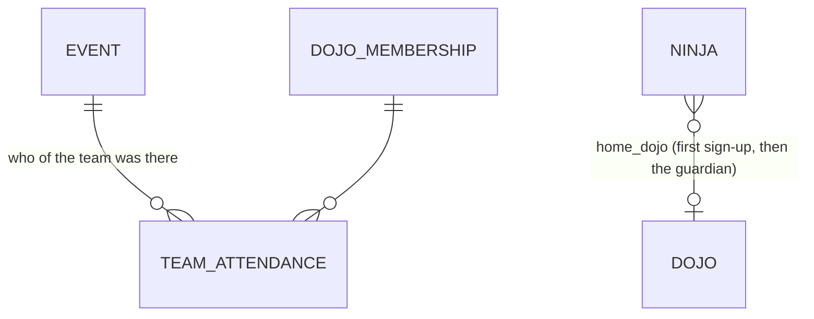
```mermaid
erDiagram
    EVENT ||--o{ TEAM_ATTENDANCE : "who of the team was there"
    DOJO_MEMBERSHIP ||--o{ TEAM_ATTENDANCE : ""
    NINJA }o--o| DOJO : "home_dojo (first sign-up, then the guardian)"
```

## 19. A dojo's languages, and its texts in them (built)

**Built.** Decisions: a dojo decides the languages it supports; **one setting
means both** the languages its sessions are given in and the languages its
texts are written in; a visitor whose language the dojo doesn't write in
sees the **main language**, with an "Only in ..." note.

- **`Dojo.languages`**: an ordered list of `LANGUAGES` codes, the first is the
  **main language** (Settings page: **Languages** + **Main language**; the
  main one is always included and first). A new dojo starts in its
  champion's language; existing and seeded dojos start from their region
  (`dojos/languages.py`: Walloon provinces French, Flemish Dutch, Brussels
  both, otherwise Dutch; the data migration `dojos/0004` did the same).
  The organisation dojo has all three.
- **Translatable texts** (`core/content_languages.py`, `TranslatableModel`):
  `Dojo` (tagline, description, schedule_description, visit_notes), `Event`
  (name, description; in its dojo's languages) and `content.Announcement`
  (text). The normal columns hold the main language; the others live in a
  `translations` JSON field (`{"fr-be": {"description": "..."}}`).
  `obj.localized(field, language=None)` returns the page's (or given)
  language when written, else the main-language text as a `LocalizedText`
  with `is_fallback`. Templates: ``,
  `{{ dojo|localized:"description" }}`, ``,
  `{{ codes|language_names }}`.
- **Editing:** each form gets an optional section per other language (**In
  <language>**, `dojos/partials/_translation_fields.html`) from
  `add_translation_fields` / `save_translation_fields`; a newly added
  language gets its section once saved. Removing a language keeps its
  texts (they come back if it's added again).
- **Families:** the dojo page says "Sessions in ...", a session page has a
  **Language** row, and the dojo finder and events list filter on language
  (`languages__contains`). Mails use the session's name in the recipient's
  mail language (`mailing.automated`).
- **The organisation's content** works the same way, in
  `settings.ORGANISATION_LANGUAGES` (English first, then Dutch and French):
  `OrganisationContent` models are `Pathway`, `PathwayStep`,
  `PathwayProject`, `Skill`, `Belt`, `Badge`, `OrganisationTeamMember` and
  `Promotion`; `FAQ` and `Testimonial` are `ScopedContent` (the dojo's
  languages when scoped to a dojo or its session, else the organisation's).
  They're edited in the Django admin (`core.admin_translations.
  TranslationAdminMixin`: a collapsible "In <language>" fieldset per extra
  language; the raw `translations` JSON stays editable too, and the
  per-language fields are applied after it), promotions also on the
  Promotions dashboard page. An untranslated FAQ answer shows its note
  ("Only in English"); names and titles don't.
- **Seed data** (`manage.py seed_content_languages`, run by `start.sh` after
  the seeders): dojo languages by region (Wallonia French or French and
  English; Brussels and within 15 km of it all three; Flanders mostly Dutch,
  some Dutch and English, a few Dutch and French), each dojo's seeded texts
  in its main language with versions in its others, and the organisation's
  content in all three (`pages/seed_translations.py`). The organisation dojo
  is English-main, like the rest of the organisation's content.

## 20. One management area for the organisation and its dojos (built)

**Built** (all five phases, as planned below; the optional note for
organisation admins without an organisation dojo is on the Promotions
page). Before, the organisation dashboard (`/manage/…`,
`core/_manage_base.html`) and a dojo's admin area (`/dojos/<id>/…`,
`dojos/_admin_base.html`) were two copies of the same sidebar shell with
different menus, reached through two nav links (*Organisation* and
*Manage*). Preparing the organisation's own events (on an organisation dojo,
§12) and promoting them meant switching between the two. They became one
management area: one entry point, one sidebar, and a switcher between the
contexts you can manage.

### Decisions

- **Navigation merges, access doesn't (decided).** The organisation `admin`
  role still opens the organisation's pages; a dojo, an organisation dojo
  included, still needs an active champion/mentor membership and a valid
  background check (`dojos.access`, §12). The merge grants nobody anything
  new.
- **No background check, no dojos (decided).** Not everyone in the
  organisation needs a background check. Without one, an organisation
  member sees only the **Organisation** context: no dojos at all, also not
  the organisation dojo, and a dojo's URL is a 404 (`accessible_dojos` and
  `managing_membership` already return nothing without a valid check). With
  a check and a place on the organisation dojo's team it shows up; when the
  check lapses it disappears again by itself. Promoting an event needs no
  check: the Promotions page shows no children's data.
- **Promoting stays an organisation action (decided).** Only the
  organisation `admin` role creates promotions; dojo teams don't promote
  their own sessions for now (the model would allow it later).
- **URLs stay where they are.** Dojo pages keep `/dojos/<id>/…`: stored
  notification links and mails point there, and moving them changes nothing
  anyone sees. Possible later, with permanent redirects.
- **The board role** keeps the Django admin for its read-only oversight;
  dashboard pages for it are separate work.

### Contexts

`manage_contexts(user)` (`accounts/manage_nav.py`) builds the
switcher from the existing access helpers, in three groups:

| Group | Shown when | Source |
|---|---|---|
| **Organisation** | the account holds the organisation `admin` role | `accounts.organisation.is_organisation_admin` |
| **Organisation events** | active champion/mentor membership + valid check on an organisation dojo | `accessible_dojos(user)` with `kind=organisation` |
| **Your dojos** | the same, on a regular dojo | `accessible_dojos(user)` with `kind=dojo` |

Someone with one context sees no switcher, as today. The notification bell
(and its WebSocket) stays in dojo contexts only: the consumer works per dojo.

### Phases

1. **One shared shell, no visible change.** `core/_manage_shell.html` holds
   the head, the sidebar frame, the top bar, messages and the sign-in
   notice; `core/_manage_base.html` and `dojos/_admin_base.html` extend it
   and only fill in their sidebar menus. Their block names (`manage_*`,
   `admin_*`) stay, so the page templates don't change.
2. **The context switcher.** `manage_contexts(user)` feeds one switcher in
   both bases (replacing the dojo-only one). Picking a dojo goes to its
   dashboard, picking Organisation to `/manage/`. The footer's role label
   follows the context.
3. **One entry point.** `manage_home` (`/manage/`, now `pages/manage.py`) becomes the landing: the
   organisation for an organisation admin, else the first accessible dojo,
   else a 404. The nav gets one *Manage* link instead of *Manage* and
   *Organisation*, and the post-login redirect
   (`accounts.views._post_login_redirect`) follows the same rule.
4. **Organisation events and promotions together.** The Organisation
   context gets an *Organisation events* group linking to each organisation
   dojo's Events page the account can open. An event's detail page gets a
   **Promotions** card for organisation admins: the event's current and
   planned promotions and **Promote this event**
   (`manage_promotion_create?event=<id>`, event prefilled). The Promotions
   list links each promotion to its event's admin page when the account can
   open it. Optionally, the Organisation context notes how to get access to
   organisation events (a background check and a place on the team) when
   the account has none.
5. **Finishing.** Tests: who sees which context (a mentor never sees
   Organisation; an organisation admin without a check or membership never
   sees a dojo), where `/manage/` sends each role, the Promotions card's
   visibility and the prefilled event. Dutch and French for the new texts,
   CLAUDE.md, and the help docs (en/fr/nl) where they describe the *Manage*
   link.

## 21. Background checks and applications on the organisation dashboard (built)

**Built** (all five phases, as planned below; the code is in
`applications/manage.py`, `applications/reminders.py` and
`accounts.organisation`). Before, reviewing background checks and deciding applications (§6) was
Django-admin only: the review permission
(`applications.can_review_background_checks`) was granted to each person by
hand, neither organisation role could decide an application (both only view
them), so in practice only a superuser could, and nobody was told when a
document arrived. This moves that work to the organisation dashboard. The
flow itself (§6) doesn't change: `applications.services` still decides, and
the document is still deleted the moment a decision is made.

### Decisions

- **A third organisation role, `reviewer` (decided).** Granted and revoked
  like `board` and `admin` (and combinable with them); its permission group
  holds the review permission, deciding applications (`change`
  application) and the background-check pages in the Django admin. A
  permission granted by hand before keeps working (`is_reviewer` asks
  `has_perm`). The sign-in policy's "Background-check reviewers" row
  already applies to it; asking reviewers for two-step login is a later
  policy setting, not part of this.
- **Reviewers decide applications (decided)**, since approving depends on
  the background check they review. Organisation admins don't, unless they
  also hold the reviewer role.
- **Nobody reviews their own check or decides their own application**
  (`applications.services`, a new rule).
- **No renewal before expiry; a reminder instead (decided).** A daily job
  mails the account holder 30 days before their check expires (service
  mail, once per expiry date), so they can request a new extract in time.
  The rule that a renewal can only be uploaded once the check has lapsed
  stays.
- **Access like the rest of the dashboard.** `require_reviewer(request)`
  (`accounts.organisation`; since §23 `require_area(request, Area.VOLUNTEERS)`): a 404 without the role, or below the sign-in
  policy. It also guards the document download, which now also tells the
  browser not to keep a copy (`Cache-Control: no-store`). The Organisation
  context (§20) opens for a reviewer who isn't an organisation admin too,
  but each sidebar group shows only what the account may open: a reviewer
  sees *Volunteers*, an admin the rest. `/manage/` sends each to the first
  page they can open.

### Screens (a *Volunteers* group in the organisation sidebar)

1. **Background checks** (`/manage/checks/`): a work queue. *Awaiting
   review* (uploaded, oldest first, counted on the sidebar link),
   *Waiting for a document* (requested or rejected, with "Send the link
   again"), *Expired* (with "Ask for a new one") and *Expiring within 30
   days* (the reminder goes by itself). Search by name or email.
2. **One person's check** (`/manage/checks/<id>/`): what they applied for,
   the earlier decisions, **Download the document** (recorded in the audit
   log), **Validate** or **Reject** with an optional note (its help text:
   never copy anything from the extract), saying the document is deleted
   with the decision. The page itself is recorded as a view in the audit
   log (criminal-record data, §14).
3. **Applications** (`/manage/applications/`): pending first, filter by
   kind and status, each with the account's check status. A detail page
   with the application's fields and the next step: ask for the background
   check, **Approve** (only with a valid check) or **Reject**.

Everything keeps its full Django admin page.

### Phases

1. **Access:** the `reviewer` role (and its group), `is_reviewer` /
   `require_reviewer`, the self-review rule, the download's access and
   `no-store`, and the Organisation context for reviewers.
2. **Background checks** pages.
3. **Applications** pages.
4. **Attention and reminders:** counts on the sidebar links, a daily mail to
   reviewers while documents wait for review, and the expiry reminder to
   the account holder (`applications/tasks.py`, two mail templates in
   en/nl/fr).
5. **Finishing:** tests, Dutch and French, the help docs (a new
   organisation page, the volunteer pages on the reminder), CLAUDE.md and §6.

## 22. Changing an account's email address (built)

**Built** (all five phases, as planned below; the code is in
`accounts/email_change.py`, `accounts.views.change_email` /
`confirm_email_change` and `privacy.views.manage_privacy_email`). The
account page's details (`accounts.views.edit_account`)
edit the name, phone and postcode in place; the email address is shown
read-only there. It can't simply be another field: it's a login name
(`accounts.backends.EmailOrUsernameBackend`), where every mail goes
(`mailing.services.send` reads `user.email`), and a mistyped address would
lock the family out of password resets. So changing it is its own flow,
confirmed from the new address.

### What the code does today, and what that means

- `User.email` has **no unique constraint** in the database (Django's
  `AbstractUser`); family sign-up and a child's login check it
  case-insensitively in their forms. The change has to check it too, both
  when it's asked for and again when it's confirmed.
- A queued mail keeps the address it was queued with
  (`EmailMessage.recipient`, "the address used, as it was at the time"). So
  a notice queued *before* the address changes still goes to the old one,
  and mail already in the queue isn't redirected.
- `send()` always mails `user.email`. The confirmation has to go to the
  *new* address before it's the account's, which `send()` can't do yet.
- Django's password-reset links include the email in their hash, so every
  reset link that's still open stops working once the address changes
  (wanted).
- A passkey's user name is the email (`accounts/webauthn_entities.py`);
  existing passkeys keep showing the old one in the authenticator, and
  still work.
- `EmailSuppression` blocks an address whatever the account: a new address
  that bounced before can't receive the confirmation.

### Decisions

- **Confirmed from the new address.** The account holder asks for the
  change with their **current password** (`accounts.forms.ConfirmPasswordForm`, since §24 `ConfirmIdentityForm`
  already exists) and the new address; we mail a link there; the address
  only changes when that link is used. Nothing changes until then.
- **No new model: a signed link.** `django.core.signing` of account id, new
  address, who started it and a fingerprint (a salted HMAC) of the
  *current* address, so the link, which ends up in server logs, doesn't
  show it (salt `accounts.email_change`, valid `VALID_HOURS` = 24).
  The fingerprint makes the link single-use: once the address has changed,
  it no longer matches.
  No row with a pending address means nothing new to classify for privacy
  (§16), keep or erase.
- **The family's own link needs the same account logged in.** Opening it
  logged out goes through `/login/` (the old address or the username still
  work); another account gets a 404. (A link the organisation started
  doesn't, see below.) That proves both the account and the new mailbox.
  **GET shows a confirmation page, POST changes it**, so a mail scanner that
  follows links can't do it (same as the unsubscribe page).
- **The old address is told.** When the change is made, an
  `email_changed` service mail is queued to the old address (queued before
  saving, so it keeps that address): what changed, when, and to contact us
  if it wasn't them. The new address gets the confirmation link
  (`email_change_confirm`). No mail when the change is only asked for.
- **Service mail to another address:** `send()` gets an optional
  `address=` for `service` mail only, used as the recipient and checked
  against `EmailSuppression` like any other; everything else still goes to
  `user.email`.
- **Throttled:** one request per account per minute through the cache (as
  the data export), so the form can't be used to send mail to arbitrary
  addresses in bulk.
- **The organisation can start it too (decided).** For a family that
  lost access to its old mailbox, an organisation admin opens the account
  on *Accounts → Privacy* (`/manage/privacy/`) and uses **Change email
  address** (`/manage/privacy/<id>/email/`, `require_organisation_admin`; since §23 `require_area(request, Area.PRIVACY)`),
  after checking who they're dealing with by other means. The same link
  goes to the new address and the same notice to the old one. Their link
  carries who started it and **can be confirmed without logging in**: the
  family may not be able to log in any more (a password reset goes to the
  old mailbox). After confirming, that page offers a password reset to the
  new address. The audit log's actor for that change is the admin who
  started it (`auditlog.context.set_actor`), since nobody is logged in.
  Not for a ninja's own login, a superuser or an organisation-role holder
  (the Django admin, as for deletion).
- **Other sessions end (decided).** Changing the address logs the account
  out everywhere else, as a password change does: `User.get_session_auth_hash`
  also covers the email, so every session made with the old address stops
  being valid, and the confirming session is kept with
  `update_session_auth_hash`. That also holds when someone changes an
  address in the Django admin.
- **Out of scope:** a child's own login's address (planned in §24: the
  guardian changes it from the *Own login* card through this same
  service), and changing the username.

### Screens

1. The details form's email line gets a **Change email address** link to
   `/account/email/` (`change_email`, a full page like the password change:
   the new address, the current password, what happens next). Posting
   shows "Check your inbox at *new address*", and the account page keeps
   showing the current address.
2. `/account/email/confirm/<token>/` (`confirm_email_change`): "Change your
   email address from *old* to *new*?" with one button; afterwards the
   account page with "Your email address is now *new*" (logged out: a page
   saying so, with *Set a new password*, which sends the reset to the new
   address). An expired or used link says so and links to step 1.
3. The organisation's **Change email address** on an account in *Accounts →
   Privacy*: the current address, the new one, a reminder to check who's
   asking; afterwards "A confirmation link was sent to *new*".

### Phases

1. **Mail engine:** `send(..., address=)` for service mail, the two
   templates (`email_change_confirm`, `email_changed`) in en/nl/fr in
   `mailing/seed_templates.py` with their sample context and in
   `SYSTEM_TEMPLATE_KEYS` (production gets them through
   `load_mail_templates` at deploy).
2. **Service:** `accounts/email_change.py` (`request_change(user, new,
   started_by=None)`, `read_token`, `confirm_change`; `EmailChangeError`
   with a user-facing message): the uniqueness check (case-insensitive, at
   both steps), the suppression check, the throttle, the notice to the old
   address and the save (through `save()`, so the audit log has it); the
   email in `User.get_session_auth_hash`.
3. **Family pages:** the two views and templates, the link on the details
   form, tests (password required, taken address, suppressed address, link
   for another account, expired and reused link, the notice's recipient,
   the old reset link failing, other sessions logged out and this one kept,
   the audit entry).
4. **Organisation page:** *Change email address* on *Accounts → Privacy*,
   the logged-out confirmation with the password-reset offer, tests (404
   without the admin role, not for organisation roles, superusers or
   ninja logins, the audit actor).
5. **Finishing:** Dutch and French, the help docs (*Managing your account*,
   *Your own details*; the organisation's *Privacy* page), CLAUDE.md.

### Open points

None yet.

## 23. Organisation people, roles and page access on the dashboard (built)

**Built: phases 1–4 and 6**, as planned below. Phase 5 (read-only pages
for the board) is dropped for now (decided, 2026-09-29): the board doesn't
need dashboard access; it asks for the Django admin like every role. The code: areas in `accounts.organisation`
(`Area`, `AREA_PERMISSIONS`, `require_area`), time-boxed Django admin
access in `accounts/admin_access.py` (`AdminAccessGrant`, the page
`/manage/django-admin/`, `pages.admin_site.AdminSite`, the beat job
`accounts.tasks.close_admin_access`), the People pages in
`accounts/people.py` with the rules in `accounts/organisation_people.py`,
invitations in `accounts/invitations.py` (`OrganisationInvitation`,
`mailing.services.send_to_address`), and the organisation dashboard's
notification bell (`Notification.organisation`,
`notifications.consumers.OrganisationNotificationConsumer`). Help pages:
`docs/source/organisation/people.rst` and `django-admin.rst`. Where the
build differs from the plan text: the Django admin's header shows the end
time through the admin site's `site_header` (the admin's own templates
can't be overridden from `core`), and *End now* is on the dashboard; the
invitation mail goes through a new `send_to_address` (no account yet)
rather than `send(..., address=)`; the dashboard's sidebar group is
*Organisation* (*People*, *Django admin*).

Before this, an organisation role
(`accounts.OrganisationRole`: `board`, `admin`, `reviewer`) can only be
granted or revoked in the Django admin, by someone who may edit that
model there (in practice a superuser: no role's group holds
`accounts.organisationrole`). Someone who has no account yet has to sign
up as a family first and then be found in the admin. Every role also makes
the account staff for good, so it opens the Django admin at any time. And
which management page each role opens is spread over the views as
`require_organisation_admin` / `require_reviewer` calls, and repeated in
the sidebar (`core/_manage_base.html`) and the switcher
(`accounts.manage_nav`). This plan:

- moves granting roles to the organisation dashboard;
- adds inviting someone new;
- gives every management page one declared access rule;
- makes the Django admin something an organisation member asks for, for
  12 hours at a time, with each request and its end in the audit log;
- keeps superusers to a few named people for emergencies.

### What the code does today, and what that means

- **Roles are code, not data.** `accounts.organisation.ROLE_PERMISSIONS`
  maps each role to a permission group, and `ensure_groups()` resets each
  group to exactly that on every grant or revoke. Anything edited on a
  group in the admin is silently undone the next time a role changes.
- **Page access is two yes/no questions**: "is organisation admin" (every
  page except *Volunteers*) and "is reviewer" (`has_perm` on
  `applications.can_review_background_checks`, so a superuser or a
  permission granted by hand counts too). `is_organisation_admin` asks for
  the role row, so a superuser without the role doesn't get the dashboard.
- **The Django admin's door is `is_staff`.** `sync_organisation_access`
  sets it whenever an account holds any role, and `pages.admin_site.AdminSite.has_permission`
  only adds the sign-in policy on top. Nothing ends that access except
  taking the role away. (django-silk's `/silk/`, development only, also
  lets in staff.)
- **Every account is created by its own holder** (CLAUDE.md, "Account
  model"): no admin-provisioned logins, no temporary passwords. Creating
  an organisation user has to keep that.
- **Granting a role already does the right things**: the signals in
  `accounts.organisation` set the groups, `OrganisationRole` is recorded
  in the audit log (`core.audit.RECORDED`), the sign-in policy (§15)
  applies per role, and deletion and retention (§16) already leave
  organisation-role holders alone.
- **The board role has no dashboard pages**; its only way in is the
  *Organisation* link to the Django admin (`core/menu.html`).

### Decisions

- **The three roles stay fixed in code (decided).** The dashboard grants
  and revokes `board`, `admin` and `reviewer`; it doesn't create roles or
  change what a role opens. A *Roles* page shows what each role opens,
  read-only, from `ROLE_PERMISSIONS`.
- **Any organisation admin may grant any role, `admin` included
  (decided, as a start).** No second admin has to confirm.
- **Page access by area, declared once.** Each group of the organisation
  sidebar becomes an *area*, a custom permission on `OrganisationRole`
  (`Meta.permissions`, e.g. `accounts.manage_communication`):

  | Area | Pages | Roles |
  |---|---|---|
  | `communication` | Campaigns, Journeys, Segments, Mail templates | admin |
  | `public_site` | Promotions, Sponsors | admin |
  | `ninjas` | Awards | admin |
  | `privacy` | Privacy (export, delete, change email) | admin |
  | `security` | Sign-in security | admin |
  | `people` | People and roles (new, below) | admin |
  | `volunteers` | Background checks, Applications | reviewer |
  | *technical access* | asking for the Django admin (below) | every role |

  The areas go into the role groups through `ROLE_PERMISSIONS` like any
  other permission. One helper replaces the two:
  `require_area(request, area)` (404 without the permission or below the
  sign-in policy, same no-leak reasoning as now), and `manage_contexts`
  gets the set of areas the account may open, which drives both the
  sidebar groups and `/manage/`'s landing. `require_organisation_admin`
  and `require_reviewer` are gone (every view moved at once). It's `has_perm`, so a permission granted by hand keeps working,
  as `is_reviewer` already does.
- **The Django admin is time-boxed: asked for, 12 hours, then closed
  (decided).** A role no longer makes an account staff. An organisation
  member (any of the three roles) asks for *technical access* on the
  dashboard: a reason (required, e.g. "fix a registration for the Gent
  dojo") and their password again (`accounts.forms.ConfirmPasswordForm`),
  meeting the sign-in policy like any area. That creates an
  `accounts.AdminAccessGrant` (account, reason, `started_at`,
  `expires_at` = start + `ADMIN_ACCESS_HOURS` = 12, `ended_at`,
  `ended_by`, `end_reason`: `expired` / `ended` / `revoked` /
  `role_removed`) and sets `is_staff`. Inside the admin they have exactly
  their role's permissions, as today; asking changes nothing about
  *what* they may do, only *when*.
  Only the Django admin (`/admin/`) is time-boxed: the organisation
  dashboard (`/manage/…`) stays open to a role holder all the time, as
  today.
  - **Closing is enforced twice.** `AdminSite.has_permission` also asks
    for an open grant (`started_at <= now < expires_at`, not ended) for
    everyone but a superuser, so access stops at the minute even if a job
    runs late. A beat job, `accounts.tasks.close_admin_access` (every 5
    minutes, `periodic` queue, short), ends expired grants through `save()`
    (`end_reason=expired`) and clears `is_staff` when no open grant is
    left. `sync_organisation_access` stops setting `is_staff` from roles.
  - **One open grant at a time, no extending.** Asking again once it has
    ended starts a new grant, with a new reason. The person can end it
    early (*End technical access*, `ended`); an admin can end someone
    else's from the People page (`revoked`); losing the last role ends it
    too (`role_removed`).
  - **Seen while it's open.** The Django admin's header shows "Technical
    access until 21:40 · End now", and the dashboard's People page lists
    every open grant with its reason.
  - **No second person approves (decided).** The reason, the password
    and the audit log are the safeguard.
  - **The other organisation admins get a notification (decided)** when
    someone opens technical access: "*Name* opened technical access to the
    Django admin until 21:40: *reason*", linking to the People page (one
    row per admin, through `notifications.services.notify`, in each
    recipient's language; not to the requester). No mail. The
    organisation dashboard has no notification bell yet (it's per dojo,
    §8, §20), so this adds one: a new `Notification.organisation` flag
    (a plain `dojo=None` isn't enough, since personal notices such as
    "You've been added to the … team" are stored without a dojo too),
    the bell in `core/_manage_base.html` showing the account's
    organisation notifications, and a second consumer
    (`ws/manage/notifications/`, organisation roles only, closing the
    socket otherwise) so it updates live like a dojo's bell. The flag is
    classified `not_personal` (§16).
  - **The board** reaches its read-only oversight the same way: its
    *Organisation* link in the menu goes to the request page instead of
    straight to `/admin/`.
- **In the audit log (decided).** `AdminAccessGrant` is recorded
  (`core.audit.RECORDED`): the request (actor = the person, with the
  reason and the window) and its end (actor = whoever ended it, empty for
  the expiry job, with `end_reason`). What they change in the admin during
  the window is already recorded with them as actor, so the log shows the
  window and what happened in it. The grant rows themselves are the
  readable list ("who had technical access when, and why"), shown on the
  People page and each person's page. Privacy (§16): `keep(security,
  reason)` for the reason and times, `subjects` `{Subject.ACCOUNT:
  "account"}`, `ended_by` `export=False`, kept for
  `AUDIT_LOG_RETENTION_DAYS` like the audit log and removed with the
  account's entries when it's erased.
- **Superusers stay few and outside the dashboard (decided: keep them
  very limited).** A superuser is only made on the server
  (`createsuperuser`), never from the dashboard and never by a role: they
  are the emergency key, for when the dashboard or a role is broken. They
  don't count as organisation admins (for the "last admin" rule below,
  and `is_organisation_admin` stays a role check), the People page lists
  them read-only so the organisation sees who holds one, and the sign-in
  policy's *Superusers* row should be set to the strongest level.
  **Not time-boxed (decided):** being a superuser is itself a technical
  intervention on the server, so they keep the Django admin without asking
  and `AdminSite.has_permission` lets them in as today.
- **Who manages people: the `people` area, i.e. organisation admins.**
  Rules, in a service `accounts/organisation_people.py` (views only call
  it; `OrganisationPeopleError` carries a user-facing message), like
  `dojos/team.py`:
  - nobody changes their own roles (as nobody reviews their own check,
    §21);
  - there is always at least one account with the `admin` role: revoking
    the last one is refused;
  - only adult accounts, never ninja logins or service accounts (the model
    already checks this in `clean()`; the service calls it);
  - the dashboard never touches `is_superuser` or groups directly; the
    signals keep doing that, and `is_staff` follows the grants.
- **Granting to an existing account:** find it by name or email (the
  search `/manage/privacy/` already has, shared), tick roles, save. The
  person gets a service mail (`organisation_role_changed`: which roles
  they now hold, where to find the dashboard, and what the sign-in policy
  asks of them). The audit log records the change with the admin as
  actor.
- **Inviting someone without an account: an invitation, not a created
  login.** An admin enters an email address, a name (to recognise the
  invitation by) and the roles. We store an `accounts.OrganisationInvitation`
  (email, name, roles, invited_by, created_at, expires_at, accepted_at,
  accepted_by, withdrawn_at, a hashed token) and mail a link
  (`organisation_invitation`, service mail through `send(..., address=)`,
  §22). The link leads to sign-up (email prefilled, not editable) or to
  login when an account with that address exists; the roles are granted
  when the invitation is **accepted by an account with that same email
  address** (case-insensitive), so a forwarded link grants nothing. The
  person creates their own account and password, so "every account is
  created by its own holder" still holds. Valid 14 days, single use,
  withdrawable; an address that already has an account gets the
  "existing account" flow instead. Throttled like the email change (one
  invitation per admin per minute) so it can't be used to mail arbitrary
  addresses in bulk.
- **Sign-up for an invited person is lighter than a family's**: no child
  rows (they can add children later from the account page). A variant of
  `RegisterGuardianForm` without the children formset, reached only
  through a valid invitation.
- **Revoking a role** takes effect on the next request (every page checks
  per request, and an open technical-access grant ends with the last
  role); the person gets the same `organisation_role_changed` mail. It
  doesn't delete the account, which stays a normal adult account.
- **Privacy for invitations (§16):** email and name `personal`,
  `invited_by` `export=False`, `subjects` `{Subject.EMAIL: "email"}`, and
  a retention rule: accepted, expired or withdrawn invitations are deleted
  after 30 days by the daily retention job. Recorded in the audit log
  (token excluded).

### Screens

In the organisation sidebar, an *Organisation* group (`people` area) and
a *Technical access* link for every role.

1. **People** (`/manage/people/`): everyone holding an organisation role,
   with their roles, when granted, and whether their sign-in meets the
   policy (a warning when a role asks for two-step login and they haven't
   set it up; links to *Sign-in security*). Then open technical-access
   grants (who, why, until when, *End*), pending invitations (*Send
   again*, *Withdraw*) and the superusers (read-only). *Add a person* at
   the top.
2. **Add a person** (`/manage/people/add/`): search an existing account,
   or "Invite by email" when there's none; the role checkboxes each say
   what the role opens (from the table) and, for `reviewer`, that it
   reads criminal-record extracts.
3. **One person** (`/manage/people/<id>/`): their roles as checkboxes
   (disabled for your own account, with the reason), save; their role
   changes and technical-access grants with reasons.
4. **Roles** (`/manage/people/roles/`): the area × role table, read-only.
5. **Technical access** (`/manage/django-admin/`, every role): when
   closed, the reason and password form and what it opens ("the Django
   admin, with your role's permissions, for 12 hours; recorded in the
   audit log"); when open, the time left, *Open the Django admin* and *End
   technical access* (`/manage/django-admin/end/`); your earlier grants below.
6. **Accepting an invitation** (`/invitation/<token>/`, public): who
   invited you to which roles, then *Create an account* or *Log in*;
   afterwards `/manage/`. An expired, used or withdrawn link says so.

Everything keeps its full Django admin page (`OrganisationRoleAdmin`, and
`OrganisationInvitationAdmin` and `AdminAccessGrantAdmin`, whose
docstrings say an edit there skips the rules above).

### Phases

1. **Areas:** the custom permissions (migration), the areas in
   `ROLE_PERMISSIONS`, `require_area`, every organisation view moved to it,
   `manage_contexts` and the sidebar driven by the area set, `/manage/`'s
   landing. No visible change for today's admins and reviewers; tests that
   each page 404s without its area.
2. **Time-boxed technical access:** `AdminAccessGrant` (privacy
   classification, audit registration, admin), the request page, the
   check in `AdminSite.has_permission`, `sync_organisation_access` no
   longer setting `is_staff`, the beat job, the header in the Django admin,
   the menu's *Organisation* link, and the organisation's notification
   bell (the `Notification.organisation` flag, the bell in the
   organisation shell, its consumer) with the notice to the other admins.
   Existing role holders lose standing staff status in the same migration. Tests: no admin without an open
   grant, access stopping at 12 hours without the job, the job ending and
   clearing `is_staff`, ending early, one grant at a time, losing the role
   ending it, a superuser unaffected, the audit entries and their actors,
   the notice reaching every other admin and not the requester, the
   organisation consumer refusing accounts without a role
   (`TransactionTestCase`, as the dojo consumer's tests).
3. **People and roles for existing accounts:** the service and its rules,
   screens 1, 3 and 4 (with open grants and *End*), the
   `organisation_role_changed` mail (en/nl/fr in
   `mailing/seed_templates.py`, `SYSTEM_TEMPLATE_KEYS`). Tests: no
   self-change, the last admin, ninja and service accounts refused, groups
   following, the audit actor.
4. **Invitations:** the model (with privacy classification, export,
   retention and audit decisions), the invitation mail, screen 2's invite
   path and screen 6, the invited sign-up form. Tests: accepted only by
   the matching address, expiry, single use, withdraw, throttle, retention.
5. **Board on the dashboard (dropped for now, see the status above):** give `board` read-only
   areas once pages have a read-only mode, so it rarely needs technical
   access.
6. **Finishing** (built): Dutch and French, the help docs (new
   *organisation/people.rst* and *organisation/technical-access.rst*;
   *dashboard.rst* and *volunteers.rst* no longer say roles are given in
   the technical admin; *sign-in-security.rst* linking to People),
   CLAUDE.md ("Organisation roles", the organisation dashboard's groups,
   the Django admin rule), §2's text and table, and §14 (a new recorded
   model).

### Open points

1. **Listing on the team page** (`content.OrganisationTeamMember`) stays
   separate; a later *Also list on the team page* shortcut is possible.

## 24. Logging in with an emailed link (built)

**Built** (all seven phases, as planned below). The code:
`User.login_method`; the tokens, the request and the switches in
`accounts/login_links.py`; the login itself in
`accounts.views.LoginLinkView` / `login_link_request`; confirming without a
password in `accounts/reauth.py` and `accounts.forms.ConfirmIdentityForm`
(template `accounts/partials/_confirm_identity.html`); the *How you log in*
card and its pages in `accounts/security_views.py`; the guardian's actions
in `accounts/child_accounts.py` (`turn_off_two_step`, `switch_to_password`,
`change_email`) and `accounts.views._guardian_login_action`; the security
mails (and the guardians' `child_login_changed` notice) in
`accounts/security_mail.py`; `manage.py seed_login_links`. Help page:
`docs/source/families/logging-in-with-a-link.rst`. Where the build differs
from the plan text: no per-IP throttle (see the decision); the guardian's
email change is throttled per child login, as the account's own; the mail
templates that changed (the child's first mail, the guardian-started email
change, two-step login turned off by a guardian) reach existing databases
through a data migration (`mailing/migrations/0012_…`) that only updates a
row still exactly as seeded, since `load_mail_templates` never overwrites.

Before this, every account logged in with its
email (or username) and a password, and only adult accounts could add the
second step (§15). This plan lets each account holder **choose** how they
log in: with a **password**, as now, or with a **login link** we mail
them every time (a "magic link": no password to remember). It's the
account's choice, not the organisation's; two-step login and the sign-in
policy work the same on top of either. **Every login gets the same login
page and the same options** (decided, 2026-09-29): adults and a ninja's
own login alike, so this also opens two-step login to ninja logins. In the site's texts it's a "login
link" (*inloglink*, *lien de connexion*), never "magic link".

### What the code does today, and what that means

- **One login route** (`accounts.views.LoginView`, a django-two-factor-auth
  wizard: `auth` → `token`/`backup`). A second way in must not skip the
  second step, so a login link has to go *through* that wizard, not around
  it. The wizard's first step only has to leave `form.user_cache` and
  `authentication_time` behind (`process_step`); the token step, the
  remembered-browser cookie and `done()` (which calls `login()`) then work
  unchanged.
- **The password confirms things.** `accounts.forms.ConfirmPasswordForm`
  (and `ChangeEmailForm`, `AdminAccessForm` built on it) guards: removing a
  sign-in method and turning off two-step login (`security_views.py`),
  deleting the account (`privacy.views`), changing the email address, and
  asking for Django admin access. An account without a password needs
  another way to prove it's them there.
- **An unusable password already exists** for ninja logins before they set
  one and for API service accounts (`set_unusable_password()`);
  `EmailOrUsernameBackend` refuses them (`check_password` is false), and
  Django's `PasswordResetForm` skips them (`get_users` requires
  `has_usable_password()`), so a passwordless account asking for a reset
  today gets nothing.
- **The password hash is in two signatures:** the session auth hash
  (`User._get_session_auth_hash`, plus the email since §22) and the
  remembered-browser cookie. Removing or setting a password therefore ends
  the other sessions and forgets remembered browsers (wanted, as for a
  password change).
- **The mailbox already is the key:** anyone who reads the account's mail
  can reset its password. A login link adds no new way in for an attacker;
  it only takes away the password as a second one (and phishing/reuse of
  the password with it).
- **Ninja logins are kept out of the second step today:** the Sign-in
  security pages 404 for anything but an adult (`security_views.py`, the
  `account_type != User.ADULT` check), and the sign-in policy never looks
  at them (`accounts/sign_in.py`). A ninja login starts with no usable
  password and gets a set-password mail from the guardian's *Own login*
  card (§17, `accounts/child_accounts.give_login`).
- Family sign-up (`register_guardian`), the sign-up without children
  (`register_individual`) and the invitation sign-up
  (`accounts.people`, `organisation_invitation_sign_up`) ask for a
  password and log the new account in. The family's address is **not
  confirmed** at sign-up; the invitation's is (the invite link came to it).

### Decisions

- **A choice per account:** `User.login_method` = `password` (default,
  every existing account) or `link`. An account on `link` has **no
  password** (`set_unusable_password()`), so a password can't be guessed,
  reused or phished; an account on `password` can't ask for links. Two
  options, not "both": the choice has to mean something.
- **Every login, the same (decided).** Adult accounts and ninja logins
  have the same login page, the same choice of password or login link,
  and the same *Sign-in security* page with the same two-step login
  (authenticator app, passkeys, backup codes). Only the API's service
  accounts are left out: they never log in. The adult-only checks in
  `security_views.py` go; `accounts/two_step.py` already works per
  `User`.
- **A ninja login stays the guardian's to give (§17), and they can help
  with it.** *Give a login* on the child's *Own login* card asks how the
  child will log in: a password (today's set-password mail) or a login
  link (the first link goes to the child's address, which confirms it, as
  for family sign-up). The card shows the child's method and whether
  two-step login is on, and the guardian can **turn off the child's
  two-step login** (a lost phone, the same as the organisation does for
  adults on `/manage/security/`) and **switch the child back to a
  password** (a fresh set-password mail). The child manages the rest
  itself on its own *Sign-in security* page. The security mails about a
  child's login (`login_method_changed`, `two_step_*`, `backup_code_used`)
  go to the child's login **and** its guardians (`family_of`).
- **The guardian changes a child login's address (decided, 2026-09-29)**,
  through the same confirmed procedure as §22 (`accounts/email_change.py`),
  for every child they're a guardian of that has an active login (a
  disabled one gets its new address from *Switch login back on*, as
  today). A child on a login link depends on that mailbox, so this can't
  wait for "remove the login and give it again". The rules:
  - *Change email address* on the *Own login* card, confirmed with the
    **guardian's** own password (or recent login, `ConfirmIdentityForm`);
    any of the child's guardians may do it. The child's own login can't
    change its address itself (the login is the guardian's, §17).
  - The link goes to the **new** address, and the address only changes
    when it's opened: the child's new mailbox is proven, as always. It
    carries who started it *and as what*: the token gets a `started_as`
    (`self` / `organisation` / `guardian`) instead of today's "started_by
    set means the organisation". A guardian's link **works logged out**
    (the child may not be able to log in with a lost mailbox, as with the
    organisation's), and on confirming it's checked again that the
    starter is still a guardian of that child.
  - The same checks (taken address, blocked address, one request a
    minute, per child login), the `email_changed` notice to the old address
    **and** to the guardians, the child's other sessions ended, the audit
    log's actor the guardian (`set_actor`). Afterwards the page offers the
    child a password-reset mail or a login link, depending on its method.
  - The organisation's *Change email address* (§22) still refuses a
    ninja's own login: the guardian is the one to ask.
- **The sign-in policy still never requires anything of a ninja login**:
  it's something they may use, not something they must (open point 2).
- **The link is a first step, never the whole login.** An account with
  two-step login still gets its code/passkey step after the link (or skips
  it on a remembered browser), and the sign-in policy (§15) applies
  unchanged: its lowest level, "password", becomes "Password or login
  link".
- **No new model: a signed token**, like §22 and Django's password reset:
  `accounts/login_links.py` with a `PasswordResetTokenGenerator` subclass
  (own `key_salt` `accounts.login_link`) whose hash covers the account's
  pk, password hash, `last_login`, email and `login_method`. So a link is
  **single use** (logging in changes `last_login`), dies when the address
  or the method changes, and is valid **`VALID_MINUTES` = 15** (its own
  timeout, not `PASSWORD_RESET_TIMEOUT`). URL
  `/login/link/<uidb64>/<token>/`. Nothing stored, so nothing new to
  classify, keep or erase (§16) apart from the field itself.
- **GET asks, POST logs in** (as the email-change and unsubscribe pages):
  "Log in as *name*?" and one button, so a mail scanner that follows links
  can't use it up or log itself in. An expired or used link says so and
  offers a new one.
- **Through the wizard.** `accounts.views.LoginLinkView` subclasses
  `LoginView` with a different first step, `LoginLinkForm` (no fields;
  checks the token from the URL and sets `user_cache`). Posting it either
  logs in (no second step needed) or continues to the same token/backup
  step on the same URL. `next` travels as on `/login/` (checked with
  `url_has_allowed_host_and_scheme`), so a link can bring someone back to
  the page they were on.
- **Asking for a link never tells who has an account.** `/login/link/`
  (`login_link_request`) takes an address and always answers "If this
  address belongs to an account that logs in with a link, we've sent one;
  it works for 15 minutes." Behind it: a `link` account gets
  `login_link`; a `password` account gets `login_link_not_available`
  ("your account logs in with a password; forgot it? [reset]; you can
  switch on *Sign-in security*"); an unknown address gets nothing.
  Throttled per address (one a minute, known or not) through the cache,
  as the export and email change do. Not per IP: behind nginx and
  Level27's proxy the request's address is the proxy's, and every mail
  only ever goes to the account's own address anyway. Inactive
  accounts and blocked addresses are left to `send()` (suppressed as
  always).
- **"Forgot password?" works for link accounts too:**
  `StyledPasswordResetForm` sends a link account the `login_link` mail
  instead of nothing.
- **Switching to a login link is confirmed from the mailbox.** On *Sign-in
  security* the account holder chooses *Log in with an emailed link*,
  confirms with their password, and we mail a link
  (`login_method_confirm`, same token idea with its own salt); only
  opening it (GET asks, POST switches) removes the password. So a mailbox
  that doesn't receive our mail (typo, spam filter, bounce) never locks
  anyone out.
- **Switching back to a password** is setting one (Django's
  `SetPasswordForm`, the site's wording), which needs a recent
  confirmation (below). The change password page, for a link account,
  becomes this page.
- **Either switch** saves through `save()` (audit log), keeps the current
  session (`update_session_auth_hash`), ends the others, forgets
  remembered browsers, clears `must_change_password`, and sends
  `login_method_changed` to the account (a security mail like the
  `two_step_*` ones: "if this wasn't you, contact us").
- **Confirming it's you without a password: a recent login.** A signal
  on `user_logged_in` records the time in the session
  (`accounts/reauth.py`, `recently_authenticated(request)`,
  `RECENT_MINUTES` = 10). `ConfirmPasswordForm` becomes
  `ConfirmIdentityForm`: a password field for a password account; for a
  link account no field, valid when the session logged in recently,
  otherwise it shows *Send me a confirmation link* (a login link with
  `next` = this page; opening it logs in again and brings them back, now
  recent). Every place listed above uses it, with no view changing its
  own rule. For a ninja login that's only the *Sign-in security*
  confirmations: it can't delete its account, change its address or ask
  for admin access anyway.
- **Sign-up offers the choice** (family sign-up and the invitation
  sign-up): *How do you want to log in?* Password (as now) or *Email me a
  login link each time* (the password fields hide with plain CSS on the
  radio, and aren't required then). The invitation sign-up logs the new
  account in either way (the invite link proved the address). **Family
  sign-up with a link doesn't log in** (decided, 2026-09-29): the
  account and children are saved, we mail the first login link, and the
  page says "Check your inbox". Opening it is the first login, so a
  mistyped address can't create an account nobody can get into; one that
  never logs in is removed by the retention job as usual (open point 3).
- **The organisation doesn't change anyone's method** on the dashboard;
  it sees it (*Accounts → Privacy*, and a count per role on *Sign-in
  security*). For "I can't get into my mailbox" the existing flows stay:
  the organisation's *Change email address* (§22), whose logged-out
  confirmation offers a login link instead of a password reset to a link
  account.
- **Mails** (`service`, en/nl/fr, `mailing/seed_templates.py` with
  `SAMPLE_CONTEXT`, in `SYSTEM_TEMPLATE_KEYS`, production through
  `load_mail_templates`): `login_link` (the link, valid 15 minutes, "if
  you didn't ask, ignore this: nobody can log in without this mail"),
  `login_link_not_available`, `login_method_confirm`, `login_method_changed`.
  Login links must never sit in the queue behind a campaign: `service` is
  already the highest priority. A link that arrives after 15 minutes is
  useless, so `requeue_stuck_emails`' warning is what tells us the
  workers are down.

```mermaid
flowchart TD
    L[/login/] -->|password account| P[Email + password]
    L -->|"Log in with a link"| R[/login/link/: email/]
    R -->|link account| M1[Mail: login_link]
    R -->|password account| M2[Mail: login_link_not_available]
    R -->|unknown| N[Nothing, same answer on screen]
    M1 --> G[/login/link/uid/token/: GET asks/]
    G -->|POST| T{Two-step on and browser not remembered?}
    P --> T
    T -->|no| OK[Logged in]
    T -->|yes| S[Code, passkey or backup code]
    S --> OK
```

### Screens

1. **Login page** (`accounts/login.html`): unchanged fields, plus under
   the form *Log in with an emailed link instead* → `/login/link/`.
2. **`/login/link/`**: one email field, *Email me a login link*; then the
   neutral "check your inbox" text.
3. **`/login/link/<uidb64>/<token>/`**: "Log in as *name* (*email*)?" and
   *Log in*; then the second step when needed, on the same card as
   `/login/`. Expired/used: "This link has expired or was already used"
   and the form from screen 2.
4. **Sign-in security** (`/account/security/`): a new card *How you log
   in* on top: the current method, and *Switch to a login link* (password
   → mail → confirmation page) or *Use a password instead* (set password,
   after a recent login). The *Change password* link hides for a link
   account.
5. **Confirmations** (removing a method, turning off two-step login,
   deleting the account, changing the email address, Django admin access):
   for a link account, no password field; either "You logged in a moment
   ago" and the button, or *Send me a confirmation link*.
6. **Sign-up** (family and invitation): the *How do you want to log in?*
   choice; the family's "Check your inbox" page after a link sign-up.
7. **The guardian's *Own login* card** (`_ninja_login_card.html`): *Give
   a login* with the password/link choice; with a login, "Logs in with a
   password / a login link", "Two-step login: on/off", *Turn off two-step
   login*, *Switch to a password* and *Change email address* (each
   confirmed as the guardian's own confirmations are; the last one then
   says "A confirmation link was sent to *new*"). The child's own page links to its *Sign-in
   security*.
8. **Organisation:** the method on an account's *Privacy* page; on
   *Sign-in security*, how many accounts per role use a link.

### Phases

1. **Model and mail:** `User.login_method` (migration; every existing
   account `password`), its privacy classification (`security`, exported)
   and its place in `User`'s audit `include_fields`; `accounts/login_links.py`
   (token generators, `request_link`, the throttles, `LoginLinkError`); the
   four templates. Tests: token single use, expiry, invalid after an email
   or method change, throttles.
2. **Logging in with a link:** `login_link_request`, `LoginLinkView`
   (GET/POST, the wizard hand-off, `next`), the login page link, the
   password-reset form sending a link. Tests: GET never logs in, no
   enumeration (same response and status for all three cases, and which
   mail went where), two-step still asked, remembered browser respected,
   the sign-in policy middleware after a link login, the Django admin
   still redirecting to `/login/`, an inactive account, a suppressed
   address.
3. **Choosing on Sign-in security:** the card, both switches, the
   confirmation mail and page, `login_method_changed`, sessions and
   remembered browsers. Tests: password removed only after the mailed
   confirmation, other sessions ended and this one kept, audit entries.
4. **Confirming without a password:** `accounts/reauth.py`,
   `ConfirmIdentityForm` in the five places, the change password page for
   link accounts, the organisation's email-change confirmation offering a
   link. Tests per place: link account with and without a recent login,
   the confirmation link returning to `next`.
5. **Sign-up:** the choice on family and invitation sign-up, the "check
   your inbox" page. Tests: no password stored, first link logs in, the
   invitation sign-up logging in directly.
6. **Ninja logins:** *Sign-in security* open to ninja logins (the
   adult-only check removed, the page's texts right for a child), the
   *Own login* card's choice and its guardian actions (in
   `accounts/child_accounts.py`, guardians only), the security mails to
   the family, and the guardian's *Change email address* (`started_as` in
   the email-change token, the guardian re-checked on confirming, the
   `email_changed` notice to the guardians, the templates' wording for a
   child's login in en/nl/fr). Tests: a ninja login with each method and
   with two-step login, the guardian turning it off and switching back;
   the address change started by a guardian (confirmed logged out, a
   second guardian can start it, refused once the starter is no longer a
   guardian, taken and blocked addresses, the audit actor, the old
   address and the guardians told, the child's sessions ended, the
   organisation's page still refusing a ninja login); another guardian's
   child 404, the child's login unable to use the guardian actions, the
   policy still not applying, the mails' recipients.
7. **Finishing:** the policy label, the organisation's counts and Privacy
   line, `seed_two_step`'s sibling seeding one parent and one mentor on
   `link` (the `password` column in `seed_credentials.csv` says "login
   link", `describe_seed_accounts` explains Mailpit), Dutch and French,
   the help docs (*families/managing-your-account* "Logging in",
   *families/creating-an-account*, *families/two-step-login* "Logging in",
   *dojo-team/logging-in*, *organisation/sign-in-security*,
   *organisation/people* for the invited sign-up; *two-step-login* no
   longer saying children's logins never use it, and the child-login part
   of *managing-your-account*) and their fr/nl catalogs, §2
   (`User.login_method` in the diagram), §15's flow and "Ninja logins ...
   are never asked" (now: never *required*), §17's *Creating*, §22's
   *Out of scope* (the child's address is now covered),
   CLAUDE.md ("Two-step login and the sign-in policy" becomes the place
   that names both first steps; "Account model" for the sign-up).

### Open points

1. **Requiring two-step login of youth mentors:** the policy could get a
   *youth mentor* role once the organisation wants it; the rest is in
   place after phase 6.
2. **May the organisation restrict it?** E.g. organisation admins always
   on a password *and* two-step login. The policy could get a "no login
   link" flag per role; not needed while two-step login covers the risk.
3. **Unconfirmed family sign-ups** that never open their first link:
   today's retention (two years without a login) removes them; a shorter
   clean-up (e.g. 7 days) would be a new `RETENTION_RULES` entry.
4. **Passwordless with a passkey** (§15's open point) fits the same
   `login_method` field later (`passkey`), without the mail.
5. **Opening the link on another device** logs in *that* device (the
   usual behaviour, and what the mail says). Tying it to the requesting
   browser (a cookie check, or "approve on your phone") is stricter but
   breaks "request on laptop, open on phone"; not planned.

---

## 25. Mail from a dojo to its families (built)

A dojo's own mailing to its families is a `Campaign` with `dojo` set,
written and sent by the champion on the dojo's Mail pages, seen (never
edited, tested or sent) by the organisation on its Campaigns page. Full
design, decisions, model changes and phases — alongside §11 — are in
`DATA_MODEL_MAILING.md`.

## 26. Capacity and monitoring (built)

The site measures itself (app `monitoring`; the measurements, findings and
method are in `CAPACITY.md`). One model, standalone, nothing about a person:

```mermaid
erDiagram
    CAPACITY_SAMPLE {
        date taken_on UK "one per day"
        datetime taken_at
        json data "tables, mysql, redis, queues, mail, websockets, processes, requests, tasks"
    }
```

- **Live counters** (request and task timings, each process's memory) live
  in the cache's Redis, not the database: they change on every request.
  `/metrics/` reads them together with the database's, Redis's and the
  queues' own figures.
- **The daily sample** (beat job `capacity-sample`, 02:30) copies all of it
  into a `CapacitySample`, so the database's growth shows as a trend.
  Taking it again the same day replaces that day's row.
- **The capacity model** (`monitoring/capacity.py`) is code, not data: the
  scenarios, the rows each growing table gains per year, and the measured
  bytes per row in `monitoring/row_sizes.json`.

## 27. Multiple guardians per child, with configurable per-guardian access (not built — written up for stakeholder review before implementation)

An invitation so a second adult can be linked as a child's guardian
(divorced co-parents, or a trusted adult who isn't a parent), with
`relation` kept strictly as the legal/GDPR descriptor (erasure authority,
who may exercise the child's GDPR rights, consent eligibility) rather
than an access level — functional access is a fully independent axis,
added in a second phase that reuses the custom-role mechanism (§28).
Full design, decisions, phases and open points — alongside §16 — are in
`DATA_MODEL_PRIVACY.md`.

## 28. Custom roles: dojo and organisation (not built — written up for review before implementation)

Every dojo and the organisation already start from a small set of
built-in roles (dojo: Champion, Mentor; organisation: Board, Admin,
Reviewer); when that's genuinely not enough, whoever already owns the
domain (a dojo's champion; the organisation's admin) can define their own
named role — a name plus a capability list drawn from what they
themselves can already do — and assign people to it. Supersedes the
earlier per-membership capability-override idea (and the `django-guardian`
dependency proposed for it): a one-off exception is now just a one-off
role. Full design, decisions, phases and open points are in
`DATA_MODEL_ROLES.md`.

