# Data model

How the CoderDojo Belgium site's data fits together, one diagram per area.
This is for developers. The end-user help centre lives in `docs/`, and the
conventions and gotchas live in `CLAUDE.md`. The diagrams are
[Mermaid](https://mermaid.js.org/), which GitHub and VS Code's Markdown
preview render inline.

Each diagram shows only the fields that carry meaning. Plain text and
display fields (descriptions, taglines, photos, …) are left out; the models
in each app's `models.py` have the full field lists. If you change a model,
update its diagram in the same change.

> **The redesign has landed** (all eight phases). Sections 1–9 describe the
> model as it is in the code today. [Section 10](#10-redesign-rationale-and-plan)
> keeps the design rationale, the decisions behind it and the
> [implementation plan](#implementation-plan). It also sets the
> [nomenclature](#nomenclature) (Champion, Mentor/Coach, Ninja, Youth
> mentor, Badge, Belt) that the code and the UI use.

**Contents**

1. [Overview](#1-overview)
2. [Accounts and roles](#2-accounts-and-roles)
3. [Dojos, team pages and admin access](#3-dojos-team-pages-and-admin-access)
4. [Events, registrations and attendance](#4-events-registrations-and-attendance)
5. [Badges and belts](#5-badges-and-belts)
6. [Applications and background checks](#6-applications-and-background-checks)
7. [Learning pathways and content](#7-learning-pathways-and-content)
8. [Notifications](#8-notifications)
9. [Geo reference data](#9-geo-reference-data)
10. [Redesign: rationale and plan](#10-redesign-rationale-and-plan)
11. [Mailing, segmentation and campaigns](#11-mailing-segmentation-and-campaigns)
12. [Organisation events and promotion (later)](#12-organisation-events-and-promotion-later)

Sections 13–22 cover the API, the audit log, two-step login, GDPR, child accounts, home dojos, a dojo's languages, the management area, reviewing on the dashboard and changing an email address; [section 23](#23-organisation-people-roles-and-page-access-on-the-dashboard-plan) plans managing organisation people and roles on the dashboard.

---

## 1. Overview

The main entities and how they connect, grouped by the Django app that owns them.

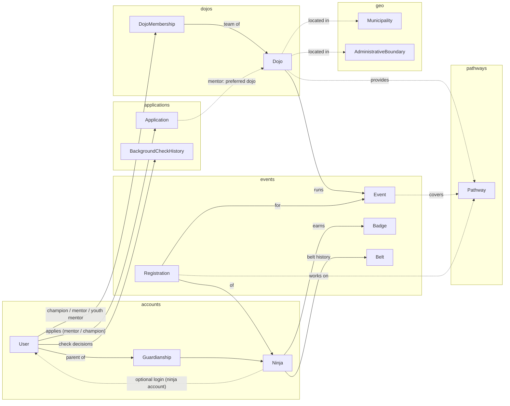
```mermaid
flowchart LR
    subgraph accounts
        User
        Guardianship
        Ninja
    end
    subgraph dojos
        Dojo
        DojoMembership
    end
    subgraph events
        Event
        Registration
        Badge
        Belt
    end
    subgraph applications
        Application
        BackgroundCheckHistory
    end
    subgraph pathways
        Pathway
    end
    subgraph geo
        Municipality
        AdministrativeBoundary
    end

    User -- "champion / mentor / youth mentor" --> DojoMembership
    DojoMembership -- "team of" --> Dojo
    User -- "parent of" --> Guardianship
    Guardianship --> Ninja
    Ninja -. "optional login (ninja account)" .-> User
    Dojo -- runs --> Event
    Registration -- for --> Event
    Registration -- of --> Ninja
    Dojo -. "provides" .-> Pathway
    Event -. "covers" .-> Pathway
    Registration -. "works on" .-> Pathway
    Ninja -- earns --> Badge
    Ninja -- "belt history" --> Belt
    User -- "applies (mentor / champion)" --> Application
    User -- "check decisions" --> BackgroundCheckHistory
    Application -. "mentor: preferred dojo" .-> Dojo
    Dojo -. located in .-> Municipality & AdministrativeBoundary
```

---

## 2. Accounts and roles

`accounts.User` is every login, with `account_type` telling the two kinds
apart: a normal **adult** account, or a **ninja**'s own login. There are no
role subclasses (redesign phases 1–3, section 10).

- **Parents** are plain adult accounts linked to their children through
  `Guardianship`. A child can have more than one guardian, and any adult
  account can add children from its account page. No background check is
  ever needed for that.
- **Champions and mentors** are adult accounts with an approved
  `Application` (section 6) and a **valid background check on the
  account**; what they do at a dojo is a `DojoMembership` (section 3).
- A **`Ninja`** (a child aged 7–17 attending sessions; the age rule is
  checked whenever a date of birth is entered or changed) is **not** a user. It
  gets a login (a `User` with `account_type="ninja"`, linked through
  `Ninja.account`) only if a parent opts it in.
- **Organisation accounts** are adult accounts with an `OrganisationRole`
  (`board`, `admin` or `reviewer`, fixed in code): a matching permission
  group (`accounts.organisation`, kept in sync by signals) that opens the
  organisation dashboard's *areas* (§23: `admin` all but Volunteers,
  `reviewer` Volunteers, `board` none yet). The Django admin is never open
  by the role alone: its holder asks for it, 12 hours at a time
  (`AdminAccessGrant`, §23), and it opens with the role's permissions
  (the **board** read-only oversight and the team listing; **admins** also
  editing dojos, events, content and catalogues). Admins give and take
  away roles on the dashboard's People pages, and invite people without an
  account (`OrganisationInvitation`). No role can award belts. Being listed
  on the organisation's team page (`content.OrganisationTeamMember`) is
  separate from having a role.

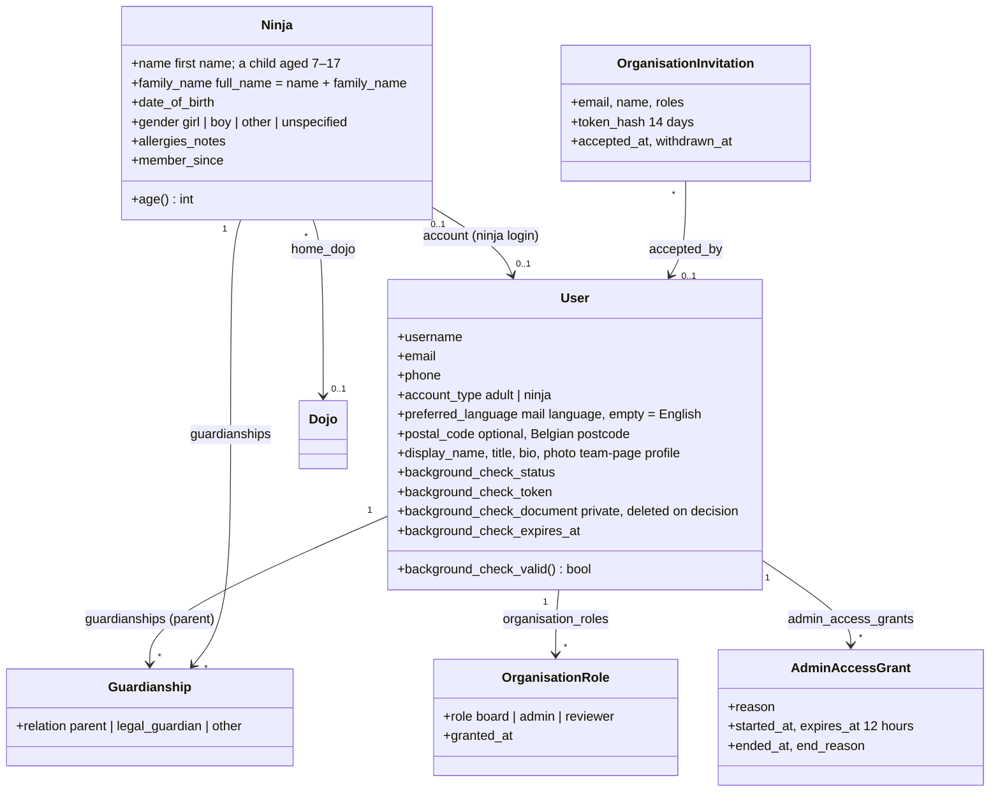
```mermaid
classDiagram
    direction TB
    class User {
        +username
        +email
        +phone
        +account_type  adult | ninja
        +preferred_language  mail language, empty = English
        +postal_code  optional, Belgian postcode
        +display_name, title, bio, photo  team-page profile
        +background_check_status
        +background_check_token
        +background_check_document  private, deleted on decision
        +background_check_expires_at
        +background_check_valid() bool
    }
    class Guardianship {
        +relation  parent | legal_guardian | other
    }
    class Ninja {
        +name  first name; a child aged 7–17
        +family_name  full_name = name + family_name
        +date_of_birth
        +gender  girl | boy | other | unspecified
        +allergies_notes
        +member_since
        +age() int
    }

    User "1" --> "*" Guardianship : guardianships (parent)
    Ninja "1" --> "*" Guardianship : guardianships
    Ninja "0..1" --> "0..1" User : account (ninja login)
    Ninja "*" --> "0..1" Dojo : home_dojo
    class OrganisationRole {
        +role  board | admin | reviewer
        +granted_at
    }
    class AdminAccessGrant {
        +reason
        +started_at, expires_at  12 hours
        +ended_at, end_reason
    }
    class OrganisationInvitation {
        +email, name, roles
        +token_hash  14 days
        +accepted_at, withdrawn_at
    }
    User "1" --> "*" OrganisationRole : organisation_roles
    User "1" --> "*" AdminAccessGrant : admin_access_grants
    OrganisationInvitation "*" --> "0..1" User : accepted_by
```

Which account does what:

| Account | Created by | Background check | Lands on after login |
|---|---|---|---|
| adult (parent) | self-service sign-up (`register_guardian`) | never needed | their account page (`/account/`) |
| adult champion / mentor | the same self-service sign-up, then an approved `Application` | required for dojo access (a lapsed check blocks the dashboards, never the login) | first accessible dojo's dashboard |
| ninja | a parent opts a child in | none | the ninja's own page (`/account/ninja/<id>/`) |
| adult with an `OrganisationRole` | the same sign-up, or the sign-up behind an organisation invitation; the role is given on the dashboard's People page | not for the role itself | the organisation dashboard (`/manage/`); the Django admin only when asked for (12 hours) |

---

## 3. Dojos, teams and admin access

A dojo's team is a set of **memberships** (`DojoMembership`), one per
account and dojo (redesign phase 2, section 10). Each membership has a role
and a status:

- **Roles:** `champion` (the dojo's owner, exactly one active per dojo),
  `mentor` (an adult helper) and `youth_mentor` (a ninja account, promoted by
  a champion/mentor of the same dojo, recorded in `promoted_by`).
- **Status:** `requested` → `active` → `dormant`. People who leave go
  `dormant` and are never deleted, so past events' teams (`Event.team`) keep
  their history. Rejoining reuses the same row.
- **Profiles:** the team-page profile (display name, title, bio, photo,
  `show_on_team_pages`) lives on the **account** and is shared by every dojo
  the person is on.
- **Dojo status:** `draft` → `active` ⇄ `dormant` → `archived` → `draft`.
  Only `active` dojos, and their events, are public (`Dojo.objects.public()`,
  `Event.objects.visible()`). All changes go through `dojos/team.py`.

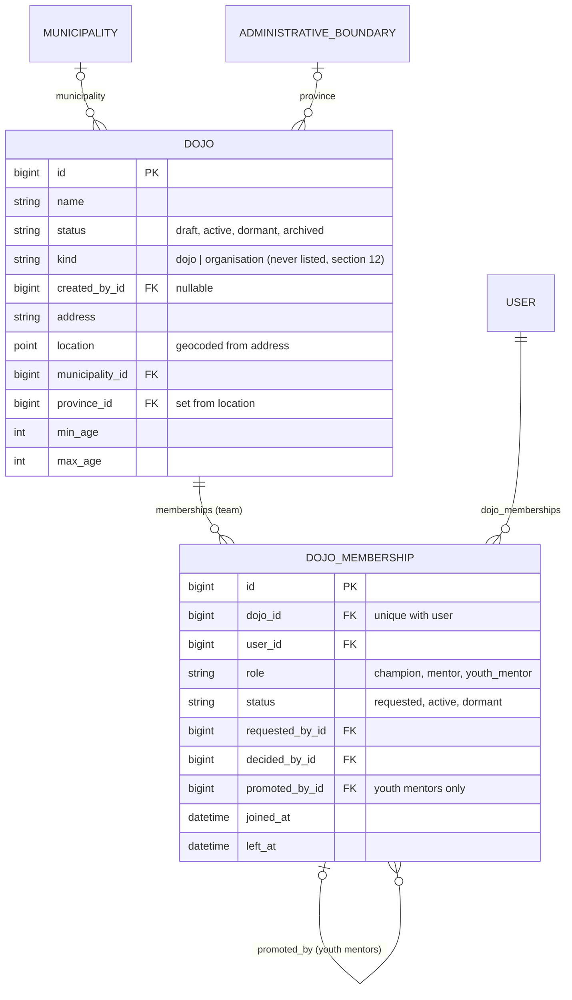
```mermaid
erDiagram
    DOJO ||--o{ DOJO_MEMBERSHIP : "memberships (team)"
    USER ||--o{ DOJO_MEMBERSHIP : "dojo_memberships"
    DOJO_MEMBERSHIP |o--o{ DOJO_MEMBERSHIP : "promoted_by (youth mentors)"
    MUNICIPALITY |o--o{ DOJO : "municipality"
    ADMINISTRATIVE_BOUNDARY |o--o{ DOJO : "province"

    DOJO {
        bigint id PK
        string name
        string status "draft, active, dormant, archived"
        string kind "dojo | organisation (never listed, section 12)"
        bigint created_by_id FK "nullable"
        string address
        point location "geocoded from address"
        bigint municipality_id FK
        bigint province_id FK "set from location"
        int min_age
        int max_age
    }
    DOJO_MEMBERSHIP {
        bigint id PK
        bigint dojo_id FK "unique with user"
        bigint user_id FK
        string role "champion, mentor, youth_mentor"
        string status "requested, active, dormant"
        bigint requested_by_id FK
        bigint decided_by_id FK
        bigint promoted_by_id FK "youth mentors only"
        datetime joined_at
        datetime left_at
    }
```

### Who can use a dojo's admin area

`dojos/access.py` gives admin access to an account with an **active
`champion` or `mentor` membership** at the dojo, and only while its
background check is valid. Youth mentors never get admin access, and
neither do requested or dormant memberships. Each role maps to a set of
capabilities. With no role at all the dojo gives a **404**; a role that
lacks the view's capability gets a **403**.

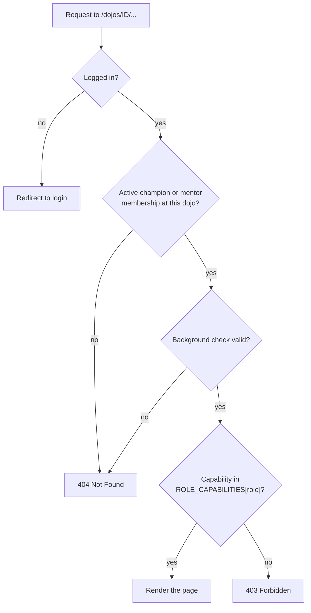
```mermaid
flowchart TD
    R[Request to /dojos/ID/...] --> A{Logged in?}
    A -- no --> L[Redirect to login]
    A -- yes --> M{"Active champion or mentor<br/>membership at this dojo?"}
    M -- no --> N404[404 Not Found]
    M -- yes --> V{Background check valid?}
    V -- no --> N404
    V -- yes --> C{"Capability in<br/>ROLE_CAPABILITIES[role]?"}
    C -- yes --> OK[Render the page]
    C -- no --> N403[403 Forbidden]
```

| Capability | Gates | CHAMPION | MENTOR |
|---|---|:-:|:-:|
| *(any role)* | dashboard, events list, notification bell | ✓ | ✓ |
| `TAKE_ATTENDANCE` | attendance pages, marking present/absent | ✓ | ✓ |
| `MANAGE_EVENTS` | create/edit events, change status | ✓ | ✓ |
| `EDIT_SETTINGS` | dojo profile settings | ✓ | ✓ |
| `MANAGE_TEAM` | accept/decline join requests, add/remove mentors, promote youth mentors | ✓ | ✓ |
| `AWARD_BELTS` | award a ninja a belt (from the attendance list) | ✓ | ✓ |
| `MANAGE_LIFECYCLE` | launch / dormant / archive / reopen the dojo | ✓ | — |
| *(champion only)* | hand over the champion role | ✓ | — |

To restrict mentors, remove entries from `ROLE_CAPABILITIES[MENTOR]`.
Who may *join* a team at all is `access.is_approved_mentor`: an adult account
with an approved mentor (or champion) `Application` and a valid background
check (`applications.services`).

---

## 4. Events, registrations and attendance

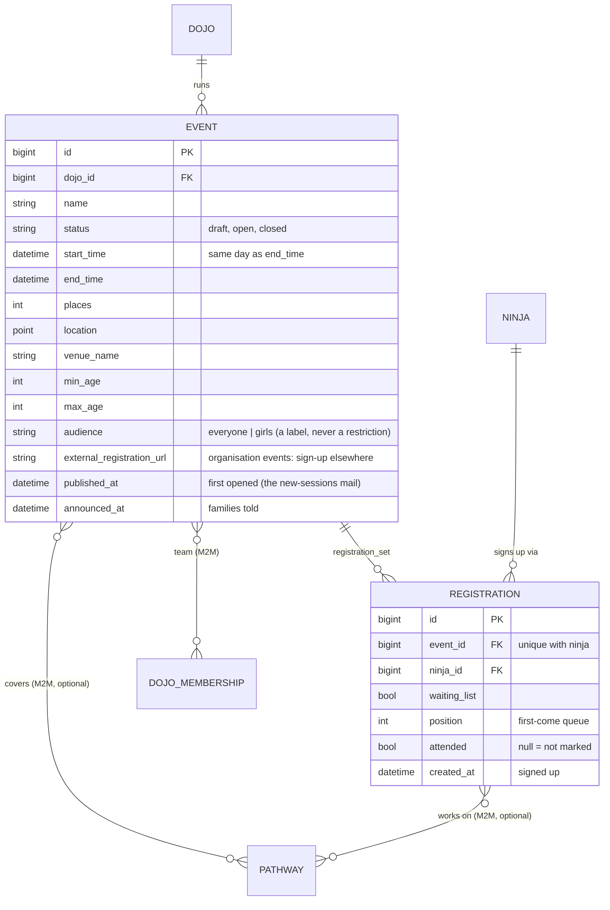
```mermaid
erDiagram
    DOJO ||--o{ EVENT : "runs"
    EVENT ||--o{ REGISTRATION : "registration_set"
    NINJA ||--o{ REGISTRATION : "signs up via"
    EVENT }o--o{ PATHWAY : "covers (M2M, optional)"
    REGISTRATION }o--o{ PATHWAY : "works on (M2M, optional)"
    EVENT }o--o{ DOJO_MEMBERSHIP : "team (M2M)"

    EVENT {
        bigint id PK
        bigint dojo_id FK
        string name
        string status "draft, open, closed"
        datetime start_time "same day as end_time"
        datetime end_time
        int places
        point location
        string venue_name
        int min_age
        int max_age
        string audience "everyone | girls (a label, never a restriction)"
        string external_registration_url "organisation events: sign-up elsewhere"
        datetime published_at "first opened (the new-sessions mail)"
        datetime announced_at "families told"
    }
    REGISTRATION {
        bigint id PK
        bigint event_id FK "unique with ninja"
        bigint ninja_id FK
        bool waiting_list
        int position "first-come queue"
        bool attended "null = not marked"
        datetime created_at "signed up"
    }
```

- **Places:** `Event.places_left` = `places` − confirmed registrations
  (those with `waiting_list=False`). When a confirmed place is cancelled,
  the next person on the waiting list is promoted and the dojo's team (its
  active champion and mentors) is
  notified.
- **Attendance:** `Registration.attended` has three states: `None` (not
  marked yet), `True` (present), `False` (absent). Only confirmed
  registrations can be marked.
- **Pathways:** `Event.pathways` (what the session covers, shown on its
  public page) is pre-selected from `Dojo.pathways` on a new event;
  `Registration.pathways` (what this ninja works on) is set to the
  event's at signup and narrowed by the team from the attendance list
  (`dojo_event_registration_pathways`, `TAKE_ATTENDANCE`). Neither is
  restricted to the level above. See section 7.

### Event status

The dojo's team sets any status directly (`dojo_event_set_status`); it isn't a
one-way lifecycle. Existing registrations are kept whatever the status.

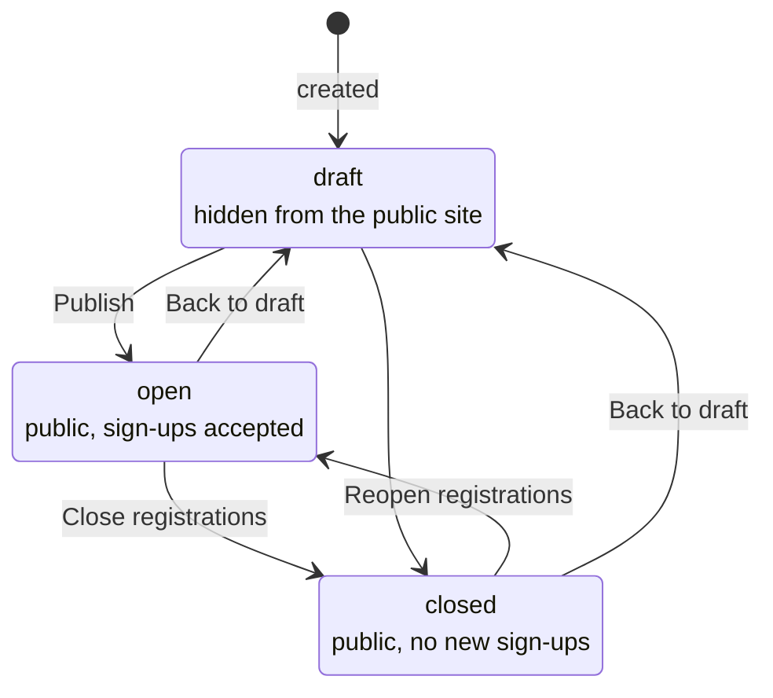
```mermaid
stateDiagram-v2
    [*] --> draft : created
    draft --> open : Publish
    open --> closed : Close registrations
    closed --> open : Reopen registrations
    open --> draft : Back to draft
    closed --> draft : Back to draft
    draft --> closed

    draft : draft<br/>hidden from the public site
    open : open<br/>public, sign-ups accepted
    closed : closed<br/>public, no new sign-ups
```

### Engagement and cancellations

Cancelling a place deletes its `Registration` (so places and the waiting
list stay simple) after appending a `RegistrationCancellation`. Every night
`events.engagement.rebuild()` recomputes `NinjaEngagement`: per child and
dojo they came to in the last year, plus an overall row measured at their
main dojo. It only counts sessions meant for the child (age range; a girls'
session only for girls), and records each overall stage change in
`NinjaEngagementChange`. Segments, journeys and the dojo team's attendance
list read it (section 11).

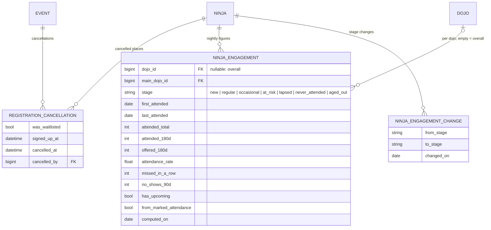
```mermaid
erDiagram
    NINJA ||--o{ REGISTRATION_CANCELLATION : "cancelled places"
    EVENT ||--o{ REGISTRATION_CANCELLATION : "cancellations"
    NINJA ||--o{ NINJA_ENGAGEMENT : "nightly figures"
    DOJO |o--o{ NINJA_ENGAGEMENT : "per dojo; empty = overall"
    NINJA ||--o{ NINJA_ENGAGEMENT_CHANGE : "stage changes"

    REGISTRATION_CANCELLATION {
        bool was_waitlisted
        datetime signed_up_at
        datetime cancelled_at
        bigint cancelled_by FK
    }
    NINJA_ENGAGEMENT {
        bigint dojo_id FK "nullable: overall"
        bigint main_dojo_id FK
        string stage "new | regular | occasional | at_risk | lapsed | never_attended | aged_out"
        date first_attended
        date last_attended
        int attended_total
        int attended_180d
        int offered_180d
        float attendance_rate
        int missed_in_a_row
        int no_shows_90d
        bool has_upcoming
        bool from_marked_attendance
        date computed_on
    }
    NINJA_ENGAGEMENT_CHANGE {
        string from_stage
        string to_stage
        date changed_on
    }
```

---

## 5. Badges and belts

Two separate things a ninja collects (redesign phase 5), both in `events`
with their rules in `events/awards.py`:

- A **badge** is an award: either a **one-off** ("did the thing", e.g.
  attended a CoderDojo for Girls session) or a **milestone** reached by a
  number of sessions attended (the attendance wristbands). `NinjaBadge`
  holds one ninja's progress on one badge. Only the organisation defines
  badges (the organisation dashboard's *Awards* page). A one-off is awarded
  from the attendance list by an **active champion or mentor** with a valid
  check (`AWARD_BADGES`, `award_badge`), to a ninja who has been to one of
  that dojo's sessions, once; the row records the account, the membership
  and an optional note. Milestones are never awarded by hand: they're
  recomputed (`sync_milestones`) whenever the dojo team marks attendance;
  an earned badge stays earned if a mark is later undone.
- A **belt** is a ninja's **proficiency level**: one overall track ordered
  by `Belt.level`, not linked to pathways. `NinjaBelt` is an append-only
  history (current belt = the highest level, `Ninja.current_belt`).
  Only an **active champion or mentor** with a valid check
  (`AWARD_BELTS`) can award one (`award_belt`), from the attendance list,
  to a ninja who has been to one of that dojo's sessions, and only a belt
  above the ninja's current one. Each row records the account, the
  membership and that membership's role at the time ("Jan, as mentor of
  CoderDojo Ghent"). A milestone badge can optionally `grants_belt`:
  reaching it awards that belt as the membership that marked the
  attendance.

The ninja's page shows the current belt with its history, and the
badges carousel. The attendance list shows each ninja's current belt.

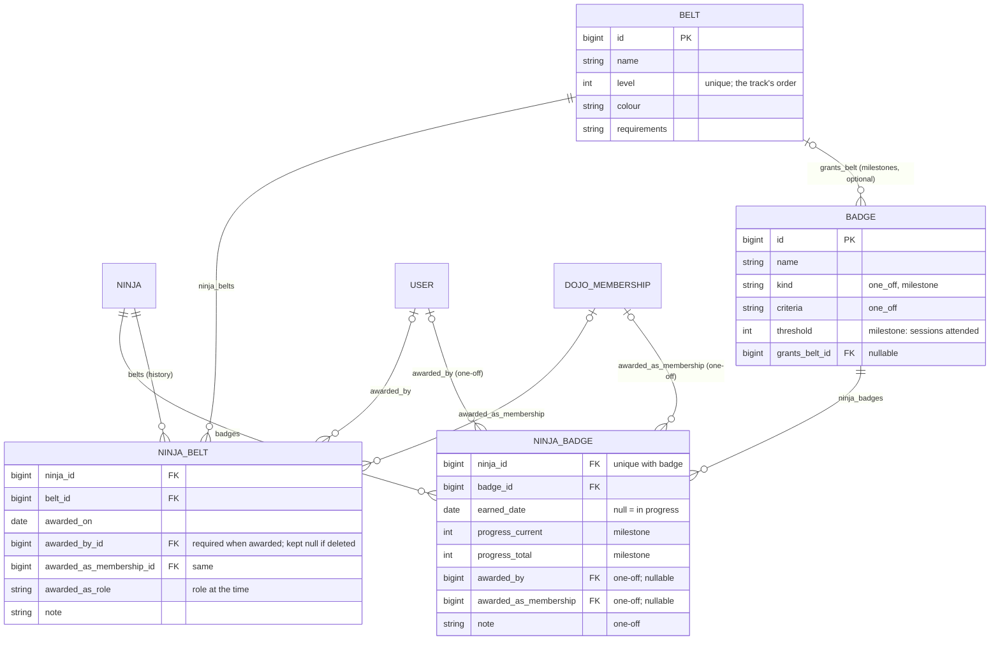
```mermaid
erDiagram
    NINJA ||--o{ NINJA_BADGE : "badges"
    BADGE ||--o{ NINJA_BADGE : "ninja_badges"
    NINJA ||--o{ NINJA_BELT : "belts (history)"
    BELT ||--o{ NINJA_BELT : "ninja_belts"
    BELT |o--o{ BADGE : "grants_belt (milestones, optional)"
    USER |o--o{ NINJA_BELT : "awarded_by"
    DOJO_MEMBERSHIP |o--o{ NINJA_BELT : "awarded_as_membership"
    USER |o--o{ NINJA_BADGE : "awarded_by (one-off)"
    DOJO_MEMBERSHIP |o--o{ NINJA_BADGE : "awarded_as_membership (one-off)"

    BADGE {
        bigint id PK
        string name
        string kind "one_off, milestone"
        string criteria "one_off"
        int threshold "milestone: sessions attended"
        bigint grants_belt_id FK "nullable"
    }
    NINJA_BADGE {
        bigint ninja_id FK "unique with badge"
        bigint badge_id FK
        date earned_date "null = in progress"
        int progress_current "milestone"
        int progress_total "milestone"
        bigint awarded_by FK "one-off; nullable"
        bigint awarded_as_membership FK "one-off; nullable"
        string note "one-off"
    }
    BELT {
        bigint id PK
        string name
        int level "unique; the track's order"
        string colour
        string requirements
    }
    NINJA_BELT {
        bigint ninja_id FK
        bigint belt_id FK
        date awarded_on
        bigint awarded_by_id FK "required when awarded; kept null if deleted"
        bigint awarded_as_membership_id FK "same"
        string awarded_as_role "role at the time"
        string note
    }
```

---

## 6. Applications and background checks

Onboarding is **account-level** (redesign phase 3): an adult account applies
**once** to become a **mentor** or a **champion** (`Application`), not once
per dojo. The Belgian Article 596.2 criminal-record extract is checked **on
the account** (the `background_check_*` fields on `User`). Every review
decision is appended to `BackgroundCheckHistory`: who decided and when. The
uploaded document is **deleted as soon as a decision is made**, validate or
reject; the history never stores it. All of this lives in
`applications/services.py`.

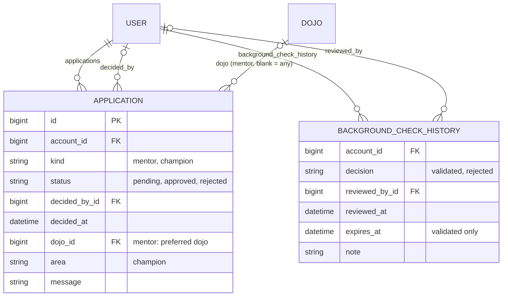
```mermaid
erDiagram
    USER ||--o{ APPLICATION : "applications"
    USER ||--o{ BACKGROUND_CHECK_HISTORY : "background_check_history"
    USER |o--o{ BACKGROUND_CHECK_HISTORY : "reviewed_by"
    USER |o--o{ APPLICATION : "decided_by"
    DOJO |o--o{ APPLICATION : "dojo (mentor, blank = any)"

    APPLICATION {
        bigint id PK
        bigint account_id FK
        string kind "mentor, champion"
        string status "pending, approved, rejected"
        bigint decided_by_id FK
        datetime decided_at
        bigint dojo_id FK "mentor: preferred dojo"
        string area "champion"
        string message
    }
    BACKGROUND_CHECK_HISTORY {
        bigint account_id FK
        string decision "validated, rejected"
        bigint reviewed_by_id FK
        datetime reviewed_at
        datetime expires_at "validated only"
        string note
    }
```

### Background check lifecycle (on the account)

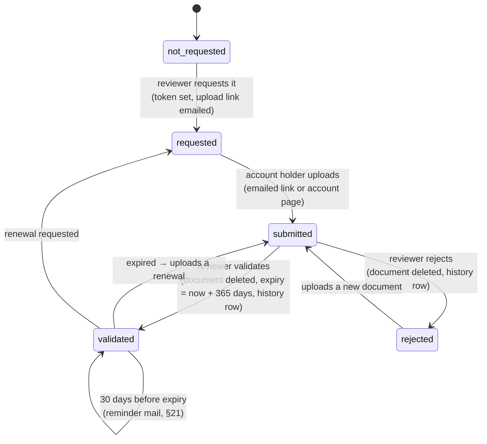
```mermaid
stateDiagram-v2
    [*] --> not_requested
    not_requested --> requested : reviewer requests it<br/>(token set, upload link emailed)
    requested --> submitted : account holder uploads<br/>(emailed link or account page)
    submitted --> validated : reviewer validates<br/>(document deleted, expiry = now + 365 days, history row)
    submitted --> rejected : reviewer rejects<br/>(document deleted, history row)
    rejected --> submitted : uploads a new document
    validated --> submitted : expired → uploads a renewal
    validated --> requested : renewal requested
    validated --> validated : 30 days before expiry<br/>(reminder mail, §21)
```

Reviewers work from the organisation dashboard's *Volunteers* pages (§21):
the organisation's `reviewer` role reviews checks and decides applications,
never their own.

### From application to a dojo

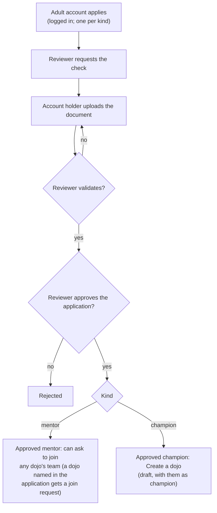
```mermaid
flowchart TD
    A["Adult account applies<br/>(logged in; one per kind)"] --> R[Reviewer requests the check]
    R --> U[Account holder uploads the document]
    U --> V{Reviewer validates?}
    V -- no --> U
    V -- yes --> P{Reviewer approves the application?}
    P -- no --> X[Rejected]
    P -- yes --> K{Kind}
    K -- mentor --> M["Approved mentor: can ask to join<br/>any dojo's team (a dojo named in the<br/>application gets a join request)"]
    K -- champion --> C["Approved champion: Create a dojo<br/>(draft, with them as champion)"]
```

A lapsed check (validated, then expired) **never blocks login**. It makes
`background_check_valid` false, so the account's champion/mentor memberships
stop granting dojo access (section 3) until a renewal is validated. The
account page links to the upload.

---

## 7. Learning pathways and content

`pathways` is a read-mostly catalogue with no enrolment state. It's
linked at three optional levels, each pre-filled from the one above:
`Dojo.pathways` (what the dojo provides, set on its Settings page and
shown on its public page) → `Event.pathways` (what a session covers) →
`Registration.pathways` (what one ninja works on; it feeds the ninja's
history and the attendance list). The `content`
models are each optionally scoped to one dojo, event or pathway, or
site-wide when the scoping key is blank.

`content.OrganisationTeamMember` is the organisation's team listing (the
homepage's "Meet the team" and `team/<id>/`). It's display only, each entry
with a position ("Member of the board" is one of them), and it's separate
from any access.

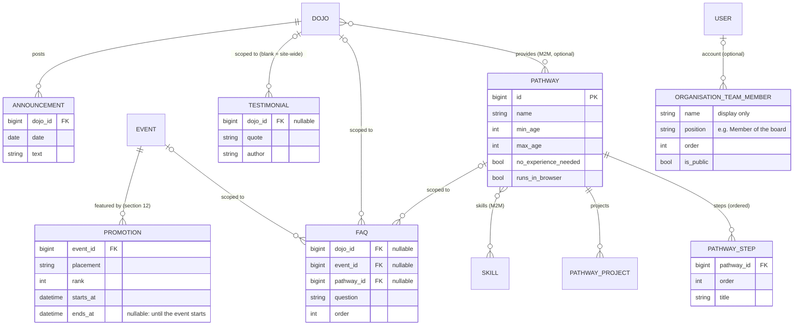
```mermaid
erDiagram
    PATHWAY ||--o{ PATHWAY_STEP : "steps (ordered)"
    PATHWAY ||--o{ PATHWAY_PROJECT : "projects"
    PATHWAY }o--o{ SKILL : "skills (M2M)"
    DOJO }o--o{ PATHWAY : "provides (M2M, optional)"
    DOJO |o--o{ FAQ : "scoped to"
    EVENT |o--o{ FAQ : "scoped to"
    PATHWAY |o--o{ FAQ : "scoped to"
    DOJO |o--o{ TESTIMONIAL : "scoped to (blank = site-wide)"
    DOJO ||--o{ ANNOUNCEMENT : "posts"
    EVENT ||--o{ PROMOTION : "featured by (section 12)"
    USER |o--o{ ORGANISATION_TEAM_MEMBER : "account (optional)"

    PATHWAY {
        bigint id PK
        string name
        int min_age
        int max_age
        bool no_experience_needed
        bool runs_in_browser
    }
    PATHWAY_STEP {
        bigint pathway_id FK
        int order
        string title
    }
    FAQ {
        bigint dojo_id FK "nullable"
        bigint event_id FK "nullable"
        bigint pathway_id FK "nullable"
        string question
        int order
    }
    TESTIMONIAL {
        bigint dojo_id FK "nullable"
        string quote
        string author
    }
    ORGANISATION_TEAM_MEMBER {
        string name "display only"
        string position "e.g. Member of the board"
        int order
        bool is_public
    }
    ANNOUNCEMENT {
        bigint dojo_id FK
        date date
        string text
    }
    PROMOTION {
        bigint event_id FK
        string placement
        int rank
        datetime starts_at
        datetime ends_at "nullable: until the event starts"
    }
```

---

## 8. Notifications

Each `Notification` row belongs to one recipient, so read state is per
user. An event that concerns several people creates one row per recipient.
Always create notifications through `notifications.services.notify()`: it
writes the row, then pushes the updated bell over the WebSocket channel
layer, on a best-effort basis.

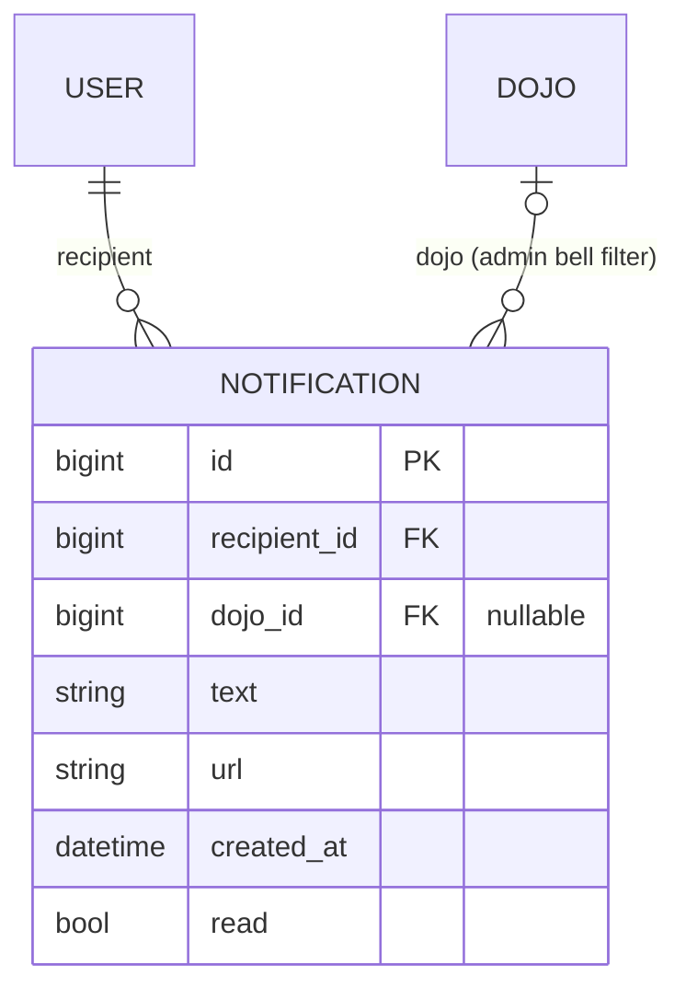
```mermaid
erDiagram
    USER ||--o{ NOTIFICATION : "recipient"
    DOJO |o--o{ NOTIFICATION : "dojo (admin bell filter)"

    NOTIFICATION {
        bigint id PK
        bigint recipient_id FK
        bigint dojo_id FK "nullable"
        string text
        string url
        datetime created_at
        bool read
    }
```

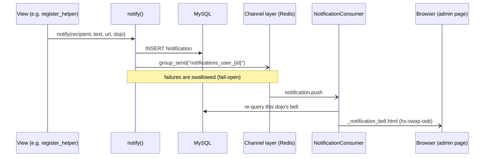
```mermaid
sequenceDiagram
    participant V as View (e.g. register_helper)
    participant S as notify()
    participant DB as MySQL
    participant CL as Channel layer (Redis)
    participant C as NotificationConsumer
    participant B as Browser (admin page)

    V->>S: notify(recipient, text, url, dojo)
    S->>DB: INSERT Notification
    S-)CL: group_send("notifications_user_{id}")
    Note over S,CL: failures are swallowed (fail-open)
    CL-)C: notification.push
    C->>DB: re-query this dojo's bell
    C-)B: _notification_bell.html (hx-swap-oob)
```

---

## 9. Geo reference data

Reference data only (seeded by `seed_geo`), with no URLs of its own. A
dojo's `province` is derived from its geocoded `location`: a
point-in-polygon lookup against `AdministrativeBoundary`, falling back to
the nearest boundary. Distance searches always use
`geo.functions.DistanceSphere` (MySQL `ST_Distance_Sphere`).

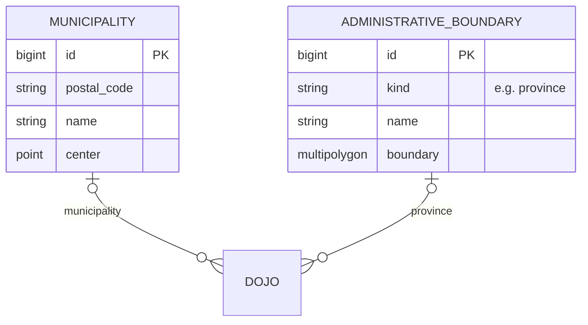
```mermaid
erDiagram
    MUNICIPALITY |o--o{ DOJO : "municipality"
    ADMINISTRATIVE_BOUNDARY |o--o{ DOJO : "province"

    MUNICIPALITY {
        bigint id PK
        string postal_code
        string name
        point center
    }
    ADMINISTRATIVE_BOUNDARY {
        bigint id PK
        string kind "e.g. province"
        string name
        multipolygon boundary
    }
```

---

## 10. Redesign: rationale and plan

> **Status: landed** (all eight phases, 2026-09-24). Sections 1–9 are the current model; this
> section keeps *why* it looks the way it does: the problems with the old
> model, the decisions taken and the plan. Where it says "today", read
> "before the redesign".

### Nomenclature

The redesign uses CoderDojo's own vocabulary. Use these terms in the new
model, in the UI and in the docs:

| Term | Meaning | Role / entity in the redesign | Today's code (sections 1–9) |
|---|---|---|---|
| **Champion** | The **dojo owner**: runs and manages a dojo. Exactly one per dojo. | membership role `champion` | `DojoOwner`, `Dojo.owner`, shown as "Lead Coach" |
| **Mentor** / **Coach** | An adult **helper** who helps manage and run a dojo. | membership role `mentor` | `HelperAccount`, `Mentor.VOLUNTEER` ("Volunteer mentor") |
| **Ninja** | A **child aged 7–17** who visits a dojo. | `NINJA` (plus an optional `NINJA_ACCOUNT` login) | `Participant` (+ `ChildAccount`) |
| **Youth mentor** | A **ninja who helps run events**. Promoted by the dojo's champion or a mentor. | membership role `youth_mentor` | `Mentor.CHAMPION` / `Mentor.NINJA` linked to a `ChildAccount` |
| **Badge** | An **award** a ninja can achieve: either a one-off ("did the thing") or a **milestone** reached by a count (e.g. the attendance wristbands). | `BADGE` (kind `one_off` / `milestone`) / `NINJA_BADGE` | `BadgeAward` and `MilestoneAward` / `ParticipantAward` |
| **Belt** | A ninja's **proficiency level**: how skilled they are, not how often they came. | `BELT` / `NINJA_BELT` | nothing today. A milestone award *can* be set up to grant a belt, but doesn't have to. |

Watch out for two collisions with today's code:

- **"Champion"** changes meaning. Today `Mentor.CHAMPION` ("Dojo
  champion") is an honoured *ninja*. In the redesign a **Champion is the
  dojo owner**, and the honoured-ninja role is a **Youth mentor**.
- **"Mentor"** today is the name of the team-page *profile table*
  (`dojos.Mentor`), which the redesign removes. In the redesign
  **mentor** is only a *role* (an adult helper) on a dojo membership.

### What's wrong with the current model

- **`Mentor` shouldn't be a table of its own.** Today it's a copy of a
  person (name, email, photo) with up to four optional links back to the
  real account (`owner_account`, `helper_account`, `guardian_account`,
  `child_account`). That's why `Mentor.clean()` needs "at most one link"
  rules and `Dojo.sync_lead_coach()` exists to keep the Lead Coach copy in
  step with `Dojo.owner`. What the site actually needs is a way to show
  **the team working at a dojo**: the accounts involved and each one's role
  there.
- **Champion and mentor aren't kinds of account.** They describe how a
  person relates to one particular dojo, and a person can have that
  relationship with several dojos. Modelling them as account subclasses
  (`DojoOwner`, `HelperAccount`), plus `Dojo.owner` and
  `Mentor.helper_account`, spreads one idea across three places.
- **Background checks belong to the person.** The check fields already
  live on `accounts.User`, but whether a check is required depends on which
  role subclasses an account has, and the check itself is tracked on the
  applications. In the new model the check is tracked on the account, and
  it's required by the **relationship**: holding a `champion` or `mentor`
  membership needs a valid check, while plain use of the site doesn't.

### Target model

**Two account types only:**

- **`NINJA_ACCOUNT`**: a ninja's own login. **No background check.** A
  ninja can be promoted to **Youth mentor** at a dojo by that dojo's
  champion or one of its mentors. Created and removed by the child's
  guardian (§17).
- **Account** (the normal, adult account; what `User` is today, minus the
  role subclasses). Every account *can* go through the background-check
  process (`BackgroundCheckMixin`'s lifecycle, tracked on the account
  itself), but it's **only required to become a champion or a mentor**
  *(decided)*. A parent using the site normally (registering their family,
  managing their ninjas, signing them up for sessions) never needs a
  check. Holding a `champion` or `mentor` membership requires a validated,
  unexpired check. Every decision on a check is also written to an audit
  history of who approved or rejected it, and when.

**The team is a relation between an account and a dojo.** Champion,
mentor and youth-mentor roles are all stored on one relation row per
account and dojo (below called `DojoMembership`; the name isn't decided).
One account can be linked to any number of dojos, with the role that fits
each relationship.

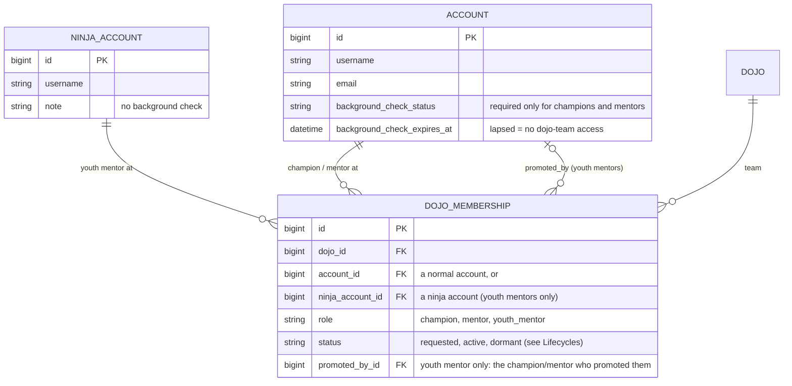
```mermaid
erDiagram
    ACCOUNT ||--o{ DOJO_MEMBERSHIP : "champion / mentor at"
    NINJA_ACCOUNT ||--o{ DOJO_MEMBERSHIP : "youth mentor at"
    DOJO ||--o{ DOJO_MEMBERSHIP : "team"
    ACCOUNT |o--o{ DOJO_MEMBERSHIP : "promoted_by (youth mentors)"

    ACCOUNT {
        bigint id PK
        string username
        string email
        string background_check_status "required only for champions and mentors"
        datetime background_check_expires_at "lapsed = no dojo-team access"
    }
    NINJA_ACCOUNT {
        bigint id PK
        string username
        string note "no background check"
    }
    DOJO_MEMBERSHIP {
        bigint id PK
        bigint dojo_id FK
        bigint account_id FK "a normal account, or"
        bigint ninja_account_id FK "a ninja account (youth mentors only)"
        string role "champion, mentor, youth_mentor"
        string status "requested, active, dormant (see Lifecycles)"
        bigint promoted_by_id FK "youth mentor only: the champion/mentor who promoted them"
    }
```

Rules the new model needs to enforce:

| Role | Who can hold it | How it's granted |
|---|---|---|
| `champion` | normal account, **approved as a champion**, with a valid background check | creating a dojo (the creator becomes its champion), or a **transfer** from the current champion |
| `mentor` | normal account, **approved as a mentor**, with a valid background check | the mentor **requests to join** and an active champion/mentor of that dojo accepts, **or** an active champion/mentor **adds** them |
| `youth_mentor` | ninja account | promoted by an active `champion` or `mentor` of **the same dojo** |

"Approved as a mentor" and "approved as a champion" are **account-level,
one-time** approvals (an application plus a background check; see
Lifecycles below). They aren't tied to a dojo: once approved, a mentor can
join as many dojos as accept them, and a champion can create a dojo.

- A membership links exactly one of `account` / `ninja_account`, and the
  role has to match the account type (`youth_mentor` only on ninja
  accounts; `champion`/`mentor` only on normal accounts).
- There's one membership per (account, dojo). Leaving and rejoining reuses
  the same row (dormant → active again) rather than adding a second one.
- **Exactly one active `champion` per dojo.** It changes hands only by
  transfer (below), never by having two champions at once.
- `promoted_by` must hold a `champion` or `mentor` membership at that same
  dojo.
- The team page lists a dojo's `active` memberships whose account has
  `show_on_team_pages` set, the champion first, using the account's shared
  profile. That covers what `Mentor.objects.lead_coach_first()` does
  today; the "Lead Coach" label becomes **Champion**.
- Admin access (`dojos/access.py`) reads the role from the membership, and
  only an **`active`** membership whose account has a valid check grants
  access to that dojo's dashboard. The role→capability mapping
  (`ROLE_CAPABILITIES`) already works this way; today's `OWNER`/`HELPER`
  become `CHAMPION`/`MENTOR`, plus a `YOUTH_MENTOR` entry, probably with no
  admin capabilities.

### Lifecycles

#### Becoming a mentor or champion, then joining a dojo

Approval happens **once per account**, not once per dojo. Joining a
specific dojo's team is a separate, lightweight step handled by that
dojo's own team, with no admin involved.

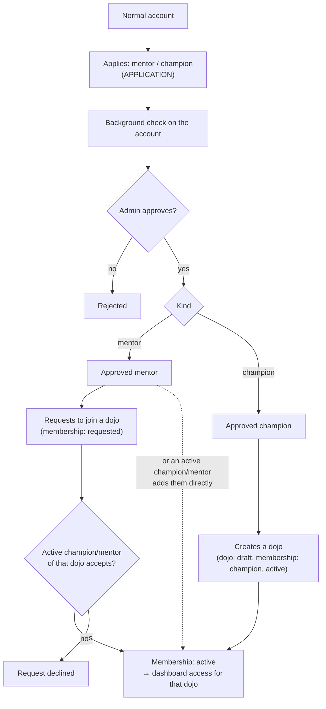
```mermaid
flowchart TD
    A[Normal account] --> B["Applies: mentor / champion<br/>(APPLICATION)"]
    B --> C[Background check on the account]
    C --> D{Admin approves?}
    D -- no --> X[Rejected]
    D -- yes --> E{Kind}
    E -- mentor --> H[Approved mentor]
    E -- champion --> S[Approved champion]

    H --> J1["Requests to join a dojo<br/>(membership: requested)"]
    J1 --> J2{"Active champion/mentor<br/>of that dojo accepts?"}
    J2 -- yes --> ACT["Membership: active<br/>→ dashboard access for that dojo"]
    J2 -- no --> DEC[Request declined]
    H -. "or an active champion/mentor<br/>adds them directly" .-> ACT

    S --> N["Creates a dojo<br/>(dojo: draft, membership: champion, active)"]
    N --> ACT
```

#### Dojo lifecycle

A new dojo starts in `draft`. The draft is where the champion sets up the
profile, team and first sessions before anything is public.

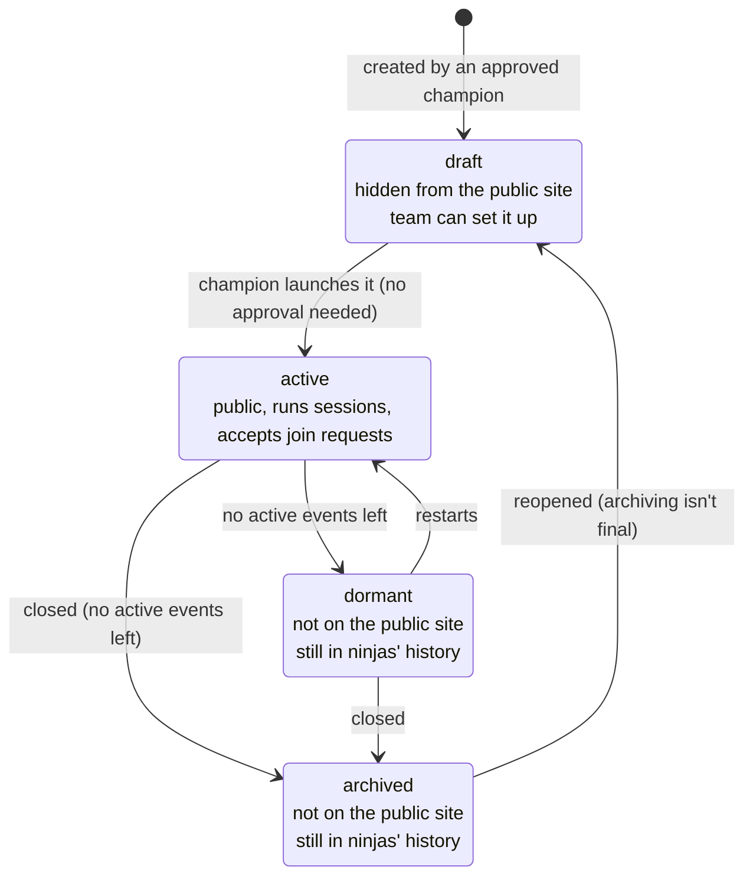
```mermaid
stateDiagram-v2
    [*] --> draft : created by an approved champion
    draft --> active : champion launches it (no approval needed)
    active --> dormant : no active events left
    dormant --> active : restarts
    active --> archived : closed (no active events left)
    dormant --> archived : closed
    archived --> draft : reopened (archiving isn't final)

    draft : draft<br/>hidden from the public site<br/>team can set it up
    active : active<br/>public, runs sessions, accepts join requests
    dormant : dormant<br/>not on the public site<br/>still in ninjas' history
    archived : archived<br/>not on the public site<br/>still in ninjas' history
```

Decided rules:

- **Launching:** the champion moves a dojo from `draft` to `active`
  themselves. No admin approval is needed; they were already approved as
  a champion.
- **Going dormant or archived:** only allowed when the dojo has **no active
  events**, meaning no upcoming event that's still `draft` or `open`. The
  transition is refused while an active event exists; the team has to
  close or finish those first. In practice a dojo goes dormant when
  nothing has been planned for a long time.
- **Pending join requests** (`requested` memberships) are **declined
  automatically** when a dojo goes dormant or is archived, and the
  requesting mentors are notified.
- **Dormancy is a manual decision, with a nudge.** The site never makes a
  dojo dormant by itself. Once an `active` dojo has had **no events planned
  for half a year** (six months since its last event, with nothing
  upcoming), its dashboard flags it, and the dojo's active team (champion
  and mentors) and the **board** (`ORGANISATION_ROLE`) get a **persistent**
  notification. It stays visible until the situation is resolved, either
  because an event is planned or because the dojo is marked dormant or
  archived, rather than being sent once or repeated. The board sees these
  on a **board dashboard that hasn't been built yet**.
  - Model note: "persistent until resolved" doesn't fit today's
    `Notification`, which is a one-off message with `read`. Either give it
    a `resolved_at` (plus a key such as `kind` + `dojo`, so the alert isn't
    duplicated), or compute the alert from the data (last event date +
    status) every time the dashboards render. Decide when the board
    dashboard is built.
- **Visibility:** `dormant` and `archived` dojos **don't appear on the
  public site** (dojo finder, dojo pages, upcoming sessions). They
  **still appear in ninjas' own history**: past sessions, registrations,
  badges and belts keep showing the dojo's name for the ninjas and parents
  concerned.
- **Archiving isn't final:** an archived dojo can be reopened. It goes
  **back to `draft`**, hidden from the public site, so the team can check
  its profile and team before launching it again.
- **Team powers:** any **active** mentor can do what the champion can for
  team management: accept join requests, add mentors directly, and
  promote ninjas to youth mentor. Only the champion can transfer the
  champion role.

#### Team membership lifecycle

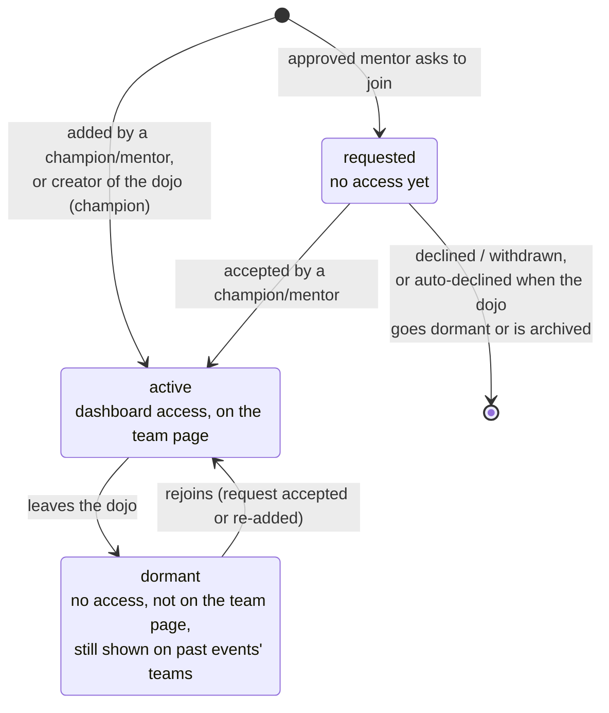
```mermaid
stateDiagram-v2
    [*] --> requested : approved mentor asks to join
    [*] --> active : added by a champion/mentor,<br/>or creator of the dojo (champion)
    requested --> active : accepted by a champion/mentor
    requested --> [*] : declined / withdrawn,<br/>or auto-declined when the dojo<br/>goes dormant or is archived
    active --> dormant : leaves the dojo
    dormant --> active : rejoins (request accepted or re-added)

    requested : requested<br/>no access yet
    active : active<br/>dashboard access, on the team page
    dormant : dormant<br/>no access, not on the team page,<br/>still shown on past events' teams
```

- **Leaving:** a mentor (or youth mentor) can leave a dojo at any time.
  Their membership becomes `dormant`. It isn't deleted, so it still
  appears on the **event team** of the past sessions they helped run, but
  it's no longer on the team page and gives no dashboard access.
- **Champion transfer:** the active champion can hand the champion role to
  one of the dojo's **active mentors**. In one step, the chosen mentor's
  membership becomes `champion` and the previous champion's becomes
  `mentor` (still active; they can then leave like any other mentor). The
  target must be an active mentor at that dojo with a valid check. A
  champion can't simply leave: they transfer the role first, or the dojo
  is archived.
- **Checks lapsing:** when an account's background check lapses, all its
  `champion`/`mentor` memberships stop granting access until it's renewed.
  Their status doesn't change: they're still `active`, just not usable.

### Pathways move to the dojo and event scope

Today a pathway is linked only per ninja, per session, and only one
(`Registration.pathway`: "what this child worked on"). In the redesign
pathways are set at three levels, each one **pre-filled from the level
above**:

- **Dojo ↔ pathway** (many-to-many, optional): the pathways a dojo
  **provides** as a service, for example "we do Scratch and micro:bit".
- **Event ↔ pathway** (many-to-many, optional): the pathways a specific
  **session** covers. Pre-filled from the dojo's.
- **Registration ↔ pathway** (many-to-many, optional): the pathways **this
  ninja** works on at that session, often a **subset** of the event's.
  Pre-filled from the event's. This replaces today's single
  `Registration.pathway`.
- All three are **optional**. A dojo, event or registration without
  pathways is perfectly valid.
- When set, an event's pathways are **shown on its public event details
  page**, and a dojo's can be shown on its dojo page. A registration's
  pathways feed the ninja's own history and the attendance list.

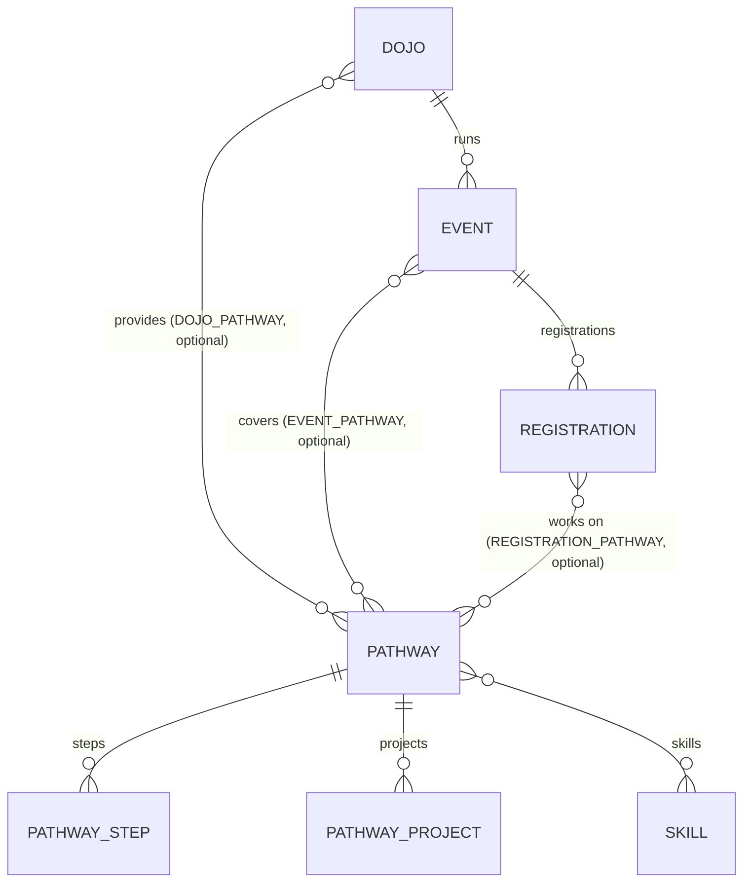
```mermaid
erDiagram
    DOJO }o--o{ PATHWAY : "provides (DOJO_PATHWAY, optional)"
    EVENT }o--o{ PATHWAY : "covers (EVENT_PATHWAY, optional)"
    DOJO ||--o{ EVENT : "runs"
    EVENT ||--o{ REGISTRATION : "registrations"
    REGISTRATION }o--o{ PATHWAY : "works on (REGISTRATION_PATHWAY, optional)"
    PATHWAY ||--o{ PATHWAY_STEP : "steps"
    PATHWAY ||--o{ PATHWAY_PROJECT : "projects"
    PATHWAY }o--o{ SKILL : "skills"
```

Decided:

- **Event pathways default to the dojo's but aren't restricted.** The
  event form pre-selects the pathways the dojo provides, and the team can
  add or remove any pathway for that particular session.
- **Registration pathways work the same way, one level down.** A new
  registration pre-selects the event's pathways, and they can be narrowed
  to the subset this ninja actually works on (or changed), without a hard
  restriction. The ninja's history and the attendance list read the
  **registration's** pathways.

### Mapping from today's model

| Today | In the redesign |
|---|---|
| `accounts.User` | the normal **Account** |
| `DojoOwner`, `HelperAccount` (MTI subclasses) | removed: a `champion` / `mentor` membership on the account |
| `Guardian` (MTI subclass) | removed: a normal account with `GUARDIANSHIP` rows to its ninjas (no check needed for that) |
| `ChildAccount` | `NINJA_ACCOUNT`: the second account type |
| `Participant` | `NINJA` |
| `Dojo.owner` | a `champion` membership |
| `Mentor` (with a dojo) | removed: the relationship becomes a membership, and the display fields move onto the account's shared profile |
| `Mentor` with no dojo (role `board`) | an `ORGANISATION_TEAM_MEMBER` row (display only, for the organisation's team details page) with position "Member of the board", maintained from the management dashboard |
| `Mentor.owner_account` / `helper_account` | the membership's `account` (role `champion` / `mentor`) |
| `Mentor.child_account` + role `champion`/`ninja` | a `youth_mentor` membership with `promoted_by` |
| "Lead Coach" label | **Champion** |
| `Dojo.sync_lead_coach()` (and its demote-on-owner-change) | removed: the champion role changes by an explicit **transfer** between memberships (the old champion becomes a mentor) |
| `DojoApplication` / `MentorApplication` (per dojo, creating the account and role) | one `APPLICATION` per account and kind (`mentor`, `champion`). Approval makes the account an approved mentor or champion; joining or creating a dojo is a separate step |
| `Dojo` (no status; always public) | `Dojo.status`: `draft`, `active`, `dormant`, `archived` |
| `Registration.pathway` (one per ninja, per session) | many-to-many at three levels, each pre-filled from the one above: **dojo** (`DOJO_PATHWAY`) → **event** (`EVENT_PATHWAY`, shown on the event details page) → **registration** (`REGISTRATION_PATHWAY`, the ninja's subset) |
| `Award` → `BadgeAward` / `MilestoneAward`, `ParticipantAward` | **Badges** (`BADGE` with kind `one_off` / `milestone`, `NINJA_BADGE`); milestones stay badges. **Belts** (`BELT`, `NINJA_BELT`) are new: a ninja's proficiency level |
| `dojos.access` roles `OWNER` / `HELPER` | `CHAMPION` / `MENTOR` (+ `YOUTH_MENTOR`) |
| background-check fields on the applications, and on `User` for owner/helper | the current check on every normal account, plus an append-only `BACKGROUND_CHECK_HISTORY` audit log (who decided, when) |

### Open questions to settle before starting

- ~~**Parents.**~~ *Decided: no check for normal use of the site; a
  check is required only to become a champion or mentor. See (A) below.*
- ~~**Ninja vs ninja account**~~: *decided, see (B) below.* They stay
  separate.
- ~~**Organisation team members** (today's board members)~~: *decided,
  see (C) below.* The public listing is separate from accounts and
  access.
- ~~**Team-page profile fields**~~: *decided, see (D) below.* One shared
  profile on the account.
- ~~**History**~~: *not an issue in the new model.* Memberships are never
  deleted, only made `dormant`, and `EVENT.event_team` points at them. The
  membership table therefore *is* the history, and "who ran this session"
  is a plain lookup there. There's no legacy history to carry over either;
  see "No data migration" below.
- ~~**Belts: progress in what?**~~ *Decided: a belt is a ninja's
  **proficiency level**, not an attendance count.* Milestone awards (like
  the attendance wristbands) stay **badges** (kind `milestone`). A
  milestone badge *can* be configured to also grant a belt
  (`BADGE.grants_belt`), but doesn't have to.
- ~~**Belts: how are they stored and shown?**~~ *Decided:* `NINJA_BELT` is
  a **history table**: one row per belt a ninja reaches (when, and awarded
  by whom), appended and never overwritten. A ninja's **current
  proficiency** is their highest-level belt in that history. It's shown in
  two places:
  - the **ninja's account details page** (for the ninja and their
    parents): the current belt plus the history of earlier belts;
  - the **management tooling**: the dojo dashboard for its champion and
    mentors (who can also award belts there), and the organisation's
    management dashboards (read-only), to see a ninja's level and
    progression over time.

  The belt is the *only* record of a ninja's coding level: the old
  self-reported `experience_level` on `NINJA` (new / some / confident,
  asked at family sign-up) was removed, and the current belt is shown
  wherever that level needs to be visible (the ninja's page, the family
  page's child cards, the attendance list and the ninja admin list).
- ~~**Belts: remaining details.**~~ *Decided:*
  - **Belts aren't connected to pathways (yet).** A belt is one overall
    proficiency level per ninja, a single track of levels. Linking belts to
    pathways (e.g. a Scratch belt and a Python belt) is possible future
    work, not part of this redesign.
  - **Only people who actively manage a dojo can award a belt:** an
    account with an **active** `champion` or `mentor` membership (a new
    `AWARD_BELTS` capability, granted to `CHAMPION` and `MENTOR` like the
    others). Organisation accounts (`ORGANISATION_ROLE`) **can't** award
    belts through the management dashboards; they can only see them. Each
    history row records **who** awarded the belt (`awarded_by`, the
    account) **and in which role** (`awarded_as_membership`, their
    champion/mentor membership at that dojo; required). So the history can
    show "awarded by Jan, as mentor of Dojo Ghent".

Lifecycle questions. These are *decided*, and the rules are under
"Dojo lifecycle" above:

- ~~Launching a dojo~~: the champion launches it; no approval.
- ~~Who can accept join requests~~: any active mentor, as well as the
  champion. The same goes for adding mentors and promoting youth mentors.
- ~~Dormant/archived visibility~~: hidden from the public site, still in
  ninjas' history. Archived can be reopened.
- ~~Going dormant or archived with open events~~: not allowed; both
  require no active events.
- ~~Pending join requests~~: declined automatically on dormant or
  archived.
- ~~Reopening an archived dojo~~: back to `draft`.
- ~~Detecting dormancy~~: manual, with a dashboard flag and notifications
  to the team and the board.
- ~~The "no events planned" period~~: half a year. The notification is
  persistent until resolved and appears on the future board dashboard.

Still open: nothing in the lifecycles. The **board dashboard** itself is
future work that needs its own design.

### Provisional full diagram

> **Provisional.** This is a working draft of the whole redesigned model.
> **(A)**–**(F)** below are all decided. The diagram is still provisional
> in its details (names, exact fields), not in its structure.

```mermaid
erDiagram
    %% ---------- people ----------
    ACCOUNT ||--o{ BACKGROUND_CHECK_HISTORY : "audit log of past decisions"
    ACCOUNT |o--o{ BACKGROUND_CHECK_HISTORY : "reviewed_by (staff reviewer)"
    ACCOUNT ||--o{ GUARDIANSHIP : "parent of"
    NINJA ||--o{ GUARDIANSHIP : "child of"
    NINJA |o--o| NINJA_ACCOUNT : "optional login"

    %% ---------- dojo team ----------
    DOJO ||--o{ DOJO_MEMBERSHIP : "team"
    ACCOUNT |o--o{ DOJO_MEMBERSHIP : "champion / mentor"
    NINJA_ACCOUNT |o--o{ DOJO_MEMBERSHIP : "youth mentor"
    DOJO_MEMBERSHIP |o--o{ DOJO_MEMBERSHIP : "promoted (youth mentors)"
    ACCOUNT ||--o{ ORGANISATION_ROLE : "management-dashboard access"
    ACCOUNT |o--o| ORGANISATION_TEAM_MEMBER : "optional link (display only)"

    %% ---------- sessions ----------
    DOJO ||--o{ EVENT : "runs"
    EVENT }o--o{ DOJO_MEMBERSHIP : "event_team (M2M)"
    EVENT ||--o{ REGISTRATION : "registrations"
    NINJA ||--o{ REGISTRATION : "signs up via"
    DOJO }o--o{ PATHWAY : "provides (optional)"
    EVENT }o--o{ PATHWAY : "covers (optional, shown on event page)"
    REGISTRATION }o--o{ PATHWAY : "works on (optional, defaults to the event's)"
    NINJA }o--o| DOJO : "home_dojo"

    %% ---------- badges & belts ----------
    NINJA ||--o{ NINJA_BADGE : "earns"
    BADGE ||--o{ NINJA_BADGE : "awarded as"
    NINJA ||--o{ NINJA_BELT : "belt history (current = highest level)"
    BELT ||--o{ NINJA_BELT : "reached as"
    BELT |o--o{ BADGE : "grants_belt (optional, milestone badges)"
    ACCOUNT |o--o{ NINJA_BELT : "awarded_by (who)"
    DOJO_MEMBERSHIP ||--o{ NINJA_BELT : "awarded_as_membership (in role of champion/mentor)"

    %% ---------- onboarding ----------
    ACCOUNT ||--o{ APPLICATION : "applies (mentor / champion)"
    ACCOUNT |o--o{ APPLICATION : "decided_by (staff)"
    ACCOUNT |o--o{ DOJO_MEMBERSHIP : "requested / added / decided by"

    %% ---------- other ----------
    ACCOUNT ||--o{ NOTIFICATION : "recipient (join requests, transfers, ...)"
    NINJA_ACCOUNT ||--o{ NOTIFICATION : "recipient"
    DOJO |o--o{ NOTIFICATION : "dojo"

    ACCOUNT {
        bigint id PK
        string username
        string email "unique, login"
        string password
        bool must_change_password
        string background_check_status "current check: not_requested, requested, submitted, validated, rejected"
        uuid background_check_token "emailed upload link"
        file background_check_document "private, deleted on decision"
        datetime background_check_expires_at "validated + 365 days"
        bool can_join_team "derived: check validated and not expired; needed for champion/mentor only"
        string display_name "team-page profile, shared by all dojos (D)"
        string title
        string bio
        image photo
        bool show_on_team_pages
    }
    NINJA_ACCOUNT {
        bigint id PK
        string username
        string password
        string note "never background-checked"
        string display_name "youth-mentor team-page profile (D)"
        string bio
        image photo
        bool show_on_team_pages
    }
    BACKGROUND_CHECK_HISTORY {
        bigint id PK
        bigint account_id FK "whose check"
        string decision "validated, rejected"
        bigint reviewed_by_id FK "staff account that decided"
        datetime reviewed_at
        datetime requested_at
        datetime submitted_at
        datetime expires_at "validated only"
        string note "optional reviewer remark, never the document"
    }
    GUARDIANSHIP {
        bigint account_id FK "the parent"
        bigint ninja_id FK "the child"
        string relation "parent, legal guardian, ..."
    }
    NINJA {
        bigint id PK
        string name "first name"
        string family_name
        date date_of_birth "ninjas are 7-17"
        bigint ninja_account_id FK "nullable, unique"
        bigint home_dojo_id FK
        string allergies_notes
    }
    DOJO {
        bigint id PK
        string name
        string status "draft, active, dormant, archived"
        bigint created_by_id FK "the approved champion who created it"
        point location
        string address
        bigint municipality_id FK
        bigint province_id FK
    }
    DOJO_MEMBERSHIP {
        bigint id PK
        bigint dojo_id FK
        bigint account_id FK "champion/mentor; null for youth mentors"
        bigint ninja_account_id FK "youth mentor only"
        string role "champion, mentor, youth_mentor"
        string status "requested, active, dormant"
        bigint requested_by_id FK "who asked (the mentor) or added them (champion/mentor)"
        bigint decided_by_id FK "champion/mentor who accepted the request"
        bigint promoted_by_id FK "youth mentor only: champion/mentor membership, same dojo"
        datetime joined_at "became active"
        datetime left_at "became dormant; null while active"
    }
    ORGANISATION_ROLE {
        bigint id PK
        bigint account_id FK
        string role "board, admin (grants management-dashboard access)"
    }
    ORGANISATION_TEAM_MEMBER {
        bigint id PK
        string name "display only, no login needed"
        string position "e.g. Member of the board, Volunteer coordinator"
        string bio
        image photo
        string focus_areas
        int order
        bool is_public
        bigint account_id FK "optional: the person's account, if they have one"
    }
    EVENT {
        bigint id PK
        bigint dojo_id FK
        string status "draft, open, closed"
        datetime start_time
        datetime end_time
        int places
    }
    REGISTRATION {
        bigint id PK
        bigint event_id FK
        bigint ninja_id FK
        bool waiting_list
        int position
        bool attended "null = not marked"
    }
    BADGE {
        bigint id PK
        string name
        string kind "one_off, milestone"
        string criteria "one_off: what earns it"
        int threshold "milestone: count needed (e.g. sessions attended)"
        bigint grants_belt_id FK "optional: reaching this milestone also grants a belt"
        image icon
    }
    NINJA_BADGE {
        bigint ninja_id FK
        bigint badge_id FK
        int progress_current "milestone only"
        int progress_total "milestone only"
        date earned_date "null until earned"
    }
    BELT {
        bigint id PK
        string name "e.g. white, yellow, ..."
        int level "order of the belts (one overall track; not linked to pathways yet)"
        string requirements "what a ninja must be able to do"
        image icon
    }
    NINJA_BELT {
        bigint id PK
        bigint ninja_id FK
        bigint belt_id FK
        date awarded_on
        bigint awarded_by_id FK "the account that awarded it (who)"
        bigint awarded_as_membership_id FK "in role of: their active champion/mentor membership (required)"
        string note "optional: what the ninja showed"
    }
    APPLICATION {
        bigint id PK
        bigint account_id FK "the applicant (account created first)"
        string kind "mentor, champion"
        string status "pending, approved, rejected"
        bigint decided_by_id FK "staff"
        datetime decided_at
        string motivation "about / area / proposed venue ..."
    }
    NOTIFICATION {
        bigint id PK
        bigint recipient_account_id FK "one of the two"
        bigint recipient_ninja_account_id FK
        bigint dojo_id FK
        string text
        bool read
    }
```

Pathways (`Pathway`, `PathwayStep`, `PathwayProject`, `Skill`), the
`content` models and the geo reference data stay as they are today
(sections 7 and 9), so they're only shown where they connect. Awards are
renamed into badges and belts (see Nomenclature).

**Decisions in this draft:**

- **(A) Parents — decided.** A parent is a normal `ACCOUNT` linked to
  their ninjas through `GUARDIANSHIP` (which replaces the `Guardian`
  subclass and `Participant.guardian`). **Normal use of the website needs
  no background check:** signing up, registering and managing their
  ninjas, and signing them up for sessions all work straight away, as the
  self-service guardian sign-up does today. The check becomes a
  requirement only when the same account wants to become a **champion**
  (start a dojo) or a **mentor** (help at one). The account applies,
  completes the check, and gets the membership once it's validated. A
  lapsed check removes team access (as login blocking does for
  owners/helpers today) but never the parent's own use of the site.
- **(B) Ninja vs ninja account — decided.** They stay separate. A `NINJA`
  is the child as a person (always present); a `NINJA_ACCOUNT` is an
  optional login attached to it. Youth mentors are memberships of the
  `NINJA_ACCOUNT`, since a youth mentor needs to be able to log in.
- **(C) Organisation team members — decided.** **Being listed** and
  **having access** are two separate things:
  - **`ORGANISATION_TEAM_MEMBER`** is display only. It's used **only for
    the organisation's team details page**: the people shown there, each
    with a **position** (name, position, bio, photo, focus areas, order).
    "Member of the board" is one possible position, not a separate kind of
    person. Not everyone listed needs an account; the link to an `ACCOUNT`
    is optional and only for convenience.
  - **`ORGANISATION_ROLE`** is access: the accounts that can use the
    organisation's **management dashboards** (including the future board
    dashboard). Not everyone with access has to be listed.
  - There's **no self-service** for the listing. People with
    management-dashboard access maintain `ORGANISATION_TEAM_MEMBER` for
    everyone.
- **(D) Team-page profile — decided.** To keep it simple, the profile
  (display name, title, bio, photo, whether to show it) lives on the
  **account** and is **shared across every dojo** the person is on. The
  membership only carries the relationship (role, status, dates). A youth
  mentor's profile lives on their `NINJA_ACCOUNT` the same way.
- **(E) History — decided.** Leaving a dojo makes a membership
  **`dormant`**, never deleted. `EVENT.event_team` points at memberships,
  so past sessions keep showing who ran them after someone leaves. Only
  `active` memberships grant dashboard access or appear on the team page.
  An archived dojo keeps all its memberships and events as read-only
  history.
- **(F) Background checks — decided.** The **current** check lives on the
  account (status, token, document, expiry), moved there from the
  applications. Each time a reviewer validates or rejects a check, a row
  is appended to `BACKGROUND_CHECK_HISTORY`: whose check, the decision,
  **who reviewed it and when**, and the expiry it set. The history is an
  audit log only. It's append-only and never edited, and nothing reads it
  to decide access; the fields on the account do that. A renewal resets
  the account's current check and adds a new history row when it's
  decided, so earlier decisions stay on record. "Delete the document,
  keep only the decision" still holds: the uploaded document is deleted
  once decided, and the history never stores it. Applications merge into
  one `APPLICATION` table with a `kind`, since both kinds now just grant a
  membership, and approving one requires the applicant's account to have
  a valid check.

### No data migration: adapt the seeders

**No data-migration logic is needed.** The current database contains only
**seeded test data** (`.devcontainer/start.sh` runs the `seed_*` commands
on a fresh database); there's no real data to preserve. So the redesign
needs no backfills, no `RunPython` conversions and no legacy-row handling.
Instead:

- Replace the models and generate fresh migrations for the affected apps.
  Squashing or resetting the old ones is fine, since dev databases are
  simply recreated.
- **Adapt the seed commands** so they produce the new model directly.
  Rebuild with `docker compose -f .devcontainer/docker-compose.yml down -v`
  followed by a fresh `up` (`start.sh` reseeds on an empty database).
  Note that `-v` also wipes the `claude-config` volume (Claude Code's
  login and sessions); to reset only the database, remove just the
  `db-data` volume (`docker volume ls` shows its project-prefixed name), or
  drop and recreate the `coolregistration` database from inside the
  workspace and rerun `start.sh`'s seed sequence.

Seeders to adapt:

| Seeder | Today | In the redesign |
|---|---|---|
| `seed_dojos` | dojos from the bundled JSON | same, plus a `status` (mostly `active`, a few `draft`/`dormant`/`archived` to exercise the lifecycle); each dojo's provided pathways are set by `seed_events`, which runs after `seed_pathways` |
| `seed_champions` (was `seed_dojo_owners`) | a `DojoOwner` per dojo | **champion** accounts (with a validated check and a `BACKGROUND_CHECK_HISTORY` row) + a `champion` membership per dojo; replaces `seed_dojo_owners` |
| `seed_mentors` | `Mentor` profiles (mostly login-less) + board rows | **mentor** accounts (validated check) with `active` memberships, some at several dojos, a few `requested`/`dormant`; **youth mentor** memberships on ninja accounts (with `promoted_by`); `ORGANISATION_TEAM_MEMBER` rows (position "Member of the board", ...) and a few `ORGANISATION_ROLE` accounts |
| `seed_guardians` | `Guardian` accounts + `Participant` children (+ optional `ChildAccount`) | **parent** accounts (no check needed) + `GUARDIANSHIP` + **ninjas** aged 7–17 (+ optional ninja accounts) |
| `seed_events` | upcoming events per dojo | same, plus **event pathways** (pre-filled from the dojo's) and an **event team** of memberships |
| `seed_ninja_history` (was `seed_participant_history`) | past events, registrations, awards | past events with event teams, registrations with **registration pathways**, **badges** (one-off and milestone) and a **belt history** awarded by champion/mentor memberships |
| `seed_pathways`, `seed_faqs`, `seed_testimonials`, `seed_geo` | unchanged | unchanged (FAQs keep their dojo/event/pathway scoping) |
| *(new)* applications | none | a few `APPLICATION` rows (`mentor`/`champion`, pending/approved/rejected) to exercise the approval flow |

`seed_credentials.csv` keeps listing every seeded login (champions,
mentors, parents, ninja accounts).

### Implementation plan

**Status: done** (2026-09-24, on the `redesign/data-model` branch). All
phases are ticked off below.

#### Implementation decisions

These settle details the diagrams above leave open:

1. **One user table.** Normal and ninja accounts are both
   `accounts.User` (still `AUTH_USER_MODEL`), told apart by
   `User.account_type` (`adult` / `ninja`). There are no role subclasses
   any more. Where the diagrams show `ACCOUNT` / `NINJA_ACCOUNT` as two
   tables, read one `User` table with a type: memberships, belt awards and
   notifications each need a single user link, and login stays exactly as
   it is.
2. **Applying requires being logged in.** An `Application` always belongs
   to an existing account, so the anonymous "start a dojo" / "become a
   mentor" forms go away. Visitors sign up first.
3. **URLs change.** `/guardian/<id>/…` becomes `/account/…` (the family
   page), and the pages for a parent's ninjas live under it.
4. **Management dashboards = Django admin, for now.** `ORGANISATION_ROLE`
   maps to staff status plus a group. The board dashboard is future work.
5. **Dormancy nudge** (six months with no events): computed when the dojo
   dashboard loads and shown as a banner, not stored as notifications,
   until the board dashboard exists.
6. **Non-`active` dojos** (draft, dormant, archived) are hidden from the
   public site **together with their events**.

#### Approach

Work on the feature branch in three stages, keeping the test suite green
at every step:

- **A:** add the new models alongside the old ones.
- **B:** switch features over one at a time.
- **C:** remove the old models, reset the migrations to a fresh `0001`
  per app (no data to keep; see "No data migration"), and apply the new
  names.

#### Phases

- [x] **1. Accounts** (`accounts`), *done 2026-09-24*
  - `User.account_type` (`adult` / `ninja`) and `User.phone`.
  - `Guardianship` (parent account ↔ `Participant`; a ninja can have
    several guardians). `Participant.account` now points at a ninja-type
    `User`.
  - Dropped `Guardian`, `ChildAccount`, `Participant.guardian` and
    `link_guardian_role`; any adult account adds children from its account
    page.
  - Family page and ninja pages moved under `/account/`
    (`account_home`, `ninja_detail`, `edit_ninja`, `ninja_awards`,
    `add_ninja`). A ninja's own login sees its own page read-only. Menu,
    context processor, event signup and seeder updated.
  - *Moved to later phases, where they're first used:* the check fields
    on the account and `BackgroundCheckHistory` → phase 3 (together with
    the check flow; the "check gates team access, not login" change too),
    the shared team-page profile → phase 2, and `Participant` → `Ninja`
    (7–17) → phase 7 (naming). `DojoOwner` / `HelperAccount` /
    `attach_role` stay until phases 2–3 replace them.
- [x] **2. Dojo team** (`dojos`), *done 2026-09-24*
  - `DojoMembership`, `Dojo.status` and `Dojo.created_by`, plus the shared
    team-page profile on `User` (moved here from phase 1); drop
    `Dojo.owner`, `Mentor` and `sync_lead_coach()`.
  - `dojos/access.py` reads active memberships with a valid check. Roles
    become `CHAMPION` / `MENTOR` / `YOUTH_MENTOR`; new capabilities are
    `MANAGE_TEAM`, `AWARD_BELTS` and `MANAGE_LIFECYCLE`, and the champion
    transfer is champion-only.
  - The "Helpers & Mentors" admin page: team list, requests, add, promote,
    leave and transfer.
  - Dojo lifecycle actions and their rules; public querysets show active
    dojos only.
  - Team pages built from memberships; `Event.mentors` → `Event.team`.
  - *Pulled forward from phase 6:* `OrganisationTeamMember` (in the
    `content` app) replaces the board `Mentor` rows, so the homepage's
    "Meet the team" keeps working without `Mentor`.
  - *Interim, until phase 3:* "approved mentor" (who may join or be
    added) = holding the `HelperAccount` / `DojoOwner` role
    (`access.is_approved_mentor`); approving a `MentorApplication` that
    names a dojo files a join request there. Lifecycle actions are
    champion-only (`MANAGE_LIFECYCLE`).
- [x] **3. Onboarding** (`applications`), *done 2026-09-24*
  - A single `Application` (`mentor` / `champion`) on the account; the
    check fields, flow and `BackgroundCheckHistory` on the account (moved
    here from phase 1); the check stops blocking login and only gates
    dojo-team access.
  - "Create dojo" for approved champions (the dojo starts as a draft);
    "Request to join" for approved mentors.
  - Emails, renewal and admin actions reworked.
  - Also: `DojoOwner` / `HelperAccount`, `provision_account` / `attach_role`
    and `BackgroundCheckMiddleware` removed (accounts exist before applying,
    so no more emailed temporary passwords); `background_check_required`
    dropped (`background_check_valid` = validated and unexpired); the
    private document storage is referenced through a callable so migrations
    don't embed a machine-specific path; `seed_applications` added.
- [x] **4. Pathways** (`dojos`, `events`), *done 2026-09-24*
  - `Dojo.pathways`, `Event.pathways` and `Registration.pathways`
    (many-to-many, optional); `Registration.pathway` dropped.
  - Dojo settings pick the dojo's pathways; a new event pre-selects them;
    signup copies the event's onto each registration; the attendance
    list's per-row **Pathways** picker narrows them
    (`dojo_event_registration_pathways`, `TAKE_ATTENDANCE`).
  - Shown on the public dojo and event pages, the attendance list and the
    ninja's history. Seeders give dojos, events and registrations
    pathways.
- [x] **5. Badges and belts** (`events`), *done 2026-09-24*
  - `Badge` (one-off / milestone, optional `grants_belt`), `NinjaBadge`,
    `Belt` and the append-only `NinjaBelt` history (awarding account,
    membership, and the membership's role at the time, snapshotted so a
    later champion handover doesn't rewrite it). `Award` /
    `MilestoneAward` / `BadgeAward` / `ParticipantAward` removed.
  - Rules in `events/awards.py`: `award_belt` (active champion/mentor
    with a valid check, ninja has been to that dojo, only a higher belt)
    and `sync_milestones` (milestones follow attendance marks, and a
    `grants_belt` milestone awards its belt as the marker's membership).
  - "Award belt" on each attendance row (`dojo_event_award_belt`,
    `AWARD_BELTS`), which also shows the ninja's current belt; current
    belt and history on the ninja page; the awards carousel is now
    "Badges" (`ninja_badges`). Seeder adds the belt track and a belt
    history.
- [x] **6. Organisation** (`accounts`), *done 2026-09-24*
  - `OrganisationRole` (`board` / `admin`, unique per account and role;
    adult accounts only). `accounts/organisation.py` maps each role to a
    permission group and keeps `is_staff` plus the groups in sync through
    signals; losing the last role only drops staff status when nothing
    else needs it. Granted from the user's admin page (inline) or the
    role's own admin list.
  - The menu's **Organisation** link (`user_has_organisation_role`) opens
    the Django admin. Application admin actions now need change
    permission, so view-only roles can't approve/reject.
  - `seed_mentors` gives two listed board members a login with a role.
  - *Still future work:* the board dashboard, and with it the board's
    dormancy notifications (decision 5). `OrganisationTeamMember` and its
    team page landed in phase 2.
- [x] **7. Names and docs**, *done 2026-09-24*
  - `Participant` → `Ninja` (model, the `ninja` links on `Registration`,
    `NinjaBadge` and `NinjaBelt`, `Event.ninjas`, `Dojo.home_ninjas`),
    via rename migrations. The 7–17 rule (`ninja_birth_date_error`) is
    checked by `Ninja.clean()` and the family sign-up / add / edit forms
    whenever a date of birth is entered or changed (a ninja who has since
    turned 18 stays editable); `seed_guardians` gives ninjas a 7–17 date
    of birth.
  - Remaining old names in the UI and help centre (EN/FR/NL) replaced
    ("lead coach", "dojo owner"). Parent-facing pages keep saying
    "child", which is what a parent calls them.
  - This document's sections 1–9 describe the redesigned model; §10 is now
    the rationale and plan. CLAUDE.md's architecture section updated.
- [x] **8. Seeders and reset**, *done 2026-09-24*
  - Seeders as in the table above: `seed_dojo_owners` → `seed_champions`
    and `seed_participant_history` → `seed_ninja_history` (`start.sh`
    updated); `seed_dojos` makes the last three dojos draft / dormant /
    archived, and the later seeders give those no upcoming sessions (a
    draft one no history either); `seed_events` gives each session a
    team (champion plus up to two mentors, `assign_event_team`), and
    belts are awarded by a session's champion or mentor. Every seeder is
    rerun-safe: choices made only for new rows use their own RNG, so a
    rerun creates nothing.
  - Migrations reset to a fresh initial set for `accounts`,
    `applications`, `content`, `dojos`, `events` and `notifications`
    (`geo` and `pathways` were untouched by the redesign and keep their
    `0001`). Cross-app foreign keys split some apps' initial migration in
    two or three. **An existing dev database has to be recreated**
    after pulling this (see "No data migration" above).
  - Verified by a fresh migrate plus the full `start.sh` seed sequence
    on an empty database (twice, to check reruns), the full test suite,
    and a smoke test of the public, parent, champion and organisation
    pages. Not verified: a `docker compose down -v` rebuild itself (no
    Docker CLI inside the workspace; this was done as a database-only
    reset instead).

---

## 11. Mailing, segmentation and campaigns

Every mail the site sends goes through the `mailing` app: one gateway,
`mailing.services.send()`, queues it as an `EmailMessage` row, and two
Celery workers send it (see `CLAUDE.md`, "Background jobs" and "Mailing,
segmentation and the organisation dashboard"). Preferences and consent are
per account and kind of mail. The organisation runs campaigns, journeys,
segments and mail templates from its dashboard (`/manage/`). The account
side is `User.preferred_language` and `User.postal_code`, plus
`Ninja.gender` (section 2); the engagement figures segments use are in
section 4. This section first shows the models as built, then keeps the
plan they were built from, with its decisions.

### Consent, the queue and bounces

```mermaid
erDiagram
    USER ||--o{ MAIL_PREFERENCE : "choice per category"
    USER ||--o{ CONSENT_EVENT : "append-only log"
    USER |o--o{ EMAIL_MESSAGE : "recipient account"
    EMAIL_MESSAGE |o--o{ BOUNCE_RECORD : "matched bounce"

    MAIL_PREFERENCE {
        bigint user_id FK "unique with category"
        string category "no row = the category default"
        bool subscribed
    }
    CONSENT_EVENT {
        bigint user_id FK
        string category
        bool subscribed
        string source "signup | preferences | unsubscribe_link | admin | bounce"
        string wording_version "PRIVACY_WORDING_VERSION"
    }
    EMAIL_SUPPRESSION {
        string email UK "lower-case"
        string reason "hard_bounce | soft_bounces | complaint | manual"
    }
    EMAIL_MESSAGE {
        string category
        string template_key
        string recipient "the address used"
        string language
        string subject "rendered when queued"
        text body "rendered when queued"
        string status "pending | sending | sent | failed | bounced | suppressed"
        string status_reason
        int priority "service first, campaigns last"
        datetime send_after "nullable"
        datetime claimed_at
        int attempts
        string idempotency_key UK "nullable"
        string message_id "our Message-ID"
        bool is_test "a campaign test to its author"
        bigint campaign_id FK "nullable"
    }
    BOUNCE_RECORD {
        string email
        string kind "hard | soft | complaint"
        string status_code "e.g. 5.1.1"
        bigint message_id FK "nullable"
    }
    PROCESSED_IMAP_MESSAGE {
        string mailbox "unique with uid: IMAP name:uidvalidity, or pop3:host"
        string uid
    }
    EMAIL_TEMPLATE {
        string key "unique with language"
        string language "en-us is the fallback"
        string category
        string subject "Django template syntax"
        text body "plain text"
    }
```

### Campaigns, journeys and segments

```mermaid
erDiagram
    SEGMENT ||--o{ SEGMENT_GROUP : "groups"
    SEGMENT_GROUP |o--o{ SEGMENT_GROUP : "parent / children"
    SEGMENT_GROUP ||--o{ SEGMENT_RULE : "rules"
    SEGMENT |o--o{ CAMPAIGN : "segment (SET_NULL)"
    SEGMENT |o--o{ JOURNEY : "segment (SET_NULL)"
    CAMPAIGN |o--o{ EMAIL_MESSAGE : "its mail"
    JOURNEY ||--o{ JOURNEY_DELIVERY : "who got it when"
    JOURNEY_DELIVERY |o--|| EMAIL_MESSAGE : "the mail"

    SEGMENT {
        string name
        bool is_active "offered for campaigns"
    }
    SEGMENT_GROUP {
        bigint parent_id FK "nullable: root groups are ANDed"
        string operator "and | or"
        string scope "user | ninja (rules describe the same child)"
    }
    SEGMENT_RULE {
        bigint group_id FK
        string attribute "registry key"
        string operator "equals | in | not_in | is | within | within_days | gte | lte"
        json value
    }
    CAMPAIGN {
        string name
        string category "one people can opt out of"
        string template_key
        json context "template variables"
        string status "draft | queued | sending | completed | cancelled"
        datetime scheduled_at "nullable"
        json segment_snapshot "frozen at launch; the audience is resolved from it"
        datetime launched_at
        bigint launched_by FK
        datetime queued_at "every recipient's mail queued"
    }
    JOURNEY {
        string name
        string category
        string template_key
        json context
        int cooldown_days
        bool is_active
    }
    JOURNEY_DELIVERY {
        bigint journey_id FK
        bigint user_id FK
        bigint email_id FK "nullable"
        datetime created_at
    }
```

### How mail goes out

```mermaid
sequenceDiagram
    participant App as The site (a view, a job, a campaign)
    participant DB as MySQL
    participant P as periodic worker (beat embedded)
    participant R as Redis (broker, db 2)
    participant M as mailing worker
    participant SMTP as SMTP (Mailpit in dev)
    participant BOX as Bounce mailbox (IMAP; Mailpit POP3 in dev)

    App->>DB: send(): render, check consent, INSERT EmailMessage (pending or suppressed)
    P->>DB: send_pending_emails, every 10 s: claim by priority (skip_locked), mark sending
    P-)R: group of send_email_batch subtasks
    R-)M: send_email_batch (rate_limit, autoretry with backoff)
    M->>DB: re-check consent and blocks per row
    M->>SMTP: send (envelope sender = bounce address)
    M->>DB: sent / failed, row by row
    P->>BOX: process_bounces, every 5 min
    P->>DB: BounceRecord; bounced + EmailSuppression, or consent switched off
```

### Plan: mail preferences, sending, and engagement segments

> **Built.** Every phase below is done (see "Progress" under the
> implementation plan). The plan stays as the record of why things are the
> way they are; where the build differs from it, the progress notes and the
> diagrams above describe what was built.

This plan covers four things:
mail categories that people can opt in to and out of, one sending pipeline
that always enforces those choices, a segmentation engine built on
engagement data (who comes regularly, who is dropping off), and recording
a ninja's gender for the girls' sessions. The phases are listed at the end.

#### Principles

- **Consent is enforced by the engine, never by a segment.** Every send goes
  through one gateway, `mailing.services.send()`, the same way
  `notifications.services.notify()` works. The gateway checks the category,
  the recipient's preference and the suppression list. A segment only
  chooses *who might* get a campaign. It can't add someone who opted out.
- **Campaigns go to adults.** Ninja accounts (minors) never receive
  `newsletter` or campaign mail. Segments can describe *children* ("regular
  at dojo X, aged 10–12"), but the recipients are those children's
  guardians. A ninja who has their own login *with an email* does get the
  mail about their own bookings (`registration`, `reminder`, `dojo_news`)
  and manages those preferences themselves, like any account holder.
- **Measure engagement against the sessions a dojo actually runs.** A child
  who comes to every session of a monthly dojo is regular. The same child at
  a weekly dojo is occasional. So "regular" and "at risk" are ratios of
  sessions attended to sessions offered, and "missed in a row" counts
  sessions, not days.
- **Keep history in append-only logs**, like `BackgroundCheckHistory`:
  consent changes and cancellations get audit rows. Everything else stays
  plain state.

#### Mail categories

The categories are a code enum (`mailing.categories`, translatable labels),
not a table. Adding a category is a code change and a migration-free deploy.

| Category | Examples | Who gets it | Can opt out? | Default |
|---|---|---|---|---|
| `service` | password reset, background-check requests, account security | the account holder | no | always on |
| `registration` | signup confirmation, waitlist promotion, session cancelled or moved | guardians of the ninja, plus the ninja's own login if it has an email (their own bookings) | no (it's about a booking they made) | always on |
| `reminder` | "your session is on Saturday", "your background check expires in 30 days" | as above | yes | on |
| `dojo_news` | new sessions published at a dojo they've attended, updates from that dojo | guardians, plus the ninja's own login if it has an email | yes | on (soft opt-in, existing relationship) |
| `volunteer` | calls for mentors, team news for champions and mentors | adults with a membership or an application | yes | on |
| `newsletter` | CoderDojo Belgium newsletter, campaigns, girls' session promotions | adults | yes | **off, explicit opt-in** |

The "default" column is what applies when the account hasn't made a choice.
`service` and `registration` can't be switched off, but a hard bounce still
stops them, because the address doesn't work. `reminder` and `dojo_news`
being on by default is decided (see Decisions below). The newsletter always
needs an explicit opt-in.

#### Target model

```mermaid
erDiagram
    USER ||--o{ MAIL_PREFERENCE : "per category"
    USER ||--o{ CONSENT_EVENT : "append-only log"
    USER |o--o{ EMAIL_MESSAGE : "recipient account"
    CAMPAIGN |o--o{ EMAIL_MESSAGE : "sent as part of"
    SEGMENT |o--o{ CAMPAIGN : "audience"
    SEGMENT ||--|| SEGMENT_GROUP : "root group"
    SEGMENT_GROUP |o--o{ SEGMENT_GROUP : "children"
    SEGMENT_GROUP ||--o{ SEGMENT_RULE : "rules"
    NINJA ||--o{ NINJA_ENGAGEMENT : "nightly snapshot"
    DOJO |o--o{ NINJA_ENGAGEMENT : "per dojo, null = overall"
    NINJA ||--o{ REGISTRATION_CANCELLATION : "log"

    MAIL_PREFERENCE {
        bigint user_id FK "unique with category"
        string category
        bool subscribed
        datetime changed_at
    }
    CONSENT_EVENT {
        bigint user_id FK
        string category
        bool subscribed
        string source "signup | preferences | unsubscribe_link | admin | bounce"
        string wording_version "which consent text was shown"
        datetime created_at
    }
    EMAIL_SUPPRESSION {
        string email UK "normalised"
        string reason "hard_bounce | complaint | manual"
        datetime created_at
    }
    EMAIL_MESSAGE {
        string category
        string recipient
        string language
        string template_key
        string subject "rendered when queued"
        text body "rendered when queued: the record of what was sent"
        string status_reason "why suppressed or failed"
        string idempotency_key UK "e.g. reminder:event42:user7"
        string message_id "our Message-ID, matches bounces"
        string status "pending | sending | sent | failed | bounced | suppressed"
        int priority "service/registration first, campaigns last"
        datetime send_after "nullable, scheduled send"
        datetime claimed_at "set when a batch claims it"
        int attempts "tries, for the admin; Celery does the backoff"
        string last_error
    }
    CAMPAIGN {
        string category "usually newsletter"
        string template_key
        json segment_snapshot
        int audience_count
        string status
    }
    SEGMENT_GROUP {
        string operator "and | or"
        string scope "user | ninja"
    }
    SEGMENT_RULE {
        bigint group_id FK "was segment_id"
        string attribute
        string operator
        json value
    }
    NINJA_ENGAGEMENT {
        bigint ninja_id FK
        bigint dojo_id FK "nullable"
        string stage "new | regular | occasional | at_risk | lapsed | never_attended | aged_out"
        date first_attended
        date last_attended
        int attended_total
        int attended_180d
        int offered_180d "eligible sessions held"
        float attendance_rate
        int missed_in_a_row
        int no_shows_90d
        bool has_upcoming
        date computed_on
    }
    REGISTRATION_CANCELLATION {
        bigint ninja_id FK
        bigint event_id FK
        bool was_waitlisted
        datetime cancelled_at
    }
```

Changes to existing models:

- **`accounts.Ninja.gender`**: optional choices `girl`, `boy`, `other`
  and `unspecified` (the default, shown as "Prefer not to say"). Parents
  fill it in on the sign-up child rows, `add_ninja` and `edit_ninja`, with
  help text saying why it's asked (girls' sessions). It's optional and
  never shown publicly. *Done.*
- **`events.Event.audience`**: `everyone` (the default) or `girls`. Set on
  the `EventForm`, and shown as a "Girls' session" label on public event
  cards and on the dojo finder's next-session line. It **describes who a
  session is aimed at; it never restricts who can sign up.**
  `event_signup` doesn't look at it or at the child's gender, the same way
  it doesn't enforce `min_age`/`max_age` today. Its uses are promotion
  (segments that target girls for these sessions) and the engagement
  statistics below. *Done (the label, the form field, the admin filter).*
- **`events.Registration.created_at`** (it doesn't exist today). This gives
  signup lead time and recency of intent.
- **`events.RegistrationCancellation`**: a cancellation still deletes the
  `Registration`, so confirmed counts and waitlist logic stay as they are.
  It also writes a log row, so the signal survives for churn metrics.
- **`accounts.User.preferred_language`** (one of `LANGUAGES`, set from the
  active language at sign-up) so each mail goes out in the recipient's
  language. *Done: on the family sign-up form, defaulting to the page's
  language.*
- **`accounts.User.postal_code`** (optional, a Belgian postcode checked
  against `geo.Municipality`): where the family lives, for the locality
  attributes and as the dojo finder's default origin for a logged-in
  account (instead of Ghent). *Done: on the family sign-up form.*
- **`mailing.SegmentRule.segment` → `group`**. *Done.* Root groups are
  ANDed, so a segment doesn't need exactly one root.

#### Sending pipeline: the database is the queue, Celery sends

Every mail, including password resets and background-check requests, is a
row in `EmailMessage` first. Celery beat jobs pick the rows up and send
them (the transactional outbox pattern). Nothing in a request ever talks to
SMTP, and nothing calls `send_mail` or `.delay()` to send a mail. **Celery
workers are therefore required wherever the site runs, production
included**: without them mail queues up but nothing goes out.

Why the database and not the Celery broker: the row is written in the same
transaction as the change that caused it, so a rolled-back signup never
sends a mail, and a committed one never loses it. The queue is also visible
and auditable in the admin, it survives a Redis flush, and campaigns,
retries and scheduled sends are all just rows.

1. **`send(recipient, category, template_key, context, idempotency_key=None,
   campaign=None, send_after=None)`** only *enqueues*. It checks the
   category's allowed audience, the preference (or the category default),
   the suppression list and the account type. If the check fails, it
   records the row as `suppressed`, so reports can show who was skipped
   and why. Otherwise it inserts a `pending` row and returns. It renders
   the template in the recipient's language right away, so the row holds
   the exact subject and body that go out (no context to serialise, and a
   later template edit doesn't change a queued mail). A duplicate
   `idempotency_key` is a no-op, so the reminder job can run twice safely.
   The row stores the category's `priority`: `service` and `registration`
   go before `reminder`/`dojo_news`, which go before campaign mail. A
   50 000-mail campaign can't hold up a password reset.
2. **`send_pending_emails`** (beat, every 10 s; the task in the current
   skeleton) is only a **dispatcher**. It doesn't send anything itself. In
   one short transaction it claims rows with `status=pending` and
   `send_after` empty or past, ordered by `priority` then `created_at`, up
   to `MAILING_CLAIM_LIMIT` per run. It uses
   `select_for_update(skip_locked=True)`, so two overlapping runs never
   claim the same row. It marks the claimed rows `sending` with
   `claimed_at=now`. After the commit, it splits the ids into chunks of
   `MAILING_BATCH_SIZE` and dispatches one **`send_email_batch(ids)`
   subtask per chunk** (a Celery `group`). A handful of mails is one
   subtask; a campaign is many.
   - Beat sends the dispatcher with `expires` about equal to its interval,
     so a worker that was down doesn't come back to hundreds of stale runs.
   - **Priority stays in the database.** Each run claims at most
     `MAILING_CLAIM_LIMIT` rows in priority order, so the broker never
     holds more than a few runs' worth of a campaign. A password reset
     queued behind a 50 000-mail campaign is claimed on the next tick,
     not after the campaign.
3. **`send_email_batch(ids)`** sends one chunk over **one reused SMTP
   connection** (`django.core.mail.get_connection()`). **Celery handles
   rate limiting and retries**, so there's no hand-written backoff or
   throttle:
   - **Rate:** `rate_limit` on the task (from `MAILING_BATCH_RATE_LIMIT`,
     e.g. `"6/m"`). Throughput is then at most rate × batch size per
     worker, set to what the SMTP server allows. Celery enforces
     `rate_limit` per worker, so with more than one worker each gets its
     share of the SMTP limit.
   - **Retries:** `autoretry_for` the transient SMTP errors (connection
     refused or dropped, timeouts, 4xx replies), with
     `retry_backoff=True`, `retry_backoff_max=600`, `retry_jitter=True`
     and `max_retries=5`. A retried batch only sends rows still in
     `sending`. Each row is marked `sent` (`sent_at`, `message_id`) right
     after its own send, so a retry never mails someone twice.
   - **Permanent errors:** a permanent per-recipient failure (a 5xx for
     that address) marks just that row `failed` with `last_error`, and the
     rest of the batch carries on. When retries run out, the task's
     failure handler marks the batch's remaining `sending` rows `failed`.
     `attempts` counts tries per row, for the admin.
   - **Lost workers:** `acks_late=True` plus
     `task_reject_on_worker_lost=True`, so the broker redelivers a batch
     whose worker died mid-way.
   - For each row it sets our own `Message-ID` (stored as `message_id`, for bounce
     matching), and, for anything other than `service`/`registration`,
     adds `List-Unsubscribe` and `List-Unsubscribe-Post` headers (RFC 8058
     one-click unsubscribe, which Gmail/Yahoo require for bulk senders)
     plus a footer link.
   - **Safety net:** `requeue_stuck_emails` (beat, every 15 min) covers the
     case Celery can't: a subtask lost from the broker altogether, for
     example after a Redis flush. It puts rows left in `sending` longer
     than `MAILING_CLAIM_TIMEOUT` (1 h, above the broker's redelivery
     window) back to `pending`. Such a row could go out twice; that's
     accepted, because never sending is worse. It also logs how many rows
     are waiting and the age of the oldest `pending` row, so a stopped
     worker gets noticed.
4. **Bounces** (`process_bounces`, every few minutes): it reads DSNs from
   the bounce mailbox over plain **IMAP** (the production setup is classic
   SMTP to send and IMAP to receive, with no provider webhooks). It matches
   each DSN to our `message_id`, and to a VERP return path if the mailbox
   supports plus-addressing.
   - A permanent failure (5.x.x) marks the row `bounced` and adds an
     `EmailSuppression`. A complaint switches off the account's optional
     categories (`ConsentEvent(source=bounce)`) but doesn't block the
     address, so account and booking mail still arrive.
   - A temporary failure (4.x.x) only counts; three in 30 days suppress
     the address.
   - `ProcessedImapMessage` keeps each message from being handled twice.
5. **Unsubscribe**: a signed token (`django.core.signing`, user +
   category) at `/mail/unsubscribe/<token>/`, with no login needed. GET
   shows a confirmation page with an "unsubscribe from everything optional"
   option. POST applies it; that's also the one-click endpoint. The account
   page gets a **Mail preferences** card (`/account/mail/`) with a toggle
   per category that the account can receive.
   - **The privacy explanation lives on that card**, above the toggles
     (decided). It tells the parent what we use to pick relevant mails and
     that the toggles are how they choose. Approved wording (2026-09-25),
     to be translated into nl/fr with the card:

     > We use what we know about your family to send you mails that are
     > relevant to you: which sessions your children come to, their age
     > and gender, your postcode and your language. That's how you hear
     > about sessions at your dojo, a new dojo near you, or events like
     > Coolest Projects and CoderDojo Girlz. Below you choose which mails
     > you get. Mails about your account and your bookings are always sent.

     The same explanation is shown next to the newsletter opt-in on
     family sign-up, so consent is given knowing what it's for.
6. The existing direct `send_mail` in `applications.services` moves to
   `send(category=service)`. From then on, nothing calls `send_mail`
   directly.

#### Production: two Celery workers under systemd

Level27 has Redis. The setup is kept lean: **two worker processes**, each a
systemd service next to the gunicorn that Level27 manages, with beat
running inside the first one.

| Service | Runs | Queue | Concurrency |
|---|---|---|---|
| `coolregistration-celery-periodic` | beat (embedded, `-B`) and the jobs beat triggers: `send_pending_emails` (the dispatcher), `requeue_stuck_emails`, `process_bounces`, later the nightly engagement rebuild | `periodic` | 1 |
| `coolregistration-celery-mailing` | everything else: `send_email_batch`, `launch_campaign`, and any future task | `celery` (the default) | 1 |

- **Routing.** `CELERY_TASK_ROUTES` in the settings sends each
  beat-triggered task to `periodic`. Everything else stays on the default
  queue, so a new task needs no routing to work.
- **Why this split.** The 10-second dispatcher never waits behind a big
  campaign's batches. And with a single mailing process, the Celery
  `rate_limit` on `send_email_batch` is the real limit towards the SMTP
  server (Celery counts rate limits per worker).
- **Exactly one beat.** It runs only inside the periodic worker (`-B`,
  with the `DatabaseScheduler`), which runs once. Never add `-B` to the
  mailing worker, or every job fires twice.
- **Keep periodic jobs short.** With concurrency 1, a slow periodic job
  holds up the dispatcher. A heavy job, such as the nightly engagement
  rebuild, is started by beat but only enqueues its real work on the
  default queue.
- **The unit files** live in the repo under `scripts/systemd/`.
  `scripts/` is never bundled into the release, so `deploy.sh` installs the
  units itself.
  - `WorkingDirectory=%h/app`. The settings read `~/app/.env` themselves
    (`environ.Env.read_env`), so there's no `EnvironmentFile=` and no
    systemd quoting rules to trip over.
  - `ExecStart` uses the same pyenv env as gunicorn:
    `%h/.pyenv/versions/py10102-3.14.7/bin/celery -A website worker -Q <queue> -c 1 -l INFO`,
    plus `-B --scheduler django_celery_beat.schedulers:DatabaseScheduler`
    on the periodic one, and `--max-tasks-per-child` to cap slow memory
    growth.
  - `Restart=always`, `RestartSec=5`.
  - Logs go to the journal (`journalctl --user -u …`), not to files.
- **Sharing the machine with the website.** Gunicorn, both workers and
  Redis all run on the same Level27 system and share its memory, so the
  website must win:
  - Concurrency 1 with the prefork pool: per worker, one parent process
    plus one child that runs the tasks. That's about four small Python
    processes in total. The `solo` pool would halve that, but it can't
    enforce `CELERY_TASK_TIME_LIMIT`, and a hung SMTP or IMAP connection
    would then block the queue for good. Prefork is worth the extra
    process.
  - `--max-memory-per-child` (e.g. 200 MB) and `--max-tasks-per-child`
    (e.g. 100) recycle the child before it grows. A big campaign resolve
    or engagement rebuild can't keep its memory afterwards.
  - Batches and campaign launches work in chunks (`MAILING_BATCH_SIZE`,
    bulk inserts per chunk, `.iterator()` over audiences), never a whole
    audience in memory.
  - `EMAIL_TIMEOUT` and an IMAP timeout are set, so a stuck connection
    fails and retries instead of hanging.
  - `Nice=10` on both units: under CPU pressure, web requests go first.
  - Hard caps (`MemoryHigh=`/`MemoryMax=`) only if Level27's systemd lets
    user units use the memory controller. Otherwise the per-child limits
    above are the cap.
- **Stopping cleanly.** `KillSignal=SIGTERM` is Celery's warm shutdown:
  the worker finishes the task in hand and stops taking new ones.
  `TimeoutStopSec` must be longer than the slowest batch (e.g. 120 s).
  If it's killed anyway, `acks_late` means the broker hands the batch out
  again, and rows already marked `sent` are skipped.
- **Redis.** Each use gets its own db: the cache on 0, Channels on 1, the
  Celery broker on 2 (today the broker shares 0 with the cache; that's
  phase 1). If Level27's Redis needs a password or a unix socket, the
  settings get one `REDIS_URL`-style setting shared by all three instead
  of the separate `REDIS_HOST`/`REDIS_PORT`.
- **`deploy.sh`.** After `migrate` and the gunicorn reload, it:
  - installs or updates the unit files, then runs `daemon-reload`
  - restarts both workers, so they run the new code (a stale worker means
    "unregistered task" errors)
  - checks both with `celery -A website inspect ping`

  `--check` reports whether both units are active.
- **Dev mirrors production.** `start.sh` starts the same two workers (with
  the same `-Q`, and `-B` on the periodic one) instead of today's single
  worker plus separate beat. A routing mistake then shows up in dev as a
  task nobody picks up, not first in production.
- **Monitoring.** `requeue_stuck_emails` logs the queue length and the
  age of the oldest `pending` mail. Watching that is enough to notice a
  stopped worker.

#### Segmentation engine

- **Scopes.** A `SegmentGroup` has a `scope`. In a `ninja` group, every
  rule applies to *the same child*: "a girl, aged 10–14, regular at
  dojo X" means one child who is all three. The group resolves to a `Ninja`
  subquery and is then projected to that child's guardians. A `user` group
  filters accounts directly (role, language, joined date, …). The UI and
  admin can then say "Parents of a child who …".
- **One subquery per rule.** Each rule becomes `pk__in=<subquery>` or
  `Exists(...)`. Rules are never joins in one `.filter()`, so two rules on
  the same relation no longer have to match the same row.
- **Typed operators.** Each attribute declares a `value_type`, and that
  fixes the valid operators:
  - `choice`: `equals`, `in`, `not_in`
  - `number`: `gte`, `lte`, `between`
  - `date`: `before`, `after`, `within_last_days`
  - `bool`: `is`

  `SegmentAttribute.validate(operator, value)` runs in `SegmentRule.clean()`,
  so a bad rule fails when it's saved, not when the campaign is launched.
- **Relative values stay relative** ("within the last 90 days", "aged
  10–12"). They're evaluated when the segment is resolved, so a saved
  segment keeps its meaning. When a campaign launches, the definition is
  stored in `segment_snapshot` and the resolved audience becomes the
  campaign's `EmailMessage` rows.
- **Guard rails.** A segment with no rules can't be launched. The admin
  shows the audience count and a sample before launch, and a test send goes
  to the sender first. The engine always excludes people who opted out,
  suppressed addresses and ninja accounts.

#### Engagement snapshot (`events.engagement`)

This lives in `events`, not `mailing`, because dojo dashboards will want it
too. A nightly beat task rebuilds `NinjaEngagement`: one row per ninja
overall (`dojo = null`) and one per dojo the ninja attended in the last 365
days.

- **Offered sessions** are events at that dojo that aren't drafts, have
  already started, fall inside the window, and that
  `events.engagement.is_aimed_at(ninja, event)` says were meant for the
  ninja (age range, and `audience=girls` only for gender `girl`). This is
  statistics only: a boy who skips a girls' session isn't counted as
  missing it, but a boy who *does* attend one counts as attended like any
  other session.
- **Attended** means `attended=True`. For an event where the dojo marked
  **no one** at all, a confirmed registration counts as attendance.
  Otherwise dojos that don't take attendance would make every child look
  lapsed. The snapshot records which of the two the numbers are based on.
- **Stages**, with defaults kept as constants in one place (tunable):

| Stage | Rule (window: last 180 days at the ninja's main dojo) |
|---|---|
| `new` | first attendance within the last 60 days, or at most 2 sessions attended ever |
| `regular` | at least 3 sessions attended and `attendance_rate ≥ 0.5` |
| `occasional` | attended in the window, but below the regular threshold |
| `at_risk` | was regular or occasional, and `missed_in_a_row ≥ 3` (the last 3 sessions offered, missed) |
| `lapsed` | attended before, but not in the window |
| `never_attended` | has an account or registrations but never attended (includes no-show-only) |
| `aged_out` | 18 or older, or older than every age range the dojo offers |

  The **main dojo** is `Ninja.home_dojo` if set, otherwise the dojo with
  the most attendance in the last 365 days.
- **Later phase:** `NinjaEngagementChange` rows record stage transitions
  ("became `at_risk` this week"), so journeys can trigger on the change
  instead of mailing the same people every night.

#### Segmentation attributes to build

In priority order. Each one is a `SegmentAttribute` in
`mailing/segmentation/attributes/` plus a registry entry.

**Tier 1 — direct data, build first**

Built so far (2026-09-25): `account_type`, `has_children` (the account is a
guardian), `language`, `province`, `near_dojo`, `ninja_gender`, `event`
(the table's `registered_for_event`) and `attended_event`. Locality comes
from the family's own postcode, not the child's home dojo.

Two activity attributes from Tier 2 are also built already, working
directly on registrations until the `NinjaEngagement` snapshot exists.
They share the same N-day window:
- `active_team_member` (user, `within_days` N): an active champion or
  mentor membership at an active dojo that held a non-draft session in the
  last N days.
- `attended_within_days` (ninja, `within_days` N): came to a session in the
  last N days. That means marked present, or a confirmed place at a session
  where the dojo marked nobody.

The seeded **"Everyone active"** segment is the OR of the two, with N = 365
(`ACTIVE_WITHIN_DAYS` in `mailing/seed_templates.py`).

| Key | Scope | Type | Built from | Typical use |
|---|---|---|---|---|
| `ninja_gender` | ninja | choice | `Ninja.gender` | promote girls' sessions |
| `ninja_age` | ninja | number | `date_of_birth`, at resolve date | age-appropriate pathways, events |
| `ninja_home_dojo` | ninja | choice | `home_dojo` | dojo news |
| `province` | user | choice | `User.postal_code` inside a province polygon, or `brussels` | regional events |
| `near_dojo` | user | {dojo, km} | `DistanceSphere` from the postcode's municipality centres to `dojo.location` | new dojo opened nearby, a dojo went dormant |
| `current_belt` | ninja | choice (level ≥/≤) | `Ninja.current_belt` | pathway suggestions |
| `has_badge` | ninja | choice | `NinjaBadge` | celebrate a milestone |
| `pathway` | ninja | choice | `Registration.pathways` | "next step" pathways |
| `registered_for_event` | ninja | choice | `Registration` (the existing `event` attribute, fixed) | event follow-up |
| `attended_event` | ninja | choice | `Registration.attended=True` | thank-you, survey |
| `waitlisted_for_event` | ninja | choice | `Registration.waiting_list` | "extra session added" |
| `account_role` | user | choice | guardian / mentor / champion / organisation (memberships, roles) | volunteer mail |
| `language` | user | choice | `preferred_language` | per-language campaigns |
| `joined` | user | date | `date_joined` | welcome series |

**Tier 2 — engagement (reads `NinjaEngagement`)**

| Key | Type | Meaning |
|---|---|---|
| `engagement_stage` | choice (optional dojo) | new / regular / occasional / at_risk / lapsed / never_attended / aged_out |
| `sessions_attended` | number + window | attended in the last N days |
| `attendance_rate` | number | share of offered sessions attended |
| `missed_in_a_row` | number | offered sessions missed since the last visit |
| `days_since_last_visit` | number | recency |
| `no_shows` | number + window | registered, marked absent |
| `has_upcoming_registration` | bool | exclude people who already signed up from "sessions are open" mail |
| `main_dojo_status` | choice | families whose dojo went dormant or archived → "find another dojo near you" |
| `cancellations` | number + window | from `RegistrationCancellation` |

**Tier 3 — later, once there's enough history**

- `stage_changed` (from → to, within N days), for triggered journeys:
  "we miss you" when a child becomes `at_risk`, "welcome back" when a
  `lapsed` child returns.
- `belt_stalled`: regular, but no new belt in 12 months → suggest a
  different pathway.
- `approaching_age_out`: turns 16–17 or is regular in the oldest pathway →
  youth mentor recruitment.
- Volunteer side: mentors not on any `Event.team` in 90 days, and dojos with
  no event in 6 months (the dormancy nudge's data, as a segment).
- A weighted churn score, only once rule-based stages have been validated
  on real data. No ML before that.

Example segments these make possible:
- *At-risk regulars at dojo X*: `engagement_stage(dojo=X) = at_risk`.
- *Girls near Ghent, for a girls' session*: `ninja_gender = girl` AND
  `ninja_age between 9 and 14` AND `near_dojo(Ghent, 25 km)` AND NOT
  `has_upcoming_registration`.
- *Lapsed after their dojo went dormant*: `main_dojo_status = dormant` AND
  `engagement_stage = lapsed`.

#### Implementation plan

Each phase ships with tests (the repo rule) and updates this section and
`CLAUDE.md`. Phases that change what users see also update `docs/`
(en/fr/nl).

**Progress (2026-09-25).** Parts of several phases are in place:
- phase 1: done. Segment models and migration, admin registrations,
  correct task names, a broker db of its own, the two queues and workers
  (also in `start.sh`), and the scaffolding (`test_mail`, the hourly test
  task, the old reminders draft) removed
- phase 2: done. `Ninja.gender` on the family forms (sign-up rows, add and
  edit a child) and `Event.audience` with its "Girls' session" label on the
  public pages. Seeders mark some upcoming sessions as CoderDojo Girlz
- phase 3: done in the code, not in production yet.
  - Consent: `MailPreference`, `ConsentEvent`, `EmailSuppression`.
  - The `send()` gateway and the queue tasks (dispatcher, batches with
    Celery rate limit and retries, the stuck-mail check), verified end to
    end against Mailpit.
  - The Mail preferences page with the approved explanation, one-click
    unsubscribe (tested through nginx), and the newsletter opt-in on
    sign-up.

  The production side is done: the two unit files in `scripts/systemd/`,
  and every `deploy.sh` run installs, restarts and pings them (it fails
  if it can't). **Every mail goes through the engine** (decided
  2026-09-25): the onboarding mails and the password reset are `service`
  templates too, so production mail depends on the workers running.
- phase 7: scopes, a subquery per rule, rule validation, the admin
  audience preview, and the Tier 1 attributes listed above
- phase 8: three seeded draft campaigns (`seed_mailing`)

- phase 4: done in the code. `process_bounces` reads the bounce mailbox
  over IMAP (production) or POP3 (Mailpit in the devcontainer), parses
  DSNs, complaint reports and plain-text bounces, and records a
  `BounceRecord` for each.
  - hard bounce: the mail is marked `bounced` and the address blocked
  - soft bounces: counted; the limit within the window blocks the address
  - complaint: all optional mail is switched off, nothing is blocked

  Every mail goes out with the bounce address as envelope sender.
  `simulate_bounce` exercises the whole path against Mailpit.

- phase 5: done.
  - booking mail at sign-up (confirmed, or the waiting-list notice)
  - a mail when a child moves up from the waiting list
  - the reminder two days before (daily, 09:00)
  - "new sessions at your dojo" (daily digest, 17:00)

  All go to the whole family. `Event.published_at`/`announced_at` drive
  the digest (existing sessions were marked announced by the migration).
  `load_mail_templates` runs on every deploy.

- phase 6: done. `events.NinjaEngagement`, rebuilt nightly
  (`events/engagement.py`, 03:00), with stages as specified above and the
  stage shown on the dojo team's attendance rows. `Registration.created_at`
  and the `RegistrationCancellation` log are in place too.
- phase 7: done. The segment builder is in the organisation dashboard,
  with every Tier 1 attribute (as `account_role`, `joined_within_days`,
  `ninja_age`, `ninja_home_dojo`, `current_belt`, `has_badge`, `pathway`,
  `waitlisted_for_event`, `cancellations`) and the Tier 2 attributes on
  the snapshot.
- phase 8: done, in the organisation dashboard (`/manage/`), not the
  Django admin.
  - campaigns: create, preview, test, launch or schedule, cancel, results
  - the segment is frozen at launch and the audience resolved from it
  - consent and blocks are re-checked right before each mail goes out

- phase 9: done. `NinjaEngagementChange` records stage changes night by
  night, the `stage_changed`, `no_new_belt_within_days` and
  `not_on_team_within_days` attributes are built, and journeys
  (standing, triggered campaigns with a cool-down) are run from the
  organisation dashboard every day at 18:00. The weighted churn score
  stays for later, as planned, once the rule-based stages have been
  checked against real data.
- Mail templates can be edited in the organisation dashboard too.

`User.postal_code`, with the dojo finder starting from it, came in on
the side.

1. **Foundations.** Fix the current skeleton so it's coherent:
   - `SegmentRule.group`, `SegmentGroup.scope` and the pending
     `SegmentGroup` migration
   - rename `mailer.tasks` → `mailing.tasks` in `CELERY_BEAT_SCHEDULE`
   - remove the broken imports, the `test_mail` command and the `test` beat task
   - give the Celery broker its own Redis db
   - register the models in the admin

   No behaviour yet.
2. **Ninja gender and girls' sessions.** Add `Ninja.gender` and
   `Event.audience` (a label, no signup restriction), and show the label on
   the public event pages and the widgets. Update the
   family forms, the event form, the seeders (a realistic mix) and the
   admin list filters. Docs: the family "add a child" page and the dojo
   team's event-creation page. This phase doesn't depend on mailing and
   can ship first.
3. **Categories, preferences, suppression, gateway.**
   - `mailing.categories`, `MailPreference`, `ConsentEvent`,
     `EmailSuppression`, `User.preferred_language`
   - the `send()` gateway, the upgraded `EmailMessage`, and templates per
     language
   - the Mail preferences card, the newsletter opt-in checkbox (unticked)
     on family sign-up, and the signed unsubscribe page
   - the `send_pending_emails` / `requeue_stuck_emails` beat jobs (claim,
     dispatch into `send_email_batch` subtasks, priority, `send_after`, Celery `rate_limit` and autoretry) and one-click
     unsubscribe headers
   - run the two workers in production under systemd, with SMTP and IMAP
     credentials in `~/app/.env` (see "Production: two Celery workers under
     systemd"), and the same two in `start.sh`
   - then move `applications.services` mail to `send()`. Only once the
     production worker runs, because that mail is queued from then on.

   Docs: a new "Mail preferences" help page.
4. **Bounces.** `process_bounces` over IMAP into `bounced` rows and
   suppression.
5. **First automated mails** (these deliver value before campaigns do):
   - a session reminder two days before (`reminder`, daily beat,
     idempotency key per event and ninja)
   - a waitlist-promotion email next to the existing notification
     (`registration`)
   - "new sessions at your dojo" (`dojo_news`, when an event is published)
6. **Engagement data.** Add `Registration.created_at` and
   `RegistrationCancellation`, and build the nightly `NinjaEngagement`
   rebuild with the stage rules above. Show the stage on the dojo
   dashboard's attendance rows as a first consumer, which also shows the
   thresholds against real dojos.
7. **Segmentation engine v2 and the Tier 1 and 2 attributes**: scopes,
   subquery per rule, typed operators, validation, preview count. Build
   segments in the Django admin (inline groups and rules) for now.
8. **Campaigns end to end.** Only the organisation `admin` role (never
   `board`, never champions) writes a campaign
   (category, template, segment), previews it, test-sends it, then
   launches. Launch is itself a Celery task (`launch_campaign`): it
   freezes `segment_snapshot`, resolves the audience and bulk-inserts the
   `pending` rows in chunks at campaign priority. The same queue then sends
   them within the Celery rate limit. Scheduling a campaign sets `send_after`. Per campaign, report sent, suppressed, bounced
   and unsubscribed.
9. **Tier 3**: stage-change history, triggered journeys, and volunteer
   segments.

#### Decisions (2026-09-25)

1. **Gender, not sex.** The field is `Ninja.gender`: `girl`, `boy`,
   `other`, `unspecified` ("Prefer not to say").
2. **Girls' sessions are a label, not a limit.** `Event.audience=girls` is
   used for promotion and statistics. Nothing stops any child from signing
   up.
3. **Only the organisation `admin` role sends campaigns.** Champions don't;
   dojo-level mail stays automatic (`dojo_news`, reminders).
4. **`reminder` and `dojo_news` are on by default** for existing families.
   The newsletter is explicit opt-in.
5. **Mail infrastructure is classic SMTP (send) and IMAP (bounces).** No
   provider webhooks; bounce handling reads the mailbox.
6. **The engagement thresholds are accepted as a starting point:** regular
   = at least 50% of offered sessions over 6 months, at risk = 3 missed in
   a row. They stay constants in one place, to tune once real data comes in.
7. **Ninjas with their own login decide for themselves.** From the moment
   they have an account with an email, they get the mail about their own
   bookings and manage those preferences on their own account page.
   Campaigns and the newsletter still go only to adults.
8. **Celery is the mail engine and the database is the queue, for every
   mail** (including password resets and background-check mail). Every mail
   is an `EmailMessage` row first. The `send_pending_emails` beat job claims
   and dispatches them as `send_email_batch` subtasks. Celery handles the
   rate limiting and the retries, and nothing sends mail directly from a
   request. See
   "Sending pipeline" above.
9. **Production runs Celery under systemd, with Level27's Redis as the
   broker. Kept lean: two workers.** A periodic worker with beat embedded
   runs the scheduled jobs; a mailing worker runs everything else. Each has
   concurrency 1, and both share the machine's memory with the website, so
   they recycle their child processes and run at lower priority. See "Production: two Celery workers under systemd"
   above.
10. **The privacy explanation goes on the parent's Mail preferences card**,
    above the opt-in/out toggles, and next to the newsletter opt-in on
    sign-up. It says we use the family's data (sessions attended, the
    children's age and gender, postcode, language) to send relevant mails.
    The approved wording is under "Sending pipeline", step 5.
11. **"Everyone active"** means champions and mentors with an active
    membership at an active dojo that held a session in the last N days,
    plus parents of a child who came to a session in the last N days, with
    the same N for both (365 for now).
12. **Day-to-day work happens in the management dashboards; the Django
    admin stays fully usable** for technical interventions and emergencies,
    so nobody ever needs direct database access. Campaigns and segments are
    run from the organisation dashboard (`/manage/`) and keep their full
    admin pages.

#### Still open

- **Level27 details for the systemd setup** (see "Production: two Celery
  workers under systemd"):
  - User units, or system units installed by Level27? User units need
    lingering enabled for `py10102`.
  - How to reach Redis: host/port or a unix socket? Is there a password?
    Which db numbers can we use?
  - Can user units use systemd's memory controller (`MemoryMax=`)? If not,
    the per-child limits are the only cap. The memory itself is shared
    with gunicorn on the same system (decided).
- **Review the `account_type` attribute.** The resolver already limits every
  audience to active adult accounts, so `account_type = adult` changes
  nothing and `= ninja` always matches nobody. No seeded segment uses it
  any more ("Everyone active" is now built from the activity attributes),
  but it's kept for now. Likely replacement: the Tier 1 `account_role`
  attribute (guardian / mentor / champion / organisation).

---

## 12. Organisation events and promotion

**Built** (option A below, all four build steps). Events the organisation
runs itself, such as CoderDojo Girlz and Coolest Projects, needed two
things the model didn't give them: an organiser that isn't a dojo, and
promotion (featured, reordered, or shown in a different spot on a page).

What was built, and the details settled while building it:
- `Dojo.kind` (`dojo` | `organisation`). `Dojo.objects.public()` and
  `Dojo.is_public` exclude organisation dojos, which covers the dojo
  finder, dojo and team pages, join requests, the event filter and the
  application form. An organisation dojo must still be `active` for its
  events to be public (`Event.objects.visible()` is unchanged). There's no
  UI to create one: it's set in the Django admin (or `seed_organisation`).
- Organisation dojos are skipped by the dormancy nudge, the `near_dojo`
  segment picker and the daily "new sessions at your dojo" mail
  (organisation events reach families through campaigns instead). The
  lifecycle actions stay available to their champion.
- Event pages say "Organised by …" (`events/partials/_organiser.html`)
  instead of linking to the dojo; the dojo admin hides "View public page".
- `Event.external_registration_url`: only an organisation dojo's event
  form offers it (`EventForm`), and then `places` is optional (saved as
  0). The event page links out ("Register on <host>"), `event_signup`
  redirects to the event page, and the upcoming-sessions carousel lists it
  whatever its places.
- `content.Promotion` as below. `Promotion.objects.showing(placement)` is
  the one rule for what's live: started, not ended (`ends_at`, or the
  event's start when empty), the event not finished, and the event in
  `Event.objects.visible()`. Saving or deleting a promotion clears the
  carousel's cache (`events.search`).
- Managed on the organisation dashboard (`/manage/promotions/`,
  `content/manage.py`, organisation `admin` role) with a full Django admin
  page as well. Any upcoming event can be picked, drafts included (it
  shows once published).
- `manage.py seed_organisation` (rerun-safe) seeds "CoderDojo Belgium" with
  an approved champion, a CoderDojo Girlz session, Coolest Projects
  (registers externally) and one promotion per placement.

### Who organises an event

Every `Event` has a `dojo`, and a lot hangs off that link:
- the admin area, its access checks and capabilities (`/dojos/<id>/…`,
  `dojos.access`)
- the event team (`Event.team` → `DojoMembership`)
- attendance, belt awards and manager notifications
- `Event.visible()`, which requires an active dojo

Two ways to let the organisation plan events:

| | A. An organisation dojo (recommended) | B. Events without a dojo |
|---|---|---|
| Model | `Dojo.kind = dojo \| organisation`. One (or a few) organisation rows, e.g. "CoderDojo Belgium" or "CoderDojo Girlz". | `Event.dojo` nullable, plus an `Event.organiser` field. |
| Hidden from discovery | `Dojo.objects.public()` excludes `kind=organisation`, which covers the dojo finder, dojo pages, the event filter, the application form and the segmentation dojo pickers in one place. | Nothing to hide, but every `event.dojo` use (about 25 code paths) needs a no-dojo branch. |
| Admin, attendance, belts | Work unchanged: the organisation dojo has its own admin area, team and attendance screens. | Need a second admin surface for dojo-less events. |
| Who runs the events | Memberships of the organisation dojo, so the same background-check rule applies. That matters: event staff work with children. | A new access rule, e.g. the `admin` organisation role, which today needs no background check. |
| Location | Per event (`Event.location` / `venue_name` already exist). The organisation dojo has no location, so the finder skips it anyway. | Same. |
| Cost | Small: one field, one filter, a few "not an organisation dojo" checks (dormancy nudge, lifecycle, dojo stats). | Large and spread out. |

**Recommendation: A.** It's explicit (a `kind`, not "a dojo we happen to
hide"), reuses the whole event machinery, and keeps the background-check
rule for everyone who works at an event. Details to settle when building
it:
- An organisation dojo has no lifecycle nudges (dormancy) and never shows
  in the dojo finder or the "near dojo" segment picker. Its events show
  "Organised by CoderDojo Belgium" instead of a link to a dojo page.
- Its team is managed like any dojo's (champion plus mentors). Organisation
  `admin` role holders get no automatic membership: access to the
  organisation's events stays tied to a valid background check.
- **External registration.** Some events (e.g. Coolest Projects) take
  registrations elsewhere. `Event.external_registration_url` makes the
  event page link out instead of showing the sign-up form. Such an event
  has no registrations or attendance on this site, and then counts for
  nothing in the engagement statistics.

### Promotion

Promotion is a separate, time-boxed thing, not a property of the event, so
it can be switched on and off, ordered, and pointed at different parts of
the site without editing the event. A `content.Promotion` model sits next
to `Announcement`:

```mermaid
erDiagram
    EVENT ||--o{ PROMOTION : "promoted by"
    PROMOTION {
        bigint event_id FK
        string placement "homepage_hero | event_list_top | upcoming_first | dojo_finder_banner"
        int rank "lower shows first within a placement"
        datetime starts_at
        datetime ends_at
        string title "optional, overrides the event name"
        image image "optional, overrides the event banner"
        string text "optional short pitch"
    }
```

- **Placements** are a fixed list; each template shows the active
  promotions for its placement, ordered by `rank`:
  - `homepage_hero`: a large card at the top of the homepage
  - `event_list_top`: pinned above the date-ordered event list
  - `upcoming_first`: first in the upcoming-sessions carousel, before the
    date order
  - `dojo_finder_banner`: a banner above the dojo finder results (the Dojos
    page only; the homepage's finder widget doesn't repeat it, since the
    homepage already features events in its hero and Upcoming sessions)
- **Reordering** means editing `rank` (the admin list can edit it
  directly). A promotion ends automatically at `ends_at`, or by default
  when its event starts.
- **Who manages it:** the organisation `admin` role, like the rest of the
  site content. Promotion could later extend to dojo events (a champion
  promoting their own session on their dojo page), with the same model.
- **Mail and promotion stay separate but line up:** a campaign
  (section 11) can link to a promoted event, and segments like "families
  with girls near dojo X" target the same audience the promotion is for.

### Build order (all done)

1. `Dojo.kind` plus the `public()` filter, the organiser line on event
   pages, and a seeded organisation dojo holding the CoderDojo Girlz and
   Coolest Projects events.
2. `Event.external_registration_url`.
3. `content.Promotion` with the four placements and its admin.
4. Docs (en/fr/nl) for families: where featured events appear, and that
   some events register externally.

## 13. API based management (in progress)

**Built: dojo API clients (OAuth 2.0 client credentials) and the attendance
API** (phases 1 and 4 below, without the check-in codes and organisation
clients); the rest is the plan. Three needs, from the original notes:

- **External registrations:** some events (CoderDojo Girlz, Coolest
  Projects: organisation events with `Event.external_registration_url`,
  §12) take their sign-ups on their own website. That site reports its
  registrations (registered, cancelled, waiting list) here, for the
  statistics.
- **Attendance:** an app (e.g. scanning children in at the door) marks who
  came, instead of the attendance list.
- **Event management:** a dojo creates its sessions, opens and closes them
  from its own tools.

django-ninja stays the framework (`/api/v1/`, OpenAPI reference at
`/api/v1/docs`); django-oauth-toolkit 3.4.1 is the OAuth 2.0 server.

### Decisions

1. **OAuth 2.0 client credentials (decided, built).** Safer than static
   API keys: the client secret only goes to the token endpoint, every
   other request carries a token that lasts an hour, a leaked token soon
   stops working, and it's the standard every language has libraries for.
   A client is a django-oauth-toolkit `Application` (confidential, client
   credentials grant only, secret stored hashed and shown once) linked to
   an `api.DojoApiClient`: its dojo, name, scopes and technical account.
   Later, a client may sign its token request with its own key
   (`private_key_jwt`) instead of a shared secret; check the toolkit's
   support first.
2. **Only the champion makes clients (decided, built):** a new capability
   `MANAGE_API`, champion only (not mentors): a client acts for the whole
   dojo. The dojo admin area's **API** page (`/dojos/<id>/manage/api/`):
   add (name + what it may do), new secret (the old one and its tokens
   stop working), delete (client, application and tokens deleted at once;
   its technical account switched off and kept for the history, so what
   it marked keeps its name). There's no separate "revoke": deleting is
   how a client is stopped (decided).
3. **Scopes (built: attendance):** `attendance:read` (the dojo's sessions,
   who has a confirmed place, the team) and `attendance:write` (mark who
   came). A client only gets the scopes its champion gave it
   (`api.scopes.ClientScopes`). Still to add with their phases:
   `events:write` and `external_registrations:write`. **Never** health
   notes, belts or badges, team or lifecycle changes: those stay with
   people.
4. **A technical account per client (decided, built):**
   `User.account_type = "service"`, unusable password: what
   `TeamAttendance.marked_by` and the audit log's actor point at. Never
   counted as a person: retention and account deletion skip it, segments
   only take adults.
5. **External registrants: no shadow users (recommended, not built).** The
   external site reports each registration with its own id and a status
   (`registered`, `waitlisted`, `cancelled`), without personal data
   (optionally age and gender for statistics, see open points), as
   `events.ExternalRegistration`, upserted. Shadow `User`/`Ninja` rows would
   put people who never signed up here in exports, retention and segments.

### Phases

1. **Foundations** — *built for dojo clients:* `api` app, `DojoApiClient`,
   service accounts, the token endpoint (`/api/oauth/token/`, revoke at
   `/api/oauth/revoke/`), `api.auth.OAuth2` (401 without a valid
   token of an active client, 403 without the scope, 404 for another
   dojo's rows; described in the OpenAPI spec as an OAuth 2.0 client
   credentials scheme with each endpoint's scope), throttling per client
   (`API_RATE_LIMIT`), the audit log's
   actor, the champion's API page, privacy classification (the toolkit's
   models are not personal: client credentials only), and **a test that no
   API schema holds a field classified `special`, `criminal` or
   `security`, or anything `export=False`**. *Still to do:* organisation
   clients (for the organisation dojo's events, on the organisation
   dashboard).
2. **Shared services** — *built for attendance* (`events/attendance.py`,
   used by the dojo views and the API). *Still to do:* signing up and
   cancelling (`events/registrations.py`, out of `event_signup` and
   `cancel_registration`) and event create/edit/status
   (`events/services.py`) before phases 3 and 5.
3. **Event management** (`events:write`): list, create, edit, open /
   close / back to draft, like the dojo's event screens.
4. **Attendance** — *built:* `GET /api/v1/events?when=upcoming|past`,
   `GET /api/v1/events/{id}/attendance` (confirmed children and the team,
   each `attended` true / false / null), `PUT
   .../attendance/children/{registration_id}` and `PUT
   .../attendance/team/{membership_id}` (`{"attended": ...}`), `POST
   .../attendance/all-present`. Milestone badges follow as on the site; a
   milestone that grants a belt only gives the badge (a client never
   awards belts). *Still to do:* a **check-in code** per registration (a
   signed token as a QR code in the booking mail) for a scan app that
   doesn't need the list.
5. **External registrations** (`external_registrations:write`,
   organisation clients, events with `external_registration_url`).
6. **Apps used by a person (later, if needed):** the authorization code
   grant with PKCE, tokens tied to the person's own `User`, so every rule
   of `dojos.access` applies as on the site.
7. **Docs** — *built:* the help page for dojo teams
   (`docs/source/dojo-team/api-clients.rst`, en/fr/nl), the API section in
   `CLAUDE.md`; the OpenAPI page is the reference.

### Open points

- Should the external site be able to send age and gender (decision 5), or
  only counts?
- Client secrets never expire today (renew them by hand); tokens last an
  hour. Should secrets expire, e.g. after a year?
- django-oauth-toolkit 3.4.1 officially supports Django up to 6.0; it runs
  our tests on 6.1. Watch its releases.
- **Production:** the deploy is blocked until the server has MySQL client
  headers and GDAL/GEOS (see "Deploying" in `CLAUDE.md`); the API needs
  nothing more (same gunicorn, under `/api/`).

## 14. Audit log (built)

A record of who changed what, and who viewed the most sensitive data (a
child's health notes, criminal-record extracts), kept in the database next
to the data and shown in the Django admin. §16 phase 6 depends on it.

**All phases are built;** phase 5's retention and erasure of entries came
with §16 phases 4 and 5 (`privacy.retention`, `privacy.erasure`). What
changed from the plan below while building it (the plan's text is kept as
written, so this list wins where they differ):

- **Checked on Django 6.1 and ASGI:** its 17 migrations, the whole test
  suite, and a change through nginx + Daphne recorded with its account and
  no address. Still to check at the first deploy: the same through
  gunicorn + uvicorn on Level27.
- **The recorded models are `core.audit.RECORDED`, not a setting.**
  auditlog 3.4.1 diffs a new row over `_meta.get_fields()`, reverse
  relations included, so every create listed junk like
  `applications.Application.None`. `core.audit.register_models()` (from
  `CoreConfig.ready`) registers each model with an explicit
  `include_fields` of its own columns, which removes it. `auth.Group`
  (the roles' permissions) was added to the list.
- **`AUDITLOG_STORE_JSON_CHANGES = False`**: with JSON, file fields are
  compared as objects, and an empty photo (`None` in memory, `''` in the
  database) showed up as a change on every save. Changes are stored as
  text.
- **`AUDITLOG_MASK_CALLABLE = "core.audit.mask"`**: the default mask keeps
  half the value ("\*\*\*nuts"); ours hides it all.
- **`core.audit.AuditlogMiddleware`** (in `MIDDLEWARE`, replacing
  auditlog's) drops the port too: `AUDITLOG_DISABLE_REMOTE_ADDR` doesn't
  cover `X-Forwarded-Port`, and the test showed it stored.
- **Health-note views are recorded by a template tag**, `` (`core/templatetags/audit.py`), inside the block of
  `_attendance_row.html` that prints the notes. The row is rendered by
  eight views, whole list or one row, so the tag records exactly what was
  shown. The other views go through `core.audit.log_access(obj)`:
  `download_background_check`, `manage_privacy_export` (replacing the
  logger line of §16 phase 3), and the Django admin change page of
  `User`, `Ninja` and `BackgroundCheck` (`LogAccessAdminMixin`, GET only).
- **The per-row history** (`core.audit.AuditHistoryAdminMixin` on the
  `User`, `Ninja`, `Dojo` and `Event` admins: an "Audit log" column)
  also requires `auditlog.view_logentry`: auditlog's own view only checks
  the view permission of the row's model, which the board has for dojos
  and sessions. The column is hidden from anyone without it.
- The admin's section is auditlog's own ("Audit log" → "Log entries"),
  apart from Django's "Administration" → "Log entries"; no renaming.
- The seeders are wrapped in `core.audit.without_audit_log` (16
  `seed_*` commands and `describe_seed_accounts`).

### Choosing a package

| Package | Records changes | Records views | How it stores them |
|---|---|---|---|
| **[django-auditlog](https://github.com/jazzband/django-auditlog) 3.4.1** | yes, as a diff per save/delete, plus many-to-many changes | **yes**: a `LogEntry.Action.ACCESS` action, written when the `auditlog.signals.accessed` signal is sent for a registered model | one `auditlog_logentry` table |
| django-simple-history 3.13.0 | yes, a full copy of the row per save | no | a history table per model: every personal field copied, so erasure has to scrub each one |
| django-reversion | only what's saved inside a revision block | no | versions for restoring, not an audit trail |
| django-easy-audit 1.3.9 | yes | only as URLs (every request, via middleware), not which records a page showed | its own tables |
| Django itself | only the admin's add/change/delete (`admin.LogEntry`) | no | — |

**Decision:** django-auditlog. One table, diffs instead of copies (less
personal data to classify and erase), and the only one that records a view
of a specific record. Its classifiers stop at Django 5.2 (it requires
`Django>=4.2`, no upper limit), so phase 1 checks it on our 6.1.

What we checked in its 3.4.1 source, and what the plan has to work around:

- **Only `save()`/`delete()` and many-to-many changes are recorded**
  (`post_save`/`pre_save`/`post_delete`/`m2m_changed`), never
  `QuerySet.update()`, `bulk_create()` or raw SQL. Of our code that
  changes data worth recording, only *Mark all present*
  (`dojos/views.py`, `confirmed.update(attended=True)`) does that. The
  mail queue, campaign status and the nightly engagement rebuild use
  `update()`/`bulk_create()` too, but those models aren't recorded (below).
- **Signals are per class:** a save through the *Background checks* admin
  (the `applications.BackgroundCheck` proxy over `User`) sends `post_save`
  with the proxy as sender, so the proxy is registered as well as `User`.
- **Views are only recorded where the `accessed` signal is sent.** The
  package sends it only from `auditlog.mixins.LogAccessMixin`, for
  class-based `DetailView`s. Our views are functions, and it has nothing
  for admin pages, so we send it ourselves (phase 3).
- **The acting user** comes from `auditlog.middleware.AuditlogMiddleware`
  (a contextvar, plus the address from `X-Forwarded-For`). The middleware
  is sync-only, so under Daphne/uvicorn Django runs it through
  `sync_to_async` with our sync views: checked in phase 1. Outside a
  request (Celery, management commands) the actor is empty unless the
  code wraps the work in `auditlog.context.set_actor(user)`.
  `auditlog.context.disable_auditlog()` turns recording off for a block.
- **Its admin is read-only** (`has_add_permission` and
  `has_change_permission` return `False`, delete only as a cascade). That
  goes against our rule that the admin always stays fully usable
  (`core.tests.AdminStaysFullyUsableTests`); **decided: the audit log is
  the exception** (phase 4).
- **Retention:** `manage.py auditlogflush --before-date YYYY-MM-DD`
  deletes older entries (or `--truncate` for everything).
- **Settings we'd use:** `AUDITLOG_INCLUDE_TRACKING_MODELS` (which models,
  with per-model `exclude_fields`/`mask_fields`/`m2m_fields`),
  `AUDITLOG_EXCLUDE_TRACKING_FIELDS`, `AUDITLOG_MASK_TRACKING_FIELDS`,
  `AUDITLOG_DISABLE_ON_RAW_SAVE`, `AUDITLOG_DISABLE_REMOTE_ADDR`,
  `AUDITLOG_STORE_JSON_CHANGES`, `AUDITLOG_USE_FK_STRING_REPRESENTATION`.

### Phases

1. **Check it works here** (a spike, nothing kept if it fails):
   `django-auditlog==3.4.1` in `requirements.txt` (the site imports it at
   runtime; its one dependency, `python-dateutil`, is already pinned
   there), `"auditlog"` in `INSTALLED_APPS`, `AuditlogMiddleware` right
   after `AuthenticationMiddleware`, `migrate` (17 migrations of its own).
   Then: the whole test suite, a save through `runserver` (Daphne, ASGI)
   with the actor recorded, and the same through production's gunicorn +
   uvicorn worker (`scripts/deploy.sh --check` first; the deploy
   runs `migrate`).
2. **Record changes.**
   - Settings (one place, `website/settings.py`):
     `AUDITLOG_STORE_JSON_CHANGES = True`, `AUDITLOG_DISABLE_ON_RAW_SAVE =
     True` (fixtures), `AUDITLOG_USE_FK_STRING_REPRESENTATION = False`
     (links recorded as ids, not names: less personal data in the log),
     `AUDITLOG_MASK_TRACKING_FIELDS = ("password",
     "background_check_token")`, `AUDITLOG_EXCLUDE_TRACKING_FIELDS =
     ("last_login",)` (every login would be a change),
     `AUDITLOG_DISABLE_REMOTE_ADDR = True` (decided: no IP addresses,
     see open points). That setting doesn't cover `remote_port`, which
     the middleware reads from `X-Forwarded-Port`: our nginx doesn't send
     it, but Level27's proxy might, so a test checks that an entry made
     through a request has both `remote_addr` and `remote_port` empty (if
     not, a small subclass of `AuditlogMiddleware` drops the port).
   - **Recorded** (`AUDITLOG_INCLUDE_TRACKING_MODELS`), with options:
     accounts (`User` and the `BackgroundCheck` proxy with
     `m2m_fields={"groups"}`, `Ninja` with `mask_fields=["allergies_notes"]`
     so the log says it changed, never what it says, `Guardianship`,
     `OrganisationRole`), `Dojo`, `DojoMembership`, `Event` (excluding
     `published_at` and `announced_at`, set by the site itself;
     `m2m_fields={"team"}`), `Registration`, `TeamAttendance`,
     `NinjaBelt`, `NinjaBadge`, `Badge`, `Belt`, `Application`,
     `BackgroundCheckHistory`, the mail consent and blocks
     (`MailPreference`, `ConsentEvent`, `EmailSuppression`), the
     organisation's dashboard content (`Campaign`, `Journey`, `Segment`,
     `SegmentGroup`, `SegmentRule`, `EmailTemplate`, `Promotion`,
     `Sponsor`, `OrganisationTeamMember`, `Testimonial`, `FAQ`,
     `Announcement`), pathways.
   - **Not recorded**, each for its reason: what the site writes itself
     in bulk (`EmailMessage`, `BounceRecord`, `ProcessedImapMessage`,
     `JourneyDelivery`, `NinjaEngagement`, `NinjaEngagementChange`,
     `Notification`, `RegistrationCancellation` (itself a log)),
     sessions, Celery's tables, geo reference data, Django's own
     `admin.LogEntry`, and the audit log itself.
   - **A test that every model has a decision**, like
     `privacy.tests.EveryFieldIsClassifiedTests`: each installed model is
     either recorded or in a `NOT_RECORDED` list with its reason, so a new
     model can't be forgotten.
   - *Mark all present* saves each registration (or writes its entries
     with `LogEntry.objects.log_create`) instead of `QuerySet.update()`.
   - Seeders and `start.sh`'s reseeding run inside `disable_auditlog()`
     (seed data isn't history). Celery jobs that change recorded rows run
     with an empty actor, which the admin shows as "system".
3. **Record views of the sensitive data**, through one helper
   (`core/audit.py`: `log_access(obj)` sends `accessed`, so the entry
   carries the request's actor):
   - the attendance list, for every child whose `allergies_notes` it shows
     (`VIEW_HEALTH_NOTES`, champion only); one entry per child per page
     view;
   - `download_background_check` (a reviewer opening an extract);
   - the organisation's data export (`privacy.views.manage_privacy_export`),
     on the exported account; this closes the gap noted in §16 phase 3;
   - the Django admin's change page of `Ninja`, `User` and
     `BackgroundCheck` (a small `LogAccessAdminMixin` whose `change_view`
     calls the helper on GET).
   Every other page view stays unrecorded: this is about special-category
   data, not traffic.
4. **The admin.** The log is shown **only in the Django admin**
   (`/admin/`, decided): no page on the organisation dashboard
   (`/manage/`) or in a dojo's admin area, and nothing in the family
   pages. It's a technical tool for investigating, like the mail log and
   bounces (`CLAUDE.md`: the Django admin is for technical interventions).
   - **Read-only, the one exception to "the admin always stays fully
     usable"** (decided): auditlog's own `LogEntryAdmin` stays as it is
     (no add, no change, no delete from its pages), because a log anyone
     with admin access can edit proves nothing. It gets three entries in
     `AdminStaysFullyUsableTests.EXCEPTIONS` (`auditlog.LogEntry` add,
     change, delete) with that reason. Entries are only ever removed
     through code: the retention job and erasure (phase 5), or
     `manage.py auditlogflush` on the server as the emergency tool.
   - A subclass of its admin (same permissions) only to name it "Audit
     log", so it isn't confused with Django's own admin history ("Log
     entries").
   - `auditlog.mixins.AuditlogHistoryAdminMixin` on the `User`, `Ninja`,
     `Dojo` and `Event` admins: an "Audit log" link per object.
   - **Who sees it (decided): the organisation's admin role.** The
     `auditlog.view_logentry` permission goes to the admin role's
     permission group only (`accounts/organisation.py`), never the
     board's; superusers see it anyway. A test checks that an admin-role
     account can open the audit log in the Django admin and a board
     account gets a 403.
5. **Privacy and retention** (§16):
   - Classify `auditlog.LogEntry` in `privacy/privacy.py`: `object_repr`,
     `changes`, `changes_text`, `serialized_data`, `additional_data`,
     `actor`, `actor_email`, `cid`; `remote_addr` and `remote_port` stay
     empty (not personal as long as they do); a new
     retention rule `audit_log`; not part of a person's export for now
     (see open points: added there if it's ever needed).
   - **Retention (decided): two years after the last login.** Entries
     follow the account they belong to: those it made (`actor`) and those
     about its own records (its `User` row, its children, memberships,
     applications, ...) are removed when the account is erased (or, for a
     champion or mentor, cleaned) two years after its last login (§16 phase 4, with reminder mails first). So an
     active volunteer's entries stay as long as they keep logging in.
     Entries with no account behind them (made by a Celery job or a
     management command, about a dojo or a session) are removed two years
     after they were written (`AUDIT_LOG_RETENTION_DAYS = 730`). Both run
     in the nightly retention job (§16 phase 4), on the default queue,
     deleting in batches, safe to run twice.
   - Erasure (§16 phase 5) also clears `object_repr`, `changes`,
     `changes_text` and `serialized_data` of the entries about the erased
     person (their `content_type` + `object_id`), and `actor_email` where
     they were the actor; the `actor` link stays, pointing at the
     anonymised account.
   - Update §16's inventory ("Outside our apps") and phase 6 (health-note
     views are recorded).
6. **Docs.** An "Audit log" section in `CLAUDE.md` (what's recorded, the
   coverage test, the read-only admin as the one exception named in the
   "admin always stays fully usable" workflow rule, `log_access` for new sensitive views, never
   `QuerySet.update()` on a recorded model where the change should show
   up), and this section rewritten as "built".
   No end-user docs and no text on the family forms: families aren't
   told about the log (decided, see open points).

### Open points

- ~~IP addresses~~ Decided: not recorded
  (`AUDITLOG_DISABLE_REMOTE_ADDR = True`). Every entry is tied to a
  logged-in account already, and addresses are in the infrastructure's
  own logs (nginx, Level27) when an incident needs them.
- ~~Retention period~~ Decided: two years after the account's last
  login, the same rule as the account itself (phase 5, and §16 phase 4
  for the reminder mails); two years after the entry when no account is
  behind it.
- ~~Editable in the admin?~~ Decided: read-only, the exception to the
  admin rule (phase 4). It still isn't tamper-proof against someone with
  database or shell access; that would need write-once storage outside
  the database, out of scope here.
- ~~Who sees the audit log~~ Decided: only in the Django admin, and only
  for the organisation's admin role (and superusers), not the board
  (phase 4).
- ~~Telling families~~ Decided: the family forms and the help docs
  don't mention the log. If it's ever needed (a request under art. 15,
  or the board wants it), the person's data export (§16 phase 3) gets the
  audit entries about their own and their children's records. That's
  more than a `subjects` entry: `auditlog.LogEntry` points at a record
  through `content_type` + `object_id` (a generic link), not a foreign
  key, so `privacy.export` needs a small special case that looks up the
  entries for each exported row. Whether the actor's name is shown there
  follows the export's rule for links to someone else (`export=False`
  today).

## 15. Two-step login and the sign-in policy (built)

**Built.** Every adult account can turn on two-step login (an authenticator
app, passkeys, backup codes); the organisation decides per role which ones
**must** use it (the sign-in policy), from a day it chooses. For now every
role is on "password only": two-step login is optional for everyone, and
the enforcement is in place for when the organisation switches it on. Not
part of it: social login (Facebook, Google, ...), left out for now.

### The library

[django-two-factor-auth](https://django-two-factor-auth.readthedocs.io/en/stable/)
1.18.1 on **django-otp** 1.7.3. django-otp holds the devices, checks codes
and marks a session as verified (`request.user.is_verified()`, the session's
`otp_device_id`); django-two-factor-auth gives the login in steps, the
"remember this browser" cookie, the admin patch and the WebAuthn plugin
(passkeys, on `webauthn` 2.8.0).

- It officially lists Django up to 5.2 and Python up to 3.13; we run it on
  Django 6.1 and Python 3.14. The phase 0 test (full round trip, the admin,
  the setup) passed, and so does our own test suite. If it ever breaks,
  swap it for django-otp alone plus our own login steps: the device tables
  and the verified session are django-otp's either way.
- Its WebAuthn plugin caps `webauthn` below 3, and webauthn 2.x needs
  `cbor2<6`: cbor2 is on 5.x (autobahn, which pulled in 6.x, accepts
  >=5.2).
- `django-phonenumber-field` is a hard dependency even without the phone
  plugins; neither the phone, email nor YubiKey plugins are installed
  (SMS costs money and is the weakest method; the email plugin would send
  mail around `mailing.services.send`).
- We use only its **login** (`accounts.views.LoginView`, a subclass with our
  template and forms) and its admin patch. Setup, backup codes and turning
  it off are our own pages (`accounts/security_views.py`), with the
  package's forms underneath (`accounts/two_step_forms.py`): simpler than
  its setup wizard, and in our style. Its `two_factor` URL namespace only
  has the names it reverses itself, pointing at our pages.

### Devices, and the one login page

```mermaid
flowchart LR
    A[Log in: email or username + password] -->|no app or passkey| OK[Logged in]
    A -->|browser remembered| OK
    A --> T{Second step}
    T -->|app code| OK2[Logged in, verified]
    T -->|passkey| OK2
    T -->|backup code| OK2
    OK2 -.->|backup code| M[Mail: backup_code_used]
```

- **Methods** (`accounts/two_step.py`, the only place that changes them):
  at most one authenticator app (`otp_totp.TOTPDevice`), any number of
  passkeys (`two_factor_webauthn.WebauthnDevice`), and ten single-use
  backup codes (`otp_static.StaticDevice` + `StaticToken`), made with the
  first method and dropped with the last. Two-step login is "on" while the
  account has an app or a passkey.
- The package's login asks for the device named `default` and offers the
  others as alternatives, so exactly one app or passkey carries that name:
  the first one added, and another one when it's removed.
- **One login page**: `/login/` (`LoginView`, `LOGIN_URL`). The admin's
  login is patched to redirect there (`TWO_FACTOR_PATCH_ADMIN`). Family
  sign-up logs a brand-new account in (no device yet), the password reset
  doesn't log in (`post_reset_login = False`), and a child's set-password
  link doesn't either.
- **Remembered browser**: "Don't ask again in this browser for 30 days"
  (`TWO_FACTOR_REMEMBER_COOKIE_AGE`), a signed cookie that includes the
  password hash, so changing the password forgets every browser; the
  Security page forgets the current one.
- **Passkeys** are checked against `SITE_URL`'s host and origin
  (`accounts/webauthn_entities.py`), not the request's: nginx and Level27's
  proxy terminate TLS, so the request itself looks like http. The browser
  side is `CoderDojo.initPasskey` in `bundle.js` (a button, never on page
  load; WebAuthn is a browser API htmx can't reach).
- **Changes** need a session that passed two-step login (an older session
  logs in again first), and removing a method or turning it off asks for
  the password. A mail goes out for every change
  (`two_step_turned_on`, `two_step_method_added`, `two_step_method_removed`,
  `two_step_turned_off`) and whenever a backup code is used
  (`backup_code_used`); `service` templates in en/nl/fr.
- **Lost everything**: the organisation turns it off on `/manage/security/`
  (after checking it's really them), or in the Django admin by deleting
  the devices (`manage.py two_factor_disable` works too). Never for their
  own account there.

### The sign-in policy

`accounts.SignInRequirement`: one row per role, a `level` (`password` <
`two_step` < `passkey`) and `required_from` (empty = right away); a role
without a row is "password". The roles: superusers, organisation admins,
board members, background-check reviewers, active champions, active
mentors, and every adult account. An account's requirement is the strongest
level among its roles whose day has come; a stronger one set for a later
day is *upcoming* (a notice in every page shell, `sign_in_notice`). Ninja
logins and the API's technical accounts are never asked. Rules in
`accounts/sign_in.py`; set on the organisation dashboard's *Sign-in
security* page (`/manage/security/`, `accounts/manage.py`), which also
counts per role how many accounts already have two-step login or a passkey.

```mermaid
flowchart TD
    R[Request from an adult account] --> L{Requirement today}
    L -->|password| OK[Carry on]
    L -->|two_step / passkey| D{Has the device?}
    D -->|no| S[Sent to Sign-in security to set it up]
    D -->|yes| V{Session verified?}
    V -->|yes| OK
    V -->|no| O[Logged out: log in again with the second step]
```

- **Guidance**: `accounts.middleware.SignInRequirementMiddleware` (after
  `OTPMiddleware` and the messages middleware). Only the login, logout,
  change-password, language, JavaScript-catalog and Sign-in security pages
  stay open; htmx requests get an `HX-Redirect`.
- **The lock**: what the roles open refuses a request that doesn't meet it,
  middleware or not: `dojos.access.require_dojo_access` and
  `accounts.organisation.require_organisation_admin` (404),
  `core.admin_site.AdminSite.has_permission` (the Django admin; `admin.site`
  is ours through `core.admin_apps.AdminConfig`), and the notification
  WebSocket (`NotificationConsumer.connect`, which reads the session's
  device itself: `OTPMiddleware` doesn't run in Channels).
- The person can't turn two-step login off, or remove their last (passkey)
  method, while their role requires it.

### Seed data and tests

- `manage.py seed_two_step` (fresh databases, from `start.sh`) turns on an
  authenticator app plus backup codes for one seeded organisation admin,
  champion, mentor and parent. `seed_credentials.csv` has a `totp_secret`
  column with the app key (base32, to add to an authenticator app), and
  `manage.py totp_code <username>` (DEBUG only) prints the current code.
- Tests: `core.testing.login_data` / `token_data` post the login's steps,
  `login_verified(client, user)` logs in with a verified session (giving
  the account an app), `totp_code(device)` gives the current code. Passkey
  tests mock the signature check (`verify_registration_response` /
  `verify_authentication_response`), everything around it is real.
- Privacy: the devices are classified in `privacy/privacy.py` (the secrets
  `security`, never exported; which methods and when they were used are in
  the export), retention `sign_in_methods`. Audit log: device rows and the
  policy are recorded (not the fields every login updates); backup codes
  are not.

### Open points

- **When to require it**, and for which roles: the policy is ready; the
  organisation sets it on `/manage/security/`, ideally with a
  *Required from* a few weeks out.
- **Passwordless login** with a passkey (no password at all) isn't built:
  the passkey is always the second step.
- **Forget every remembered browser** without changing the password isn't
  possible with the package's cookie; changing the password does it.
- TOTP secrets are stored unencrypted in the database, as django-otp does.
- **Social login** (Facebook, Google, ...): out, for now.

## 16. GDPR: classifying personal data, export, erasure and retention (in progress)

**Phases 1 to 3 are built** (the classification, the register and a
person's export), **phase 4 for the decided rules** (accounts, the audit
log, login sessions) and **phase 5** (erasure, and deleting an account on
request from the family's account page and the organisation's Privacy
page); the rest is the plan. Classify every piece of personal data
the site keeps (GDPR categories), and build on that: exporting a person's
data, anonymising or removing it, and archiving or deleting it once it's no
longer needed. Most of our data is about **children**, one field is
**health data** and one flow handles **criminal-record extracts**, so this
matters more here than on an average site.

### Existing Django apps

| Package | Latest | Verdict |
|---|---|---|
| [django-gdpr-assist](https://django-gdpr-assist.readthedocs.io/) | 1.4.2 (April 2022), Django 2.2–4.0 | **Not usable**: unmaintained, and far from Django 6.1. Its design is the right one, though: a `PrivacyMeta` per model (which fields are personal, how to anonymise them, what to export), search and export per person, anonymise instead of delete, and a log of erasures so they can be replayed after restoring a backup. We copy that design. |
| django-GDPR (0.2.23, 2023) | Django ≤2.1 | Not usable. |
| [django-gdpr-ready](https://github.com/GDPR-ready/django-gdpr-ready) | 4 commits | Experimental, not usable. |
| [django-scrubber](https://github.com/regiohelden/django-scrubber) | 8.0.0 (September 2026), Django 5.2–6.1 | **Usable, for one job**: anonymising a whole copy of the database (`scrub_data`, refuses to run without `DEBUG`) and `scrub_validation`, which lists fields without a scrubber. It works per field across a table, not per person. Only needed if a production copy ever has to be used outside production (today dev uses seeded data only). |
| [django-fernet-encrypted-fields](https://pypi.org/project/django-fernet-encrypted-fields/) | 0.4.0 (April 2026), Django ≥4.2 | Optional: encrypts one field in the database (for the health data below). An encrypted field can't be searched or filtered. |
| django-auditlog 3.4.1 / django-simple-history 3.13.0 | maintained | Not GDPR tools, but §14's audit log (django-auditlog chosen, see §14). Its table keeps personal data (diffs, who viewed what), so it's classified and covered by retention and erasure too (§14 phase 5). |

**Decision:** no package does the whole job on Django 6.1, so build a small
`privacy` app on the gdpr-assist design, and use django-scrubber (later,
only if needed) and possibly an encrypted field as single-purpose helpers.

### What personal data we keep (inventory, September 2026)

- **Accounts** (`accounts.User`): name, username, email, phone, postcode,
  language, team-page profile (`display_name`, `title`, `bio`, `photo`,
  `show_on_team_pages`), login data (password hash, `last_login`), roles.
- **Children** (`accounts.Ninja`, `Guardianship`): name, date of birth,
  gender, photo, home dojo, **`allergies_notes` (health data, GDPR art. 9,
  a special category)**. The family enters and edits it (sign-up, add a
  child, edit a child); the dojo's **champion only** sees it, on the
  attendance list of a session the child has a confirmed place at
  (`dojos.access.VIEW_HEALTH_NOTES`, never granted to mentors). The family
  forms say so next to the field.
- **The guardian's consent, for mail only (decided):** whether a child's
  details (age, gender, sessions, belts) may choose which mail the family
  gets. It matters only to the organisation dashboard's segments (so
  campaigns and journeys): a "Parents of a child who…" group only reaches
  the guardians who consented for that child
  (`mailing.segmentation.resolver`). Signing a child up, their sessions,
  belts and badges, and the automated mail never depend on it. An optional
  checkbox on family sign-up (next to the required "I am the parent or
  legal guardian") and on Add a child, and a switch per child on the Mail
  preferences page to give or withdraw it, with one approved wording
  (`accounts/partials/_child_data_consent.html`, versioned by
  `accounts.consent.CHILD_DATA_WORDING_VERSION`; every change through
  `accounts.consent.set_consent`, so the audit log has its history). It's
  per guardian and child, on the `Guardianship` (`consent_given_at`,
  `consent_wording_version`); links from before, or made in the admin,
  have none. The mail privacy explanation says so
  (`PRIVACY_WORDING_VERSION` 2026-09-26). `seed_guardians` seeds both: most
  families consented for every child, every 4th (`guardian-2`, `-6`, ...)
  for none, a few (`guardian-N` with N % 8 = 3) for their first child
  only; `seed_credentials.csv` marks those children `[no consent]`.
- **Criminal-record extracts** (GDPR art. 10): the uploaded document (deleted
  at the decision already), `User.background_check_*`,
  `applications.BackgroundCheckHistory`, `Application` (motivation text,
  consents).
- **What children do**: `Registration`, `RegistrationCancellation`,
  `NinjaBadge`, `NinjaBelt` (notes by mentors), attendance.
- **Profiling of children**: `NinjaEngagement`, `NinjaEngagementChange`, and
  the segment attributes built on them (engagement stage, gender, age, belt)
  that choose who gets mail: only for children whose guardian consented
  (see above).
- **Volunteers at work**: `DojoMembership`, `TeamAttendance` (the insurance
  record), `Event.team`.
- **Mail**: `EmailMessage` (the full rendered subject and body, recipient
  address), `MailPreference`, `ConsentEvent` (proof of consent),
  `EmailSuppression`, `BounceRecord`, `JourneyDelivery`, `Notification`.
- **Contact data of dojos and the organisation**: `Dojo.email`/`phone`
  (often a person's), `OrganisationTeamMember`, `Testimonial.author`.
- **Outside our apps**: sessions, `admin.LogEntry` (`object_repr` holds
  names), `django_celery_results` (task arguments), Mailpit/SMTP logs,
  backups on the server.

### Phases

1. **Classification: a `privacy` app with a registry.** *Built.*
   `privacy/registry.py` (`register`, `register_not_personal`, and the
   `personal`/`anonymise`/`keep` field specs); every app has its
   `privacy.py`, Django's and third-party models (sessions, `LogEntry`,
   celery results and beat, auth, content types) are in
   `privacy/privacy.py`. Implementation decisions:
   - `not_personal` isn't a category but a list per model (or
     `register_not_personal(model, reason)` for a whole model), so the
     categories only describe personal data.
   - A model's `purpose`, `legal_basis`, `retention` and `seen_by` are the
     default for its fields; a field overrides them where it differs (the
     health field's `seen_by`, the team-page profile's consent). Fields
     themselves have no default: every one needs its own decision.
   - `on_erasure` on a link to the person: `delete` deletes the row (it's
     about them), `keep` keeps it pointing at the anonymised account or
     child (a past session's team, a belt awarded). The `User` and `Ninja`
     rows themselves are anonymised ("Former member #id", "Former ninja
     #id"), not deleted.
   - Everything on a row about a person counts as personal, not just
     names (a registration's `attended`, a mail's `status`); fields that
     only stay for statistics are `keep` with that reason.
   - Legal bases chosen for now (to confirm, see open points): background
     checks legitimate interest, the health field consent, `ConsentEvent`
     legal obligation (art. 7.1), children's data contract.
   - Each app gets a `privacy.py` (autodiscovered, like `tasks.py`) that
     declares, per model, each field's category and what happens to it.
     Kept out of `models.py` so third-party models (sessions, `LogEntry`,
     celery results, the audit log later) can be declared the same way.
   - Categories: `identity` (name, email, phone, postcode, username),
     `child` (anything about a ninja), `special` (art. 9: health),
     `criminal` (art. 10: background checks), `profiling` (engagement,
     segments), `public_profile` (shown on team pages by choice),
     `contact_public` (a dojo's published contact details), `security`
     (password hash, tokens), `not_personal`.
   - Per field: `purpose`, `legal_basis` (contract, legitimate interest,
     consent, legal obligation), `retention` (a rule name, see phase 4),
     `on_erasure` (`delete`, `anonymise` with a replacement, or `keep` with
     the reason) and `export` (yes/no).
   - **A test that every field is classified**: every concrete field of
     every model in our apps (and the listed third-party ones) must be in
     the registry, so a new field without a decision fails the tests, the
     same way `core.tests.StrNeverQueriesTests` and
     `AdminStaysFullyUsableTests` guard their rules.
2. **Register of processing activities** (GDPR art. 30): *Built*
   (`privacy/register.py`, one row per personal field in CSV; per category
   and model in Markdown, plus the retention rules and the models without
   personal data).
   `manage.py privacy_register` writes the register (per category: which
   data, purpose, legal basis, retention, who can see it) as Markdown/CSV
   from the registry, for the board and for a request from the Belgian data
   protection authority (GBA/APD). The privacy notice on the site is
   checked against it; changing its wording goes together with
   `PRIVACY_WORDING_VERSION` (`mailing/preferences.py`), as today.
3. **Right of access and portability** (art. 15/20): *Built*
   (`privacy/export.py`, `privacy/views.py`). Implementation decisions:
   - Each model says whose rows are whose with `subjects` in its
     registration: a lookup to the account, to a child, or a field holding
     the account's email address (`EmailSuppression`). Models without
     (a dojo's contact details, `Event`, `Testimonial`) are listed with
     their reason in `ExportCoverageTests`.
   - A row is exported with all its fields except the id and `export=False`
     ones, including its non-personal context (a registration's session);
     links show the linked object's name. Links to someone else (the
     reviewer of an application or a check, who marked attendance, who
     requested or decided a join) are `export=False`: their data, not the
     person's.
   - A guardian's export includes the children's own logins and their
     mail; a ninja login's includes only its own child record.
   - The family's download is limited to once a minute per account (the
     cache; fails open when Redis is down). The organisation's download
     isn't rate-limited; the §14 audit log records it (an access entry on
     the exported account, with the admin who downloaded it).
   - `privacy.export.export_person(user)` → JSON of everything the registry
     marks `export`: the account, the children the account is guardian of,
     their registrations, belts, badges, mail preferences and consents,
     applications and background-check decisions (never the document), the
     mail sent to them.
   - Family: "Download my data" on the account page (login required,
     rate-limited). A ninja login gets only its own data.
   - Organisation: the same export from a new organisation dashboard page
     (`/manage/privacy/`), for requests that come in by mail or post.
4. **Retention: deleting what's no longer needed.** *Built for the
   decided rules* (`privacy/retention.py`, the nightly
   `privacy.tasks.apply_retention` at 10:00 on the default queue, also
   `manage.py apply_retention`): accounts two years after the last login
   with their reminders, the audit log (§14) and expired login sessions.
   The other rules wait for their periods (open points). Implementation
   decisions:
   - **Settings:** `ACCOUNT_RETENTION_DAYS = 730`,
     `ACCOUNT_DELETION_REMINDER_DAYS = (30, 7)`,
     `ACCOUNT_DELETION_NOTICE_DAYS = 30`, `AUDIT_LOG_RETENTION_DAYS = 730`.
   - **Each reminder is a `privacy.RetentionNotice`** (account, the last
     login it was about, days before), the record the job decides by; the
     mail itself goes through `send()` with the idempotency key below. A
     login starts a new period: the old notices are removed.
   - **Never without a month's notice:** the date is the later of two
     years after the last login and `ACCOUNT_DELETION_NOTICE_DAYS` after the
     first reminder. That covers accounts already overdue when the rule
     started and an organisation role that just ended (no separate "role
     ended" date needed: no reminders go out while the role is held).
   - **Held back:** the date-passed notice of a champion of an active dojo
     is a `RetentionNotice` with `days_before = 0` (no mail, the mentors'
     second notification); the account is cleaned the first night after
     the role has moved (or the dojo stopped being active).
   - **A child's own login is on the family's counter (decided,
     replacing "a ninja's own login" in the plan below):** a guardian's
     date counts the latest login of any of its children's own logins
     (`with_inactive_since`), so a family stays while a child uses their
     login. The login has no date, reminder or removal of its own: the
     guardian's reminders are the notice (the mail says the children's own
     logins go with them), and it's erased with its child when the family
     is. The job never handles a ninja login itself.
   - **A child always has a guardian (decided):** family sign-up and Add a
     child create the child and its guardianship in one transaction. A
     child without one can only come from a manual fix in the Django admin
     (adding a child there, deleting a guardianship or a guardian's
     account); the automatic jobs leave such a child and its login alone,
     and it stays until it's handled in the admin.
   - The organisation's list is
     `champions_needing_attention()` (the Privacy page and the sidebar
     count, ``).
   - Every account is handled in its own transaction; one that fails
     (e.g. a missing template) is logged and retried the next night, and
     never erased without its reminder.

   The plan:
   - Rules in one module (`privacy/retention.py`), with periods in settings.
     Proposals to decide (see open points): a child's data N years after
     their last session or after turning 18; `EmailMessage` bodies after 12
     months (keep the row, status and category for statistics); bounces and
     processed-mailbox rows after 12 months; closed sessions' registrations
     anonymised after N years (counts stay for statistics);
     background-check history as long as the legal rules say; `TeamAttendance`
     as long as the insurance needs it.
   - **Accounts (decided): erased two years after the last login**
     (`ACCOUNT_RETENTION_DAYS = 730`; `User.last_login`, or `date_joined`
     for an account that never logged in), with reminder mails first:
     - **Reminders** 30 and 7 days before the date
       (`ACCOUNT_DELETION_REMINDER_DAYS = (30, 7)`): the service mail
       `account_deletion_reminder` (en/nl/fr in
       `mailing/seed_templates.py`, one of `SYSTEM_TEMPLATE_KEYS`),
       through `send()`, with the date, a login link, and what goes with
       the account: the children who have no other guardian, and their
       history. `service` mail can't be switched off, so a family that
       opted out of everything still gets it; a blocked address
       (`EmailSuppression`) is recorded as suppressed and the deletion
       goes ahead. Idempotency key
       `account-deletion:<user>:<days>:<last login date>`, so a
       reminder goes once per period of inactivity and again after a
       later one.
     - **Logging in is what counts.** Any login moves the date two years
       on; nothing else does (Django only updates `last_login` at login,
       and a session lasts at most `SESSION_COOKIE_AGE`).
     - **The deletion itself is the erasure of phase 5**
       (`erase_person(user, requested_by=None, reason="retention")`, with
       its `ErasureRecord`), so phase 5 comes first: the account is
       anonymised where other rows point at it, children with no other
       guardian are erased with it, a child with another guardian stays.
     - **A ninja's own login** that hasn't been used for two years is
       removed like the guardian would (`child_accounts.remove_login`);
       the reminders go to the child's login and to its guardians, and
       the child's record follows the child rule, not this one.
     - **Champions and mentors are cleaned, not erased (decided):** an
       account that was ever on a dojo team as champion or mentor (any
       membership that got past `requested`) keeps only what the site
       shows of it, and everything else is deleted. Their name is on past
       sessions' teams, on belts they awarded and, by choice, on the team
       pages, and those stay right.
       - **Kept:** the name as shown (`User.team_name`, frozen into
         `display_name` so the first and last name can go), and the
         team-page profile (`title`, `bio`, `photo`) only if
         `show_on_team_pages` was on (otherwise it wasn't visible and is
         deleted too); the memberships (made `dormant`, with their role
         and dates), `Event.team`, `TeamAttendance`, the belts and badges
         they awarded.
       - **Deleted:** everything else, as in an erasure: login (unusable
         password, inactive, username `former-<id>`), email, phone,
         postcode, language, applications, the background-check fields
         on the account (the decisions in `BackgroundCheckHistory`
         follow their own rule), mail preferences (the consent log
         follows its own), notifications, and the family side:
         guardianships, and the children with no other guardian.
       - In the classification this is erasure with one difference: the
         `public_profile` fields are kept when they were shown, and the
         visible name is kept. So it's a mode of phase 5's
         `erase_person(..., keep_visible=True)`, not a second list of
         fields; a new visible field is covered by giving it the
         `public_profile` category.
       - **Still the champion of an active dojo (decided):** the dojo
         can't be left without one, so cleaning waits until the role is
         handed over, and two sides are told, from the first reminder on
         (30 days before the date), so they can act before it:
         - **The organisation's administrators, in their dashboard:** a
           "Needs attention" list on the Privacy page (`/manage/privacy/`:
           the dojo, the champion, their last login, the date) and a
           count on the sidebar's Privacy link, so it shows on every
           `/manage/` page. The organisation dashboard has no notification
           bell, so the list is the notice; it disappears once the role
           has moved. From there the admin can open the dojo in the Django
           admin, to hand the role over or set the dojo dormant.
         - **The dojo's other mentors, through notifications:** the
           dashboard bell (`dojos.team.notify_managers(..., exclude=<the
           champion>)`: one per active mentor), once at the first reminder and
           again when the date has passed, linking to the Team page. A
           mentor can't take the role themselves (`transfer_champion` is
           champion-only), so the text asks them to contact the champion
           or the organisation.
         - A dojo with no other active mentor only has the organisation
           side.
       - Their reminder mails say what stays (their name on past sessions
         and, if they chose it, their team profile) and what goes.
     - **Organisation roles are excluded (decided):** an account holding
       an `OrganisationRole` (board or admin) is never deleted or cleaned
       automatically and gets no reminder mails, for as long as it holds
       the role. Superusers are treated the same (the site's technical
       administrators). Once the role ends, the rule applies again from
       the last login; if that's already more than two years ago, the
       first reminder gives the usual 30 days (the date is never earlier
       than 30 days after the role ended).
   - A nightly beat job (`privacy.tasks.apply_retention`) that only
     enqueues the work on the default queue, like every heavy job (see
     "Background jobs" in `CLAUDE.md`), safe to run twice. It sends the
     reminders that are due, erases the accounts whose date has passed,
     and applies the other rules (including the audit log's, §14).
5. **Right to erasure** (art. 17): `privacy.erasure.erase_person(user,
   requested_by, reason)`, from the organisation dashboard (with a
   confirmation showing what will happen) and later on request from the
   account page. *Built* (`privacy/erasure.py`, `privacy/deletion.py`,
   `privacy.ErasureRecord`, `manage.py privacy_replay_erasures`), used by
   the retention job and by deleting an account on request.
   Implementation decisions:
   - **Deleting an account on request** (`privacy.deletion`: `preview()`
     then `delete_account()`) from two places. The family: **Delete my
     account** on the account page's Your data card (`/account/delete/`),
     confirmed with its password, deleted right away, then logged out
     (`ErasureRecord.reason = self`). The organisation: **Delete…** per
     account on the Privacy page (`/manage/privacy/<id>/delete/`), for a
     request by mail or post, confirmed by typing the username (`request`,
     with `requested_by`). Both show first which children go with the
     account and which stay with another guardian, and what a champion or
     mentor keeps (they're cleaned, `keep_visible`, as by retention).
   - **What stops it:** the champion of an active dojo (the role moves
     first), an organisation role, a superuser, a ninja's own login (it's
     the guardian's to remove, or goes with the family), and an account
     already erased.
   - No confirmation mail: the erasure empties the address and the queued
     mail with it.
   - **Rows are found by `subjects`** (the account, the children erased
     with it and their own logins, the account's email address), all of
     them before anything changes. A row of someone else's that only links
     to the person (a cancellation they made) gets that link's rule alone:
     a nullable link is emptied, a `keep` one stays.
   - **"Emptied"** is null where allowed, else False, the field's default
     or an empty text; a file is deleted, a standard library image only
     unlinked. A `personal` required link to the person deletes the row.
     `anonymise` takes a literal ("{pk}" is the row's id) or a
     `privacy.registry.Computed` (the unusable password).
   - **`keep_visible`** keeps the `public_profile` fields where the model's
     `visible_when` flag is on (`User.show_on_team_pages`,
     `OrganisationTeamMember.is_public`); the visible name is frozen into
     `display_name` first. Memberships end through
     `dojos.team.end_all_memberships` (dormant; a pending first request goes).
   - **The audit log:** the erasure runs with the log disabled (its diff
     would hold what was erased). Entries about the erased rows are
     cleared on request and removed by the retention job, as are the
     entries the account made (on request only `actor_email` is cleared).
     Django's admin history (`admin.LogEntry`) about those rows loses its
     `object_repr` and `change_message`.
   - `erase_child(ninja)` erases one child and their own login whatever
     guardians they have, for a request about a single child.
   - Not yet: a child's upcoming places are kept (anonymised) rather than
     cancelled, so an erasure on request should come after cancelling them.

   The plan:
   - **Anonymise rather than delete** where other rows point at the person:
     a `User` on a past `Event.team` or a `NinjaBelt.awarded_by` becomes
     "Former volunteer #id" (inactive, personal fields blanked, as
     `child_accounts.remove_login` already disables a login instead of
     deleting it). Children with no other guardian are erased with the
     family; their registrations are anonymised, so a session's numbers
     stay right.
   - **`keep_visible=True`** (used for champions and mentors by the
     retention rule, phase 4): the same, except that the visible name is
     frozen into `display_name` and kept, and the `public_profile` fields
     stay when `show_on_team_pages` was on.
   - `keep` fields stay, with their reason: proof of consent
     (`ConsentEvent`), a suppressed address (`EmailSuppression`, otherwise
     we would mail it again), background-check decisions for as long as
     the legal rules say.
   - Every erasure writes an `ErasureRecord` (model, row id, when, why,
     requested by; no personal data), so an erasure can be **replayed after
     restoring a backup** (`manage.py privacy_replay_erasures`).
   - Goes through the classification only, so a new field is covered
     automatically.
6. **Restricting who sees what.**
   - The health field: done (champion only, attendance list of a session
     the child has a confirmed place at, see the inventory above); every
     time it's shown, and every change (masked), is in the §14 audit log.
     Still to consider: an encrypted field.
   - Profiling segments: limit attributes about children (gender, age,
     engagement) to categories the family opted in to, or document the
     legitimate-interest assessment (open point).
   - The admin keeps full access (`CLAUDE.md`: never read-only); each
     `ModelAdmin` of a `special`/`criminal` model says so in its docstring,
     and the §14 audit log records who viewed (`LogAccessAdminMixin`) or
     changed it (built).
7. **Copies of the database** (only when needed): django-scrubber, with its
   scrubbers generated from the registry (one source of truth) and
   `scrub_validation` in the test run.
8. **Docs.** A privacy page in `docs/` (en/fr/nl: what we keep, how to get
   a copy, how to have it removed), a "Privacy" section in `CLAUDE.md` (a new
   field needs a classification), and this section rewritten as "built".

### Open points

- ~~A child whose own login is in use~~ Decided: a child's own logins
  count toward their guardians' two years, and the login goes with the
  family (phase 4).
- **Retention periods** for each rule in phase 4: needs legal input
  (Belgian law, the insurer for `TeamAttendance`, the rules for
  criminal-record extracts). Decided so far: accounts two years after the
  last login, with reminder mails (phase 4), and the audit log with them
  (§14).
- **Who handles requests** in the organisation (a privacy contact or DPO),
  and within how many days (the GDPR's one month).
- **Health data**: decided: the champion sees `allergies_notes` on the
  attendance list (see the inventory). Still open: whether mentors running
  a session without the champion need it too (adding `VIEW_HEALTH_NOTES`
  to mentors in `dojos.access.ROLE_CAPABILITIES`, and changing the text
  on the family forms and in the docs).
- ~~Profiling children for mail~~ Decided: a child's details only choose
  mail with the guardian's consent, per child (see the inventory).
- **Legal bases** in the classification (phase 1) need checking: which
  art. 6 basis and art. 9/10 condition apply to the health field (explicit
  consent?) and to background checks (Belgian rules on criminal-record
  extracts for work with minors).
- **Children's own requests**: Belgium's age of digital consent is 13; can a
  ninja login ask for its own export or erasure, or only the guardian?
- **Archiving** (the original question): whether anything moves to an
  archive instead of being deleted (e.g. yearly statistics), and in what
  form (aggregated numbers only).

## 17. Child accounts, managed by the guardian (built)

**Built.** A guardian gives a ninja their own login from the child's page
(the **Own login** card, `accounts/partials/_ninja_login_card.html`) and can
take it away again. All of it lives in `accounts/child_accounts.py`
(`give_login`, `resend_login_mail`, `remove_login`; `ChildAccountError`
carries the message for the guardian); the views
(`ninja_login_create` / `_resend` / `_remove`) only call it, guardians only
(`_get_own_ninja`, 404 for anyone else, including the child's own login).

- **Creating:** the child's own email is required and must not be used by
  another account. It creates a `User` of type `ninja` (username from
  `unique_username`, the guardian's mail language) with **no usable
  password**, links it as `Ninja.account`, and queues the
  `ninja_account_created` service mail with a set-password link (Django's
  password-reset confirm page, built on `SITE_URL`). No temporary password
  is ever mailed. "Send the password mail again" is there as long as no
  password has been chosen (the normal "Forgot password" skips accounts
  without a usable password).
- **Deletion — decided:** removing a login **deletes** the account, unless
  it ever had a dojo membership (a youth mentor): then it's **disabled**
  (`is_active=False`, password made unusable) and every membership that
  isn't dormant yet goes dormant through `dojos.team.leave`, because
  `Event.team` points at memberships and a delete would cascade them away.
  A disabled login can't log in (`ModelBackend.user_can_authenticate`) and
  gets no mail (`suppressed_reason`). "Switch login back on" is `give_login`
  on that same account: re-enabled with the (possibly new) email and a fresh
  set-password mail. The ninja itself (registrations, belts, badges) is
  never touched.
- **Changing — decided:** the guardian **keeps editing** the child's details
  when the child has a login; the child's own login stays view-only for its
  profile.
- **Signing up:** a ninja's own login signs itself up for sessions
  (`Ninja.objects.signable_by(user)`: an adult's children, or the ninja
  itself), sees its upcoming sessions on its own page and can cancel its own
  places (`cancel_registration`). Booking mail still goes to the whole
  family (`mailing.automated.family_of`).

The original request, kept for reference:

> enable the guardian account to manage the accounts for childs. Add a create button on the manage screen, email address is required than and allow the sending of the initial account creation mail. Allow the parent to remove the account again. **Decide `deletion`** if a child account has the helper role the account needs to be disabled not deleted and the role assigments must end. Recreating an account is then a password reset and reenablement of the user account. User accounts need to be able to be disabled. With the creation of a child account the Child gains the capability to register for sessions on his own. Guardian account can still review **Decide `changing`** does the editing capabilty still remain or is it switched to read-only if a child account is present.

## 18. Home dojo, the Members page and the session team's attendance (built)

**Built.**

- **Home dojo — hybrid (decided).** `Ninja.home_dojo` is the dojo the family
  belongs to; `member_since` is when the child got it. Rules in
  `accounts/home_dojo.py`: a child without one gets it at their **first
  sign-up**, from that session's dojo (`assign_on_signup`, in
  `event_signup`); an organisation dojo never becomes a home dojo. After
  that nothing moves it automatically: the **guardian** changes or clears it
  on the child's edit form (`set_home_dojo`, public dojos only; a change
  restarts `member_since`). The dojo team only reads it. `manage.py
  assign_home_dojos` (`backfill`) gives children without one their most
  attended dojo, for data from before this rule.
- **Members page** (`/dojos/<id>/manage/members/`, `dojo_members`, any team
  role): the children whose home dojo it is, with age, belt, engagement
  stage, sessions, last visit, member since, own login and youth mentor
  role, and a **Promote** button (MANAGE_TEAM, posted to
  `dojo_team_action` with `next`). Visiting children aren't listed there
  **(decided)**: they're labelled **Visiting** on the attendance list.
- **Youth mentor promotion — inform only (decided).** Promotion stays on
  `dojos.team.promote_youth_mentor`; it now refuses a switched-off login
  (§17) and queues `youth_mentor_promoted` (service mail) to the family
  (`mailing.automated.youth_mentor_promoted_mail`: guardians plus the
  child's own login). No approval step. The role shows on the child's page
  and family card (`Ninja.youth_mentor_memberships`).
- **The session team's attendance (insurance).** Everyone on `Event.team`
  (champion, mentors, youth mentors) is listed under the children on the
  attendance list and marked present/absent the same way:
  `events.TeamAttendance` (event, membership, tri-state `attended`,
  `marked_by`, unique per event+membership; no row = not marked),
  `dojo_event_team_attendance_mark`; **Mark all present** includes the
  team. Only memberships on that session's team can be marked.

```mermaid
erDiagram
    EVENT ||--o{ TEAM_ATTENDANCE : "who of the team was there"
    DOJO_MEMBERSHIP ||--o{ TEAM_ATTENDANCE : ""
    NINJA }o--o| DOJO : "home_dojo (first sign-up, then the guardian)"
```

## 19. A dojo's languages, and its texts in them (built)

**Built.** Decisions: a dojo decides the languages it supports; **one setting
means both** the languages its sessions are given in and the languages its
texts are written in; a visitor whose language the dojo doesn't write in
sees the **main language**, with an "Only in ..." note.

- **`Dojo.languages`**: an ordered list of `LANGUAGES` codes, the first is the
  **main language** (Settings page: **Languages** + **Main language**; the
  main one is always included and first). A new dojo starts in its
  champion's language; existing and seeded dojos start from their region
  (`dojos/languages.py`: Walloon provinces French, Flemish Dutch, Brussels
  both, otherwise Dutch; the data migration `dojos/0004` did the same).
  The organisation dojo has all three.
- **Translatable texts** (`core/content_languages.py`, `TranslatableModel`):
  `Dojo` (tagline, description, schedule_description, visit_notes), `Event`
  (name, description; in its dojo's languages) and `content.Announcement`
  (text). The normal columns hold the main language; the others live in a
  `translations` JSON field (`{"fr-be": {"description": "..."}}`).
  `obj.localized(field, language=None)` returns the page's (or given)
  language when written, else the main-language text as a `LocalizedText`
  with `is_fallback`. Templates: ``,
  `{{ dojo|localized:"description" }}`, ``,
  `{{ codes|language_names }}`.
- **Editing:** each form gets an optional section per other language (**In
  <language>**, `dojos/partials/_translation_fields.html`) from
  `add_translation_fields` / `save_translation_fields`; a newly added
  language gets its section once saved. Removing a language keeps its
  texts (they come back if it's added again).
- **Families:** the dojo page says "Sessions in ...", a session page has a
  **Language** row, and the dojo finder and events list filter on language
  (`languages__contains`). Mails use the session's name in the recipient's
  mail language (`mailing.automated`).
- **The organisation's content** works the same way, in
  `settings.ORGANISATION_LANGUAGES` (English first, then Dutch and French):
  `OrganisationContent` models are `Pathway`, `PathwayStep`,
  `PathwayProject`, `Skill`, `Belt`, `Badge`, `OrganisationTeamMember` and
  `Promotion`; `FAQ` and `Testimonial` are `ScopedContent` (the dojo's
  languages when scoped to a dojo or its session, else the organisation's).
  They're edited in the Django admin (`core.admin_translations.
  TranslationAdminMixin`: a collapsible "In <language>" fieldset per extra
  language; the raw `translations` JSON stays editable too, and the
  per-language fields are applied after it), promotions also on the
  Promotions dashboard page. An untranslated FAQ answer shows its note
  ("Only in English"); names and titles don't.
- **Seed data** (`manage.py seed_content_languages`, run by `start.sh` after
  the seeders): dojo languages by region (Wallonia French or French and
  English; Brussels and within 15 km of it all three; Flanders mostly Dutch,
  some Dutch and English, a few Dutch and French), each dojo's seeded texts
  in its main language with versions in its others, and the organisation's
  content in all three (`core/seed_translations.py`). The organisation dojo
  is English-main, like the rest of the organisation's content.

## 20. One management area for the organisation and its dojos (built)

**Built** (all five phases, as planned below; the optional note for
organisation admins without an organisation dojo is on the Promotions
page). Before, the organisation dashboard (`/manage/…`,
`core/_manage_base.html`) and a dojo's admin area (`/dojos/<id>/…`,
`dojos/_admin_base.html`) were two copies of the same sidebar shell with
different menus, reached through two nav links (*Organisation* and
*Manage*). Preparing the organisation's own events (on an organisation dojo,
§12) and promoting them meant switching between the two. They became one
management area: one entry point, one sidebar, and a switcher between the
contexts you can manage.

### Decisions

- **Navigation merges, access doesn't (decided).** The organisation `admin`
  role still opens the organisation's pages; a dojo, an organisation dojo
  included, still needs an active champion/mentor membership and a valid
  background check (`dojos.access`, §12). The merge grants nobody anything
  new.
- **No background check, no dojos (decided).** Not everyone in the
  organisation needs a background check. Without one, an organisation
  member sees only the **Organisation** context: no dojos at all, also not
  the organisation dojo, and a dojo's URL is a 404 (`accessible_dojos` and
  `managing_membership` already return nothing without a valid check). With
  a check and a place on the organisation dojo's team it shows up; when the
  check lapses it disappears again by itself. Promoting an event needs no
  check: the Promotions page shows no children's data.
- **Promoting stays an organisation action (decided).** Only the
  organisation `admin` role creates promotions; dojo teams don't promote
  their own sessions for now (the model would allow it later).
- **URLs stay where they are.** Dojo pages keep `/dojos/<id>/…`: stored
  notification links and mails point there, and moving them changes nothing
  anyone sees. Possible later, with permanent redirects.
- **The board role** keeps the Django admin for its read-only oversight;
  dashboard pages for it are separate work.

### Contexts

`manage_contexts(user)` (`core/manage_nav.py`) builds the
switcher from the existing access helpers, in three groups:

| Group | Shown when | Source |
|---|---|---|
| **Organisation** | the account holds the organisation `admin` role | `accounts.organisation.is_organisation_admin` |
| **Organisation events** | active champion/mentor membership + valid check on an organisation dojo | `accessible_dojos(user)` with `kind=organisation` |
| **Your dojos** | the same, on a regular dojo | `accessible_dojos(user)` with `kind=dojo` |

Someone with one context sees no switcher, as today. The notification bell
(and its WebSocket) stays in dojo contexts only: the consumer works per dojo.

### Phases

1. **One shared shell, no visible change.** `core/_manage_shell.html` holds
   the head, the sidebar frame, the top bar, messages and the sign-in
   notice; `core/_manage_base.html` and `dojos/_admin_base.html` extend it
   and only fill in their sidebar menus. Their block names (`manage_*`,
   `admin_*`) stay, so the page templates don't change.
2. **The context switcher.** `manage_contexts(user)` feeds one switcher in
   both bases (replacing the dojo-only one). Picking a dojo goes to its
   dashboard, picking Organisation to `/manage/`. The footer's role label
   follows the context.
3. **One entry point.** `manage_home` (`/manage/`, now `core/manage.py`) becomes the landing: the
   organisation for an organisation admin, else the first accessible dojo,
   else a 404. The nav gets one *Manage* link instead of *Manage* and
   *Organisation*, and the post-login redirect
   (`accounts.views._post_login_redirect`) follows the same rule.
4. **Organisation events and promotions together.** The Organisation
   context gets an *Organisation events* group linking to each organisation
   dojo's Events page the account can open. An event's detail page gets a
   **Promotions** card for organisation admins: the event's current and
   planned promotions and **Promote this event**
   (`manage_promotion_create?event=<id>`, event prefilled). The Promotions
   list links each promotion to its event's admin page when the account can
   open it. Optionally, the Organisation context notes how to get access to
   organisation events (a background check and a place on the team) when
   the account has none.
5. **Finishing.** Tests: who sees which context (a mentor never sees
   Organisation; an organisation admin without a check or membership never
   sees a dojo), where `/manage/` sends each role, the Promotions card's
   visibility and the prefilled event. Dutch and French for the new texts,
   CLAUDE.md, and the help docs (en/fr/nl) where they describe the *Manage*
   link.

## 21. Background checks and applications on the organisation dashboard (built)

**Built** (all five phases, as planned below; the code is in
`applications/manage.py`, `applications/reminders.py` and
`accounts.organisation`). Before, reviewing background checks and deciding applications (§6) was
Django-admin only: the review permission
(`applications.can_review_background_checks`) was granted to each person by
hand, neither organisation role could decide an application (both only view
them), so in practice only a superuser could, and nobody was told when a
document arrived. This moves that work to the organisation dashboard. The
flow itself (§6) doesn't change: `applications.services` still decides, and
the document is still deleted the moment a decision is made.

### Decisions

- **A third organisation role, `reviewer` (decided).** Granted and revoked
  like `board` and `admin` (and combinable with them); its permission group
  holds the review permission, deciding applications (`change`
  application) and the background-check pages in the Django admin. A
  permission granted by hand before keeps working (`is_reviewer` asks
  `has_perm`). The sign-in policy's "Background-check reviewers" row
  already applies to it; asking reviewers for two-step login is a later
  policy setting, not part of this.
- **Reviewers decide applications (decided)**, since approving depends on
  the background check they review. Organisation admins don't, unless they
  also hold the reviewer role.
- **Nobody reviews their own check or decides their own application**
  (`applications.services`, a new rule).
- **No renewal before expiry; a reminder instead (decided).** A daily job
  mails the account holder 30 days before their check expires (service
  mail, once per expiry date), so they can request a new extract in time.
  The rule that a renewal can only be uploaded once the check has lapsed
  stays.
- **Access like the rest of the dashboard.** `require_reviewer(request)`
  (`accounts.organisation`): a 404 without the role, or below the sign-in
  policy. It also guards the document download, which now also tells the
  browser not to keep a copy (`Cache-Control: no-store`). The Organisation
  context (§20) opens for a reviewer who isn't an organisation admin too,
  but each sidebar group shows only what the account may open: a reviewer
  sees *Volunteers*, an admin the rest. `/manage/` sends each to the first
  page they can open.

### Screens (a *Volunteers* group in the organisation sidebar)

1. **Background checks** (`/manage/checks/`): a work queue. *Awaiting
   review* (uploaded, oldest first, counted on the sidebar link),
   *Waiting for a document* (requested or rejected, with "Send the link
   again"), *Expired* (with "Ask for a new one") and *Expiring within 30
   days* (the reminder goes by itself). Search by name or email.
2. **One person's check** (`/manage/checks/<id>/`): what they applied for,
   the earlier decisions, **Download the document** (recorded in the audit
   log), **Validate** or **Reject** with an optional note (its help text:
   never copy anything from the extract), saying the document is deleted
   with the decision. The page itself is recorded as a view in the audit
   log (criminal-record data, §14).
3. **Applications** (`/manage/applications/`): pending first, filter by
   kind and status, each with the account's check status. A detail page
   with the application's fields and the next step: ask for the background
   check, **Approve** (only with a valid check) or **Reject**.

Everything keeps its full Django admin page.

### Phases

1. **Access:** the `reviewer` role (and its group), `is_reviewer` /
   `require_reviewer`, the self-review rule, the download's access and
   `no-store`, and the Organisation context for reviewers.
2. **Background checks** pages.
3. **Applications** pages.
4. **Attention and reminders:** counts on the sidebar links, a daily mail to
   reviewers while documents wait for review, and the expiry reminder to
   the account holder (`applications/tasks.py`, two mail templates in
   en/nl/fr).
5. **Finishing:** tests, Dutch and French, the help docs (a new
   organisation page, the volunteer pages on the reminder), CLAUDE.md and §6.

## 22. Changing an account's email address (built)

**Built** (all five phases, as planned below; the code is in
`accounts/email_change.py`, `accounts.views.change_email` /
`confirm_email_change` and `privacy.views.manage_privacy_email`). The
account page's details (`accounts.views.edit_account`)
edit the name, phone and postcode in place; the email address is shown
read-only there. It can't simply be another field: it's a login name
(`accounts.backends.EmailOrUsernameBackend`), where every mail goes
(`mailing.services.send` reads `user.email`), and a mistyped address would
lock the family out of password resets. So changing it is its own flow,
confirmed from the new address.

### What the code does today, and what that means

- `User.email` has **no unique constraint** in the database (Django's
  `AbstractUser`); family sign-up and a child's login check it
  case-insensitively in their forms. The change has to check it too, both
  when it's asked for and again when it's confirmed.
- A queued mail keeps the address it was queued with
  (`EmailMessage.recipient`, "the address used, as it was at the time"). So
  a notice queued *before* the address changes still goes to the old one,
  and mail already in the queue isn't redirected.
- `send()` always mails `user.email`. The confirmation has to go to the
  *new* address before it's the account's, which `send()` can't do yet.
- Django's password-reset links include the email in their hash, so every
  reset link that's still open stops working once the address changes
  (wanted).
- A passkey's user name is the email (`accounts/webauthn_entities.py`);
  existing passkeys keep showing the old one in the authenticator, and
  still work.
- `EmailSuppression` blocks an address whatever the account: a new address
  that bounced before can't receive the confirmation.

### Decisions

- **Confirmed from the new address.** The account holder asks for the
  change with their **current password** (`accounts.forms.ConfirmPasswordForm`
  already exists) and the new address; we mail a link there; the address
  only changes when that link is used. Nothing changes until then.
- **No new model: a signed link.** `django.core.signing` of account id, new
  address, who started it and a fingerprint (a salted HMAC) of the
  *current* address, so the link, which ends up in server logs, doesn't
  show it (salt `accounts.email_change`, valid `VALID_HOURS` = 24).
  The fingerprint makes the link single-use: once the address has changed,
  it no longer matches.
  No row with a pending address means nothing new to classify for privacy
  (§16), keep or erase.
- **The family's own link needs the same account logged in.** Opening it
  logged out goes through `/login/` (the old address or the username still
  work); another account gets a 404. (A link the organisation started
  doesn't, see below.) That proves both the account and the new mailbox.
  **GET shows a confirmation page, POST changes it**, so a mail scanner that
  follows links can't do it (same as the unsubscribe page).
- **The old address is told.** When the change is made, an
  `email_changed` service mail is queued to the old address (queued before
  saving, so it keeps that address): what changed, when, and to contact us
  if it wasn't them. The new address gets the confirmation link
  (`email_change_confirm`). No mail when the change is only asked for.
- **Service mail to another address:** `send()` gets an optional
  `address=` for `service` mail only, used as the recipient and checked
  against `EmailSuppression` like any other; everything else still goes to
  `user.email`.
- **Throttled:** one request per account per minute through the cache (as
  the data export), so the form can't be used to send mail to arbitrary
  addresses in bulk.
- **The organisation can start it too (decided).** For a family that
  lost access to its old mailbox, an organisation admin opens the account
  on *Accounts → Privacy* (`/manage/privacy/`) and uses **Change email
  address** (`/manage/privacy/<id>/email/`, `require_organisation_admin`),
  after checking who they're dealing with by other means. The same link
  goes to the new address and the same notice to the old one. Their link
  carries who started it and **can be confirmed without logging in**: the
  family may not be able to log in any more (a password reset goes to the
  old mailbox). After confirming, that page offers a password reset to the
  new address. The audit log's actor for that change is the admin who
  started it (`auditlog.context.set_actor`), since nobody is logged in.
  Not for a ninja's own login, a superuser or an organisation-role holder
  (the Django admin, as for deletion).
- **Other sessions end (decided).** Changing the address logs the account
  out everywhere else, as a password change does: `User.get_session_auth_hash`
  also covers the email, so every session made with the old address stops
  being valid, and the confirming session is kept with
  `update_session_auth_hash`. That also holds when someone changes an
  address in the Django admin.
- **Out of scope:** a child's own login's address (the guardian's *Own
  login* card, `accounts/child_accounts.py`, would reuse the same service
  later), and changing the username.

### Screens

1. The details form's email line gets a **Change email address** link to
   `/account/email/` (`change_email`, a full page like the password change:
   the new address, the current password, what happens next). Posting
   shows "Check your inbox at *new address*", and the account page keeps
   showing the current address.
2. `/account/email/confirm/<token>/` (`confirm_email_change`): "Change your
   email address from *old* to *new*?" with one button; afterwards the
   account page with "Your email address is now *new*" (logged out: a page
   saying so, with *Set a new password*, which sends the reset to the new
   address). An expired or used link says so and links to step 1.
3. The organisation's **Change email address** on an account in *Accounts →
   Privacy*: the current address, the new one, a reminder to check who's
   asking; afterwards "A confirmation link was sent to *new*".

### Phases

1. **Mail engine:** `send(..., address=)` for service mail, the two
   templates (`email_change_confirm`, `email_changed`) in en/nl/fr in
   `mailing/seed_templates.py` with their sample context and in
   `SYSTEM_TEMPLATE_KEYS` (production gets them through
   `load_mail_templates` at deploy).
2. **Service:** `accounts/email_change.py` (`request_change(user, new,
   started_by=None)`, `read_token`, `confirm_change`; `EmailChangeError`
   with a user-facing message): the uniqueness check (case-insensitive, at
   both steps), the suppression check, the throttle, the notice to the old
   address and the save (through `save()`, so the audit log has it); the
   email in `User.get_session_auth_hash`.
3. **Family pages:** the two views and templates, the link on the details
   form, tests (password required, taken address, suppressed address, link
   for another account, expired and reused link, the notice's recipient,
   the old reset link failing, other sessions logged out and this one kept,
   the audit entry).
4. **Organisation page:** *Change email address* on *Accounts → Privacy*,
   the logged-out confirmation with the password-reset offer, tests (404
   without the admin role, not for organisation roles, superusers or
   ninja logins, the audit actor).
5. **Finishing:** Dutch and French, the help docs (*Managing your account*,
   *Your own details*; the organisation's *Privacy* page), CLAUDE.md.

### Open points

None yet.

## 23. Organisation people, roles and page access on the dashboard (built)

**Built: phases 1–4 and 6**, as planned below; phase 5 (read-only pages
for the board) is still open. The code: areas in `accounts.organisation`
(`Area`, `AREA_PERMISSIONS`, `require_area`), time-boxed Django admin
access in `accounts/admin_access.py` (`AdminAccessGrant`, the page
`/manage/django-admin/`, `core.admin_site.AdminSite`, the beat job
`accounts.tasks.close_admin_access`), the People pages in
`accounts/people.py` with the rules in `accounts/organisation_people.py`,
invitations in `accounts/invitations.py` (`OrganisationInvitation`,
`mailing.services.send_to_address`), and the organisation dashboard's
notification bell (`Notification.organisation`,
`notifications.consumers.OrganisationNotificationConsumer`). Help pages:
`docs/source/organisation/people.rst` and `django-admin.rst`. Where the
build differs from the plan text: the Django admin's header shows the end
time through the admin site's `site_header` (the admin's own templates
can't be overridden from `core`), and *End now* is on the dashboard; the
invitation mail goes through a new `send_to_address` (no account yet)
rather than `send(..., address=)`; the dashboard's sidebar group is
*Organisation* (*People*, *Django admin*).

Before this, an organisation role
(`accounts.OrganisationRole`: `board`, `admin`, `reviewer`) can only be
granted or revoked in the Django admin, by someone who may edit that
model there (in practice a superuser: no role's group holds
`accounts.organisationrole`). Someone who has no account yet has to sign
up as a family first and then be found in the admin. Every role also makes
the account staff for good, so it opens the Django admin at any time. And
which management page each role opens is spread over the views as
`require_organisation_admin` / `require_reviewer` calls, and repeated in
the sidebar (`core/_manage_base.html`) and the switcher
(`core.manage_nav`). This plan:

- moves granting roles to the organisation dashboard;
- adds inviting someone new;
- gives every management page one declared access rule;
- makes the Django admin something an organisation member asks for, for
  12 hours at a time, with each request and its end in the audit log;
- keeps superusers to a few named people for emergencies.

### What the code does today, and what that means

- **Roles are code, not data.** `accounts.organisation.ROLE_PERMISSIONS`
  maps each role to a permission group, and `ensure_groups()` resets each
  group to exactly that on every grant or revoke. Anything edited on a
  group in the admin is silently undone the next time a role changes.
- **Page access is two yes/no questions**: "is organisation admin" (every
  page except *Volunteers*) and "is reviewer" (`has_perm` on
  `applications.can_review_background_checks`, so a superuser or a
  permission granted by hand counts too). `is_organisation_admin` asks for
  the role row, so a superuser without the role doesn't get the dashboard.
- **The Django admin's door is `is_staff`.** `sync_organisation_access`
  sets it whenever an account holds any role, and `core.admin_site.AdminSite.has_permission`
  only adds the sign-in policy on top. Nothing ends that access except
  taking the role away. (django-silk's `/silk/`, development only, also
  lets in staff.)
- **Every account is created by its own holder** (CLAUDE.md, "Account
  model"): no admin-provisioned logins, no temporary passwords. Creating
  an organisation user has to keep that.
- **Granting a role already does the right things**: the signals in
  `accounts.organisation` set the groups, `OrganisationRole` is recorded
  in the audit log (`core.audit.RECORDED`), the sign-in policy (§15)
  applies per role, and deletion and retention (§16) already leave
  organisation-role holders alone.
- **The board role has no dashboard pages**; its only way in is the
  *Organisation* link to the Django admin (`core/menu.html`).

### Decisions

- **The three roles stay fixed in code (decided).** The dashboard grants
  and revokes `board`, `admin` and `reviewer`; it doesn't create roles or
  change what a role opens. A *Roles* page shows what each role opens,
  read-only, from `ROLE_PERMISSIONS`.
- **Any organisation admin may grant any role, `admin` included
  (decided, as a start).** No second admin has to confirm.
- **Page access by area, declared once.** Each group of the organisation
  sidebar becomes an *area*, a custom permission on `OrganisationRole`
  (`Meta.permissions`, e.g. `accounts.manage_communication`):

  | Area | Pages | Roles |
  |---|---|---|
  | `communication` | Campaigns, Journeys, Segments, Mail templates | admin |
  | `public_site` | Promotions, Sponsors | admin |
  | `ninjas` | Awards | admin |
  | `privacy` | Privacy (export, delete, change email) | admin |
  | `security` | Sign-in security | admin |
  | `people` | People and roles (new, below) | admin |
  | `volunteers` | Background checks, Applications | reviewer |
  | *technical access* | asking for the Django admin (below) | every role |

  The areas go into the role groups through `ROLE_PERMISSIONS` like any
  other permission. One helper replaces the two:
  `require_area(request, area)` (404 without the permission or below the
  sign-in policy, same no-leak reasoning as now), and `manage_contexts`
  gets the set of areas the account may open, which drives both the
  sidebar groups and `/manage/`'s landing. `require_organisation_admin`
  and `require_reviewer` are gone (every view moved at once). It's `has_perm`, so a permission granted by hand keeps working,
  as `is_reviewer` already does.
- **The Django admin is time-boxed: asked for, 12 hours, then closed
  (decided).** A role no longer makes an account staff. An organisation
  member (any of the three roles) asks for *technical access* on the
  dashboard: a reason (required, e.g. "fix a registration for the Gent
  dojo") and their password again (`accounts.forms.ConfirmPasswordForm`),
  meeting the sign-in policy like any area. That creates an
  `accounts.AdminAccessGrant` (account, reason, `started_at`,
  `expires_at` = start + `ADMIN_ACCESS_HOURS` = 12, `ended_at`,
  `ended_by`, `end_reason`: `expired` / `ended` / `revoked` /
  `role_removed`) and sets `is_staff`. Inside the admin they have exactly
  their role's permissions, as today; asking changes nothing about
  *what* they may do, only *when*.
  Only the Django admin (`/admin/`) is time-boxed: the organisation
  dashboard (`/manage/…`) stays open to a role holder all the time, as
  today.
  - **Closing is enforced twice.** `AdminSite.has_permission` also asks
    for an open grant (`started_at <= now < expires_at`, not ended) for
    everyone but a superuser, so access stops at the minute even if a job
    runs late. A beat job, `accounts.tasks.close_admin_access` (every 5
    minutes, `periodic` queue, short), ends expired grants through `save()`
    (`end_reason=expired`) and clears `is_staff` when no open grant is
    left. `sync_organisation_access` stops setting `is_staff` from roles.
  - **One open grant at a time, no extending.** Asking again once it has
    ended starts a new grant, with a new reason. The person can end it
    early (*End technical access*, `ended`); an admin can end someone
    else's from the People page (`revoked`); losing the last role ends it
    too (`role_removed`).
  - **Seen while it's open.** The Django admin's header shows "Technical
    access until 21:40 · End now", and the dashboard's People page lists
    every open grant with its reason.
  - **No second person approves (decided).** The reason, the password
    and the audit log are the safeguard.
  - **The other organisation admins get a notification (decided)** when
    someone opens technical access: "*Name* opened technical access to the
    Django admin until 21:40: *reason*", linking to the People page (one
    row per admin, through `notifications.services.notify`, in each
    recipient's language; not to the requester). No mail. The
    organisation dashboard has no notification bell yet (it's per dojo,
    §8, §20), so this adds one: a new `Notification.organisation` flag
    (a plain `dojo=None` isn't enough, since personal notices such as
    "You've been added to the … team" are stored without a dojo too),
    the bell in `core/_manage_base.html` showing the account's
    organisation notifications, and a second consumer
    (`ws/manage/notifications/`, organisation roles only, closing the
    socket otherwise) so it updates live like a dojo's bell. The flag is
    classified `not_personal` (§16).
  - **The board** reaches its read-only oversight the same way: its
    *Organisation* link in the menu goes to the request page instead of
    straight to `/admin/`.
- **In the audit log (decided).** `AdminAccessGrant` is recorded
  (`core.audit.RECORDED`): the request (actor = the person, with the
  reason and the window) and its end (actor = whoever ended it, empty for
  the expiry job, with `end_reason`). What they change in the admin during
  the window is already recorded with them as actor, so the log shows the
  window and what happened in it. The grant rows themselves are the
  readable list ("who had technical access when, and why"), shown on the
  People page and each person's page. Privacy (§16): `keep(security,
  reason)` for the reason and times, `subjects` `{Subject.ACCOUNT:
  "account"}`, `ended_by` `export=False`, kept for
  `AUDIT_LOG_RETENTION_DAYS` like the audit log and removed with the
  account's entries when it's erased.
- **Superusers stay few and outside the dashboard (decided: keep them
  very limited).** A superuser is only made on the server
  (`createsuperuser`), never from the dashboard and never by a role: they
  are the emergency key, for when the dashboard or a role is broken. They
  don't count as organisation admins (for the "last admin" rule below,
  and `is_organisation_admin` stays a role check), the People page lists
  them read-only so the organisation sees who holds one, and the sign-in
  policy's *Superusers* row should be set to the strongest level.
  **Not time-boxed (decided):** being a superuser is itself a technical
  intervention on the server, so they keep the Django admin without asking
  and `AdminSite.has_permission` lets them in as today.
- **Who manages people: the `people` area, i.e. organisation admins.**
  Rules, in a service `accounts/organisation_people.py` (views only call
  it; `OrganisationPeopleError` carries a user-facing message), like
  `dojos/team.py`:
  - nobody changes their own roles (as nobody reviews their own check,
    §21);
  - there is always at least one account with the `admin` role: revoking
    the last one is refused;
  - only adult accounts, never ninja logins or service accounts (the model
    already checks this in `clean()`; the service calls it);
  - the dashboard never touches `is_superuser` or groups directly; the
    signals keep doing that, and `is_staff` follows the grants.
- **Granting to an existing account:** find it by name or email (the
  search `/manage/privacy/` already has, shared), tick roles, save. The
  person gets a service mail (`organisation_role_changed`: which roles
  they now hold, where to find the dashboard, and what the sign-in policy
  asks of them). The audit log records the change with the admin as
  actor.
- **Inviting someone without an account: an invitation, not a created
  login.** An admin enters an email address, a name (to recognise the
  invitation by) and the roles. We store an `accounts.OrganisationInvitation`
  (email, name, roles, invited_by, created_at, expires_at, accepted_at,
  accepted_by, withdrawn_at, a hashed token) and mail a link
  (`organisation_invitation`, service mail through `send(..., address=)`,
  §22). The link leads to sign-up (email prefilled, not editable) or to
  login when an account with that address exists; the roles are granted
  when the invitation is **accepted by an account with that same email
  address** (case-insensitive), so a forwarded link grants nothing. The
  person creates their own account and password, so "every account is
  created by its own holder" still holds. Valid 14 days, single use,
  withdrawable; an address that already has an account gets the
  "existing account" flow instead. Throttled like the email change (one
  invitation per admin per minute) so it can't be used to mail arbitrary
  addresses in bulk.
- **Sign-up for an invited person is lighter than a family's**: no child
  rows (they can add children later from the account page). A variant of
  `RegisterGuardianForm` without the children formset, reached only
  through a valid invitation.
- **Revoking a role** takes effect on the next request (every page checks
  per request, and an open technical-access grant ends with the last
  role); the person gets the same `organisation_role_changed` mail. It
  doesn't delete the account, which stays a normal adult account.
- **Privacy for invitations (§16):** email and name `personal`,
  `invited_by` `export=False`, `subjects` `{Subject.EMAIL: "email"}`, and
  a retention rule: accepted, expired or withdrawn invitations are deleted
  after 30 days by the daily retention job. Recorded in the audit log
  (token excluded).

### Screens

In the organisation sidebar, an *Organisation* group (`people` area) and
a *Technical access* link for every role.

1. **People** (`/manage/people/`): everyone holding an organisation role,
   with their roles, when granted, and whether their sign-in meets the
   policy (a warning when a role asks for two-step login and they haven't
   set it up; links to *Sign-in security*). Then open technical-access
   grants (who, why, until when, *End*), pending invitations (*Send
   again*, *Withdraw*) and the superusers (read-only). *Add a person* at
   the top.
2. **Add a person** (`/manage/people/add/`): search an existing account,
   or "Invite by email" when there's none; the role checkboxes each say
   what the role opens (from the table) and, for `reviewer`, that it
   reads criminal-record extracts.
3. **One person** (`/manage/people/<id>/`): their roles as checkboxes
   (disabled for your own account, with the reason), save; their role
   changes and technical-access grants with reasons.
4. **Roles** (`/manage/people/roles/`): the area × role table, read-only.
5. **Technical access** (`/manage/technical-access/`, every role): when
   closed, the reason and password form and what it opens ("the Django
   admin, with your role's permissions, for 12 hours; recorded in the
   audit log"); when open, the time left, *Open the Django admin* and *End
   technical access*; your earlier grants below.
6. **Accepting an invitation** (`/invitation/<token>/`, public): who
   invited you to which roles, then *Create an account* or *Log in*;
   afterwards `/manage/`. An expired, used or withdrawn link says so.

Everything keeps its full Django admin page (`OrganisationRoleAdmin`, and
`OrganisationInvitationAdmin` and `AdminAccessGrantAdmin`, whose
docstrings say an edit there skips the rules above).

### Phases

1. **Areas:** the custom permissions (migration), the areas in
   `ROLE_PERMISSIONS`, `require_area`, every organisation view moved to it,
   `manage_contexts` and the sidebar driven by the area set, `/manage/`'s
   landing. No visible change for today's admins and reviewers; tests that
   each page 404s without its area.
2. **Time-boxed technical access:** `AdminAccessGrant` (privacy
   classification, audit registration, admin), the request page, the
   check in `AdminSite.has_permission`, `sync_organisation_access` no
   longer setting `is_staff`, the beat job, the header in the Django admin,
   the menu's *Organisation* link, and the organisation's notification
   bell (the `Notification.organisation` flag, the bell in the
   organisation shell, its consumer) with the notice to the other admins.
   Existing role holders lose standing staff status in the same migration. Tests: no admin without an open
   grant, access stopping at 12 hours without the job, the job ending and
   clearing `is_staff`, ending early, one grant at a time, losing the role
   ending it, a superuser unaffected, the audit entries and their actors,
   the notice reaching every other admin and not the requester, the
   organisation consumer refusing accounts without a role
   (`TransactionTestCase`, as the dojo consumer's tests).
3. **People and roles for existing accounts:** the service and its rules,
   screens 1, 3 and 4 (with open grants and *End*), the
   `organisation_role_changed` mail (en/nl/fr in
   `mailing/seed_templates.py`, `SYSTEM_TEMPLATE_KEYS`). Tests: no
   self-change, the last admin, ninja and service accounts refused, groups
   following, the audit actor.
4. **Invitations:** the model (with privacy classification, export,
   retention and audit decisions), the invitation mail, screen 2's invite
   path and screen 6, the invited sign-up form. Tests: accepted only by
   the matching address, expiry, single use, withdraw, throttle, retention.
5. **Board on the dashboard (optional, later):** give `board` read-only
   areas once pages have a read-only mode, so it rarely needs technical
   access.
6. **Finishing:** Dutch and French, the help docs (new
   *organisation/people.rst* and *organisation/technical-access.rst*;
   *dashboard.rst* and *volunteers.rst* no longer say roles are given in
   the technical admin; *sign-in-security.rst* linking to People),
   CLAUDE.md ("Organisation roles", the organisation dashboard's groups,
   the Django admin rule), §2's text and table, and §14 (a new recorded
   model).

### Open points

1. **Listing on the team page** (`content.OrganisationTeamMember`) stays
   separate; a later *Also list on the team page* shortcut is possible.
