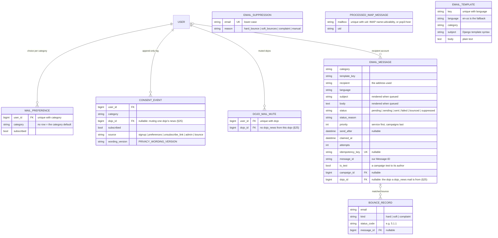
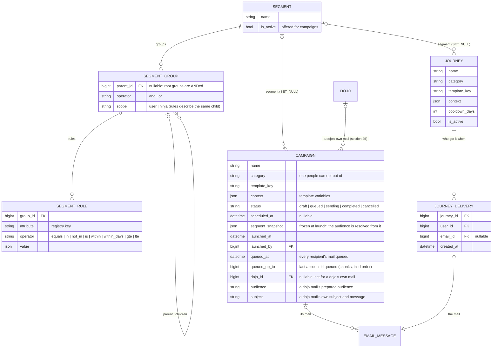
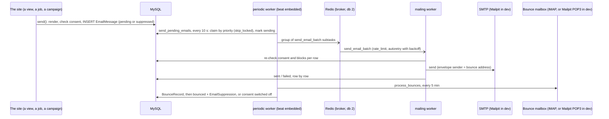
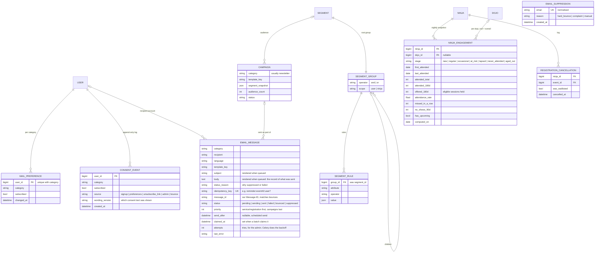
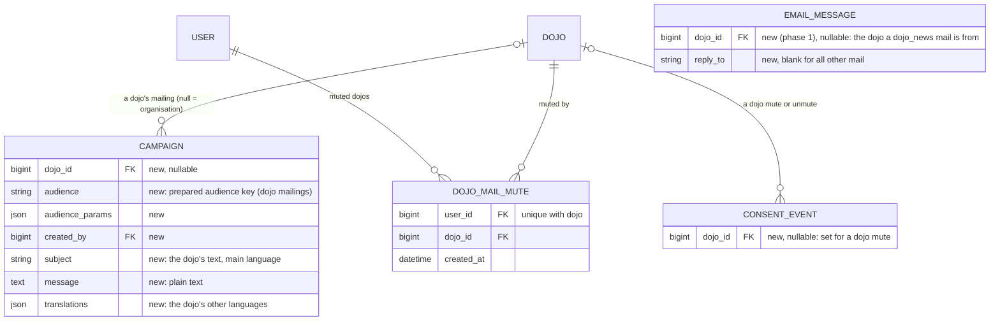

# Data model: mailing, segmentation and campaigns

Split out of `DATA_MODEL.md` §11 ("Mailing, segmentation and campaigns") and §25 ("Mail from a dojo to its families") because this subsystem's design history had grown to over 1,200 lines on its own. `DATA_MODEL.md` stays the index and the current-state reference; it links here for the mailing engine, segmentation, campaigns, journeys and dojo mail. Section numbers kept as in `DATA_MODEL.md` so existing "§11"/"§25" references elsewhere in the repo still resolve.

---

## 11. Mailing, segmentation and campaigns

> **Two apps since 2 October 2026.** The mail engine stays `mailing`
> (`EmailMessage`, templates, preferences and consent, mutes, bounces, the
> queue and the automated mail); `Campaign`, `Segment`, `SegmentGroup`,
> `SegmentRule`, `Journey` and `JourneyDelivery` moved to the `campaigns`
> app with the code that uses them, on top of the engine, which never
> imports it (`CODING_STANDARDS.md`, "Layers between the apps"). Only
> Django's state moved: the tables kept their names (`Meta.db_table`,
> `mailing_*`), and the content types were renamed, so permissions and
> audit-log entries follow. Below, `mailing.X` for one of those models or
> its code means `campaigns.X`.

Every mail the site sends goes through the `mailing` app: one gateway,
`mailing.services.send()`, queues it as an `EmailMessage` row, and two
Celery workers send it (see `CLAUDE.md`, "Background jobs" and "Mailing,
segmentation and the organisation dashboard"). Preferences and consent are
per account and kind of mail. The organisation runs campaigns, journeys,
segments and mail templates from its dashboard (`/manage/`). The account
side is `User.preferred_language` and `User.postal_code`, plus
`Ninja.gender` (section 2); the engagement figures segments use are in
section 4. This section first shows the models as built, then keeps the
plan they were built from, with its decisions.

### Consent, the queue and bounces

### Campaigns, journeys and segments

### How mail goes out

### Plan: mail preferences, sending, and engagement segments

> **Built.** Every phase below is done (see "Progress" under the
> implementation plan). The plan stays as the record of why things are the
> way they are; where the build differs from it, the progress notes and the
> diagrams above describe what was built.

This plan covers four things:
mail categories that people can opt in to and out of, one sending pipeline
that always enforces those choices, a segmentation engine built on
engagement data (who comes regularly, who is dropping off), and recording
a ninja's gender for the girls' sessions. The phases are listed at the end.

#### Principles

- **Consent is enforced by the engine, never by a segment.** Every send goes
  through one gateway, `mailing.services.send()`, the same way
  `notifications.services.notify()` works. The gateway checks the category,
  the recipient's preference and the suppression list. A segment only
  chooses *who might* get a campaign. It can't add someone who opted out.
- **Campaigns go to adults.** Ninja accounts (minors) never receive
  `newsletter` or campaign mail. Segments can describe *children* ("regular
  at dojo X, aged 10–12"), but the recipients are those children's
  guardians. A ninja who has their own login *with an email* does get the
  mail about their own bookings (`registration`, `reminder`, `dojo_news`)
  and manages those preferences themselves, like any account holder.
- **Measure engagement against the sessions a dojo actually runs.** A child
  who comes to every session of a monthly dojo is regular. The same child at
  a weekly dojo is occasional. So "regular" and "at risk" are ratios of
  sessions attended to sessions offered, and "missed in a row" counts
  sessions, not days.
- **Keep history in append-only logs**, like `BackgroundCheckHistory`:
  consent changes and cancellations get audit rows. Everything else stays
  plain state.

#### Mail categories

The categories are a code enum (`mailing.categories`, translatable labels),
not a table. Adding a category is a code change and a migration-free deploy.

| Category | Examples | Who gets it | Can opt out? | Default |
|---|---|---|---|---|
| `service` | password reset, background-check requests, account security | the account holder | no | always on |
| `registration` | signup confirmation, waitlist promotion, session cancelled or moved | guardians of the ninja, plus the ninja's own login if it has an email (their own bookings) | no (it's about a booking they made) | always on |
| `reminder` | "your session is on Saturday", "your background check expires in 30 days" | as above | yes | on |
| `dojo_news` | new sessions published at a dojo they've attended, updates from that dojo | guardians, plus the ninja's own login if it has an email | yes | on (soft opt-in, existing relationship) |
| `volunteer` | calls for mentors, team news for champions and mentors | adults with a membership or an application | yes | on |
| `newsletter` | CoderDojo Belgium newsletter, campaigns, girls' session promotions | adults | yes | **off, explicit opt-in** |

The "default" column is what applies when the account hasn't made a choice.
`service` and `registration` can't be switched off, but a hard bounce still
stops them, because the address doesn't work. `reminder` and `dojo_news`
being on by default is decided (see Decisions below). The newsletter always
needs an explicit opt-in.

#### Target model

> **Historical.** The plan's diagram, with the plan's field names (e.g. `audience_count`,
> `last_error`). The built tables are in "Consent, the queue and bounces" and "Campaigns,
> journeys and segments" above.

Changes to existing models:

- **`accounts.Ninja.gender`**: optional choices `girl`, `boy`, `other`
  and `unspecified` (the default, shown as "Prefer not to say"). Parents
  fill it in on the sign-up child rows, `add_ninja` and `edit_ninja`, with
  help text saying why it's asked (girls' sessions). It's optional and
  never shown publicly. *Done.*
- **`events.Event.audience`**: `everyone` (the default) or `girls`. Set on
  the `EventForm`, and shown as a "Girls' session" label on public event
  cards and on the dojo finder's next-session line. It **describes who a
  session is aimed at; it never restricts who can sign up.**
  `event_signup` doesn't look at it or at the child's gender, the same way
  it doesn't enforce `min_age`/`max_age` today. Its uses are promotion
  (segments that target girls for these sessions) and the engagement
  statistics below. *Done (the label, the form field, the admin filter).*
- **`events.Registration.created_at`** (it doesn't exist today). This gives
  signup lead time and recency of intent.
- **`events.RegistrationCancellation`**: a cancellation still deletes the
  `Registration`, so confirmed counts and waitlist logic stay as they are.
  It also writes a log row, so the signal survives for churn metrics.
- **`accounts.User.preferred_language`** (one of `LANGUAGES`, set from the
  active language at sign-up) so each mail goes out in the recipient's
  language. *Done: on the family sign-up form, defaulting to the page's
  language.*
- **`accounts.User.postal_code`** (optional, a Belgian postcode checked
  against `geo.Municipality`): where the family lives, for the locality
  attributes and as the dojo finder's default origin for a logged-in
  account (instead of Ghent). *Done: on the family sign-up form.*
- **`campaigns.SegmentRule.segment` → `group`**. *Done.* Root groups are
  ANDed, so a segment doesn't need exactly one root.

#### Sending pipeline: the database is the queue, Celery sends

Every mail, including password resets and background-check requests, is a
row in `EmailMessage` first. Celery beat jobs pick the rows up and send
them (the transactional outbox pattern). Nothing in a request ever talks to
SMTP, and nothing calls `send_mail` or `.delay()` to send a mail. **Celery
workers are therefore required wherever the site runs, production
included**: without them mail queues up but nothing goes out.

Why the database and not the Celery broker: the row is written in the same
transaction as the change that caused it, so a rolled-back signup never
sends a mail, and a committed one never loses it. The queue is also visible
and auditable in the admin, it survives a Redis flush, and campaigns,
retries and scheduled sends are all just rows.

1. **`send(recipient, category, template_key, context, idempotency_key=None,
   campaign=None, send_after=None)`** only *enqueues*. It checks the
   category's allowed audience, the preference (or the category default),
   the suppression list and the account type. If the check fails, it
   records the row as `suppressed`, so reports can show who was skipped
   and why. Otherwise it inserts a `pending` row and returns. It renders
   the template in the recipient's language right away, so the row holds
   the exact subject and body that go out (no context to serialise, and a
   later template edit doesn't change a queued mail). A duplicate
   `idempotency_key` is a no-op, so the reminder job can run twice safely.
   The row stores the category's `priority`: `service` and `registration`
   go before `reminder`/`dojo_news`, which go before campaign mail. A
   50 000-mail campaign can't hold up a password reset.
2. **`send_pending_emails`** (beat, every 10 s; the task in the current
   skeleton) is only a **dispatcher**. It doesn't send anything itself. In
   one short transaction it claims rows with `status=pending` and
   `send_after` empty or past, ordered by `priority` then `created_at`, up
   to `MAILING_CLAIM_LIMIT` per run. It uses
   `select_for_update(skip_locked=True)`, so two overlapping runs never
   claim the same row. It marks the claimed rows `sending` with
   `claimed_at=now`. After the commit, it splits the ids into chunks of
   `MAILING_BATCH_SIZE` and dispatches one **`send_email_batch(ids)`
   subtask per chunk** (a Celery `group`). A handful of mails is one
   subtask; a campaign is many.
   - Beat sends the dispatcher with `expires` about equal to its interval,
     so a worker that was down doesn't come back to hundreds of stale runs.
   - **Priority stays in the database.** Each run claims at most
     `MAILING_CLAIM_LIMIT` rows in priority order, so the broker never
     holds more than a few runs' worth of a campaign. A password reset
     queued behind a 50 000-mail campaign is claimed on the next tick,
     not after the campaign. The broker itself is first in, first out and
     sends at the rate limit, so what's in flight is what the next claimed
     mail waits behind: `MAILING_CLAIM_LIMIT` is two batches (20 seconds of
     sending; it was 200 rows, 100 seconds, until 2 October 2026).
3. **`send_email_batch(ids)`** sends one chunk over **one reused SMTP
   connection** (`django.core.mail.get_connection()`). **Celery handles
   rate limiting and retries**, so there's no hand-written backoff or
   throttle:
   - **Rate:** `rate_limit` on the task (from `MAILING_BATCH_RATE_LIMIT`,
     e.g. `"6/m"`). Throughput is then at most rate × batch size per
     worker, set to what the SMTP server allows. Celery enforces
     `rate_limit` per worker, so with more than one worker each gets its
     share of the SMTP limit.
   - **Retries:** `autoretry_for` the transient SMTP errors (connection
     refused or dropped, timeouts, 4xx replies), with
     `retry_backoff=True`, `retry_backoff_max=600`, `retry_jitter=True`
     and `max_retries=5`. A retried batch only sends rows still in
     `sending`. Each row is marked `sent` (`sent_at`, `message_id`) right
     after its own send, so a retry never mails someone twice.
   - **Permanent errors:** a permanent per-recipient failure (a 5xx for
     that address) marks just that row `failed` with `last_error`, and the
     rest of the batch carries on. When retries run out, the task's
     failure handler marks the batch's remaining `sending` rows `failed`.
     `attempts` counts tries per row, for the admin.
   - **Lost workers:** `acks_late=True` plus
     `task_reject_on_worker_lost=True`, so the broker redelivers a batch
     whose worker died mid-way.
   - For each row it sets our own `Message-ID` (stored as `message_id`, for bounce
     matching), and, for anything other than `service`/`registration`,
     adds `List-Unsubscribe` and `List-Unsubscribe-Post` headers (RFC 8058
     one-click unsubscribe, which Gmail/Yahoo require for bulk senders)
     plus a footer link.
   - **Safety net:** `requeue_stuck_emails` (beat, every 15 min) covers the
     case Celery can't: a subtask lost from the broker altogether, for
     example after a Redis flush. It puts rows left in `sending` longer
     than `MAILING_CLAIM_TIMEOUT` (1 h, above the broker's redelivery
     window) back to `pending`. Such a row could go out twice; that's
     accepted, because never sending is worse. It also logs how many rows
     are waiting and the age of the oldest `pending` row, so a stopped
     worker gets noticed.
4. **Bounces** (`process_bounces`, every few minutes): it reads DSNs from
   the bounce mailbox over plain **IMAP** (the production setup is classic
   SMTP to send and IMAP to receive, with no provider webhooks). It matches
   each DSN to our `message_id`, and to a VERP return path if the mailbox
   supports plus-addressing.
   - A permanent failure (5.x.x) marks the row `bounced` and adds an
     `EmailSuppression`. A complaint switches off the account's optional
     categories (`ConsentEvent(source=bounce)`) but doesn't block the
     address, so account and booking mail still arrive.
   - A temporary failure (4.x.x) only counts; three in 30 days suppress
     the address.
   - `ProcessedImapMessage` keeps each message from being handled twice.
5. **Unsubscribe**: a signed token (`django.core.signing`, user +
   category) at `/mail/unsubscribe/<token>/`, with no login needed. GET
   shows a confirmation page with an "unsubscribe from everything optional"
   option. POST applies it; that's also the one-click endpoint. The account
   page gets a **Mail preferences** card (`/account/mail/`) with a toggle
   per category that the account can receive.
   - **The privacy explanation lives on that card**, above the toggles
     (decided). It tells the parent what we use to pick relevant mails and
     that the toggles are how they choose. Approved wording (2026-09-25),
     to be translated into nl/fr with the card:

     > We use what we know about your family to send you mails that are
     > relevant to you: which sessions your children come to, their age
     > and gender, your postcode and your language. That's how you hear
     > about sessions at your dojo, a new dojo near you, or events like
     > Coolest Projects and CoderDojo Girlz. Below you choose which mails
     > you get. Mails about your account and your bookings are always sent.

     The same explanation is shown next to the newsletter opt-in on
     family sign-up, so consent is given knowing what it's for.
6. The existing direct `send_mail` in `applications.services` moves to
   `send(category=service)`. From then on, nothing calls `send_mail`
   directly.

#### Production: two Celery workers as a Level27 worker component

Level27 has Redis. The setup is kept lean: **two worker processes**, with
beat running inside the first one. Level27 doesn't let us install systemd
units, so they run as the project's **worker component** *celery*
(*Optioneel component* in the panel): one *Commando* per worker, each a
script in `~/.worker/<id>` that Level27 keeps running and starts again
when it stops, with output in `~/logs/worker-<id>/`. (Until 7 October 2026
they were systemd user units installed by `deploy.sh`; a deploy removes
those when it still finds them.)

| Worker | Runs | Queue | Concurrency |
|---|---|---|---|
| `periodic@…` | beat (embedded, `-B`) and the jobs beat triggers: `send_pending_emails` (the dispatcher), `requeue_stuck_emails`, `process_bounces`, later the nightly engagement rebuild | `periodic` | 1 |
| `mailing@…` | everything else: `send_email_batch`, `launch_campaign`, and any future task | `celery` (the default) | 1 |

- **Routing.** `CELERY_TASK_ROUTES` in the settings sends each
  beat-triggered task to `periodic`. Everything else stays on the default
  queue, so a new task needs no routing to work.
- **Why this split.** The 10-second dispatcher never waits behind a big
  campaign's batches. And with a single mailing process, the Celery
  `rate_limit` on `send_email_batch` is the real limit towards the SMTP
  server (Celery counts rate limits per worker).
- **Exactly one beat.** It runs only inside the periodic worker (`-B`,
  with the `DatabaseScheduler`), which runs once. Never add `-B` to the
  mailing worker, or every job fires twice.
- **Keep periodic jobs short.** With concurrency 1, a slow periodic job
  holds up the dispatcher. A heavy job, such as the nightly engagement
  rebuild, is started by beat but only enqueues its real work on the
  default queue.
- **The commands** live in the panel, not in the repo:
  - `cd /var/python/py10102/app && nice -n 10 celery -A website worker -n periodic@%h -Q periodic -c 1 -B --scheduler django_celery_beat.schedulers:DatabaseScheduler --max-tasks-per-child 100 --max-memory-per-child 160000 -l WARNING`
  - `cd /var/python/py10102/app && nice -n 10 celery -A website worker -n mailing@%h -Q celery -c 1 --max-tasks-per-child 100 --max-memory-per-child 160000 -l INFO`
  - The `cd` is needed: the scripts start in the home directory, where
    `celery -A website` can't find the project. The settings read
    `~/app/.env` themselves (`environ.Env.read_env`). `celery` comes from
    the PATH the scripts get from `~/.bashrc`, the pyenv env daphne runs
    from.
  - The periodic worker logs at WARNING: at INFO its 10-second dispatcher
    alone wrote about 6 MB a day (`CAPACITY.md`, "Disk").
- **Sharing the machine with the website.** The web server, both workers
  and Redis all run on the same Level27 system and share its memory, so
  the website must win:
  - Concurrency 1 with the prefork pool: per worker, one parent process
    plus one child that runs the tasks, and embedded beat is a process of
    its own on the periodic worker: five Python processes in total (about
    420 MB PSS together when idle, measured in `CAPACITY.md`). The `solo` pool would halve that, but it can't
    enforce `CELERY_TASK_TIME_LIMIT`, and a hung SMTP or IMAP connection
    would then block the queue for good. Prefork is worth the extra
    process.
  - `--max-memory-per-child 160000` (160 MB) and `--max-tasks-per-child 100`
    recycle the child before it grows. An idle child is about 143 MB (all
    of Django), so it's replaced after any task that grew it by more than
    about 17 MB (in practice the nightly engagement rebuild and big
    campaign chunks); a big campaign resolve or engagement rebuild can't
    keep its memory afterwards. 200 MB (until 7 October 2026) let two
    children grow past what the component has room for.
  - `website.celery.freeze_before_fork` calls `gc.freeze()` in the parent
    before every fork, so the children (and embedded beat) keep sharing
    the parent's loaded Django instead of copying it as the garbage
    collector touches it.
  - The component has a memory limit of its own, for both workers together:
    the kernel slows them down and swaps above 512 MiB (`memory.high`) and
    kills them above 563 MiB (`memory.max`). Measured on 7 October 2026:
    411 MiB idle (PSS: periodic main 74, embedded beat 102, its child 68;
    mailing main 85, its child 79), and every job but the engagement
    rebuild (33 MB) needs 1.4 MB or less (`MEMORY_PROFILE.md`): the memory
    is the five processes that each load Django, not the work.
  - Batches and campaign launches work in chunks (`MAILING_BATCH_SIZE`,
    bulk inserts per chunk, `.iterator()` over audiences), never a whole
    audience in memory.
  - `EMAIL_TIMEOUT` and an IMAP timeout are set, so a stuck connection
    fails and retries instead of hanging.
  - `nice -n 10` on both: under CPU pressure, web requests go first.
- **Restarting on a deploy.** `deploy.sh` sends SIGTERM to each worker's
  main process: Celery's warm shutdown, the worker finishes the task in
  hand and stops taking new ones; Level27 then starts it again on the new
  code, and the deploy waits until both answer a ping. If one is killed
  anyway, `acks_late` means the broker hands the batch out again, and rows
  already marked `sent` are skipped.
- **Redis.** Each use gets its own db: the cache on 0, Channels on 1, the
  Celery broker on 2 (today the broker shares 0 with the cache; that's
  phase 1). If Level27's Redis needs a password or a unix socket, the
  settings get one `REDIS_URL`-style setting shared by all three instead
  of the separate `REDIS_HOST`/`REDIS_PORT`.
- **`deploy.sh`.** After `migrate` and the gunicorn reload, it:
  - installs or updates the unit files, then runs `daemon-reload`
  - restarts both workers, so they run the new code (a stale worker means
    "unregistered task" errors)
  - checks both with `celery -A website inspect ping`

  `--check` reports whether both units are active.
- **Dev mirrors production.** `start.sh` starts the same two workers (with
  the same `-Q`, and `-B` on the periodic one) instead of today's single
  worker plus separate beat. A routing mistake then shows up in dev as a
  task nobody picks up, not first in production.
- **Monitoring.** `requeue_stuck_emails` logs the queue length and the
  age of the oldest `pending` mail, as a warning when mail has been
  requeued or has waited over 30 minutes (so it still shows at the
  periodic worker's WARNING level). Watching that is enough to notice a
  stopped worker; `/health/` and `/metrics/` show it too (§26).

#### Segmentation engine

- **Scopes.** A `SegmentGroup` has a `scope`. In a `ninja` group, every
  rule applies to *the same child*: "a girl, aged 10–14, regular at
  dojo X" means one child who is all three. The group resolves to a `Ninja`
  subquery and is then projected to that child's guardians. A `user` group
  filters accounts directly (role, language, joined date, …). The UI and
  admin can then say "Parents of a child who …".
- **One subquery per rule.** Each rule becomes `pk__in=<subquery>` or
  `Exists(...)`. Rules are never joins in one `.filter()`, so two rules on
  the same relation no longer have to match the same row.
- **Typed operators.** Each attribute declares a `value_type`, and that
  fixes the valid operators:
  - `choice`: `equals`, `in`, `not_in`
  - `number`: `gte`, `lte`, `between`
  - `date`: `before`, `after`, `within_last_days`
  - `bool`: `is`

  `SegmentAttribute.validate(operator, value)` runs in `SegmentRule.clean()`,
  so a bad rule fails when it's saved, not when the campaign is launched.
- **Relative values stay relative** ("within the last 90 days", "aged
  10–12"). They're evaluated when the segment is resolved, so a saved
  segment keeps its meaning. When a campaign launches, the definition is
  stored in `segment_snapshot` and the resolved audience becomes the
  campaign's `EmailMessage` rows.
- **Guard rails.** A segment with no rules can't be launched. The admin
  shows the audience count and a sample before launch, and a test send goes
  to the sender first. The engine always excludes people who opted out,
  suppressed addresses and ninja accounts.

#### Engagement snapshot (`events.engagement`)

This lives in `events`, not `mailing`, because dojo dashboards will want it
too. A nightly beat task rebuilds `NinjaEngagement`: one row per ninja
overall (`dojo = null`) and one per dojo the ninja attended in the last 365
days.

- **Offered sessions** are events at that dojo that aren't drafts, have
  already started, fall inside the window, and that
  `events.engagement.is_aimed_at(ninja, event)` says were meant for the
  ninja (age range, and `audience=girls` only for gender `girl`). This is
  statistics only: a boy who skips a girls' session isn't counted as
  missing it, but a boy who *does* attend one counts as attended like any
  other session.
- **Attended** means `attended=True`. For an event where the dojo marked
  **no one** at all, a confirmed registration counts as attendance.
  Otherwise dojos that don't take attendance would make every child look
  lapsed. The snapshot records which of the two the numbers are based on.
- **Stages**, with defaults kept as constants in one place (tunable):

| Stage | Rule (window: last 180 days at the ninja's main dojo) |
|---|---|
| `new` | first attendance within the last 60 days, or at most 2 sessions attended ever |
| `regular` | at least 3 sessions attended and `attendance_rate ≥ 0.5` |
| `occasional` | attended in the window, but below the regular threshold |
| `at_risk` | was regular or occasional, and `missed_in_a_row ≥ 3` (the last 3 sessions offered, missed) |
| `lapsed` | attended before, but not in the window |
| `never_attended` | has an account or registrations but never attended (includes no-show-only) |
| `aged_out` | 18 or older, or older than every age range the dojo offers |

  The **main dojo** is `Ninja.home_dojo` if set, otherwise the dojo with
  the most attendance in the last 365 days.
- **Later phase:** `NinjaEngagementChange` rows record stage transitions
  ("became `at_risk` this week"), so journeys can trigger on the change
  instead of mailing the same people every night.

#### Segmentation attributes to build

In priority order. Each one is a `SegmentAttribute` in
`campaigns/segmentation/attributes/` plus a registry entry.

**Tier 1 — direct data, build first**

Built so far (2026-09-25): `account_type`, `has_children` (the account is a
guardian), `language`, `province`, `near_dojo`, `ninja_gender`, `event`
(the table's `registered_for_event`) and `attended_event`. Locality comes
from the family's own postcode, not the child's home dojo.

Two activity attributes from Tier 2 are also built already, working
directly on registrations until the `NinjaEngagement` snapshot exists.
They share the same N-day window:
- `active_team_member` (user, `within_days` N): an active champion or
  mentor membership at an active dojo that held a non-draft session in the
  last N days.
- `attended_within_days` (ninja, `within_days` N): came to a session in the
  last N days. That means marked present, or a confirmed place at a session
  where the dojo marked nobody.

The seeded **"Everyone active"** segment is the OR of the two, with N = 365
(`ACTIVE_WITHIN_DAYS` in `mailing/seed_templates.py`).

| Key | Scope | Type | Built from | Typical use |
|---|---|---|---|---|
| `ninja_gender` | ninja | choice | `Ninja.gender` | promote girls' sessions |
| `ninja_age` | ninja | number | `date_of_birth`, at resolve date | age-appropriate pathways, events |
| `ninja_home_dojo` | ninja | choice | `home_dojo` | dojo news |
| `province` | user | choice | `User.postal_code` inside a province polygon, or `brussels` | regional events |
| `near_dojo` | user | {dojo, km} | `DistanceSphere` from the postcode's municipality centres to `dojo.location` | new dojo opened nearby, a dojo went dormant |
| `current_belt` | ninja | choice (level ≥/≤) | `Ninja.current_belt` | pathway suggestions |
| `has_badge` | ninja | choice | `NinjaBadge` | celebrate a milestone |
| `pathway` | ninja | choice | `Registration.pathways` | "next step" pathways |
| `registered_for_event` | ninja | choice | `Registration` (the existing `event` attribute, fixed) | event follow-up |
| `attended_event` | ninja | choice | `Registration.attended=True` | thank-you, survey |
| `waitlisted_for_event` | ninja | choice | `Registration.waiting_list` | "extra session added" |
| `account_role` | user | choice | guardian / mentor / champion / organisation (memberships, roles) | volunteer mail |
| `language` | user | choice | `preferred_language` | per-language campaigns |
| `joined` | user | date | `date_joined` | welcome series |

**Tier 2 — engagement (reads `NinjaEngagement`)**

| Key | Type | Meaning |
|---|---|---|
| `engagement_stage` | choice (optional dojo) | new / regular / occasional / at_risk / lapsed / never_attended / aged_out |
| `sessions_attended` | number + window | attended in the last N days |
| `attendance_rate` | number | share of offered sessions attended |
| `missed_in_a_row` | number | offered sessions missed since the last visit |
| `days_since_last_visit` | number | recency |
| `no_shows` | number + window | registered, marked absent |
| `has_upcoming_registration` | bool | exclude people who already signed up from "sessions are open" mail |
| `main_dojo_status` | choice | families whose dojo went dormant or archived → "find another dojo near you" |
| `cancellations` | number + window | from `RegistrationCancellation` |

**Tier 3 — later, once there's enough history**

- `stage_changed` (from → to, within N days), for triggered journeys:
  "we miss you" when a child becomes `at_risk`, "welcome back" when a
  `lapsed` child returns.
- `belt_stalled`: regular, but no new belt in 12 months → suggest a
  different pathway.
- `approaching_age_out`: turns 16–17 or is regular in the oldest pathway →
  youth mentor recruitment.
- Volunteer side: mentors not on any `Event.team` in 90 days, and dojos with
  no event in 6 months (the dormancy nudge's data, as a segment).
- A weighted churn score, only once rule-based stages have been validated
  on real data. No ML before that.

Example segments these make possible:
- *At-risk regulars at dojo X*: `engagement_stage(dojo=X) = at_risk`.
- *Girls near Ghent, for a girls' session*: `ninja_gender = girl` AND
  `ninja_age between 9 and 14` AND `near_dojo(Ghent, 25 km)` AND NOT
  `has_upcoming_registration`.
- *Lapsed after their dojo went dormant*: `main_dojo_status = dormant` AND
  `engagement_stage = lapsed`.

#### Implementation plan

Each phase ships with tests (the repo rule) and updates this section and
`CLAUDE.md`. Phases that change what users see also update `docs/`
(en/fr/nl).

**Progress (2026-09-25).** Parts of several phases are in place:
- phase 1: done. Segment models and migration, admin registrations,
  correct task names, a broker db of its own, the two queues and workers
  (also in `start.sh`), and the scaffolding (`test_mail`, the hourly test
  task, the old reminders draft) removed
- phase 2: done. `Ninja.gender` on the family forms (sign-up rows, add and
  edit a child) and `Event.audience` with its "Girls' session" label on the
  public pages. Seeders mark some upcoming sessions as CoderDojo Girlz
- phase 3: done in the code, not in production yet.
  - Consent: `MailPreference`, `ConsentEvent`, `EmailSuppression`.
  - The `send()` gateway and the queue tasks (dispatcher, batches with
    Celery rate limit and retries, the stuck-mail check), verified end to
    end against Mailpit.
  - The Mail preferences page with the approved explanation, one-click
    unsubscribe (tested through nginx), and the newsletter opt-in on
    sign-up.

  The production side is done: the two workers run as Level27's worker
  component, and every `deploy.sh` run restarts and pings them (it fails
  if they don't come back). **Every mail goes through the engine** (decided
  2026-09-25): the onboarding mails and the password reset are `service`
  templates too, so production mail depends on the workers running.
- phase 7: scopes, a subquery per rule, rule validation, the admin
  audience preview, and the Tier 1 attributes listed above
- phase 8: three seeded draft campaigns (`seed_mailing`)

- phase 4: done in the code. `process_bounces` reads the bounce mailbox
  over IMAP (production) or POP3 (Mailpit in the devcontainer), parses
  DSNs, complaint reports and plain-text bounces, and records a
  `BounceRecord` for each.
  - hard bounce: the mail is marked `bounced` and the address blocked
  - soft bounces: counted; the limit within the window blocks the address
  - complaint: all optional mail is switched off, nothing is blocked

  Every mail goes out with the bounce address as envelope sender.
  `simulate_bounce` exercises the whole path against Mailpit.

- phase 5: done.
  - booking mail at sign-up (confirmed, or the waiting-list notice)
  - a mail when a child moves up from the waiting list
  - the reminder two days before (daily, 09:00)
  - "new sessions at your dojo" (daily digest, 17:00)

  All go to the whole family. `Event.published_at`/`announced_at` drive
  the digest (existing sessions were marked announced by the migration).
  `load_mail_templates` runs on every deploy.

- phase 6: done. `events.NinjaEngagement`, rebuilt nightly
  (`events/engagement.py`, 03:00), with stages as specified above and the
  stage shown on the dojo team's attendance rows. `Registration.created_at`
  and the `RegistrationCancellation` log are in place too.
- phase 7: done. The segment builder is in the organisation dashboard,
  with every Tier 1 attribute (as `account_role`, `joined_within_days`,
  `ninja_age`, `ninja_home_dojo`, `current_belt`, `has_badge`, `pathway`,
  `waitlisted_for_event`, `cancellations`) and the Tier 2 attributes on
  the snapshot.
- phase 8: done, in the organisation dashboard (`/manage/`), not the
  Django admin.
  - campaigns: create, preview, test, launch or schedule, cancel, results
  - the segment is frozen at launch and the audience resolved from it
  - consent and blocks are re-checked right before each mail goes out

- phase 9: done. `NinjaEngagementChange` records stage changes night by
  night, the `stage_changed`, `no_new_belt_within_days` and
  `not_on_team_within_days` attributes are built, and journeys
  (standing, triggered campaigns with a cool-down) are run from the
  organisation dashboard every day at 18:00. The weighted churn score
  stays for later, as planned, once the rule-based stages have been
  checked against real data.
- Mail templates can be edited in the organisation dashboard too.

`User.postal_code`, with the dojo finder starting from it, came in on
the side.

1. **Foundations.** Fix the current skeleton so it's coherent:
   - `SegmentRule.group`, `SegmentGroup.scope` and the pending
     `SegmentGroup` migration
   - rename `mailer.tasks` → `mailing.tasks` in `CELERY_BEAT_SCHEDULE`
   - remove the broken imports, the `test_mail` command and the `test` beat task
   - give the Celery broker its own Redis db
   - register the models in the admin

   No behaviour yet.
2. **Ninja gender and girls' sessions.** Add `Ninja.gender` and
   `Event.audience` (a label, no signup restriction), and show the label on
   the public event pages and the widgets. Update the
   family forms, the event form, the seeders (a realistic mix) and the
   admin list filters. Docs: the family "add a child" page and the dojo
   team's event-creation page. This phase doesn't depend on mailing and
   can ship first.
3. **Categories, preferences, suppression, gateway.**
   - `mailing.categories`, `MailPreference`, `ConsentEvent`,
     `EmailSuppression`, `User.preferred_language`
   - the `send()` gateway, the upgraded `EmailMessage`, and templates per
     language
   - the Mail preferences card, the newsletter opt-in checkbox (unticked)
     on family sign-up, and the signed unsubscribe page
   - the `send_pending_emails` / `requeue_stuck_emails` beat jobs (claim,
     dispatch into `send_email_batch` subtasks, priority, `send_after`, Celery `rate_limit` and autoretry) and one-click
     unsubscribe headers
   - run the two workers in production (Level27's worker component), with SMTP and IMAP
     credentials in `~/app/.env` (see "Production: two Celery workers as a
     Level27 worker component"), and the same two in `start.sh`
   - then move `applications.services` mail to `send()`. Only once the
     production worker runs, because that mail is queued from then on.

   Docs: a new "Mail preferences" help page.
4. **Bounces.** `process_bounces` over IMAP into `bounced` rows and
   suppression.
5. **First automated mails** (these deliver value before campaigns do):
   - a session reminder two days before (`reminder`, daily beat,
     idempotency key per event and ninja)
   - a waitlist-promotion email next to the existing notification
     (`registration`)
   - "new sessions at your dojo" (`dojo_news`, when an event is published)
6. **Engagement data.** Add `Registration.created_at` and
   `RegistrationCancellation`, and build the nightly `NinjaEngagement`
   rebuild with the stage rules above. Show the stage on the dojo
   dashboard's attendance rows as a first consumer, which also shows the
   thresholds against real dojos.
7. **Segmentation engine v2 and the Tier 1 and 2 attributes**: scopes,
   subquery per rule, typed operators, validation, preview count. Build
   segments in the Django admin (inline groups and rules) for now.
8. **Campaigns end to end.** Only the organisation `admin` role (never
   `board`, never champions) writes a campaign
   (category, template, segment), previews it, test-sends it, then
   launches. Launch is itself a Celery task (`launch_campaign`): it
   freezes `segment_snapshot`, resolves the audience and inserts the
   `pending` rows at campaign priority, one chunk of
   `MAILING_CAMPAIGN_CHUNK_SIZE` accounts per task (since 2 October 2026):
   each task queues the next behind whatever waits by then, so booking mail
   waits for one chunk, never for the whole campaign, and
   `Campaign.queued_up_to` is where it got (a resume carries on from there;
   a task whose cursor is out of date stops, so only one chain runs). The same queue then sends
   them within the Celery rate limit. Scheduling a campaign sets `send_after`. Per campaign, report sent, suppressed, bounced
   and unsubscribed.
9. **Tier 3**: stage-change history, triggered journeys, and volunteer
   segments.

#### Decisions (2026-09-25)

1. **Gender, not sex.** The field is `Ninja.gender`: `girl`, `boy`,
   `other`, `unspecified` ("Prefer not to say").
2. **Girls' sessions are a label, not a limit.** `Event.audience=girls` is
   used for promotion and statistics. Nothing stops any child from signing
   up.
3. **Only the organisation `admin` role sends campaigns.** Champions don't;
   dojo-level mail stays automatic (`dojo_news`, reminders). §25 plans a
   narrow exception: a dojo's own `dojo_news` mail to its own families,
   with audiences prepared in code.
4. **`reminder` and `dojo_news` are on by default** for existing families.
   The newsletter is explicit opt-in.
5. **Mail infrastructure is classic SMTP (send) and IMAP (bounces).** No
   provider webhooks; bounce handling reads the mailbox.
6. **The engagement thresholds are accepted as a starting point:** regular
   = at least 50% of offered sessions over 6 months, at risk = 3 missed in
   a row. They stay constants in one place, to tune once real data comes in.
7. **Ninjas with their own login decide for themselves.** From the moment
   they have an account with an email, they get the mail about their own
   bookings and manage those preferences on their own account page.
   Campaigns and the newsletter still go only to adults.
8. **Celery is the mail engine and the database is the queue, for every
   mail** (including password resets and background-check mail). Every mail
   is an `EmailMessage` row first. The `send_pending_emails` beat job claims
   and dispatches them as `send_email_batch` subtasks. Celery handles the
   rate limiting and the retries, and nothing sends mail directly from a
   request. See
   "Sending pipeline" above.
9. **Production runs Celery as a Level27 worker component, with Level27's Redis as the
   broker. Kept lean: two workers.** A periodic worker with beat embedded
   runs the scheduled jobs; a mailing worker runs everything else. Each has
   concurrency 1, and both share the machine's memory with the website, so
   they recycle their child processes and run at lower priority. See "Production: two Celery workers as a Level27 worker component"
   above.
10. **The privacy explanation goes on the parent's Mail preferences card**,
    above the opt-in/out toggles, and next to the newsletter opt-in on
    sign-up. It says we use the family's data (sessions attended, the
    children's age and gender, postcode, language) to send relevant mails.
    The approved wording is under "Sending pipeline", step 5.
11. **"Everyone active"** means champions and mentors with an active
    membership at an active dojo that held a session in the last N days,
    plus parents of a child who came to a session in the last N days, with
    the same N for both (365 for now).
12. **Day-to-day work happens in the management dashboards; the Django
    admin stays fully usable** for technical interventions and emergencies,
    so nobody ever needs direct database access. Campaigns and segments are
    run from the organisation dashboard (`/manage/`) and keep their full
    admin pages.

#### Still open

- **Level27 details for the Celery workers** (see "Production: two Celery
  workers as a Level27 worker component"):
  - How to reach Redis: host/port or a unix socket? Is there a password?
    Which db numbers can we use?
  - Is the worker component's 512 MB limit enough for both workers, and
    are `~/logs/worker-<id>/` rotated?
- **Review the `account_type` attribute.** The resolver already limits every
  audience to active adult accounts, so `account_type = adult` changes
  nothing and `= ninja` always matches nobody. No seeded segment uses it
  any more ("Everyone active" is now built from the activity attributes),
  but it's kept for now. Likely replacement: the Tier 1 `account_role`
  attribute (guardian / mentor / champion / organisation).

---

## 25. Mail from a dojo to its families (built)

**Phase 1 built** (muting one dojo): `mailing.DojoMailMute`,
`ConsentEvent.dojo` and `EmailMessage.dojo`, `mailing.preferences.set_dojo_mute`,
`send(dojo=...)` (checked again by the workers before sending), the
dojo in the unsubscribe token, *Your dojos* on Mail preferences and
`mailing/dojo_families.py` (the one definition of a dojo's families,
used by `announce_new_sessions` too). **Phases 2 and 3 built** (the
audiences and dojo mailings on `Campaign`): `campaigns/dojo_audiences.py`
(`AUDIENCES`, `clean_params`, `definition`, `describe`, `reach`), the
attributes in `campaigns/segmentation/attributes/dojo.py` (`dojo_family`,
`ninja_of_dojo`, `family_booked_for_event`, `family_waitlisted_for_event`,
and `family_visited_dojo`, which `in_builder = False` keeps out of the
organisation's builder), `SegmentResolver(require_consent=False)` for the
"left out" count, the `Campaign` fields, the `dojo_message` template, the
dojo branch in `campaigns/services.py` and `EmailMessage.reply_to`. Where
the build differs from the text below: like every campaign, a dojo
mailing reaches **adults only** (the resolver's rule), so a child's own
login doesn't get it; and an audience about a session reaches the
families with a place there even when the child isn't otherwise one of
the dojo's (a visitor), instead of being ANDed with "family of this
dojo". **Phase 4 built** (the dojo's *Mail* pages, `campaigns/dojo_views.py`,
`SEND_MAIL`); a mailing is sent right away, there's no scheduling yet.
**Phase 5 built**: the organisation's *Campaigns* list shows every dojo's
mail (a *Sent by* column and filter), its page shows the dojo's text and
audience, and the organisation can only stop one that's going out.
**Phase 6 built** (Dutch and French, help pages
`dojo-team/mailing-your-families`, `organisation/campaigns`,
`families/mail-preferences`; `seed_mailing` seeds a sent and a draft mail
for the first public dojo with families, giving it its champion's address
when it has none). **Added after the plan, on request: the dojo's own
*Mail queue*** (`/dojos/<id>/manage/mail/queue/`,
`campaigns.dojo_views.dojo_mail_queue`, every role): the organisation's
*Mail queue* narrowed to the dojo's `dojo_news` mail (its mailings, the
automatic new-sessions mail, tests), per mail waiting / sent / not
delivered / held back and why held back in words
(`HELD_BACK_REASONS`, from the reason constants in `mailing.services`),
plus the same "mail isn't going out" warning (`mailing/queue_status.py`,
shared with the organisation's page). True to decision 10 it shows
numbers, never addresses, and never a failure's own text (which can
hold one). The
decisions below were confirmed on 2026-09-29. This reverses §11's
decision 3 ("Champions don't send campaigns; dojo-level mail stays
automatic") in part: a dojo's team gets **a narrow slice** of the mail
engine, enough to write to the families of *its own* dojo, with audiences
prepared in code for that dojo. They never get the segment builder, the
organisation's templates, other dojos' families or the newsletter.

What a champion wants to do, in practice: "we're closed next Saturday",
"bring a laptop charger", "our summer session is open, tell the families
who came this year", "we miss you" to children who stopped coming, "next
session is for the 12+ group". Today the only way is the dojo's own mailing
list outside the site, or asking the organisation.

### What the code does today, and what that means

- **The engine is ready for it.** `mailing.services.send()` checks
  category, preference, account type and blocks for every mail, so a
  dojo's mail can't reach someone who opted out as long as it goes through
  it. `Campaign` already has the whole pipeline: `launch()` freezes a
  segment definition in `segment_snapshot`, `queue_mail` queues through
  `send()` with an idempotency key, `cancel`, `send_test`, `stats`. A
  dojo's mailing can be a `Campaign` with a dojo on it, not a new
  pipeline.
- **The resolver takes a definition, not only a `Segment` row**
  (`SegmentResolver.resolve_definition`). A prepared audience can build
  that definition in code for one dojo and never exist as a `Segment` row
  a dojo team could edit. The dojo-scoped attributes already exist:
  `ninja_home_dojo`, `engagement_stage_at_dojo`, `event`,
  `attended_event`, `waitlisted_for_event`, `ninja_age`, `pathway` (all
  `ninja` scope).
- **Consent comes in two kinds today, and both apply:**
  - *Which mail* (`MailPreference` per account and category, `ConsentEvent`
    log). `dojo_news` ("New sessions and news from the dojos your family
    goes to") is on by default and can be switched off. That's exactly the
    kind of mail this is.
  - *Using the child's details to choose mail* (`Guardianship.consent_given_at`,
    `accounts.consent`, §16): a `ninja` group in a segment only selects
    guardians who gave it. Every prepared audience that picks children by
    their details (age, stage, pathway) goes through a `ninja` group, so
    it gets this check for free.
- **"A family of this dojo" is already defined once**, in
  `mailing.automated.announce_new_sessions`: a child with it as home dojo,
  or who came to one of its sessions in the last
  `MAILING_DOJO_NEWS_ACTIVE_DAYS`; guardians plus the child's own login
  with an email. That automated mail uses no child-data consent (it's the
  existing relationship, like a booking). The dojo's own mail should use
  the **same** definition, moved to one helper.
- **Preferences are per category, not per dojo.** A family at two dojos
  can only switch off `dojo_news` for both. With dojos writing their own
  mail, "not this dojo" becomes necessary.
- **Templates are Django template syntax** and only the organisation
  writes them. A dojo team must not write template code (it can read
  every variable in the context, and it's a support burden); their text
  is plain text, inserted as a variable into one organisation template.
- **`EmailMessage` has no Reply-To.** Mail goes from `DEFAULT_FROM_EMAIL`.
  A family answering a dojo's mail should reach the dojo (`Dojo.email`,
  the public contact address), not the organisation's noreply.
- **Dojo access is capabilities** (`dojos/access.py`). Sending to every
  family acts for the whole dojo, like the API clients (`MANAGE_API`,
  champion only).

### Decisions

1. **Only `dojo_news` mail, only to the dojo's own families.** A dojo's
   mailing always has category `dojo_news`; the dojo team can't pick
   another. Families who switched `dojo_news` off, or muted this dojo
   (decision 5), never get it. Newsletter, volunteer and campaign mail
   stay the organisation's.
2. **Prepared audiences, no segment builder.** A dojo picks one audience
   from a fixed list in code (`campaigns/dojo_audiences.py`), each a
   function `(dojo, params) -> segment definition` in the resolver's
   format, always starting from "families of this dojo". Proposed list:

   | Audience | Parameters | Child-data consent needed? |
   |---|---|---|
   | All families of the dojo | — | no (existing relationship, as today's automated `dojo_news`) |
   | Families booked for a session | one of the dojo's upcoming sessions; include waiting list yes/no | no (it's about their booking) |
   | Families on the waiting list of a session | a session | no |
   | Families who came recently | within 90 / 180 / 365 days | no |
   | New families | first visit within 90 days | yes (engagement) |
   | "We miss you" | stage at this dojo: at risk, lapsed | yes |
   | Children in an age range | min–max age (within the dojo's own range) | yes |
   | Children on a pathway | one of the dojo's pathways | yes |

   "Needs consent" audiences are built with a `ninja` group, so the
   resolver only picks guardians who gave it; the page says how many
   families it reaches and that some aren't counted because they didn't
   agree. **Gender, belts, badges, cancellations and no-shows are not
   offered to dojos** (decided): they're the most sensitive profiling
   and a dojo has no need to target on them. Adding an audience later is a
   code change, reviewed like any other.
3. **The audience is always limited to the dojo**, whatever the
   parameters: every definition ANDs a root group "family of this dojo"
   (a new `dojo_family` attribute, `user` scope, `{"dojo": id, "days":
   MAILING_DOJO_NEWS_ACTIVE_DAYS}`, the helper from
   `announce_new_sessions`), and a session or pathway parameter is checked
   to belong to the dojo (another dojo's → the form refuses it). The
   `dojo_family` attribute is also registered for the organisation's
   builder.
4. **A dojo mailing is a `Campaign` with `dojo` set.** New fields:
   `Campaign.dojo` (FK, null = the organisation's), `audience` (the
   prepared audience's key) and `audience_params` (JSON), `created_by`,
   and the dojo's text: `subject` and `message`, a
   `TranslatableModel` in the dojo's languages (§19: main language in the
   columns, others in `translations`). `template_key` is fixed to
   `dojo_message`, an organisation `service`-owned template (in
   `SYSTEM_TEMPLATE_KEYS`) that wraps the text: greeting, the dojo's name,
   the message, "you get this because your child goes to <dojo>", the
   mute and unsubscribe links. The recipient gets the version in their
   `preferred_language` when the dojo wrote one, else the dojo's main
   language. The text is passed as a context variable, never rendered as
   a template. `launch()` freezes the audience's definition in
   `segment_snapshot` as now, so the pipeline, stats, cancel and the
   engine's checks are unchanged.
5. **Muting one dojo.** A new `mailing.DojoMailMute` (user, dojo,
   created_at; unique) plus a nullable `dojo` on `ConsentEvent`, written
   only through `mailing.preferences.set_dojo_mute(user, dojo, muted,
   source)`. `send()` gets a `dojo=` argument; a muted dojo suppresses
   with reason "muted this dojo". It applies to **all** of a dojo's
   `dojo_news`, the automated "new sessions" mail included. The
   unsubscribe page for a dojo mail offers three choices: stop mail from
   this dojo, stop all dojo news, stop everything optional. Mail
   preferences lists the family's dojos with a switch each.
6. **Who sends: a new capability `SEND_MAIL`** (`dojos/access.py`).
   Champion only (decided), like `MANAGE_API`: it speaks for the whole
   dojo. Anyone with dojo access can
   see the list of past mailings.
7. **Reply-To is the dojo.** `EmailMessage.reply_to` (new, blank for all
   other mail), set to `Dojo.email`; launching needs a dojo email (a
   launch problem otherwise). The From address stays the organisation's
   (SPF/DKIM), with the dojo's name as display name ("CoderDojo Gent via
   CoderDojo Belgium").
8. **Limits against overuse:** at most `MAILING_DOJO_MAILINGS_PER_30_DAYS` = 4
   launched per dojo (decided), a message length limit, and plain
   text only (links are fine; no attachments, no images). A test mail to
   the sender is always allowed and doesn't count.
9. **No approval by the organisation before sending** (decided). The
   organisation sees every dojo mailing on its *Campaigns* page (a Dojo
   column and filter, read-only except *Cancel*), can cancel one that
   hasn't gone out, and the audit log records the campaign. Approval per
   mailing would make "we're closed tomorrow" useless.
10. **What the dojo team sees about the audience:** the number of families
    it reaches (and how many aren't counted for lack of consent), never a
    list of addresses. They already see the children's names on their
    attendance lists; the addresses stay with the engine.
11. **Organisation dojos** (§12) can use it the same way: their team
    writes to the families who came to their events (decided).
12. **Journeys stay the organisation's** for now (a dojo's "we miss you"
    is a one-off mailing, not a standing one). Possible later.

### Model changes

Each new field gets its privacy classification (§16: `DojoMailMute` is
`identity` with `subjects`, erased with the account; the message text is
the dojo's content, not personal) and its place in `core.audit.RECORDED`.

### Screens

- **Dojo area, *Mail* in the sidebar** (`/dojos/<id>/manage/mail/`,
  `campaigns/dojo_views.py`, `require_dojo_access(..., SEND_MAIL)` for
  writing, any role for the list): past and draft mailings with their
  results (sent, not delivered, unsubscribed from this dojo).
- **New mailing** (`/dojos/<id>/manage/mail/new/`): pick an audience (a
  radio list with a sentence each; its parameters appear via htmx), the
  live count, subject and message per dojo language
  (`add_translation_fields`), preview as the family sees it, *Send me a
  test*, *Send* (or schedule). After launch it's read-only with a
  *Cancel* while mail is still waiting.
- **Family side:** *Mail preferences* gets "Your dojos" with a switch per
  dojo; the unsubscribe page for a dojo mail gets the three choices.
- **Organisation dashboard:** *Campaigns* shows dojo mailings with a Dojo
  column and filter; *Mail queue* unchanged.

### Phases

1. **Muting a dojo** (built): `DojoMailMute`, `ConsentEvent.dojo`, `EmailMessage.dojo`,
   `set_dojo_mute`, `send(dojo=...)` and the new suppression reason,
   `announce_new_sessions` passing its dojo, the *Mail preferences*
   switches and the unsubscribe page's choices. Useful on its own for the
   automated mail. Tests: muted dojo suppressed, other dojo still sent,
   consent log, token for a dojo mail.
2. **The audiences** (built): the `dojo_family` helper and attribute (shared with
   `announce_new_sessions`), `campaigns/dojo_audiences.py` with the list
   above, each audience limited to its dojo. Tests per audience: the right
   families, never another dojo's, consent-needing ones only with the
   child-data consent, ninja logins only where `dojo_news` allows them.
3. **Dojo mailings on `Campaign`** (built): the new fields, the `dojo_message`
   template (en/nl/fr in `mailing/seed_templates.py`, via
   `load_mail_templates`), `EmailMessage.reply_to` and the From display
   name, `launch_problems` for a dojo mailing (audience, dojo email, the
   30-day limit, text in the main language), `queue_mail` picking the
   text per recipient language. Tests: the text never rendered as a
   template, snapshot frozen at launch, idempotency, the limit.
4. **The dojo pages** (built): `SEND_MAIL` in `dojos/access.py`, the sidebar item,
   list, new/edit, preview, test, launch, cancel. Tests in the route
   style: 404 without access, 403 without `SEND_MAIL`, another dojo's
   session or mailing refused, the DB effect of each POST.
5. **Organisation oversight** (built): Dojo column, filter and cancel on
   *Campaigns*; the organisation's own campaign pages never editing a dojo
   mailing's text.
6. **Finishing:** Dutch and French, seeds (a sent and a draft mailing for
   one seeded dojo), help pages (*dojo-team/mailing-your-families*, the
   families' *mail preferences* page) and their catalogs, §11's decision 3
   and diagrams, CLAUDE.md ("Mailing" and the dojo admin area).

### Open points

Both earlier open points were settled on 2026-09-29 and are built:

1. **Mail to the dojo's own team** (decided: yes). An audience *Your
   dojo's team* (`dojo_audiences.TEAM`, attribute `dojo_team`: the active
   champion and mentors, never youth mentors, requested or dormant
   memberships) sends `volunteer` mail in its own frame,
   `dojo_team_message` (each `Audience` carries its `category` and
   `template`; `launch_problems` refuses a mailing whose kind doesn't
   match its audience). A mute of the dojo doesn't stop it (a mute is
   about the families' news), the volunteering opt-out does, and it
   doesn't count towards `MAILING_DOJO_MAILINGS_PER_30_DAYS` (that limit
   is on mail to families).
2. **The privacy explanation** (decided: yes) now says the team of the
   child's dojo can also write through the site without seeing the
   address, and that a reply goes to the dojo; `PRIVACY_WORDING_VERSION`
   is `2026-09-29`.

