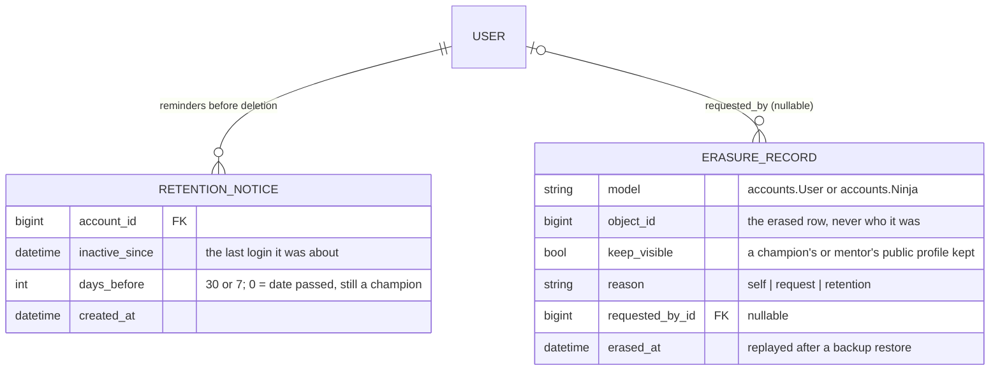
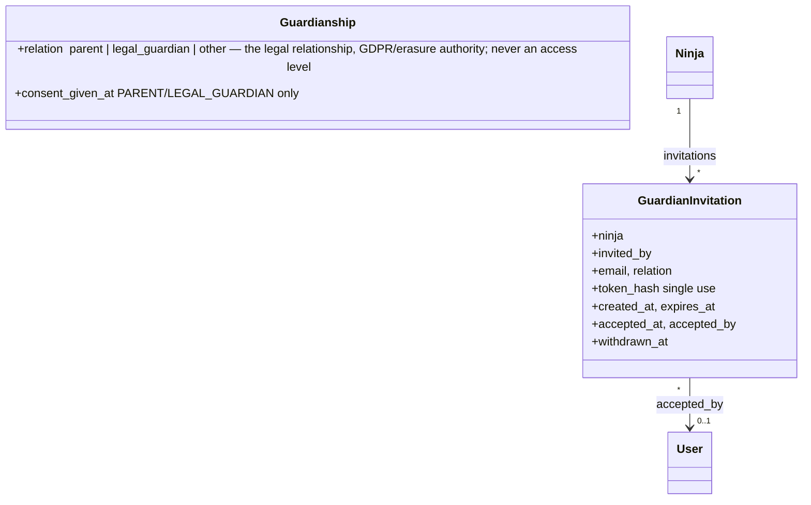

# Data model: privacy, GDPR and guardianship

Split out of `DATA_MODEL.md` §16 ("GDPR: classifying personal data, export, erasure and retention") and §27 ("Multiple guardians per child, with configurable per-guardian access") — grouped together because §27's guardian-relation rules are themselves GDPR/erasure-authority questions. `DATA_MODEL.md` stays the index; it links here. Section numbers kept as in `DATA_MODEL.md` so existing "§16"/"§27" references elsewhere in the repo still resolve.

---

## 16. GDPR: classifying personal data, export, erasure and retention (in progress)

**Phases 1 to 3 are built** (the classification, the register and a
person's export), **phase 4 for the decided rules** (accounts, the audit
log, login sessions) and **phase 5** (erasure, and deleting an account on
request from the family's account page and the organisation's Privacy
page); the rest is the plan. Classify every piece of personal data
the site keeps (GDPR categories), and build on that: exporting a person's
data, anonymising or removing it, and archiving or deleting it once it's no
longer needed. Most of our data is about **children**, one field is
**health data** and one flow handles **criminal-record extracts**, so this
matters more here than on an average site.

What the privacy app stores itself (the classification lives in code, in each app's
`privacy.py`, not in tables):

### Retention periods, as the code has them (5 October 2026)

Every model's retention rule is a key of `RETENTION_RULES`
(`core/privacy_registry.py`, whose texts go into the register). This table
is what the code actually does today; the plan below explains why. The
nightly job is `privacy.tasks.apply_retention` (10:00, default queue).

**Applied automatically:**

| Rule | What | Period | In the code | Applied by |
|---|---|---|---|---|
| `account` | accounts (`User`), their mail preferences and dojo mutes, `RetentionNotice` | erased two years after the last login (a guardian's counts its children's own logins); reminders 30 and 7 days before; never sooner than 30 days after the first reminder; champions and mentors cleaned, not erased; a champion of an active dojo held back | `ACCOUNT_RETENTION_DAYS = 730`, `ACCOUNT_DELETION_REMINDER_DAYS = (30, 7)`, `ACCOUNT_DELETION_NOTICE_DAYS = 30` | nightly job |
| `audit_log` | `auditlog.LogEntry` | with the account it's about or was made by; two years after the entry when no account is behind it | `AUDIT_LOG_RETENTION_DAYS = 730` | nightly job |
| `admin_access` | `AdminAccessGrant` | with the audit log (a grant itself lasts 12 hours) | `accounts.admin_access.ADMIN_ACCESS_HOURS = 12` | nightly job, with the account |
| `organisation_invitation` | `OrganisationInvitation` | removed 30 days after it was accepted, withdrawn or expired (it expires after 14 days) | `accounts.invitations.KEEP_DAYS = 30`, `VALID_DAYS = 14` | nightly job |
| `mail_content` | `EmailMessage` (not `JourneyDelivery`) | account link, address, subject, body, idempotency key and Message-ID cleared 12 months after the mail was created; mail still pending or sending is left alone; the row stays for the figures | `MAIL_CONTENT_RETENTION_DAYS = 365` | nightly job |
| `login_session` | `Session` | two weeks after the session last changed (Django's default, not set here); expired rows deleted | `SESSION_COOKIE_AGE` (default 1,209,600 s) | nightly job |
| `task_result` | `django_celery_results` | a day (Celery's default); with `CELERY_TASK_IGNORE_RESULT` almost nothing is stored | `result_expires` (default) | `celery.backend_cleanup`, 04:00 (django-celery-beat's default entry) |
| `engagement` | `NinjaEngagement` | rebuilt every night from the last year of sessions | `events.engagement.HISTORY_DAYS = 365` | nightly rebuild, 03:00 |
| `background_check` (document) | the uploaded extract on `User` | deleted the moment a reviewer decides | `applications.services._record_decision` | at the decision |
| `sign_in_methods` | authenticator app, passkeys, backup codes | while two-step login is on; removed when it's turned off, and with the account | `accounts/two_step.py` | at the change |

**No period by design** (they last as long as what they belong to):
`organisation_role` (while the role is held), `published` (while shown on
the site), `suppression` (as long as the address must not be mailed),
`consent_proof` (as long as the consent may have to be proven),
`erasure_log` (as long as backups from before the erasure exist),
`sign_in_policy` (while the policy applies). (`team_attendance` is under
the decisions below.)

**Built, but off until their period is decided.** Each rule below has its
removal in `privacy/retention.py`, run by the same nightly job, and a
setting that is `None` (off) until a period is chosen; setting it is all
that's needed (and updating this table, the register text and the help
centre's Privacy page):

| Rule | What goes | Setting (default `None`) | Notes |
|---|---|---|---|
| `child` | the child is erased (`erase_child`: anonymised `Ninja`, belts and badges, guardianships, their own login; registrations keep pointing at the anonymised child) | `CHILD_RETENTION_DAYS` after their last activity (latest session, upcoming ones included; their own login; else when they were added), and/or `CHILD_RETENTION_AGE` | each child in its own transaction, an `ErasureRecord` with reason `retention`; the guardian's account stays; no mail to the family first |
| `application` | rejected applications | `APPLICATION_RETENTION_DAYS` after `decided_at` | an approved application stays while the account does: it's what makes them a mentor or champion |
| `background_check` (decisions) | `BackgroundCheckHistory` rows | `BACKGROUND_CHECK_HISTORY_RETENTION_DAYS` after `reviewed_at` | access never depends on them (the check's validity is on the account) |
| `engagement` (stage changes) | `NinjaEngagementChange` rows | `ENGAGEMENT_CHANGE_RETENTION_DAYS` after `changed_on` | a segment's `stage_changed` rule can't look back further: keep it longer than any journey's "in the last N days" |
| `mail_log` | `BounceRecord`s | `BOUNCE_RECORD_RETENTION_DAYS` after they were read | never shorter than the soft-bounce window (`MAILING_SOFT_BOUNCE_WINDOW_DAYS`, 30); the handled-mailbox rows (`ProcessedImapMessage`) stay: nothing personal, and they stop a message still in the mailbox being read twice |
| `notification` | notifications that were read | `NOTIFICATION_RETENTION_DAYS` after they were made | unread ones stay |
| `admin_log` | the Django admin's `LogEntry` | `ADMIN_LOG_RETENTION_DAYS` after the change | the audit log has its own rule |

Applications and background-check decisions are in the audit log; their
removal runs with it off, so it doesn't keep what was removed in "deleted"
entries.

**No removal on purpose** (each goes with the person instead):
`team` and `team_attendance` (a dormant membership and the session team's
attendance are what past sessions' teams, awarded belts and the insurance's
record point at; erasing the person anonymises them), and `registration`
(once a child is erased their registrations point at the anonymised child,
so the numbers stay; anonymising the registrations of a child who still
comes would need the link to the child to become optional, a schema
change).

**Decisions still to make** (with the setting each one fills):

1. **A child's data**: how long after their last session or own login
   (`CHILD_RETENTION_DAYS`; proposal: N years), and whether turning 18 ends
   it too (`CHILD_RETENTION_AGE`; today a ninja who turns 18 stays
   editable). Also whether the family gets a mail first, as accounts do
   (not built: it would need a template in three languages).
2. **Rejected applications** (`APPLICATION_RETENTION_DAYS`).
3. **Background-check decisions** (`BACKGROUND_CHECK_HISTORY_RETENTION_DAYS`):
   what the Belgian rules for criminal-record extracts in work with minors
   require.
4. **Engagement stage changes** (`ENGAGEMENT_CHANGE_RETENTION_DAYS`):
   longer than any journey looks back.
5. **Bounce records** (`BOUNCE_RECORD_RETENTION_DAYS`; proposal: 12
   months).
6. **Read notifications** (`NOTIFICATION_RETENTION_DAYS`).
7. **The Django admin's log** (`ADMIN_LOG_RETENTION_DAYS`).
8. **Team history and the insurance record** (`team`, `team_attendance`):
   whether "as long as the account exists, then anonymised" is enough, or
   the insurer needs a fixed period (and then whether the record may be
   deleted after it).
9. **Registrations of a child who still comes** (`registration`): whether
   a period is wanted at all (it needs the schema change above).

**How long links and codes work** (not stored data, but asked about):

| What | Valid for | In the code |
|---|---|---|
| a login link / the first one after sign-up | 15 minutes / 3 days | `accounts.login_links.VALID_MINUTES`, `FIRST_LINK_VALID_DAYS` |
| confirming a switch to login links | 24 hours | `accounts.login_links.SWITCH_VALID_HOURS` |
| confirming a new email address | 24 hours | `accounts.email_change.VALID_HOURS` |
| an organisation invitation | 14 days | `accounts.invitations.VALID_DAYS` |
| a login counting as "recent" for a confirmation | 10 minutes | `accounts.reauth.RECENT_MINUTES` |
| "don't ask again in this browser" (two-step login) | 30 days | `TWO_FACTOR_REMEMBER_COOKIE_AGE` |
| Django admin access once granted | 12 hours | `accounts.admin_access.ADMIN_ACCESS_HOURS` |
| an API access token | 1 hour | `OAUTH2_PROVIDER["ACCESS_TOKEN_EXPIRE_SECONDS"]` |
| a validated background check | 365 days | `applications.models.BACKGROUND_CHECK_VALIDITY` |

### Existing Django apps

| Package | Latest | Verdict |
|---|---|---|
| [django-gdpr-assist](https://django-gdpr-assist.readthedocs.io/) | 1.4.2 (April 2022), Django 2.2–4.0 | **Not usable**: unmaintained, and far from Django 6.1. Its design is the right one, though: a `PrivacyMeta` per model (which fields are personal, how to anonymise them, what to export), search and export per person, anonymise instead of delete, and a log of erasures so they can be replayed after restoring a backup. We copy that design. |
| django-GDPR (0.2.23, 2023) | Django ≤2.1 | Not usable. |
| [django-gdpr-ready](https://github.com/GDPR-ready/django-gdpr-ready) | 4 commits | Experimental, not usable. |
| [django-scrubber](https://github.com/regiohelden/django-scrubber) | 8.0.0 (September 2026), Django 5.2–6.1 | **Usable, for one job**: anonymising a whole copy of the database (`scrub_data`, refuses to run without `DEBUG`) and `scrub_validation`, which lists fields without a scrubber. It works per field across a table, not per person. Only needed if a production copy ever has to be used outside production (today dev uses seeded data only). |
| [django-fernet-encrypted-fields](https://pypi.org/project/django-fernet-encrypted-fields/) | 0.4.0 (April 2026), Django ≥4.2 | Optional: encrypts one field in the database (for the health data below). An encrypted field can't be searched or filtered. |
| django-auditlog 3.4.1 / django-simple-history 3.13.0 | maintained | Not GDPR tools, but §14's audit log (django-auditlog chosen, see §14). Its table keeps personal data (diffs, who viewed what), so it's classified and covered by retention and erasure too (§14 phase 5). |

**Decision:** no package does the whole job on Django 6.1, so build a small
`privacy` app on the gdpr-assist design, and use django-scrubber (later,
only if needed) and possibly an encrypted field as single-purpose helpers.

### What personal data we keep (inventory, September 2026)

- **Accounts** (`accounts.User`): name, username, email, phone, postcode,
  language, team-page profile (`display_name`, `title`, `bio`, `photo`,
  `show_on_team_pages`), login data (password hash, `last_login`), roles.
- **Children** (`accounts.Ninja`, `Guardianship`): name, date of birth,
  gender, photo, home dojo, **`allergies_notes` (health data, GDPR art. 9,
  a special category)**. The family enters and edits it (sign-up, add a
  child, edit a child); the dojo's **champion only** sees it, on the
  attendance list of a session the child has a confirmed place at
  (`dojos.access.VIEW_HEALTH_NOTES`, never granted to mentors). The family
  forms say so next to the field.
- **The guardian's consent, for mail only (decided):** whether a child's
  details (age, gender, sessions, belts) may choose which mail the family
  gets. It matters only to the organisation dashboard's segments (so
  campaigns and journeys): a "Parents of a child who…" group only reaches
  the guardians who consented for that child
  (`campaigns.segmentation.resolver`). Signing a child up, their sessions,
  belts and badges, and the automated mail never depend on it. An optional
  checkbox on family sign-up (next to the required "I am the parent or
  legal guardian") and on Add a child, and a switch per child on the Mail
  preferences page to give or withdraw it, with one approved wording
  (`accounts/partials/_child_data_consent.html`, versioned by
  `accounts.consent.CHILD_DATA_WORDING_VERSION`; every change through
  `accounts.consent.set_consent`, so the audit log has its history). It's
  per guardian and child, on the `Guardianship` (`consent_given_at`,
  `consent_wording_version`); links from before, or made in the admin,
  have none. The mail privacy explanation says so
  (`PRIVACY_WORDING_VERSION` 2026-09-26). `seed_guardians` seeds both: most
  families consented for every child, every 4th (`guardian-2`, `-6`, ...)
  for none, a few (`guardian-N` with N % 8 = 3) for their first child
  only; `seed_credentials.csv` marks those children `[no consent]`.
- **Criminal-record extracts** (GDPR art. 10): the uploaded document (deleted
  at the decision already), `User.background_check_*`,
  `applications.BackgroundCheckHistory`, `Application` (motivation text,
  consents).
- **What children do**: `Registration`, `RegistrationCancellation`,
  `NinjaBadge`, `NinjaBelt` (notes by mentors), attendance.
- **Profiling of children**: `NinjaEngagement`, `NinjaEngagementChange`, and
  the segment attributes built on them (engagement stage, gender, age, belt)
  that choose who gets mail: only for children whose guardian consented
  (see above).
- **Volunteers at work**: `DojoMembership`, `TeamAttendance` (the insurance
  record), `Event.team`.
- **Mail**: `EmailMessage` (the full rendered subject and body, recipient
  address), `MailPreference`, `ConsentEvent` (proof of consent),
  `EmailSuppression`, `BounceRecord`, `JourneyDelivery`, `Notification`.
- **Contact data of dojos and the organisation**: `Dojo.email`/`phone`
  (often a person's), `OrganisationTeamMember`, `Testimonial.author`.
- **Outside our apps**: sessions, `admin.LogEntry` (`object_repr` holds
  names), `django_celery_results` (task arguments), Mailpit/SMTP logs,
  backups on the server.

### Phases

1. **Classification: a `privacy` app with a registry.** *Built.*
   `core/privacy_registry.py` (`register`, `register_not_personal`, and the
   `personal`/`anonymise`/`keep` field specs); every app has its
   `privacy.py`, Django's and third-party models (sessions, `LogEntry`,
   celery results and beat, auth, content types) are in
   `privacy/privacy.py`. Implementation decisions:
   - `not_personal` isn't a category but a list per model (or
     `register_not_personal(model, reason)` for a whole model), so the
     categories only describe personal data.
   - A model's `purpose`, `legal_basis`, `retention` and `seen_by` are the
     default for its fields; a field overrides them where it differs (the
     health field's `seen_by`, the team-page profile's consent). Fields
     themselves have no default: every one needs its own decision.
   - `on_erasure` on a link to the person: `delete` deletes the row (it's
     about them), `keep` keeps it pointing at the anonymised account or
     child (a past session's team, a belt awarded). The `User` and `Ninja`
     rows themselves are anonymised ("Former member #id", "Former ninja
     #id"), not deleted.
   - Everything on a row about a person counts as personal, not just
     names (a registration's `attended`, a mail's `status`); fields that
     only stay for statistics are `keep` with that reason.
   - Legal bases chosen for now (to confirm, see open points): background
     checks legitimate interest, the health field consent, `ConsentEvent`
     legal obligation (art. 7.1), children's data contract.
   - Each app gets a `privacy.py` (autodiscovered, like `tasks.py`) that
     declares, per model, each field's category and what happens to it.
     Kept out of `models.py` so third-party models (sessions, `LogEntry`,
     celery results, the audit log later) can be declared the same way.
   - Categories: `identity` (name, email, phone, postcode, username),
     `child` (anything about a ninja), `special` (art. 9: health),
     `criminal` (art. 10: background checks), `profiling` (engagement,
     segments), `public_profile` (shown on team pages by choice),
     `contact_public` (a dojo's published contact details), `security`
     (password hash, tokens), `not_personal`.
   - Per field: `purpose`, `legal_basis` (contract, legitimate interest,
     consent, legal obligation), `retention` (a rule name, see phase 4),
     `on_erasure` (`delete`, `anonymise` with a replacement, or `keep` with
     the reason) and `export` (yes/no).
   - **A test that every field is classified**: every concrete field of
     every model in our apps (and the listed third-party ones) must be in
     the registry, so a new field without a decision fails the tests, the
     same way `core.tests.StrNeverQueriesTests` and
     `AdminStaysFullyUsableTests` guard their rules.
2. **Register of processing activities** (GDPR art. 30): *Built*
   (`privacy/register.py`, one row per personal field in CSV; per category
   and model in Markdown, plus the retention rules and the models without
   personal data).
   `manage.py privacy_register` writes the register (per category: which
   data, purpose, legal basis, retention, who can see it) as Markdown/CSV
   from the registry, for the board and for a request from the Belgian data
   protection authority (GBA/APD). The privacy notice on the site is
   checked against it; changing its wording goes together with
   `PRIVACY_WORDING_VERSION` (`mailing/preferences.py`), as today.
3. **Right of access and portability** (art. 15/20): *Built*
   (`privacy/export.py`, `privacy/views.py`). Implementation decisions:
   - Each model says whose rows are whose with `subjects` in its
     registration: a lookup to the account, to a child, or a field holding
     the account's email address (`EmailSuppression`). Models without
     (a dojo's contact details, `Event`, `Testimonial`) are listed with
     their reason in `ExportCoverageTests`.
   - A row is exported with all its fields except the id and `export=False`
     ones, including its non-personal context (a registration's session);
     links show the linked object's name. Links to someone else (the
     reviewer of an application or a check, who marked attendance, who
     requested or decided a join) are `export=False`: their data, not the
     person's.
   - A guardian's export includes the children's own logins and their
     mail; a ninja login's includes only its own child record.
   - The family's download is limited to once a minute per account (the
     cache; fails open when Redis is down). The organisation's download
     isn't rate-limited; the §14 audit log records it (an access entry on
     the exported account, with the admin who downloaded it).
   - `privacy.export.export_person(user)` → JSON of everything the registry
     marks `export`: the account, the children the account is guardian of,
     their registrations, belts, badges, mail preferences and consents,
     applications and background-check decisions (never the document), the
     mail sent to them.
   - Family: "Download my data" on the account page (login required,
     rate-limited). A ninja login gets only its own data.
   - Organisation: the same export from a new organisation dashboard page
     (`/manage/privacy/`), for requests that come in by mail or post.
4. **Retention: deleting what's no longer needed.** *Built for the
   decided rules* (`privacy/retention.py`, the nightly
   `privacy.tasks.apply_retention` at 10:00 on the default queue, also
   `manage.py apply_retention`): accounts two years after the last login
   with their reminders, the audit log (§14), organisation invitations,
   mail content after 12 months and expired login sessions (every value in
   "Retention periods, as the code has them" above). The other rules wait
   for their periods (open points). Implementation decisions:
   - **Settings:** `ACCOUNT_RETENTION_DAYS = 730`,
     `ACCOUNT_DELETION_REMINDER_DAYS = (30, 7)`,
     `ACCOUNT_DELETION_NOTICE_DAYS = 30`, `AUDIT_LOG_RETENTION_DAYS = 730`.
   - **Each reminder is a `privacy.RetentionNotice`** (account, the last
     login it was about, days before), the record the job decides by; the
     mail itself goes through `send()` with the idempotency key below. A
     login starts a new period: the old notices are removed.
   - **Never without a month's notice:** the date is the later of two
     years after the last login and `ACCOUNT_DELETION_NOTICE_DAYS` after the
     first reminder. That covers accounts already overdue when the rule
     started and an organisation role that just ended (no separate "role
     ended" date needed: no reminders go out while the role is held).
   - **Held back:** the date-passed notice of a champion of an active dojo
     is a `RetentionNotice` with `days_before = 0` (no mail, the mentors'
     second notification); the account is cleaned the first night after
     the role has moved (or the dojo stopped being active).
   - **A child's own login is on the family's counter (decided,
     replacing "a ninja's own login" in the plan below):** a guardian's
     date counts the latest login of any of its children's own logins
     (`with_inactive_since`), so a family stays while a child uses their
     login. The login has no date, reminder or removal of its own: the
     guardian's reminders are the notice (the mail says the children's own
     logins go with them), and it's erased with its child when the family
     is. The job never handles a ninja login itself.
   - **A child always has a guardian (decided):** family sign-up and Add a
     child create the child and its guardianship in one transaction. A
     child without one can only come from a manual fix in the Django admin
     (adding a child there, deleting a guardianship or a guardian's
     account); the automatic jobs leave such a child and its login alone,
     and it stays until it's handled in the admin.
   - The organisation's list is
     `champions_needing_attention()` (the Privacy page and the sidebar
     count, ``).
   - Every account is handled in its own transaction; one that fails
     (e.g. a missing template) is logged and retried the next night, and
     never erased without its reminder.

   The plan:
   - Rules in one module (`privacy/retention.py`), with periods in settings.
     Proposals to decide (see open points): a child's data N years after
     their last session or after turning 18; bounces and
     processed-mailbox rows after 12 months; closed sessions' registrations
     anonymised after N years (counts stay for statistics);
     background-check history as long as the legal rules say; `TeamAttendance`
     as long as the insurance needs it.
   - **Mail content (decided, built 3 October 2026): cleared 12 months
     after the mail was created** (`MAIL_CONTENT_RETENTION_DAYS = 365`,
     `privacy.retention.clear_old_mail_content`, in the same nightly job).
     The `EmailMessage` fields `mailing/privacy.py` classifies `personal`
     (account link, address, subject, body, idempotency key, Message-ID)
     are emptied; the row keeps its category, template, campaign, dojo,
     status and dates for the statistics (campaign and journey results
     still count it). Mail still `pending` or `sending` is left alone.
     `JourneyDelivery` (also under `mail_content`) isn't cleared: it's the
     journeys' cool-down record, and a cool-down can be longer than a year.
   - **Accounts (decided): erased two years after the last login**
     (`ACCOUNT_RETENTION_DAYS = 730`; `User.last_login`, or `date_joined`
     for an account that never logged in), with reminder mails first:
     - **Reminders** 30 and 7 days before the date
       (`ACCOUNT_DELETION_REMINDER_DAYS = (30, 7)`): the service mail
       `account_deletion_reminder` (en/nl/fr in
       `mailing/seed_templates.py`, one of `SYSTEM_TEMPLATE_KEYS`),
       through `send()`, with the date, a login link, and what goes with
       the account: the children who have no other guardian, and their
       history. `service` mail can't be switched off, so a family that
       opted out of everything still gets it; a blocked address
       (`EmailSuppression`) is recorded as suppressed and the deletion
       goes ahead. Idempotency key
       `account-deletion:<user>:<days>:<last login date>`, so a
       reminder goes once per period of inactivity and again after a
       later one.
     - **Logging in is what counts.** Any login moves the date two years
       on; nothing else does (Django only updates `last_login` at login,
       and a session lasts at most `SESSION_COOKIE_AGE`).
     - **The deletion itself is the erasure of phase 5**
       (`erase_person(user, requested_by=None, reason="retention")`, with
       its `ErasureRecord`), so phase 5 comes first: the account is
       anonymised where other rows point at it, children with no other
       guardian are erased with it, a child with another guardian stays.
     - **A ninja's own login** that hasn't been used for two years is
       removed like the guardian would (`child_accounts.remove_login`);
       the reminders go to the child's login and to its guardians, and
       the child's record follows the child rule, not this one.
     - **Champions and mentors are cleaned, not erased (decided):** an
       account that was ever on a dojo team as champion or mentor (any
       membership that got past `requested`) keeps only what the site
       shows of it, and everything else is deleted. Their name is on past
       sessions' teams, on belts they awarded and, by choice, on the team
       pages, and those stay right.
       - **Kept:** the name as shown (`User.team_name`, frozen into
         `display_name` so the first and last name can go), and the
         team-page profile (`title`, `bio`, `photo`) only if
         `show_on_team_pages` was on (otherwise it wasn't visible and is
         deleted too); the memberships (made `dormant`, with their role
         and dates), `Event.team`, `TeamAttendance`, the belts and badges
         they awarded.
       - **Deleted:** everything else, as in an erasure: login (unusable
         password, inactive, username `former-<id>`), email, phone,
         postcode, language, applications, the background-check fields
         on the account (the decisions in `BackgroundCheckHistory`
         follow their own rule), mail preferences (the consent log
         follows its own), notifications, and the family side:
         guardianships, and the children with no other guardian.
       - In the classification this is erasure with one difference: the
         `public_profile` fields are kept when they were shown, and the
         visible name is kept. So it's a mode of phase 5's
         `erase_person(..., keep_visible=True)`, not a second list of
         fields; a new visible field is covered by giving it the
         `public_profile` category.
       - **Still the champion of an active dojo (decided):** the dojo
         can't be left without one, so cleaning waits until the role is
         handed over, and two sides are told, from the first reminder on
         (30 days before the date), so they can act before it:
         - **The organisation's administrators, in their dashboard:** a
           "Needs attention" list on the Privacy page (`/manage/privacy/`:
           the dojo, the champion, their last login, the date) and a
           count on the sidebar's Privacy link, so it shows on every
           `/manage/` page. The organisation dashboard has no notification
           bell, so the list is the notice; it disappears once the role
           has moved. From there the admin can open the dojo in the Django
           admin, to hand the role over or set the dojo dormant.
         - **The dojo's other mentors, through notifications:** the
           dashboard bell (`dojos.team.notify_managers(..., exclude=<the
           champion>)`: one per active mentor), once at the first reminder and
           again when the date has passed, linking to the Team page. A
           mentor can't take the role themselves (`transfer_champion` is
           champion-only), so the text asks them to contact the champion
           or the organisation.
         - A dojo with no other active mentor only has the organisation
           side.
       - Their reminder mails say what stays (their name on past sessions
         and, if they chose it, their team profile) and what goes.
     - **Organisation roles are excluded (decided):** an account holding
       an `OrganisationRole` (board or admin) is never deleted or cleaned
       automatically and gets no reminder mails, for as long as it holds
       the role. Superusers are treated the same (the site's technical
       administrators). Once the role ends, the rule applies again from
       the last login; if that's already more than two years ago, the
       first reminder gives the usual 30 days (the date is never earlier
       than 30 days after the role ended).
   - A nightly beat job (`privacy.tasks.apply_retention`) that only
     enqueues the work on the default queue, like every heavy job (see
     "Background jobs" in `CLAUDE.md`), safe to run twice. It sends the
     reminders that are due, erases the accounts whose date has passed,
     and applies the other rules (including the audit log's, §14).
5. **Right to erasure** (art. 17): `privacy.erasure.erase_person(user,
   requested_by, reason)`, from the organisation dashboard (with a
   confirmation showing what will happen) and later on request from the
   account page. *Built* (`privacy/erasure.py`, `privacy/deletion.py`,
   `privacy.ErasureRecord`, `manage.py privacy_replay_erasures`), used by
   the retention job and by deleting an account on request.
   Implementation decisions:
   - **Deleting an account on request** (`privacy.deletion`: `preview()`
     then `delete_account()`) from two places. The family: **Delete my
     account** on the account page's Your data card (`/account/delete/`),
     confirmed with its password, deleted right away, then logged out
     (`ErasureRecord.reason = self`). The organisation: **Delete…** per
     account on the Privacy page (`/manage/privacy/<id>/delete/`), for a
     request by mail or post, confirmed by typing the username (`request`,
     with `requested_by`). Both show first which children go with the
     account and which stay with another guardian, and what a champion or
     mentor keeps (they're cleaned, `keep_visible`, as by retention).
   - **What stops it:** the champion of an active dojo (the role moves
     first), an organisation role, a superuser, a ninja's own login (it's
     the guardian's to remove, or goes with the family), and an account
     already erased.
   - No confirmation mail: the erasure empties the address and the queued
     mail with it.
   - **Rows are found by `subjects`** (the account, the children erased
     with it and their own logins, the account's email address), all of
     them before anything changes. A row of someone else's that only links
     to the person (a cancellation they made) gets that link's rule alone:
     a nullable link is emptied, a `keep` one stays.
   - **"Emptied"** is null where allowed, else False, the field's default
     or an empty text; a file is deleted, a standard library image only
     unlinked. A `personal` required link to the person deletes the row.
     `anonymise` takes a literal ("{pk}" is the row's id) or a
     `core.privacy_registry.Computed` (the unusable password).
   - **`keep_visible`** keeps the `public_profile` fields where the model's
     `visible_when` flag is on (`User.show_on_team_pages`,
     `OrganisationTeamMember.is_public`); the visible name is frozen into
     `display_name` first. Memberships end through
     `dojos.team.end_all_memberships` (dormant; a pending first request goes).
   - **The audit log:** the erasure runs with the log disabled (its diff
     would hold what was erased). Entries about the erased rows are
     cleared on request and removed by the retention job, as are the
     entries the account made (on request only `actor_email` is cleared).
     Django's admin history (`admin.LogEntry`) about those rows loses its
     `object_repr` and `change_message`.
   - `erase_child(ninja)` erases one child and their own login whatever
     guardians they have, for a request about a single child.
   - Not yet: a child's upcoming places are kept (anonymised) rather than
     cancelled, so an erasure on request should come after cancelling them.

   The plan:
   - **Anonymise rather than delete** where other rows point at the person:
     a `User` on a past `Event.team` or a `NinjaBelt.awarded_by` becomes
     "Former volunteer #id" (inactive, personal fields blanked, as
     `child_accounts.remove_login` already disables a login instead of
     deleting it). Children with no other guardian are erased with the
     family; their registrations are anonymised, so a session's numbers
     stay right.
   - **`keep_visible=True`** (used for champions and mentors by the
     retention rule, phase 4): the same, except that the visible name is
     frozen into `display_name` and kept, and the `public_profile` fields
     stay when `show_on_team_pages` was on.
   - `keep` fields stay, with their reason: proof of consent
     (`ConsentEvent`), a suppressed address (`EmailSuppression`, otherwise
     we would mail it again), background-check decisions for as long as
     the legal rules say.
   - Every erasure writes an `ErasureRecord` (model, row id, when, why,
     requested by; no personal data), so an erasure can be **replayed after
     restoring a backup** (`manage.py privacy_replay_erasures`).
   - Goes through the classification only, so a new field is covered
     automatically.
6. **Restricting who sees what.**
   - The health field: done (champion only, attendance list of a session
     the child has a confirmed place at, see the inventory above); every
     time it's shown, and every change (masked), is in the §14 audit log.
     Still to consider: an encrypted field.
   - Profiling segments: limit attributes about children (gender, age,
     engagement) to categories the family opted in to, or document the
     legitimate-interest assessment (open point).
   - The admin keeps full access (`CLAUDE.md`: never read-only); each
     `ModelAdmin` of a `special`/`criminal` model says so in its docstring,
     and the §14 audit log records who viewed (`LogAccessAdminMixin`) or
     changed it (built).
7. **Copies of the database** (only when needed): django-scrubber, with its
   scrubbers generated from the registry (one source of truth) and
   `scrub_validation` in the test run.
8. **Docs.** A privacy page in `docs/` (en/fr/nl: what we keep, how to get
   a copy, how to have it removed), a "Privacy" section in `CLAUDE.md` (a new
   field needs a classification), and this section rewritten as "built".

### Open points

- ~~A child whose own login is in use~~ Decided: a child's own logins
  count toward their guardians' two years, and the login goes with the
  family (phase 4).
- **Retention periods** for each rule in phase 4: needs legal input
  (Belgian law, the insurer for `TeamAttendance`, the rules for
  criminal-record extracts). Decided so far: accounts two years after the
  last login, with reminder mails (phase 4), the audit log with them
  (§14), invitations and mail content. Every other removal is built and
  waits for its period: the numbered list under "Retention periods, as the
  code has them" says what's left to decide.
- **Who handles requests** in the organisation (a privacy contact or DPO),
  and within how many days (the GDPR's one month).
- **Health data**: decided: the champion sees `allergies_notes` on the
  attendance list (see the inventory). Still open: whether mentors running
  a session without the champion need it too (adding `VIEW_HEALTH_NOTES`
  to mentors in `dojos.access.ROLE_CAPABILITIES`, and changing the text
  on the family forms and in the docs).
- ~~Profiling children for mail~~ Decided: a child's details only choose
  mail with the guardian's consent, per child (see the inventory).
- **Legal bases** in the classification (phase 1) need checking: which
  art. 6 basis and art. 9/10 condition apply to the health field (explicit
  consent?) and to background checks (Belgian rules on criminal-record
  extracts for work with minors).
- **Children's own requests**: Belgium's age of digital consent is 13; can a
  ninja login ask for its own export or erasure, or only the guardian?
- **Archiving** (the original question): whether anything moves to an
  archive instead of being deleted (e.g. yearly statistics), and in what
  form (aggregated numbers only).

## 27. Multiple guardians per child, with configurable per-guardian access (not built — written up for stakeholder review before implementation)

**Not built.** `Guardianship` already supports more than one guardian per
child structurally — `Ninja.objects.of_guardian()`, the data export
(`privacy.export.children_of`), erasure (`privacy.deletion.preview`: "a
child erased with the account only if this account is their guardian,
else kept with their other guardian") and the mail fan-out
(`mailing.automated.family_of`) are all written against "every guardian of
this child," not a single FK. What's missing is the self-service way to
*add* a second one: today a `Guardianship` row is only ever created by the
account creating its own child (`register_guardian`, `add_ninja`) — nobody
can link another account in.

Two real-world cases drive this, with different trust levels:

1. **Divorced or separated co-parents** — both should get full, symmetric
   access to the same child.
2. **A trusted adult who isn't a parent** ("responsible for also
   registering other kids of other families") — should be able to sign
   the child up and see their schedule, without necessarily getting full
   control of the child's health notes or own login.

**`relation` is not an access level.** It's kept as the legal/GDPR
descriptor of the actual relationship to the child (parent, legal
guardian, or someone else entirely), and nothing more — that's what it's
for today (it already exists on `Guardianship` but drives no behaviour)
and what it should keep meaning once this is built. *What a guardian may
actually do* is a second, independent axis, added in phase 2. Phase 1
therefore ships every guardian with the same full functional access
regardless of relation (no change from today's behaviour), while still
wiring `relation` into the three places it actually matters from day one.

### Decisions

1. **Invite by email, modelled on `accounts.invitations`
   (`OrganisationInvitation`), not a new pattern (decided).** A new model
   `accounts.GuardianInvitation` (`ninja`, `invited_by`, `email`,
   `relation`, `token_hash`, `language`, `created_at`/`expires_at`/
   `accepted_at`/`accepted_by`/`withdrawn_at`) and a service module
   `accounts/guardian_invitations.py` (`invite`, `accept`, `withdraw`,
   `resend`; `GuardianInvitationError` carries the user-facing message,
   same shape as `TeamError`/`OnboardingError`). Works whether or not the
   invited address already has an account — same "every account is
   created by its own holder" principle as the organisation invite: the
   link only grants anything once an account with that exact address
   accepts it, so a forwarded link grants nothing. Throttled per inviter
   like `accounts.invitations._throttle`.
2. **Every existing guardian is notified on *send*, not only on accept
   (decided).** The important difference from the organisation-invite
   pattern: in a co-parenting conflict, the other parent needs to know
   someone is being added *before* it happens, not find out afterwards.
   `invite()` notifies every current guardian of the child
   (`notifications.services.notify` + mail); `accept()` notifies them
   again, including the inviter.
3. **The invitee chooses a consent answer at accept time, same as Add a
   Child — but only when their relation can legally give it (decided).**
   Each `Guardianship` row keeps its own independent `consent_given_at`
   (already the case today). The mail-consent checkbox
   (`accounts/partials/_child_data_consent.html`) is offered to
   `PARENT`/`LEGAL_GUARDIAN` only — holders of parental responsibility —
   not to `OTHER`: a trusted contact isn't positioned to give consent on
   the child's behalf, so they simply aren't asked.
4. **`relation` decides who counts for erasure (decided).**
   `privacy/deletion.py`'s "a child is erased with the account only if
   this account is their [only] guardian" changes to count only
   `PARENT`/`LEGAL_GUARDIAN` relations. Deleting an `OTHER`-relation
   account never erases the child — it only ever removes that one link.
   Conversely, a child must never be left with zero `PARENT`/
   `LEGAL_GUARDIAN` relations, even while an `OTHER` remains: the
   invitation/removal rules (below) enforce that, not just the deletion
   flow.
5. **`relation` decides who may exercise the child's GDPR rights
   (decided).** Requesting the child's data export, requesting their
   erasure, or authorizing deletion of the child's row stays restricted
   to `PARENT`/`LEGAL_GUARDIAN`, independent of whatever functional
   capabilities phase 2 later grants an `OTHER` guardian. A trusted
   neighbor can be given "sign up for sessions"; never "request this
   child's data be erased."
6. **Removing a guardian (decided for phase 1):** any `PARENT`/
   `LEGAL_GUARDIAN` may remove another guardian of any relation, or step
   down themselves, as long as the child keeps at least one `PARENT`/
   `LEGAL_GUARDIAN` left (decision 4). The removed guardian is always
   mailed, so nobody is silently cut off. **Flagged, not fully settled:**
   whether "immediate removal + a notice after the fact" is enough when
   it's one co-parent removing another, or whether that specific case
   needs more friction (confirmation from the organisation, a delay,
   something else), is a safeguarding/legal question for the
   stakeholder conversation, not something to decide in code.
7. **Phase 2: real per-guardian capabilities, fully independent of
   `relation`, reusing the same template-then-override mechanism
   designed for dojo admin access (recommended, not built).** A
   capability catalog as custom `django-guardian` object permissions
   scoped per `(user, ninja)` — the same dependency and the same
   "template, then grant/revoke on top" shape discussed for dojo
   authorization, applied to `Ninja.Meta.permissions` instead of
   `Dojo.Meta.permissions`. The catalog: `edit_details`,
   `view_health_notes` / `edit_health_notes` (kept apart, same reasoning
   as the dojo's `VIEW_HEALTH_NOTES`), `sign_up` (register for sessions,
   cancel places), `manage_login` (give/remove/change the child's own
   login), `manage_guardians` (invite, remove and customize other
   guardians' functional access — **never** the relation-gated GDPR
   actions in decisions 4–5, which stay relation-gated regardless of
   capability). Every guardian starts from the same full template on
   phase 1's unconditional access, so phase 2 is purely subtractive to
   begin with — nothing changes until an administrator actually
   customizes someone.
8. **`manage_guardians` may only be held by `PARENT`/`LEGAL_GUARDIAN`
   (recommended, not built).** Handing out or revoking other people's
   access to a child is itself a weight I wouldn't give to a relation
   that isn't a legal guardian, even if a family wants to configure it
   that way — so this one capability stays relation-gated on top of the
   otherwise-independent catalog. Whoever holds it is this child's
   "administrator"; no separate flag needed. An administrator gets a
   "Customize access" screen per co-guardian (same shape as the dojo Team
   page's planned equivalent) to hand-tune any other capability for any
   guardian — grant a trusted neighbor `sign_up` without `manage_login`,
   or take `edit_health_notes` away from someone the family trusts less.
   The same invariant as decision 4 extends here: never leave a child
   with zero `manage_guardians` holders.

### Model changes

Phase 2 adds no new fields: capabilities are `django-guardian`
`UserObjectPermission` rows keyed on `(user, ninja, permission)`, not
columns on `Guardianship`.

### Screens

- A **Guardians** card on the child's page (`ninja_detail`,
  `accounts/views/children.py`): every current guardian with their
  relation, an "Invite another guardian" action and "Remove"/"Step down"
  per row. Shown to adult guardians only — never to the ninja's own
  self-view (`_get_own_ninja(..., allow_self=True)`'s branch): a child
  doesn't manage who's responsible for them.
- `/account/guardian-invitations/<token>/`: same GET-shows/POST-confirms
  shape as `email_change_confirm`. Not logged in, or logged in as the
  wrong address → the usual sign-up-or-log-in-with-`next` detour already
  used elsewhere (`register_individual?next=...`). Logged in with the
  matching address → confirm the child's name, who invited them and their
  relation, tick the consent checkbox when relation allows it
  (`accounts/partials/_child_data_consent.html`, same as Add a Child,
  `PARENT`/`LEGAL_GUARDIAN` only), accept.
- Phase 2 only: a "Customize access" screen per guardian, administrator
  (`manage_guardians` holder) only — a checkbox per capability, pre-ticked
  from the guardian's current rows, a "Reset to full access" action.
  `manage_guardians` itself is only offered for a `PARENT`/
  `LEGAL_GUARDIAN` row (decision 8) — never shown as a checkbox for
  `OTHER`.

### Phases

1. **Foundations (not built):** `GuardianInvitation` model and migration,
   admin registration, `accounts/privacy.py` classification (mirrors
   `OrganisationInvitation`'s entry), a retention job cleaning up
   accepted/withdrawn/expired invitations (same shape as
   `accounts.invitations.remove_old`), an audit-log decision for
   invite/accept/remove (recommended: record them, same reasoning as
   `AdminAccessGrant`).
2. **Invite, accept, notify, remove, with every guardian getting full
   functional access regardless of relation (not built):**
   `accounts/guardian_invitations.py`, the Guardians card, the accept
   page, three mail templates (`child_guardian_invitation`,
   `child_guardian_added`, `child_guardian_removed`) in en/nl/fr via
   `mailing/seed_templates.py` plus a `load_mail_templates` data
   migration, tests in `accounts/tests.py` (invite/accept/withdraw/
   throttle, duplicate rejection, other-guardians notified on send and
   accept, last-`PARENT`/`LEGAL_GUARDIAN` protection on removal,
   self-step-down). `docs/source/parent/...` (en/fr/nl) documents the
   flow; `user-journeys/scripts/check_journeys.py` will likely flag the
   parent persona — regenerate its PDFs once this is real.
3. **Wire `relation` into erasure, GDPR-rights authority and consent
   eligibility (not built, decisions 3–5):** update
   `privacy/deletion.py`'s preview/delete logic to key off
   `relation in (PARENT, LEGAL_GUARDIAN)` instead of "any guardian";
   gate the data-export and erasure-request views the same way; hide the
   consent checkbox from `OTHER`. Tests covering an `OTHER`-relation
   account's deletion never erasing the child, and a child never ending
   up with zero `PARENT`/`LEGAL_GUARDIAN` relations.
4. **Configurable capabilities (recommended, not built, depends on the
   dojo-authorization `django-guardian` decision landing first so the
   dependency is only added once):** `Ninja.Meta.permissions`, a
   `accounts/guardian_access.py` module (capability catalog,
   `apply_template`/`grant`/`revoke`/`capabilities_of`, the
   `manage_guardians`-requires-`PARENT`/`LEGAL_GUARDIAN` rule, mirroring
   whatever shape `dojos/permissions.py` ends up with), the
   Customize-access screen, gating the sensitive family views
   (`edit_ninja`, `accounts/views/child_logins.py`) on capabilities
   instead of phase 2's "everyone gets everything."

### Open points

- Should both co-parents default to holding `manage_guardians` (symmetric
  administrators), or does the inviter decide per invitation? Leaning
  default-on for `PARENT`/`LEGAL_GUARDIAN` (two parents get equal
  standing automatically) and never offered for `OTHER` (decision 8).
- The removal-friction question from decision 6 — needs a safeguarding/
  legal answer, not an engineering one.
- Should a non-administrator guardian still *see* the full guardians
  list (who else has access), even without the rights to change it?
  Leaning yes — transparency outweighs the privacy cost here, and the
  list reveals nothing sensitive beyond who is linked.
- Is there a legal-basis case for recording *why* someone is `OTHER`
  rather than a parent (a free-text note, e.g. "neighbor," "carpool"),
  given relation now carries real GDPR weight rather than being purely
  descriptive? Worth asking alongside the stakeholder conversation.
