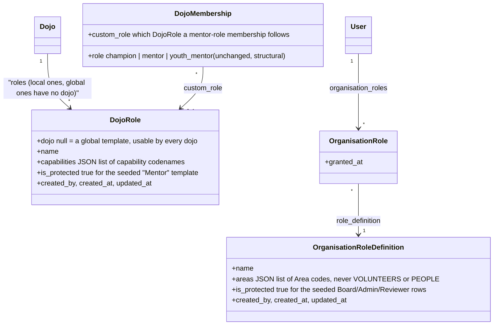

# Data model: custom roles (dojo and organisation)

Split out as its own file (the same reason as `DATA_MODEL_MAILING.md`, `DATA_MODEL_API.md` and `DATA_MODEL_PRIVACY.md`: a design big enough that it would otherwise dominate `DATA_MODEL.md`). `DATA_MODEL.md` stays the index — it links here from §28.

---

## 28. Custom roles: dojo and organisation (not built — written up for review before implementation)

**The principle:** every dojo and the organisation already start from a small set of built-in roles (dojo: Champion, Mentor; organisation: Board, Admin, Reviewer) — that stays true and stays the default. What's missing is the escape hatch: when the built-in set genuinely isn't enough for a specific dojo or for the organisation, whoever already owns that domain (a dojo's champion; the organisation's admin) should be able to **define their own named role** — pick a name, pick its capabilities from what they themselves can already do, save it — and then assign people to it, the same way they'd assign someone to a built-in role today. A custom role is scoped to the domain that created it: a dojo's own roles are usable only on that dojo; the organisation's are usable only at the organisation level. Nobody can grant more than they themselves hold.

**This supersedes the per-membership capability-override idea discussed earlier** (`DATA_MODEL_PRIVACY.md` §27's phase 2 references it, and it's the reason `django-guardian` came up as a candidate dependency). Once creating a new role is this cheap, "I want this one mentor to have almost-but-not-quite the Mentor bundle" is just "make a one-off custom role and assign them to it" — there's no remaining need for a separate per-person permission-override layer, or for an object-permission library to back it: a role is a plain row with a capability list, and a membership points at one role. **Recommendation: drop `django-guardian` from this design entirely** — the reframed requirement (named, reusable roles) doesn't need per-object ACLs, just an ordinary foreign key. Flagging this explicitly since it reverses the earlier dependency decision; said decision was right for the problem as understood at the time, and the problem has since changed shape.

### Decisions

1. **One mechanism, two domains (recommended).** `dojos.DojoRole` and a new `accounts.OrganisationRoleDefinition` are the same idea applied to each domain: a name, a capability list, who created it, whether it's a protected built-in. The built-ins (today's hardcoded `ROLE_CAPABILITIES` dict in `dojos/access.py`, and `ROLE_PERMISSIONS`/`AREA_PERMISSIONS` in `accounts/organisation.py`) become **seeded, protected rows** in these tables instead of Python dicts — so the authorization check becomes one uniform lookup ("what does this membership's/this grant's role allow") regardless of whether the role is built-in or custom. Nothing changes in day-to-day behaviour for anyone who never touches the new Roles page: the seed data reproduces today's two dojo roles and three organisation roles exactly.
2. **The champion is the un-rowed exception, on purpose (recommended).** `DojoMembership.role = CHAMPION` stays exactly as structural as it is today — exactly one per dojo, moved only by `transfer_champion`, can't leave without transferring — and stays implicitly all-capabilities in code, *not* a `DojoRole` row. There's no real-world case for a champion wanting to self-restrict, and keeping champion un-rowed avoids ever having to ask "what happens if someone edits the Champion role out from under the owner." Every other dojo membership (today's single `MENTOR` value; `YOUTH_MENTOR` still gets no admin access at all, unchanged) carries a `DojoRole` via a new `DojoMembership.custom_role` FK — defaulting to the seeded "Mentor" template, reassignable by the champion to any other role available to that dojo.
3. **Role authoring is itself a reserved capability, never delegable (recommended — this is the load-bearing safety rule).** A new dojo capability, `MANAGE_ROLES` (create/edit/delete the dojo's roles, assign members to them), is **champion-only and can never appear in any `DojoRole`'s own capability list** — the same reasoning as "transferring champion is never a capability" (`dojos/access.py`'s existing docstring), extended to role management itself. Without this rule, a custom role that included "manage roles" could mint ever-more-powerful roles for itself — the classic privilege-escalation hole in any role-authoring system. Organisation-side equivalent: `Area.PEOPLE` (today: who holds which organisation role; extended to: who defines organisation role definitions too) stays `admin`-only and can never appear in any `OrganisationRoleDefinition`'s own area list.
4. **A role can only include what its creator already holds, minus the reserved role-management capability (recommended).** The champion already holds every dojo capability, so this is automatic for dojos (champion can put anything *except* `MANAGE_ROLES` into a role). For the organisation, a custom role's areas must be a subset of the creating `admin`'s own areas (today: every area but Volunteers) — so **`Area.VOLUNTEERS` (background-check review, GDPR art. 10 criminal-record data) can never be put into a custom organisation role**, full stop, matching how deliberately narrow that area already is (`DATA_MODEL.md` §21: "nobody decides on their own check or application").
5. **Deleting or editing a role in use (recommended).** Editing a role's capabilities takes effect immediately for everyone holding it (it's one row, read live — no caching surprise, same as any other DB-backed permission check in this codebase). Deleting a role is blocked while any membership/grant still points at it — reassign them first (to a built-in or another custom role), the same "can't leave the system in a state with nobody able to do X" carefulness already used for champion transfer and the last-admin rule. A protected (built-in) role can never be edited or deleted.
6. **Organisation custom roles are dashboard-only for now (decided for v1).** Board/Admin/Reviewer each carry *two* things today: which dashboard areas they open, and which Django-admin model permissions they get during a 12-hour `AdminAccessGrant`. A custom organisation role grants areas only — its holder can request admin access the same as anyone else with an organisation role, but gets no model-level permissions beyond what a superuser or an *existing* built-in role on the same account already provides. Teaching the role-definition UI to also author arbitrary Django-admin model permissions is real added complexity for a need that hasn't shown up yet; revisit if it does (open points).
7. **Names are free text, not translated (decided).** A role's name is whatever its creator types, in whatever language they work in — same category as a dojo's `tagline`/`description` (hand-written content, not a system text), not `TRANSLATABLE_FIELDS` infrastructure.

### Model changes

`DojoMembership.role` and the existing `CHAMPION`/`MENTOR`/`YOUTH_MENTOR` choices don't change — `custom_role` is additive. `OrganisationRole.role` (today a `CharField` choice) is replaced by `role_definition` (a FK) — the one genuinely breaking rename in this design, since it changes an existing field's type; the migration backfills every existing grant to point at the matching seeded protected row (`board`→Board, `admin`→Admin, `reviewer`→Reviewer), so no existing grant changes meaning.

### Screens

- **Dojo**: a new **Roles** page in the dojo admin area (`/dojos/<id>/manage/roles/`, champion-only via `MANAGE_ROLES`) — lists the dojo's available roles (the global "Mentor" template, shown read-only/protected, plus any local custom ones with an edit/delete action), a create-role form (name + a checkbox per assignable capability — every dojo capability except `MANAGE_ROLES` itself), and a count of who holds each. The Team page's role control for a non-champion membership becomes a picker over the dojo's available roles instead of there being no choice at all (today every non-champion is simply "Mentor").
- **Organisation**: a new **Roles** page under the People area (`/manage/roles/`, `admin`-only via `Area.PEOPLE`) — same shape: list (Board/Admin/Reviewer protected, custom ones editable), create-role form (name + a checkbox per `Area` except `VOLUNTEERS` and `PEOPLE`). The existing People page's role-assignment control (`accounts/organisation_people.py`'s `ROLES`) reads from `OrganisationRoleDefinition.objects.all()` instead of a fixed three-tuple list.

### Phases

1. **Foundations (not built):** `DojoRole` and `OrganisationRoleDefinition` models and migrations; a data migration seeding the protected built-in rows and backfilling `OrganisationRole.role_definition`; the `MANAGE_ROLES` dojo capability and the `Area.PEOPLE`/`Area.VOLUNTEERS` reservation, both enforced as a validation rule on save (`DojoRole.clean()`/`OrganisationRoleDefinition.clean()` reject a capability/area list containing the reserved one), not just a UI convention; privacy classification (`created_by` is a personal link, `export=False`; the role definition itself isn't personal) and an audit-log decision (recommended: record role creation/edit/delete and role assignment — this is access-control history, the same reasoning as `AdminAccessGrant`).
2. **Dojo roles (not built):** `dojos/roles.py` (`create_role`, `update_role`, `delete_role`, `assign_role`; `DojoRoleError`), the Roles page, the Team page's role picker, retiring `dojos/access.py`'s hardcoded `ROLE_CAPABILITIES` in favour of reading the membership's `custom_role` (champion stays the hardcoded all-capabilities exception, decision 2). Tests: a role can't include `MANAGE_ROLES`; a role in use can't be deleted; a role from another dojo can't be assigned; a mentor-role membership with no `custom_role` set falls back to the global "Mentor" template.
3. **Organisation roles (not built):** `accounts/organisation_roles.py` (`create_role_definition`, `update_role_definition`, `delete_role_definition`; `OrganisationRoleDefinitionError`), the Roles page, `organisation_people.ROLES` reading from the table, retiring the hardcoded `ROLE_PERMISSIONS`/parts of `AREA_PERMISSIONS` in favour of `OrganisationRoleDefinition.areas`. Tests: a role definition can't include `Area.VOLUNTEERS` or `Area.PEOPLE`; one in use can't be deleted; `OrganisationRole.role_definition` migration preserves every existing grant's effective access exactly.
4. **Later, if it comes up (not planned):** letting a custom organisation role also define Django-admin model permissions for its 12-hour access grants (decision 6); an organisation-provided library of *global* dojo-role templates beyond the single "Mentor" default, so dojos aren't each reinventing a common need from scratch (open points).

### Open points

- Should some dojo capabilities (`VIEW_HEALTH_NOTES`, `MANAGE_API`, `SEND_MAIL` — today's champion-only four minus `MANAGE_LIFECYCLE`, which is inherently a champion/ownership action) be freely includable in a custom role as designed above, or should including one of these specifically trigger something extra (a confirmation step, a distinct audit-log entry, a notice to the organisation) given what they touch (health data, the dojo's API clients, mail sent as the dojo)? Leaning: freely includable (the champion is already the person ultimately responsible for their own dojo's data, and is choosing to delegate it, same as they already fully trust a mentor with most other things) but worth a second opinion given the sensitivity.
- Should the organisation be able to publish additional *global* dojo-role templates beyond the single seeded "Mentor" (e.g. an "Attendance helper" template many dojos would want), so a dojo doesn't have to invent a common need from scratch? Named in phase 4 as a later possibility, not designed in detail here.
- Should a dojo be able to see (read-only) another dojo's custom roles for inspiration, or are they fully private to the dojo that made them? Leaning private — there's no stated need to browse other dojos' internal setup, and it avoids a dojo accidentally learning something about another dojo's team structure.
- i18n: a role's name isn't translated (decision 7) — is that still right if the organisation starts publishing shared templates (open point above), where a Dutch-speaking and a French-speaking dojo would both want to see it in their own language? If global templates happen, their names likely need `TRANSLATABLE_FIELDS` after all; a dojo's own local roles stay free text either way.
