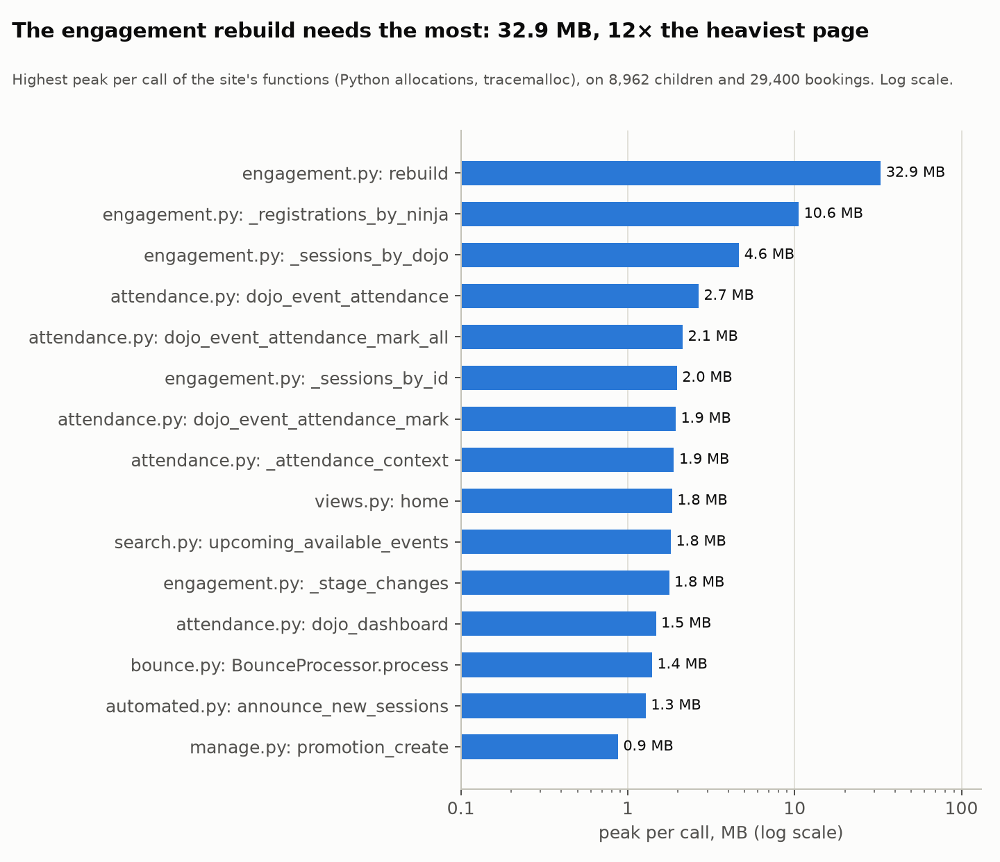
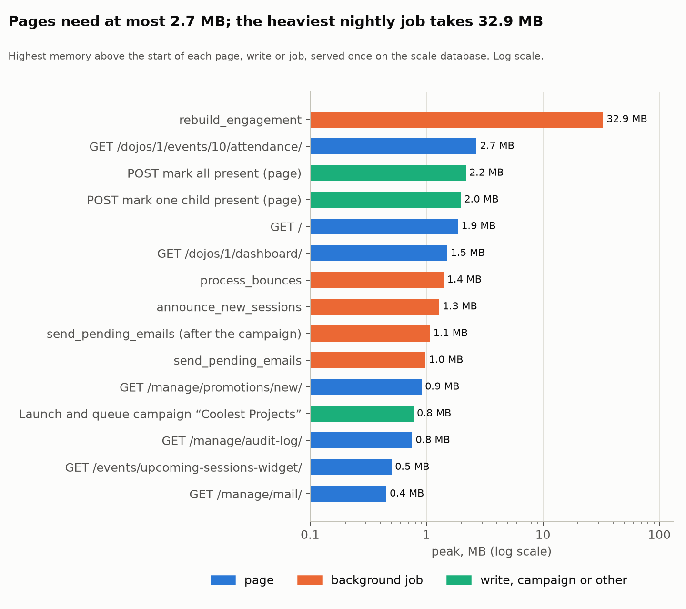

# Memory profile: how much memory each function uses

How much memory the site's own functions take per call, measured over every page and every background job on
a database at the size of a year of growth, and which of them are worth refactoring. For developers (and AI
agents) changing the code. Measured on **3 October 2026**, after that day's two fixes (the engagement rebuild's
reading of the bookings, the index behind the *Mail queue* count; their before and after are below); rerun it ([Measuring again](#measuring-again)) after
a change to a background job or a page that lists many rows, and with the quarterly code-quality measurements
([`CODING_STANDARDS.md`](CODING_STANDARDS.md)).

This page is about **functions**. Memory per *process* (web workers, Celery, Redis) and the memory budget
for production are in [`CAPACITY.md`](CAPACITY.md), "Memory per component"; this page explains where the
largest figures there come from.

**In short:**

- **747 of the site's functions were measured.** For 643 of them a call never needs more than 100 KB, and
  only 3 ever need more than 10 MB. Those 3 are one chain: the nightly engagement rebuild.
- **Pages are light:** across 128 pages a request needs **93 KB at the median** and 2.7 MB at most (the
  attendance list). No page needs memory that grows with the size of the database.
- **Refactored on 3 October 2026:** `events.engagement._registrations_by_ninja` took **128 MB** to read the
  29,400 bookings, because every booking got its own copy of its session and dojo; it now loads every session
  and dojo once and reads the bookings as plain values: **10.8 MB**, in 0.2 s instead of 3.8 s. The children's
  home dojos had the same problem. The whole nightly rebuild went from **132 MB to 35 MB** (and 12.6 s to
  7.4 s), with identical results, and no longer grows with every booking. It was what took the mailing
  worker's Celery child to 300 MB every night (`CAPACITY.md`, measured before).
- **Fixed the same day:** the *Award belt*/*Award badge* forms built a new class for every child on the
  attendance list (`lazy()` in `dojos/forms.py`), about **30 KB per form** that stayed until Python's garbage
  collector ran: 1.6 MB per page for a session of 22 children, now 0.25 MB. Four other forms did the same
  once per page; a guard test now fails on any `lazy()` call inside a function.
- **Everything else is fine as it is:** the mail jobs, campaign queuing, segments, the data export and the
  retention job all stay between 0.2 and 1.4 MB, whatever the number of mails or accounts, because they
  already work in chunks or let the database do the work.
- **Not memory, but found and fixed on the way:** the *Mail queue* page (`/manage/mail/`) took 6.6 seconds,
  almost all of it one count over the mail log; with an index on `(status, sent_at)` the count takes a
  millisecond and the page 0.3 s. See [Seen on the way](#seen-on-the-way-time-not-memory).

---

## Contents

1. [How it was measured](#how-it-was-measured)
2. [All functions at a glance](#all-functions-at-a-glance)
3. [Pages, writes and background jobs](#pages-writes-and-background-jobs)
4. [The functions worth a look, and the verdict](#the-functions-worth-a-look-and-the-verdict)
5. [Seen on the way: time, not memory](#seen-on-the-way-time-not-memory)
6. [Guidelines for memory](#guidelines-for-memory)
7. [Measuring again](#measuring-again)

---

## How it was measured

**The tool** is `quality/memory_profile.py` (development only, no extra dependency). It uses two parts of
Python itself:

- **tracemalloc** counts every allocation Python makes;
- **sys.monitoring** (Python 3.12 and later) reports every start, return, yield and unwind of a function in
  the site's own code: the apps and `website/`, without tests, migrations, seeders and commands (the same
  line as [`CODING_STANDARDS.md`](CODING_STANDARDS.md), "Production code and development-only code").
  Django and the other libraries are switched off per function, so they run at full speed; what they
  allocate is charged to the function of ours that called them.

At each of those events the profiler reads the highest memory since the previous event and charges it to
the function that was running. Per function, over all its calls, that gives three figures:

| Figure | Meaning | What a high value says |
|---|---|---|
| **Peak** | the most memory above what was in use when the call started, at any moment during the call, including everything it called | how much room this call needs: what a worker's memory must be able to absorb |
| **Own peak** | the same, without the moments another function of the site that it called was running (what that function returned still counts) | the memory is taken in this function's own body, or in the library calls it makes (the ORM, templates): this is the function to change |
| **Kept** | what was still allocated after it had returned: its return value and anything it cached or left behind | the memory lives on in the caller; a high value with many calls is a leak to look for |

**The data:** a database made by `manage.py seed_scale --scenario growth --years 1` (the same one as
[`CAPACITY.md`](CAPACITY.md)), plus `seed_mailing`'s example campaigns: **100 dojos, 8,304 accounts, 8,962
children, 1,400 sessions, 29,400 bookings and 188,926 mails**.

**The workload**, with production's settings (`DEBUG`, django-silk and the request metrics off):

1. **Every page once.** Every route of the site whose parameters could be filled in (128 answered 200 or
   302), opened as the account that would open it: a visitor for the public pages, a family (account
   pages, booking, data export), a dojo's champion (the dojo area), an organisation admin (`/manage/…`) and
   an API client with a real token (`/api/v1/…`). Every page was served once before measuring, so imports
   and the template cache don't count, and the data cache (Redis) was emptied in between, so every cached
   part of a page was built once while measured.
2. **The writes that happen most:** a family booking and cancelling places (service and page), a team
   marking one child and *Mark all present*.
3. **Segments and a campaign:** each of the three example segments resolved, and the *Coolest Projects*
   campaign launched and queued (1,039 mails).
4. **Every background job** in `CELERY_BEAT_SCHEDULE`, the way beat starts it (Celery runs eagerly, so what
   a job hands to the queue runs inside it), and the mail dispatcher again after the campaign.
5. **Privacy:** a family's data export and the deletion of that account.

**Limits of the measurement:**

- **Only Python's own allocations count.** Buffers that C libraries keep (MySQL's client, GEOS) and memory
  the allocator holds on to after a free don't, so a process's RSS is higher than the figures here. The
  figures say *where* memory goes and *how it grows*; `CAPACITY.md` has the real process sizes.
- **Memory follows the data.** The figures hold for the database above; a function that reads a whole table
  grows with it (that's the point of the refactor below).
- **"Kept" is read at the next event** in the site's code (at the return itself the function's local
  variables are still alive), so for a function returned into Django it can include a little of what Django
  did next. And memory in reference cycles counts as kept until the garbage collector runs: that's how the
  form problem below shows up.
- **The times in the results file are with the profiler on**, which slows the site's own code a lot (the
  new-sessions digest took 294 seconds traced). Use them to compare, never as a response time; those are in
  `CAPACITY.md`.

## All functions at a glance

| Peak per call | Functions | Share |
|---|---:|---:|
| over 10 MB | 3 | 0.4% |
| 1 to 10 MB | 19 | 2.5% |
| 100 KB to 1 MB | 82 | 11.0% |
| up to 100 KB | 643 | 86.1% |
| **measured** | **747** | |



The highest peaks per call (a caller repeats its callee's peak: the middleware and the Celery task wrappers
are left out; the full list is in `quality/results/memory-2026-10-03.json`):

| Function | Calls | Peak | Own peak | Kept | Where it peaked |
|---|---:|---:|---:|---:|---|
| `events.engagement.rebuild` | 1 | **32.9 MB** (was 130.3) | 32.9 MB | 0 | the nightly engagement rebuild |
| `events.engagement._registrations_by_ninja` | 1 | **10.6 MB** (was 126.5) | 10.6 MB | 13.2 MB | the same |
| `events.engagement._sessions_by_dojo` | 1 | 4.6 MB | 4.6 MB | 3.8 MB | the same |
| `events.engagement._sessions_by_id` | 1 | 2.0 MB | 2.0 MB | | the same: every session once |
| `dojos.views.attendance.dojo_event_attendance` | 1 | 2.7 MB | 2.7 MB | 2.0 MB | the attendance list, 22 children |
| `dojos.views.attendance.dojo_event_attendance_mark_all` | 2 | 2.1 MB | 2.1 MB | 1.5 MB | *Mark all present* |
| `dojos.views.attendance._attendance_context` | 4 | 1.9 MB | 1.9 MB | 1.9 MB | marking one child |
| `pages.views.home` | 2 | 1.8 MB | 1.0 MB | 0.2 MB | the homepage, cache empty |
| `events.search.upcoming_available_events` | 3 | 1.8 MB | 1.8 MB | 0.8 MB | the same |
| `events.engagement._stage_changes` | 1 | 1.8 MB | 1.8 MB | 0.1 MB | the engagement rebuild |
| `dojos.views.attendance.dojo_dashboard` | 1 | 1.5 MB | 1.5 MB | 1.0 MB | the dojo dashboard |
| `mailing.bounce.BounceProcessor.process` | 1 | 1.4 MB | 1.4 MB | 0.5 MB | reading the bounce mailbox |
| `mailing.automated.announce_new_sessions` | 1 | 1.3 MB | 1.3 MB | 0.1 MB | the new-sessions digest, 14,145 mails |
| `mailing.tasks.send_email_batch` | 6 | 1.1 MB | 1.1 MB | 1.0 MB | sending the campaign's mail |
| `content.manage.promotion_create` | 1 | 0.9 MB | 0.9 MB | 0 | *New promotion* (every upcoming session in a select) |
| `dojos.views.attendance._award_forms` | 8 | 0.8 MB | 0.8 MB | 0.8 MB | the attendance list's award forms |
| `campaigns.services.queue_chunk` | 6 | 0.8 MB | 0.8 MB | 0 | queuing the campaign, 200 accounts a chunk |
| `pages.audit_views.manage_audit_log` | 1 | 0.7 MB | 0.7 MB | 0.3 MB | the audit log page |

## Pages, writes and background jobs



| Kind | Measured | Median peak | Highest | Highest at |
|---|---:|---:|---:|---|
| Public pages (visitor) | 24 | 57 KB | 1.9 MB | the homepage with an empty cache |
| Family pages | 34 | 79 KB | 1.4 MB | the homepage, logged in, the cache filled |
| Dojo area (champion) | 29 | 80 KB | 2.7 MB | the attendance list |
| Organisation dashboard | 37 | 107 KB | 0.9 MB | *New promotion* |
| API (a dojo's app) | 4 | 110 KB | 180 KB | the OpenAPI schema |
| Booking and cancelling | 3 | | 0.3 MB | the sign-up page's POST |
| Attendance | 2 | | 2.2 MB | *Mark all present* |
| Segments (up to 7,998 accounts) | 3 | | 0.2 MB | *Everyone active* |
| Campaign launch and queuing (1,039 mails) | 1 | | 0.8 MB | |
| Background jobs (and the dispatcher twice more) | 15 | | 32.9 MB | the engagement rebuild (130.3 MB before its refactor); every other job 1.4 MB or less |
| Data export, account deletion | 2 | | 0.2 MB | |

**What this says:** a web worker never needs much memory for a page. What makes a worker grow under load
(`CAPACITY.md`: 110–135 MB idle, up to 290 MB) is the number of requests it serves at once and Python's
allocator keeping freed memory, not one heavy page. The background jobs are where a single call can be
large, and only one of them is: the engagement rebuild, which reads every child and every booking.

## The functions worth a look, and the verdict

### 1. `events.engagement._registrations_by_ninja`: refactored on 3 October 2026 (128 MB to 10.8 MB)

[`events/engagement.py`](events/engagement.py), called once a night by `rebuild()`. It read every booking
with `select_related("event__dojo")` and sorted them per child:

- **Every booking got its own copy of its session and its dojo.** Django builds new `Event` and `Dojo`
  objects for every row of a `select_related`, also when 20 bookings share a session: 29,400 bookings made
  29,400 `Event` and 29,400 `Dojo` objects, for 1,400 sessions and 100 dojos. A `Dojo` is heavy (its
  translations, location, languages, and its municipality, which the default manager joins as well).
- **The whole queryset was held at once**, while the dictionaries it filled kept the copies alive after it:
  the 100 MB it handed back to `rebuild()`, which held them while it computed every child's row.

So the peak grew with the number of bookings, and bookings only grow (about 29,000 a year in the growth
scenario). It's why the mailing worker's Celery child reached 300 MB every night and was replaced
(`CAPACITY.md`, "Celery's per-child limit").

**What changed:**

- `rebuild()` loads every dojo once (`Dojo.objects.in_bulk()`), and `_sessions_by_id()` every session that
  isn't a draft once, each pointing at that shared dojo (`select_related(None)` drops the default manager's
  join, so no session brings its own copy).
- `_registrations_by_ninja()` reads the bookings as plain values,
  `values_list("ninja_id", "event_id", "attended", "waiting_list").iterator(chunk_size=2000)`, and files the
  shared session objects per child.
- The children's home dojos had the same problem (`Ninja.objects.select_related("home_dojo")`: 8,962 `Dojo`
  copies, 23 MB); they now point at the same shared dojos (7 MB for the children).

Measured on the same database, the old code against the new (without the profiler):

| | Peak | Time |
|---|---:|---:|
| `_registrations_by_ninja`, before | 128.2 MB | 3.83 s |
| `_registrations_by_ninja`, after | **10.8 MB** | **0.18 s** |
| the whole `rebuild()`, before | 131.6 MB | 12.6 s |
| the whole `rebuild()`, after | **34.7 MB** | **7.4 s** |

Both wrote the same 22,792 `NinjaEngagement` rows, field for field, and the second rebuild recorded no stage
change. `events.tests.EngagementTests.test_registrations_share_one_object_per_session_and_dojo` keeps it that
way (one shared object per session and dojo, three queries). **What's left** grows with sessions and
children, not bookings: `rebuild()` still holds every child and all 22,792 rows for its one `bulk_create`;
writing them per batch as it goes would take most of the remaining 33 MB, but there's no need for it yet.

### 2. The award forms on the attendance list: fixed on 3 October 2026 (30 KB per form, kept until the garbage collector ran)

[`dojos/forms.py`](dojos/forms.py), `AwardForm.__init__` (behind `AwardBeltForm` and `AwardBadgeForm`, two
per child on the attendance list, the dashboard, and after marking one child or all) did this:

```python
self.fields["note"].widget.attrs["placeholder"] = lazy(lambda: placeholder % {"name": name}, str)()
```

`django.utils.functional.lazy()` defines a new proxy class every time it's called, with a wrapper for
every method of `str`: about 30 KB per call. Classes refer to themselves, so they're only freed by the
garbage collector's full collection, not when the request ends. For a session of 22 children that's 44
forms, **1.3 MB per page** held until a collection, and more for a big session or a team clicking through
attendance quickly. It's the "kept" of the attendance views above.

**The fix** keeps the text lazy (it still renders in the language of the page that shows it) but calls
`lazy()` once, at module level, and the function it returns per form:

```python
note_placeholder_lazy = lazy(_note_placeholder, str)  # once, when the module loads
...
self.fields["note"].widget.attrs["placeholder"] = note_placeholder_lazy(self.note_placeholder, name)
```

Calling the result only makes a small object, never a class. Measured for 22 children (44 forms), the old
way swapped back in for the comparison:

| | Building the 44 forms | Left until the next full garbage collection |
|---|---:|---:|
| `lazy()` per form | 1,518 KB | 1,558 KB per page |
| `lazy()` once, its result per form | **213 KB** | **252 KB** per page |

Nothing is left once the collector has run, so it was never a leak, but full collections are rare next to
requests, so a busy attendance session kept a worker megabytes larger than it needed. **Four other forms
did the same**, once per page rather than per child, and got the same fix: the password rules on the
password pages (`accounts.forms.password_rules_lazy`), a child's email label on *Own login*
(`child_email_label_lazy`), the segment help on a campaign (`campaigns.forms.segments_help_lazy`) and the
username confirmation on the organisation's *Delete…* page (`privacy.forms.confirm_label_lazy`). No
translated text changed. **The rule** is guarded by `core.tests.LazyOnlyAtModuleLevelTests`, which reads the
site's code and fails on any `lazy()` call inside a function (and checks that a text made once still
follows the language it's shown in). The page figures above were measured before this fix.

### 3. Fine as they are

| Function or job | Peak | Why it's fine |
|---|---:|---|
| `events.engagement._sessions_by_dojo` | 4.6 MB | one entry per session in the history window; grows with sessions (1,400 a year), not with bookings. It could share `_sessions_by_id()`'s objects if the rebuild ever needs room again. |
| The attendance views and the dojo dashboard | 1.5–2.7 MB | bounded by the size of one session; measured before fix 2, which took about 1.3 MB off the forms. |
| The homepage and `upcoming_available_events` | 1.8 MB | only when the cache is empty: the next requests read it from Redis (1.4 MB for the whole page, most of it rendering). |
| `mailing.automated.announce_new_sessions` | 1.3 MB for 14,145 mails | it renders and queues one mail at a time; nothing is gathered first. |
| `send_pending_emails` and `send_email_batch` | 1.1 MB | they claim at most `MAILING_CLAIM_LIMIT` rows and send in batches. |
| Campaign launch and queuing (`queue_chunk`) | 0.8 MB for 1,039 mails | 200 accounts per chunk (`MAILING_CAMPAIGN_CHUNK_SIZE`), as `CAPACITY.md` finding 8 intended. |
| Segment resolution | 0.2 MB for 7,998 accounts | every rule is a subquery: the database does the work, Python holds a queryset. |
| `content.manage.promotion_create` | 0.9 MB | its event select lists every upcoming session, drafts included; fine for hundreds, a search field if it grows to thousands. |
| `pages.audit_views.manage_audit_log` | 0.7 MB | 50 entries a page. |
| Data export and account deletion | 0.2 MB | one person's rows. |
| The retention job | 0.4 MB | it reads the accounts due, not all of them. |

## Seen on the way: time, not memory

- **The *Mail queue* page took 6.6 seconds** on 188,926 mails, almost all of it one query: the count of
  mail sent in the last 24 hours (`mailing/manage/queue.py`, `status=sent` and `sent_at >= …`; the dojo's
  own *Mail queue*, `campaigns/dojo_views.py`, counts the same). The mail table's only index was
  `(status, priority, created_at)`, so MySQL read all 94,000 sent mails to check their `sent_at`, and it
  got slower every month (the mail log grows by about 190,000 rows a year, `CAPACITY.md`). **Fixed on
  3 October 2026** with an index on `(status, sent_at)` (`mailing_sent_idx`, migration
  `mailing/0017_sent_at_index`): a range read inside the index. The count went from **9 s to 1 ms**, the
  organisation's page to **0.33 s** and the dojo's to 0.13 s. MySQL 8 builds a secondary index online
  (reads and writes carry on meanwhile), so the migration is safe on a running site.
- **`events.engagement.is_aimed_at` is called 273,504 times** a night (every child against every session
  at their dojos). Each call is cheap and allocates nothing lasting, but it's most of the rebuild's remaining
  7 seconds.

## Guidelines for memory

These follow from what was measured; they're how the functions that are fine already work.

- **A job that reads a whole table reads values, not objects.** `values_list(...)` with `.iterator()` for the
  big table, and the small tables it refers to loaded once into a dict (`in_bulk()`) and shared. Never
  `select_related` across a whole table: every row gets its own copy of the related objects.
- **Work in chunks and let the database count.** Queue, send and erase per chunk (as campaigns and the mail
  dispatcher do), count with `.count()`/`aggregate()`, filter with subqueries (as segments do); don't
  build a Python list of every row to measure its length.
- **A page shows a bounded number of rows**: paginate (the audit log), or show a session's children, never
  a whole table.
- **`lazy()` once, at module level**, and call what it returns per object: each `lazy()` call defines a
  class. `gettext_lazy` at module level and `gettext` in a view are fine. `core.tests.LazyOnlyAtModuleLevelTests`
  fails on a `lazy()` call inside a function.
- **Keep data in the cache, not in the process.** The caches are in Redis (`core/caching.py`); a
  module-level dict that fills up with data lives as long as the worker and is copied per worker.
- **Look at "own peak" to find the function to change**: its callers repeat its peak, its own peak is where
  the memory is taken.

## Measuring again

In the devcontainer's workspace. The profiler writes to its database (bookings, attendance, a campaign's
mail, the retention job, one deleted account), so it refuses any database whose name doesn't start with
`test_`, and a second run needs the database made again. About 8 minutes in all (the new-sessions digest is
slow under the profiler); the charts use matplotlib, as `quality/charts.py` already does.

```sh
export DB_NAME=test_memory REDIS_CACHE_DB=4 REDIS_CHANNELS_DB=5 CELERY_BROKER_DB=6
# 1. A database at scale, made fresh (a minute)
python -c "import os, MySQLdb; c = MySQLdb.connect(host=os.environ['DB_HOST'], user=os.environ['DB_USER'], passwd=os.environ['DB_PASSWORD']).cursor(); c.execute('DROP DATABASE IF EXISTS test_memory'); c.execute('CREATE DATABASE test_memory CHARACTER SET utf8mb4')"
python manage.py migrate -v0
python manage.py seed_scale --scenario growth --years 1
python manage.py seed_mailing

# 2. The profile and the charts (commit quality/results/ and quality/charts/)
python quality/memory_profile.py > quality/results/memory-$(date +%F).json
python quality/charts.py --memory quality/results/memory-$(date +%F).json

# 3. Clean up: drop test_memory and empty Redis dbs 4-6
python -c "import os, MySQLdb; MySQLdb.connect(host=os.environ['DB_HOST'], user=os.environ['DB_USER'], passwd=os.environ['DB_PASSWORD']).cursor().execute('DROP DATABASE test_memory')"
for db in 4 5 6; do python -c "import os, redis; redis.Redis(host=os.environ['REDIS_HOST'], db=$db).flushdb()"; done
```

The results file has every function (`functions`: calls, `peak`, `peak_mean`, `own`, `kept`, `kept_total`
and the step where it peaked) and every step (`steps`: the page, write or job, its status, `peak`, `kept`
and the time under the profiler). To look into one function, a `tracemalloc` snapshot taken before and
after a call and compared by traceback (`snapshot.compare_to(before, "traceback")`) names the lines that
allocate; that's how the award forms were found.
