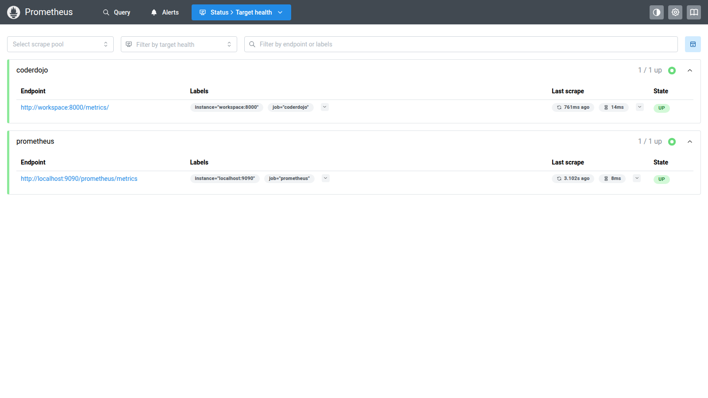
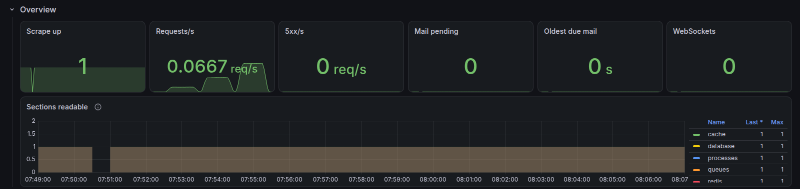
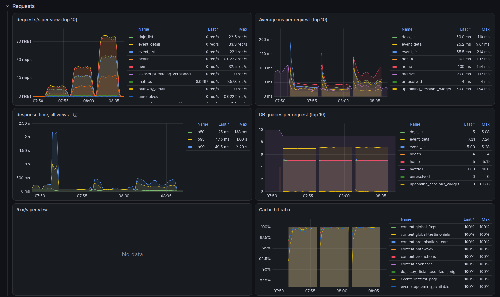
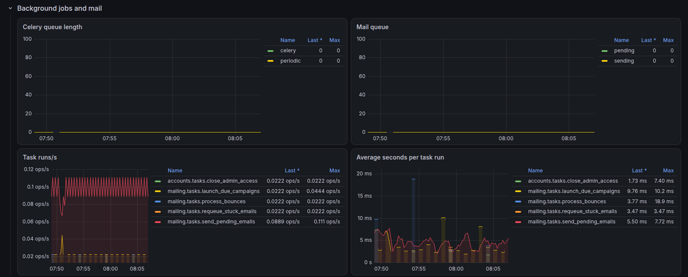
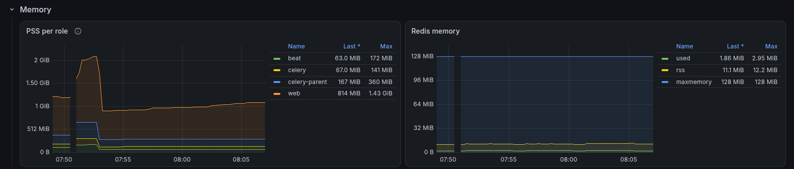
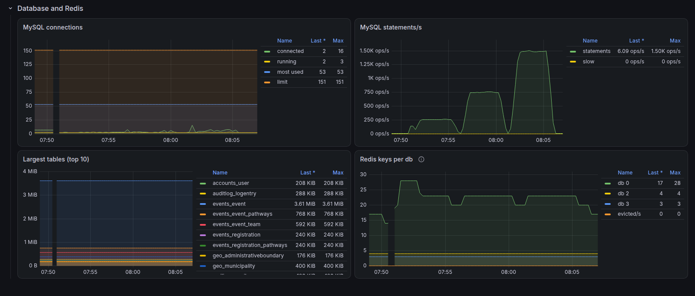
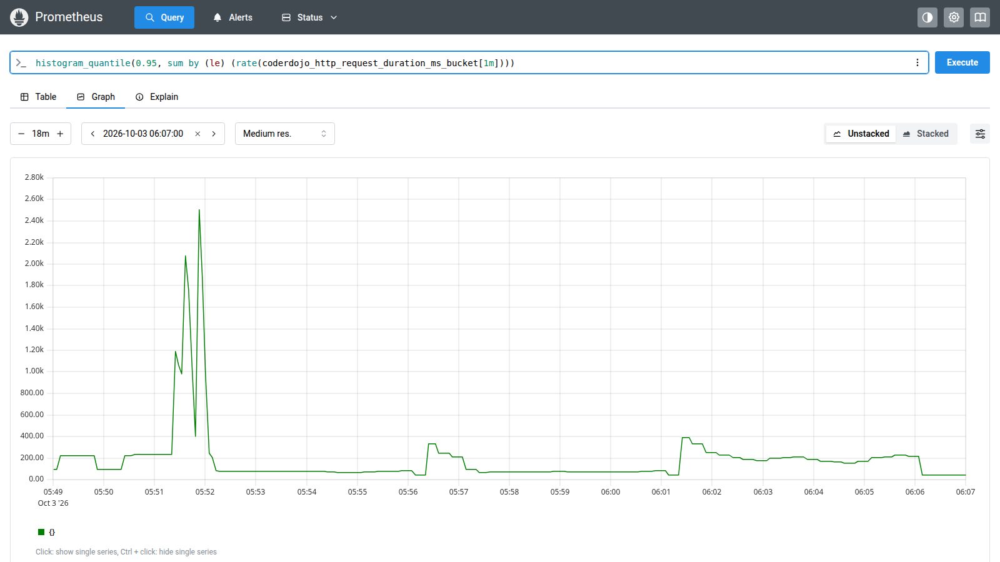

# Monitoring: the metrics explained

The site measures itself and publishes the figures on `/metrics/`; Prometheus collects them every 15 seconds and
Grafana draws them on the *CoderDojo site* dashboard. Nothing on that page names a person: only counts, sizes and
timings. This file explains every metric and every panel, with screenshots of the dashboard during a load test.
How to act on them in production (thresholds) is in [`CAPACITY.md`](CAPACITY.md), "Watching production"; the
measurements behind the capacity figures are there too.

- **`/metrics/`** (`monitoring/views.py`) answers in Prometheus text format, only with `METRICS_TOKEN` as a bearer
  token (`Authorization: Bearer ...`), and is a 404 when the token is empty.
- **Prometheus** (the devcontainer's `monitoring` profile, `.devcontainer/monitoring/prometheus.yml`) scrapes
  `workspace:8000/metrics/` every 15 s, straight from the container, and also scrapes itself.
- **Grafana** shows the provisioned dashboard (`.devcontainer/monitoring/grafana/dashboards/coderdojo.json`; edit
  that file to keep a change) at `https://coolregistration.localhost/grafana/`, with no login in development.

## Contents

1. [Turning it on](#turning-it-on)
2. [The dashboard under load](#the-dashboard-under-load)
3. [The metrics in detail](#the-metrics-in-detail)
4. [The dashboard's panels](#the-dashboards-panels)
5. [Running the load test again](#running-the-load-test-again)

## Turning it on

Prometheus and Grafana are in the `monitoring` Compose profile, off by default:

- for good: `COMPOSE_PROFILES=monitoring` in `.devcontainer/.env` (a VS Code rebuild reads it), or in the
  environment that runs `docker compose`;
- once, from the host: `docker compose -f .devcontainer/docker-compose.yml --profile monitoring up -d`.

Then open `https://coolregistration.localhost/grafana/` (dashboard *CoderDojo site*) or
`https://coolregistration.localhost/prometheus/` (*Status → Targets* shows whether the scrape works). The
`workspace` service must have `workspace` in its `ALLOWED_HOSTS` and `METRICS_TOKEN=dev-metrics-token`: a
workspace container created before those were added answers Prometheus with **400 Bad Request**
(`DisallowedHost` in the log) and needs recreating.



## The dashboard under load

**At 600 visitors the site served 113 requests a second with no errors, a 95th percentile of 180 ms and at
most 16 MySQL connections.** That was the production-like setup on 3 October 2026: DEBUG and django-silk off,
gunicorn with 4 uvicorn workers capped at 25 connections each, the two Celery workers, and the devcontainer's
seeded data. The load was Locust's `public` mode (visitors on the homepage, the dojo finder, the events list and
event pages, nothing written), each request on a new connection as behind a proxy, in three steps of 4 minutes
with a minute's rest between them ([how](#running-the-load-test-again)).

| Visitors | Requests | Requests/s | p50 | p95 | p99 | Errors | MySQL connections (max) | MySQL statements/s (max) | Queries per request |
|---:|---:|---:|---:|---:|---:|---:|---:|---:|---:|
| 100 | 4,774 | 20 | 35 ms | 74 ms | 190 ms | 0 | 3 | 264 | 5.2 |
| 300 | 14,003 | 59 | 29 ms | 79 ms | 190 ms | 0 | 8 | 763 | 5.1 |
| 600 | 27,024 | 113 | 37 ms | 180 ms | 330 ms | 0 | 16 | 1,502 | 5.2 |

The response times are Locust's (what a visitor waits, including any wait for a worker); the MySQL figures come
from Prometheus. The load generator ran on the same machine as the site, and the devcontainer has far more CPU
than production, so take the ratios between the steps, not the absolute times (`CAPACITY.md`, "How it was
measured"). The times on the screenshots are the host's local time (UTC+2): the steps ran 07:51, 07:56 and
08:01.

**Overview.** Requests/s shows the three steps; no 5xx, no mail waiting, and every section of `/metrics/`
readable. The gap at 07:50 is the workspace restarting just before the test.



**Requests.** The requests follow the steps (event pages and the homepage carry the most). The average time
per view stays between 25 and 110 ms; the p99 spike to about 2 s at 07:52 is the first minute after the
restart, with the workers and the caches still cold, and doesn't come back. Queries per request stay flat
(5 for the lists and the homepage, 7 for an event page) whatever the load, which is what the data caches are
for, and the cache hit ratio is 100% apart from a short dip as each step starts. "No data" on 5xx/s per view is
the good answer.



**Background jobs and mail.** Untouched by the visitors: the queues stay at 0 and the task rate is beat's rhythm
(the 10-second mail dispatcher, the minute and five-minute jobs).



**Memory.** The 4 web workers together grew from about 0.9 to 1.05 GiB PSS over the test; Celery and beat stay
near 300 MB. The higher totals before 07:53 still count the processes from before the restart (a process's
report lasts 2.5 minutes). Redis held under 3 MB of its 128 MB.



**Database and Redis.** MySQL statements per second follow the request rate (about 13 per request: more than the 5
to 7 queries the views make, most likely because Django opens a new connection per request, `CONN_MAX_AGE`
being 0, and setting one up costs a few statements of its own), while connections stay low: 16 at most against a limit of 151, because
a request only holds one while it runs. ("Most used", 53, dates from before the test.) No slow queries, no
evicted Redis keys.



**Prometheus** itself answers the same questions without a dashboard: its *Query* page with the p95 over the
whole run, in UTC.



## The metrics in detail

Every metric starts with `coderdojo_` (left out in the tables). A **counter** only goes up, so Grafana shows its
`rate()` per second; a **gauge** is a level, read as it is. The request, task and cache counters live in the
cache's Redis (`monitoring/recorder.py`), so every gunicorn and Celery process adds to the same numbers; a
`cache.clear()` resets them, which Prometheus treats as a counter restarting. When one part can't be read (MySQL
or Redis down), only that section is missing from the page and `metrics_section_up` shows it as 0.

### Requests

Recorded by `monitoring.middleware.RequestMetricsMiddleware`, first in `MIDDLEWARE`, for every request Django
handles. The `view` label is the URL name, so `/events/71/` and `/events/72/` count together as `event_detail`;
`unresolved` is a URL that matched no view (a 404).

| Metric | Type | Labels | What it measures | What to watch for |
|---|---|---|---|---|
| `http_requests_total` | counter | `view` | Requests per view | The traffic mix; a view that suddenly dominates |
| `http_request_milliseconds_total` | counter | `view` | Time spent in Django per view, from the first middleware to the response | Divided by the requests: the average ms per request |
| `http_request_duration_ms_bucket` | counter | `view`, `le` | Requests that took at most 50, 100, 250, 500, 1000, 2500 or 5000 ms (a Prometheus histogram) | The p50, p95 and p99 the dashboard computes from it; p95 is what a visitor on a busy moment feels |
| `http_db_queries_total` | counter | `view` | Database queries per view | Divided by the requests: queries per request. A jump means a lost `select_related` or a cache that stopped working |
| `http_server_errors_total` | counter | `view` | 5xx responses per view | Anything above zero |
| `cache_hits_total`, `cache_misses_total` | counter | `cache` | Reads of each data cache (`core.caching`) that found it, or had to build it | The hit ratio; one that drops under load means the cache is cleared too often |

The time measured is Django's only. A request that waits for a free worker, or that uvicorn refuses with a 503
because the worker already has 25 connections (`gunicorn.conf.py`), never reaches Django: that wait and those
refusals are not here (they're in gunicorn's log, and in what the load test itself measures).

### Database

Read from MySQL on every scrape (`monitoring/collect.py`).

| Metric | Type | Labels | What it measures | What to watch for |
|---|---|---|---|---|
| `mysql_threads_connected` | gauge | | Open MySQL connections, from every process | Every request in progress holds one; compare with `mysql_max_connections` |
| `mysql_threads_running` | gauge | | Connections running a query at that moment | Rising with load means MySQL itself has become the queue |
| `mysql_max_used_connections` | gauge | | The most connections at once since MySQL started | The headroom left under the limit |
| `mysql_max_connections` | gauge | | MySQL's limit (151 by default) | The line the others must stay under |
| `mysql_questions_total` | counter | | Statements MySQL received | Statements per second; per request when divided by the request rate |
| `mysql_slow_queries_total` | counter | | Queries slower than MySQL's `long_query_time` | Any rise |
| `db_table_rows` | gauge | `table` | Rows per table, InnoDB's estimate (fine for sizing, not for counting) | Growth over weeks, against `CAPACITY.md`'s projections |
| `db_table_bytes` | gauge | `table` | Data plus index size per table | The mail log (`mailing_emailmessage`) grows fastest; its text is cleared a year after each mail (the retention job), but the rows stay, so it keeps growing slowly |

### Redis

One Redis server holds three databases: 0 the cache, 1 the Channels layer (WebSockets), 2 the Celery broker (and 3
the tests' cache).

| Metric | Type | Labels | What it measures | What to watch for |
|---|---|---|---|---|
| `redis_used_memory_bytes` | gauge | | Memory Redis holds for its data | Against `redis_maxmemory_bytes` (128 MB) |
| `redis_used_memory_peak_bytes` | gauge | | The most it ever held | How close it came |
| `redis_used_memory_rss_bytes` | gauge | | Memory the operating system gives Redis | Far above used memory means fragmentation |
| `redis_maxmemory_bytes` | gauge | | The limit (`--maxmemory`) | Past it, keys with a timeout are evicted (`volatile-lru`) |
| `redis_evicted_keys_total` | counter | | Keys thrown out because memory was full | Should stay 0; above it, the cache is too small |
| `redis_expired_keys_total` | counter | | Keys that reached their timeout | Normal churn |
| `redis_rejected_connections_total` | counter | | Connections refused (Redis's client limit) | Should stay 0 |
| `redis_connected_clients` | gauge | | Open client connections | Grows with web workers and WebSockets |
| `redis_keys` | gauge | `db` | Keys per database | db 2 growing without end means tasks pile up |

### Background jobs, mail and WebSockets

| Metric | Type | Labels | What it measures | What to watch for |
|---|---|---|---|---|
| `celery_queue_length` | gauge | `queue` | Tasks waiting in `celery` (mail and other work) and `periodic` (beat's jobs) | A queue that keeps growing: a worker is down or too slow |
| `task_runs_total` | counter | `task` | Celery task runs (Celery's signals, `monitoring/celery_signals.py`) | The mail dispatcher runs every 10 s, so about 0.1/s is the baseline |
| `task_seconds_total` | counter | `task` | Time spent per task | Divided by the runs: the average seconds per run |
| `task_failures_total` | counter | `task` | Failed runs | Any rise |
| `task_max_seconds` | gauge | `task` | The longest run of each task so far | A periodic job near 10 s holds up the mail dispatcher |
| `mail_pending` | gauge | | Mail waiting to be sent | A bulge after a campaign is normal; one that stays is not |
| `mail_sending` | gauge | | Mail claimed by a worker, not yet sent | Stuck above 0 for 15 minutes: a worker died halfway through a batch |
| `mail_oldest_due_seconds` | gauge | | How long the oldest due mail has waited | Over 30 minutes: the workers are down (`/health/` checks this too) |
| `websocket_connections` | gauge | | Open notification-bell WebSockets, approximately (members of the Channels groups) | A connection that died without closing lingers for up to a day |

### Processes and the scrape itself

| Metric | Type | Labels | What it measures | What to watch for |
|---|---|---|---|---|
| `process_pss_bytes` | gauge | `role`, `host`, `pid` | Each process's fair share of memory: pages it shares with forked siblings are divided among them | Sum it per role for the real total, the figure to plan the account's memory on |
| `process_rss_bytes` | gauge | `role`, `host`, `pid` | Resident memory, counting shared pages in full | Adding these up overstates the total |
| `process_max_rss_bytes` | gauge | `role`, `host`, `pid` | Peak resident memory | What Celery's `--max-memory-per-child` compares with |
| `metrics_section_up` | gauge | `section` | 1 when a section (database, redis, queues, processes, requests, tasks, cache) could be read | A 0 names the component that's down |
| `up` | gauge | `job` | Prometheus's own: 1 when the scrape answered with metrics | 0 means the site is down, or the host or token is wrong |

**CPU isn't on `/metrics/`.** Memory and disk are; CPU comes from the hosting provider's panel (or a
host agent). Measured on 3 October 2026: a page costs about 27 ms of CPU in the web workers and 2 ms in
MySQL, and a worker uses one core at most, whatever its threads (`CAPACITY.md`, "Load: web requests";
the help centre's *CPU, memory and disk* page explains it for the people running the site).

A process's `role` is `web` (a gunicorn or runserver worker), `celery` (a worker's child that runs tasks),
`celery-parent` or `beat`. Each process reports its memory every 60 s with a 150 s timeout, so one that has gone
(a restart, a recycled Celery child) drops out of the totals within 2.5 minutes; right after a restart, the totals
briefly count the old processes and the new ones.

## The dashboard's panels

| Row | Panel | Query (simplified) | How to read it |
|---|---|---|---|
| Overview | Scrape up | `up{job="coderdojo"}` | 1 = Prometheus reads `/metrics/` |
| | Requests/s, 5xx/s | the sum of the request and error counters' rates | The site's traffic and its errors right now |
| | Mail pending, Oldest due mail | `mail_pending`, `mail_oldest_due_seconds` | Whether the mail workers keep up |
| | WebSockets | `websocket_connections` | Open notification bells |
| | Sections readable | `metrics_section_up` per section | A dip to 0 names the part that couldn't be read; gaps are scrapes that didn't answer in time |
| Requests | Requests/s per view (top 10) | rate of `http_requests_total` by view | Which pages carry the load |
| | Average ms per request (top 10) | time rate ÷ request rate, by view | Which pages are slow on average |
| | Response time, all views | `histogram_quantile` 0.5, 0.95, 0.99 over the buckets | p50 is the typical request, p95/p99 the slow tail. The buckets end at 5000 ms, so anything slower shows as 5 s |
| | DB queries per request (top 10) | query rate ÷ request rate, by view | Should stay flat whatever the load; a rise is an N+1 query or a cache gone cold |
| | 5xx/s per view | rate of `http_server_errors_total`, only above 0 | "No data" is the good answer |
| | Cache hit ratio | hits ÷ (hits + misses), by cache | Close to 100% for `content:*` and the public lists |
| Background jobs and mail | Celery queue length | `celery_queue_length` | Flat at 0 unless a campaign or a slow job is running |
| | Mail queue | `mail_pending`, `mail_sending` | Same, for mail |
| | Task runs/s | rate of `task_runs_total` by task | Beat's rhythm: the 10-second dispatcher, the 1- and 5-minute jobs |
| | Average seconds per task run | time ÷ runs, by task | A job growing slower over time |
| Memory | PSS per role | `sum by (role) (process_pss_bytes)` | Memory of web workers, Celery and beat |
| | Redis memory | used, rss and maxmemory | How full Redis is |
| Database and Redis | MySQL connections | connected, running, most used, limit | Under load, connected follows the requests in progress |
| | MySQL statements/s | rate of `mysql_questions_total`, and slow queries | Follows the request rate times the queries per request |
| | Largest tables (top 10) | `topk(10, db_table_bytes)` | A slow trend; flat during a test |
| | Redis keys per db | `redis_keys` and the eviction rate | db 0 grows as caches fill; evictions should stay 0 |

## Running the load test again

The screenshots above came from these steps (`loadtest/`, `CAPACITY.md` "Measuring again" has the full method,
including the `mixed` and `rush` modes that need a `seed_scale` database):

1. Production-like site: `DEBUG=false` in `.devcontainer/.env` (with `COMPOSE_PROFILES=monitoring`), recreate the
   `workspace` container and run `start.sh` with `WEB_CONCURRENCY=4`: gunicorn with 4 uvicorn workers, DEBUG and
   django-silk off. With DEBUG on, the dev server, the debug toolbar and silk make every request seconds slower
   and the figures say nothing about production.
2. Locust in a venv of its own inside the workspace:
   `python3 -m venv /tmp/ltvenv && /tmp/ltvenv/bin/pip install -r loadtest/requirements.txt`.
3. The load, in steps with a minute's rest between them so each step shows up on its own in Grafana:

   ```sh
   export LOADTEST_HOST=http://workspace:8000 METRICS_TOKEN=dev-metrics-token LOADTEST_CLOSE=1 \
          LOADTEST_OUT=/tmp/lt-out LOCUST=/tmp/ltvenv/bin/locust
   for u in 100 300 600; do bash loadtest/run.sh public-$u $u 20 4m public; sleep 60; done
   ```

4. Set the dashboard's time range to the run (top right) and look at it; set `DEBUG` back on afterwards.
