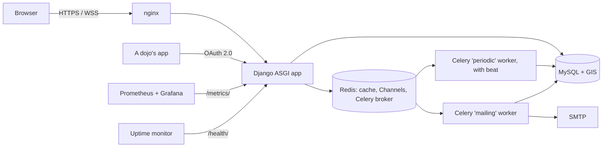

# CoderDojo Belgium — registration platform

[](https://github.com/DoublG/coderdojo-event-registration/actions/workflows/tests.yml)

The website for [CoderDojo Belgium](https://coderdojobelgium.be)'s free coding clubs for children aged 7–17:
families find a dojo and sign their children up, volunteers are vetted once and help at any dojo, dojo
teams run their sessions, and the organisation communicates, promotes events and keeps the whole thing
GDPR-compliant. In English, Dutch and French.

Django 6.1 on Python 3.14, MySQL with GIS, server-rendered pages with [htmx](https://htmx.org/), Celery
workers for all mail, and Django Channels for live notifications.

**Contents:** [Documentation](#documentation) · [Components](#components) · [Architecture](#architecture) ·
[Getting started](#getting-started) · [Monitoring](#monitoring) · [Tests and linting](#tests-and-linting) · [Deploying](#deploying) ·
[Repository layout](#repository-layout)

---

## Documentation

| For | Document | What it covers |
|---|---|---|
| Everyone | [User journeys](#user-journeys-pdf) | One PDF per persona with screenshots, in English, Dutch and French |
| Decision makers | [Pitch deck](#pitch-deck) | The journeys plus facts and figures about the development |
| Families, volunteers, dojo teams, the organisation | [Help centre](https://doublg.github.io/coderdojo-event-registration/) ([sources](#help-centre)) | How to use the site, in English, French and Dutch |
| Developers | [Technical foundation and data model (PDF)](user-journeys/technical-foundation-and-data-model.pdf) | How the site is built, the data model and the rationale, with diagrams |
| Developers | [`DATA_MODEL.md`](DATA_MODEL.md) | The data model, one Mermaid diagram per area, and the design decisions behind every larger change |
| Developers and AI agents | [`CLAUDE.md`](CLAUDE.md) | Conventions, architecture and workflow rules for changing the code safely ([`AGENTS.md`](AGENTS.md) is the same file) |
| Developers and whoever runs the platform | [`MAINTENANCE.md`](MAINTENANCE.md) | Versions and support dates (development and production), updates, responding to vulnerabilities, code audits, the security log |
| Developers | [`CODING_STANDARDS.md`](CODING_STANDARDS.md) | Coding standards, linting and formatting, type checking, accessibility (WCAG 2.2 AA), tests and guard tests, test coverage (what is and isn't covered), complexity, production versus development-only code |
| Developers and whoever runs the platform | [`CAPACITY.md`](CAPACITY.md) | Database growth, disk and uploads, memory per component, load test results with charts, and how to measure again (on production too) |
| Developers and whoever runs the platform | [`MONITORING.md`](MONITORING.md) | Every metric on `/metrics/` and every panel of the Grafana dashboard explained, with screenshots under load |
| Developers | [`MEMORY_PROFILE.md`](MEMORY_PROFILE.md) | The memory each of the site's functions uses per call, over every page and background job, and which are worth refactoring |
| Security researchers | [`SECURITY.md`](SECURITY.md) | How to report a vulnerability, and what's supported |

### User journeys (PDF)

Each persona walked through the development site with its demo data. How they're made and rebuilt:
[`user-journeys/README.md`](user-journeys/README.md).

| Persona | English | Nederlands | Français |
|---|---|---|---|
| Parent | [1-parent-journey.pdf](user-journeys/en/1-parent-journey.pdf) | [1-ouder.pdf](user-journeys/nl/1-ouder.pdf) | [1-parent.pdf](user-journeys/fr/1-parent.pdf) |
| Ninja (a child's own login) | [2-ninja-journey.pdf](user-journeys/en/2-ninja-journey.pdf) | [2-ninja.pdf](user-journeys/nl/2-ninja.pdf) | [2-ninja.pdf](user-journeys/fr/2-ninja.pdf) |
| Volunteer (mentor) | [3-volunteer-journey.pdf](user-journeys/en/3-volunteer-journey.pdf) | [3-vrijwilliger.pdf](user-journeys/nl/3-vrijwilliger.pdf) | [3-benevole.pdf](user-journeys/fr/3-benevole.pdf) |
| Champion (runs a dojo) | [4-champion-journey.pdf](user-journeys/en/4-champion-journey.pdf) | [4-champion.pdf](user-journeys/nl/4-champion.pdf) | [4-champion.pdf](user-journeys/fr/4-champion.pdf) |
| Background-check reviewer | [5-reviewer-journey.pdf](user-journeys/en/5-reviewer-journey.pdf) | [5-beoordelaar.pdf](user-journeys/nl/5-beoordelaar.pdf) | [5-evaluateur.pdf](user-journeys/fr/5-evaluateur.pdf) |
| Organisation admin | [6-organisation-journey.pdf](user-journeys/en/6-organisation-journey.pdf) | [6-organisatie.pdf](user-journeys/nl/6-organisatie.pdf) | [6-organisation.pdf](user-journeys/fr/6-organisation.pdf) |

### Pitch deck

| | English | Nederlands |
|---|---|---|
| PDF | [pitch-deck.pdf](user-journeys/en/pitch-deck.pdf) | [pitchdeck.pdf](user-journeys/nl/pitchdeck.pdf) |
| Online deck (claude.ai, private until shared; exports to PowerPoint) | [Open](https://claude.ai/artifact/LDyAfN3vCf5RdS8oxhTDPt) | [Openen](https://claude.ai/artifact/RDPZX7Ua73bKdzqvpifhqa) |

The last slide's "ask" is still placeholders.

### Help centre

The end-user documentation (Sphinx) in [`docs/`](docs/), published at
**<https://doublg.github.io/coderdojo-event-registration/>** ([Français](https://doublg.github.io/coderdojo-event-registration/fr/),
[Nederlands](https://doublg.github.io/coderdojo-event-registration/nl/)) on every push to main that changes it,
and served by the dev environment at `https://coolregistration.localhost/docs/`. Building and translating it:
[`docs/README.md`](docs/README.md).

| Audience | Pages |
|---|---|
| Families | [Creating an account](docs/source/families/creating-an-account.rst) · [Finding a dojo](docs/source/families/finding-a-dojo.rst) · [Signing up for a session](docs/source/families/signing-up-for-a-session.rst) · [Managing your account](docs/source/families/managing-your-account.rst) · [Mail preferences](docs/source/families/mail-preferences.rst) · [Two-step login](docs/source/families/two-step-login.rst) · [Logging in with a link](docs/source/families/logging-in-with-a-link.rst) |
| Volunteers | [Become a mentor or volunteer](docs/source/volunteering/become-a-mentor-or-volunteer.rst) · [Background check](docs/source/volunteering/background-check.rst) · [Start a new dojo](docs/source/volunteering/start-a-new-dojo.rst) |
| Dojo teams | [Logging in](docs/source/dojo-team/logging-in.rst) · [Running a session](docs/source/dojo-team/running-a-session.rst) · [Mailing your families](docs/source/dojo-team/mailing-your-families.rst) · [API clients](docs/source/dojo-team/api-clients.rst) |
| The organisation | [Dashboard](docs/source/organisation/dashboard.rst) · [Volunteers](docs/source/organisation/volunteers.rst) · [Campaigns](docs/source/organisation/campaigns.rst) · [Segments](docs/source/organisation/segments.rst) · [Journeys](docs/source/organisation/journeys.rst) · [Mail templates](docs/source/organisation/mail-templates.rst) · [Mail queue](docs/source/organisation/mail-queue.rst) · [Promotions](docs/source/organisation/promotions.rst) · [Sponsors](docs/source/organisation/sponsors.rst) · [Awards](docs/source/organisation/awards.rst) · [Privacy](docs/source/organisation/privacy.rst) · [People](docs/source/organisation/people.rst) · [Sign-in security](docs/source/organisation/sign-in-security.rst) · [Audit log](docs/source/organisation/audit-log.rst) · [Django admin](docs/source/organisation/django-admin.rst) |
| Whoever runs the site | [Monitoring the site](docs/source/monitoring/overview.rst) · [The workers](docs/source/monitoring/workers.rst) · [CPU, memory and disk](docs/source/monitoring/server-resources.rst) · [What to watch for](docs/source/monitoring/what-to-watch.rst) |
| Everyone | [FAQ](docs/source/faq.rst) |

### Other READMEs

- [`.devcontainer/certs/README.md`](.devcontainer/certs/README.md): the local TLS certificate for `coolregistration.localhost`.
- The vendored browser libraries each have a README with their source and how to upgrade: [htmx](core/static/core/vendor/htmx/), the fonts in [`core/static/core/fonts/`](core/static/core/fonts/) and OpenLayers in [`geo/static/geo/vendor/`](geo/static/geo/vendor/).

---

## Components

Each Django app owns its models, views and `urls.py` (all mounted at the site root). The rules live in
service modules that views, the admin, the API and Celery jobs all call.

| App | What it does | Where the rules live |
|---|---|---|
| [`accounts`](accounts/) | Every login (`User`: adult, ninja or API service account), children (`Ninja`) and their guardians, organisation roles, two-step login, login links, the sign-in policy, the family pages | `two_step.py`, `login_links.py`, `child_accounts.py`, `organisation.py`, `sign_in.py` |
| [`dojos`](dojos/) | Dojos and their lifecycle, dojo teams (`DojoMembership`), the dojo admin area, the dojo finder | `team.py`, `access.py`, `search.py` |
| [`events`](events/) | Sessions, registrations and the waiting list, attendance, badges and belts, the nightly engagement snapshot | `awards.py`, `attendance.py`, `engagement.py` |
| [`applications`](applications/) | Mentor and champion applications and the Belgian background check (the document is deleted on decision) | `services.py` |
| [`pathways`](pathways/) | The learning-pathway catalogue (Scratch, Python, web, ...) | |
| [`content`](content/) | FAQs, testimonials, dojo updates, promotions, sponsors, the organisation's team page | `manage.py`, `cache.py` |
| [`mailing`](mailing/) | The mail engine: every mail the site sends goes through its queue; templates, consent and preferences, automated mail, bounces | `services.py`, `automated.py`, `bounce.py` |
| [`campaigns`](campaigns/) | Who mail goes to and what it says: campaigns, segments, journeys, and a dojo's own mail to its families | `services.py`, `segmentation/`, `journeys.py` |
| [`notifications`](notifications/) | The notification bells, live over WebSockets | `services.py`, `consumers.py` |
| [`privacy`](privacy/) | GDPR: every field classified (each app's `privacy.py`), the register, a person's export, erasure and retention | `export.py`, `erasure.py`, `retention.py` |
| [`api`](api/) | The API for a dojo's apps (`/api/v1/`, OAuth 2.0 client credentials) | `services.py`, `v1.py` |
| [`pages`](pages/) | The site as visitors and the organisation meet it: the homepage, contact, `/manage/`, the audit log page, `/health/`, the Django admin site | `views.py`, `health.py` |
| [`geo`](geo/) | Municipalities and provinces, geocoding, real distances on MySQL | `functions.py`, `geocoding.py` |
| [`monitoring`](monitoring/) | The site's measurements of itself: `/metrics/`, the daily capacity sample, the capacity model | `views.py`, `recorder.py`, `capacity.py` |
| [`core`](core/) | The foundation every app builds on: caching, uploads, the image library, the audit log, the privacy registry, forms, the shared templates and static files | `caching.py`, `audit.py`, `privacy_registry.py` |
| [`website`](website/) | Settings, URLs, ASGI and the Celery app | |

The apps are layered (`pages` > `api`, `campaigns`, `privacy` > the domain apps > `core`, `geo`,
`monitoring`), checked by `lint-imports`; see [`CODING_STANDARDS.md`](CODING_STANDARDS.md).

What each model holds and how they relate: [`DATA_MODEL.md`](DATA_MODEL.md).

---

## Architecture



- **No frontend build.** Server-rendered Django templates with htmx for the dynamic parts, one hand-kept
  `bundle.js`/`bundle.css`, and every browser library served from our own static files.
- **The database is the mail queue.** `mailing.services.send()` renders and stores each mail; two Celery
  workers send them, with retries and bounce processing.
- **Privacy by design.** Every field of every model is classified; export, erasure and retention read that
  registry, and tests fail on anything unclassified.
- **Three languages.** The site's texts in gettext catalogs (`locale/`), people's own texts per language on
  the row, mail templates per language.

The full picture, with the reasons behind each choice, is in the
[technical foundation PDF](user-journeys/technical-foundation-and-data-model.pdf) and [`CLAUDE.md`](CLAUDE.md).

---

## Getting started

Everything runs in the devcontainer (`.devcontainer/`): nginx with TLS, MySQL, Redis, Mailpit, both
Celery workers and the Django dev server, with seeded demo data. Open the folder in VS Code and
*Reopen in Container*, or from a terminal:

```sh
docker compose -f .devcontainer/docker-compose.yml up -d
docker compose -f .devcontainer/docker-compose.yml exec workspace bash   # a shell in the workspace
```

`.devcontainer/start.sh` migrates, seeds, builds the docs and starts the workers and the dev server. Only
port 443 is published:

| Address | What |
|---|---|
| `https://coolregistration.localhost/` | The site |
| `https://coolregistration.localhost/docs/` | The help centre (`/docs/fr/`, `/docs/nl/`) |
| `https://coolregistration.localhost/mails/` | Mailpit: every mail the site sends in development |
| `https://coolregistration.localhost/phpmyadmin/` | The database |
| `https://coolregistration.localhost/otp/` | Current two-step codes for the seeded test accounts |
| `https://coolregistration.localhost/admin/` | The Django admin (superusers, or an organisation role after asking on `/manage/django-admin/`) |
| `https://coolregistration.localhost/api/v1/docs` | The API reference |
| `https://coolregistration.localhost/silk/` | django-silk's request profiles (staff logins; while `DEBUG` is on) |
| `https://coolregistration.localhost/grafana/` | Grafana with the *CoderDojo site* dashboard (needs the `monitoring` profile, see [Monitoring](#monitoring)) |
| `https://coolregistration.localhost/prometheus/` | Prometheus, which scrapes `/metrics/` (needs the `monitoring` profile) |
| `https://coolregistration.localhost/health/` | The health check |

The seeded logins, with what each can do, are written to `seed_credentials.csv` in the repo root
(gitignored). The certificate authority for `coolregistration.localhost` is created on first start; to
trust it, see [`.devcontainer/certs/README.md`](.devcontainer/certs/README.md).

## Monitoring

| Address | What | Who can see it |
|---|---|---|
| `/health/` | `200 {"status": "ok"}` when the database, Redis and the mail workers are fine, `503` naming the failed check otherwise. Point an uptime monitor at it | Anyone (no data in it) |
| `/metrics/` | Prometheus text format: table sizes, MySQL and Redis counters, the Celery and mail queues, open WebSockets, memory per process, timings per page and per task | Only with `METRICS_TOKEN` as a bearer token; a 404 while it's empty |
| `/grafana/`, `/prometheus/` | The dashboard and the time series behind it (development) | Anyone on the dev site |

In the devcontainer Prometheus and Grafana are off by default. Turn them on with
`COMPOSE_PROFILES=monitoring` in `.devcontainer/.env` (then rebuild), or once with
`docker compose -f .devcontainer/docker-compose.yml --profile monitoring up -d`. The dashboard and data
source are provisioned from [`.devcontainer/monitoring/`](.devcontainer/monitoring/); edit the dashboard's
JSON there to keep a change. Every metric and panel is explained in [`MONITORING.md`](MONITORING.md), what
the figures mean for the server in [`CAPACITY.md`](CAPACITY.md), and for whoever runs the site in plain
words in the help centre's [*Running the site*](https://doublg.github.io/coderdojo-event-registration/monitoring/overview.html) pages.

## Tests and linting

Inside the workspace container:

```sh
python manage.py test --debug-mode  # all apps (plain Django test runner, about 1,190 tests)
python manage.py test accounts      # one app
ruff check . && ruff format .       # lint and format
lint-imports                        # the apps' layers
mypy                                # types, for the modules listed in pyproject.toml
```

From the host, after changing a page's markup or styles: `user-journeys/scripts/check_a11y.py` (axe-core
accessibility scan of every journey page in both themes, plus a 320px reflow check; see
[`user-journeys/README.md`](user-journeys/README.md)).

GitHub Actions runs the checks on every push, never a deploy:
[**Tests**](.github/workflows/tests.yml) (missing migrations and the whole suite, with a summary per app),
[**Code audit**](.github/workflows/audit.yml) (ruff, its security rules, `mypy`, the layers, `pip-audit`,
`check --deploy` and CodeQL), [**Code quality**](.github/workflows/quality.yml) (every Monday: coverage and
complexity with the change since the previous week) and the [help centre](.github/workflows/docs.yml)'s build and publication. Coverage and
complexity: [`CODING_STANDARDS.md`](CODING_STANDARDS.md).

## Deploying

Production is Level27 Python hosting. [`scripts/deploy.sh --check`](scripts/deploy.sh) is a read-only
preflight; `scripts/deploy.sh` deploys: it checks the new code before touching the live site, migrates,
reloads gunicorn, restarts the two Celery workers ([`scripts/systemd/`](scripts/systemd/)) and smoke-tests.
Details in [`CLAUDE.md`](CLAUDE.md#deploying-level27).

---

## Repository layout

```text
accounts/ api/ applications/ campaigns/ content/ core/ dojos/ events/ geo/
mailing/ monitoring/ notifications/ pages/ pathways/ privacy/   Django apps (see Components)
website/          settings, URLs, ASGI, Celery
locale/           Dutch and French translations of the site
docs/             the help centre (Sphinx, en/fr/nl)
user-journeys/    persona PDFs (en/nl/fr), pitch deck, technical PDF, and the scripts that make them
loadtest/         load test, its results and charts (CAPACITY.md), Grafana screenshots (MONITORING.md)
quality/          code-quality measurements (coverage, complexity), their results and charts
scripts/          deploy script and the Celery systemd units
.devcontainer/    the development environment (monitoring/: Prometheus and Grafana's provisioning)
.github/          the CI workflows (tests, code audit, help centre)
DATA_MODEL.md     the data model and design decisions
MAINTENANCE.md    versions and support dates, updates, vulnerabilities, audits
CAPACITY.md       database growth, disk, memory and load: measurements and findings
MONITORING.md     the metrics and the Grafana dashboard explained, with screenshots
CODING_STANDARDS.md  coding standards, linting, tests, coverage and complexity
MEMORY_PROFILE.md memory per function, and what's worth refactoring
SECURITY.md       reporting a vulnerability
CLAUDE.md         conventions and architecture for developers (AGENTS.md links to it)
requirements.txt  production dependencies (requirements-dev.txt adds the development tools)
```
